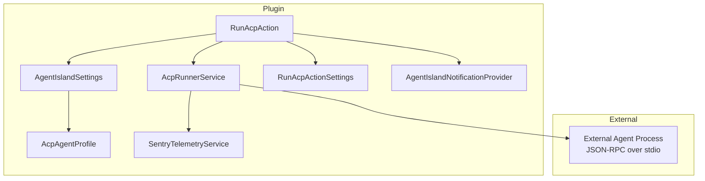
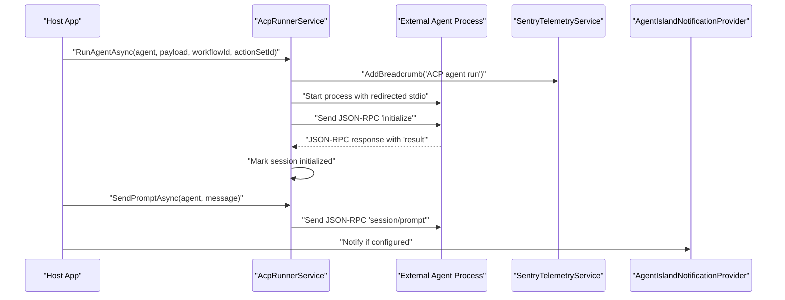
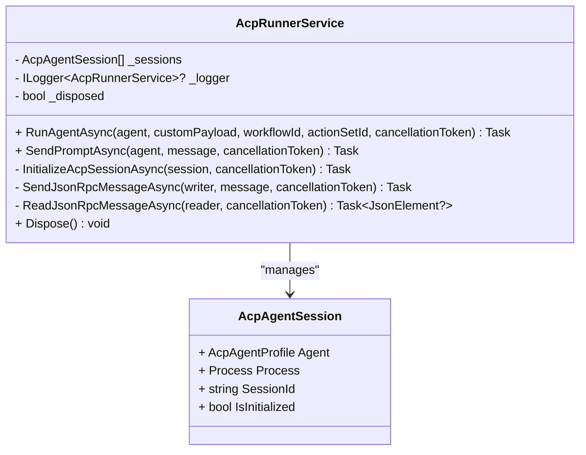
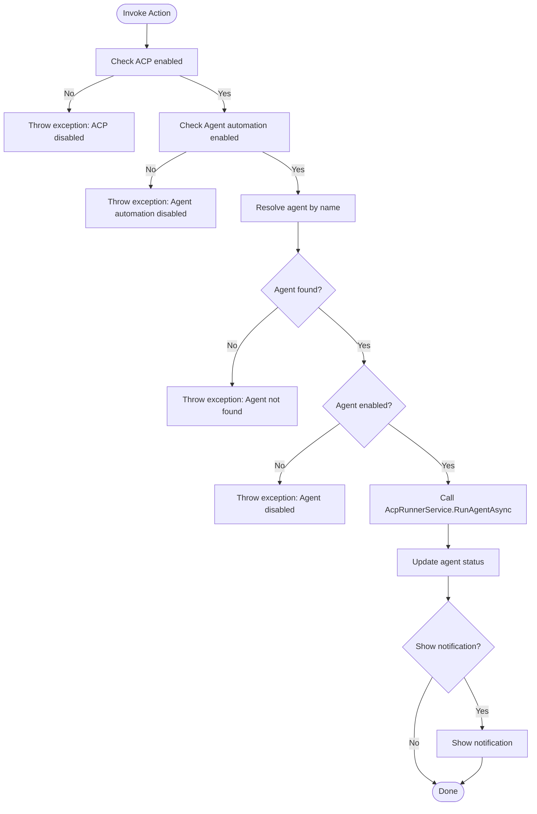
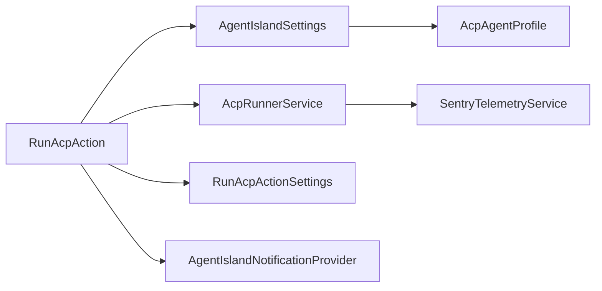

# ACP Agent Integration

<cite>
**Referenced Files in This Document**
- [AcpRunnerService.cs](file://Services/AcpRunnerService.cs)
- [AcpAgentProfile.cs](file://Models/AcpAgentProfile.cs)
- [RunAcpAction.cs](file://Automation/RunAcpAction.cs)
- [RunAcpActionSettings.cs](file://Models/RunAcpActionSettings.cs)
- [AgentIslandSettings.cs](file://Models/AgentIslandSettings.cs)
- [SentryTelemetryService.cs](file://Services/SentryTelemetryService.cs)
- [AgentIslandNotificationProvider.cs](file://Mcp/Tools/AgentIslandNotificationProvider.cs)
- [AcpSettingsPage.axaml.cs](file://Views/SettingsPages/AcpSettingsPage.axaml.cs)
- [RunAcpActionSettingsControl.axaml.cs](file://Views/ActionSettings/RunAcpActionSettingsControl.axaml.cs)
</cite>

## Table of Contents
1. [Introduction](#introduction)
2. [Project Structure](#project-structure)
3. [Core Components](#core-components)
4. [Architecture Overview](#architecture-overview)
5. [Detailed Component Analysis](#detailed-component-analysis)
6. [Dependency Analysis](#dependency-analysis)
7. [Performance Considerations](#performance-considerations)
8. [Troubleshooting Guide](#troubleshooting-guide)
9. [Conclusion](#conclusion)
10. [Appendices](#appendices)

## Introduction
This document explains the Agent Client Protocol (ACP) integration implemented in this project. It covers:
- ACP fundamentals as used here: a JSON-RPC over stdio protocol for communicating with external AI agents.
- Process management for launching and controlling external agent processes.
- Session handling mechanisms to initialize and maintain communication channels.
- The AcpRunnerService architecture, including lifecycle, I/O, and message passing.
- The AcpAgentProfile model for defining agent configurations.
- The RunAcpAction implementation that integrates ACP into ClassIsland automation workflows.
- Guidance on creating custom ACP agents, connection states, error recovery, performance optimization, and security considerations.

## Project Structure
The ACP integration spans services, models, automation actions, telemetry, notifications, and UI settings pages. Key areas:
- Services: AcpRunnerService orchestrates process lifecycle and JSON-RPC communication.
- Models: AcpAgentProfile defines agent configuration; RunAcpActionSettings configures automation actions; AgentIslandSettings holds global toggles and agent lists.
- Automation: RunAcpAction triggers agent execution from ClassIsland workflows.
- Telemetry and Notifications: SentryTelemetryService logs breadcrumbs; AgentIslandNotificationProvider shows user notifications.
- UI: Settings pages allow adding/removing agents and configuring automation action parameters.

**Diagram sources**
- [AcpRunnerService.cs:14-206](file://Services/AcpRunnerService.cs#L14-L206)
- [RunAcpAction.cs:16-83](file://Automation/RunAcpAction.cs#L16-L83)
- [RunAcpActionSettings.cs:9-35](file://Models/RunAcpActionSettings.cs#L9-L35)
- [AcpAgentProfile.cs:9-43](file://Models/AcpAgentProfile.cs#L9-L43)
- [AgentIslandSettings.cs:13-143](file://Models/AgentIslandSettings.cs#L13-L143)
- [SentryTelemetryService.cs:11-182](file://Services/SentryTelemetryService.cs#L11-L182)
- [AgentIslandNotificationProvider.cs:12-51](file://Mcp/Tools/AgentIslandNotificationProvider.cs#L12-L51)

**Section sources**
- [AcpRunnerService.cs:14-206](file://Services/AcpRunnerService.cs#L14-L206)
- [RunAcpAction.cs:16-83](file://Automation/RunAcpAction.cs#L16-L83)
- [RunAcpActionSettings.cs:9-35](file://Models/RunAcpActionSettings.cs#L9-L35)
- [AcpAgentProfile.cs:9-43](file://Models/AcpAgentProfile.cs#L9-L43)
- [AgentIslandSettings.cs:13-143](file://Models/AgentIslandSettings.cs#L13-L143)
- [SentryTelemetryService.cs:11-182](file://Services/SentryTelemetryService.cs#L11-L182)
- [AgentIslandNotificationProvider.cs:12-51](file://Mcp/Tools/AgentIslandNotificationProvider.cs#L12-L51)

## Core Components
- AcpRunnerService: Manages external agent processes, initializes sessions via JSON-RPC, and sends prompts.
- AcpAgentProfile: Represents an agent’s name, command line, enabled state, and status.
- RunAcpAction: ClassIsland automation action that validates settings and invokes AcpRunnerService.
- RunAcpActionSettings: Parameters for the automation action (agent selection, notification toggle, custom payload).
- AgentIslandSettings: Global plugin settings including ACP feature flags and agent list.
- SentryTelemetryService: Adds breadcrumbs and captures exceptions for observability.
- AgentIslandNotificationProvider: Displays user notifications when automation runs.

**Section sources**
- [AcpRunnerService.cs:14-206](file://Services/AcpRunnerService.cs#L14-L206)
- [AcpAgentProfile.cs:9-43](file://Models/AcpAgentProfile.cs#L9-L43)
- [RunAcpAction.cs:16-83](file://Automation/RunAcpAction.cs#L16-L83)
- [RunAcpActionSettings.cs:9-35](file://Models/RunAcpActionSettings.cs#L9-L35)
- [AgentIslandSettings.cs:13-143](file://Models/AgentIslandSettings.cs#L13-L143)
- [SentryTelemetryService.cs:11-182](file://Services/SentryTelemetryService.cs#L11-L182)
- [AgentIslandNotificationProvider.cs:12-51](file://Mcp/Tools/AgentIslandNotificationProvider.cs#L12-L51)

## Architecture Overview
ACP is implemented as a JSON-RPC over stdio protocol between the host application and external agent processes. The host launches the agent process, performs an initialization handshake, and then exchanges messages through standard input/output streams.

**Diagram sources**
- [AcpRunnerService.cs:25-131](file://Services/AcpRunnerService.cs#L25-L131)
- [SentryTelemetryService.cs:114-122](file://Services/SentryTelemetryService.cs#L114-L122)
- [AgentIslandNotificationProvider.cs:27-50](file://Mcp/Tools/AgentIslandNotificationProvider.cs#L27-L50)

## Detailed Component Analysis

### AcpRunnerService
Responsibilities:
- Launch external agent processes using a configurable command string.
- Maintain per-agent sessions with unique identifiers and initialization state.
- Perform JSON-RPC initialization handshake and send prompt requests.
- Manage graceful shutdown by closing stdin, waiting for exit, and killing if necessary.

Key behaviors:
- Command parsing splits the first token as executable and the remainder as arguments.
- Initialization sends a JSON-RPC request with method “initialize” and expects a response containing a “result”.
- Prompt sending uses method “session/prompt” with a generated sessionId.
- Disposal ensures all sessions are closed and processes disposed.

**Diagram sources**
- [AcpRunnerService.cs:14-206](file://Services/AcpRunnerService.cs#L14-L206)

**Section sources**
- [AcpRunnerService.cs:25-131](file://Services/AcpRunnerService.cs#L25-L131)
- [AcpRunnerService.cs:156-191](file://Services/AcpRunnerService.cs#L156-L191)
- [AcpRunnerService.cs:193-205](file://Services/AcpRunnerService.cs#L193-L205)

### AcpAgentProfile
Defines the configuration for each external agent:
- Name: Display name for the agent.
- Command: Executable path and arguments used to start the agent process.
- IsEnabled: Toggle to enable or disable the agent.
- Status: Human-readable status string updated by the system.

This model is observable and serializable for persistence and UI binding.

**Section sources**
- [AcpAgentProfile.cs:9-43](file://Models/AcpAgentProfile.cs#L9-L43)

### RunAcpAction
ClassIsland automation action that:
- Validates global ACP and agent automation toggles.
- Resolves the target agent by name from settings.
- Ensures the agent is enabled.
- Invokes AcpRunnerService.RunAgentAsync with selected agent and optional custom payload.
- Updates agent status and optionally shows a notification.

**Diagram sources**
- [RunAcpAction.cs:29-82](file://Automation/RunAcpAction.cs#L29-L82)

**Section sources**
- [RunAcpAction.cs:29-82](file://Automation/RunAcpAction.cs#L29-L82)

### RunAcpActionSettings
Parameters for the automation action:
- AgentName: Target agent name to run.
- ShowNotification: Whether to show a notification after running.
- CustomPayload: Optional payload passed to the runner (not currently forwarded to the agent in the current implementation).

**Section sources**
- [RunAcpActionSettings.cs:9-35](file://Models/RunAcpActionSettings.cs#L9-L35)

### AgentIslandSettings
Global settings relevant to ACP:
- IsAcpEnabled: Master switch for ACP features.
- IsAgentAutomationEnabled: Switch for agent-based automation.
- AcpAgents: Collection of AcpAgentProfile entries.
- Derived properties like TotalAgentCount, EnabledAgentCount, HasAcpAgents, and summary text.

UI bindings update derived properties when collections change.

**Section sources**
- [AgentIslandSettings.cs:13-143](file://Models/AgentIslandSettings.cs#L13-L143)
- [AgentIslandSettings.cs:213-238](file://Models/AgentIslandSettings.cs#L213-L238)

### SentryTelemetryService
Provides telemetry capabilities:
- Adds breadcrumbs for ACP events such as agent run and prompt sent.
- Captures exceptions and wraps operations with instrumentation.

**Section sources**
- [SentryTelemetryService.cs:114-122](file://Services/SentryTelemetryService.cs#L114-L122)
- [SentryTelemetryService.cs:127-174](file://Services/SentryTelemetryService.cs#L127-L174)

### AgentIslandNotificationProvider
Displays user notifications:
- Used by RunAcpAction to notify when an ACP agent has been run.

**Section sources**
- [AgentIslandNotificationProvider.cs:27-50](file://Mcp/Tools/AgentIslandNotificationProvider.cs#L27-L50)

### UI Integration
- AcpSettingsPage: Provides UI to add/remove agents and bulk enable/disable them.
- RunAcpActionSettingsControl: Presents available agent names and defaults selection.

**Section sources**
- [AcpSettingsPage.axaml.cs:31-64](file://Views/SettingsPages/AcpSettingsPage.axaml.cs#L31-L64)
- [RunAcpActionSettingsControl.axaml.cs:15-35](file://Views/ActionSettings/RunAcpActionSettingsControl.axaml.cs#L15-L35)

## Dependency Analysis
High-level dependencies among components:
- RunAcpAction depends on AgentIslandSettings, AcpRunnerService, and optionally notifications.
- AcpRunnerService depends on System.Diagnostics.Process, System.Text.Json, logging, and telemetry.
- AcpAgentProfile is consumed by AgentIslandSettings and UI controls.
- SentryTelemetryService is used for breadcrumbs and exception capture.
- Notification provider is used conditionally based on settings.

**Diagram sources**
- [RunAcpAction.cs:16-83](file://Automation/RunAcpAction.cs#L16-L83)
- [AcpRunnerService.cs:14-206](file://Services/AcpRunnerService.cs#L14-L206)
- [AgentIslandSettings.cs:13-143](file://Models/AgentIslandSettings.cs#L13-L143)
- [SentryTelemetryService.cs:11-182](file://Services/SentryTelemetryService.cs#L11-L182)
- [AgentIslandNotificationProvider.cs:12-51](file://Mcp/Tools/AgentIslandNotificationProvider.cs#L12-L51)

**Section sources**
- [RunAcpAction.cs:16-83](file://Automation/RunAcpAction.cs#L16-L83)
- [AcpRunnerService.cs:14-206](file://Services/AcpRunnerService.cs#L14-L206)
- [AgentIslandSettings.cs:13-143](file://Models/AgentIslandSettings.cs#L13-L143)

## Performance Considerations
- Process startup cost: Each RunAgentAsync call starts a new process. For frequent invocations, consider reusing long-lived agent processes and managing multiple sessions within a single process where supported by the agent.
- I/O throughput: JSON-RPC messages are serialized and flushed per line. Batched or buffered writes could reduce overhead if the agent supports it.
- Concurrency: Multiple concurrent prompts may require careful ordering and idempotent request IDs to avoid race conditions.
- Resource cleanup: Ensure timely disposal of processes and streams to prevent resource leaks.

[No sources needed since this section provides general guidance]

## Troubleshooting Guide
Common issues and resolutions:
- ACP feature disabled: If global ACP or agent automation toggles are off, the action will throw an exception. Enable both toggles in settings.
- Agent not found: Ensure the agent name matches exactly one entry in the AcpAgents collection.
- Agent disabled: The agent must be enabled before running.
- Uninitialized session: Sending prompts requires a successful initialization handshake. Verify the agent responds to the “initialize” method.
- Process termination: On disposal, the service closes stdin, waits briefly, and kills the process if still alive. If the agent hangs, check its shutdown behavior.

Operational checks:
- Validate the command string contains a valid executable and arguments.
- Confirm the agent implements the expected JSON-RPC methods and responds with a “result” field during initialization.
- Use telemetry breadcrumbs to trace agent run and prompt events.

**Section sources**
- [RunAcpAction.cs:35-60](file://Automation/RunAcpAction.cs#L35-L60)
- [AcpRunnerService.cs:37-40](file://Services/AcpRunnerService.cs#L37-L40)
- [AcpRunnerService.cs:112-116](file://Services/AcpRunnerService.cs#L112-L116)
- [AcpRunnerService.cs:156-191](file://Services/AcpRunnerService.cs#L156-L191)

## Conclusion
The ACP integration provides a robust foundation for launching and communicating with external AI agents using a JSON-RPC over stdio protocol. AcpRunnerService encapsulates process lifecycle and session management, while RunAcpAction integrates ACP into ClassIsland automation workflows. The design emphasizes clear separation of concerns, observability via telemetry, and user feedback through notifications. Future enhancements can include richer environment variable support, improved error recovery, and advanced session multiplexing.

[No sources needed since this section summarizes without analyzing specific files]

## Appendices

### ACP Protocol Fundamentals (as implemented)
- Transport: Standard input/output streams.
- Message format: JSON-RPC 2.0 messages, one per line.
- Methods:
  - initialize: Handshake with client capabilities and protocol version.
  - session/prompt: Sends a prompt with a generated sessionId.
- Responses: Expected to include a “result” field for successful initialization.

**Section sources**
- [AcpRunnerService.cs:79-100](file://Services/AcpRunnerService.cs#L79-L100)
- [AcpRunnerService.cs:118-131](file://Services/AcpRunnerService.cs#L118-L131)

### Creating a Custom ACP Agent
Steps:
- Implement a process that reads JSON-RPC messages from stdin and writes responses to stdout.
- Support the “initialize” method and respond with a “result” object.
- Support the “session/prompt” method and handle the provided sessionId and message.
- Ensure proper shutdown behavior when stdin is closed.

Best practices:
- Parse messages safely and validate fields.
- Generate unique request IDs and correlate responses.
- Handle errors gracefully and return appropriate JSON-RPC error objects.

[No sources needed since this section provides general guidance]

### Handling Connection States
- Track initialization status per session.
- Avoid sending prompts until initialization succeeds.
- On process exit, mark sessions as terminated and clean up resources.

**Section sources**
- [AcpRunnerService.cs:96-99](file://Services/AcpRunnerService.cs#L96-L99)
- [AcpRunnerService.cs:112-116](file://Services/AcpRunnerService.cs#L112-L116)

### Error Recovery
- Validate inputs early and throw descriptive exceptions.
- Log breadcrumbs for key events.
- On disposal, attempt graceful shutdown and force kill if necessary.

**Section sources**
- [AcpRunnerService.cs:35-40](file://Services/AcpRunnerService.cs#L35-L40)
- [AcpRunnerService.cs:156-191](file://Services/AcpRunnerService.cs#L156-L191)

### Security Considerations
- Command validation: Only execute trusted commands and paths.
- Environment isolation: Consider running agents in restricted environments or containers.
- Input sanitization: Treat custom payloads and prompts as untrusted data.
- Least privilege: Run agent processes with minimal permissions.
- Inter-process communication: Use stdio securely; avoid exposing sensitive data in logs.

[No sources needed since this section provides general guidance]