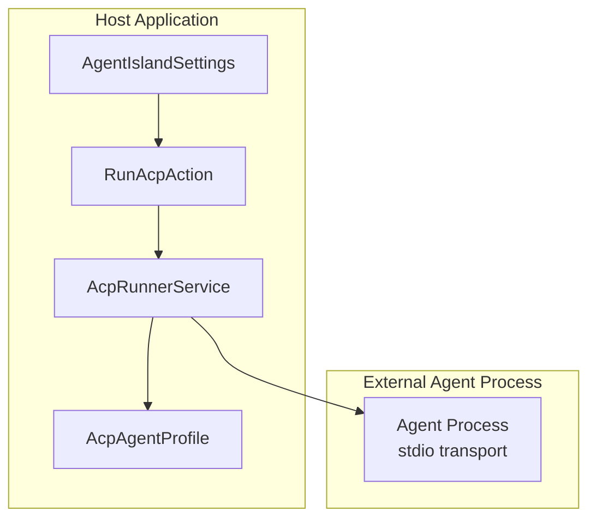
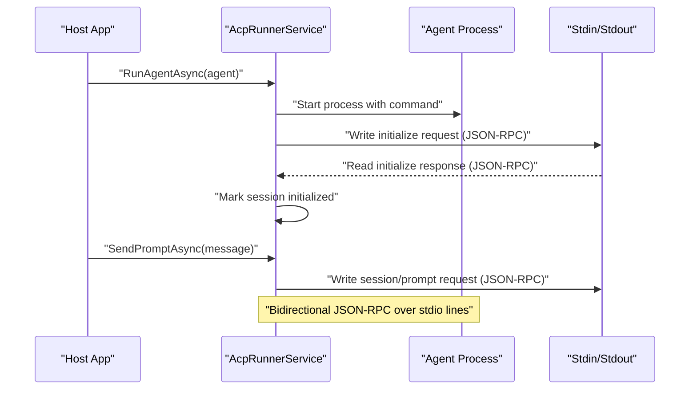
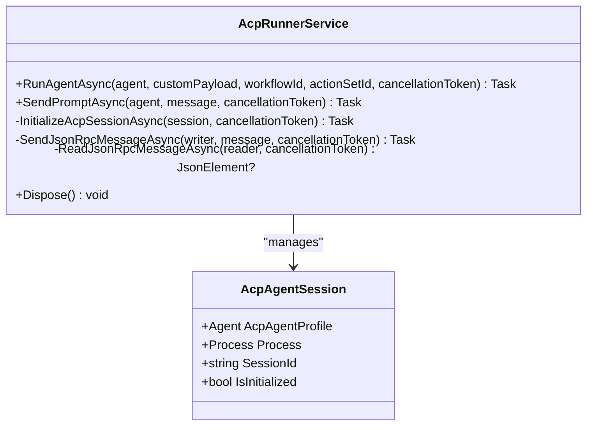
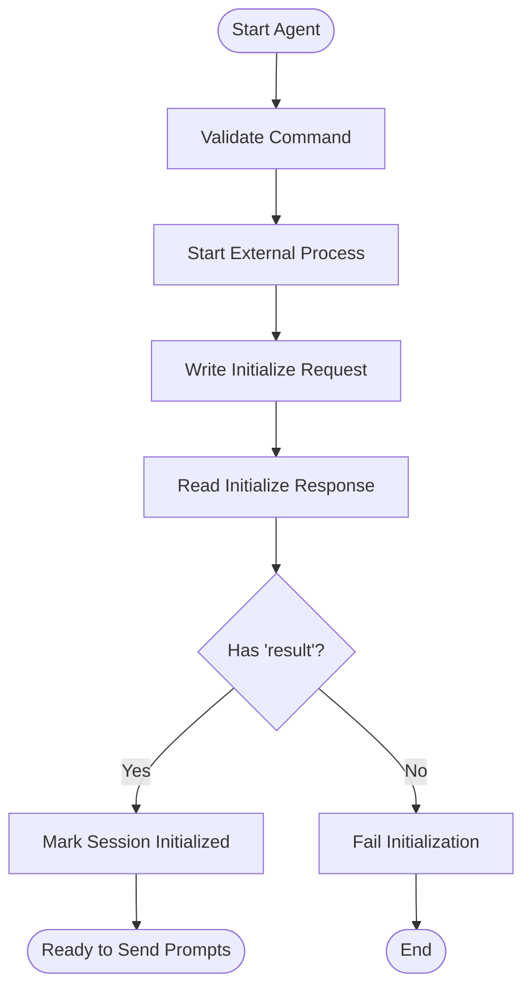
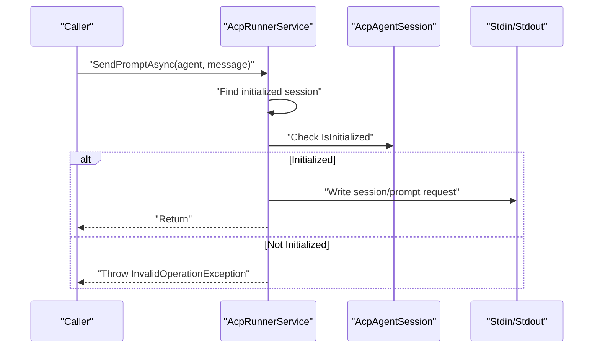
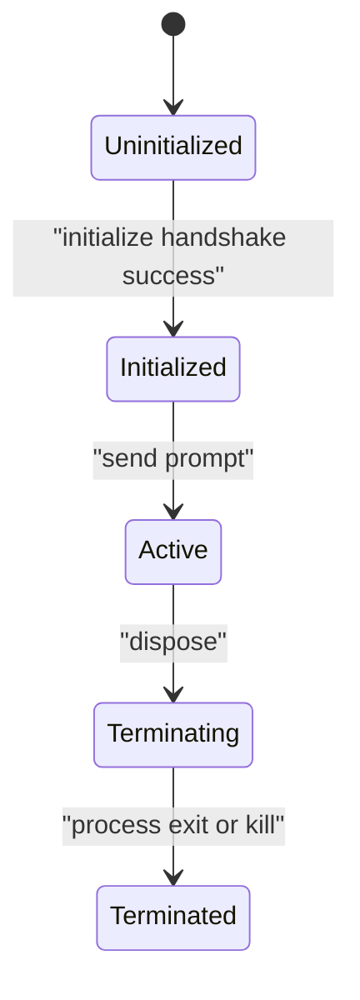
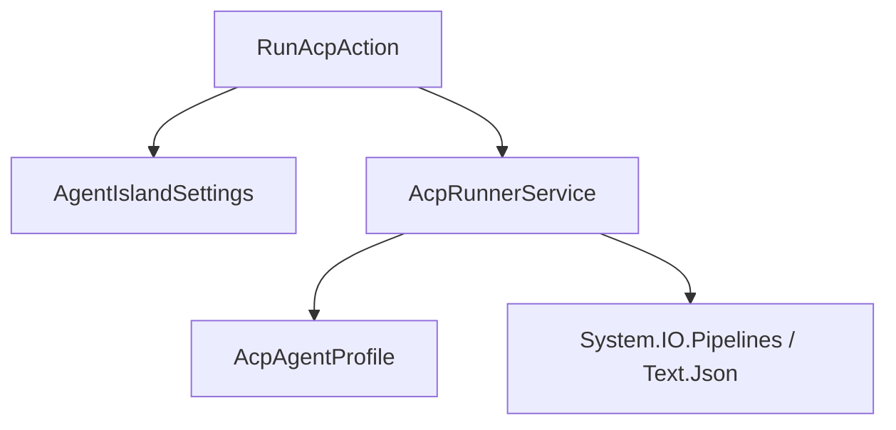

# ACP Protocol Fundamentals

<cite>
**Referenced Files in This Document**
- [AcpRunnerService.cs](file://Services/AcpRunnerService.cs)
- [AcpAgentProfile.cs](file://Models/AcpAgentProfile.cs)
- [RunAcpAction.cs](file://Automation/RunAcpAction.cs)
- [RunAcpActionSettings.cs](file://Models/RunAcpActionSettings.cs)
- [AgentIslandSettings.cs](file://Models/AgentIslandSettings.cs)
- [AGENTS.md](file://AGENTS.md)
- [README.md](file://README.md)
</cite>

## Table of Contents
1. Introduction
2. Project Structure
3. Core Components
4. Architecture Overview
5. Detailed Component Analysis
6. Dependency Analysis
7. Performance Considerations
8. Troubleshooting Guide
9. Conclusion

## Introduction
This document explains the Agent Client Protocol (ACP) fundamentals as implemented in this project. It focuses on:
- The JSON-RPC message format used for inter-process communication with external AI agents
- The initialize handshake and session management
- Prompt handling mechanisms
- Protocol versioning and client capabilities negotiation
- Error response formats and validation considerations
- Connection lifecycle states and compliance requirements
- Security considerations for local process-based communication

The implementation uses a stdio transport between the host application and an external agent process, exchanging JSON-RPC 2.0 messages over standard input/output streams.

## Project Structure
The ACP integration is primarily implemented in the following areas:
- Services layer: ACP runner and session management
- Models: Agent profile and settings
- Automation: Action that triggers agent execution
- Documentation and configuration references

**Diagram sources**
- [AcpRunnerService.cs:14-31](file://Services/AcpRunnerService.cs#L14-L31)
- [RunAcpAction.cs:16-27](file://Automation/RunAcpAction.cs#L16-L27)
- [AgentIslandSettings.cs:13-32](file://Models/AgentIslandSettings.cs#L13-L32)
- [AcpAgentProfile.cs:9-14](file://Models/AcpAgentProfile.cs#L9-L14)

**Section sources**
- [AcpRunnerService.cs:14-31](file://Services/AcpRunnerService.cs#L14-L31)
- [RunAcpAction.cs:16-27](file://Automation/RunAcpAction.cs#L16-L27)
- [AgentIslandSettings.cs:13-32](file://Models/AgentIslandSettings.cs#L13-L32)
- [AcpAgentProfile.cs:9-14](file://Models/AcpAgentProfile.cs#L9-L14)

## Core Components
- AcpRunnerService: Orchestrates launching the external agent process, performs the initialize handshake, manages sessions, and sends prompts via JSON-RPC over stdio.
- AcpAgentProfile: Represents an agent’s configuration (name, command, enabled state, status).
- RunAcpAction: Automation action that validates settings and invokes the runner to start an agent.
- RunAcpActionSettings: Settings for the automation action (agent name, notifications, custom payload).
- AgentIslandSettings: Global plugin settings including toggles for ACP features and agent automation.

Key responsibilities:
- Process lifecycle management (start, graceful shutdown, kill fallback)
- JSON-RPC serialization/deserialization over line-delimited stdio
- Session tracking per agent process
- Initialization handshake and prompt dispatch

**Section sources**
- [AcpRunnerService.cs:14-31](file://Services/AcpRunnerService.cs#L14-L31)
- [AcpAgentProfile.cs:9-14](file://Models/AcpAgentProfile.cs#L9-L14)
- [RunAcpAction.cs:16-27](file://Automation/RunAcpAction.cs#L16-L27)
- [RunAcpActionSettings.cs:9-14](file://Models/RunAcpActionSettings.cs#L9-L14)
- [AgentIslandSettings.cs:13-32](file://Models/AgentIslandSettings.cs#L13-L32)

## Architecture Overview
The ACP client runs inside the host application and communicates with an external agent process using JSON-RPC 2.0 over stdio. The flow includes:
- Launching the agent process with configured command and arguments
- Performing an initialize handshake
- Managing a per-process session
- Sending prompts to the agent

**Diagram sources**
- [AcpRunnerService.cs:25-77](file://Services/AcpRunnerService.cs#L25-L77)
- [AcpRunnerService.cs:79-100](file://Services/AcpRunnerService.cs#L79-L100)
- [AcpRunnerService.cs:102-131](file://Services/AcpRunnerService.cs#L102-L131)

## Detailed Component Analysis

### ACP Runner Service
Responsibilities:
- Start the external agent process with provided command and arguments
- Perform initialize handshake using JSON-RPC method "initialize"
- Maintain a list of active sessions keyed by agent profile
- Send prompts using JSON-RPC method "session/prompt"
- Handle graceful shutdown and forced termination if needed

Protocol details observed:
- Transport: stdio (line-delimited JSON)
- Message format: JSON-RPC 2.0
- Initialize request fields:
  - jsonrpc: "2.0"
  - id: integer
  - method: "initialize"
  - params.protocolVersion: integer (value 1)
  - params.clientCapabilities: object (empty)
- Prompt request fields:
  - jsonrpc: "2.0"
  - id: integer
  - method: "session/prompt"
  - params.sessionId: string (UUID generated per session)
  - params.message: string

Session management:
- Each agent process gets a unique sessionId
- IsInitialized flag set after successful initialize handshake
- Sessions are tracked in an internal list

Error handling:
- Throws InvalidOperationException when agent not configured or not initialized
- Logs errors during shutdown and attempts graceful close before kill

**Diagram sources**
- [AcpRunnerService.cs:14-31](file://Services/AcpRunnerService.cs#L14-L31)
- [AcpRunnerService.cs:79-100](file://Services/AcpRunnerService.cs#L79-L100)
- [AcpRunnerService.cs:102-131](file://Services/AcpRunnerService.cs#L102-L131)
- [AcpRunnerService.cs:193-205](file://Services/AcpRunnerService.cs#L193-L205)

**Section sources**
- [AcpRunnerService.cs:25-77](file://Services/AcpRunnerService.cs#L25-L77)
- [AcpRunnerService.cs:79-100](file://Services/AcpRunnerService.cs#L79-L100)
- [AcpRunnerService.cs:102-131](file://Services/AcpRunnerService.cs#L102-L131)
- [AcpRunnerService.cs:133-154](file://Services/AcpRunnerService.cs#L133-L154)
- [AcpRunnerService.cs:156-191](file://Services/AcpRunnerService.cs#L156-L191)
- [AcpRunnerService.cs:193-205](file://Services/AcpRunnerService.cs#L193-L205)

### JSON-RPC Message Format and Examples
Observed message structures:
- Initialize request:
  - Fields: jsonrpc, id, method, params.protocolVersion, params.clientCapabilities
- Initialize response:
  - Expected to contain a result field to mark initialization success
- Prompt request:
  - Fields: jsonrpc, id, method, params.sessionId, params.message

Example descriptions (no code content):
- Initialize request example: A JSON object with jsonrpc set to "2.0", an integer id, method "initialize", and params containing protocolVersion and clientCapabilities.
- Initialize response example: A JSON object with a result field indicating successful initialization.
- Prompt request example: A JSON object with jsonrpc set to "2.0", an integer id, method "session/prompt", and params containing sessionId and message.

Validation notes:
- Messages are serialized using System.Text.Json and written line-by-line to StandardInput
- Responses are read line-by-line from StandardOutput and parsed into JsonElement

**Section sources**
- [AcpRunnerService.cs:79-100](file://Services/AcpRunnerService.cs#L79-L100)
- [AcpRunnerService.cs:102-131](file://Services/AcpRunnerService.cs#L102-L131)
- [AcpRunnerService.cs:133-154](file://Services/AcpRunnerService.cs#L133-L154)

### Initialize Handshake and Session Management
Handshake steps:
- Host writes initialize request to agent’s stdin
- Host reads one line from agent’s stdout and expects a JSON-RPC response with a result field
- On success, marks session as initialized and proceeds to send prompts

Session lifecycle:
- New session created per agent process with a UUID sessionId
- IsInitialized flag controls whether prompts can be sent
- Dispose closes stdin, waits briefly, then kills process if still alive

**Diagram sources**
- [AcpRunnerService.cs:25-77](file://Services/AcpRunnerService.cs#L25-L77)
- [AcpRunnerService.cs:79-100](file://Services/AcpRunnerService.cs#L79-L100)

**Section sources**
- [AcpRunnerService.cs:25-77](file://Services/AcpRunnerService.cs#L25-L77)
- [AcpRunnerService.cs:79-100](file://Services/AcpRunnerService.cs#L79-L100)

### Prompt Handling Mechanism
Prompt sending steps:
- Locate existing initialized session for the agent
- Construct a JSON-RPC request with method "session/prompt" and params containing sessionId and message
- Serialize and write to agent’s stdin

Constraints:
- Throws error if no initialized session exists
- Uses a fixed id value for prompt requests in current implementation

**Diagram sources**
- [AcpRunnerService.cs:102-131](file://Services/AcpRunnerService.cs#L102-L131)

**Section sources**
- [AcpRunnerService.cs:102-131](file://Services/AcpRunnerService.cs#L102-L131)

### Protocol Versioning and Capabilities Negotiation
- The initialize request includes protocolVersion set to 1
- clientCapabilities is present as an empty object
- No explicit capability negotiation logic beyond presence of these fields

Compliance implications:
- Agents should accept protocolVersion 1
- Clients may extend clientCapabilities in future versions; agents should ignore unknown fields

**Section sources**
- [AcpRunnerService.cs:79-100](file://Services/AcpRunnerService.cs#L79-L100)

### Error Response Formats and Validation
Observed behaviors:
- Initialize response expected to include a result field
- Prompt sending throws InvalidOperationException if session not initialized
- Shutdown logs errors and attempts graceful close before kill

Recommendations for robustness:
- Validate incoming JSON structure strictly
- Handle missing or malformed fields gracefully
- Implement timeouts for initialize handshake and prompt responses
- Log detailed diagnostics for failed deserialization

**Section sources**
- [AcpRunnerService.cs:79-100](file://Services/AcpRunnerService.cs#L79-L100)
- [AcpRunnerService.cs:102-131](file://Services/AcpRunnerService.cs#L102-L131)
- [AcpRunnerService.cs:156-191](file://Services/AcpRunnerService.cs#L156-L191)

### Connection Lifecycle States
States:
- Uninitialized: Before handshake completes
- Initialized: After successful initialize handshake
- Active: During prompt exchanges
- Terminating: During disposal
- Terminated: After process exit or kill

Transitions:
- Uninitialized -> Initialized: Successful initialize handshake
- Initialized -> Active: Prompt sent successfully
- Active -> Terminating: Dispose called
- Terminating -> Terminated: Process exited or killed

[No sources needed since this diagram shows conceptual workflow, not actual code structure]

### Automation Integration
The automation action:
- Validates global ACP and agent automation toggles
- Finds the named agent profile and checks it is enabled
- Invokes the runner to start the agent and updates status
- Optionally shows a notification based on settings

**Section sources**
- [RunAcpAction.cs:29-82](file://Automation/RunAcpAction.cs#L29-L82)
- [RunAcpActionSettings.cs:9-35](file://Models/RunAcpActionSettings.cs#L9-L35)
- [AgentIslandSettings.cs:64-82](file://Models/AgentIslandSettings.cs#L64-L82)

## Dependency Analysis
High-level dependencies:
- RunAcpAction depends on AgentIslandSettings and AcpRunnerService
- AcpRunnerService depends on AcpAgentProfile and system process I/O
- All components rely on System.Text.Json for serialization

**Diagram sources**
- [RunAcpAction.cs:16-27](file://Automation/RunAcpAction.cs#L16-L27)
- [AcpRunnerService.cs:14-31](file://Services/AcpRunnerService.cs#L14-L31)
- [AcpAgentProfile.cs:9-14](file://Models/AcpAgentProfile.cs#L9-L14)

**Section sources**
- [RunAcpAction.cs:16-27](file://Automation/RunAcpAction.cs#L16-L27)
- [AcpRunnerService.cs:14-31](file://Services/AcpRunnerService.cs#L14-L31)
- [AcpAgentProfile.cs:9-14](file://Models/AcpAgentProfile.cs#L9-L14)

## Performance Considerations
- Use buffered I/O where possible to reduce flush overhead
- Avoid unnecessary allocations in hot paths (e.g., reuse JSON serializers)
- Implement timeouts to prevent blocking on slow or unresponsive agents
- Monitor process resource usage and enforce limits

[No sources needed since this section provides general guidance]

## Troubleshooting Guide
Common issues and resolutions:
- Agent not configured: Ensure command is set in agent profile
- Feature disabled: Check global ACP and agent automation toggles
- Agent not found or disabled: Verify agent name and enabled state
- Initialization failure: Confirm agent responds with a JSON-RPC result field
- Prompt errors: Ensure session is initialized before sending prompts
- Shutdown hangs: Investigate process cleanup and consider shorter wait times

Operational tips:
- Enable logging to capture handshake and prompt events
- Validate agent process exits cleanly on stdin close
- Inspect stdio traffic for malformed JSON messages

**Section sources**
- [RunAcpAction.cs:35-60](file://Automation/RunAcpAction.cs#L35-L60)
- [AcpRunnerService.cs:35-48](file://Services/AcpRunnerService.cs#L35-L48)
- [AcpRunnerService.cs:102-131](file://Services/AcpRunnerService.cs#L102-L131)
- [AcpRunnerService.cs:156-191](file://Services/AcpRunnerService.cs#L156-L191)

## Conclusion
This project implements a minimal but functional ACP client using JSON-RPC 2.0 over stdio. It supports process lifecycle management, an initialize handshake, and prompt dispatch. While the UI indicates ACP features are pending, the core service provides a solid foundation for extending protocol support, adding robust error handling, timeouts, and richer capability negotiation.

[No sources needed since this section summarizes without analyzing specific files]