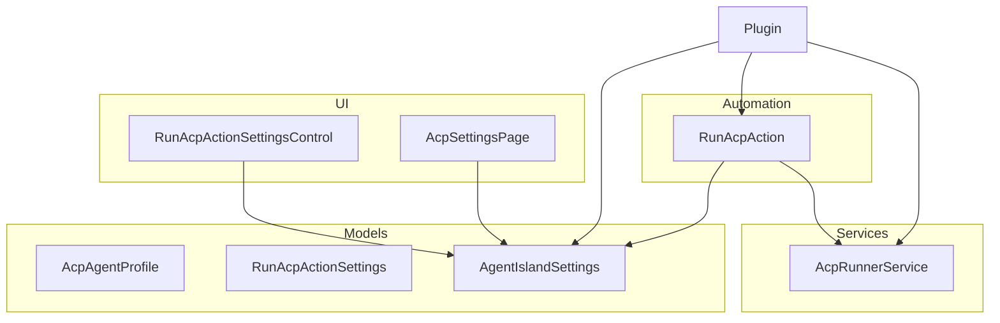
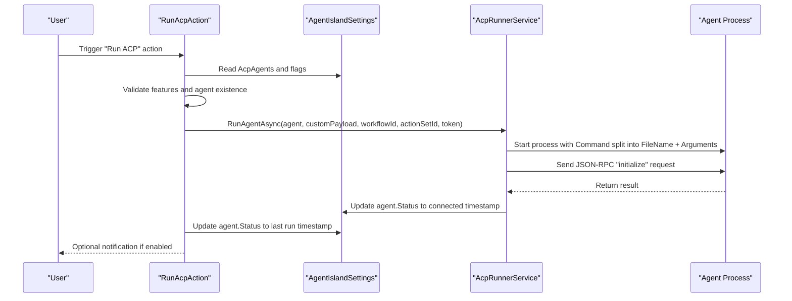
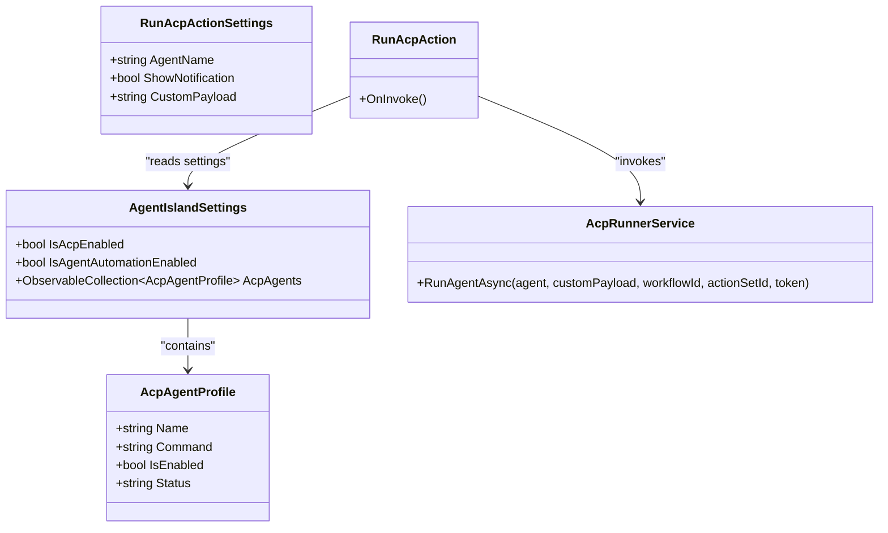
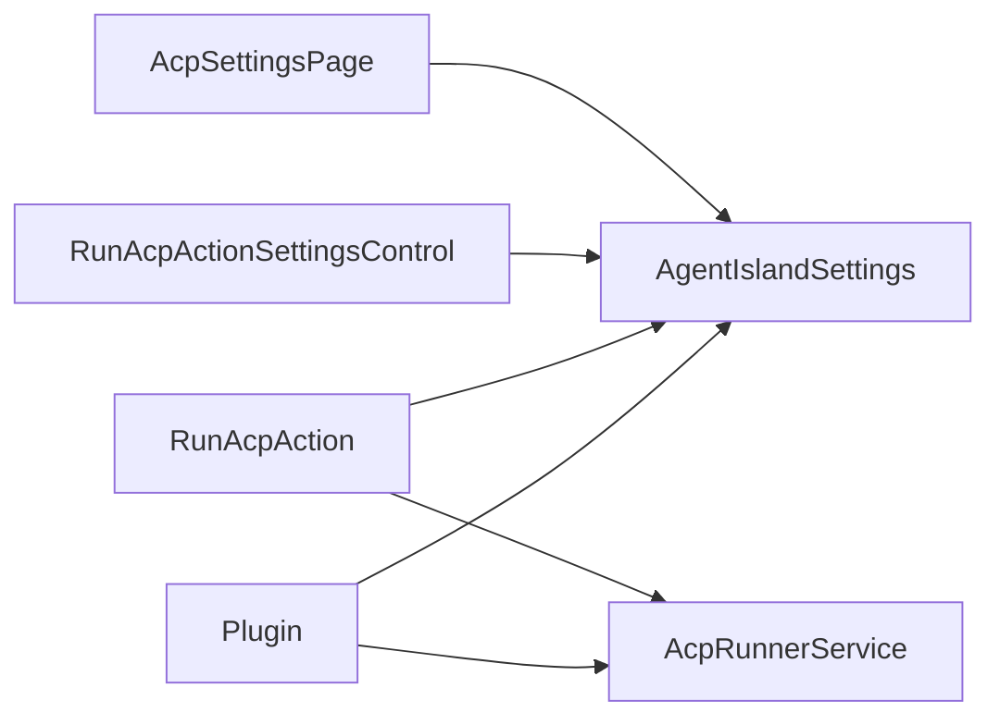

# Agent Profiles and Configuration

<cite>
**Referenced Files in This Document**
- [AcpAgentProfile.cs](file://Models/AcpAgentProfile.cs)
- [RunAcpActionSettings.cs](file://Models/RunAcpActionSettings.cs)
- [RunAcpAction.cs](file://Automation/RunAcpAction.cs)
- [AcpRunnerService.cs](file://Services/AcpRunnerService.cs)
- [AgentIslandSettings.cs](file://Models/AgentIslandSettings.cs)
- [Plugin.cs](file://Plugin.cs)
- [RunAcpActionSettingsControl.axaml.cs](file://Views/ActionSettings/RunAcpActionSettingsControl.axaml.cs)
- [AcpSettingsPage.axaml.cs](file://Views/SettingsPages/AcpSettingsPage.axaml.cs)
</cite>

## Table of Contents
1. [Introduction](#introduction)
2. [Project Structure](#project-structure)
3. [Core Components](#core-components)
4. [Architecture Overview](#architecture-overview)
5. [Detailed Component Analysis](#detailed-component-analysis)
6. [Dependency Analysis](#dependency-analysis)
7. [Performance Considerations](#performance-considerations)
8. [Troubleshooting Guide](#troubleshooting-guide)
9. [Conclusion](#conclusion)
10. [Appendices](#appendices)

## Introduction
This document explains how ACP agent profiles are configured and managed within the project, focusing on:
- The AcpAgentProfile model structure and its fields used for command definitions and status tracking.
- RunAcpActionSettings for ClassIsland automation integration to trigger agents.
- Configuration file format and persistence behavior.
- Validation rules and default values applied at runtime.
- Examples of supported agent types (scripts and executables).
- Environment-specific configuration considerations and dynamic parameter substitution via custom payload.
- Security guidance for sensitive data handling and profile versioning strategies.

## Project Structure
The ACP agent configuration spans models, services, automation actions, and UI settings pages. Key files include:
- Models: AcpAgentProfile, RunAcpActionSettings, AgentIslandSettings
- Automation: RunAcpAction
- Services: AcpRunnerService
- UI: RunAcpActionSettingsControl, AcpSettingsPage
- Plugin bootstrap: Plugin

**Diagram sources**
- [AcpAgentProfile.cs:1-44](file://Models/AcpAgentProfile.cs#L1-L44)
- [RunAcpActionSettings.cs:1-36](file://Models/RunAcpActionSettings.cs#L1-L36)
- [AgentIslandSettings.cs:1-394](file://Models/AgentIslandSettings.cs#L1-L394)
- [RunAcpAction.cs:1-84](file://Automation/RunAcpAction.cs#L1-L84)
- [AcpRunnerService.cs:1-207](file://Services/AcpRunnerService.cs#L1-L207)
- [RunAcpActionSettingsControl.axaml.cs:1-37](file://Views/ActionSettings/RunAcpActionSettingsControl.axaml.cs#L1-L37)
- [AcpSettingsPage.axaml.cs:1-67](file://Views/SettingsPages/AcpSettingsPage.axaml.cs#L1-L67)
- [Plugin.cs:1-114](file://Plugin.cs#L1-L114)

**Section sources**
- [Plugin.cs:29-53](file://Plugin.cs#L29-L53)
- [AgentIslandSettings.cs:126-143](file://Models/AgentIslandSettings.cs#L126-L143)

## Core Components
- AcpAgentProfile: Represents a single ACP agent with name, command, enabled flag, and status.
- RunAcpActionSettings: Parameters for the “Run ACP” action including target agent name, notification preference, and custom payload.
- AgentIslandSettings: Top-level plugin settings that hold the list of ACP agents and feature toggles.
- RunAcpAction: ClassIsland automation action that validates settings and invokes the runner service.
- AcpRunnerService: Starts the agent process, initializes an ACP session over stdio JSON-RPC, and manages lifecycle.

Key responsibilities:
- Configuration storage and persistence via Settings.json.
- Runtime validation and error reporting.
- Process management and JSON-RPC initialization.
- Status updates reflecting last run or connection time.

**Section sources**
- [AcpAgentProfile.cs:1-44](file://Models/AcpAgentProfile.cs#L1-L44)
- [RunAcpActionSettings.cs:1-36](file://Models/RunAcpActionSettings.cs#L1-L36)
- [AgentIslandSettings.cs:1-394](file://Models/AgentIslandSettings.cs#L1-L394)
- [RunAcpAction.cs:1-84](file://Automation/RunAcpAction.cs#L1-L84)
- [AcpRunnerService.cs:1-207](file://Services/AcpRunnerService.cs#L1-L207)

## Architecture Overview
ACP agent execution is orchestrated by a ClassIsland automation action which delegates to a runner service. The runner spawns a child process and performs a JSON-RPC initialize handshake over standard input/output streams.

**Diagram sources**
- [RunAcpAction.cs:29-82](file://Automation/RunAcpAction.cs#L29-L82)
- [AcpRunnerService.cs:25-77](file://Services/AcpRunnerService.cs#L25-L77)
- [AgentIslandSettings.cs:126-143](file://Models/AgentIslandSettings.cs#L126-L143)

## Detailed Component Analysis

### AcpAgentProfile Model
Fields:
- Name: Display name for the agent.
- Command: Executable path plus arguments string.
- IsEnabled: Whether the agent can be started.
- Status: Human-readable status string updated at runtime (e.g., last run or connection time).

JSON serialization uses camelCase property names.

Validation and defaults:
- Default name provided when creating new entries from UI.
- Status initialized to a placeholder value.

Usage:
- Stored in AgentIslandSettings.AcpAgents collection.
- Referenced by automation action to locate and start.

**Section sources**
- [AcpAgentProfile.cs:1-44](file://Models/AcpAgentProfile.cs#L1-L44)
- [AcpSettingsPage.axaml.cs:31-40](file://Views/SettingsPages/AcpSettingsPage.axaml.cs#L31-L40)

### RunAcpActionSettings Model
Fields:
- AgentName: Target agent name to run.
- ShowNotification: Whether to show a system notification after running.
- CustomPayload: Arbitrary string passed to the runner; intended for dynamic parameters.

Behavior:
- Used by the automation action to select an agent and pass optional payload.

**Section sources**
- [RunAcpActionSettings.cs:1-36](file://Models/RunAcpActionSettings.cs#L1-L36)

### AgentIslandSettings
Holds:
- Feature toggles for ACP and agent automation.
- Collection of AcpAgentProfile instances.
- Derived properties for counts and summaries.

Persistence:
- Loaded from and saved to Settings.json automatically on property changes.

**Section sources**
- [AgentIslandSettings.cs:1-394](file://Models/AgentIslandSettings.cs#L1-L394)
- [Plugin.cs:29-35](file://Plugin.cs#L29-L35)

### RunAcpAction (ClassIsland Automation)
Responsibilities:
- Validates global ACP and agent automation flags.
- Locates the named agent and checks it is enabled.
- Invokes AcpRunnerService.RunAgentAsync with custom payload and identifiers.
- Updates agent status to last run time.
- Optionally shows a notification based on settings and action preferences.

Error handling:
- Throws explicit exceptions for disabled features, missing agent, or disabled agent.

**Section sources**
- [RunAcpAction.cs:29-82](file://Automation/RunAcpAction.cs#L29-L82)

### AcpRunnerService
Responsibilities:
- Validates agent.Command and splits into executable and arguments.
- Starts a child process with redirected stdio.
- Performs JSON-RPC initialize handshake.
- Tracks sessions and cleans up processes on disposal.

Status updates:
- Sets agent.Status to a connected timestamp upon successful initialization.

Notes:
- No environment variable expansion or template processing is implemented in this service.
- CustomPayload is accepted but not processed here; it can be consumed by external agents or extended later.

**Section sources**
- [AcpRunnerService.cs:25-77](file://Services/AcpRunnerService.cs#L25-L77)
- [AcpRunnerService.cs:79-100](file://Services/AcpRunnerService.cs#L79-L100)
- [AcpRunnerService.cs:156-191](file://Services/AcpRunnerService.cs#L156-L191)

### UI Integration
- RunAcpActionSettingsControl: Provides available agent names and preselects the first one if none chosen.
- AcpSettingsPage: Adds/removes agents and bulk enables/disables them.

**Section sources**
- [RunAcpActionSettingsControl.axaml.cs:15-35](file://Views/ActionSettings/RunAcpActionSettingsControl.axaml.cs#L15-L35)
- [AcpSettingsPage.axaml.cs:31-64](file://Views/SettingsPages/AcpSettingsPage.axaml.cs#L31-L64)

#### Class Diagram

**Diagram sources**
- [AcpAgentProfile.cs:1-44](file://Models/AcpAgentProfile.cs#L1-L44)
- [RunAcpActionSettings.cs:1-36](file://Models/RunAcpActionSettings.cs#L1-L36)
- [AgentIslandSettings.cs:1-394](file://Models/AgentIslandSettings.cs#L1-L394)
- [RunAcpAction.cs:1-84](file://Automation/RunAcpAction.cs#L1-L84)
- [AcpRunnerService.cs:1-207](file://Services/AcpRunnerService.cs#L1-L207)

## Dependency Analysis
- Plugin bootstraps settings persistence and registers services and UI components.
- RunAcpAction depends on AgentIslandSettings and AcpRunnerService.
- AcpRunnerService depends on System.Diagnostics.Process and performs JSON-RPC over stdio.
- UI controls depend on AgentIslandSettings for live data binding.

**Diagram sources**
- [Plugin.cs:29-53](file://Plugin.cs#L29-L53)
- [RunAcpAction.cs:1-84](file://Automation/RunAcpAction.cs#L1-L84)
- [AcpRunnerService.cs:1-207](file://Services/AcpRunnerService.cs#L1-L207)
- [RunAcpActionSettingsControl.axaml.cs:1-37](file://Views/ActionSettings/RunAcpActionSettingsControl.axaml.cs#L1-L37)
- [AcpSettingsPage.axaml.cs:1-67](file://Views/SettingsPages/AcpSettingsPage.axaml.cs#L1-L67)

**Section sources**
- [Plugin.cs:29-53](file://Plugin.cs#L29-L53)

## Performance Considerations
- Process startup latency dominates agent invocation time; prefer compiled executables for frequent triggers.
- Avoid excessive logging in hot paths; use structured logs where possible.
- Reuse existing sessions if future extensions add long-lived connections; current implementation starts a new process per run.

[No sources needed since this section provides general guidance]

## Troubleshooting Guide
Common issues and resolutions:
- ACP feature disabled: Ensure IsAcpEnabled is true in settings.
- Agent automation disabled: Ensure IsAgentAutomationEnabled is true.
- Missing agent: Verify AgentName matches an existing AcpAgentProfile.Name exactly.
- Disabled agent: Set IsEnabled to true for the target agent.
- Invalid command: Provide a valid executable path and arguments in Command.
- Initialization failure: Check that the agent responds to JSON-RPC initialize over stdio.

Operational notes:
- Status field reflects last run or connection timestamps; inspect it to confirm recent activity.
- Notifications can be suppressed by toggling ShowAutomationNotifications globally or ShowNotification per action.

**Section sources**
- [RunAcpAction.cs:35-60](file://Automation/RunAcpAction.cs#L35-L60)
- [AcpRunnerService.cs:37-48](file://Services/AcpRunnerService.cs#L37-L48)
- [AcpRunnerService.cs:79-100](file://Services/AcpRunnerService.cs#L79-L100)

## Conclusion
ACP agent profiles are defined through simple, serializable models and managed via a centralized settings object. Automation integrates cleanly with ClassIsland actions, while the runner service handles process lifecycle and basic JSON-RPC initialization. For advanced scenarios such as dynamic parameter substitution, environment-specific configurations, and security-sensitive data, extend the runner or action layer accordingly and adopt robust validation and secrets management practices.

[No sources needed since this section summarizes without analyzing specific files]

## Appendices

### Configuration File Format and Persistence
- File: Settings.json located under the plugin’s configuration folder.
- Persistence: Automatically loaded on plugin initialization and saved whenever settings change.
- Top-level keys include feature toggles and the acpAgents array. Each agent entry includes name, command, isEnabled, and status.

Example shape (descriptive):
- isAcpEnabled: boolean
- isAgentAutomationEnabled: boolean
- acpAgents: array of objects with fields name, command, isEnabled, status

**Section sources**
- [Plugin.cs:29-35](file://Plugin.cs#L29-L35)
- [AgentIslandSettings.cs:126-143](file://Models/AgentIslandSettings.cs#L126-L143)
- [AcpAgentProfile.cs:1-44](file://Models/AcpAgentProfile.cs#L1-L44)

### Validation Rules and Defaults
- Global flags:
  - isAcpEnabled must be true to allow agent runs.
  - isAgentAutomationEnabled must be true to allow automation-triggered runs.
- Agent-level:
  - Name must match exactly when referenced by automation.
  - IsEnabled must be true to start.
  - Command must be non-empty and contain at least an executable path.
- Status:
  - Updated to a connected timestamp after successful initialization.
  - Updated to a last run timestamp after a successful run.

**Section sources**
- [RunAcpAction.cs:35-60](file://Automation/RunAcpAction.cs#L35-L60)
- [AcpRunnerService.cs:37-48](file://Services/AcpRunnerService.cs#L37-L48)
- [AcpRunnerService.cs:74-77](file://Services/AcpRunnerService.cs#L74-L77)
- [RunAcpAction.cs:71-72](file://Automation/RunAcpAction.cs#L71-L72)

### Supported Agent Types and Command Examples
- Python script:
  - Command example: python -u "C:\path\to\script.py" --arg value
- Node.js application:
  - Command example: node "C:\path\to\app.js" --port 3000
- Compiled executable:
  - Command example: "C:\path\to\agent.exe" --config "C:\path\to\config.json"

Note: The runner splits the first token as the executable and treats the remainder as arguments.

**Section sources**
- [AcpRunnerService.cs:44-51](file://Services/AcpRunnerService.cs#L44-L51)

### Dynamic Parameter Substitution
- CustomPayload is accepted by the automation action and forwarded to the runner.
- Current implementation does not perform any substitution; it is passed as-is.
- Recommended approach:
  - Use CustomPayload to pass structured strings or JSON payloads.
  - Implement parsing and templating in the agent itself or extend the runner to support environment-based substitution before invoking the process.

**Section sources**
- [RunAcpAction.cs:64-69](file://Automation/RunAcpAction.cs#L64-L69)
- [AcpRunnerService.cs:25-31](file://Services/AcpRunnerService.cs#L25-L31)

### Environment-Specific Configurations
- Strategy:
  - Keep environment-neutral base settings in Settings.json.
  - Pass environment-specific values via CustomPayload or environment variables set outside the app.
  - If extending the runner, inject environment variables into the process before starting it.

[No sources needed since this section provides general guidance]

### Security and Sensitive Data Handling
- Do not embed secrets directly in Command or CustomPayload stored in Settings.json.
- Prefer passing secrets via secure mechanisms:
  - OS keychain or secret managers accessed by the agent at runtime.
  - Environment variables injected by a launcher or CI/CD pipeline.
- Restrict access to Settings.json at the OS level.
- Log sanitization: avoid logging sensitive payloads.

[No sources needed since this section provides general guidance]

### Profile Versioning Strategies
- Introduce a version field in agent profiles or top-level settings to track schema evolution.
- On load, validate version and apply migrations if necessary.
- Maintain backward compatibility by ignoring unknown fields and providing sensible defaults.

[No sources needed since this section provides general guidance]