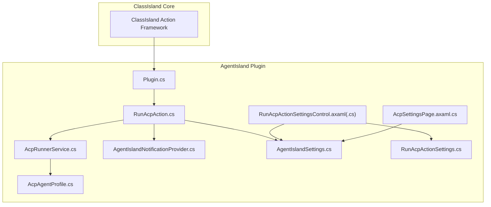
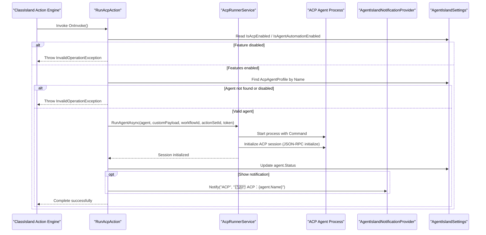
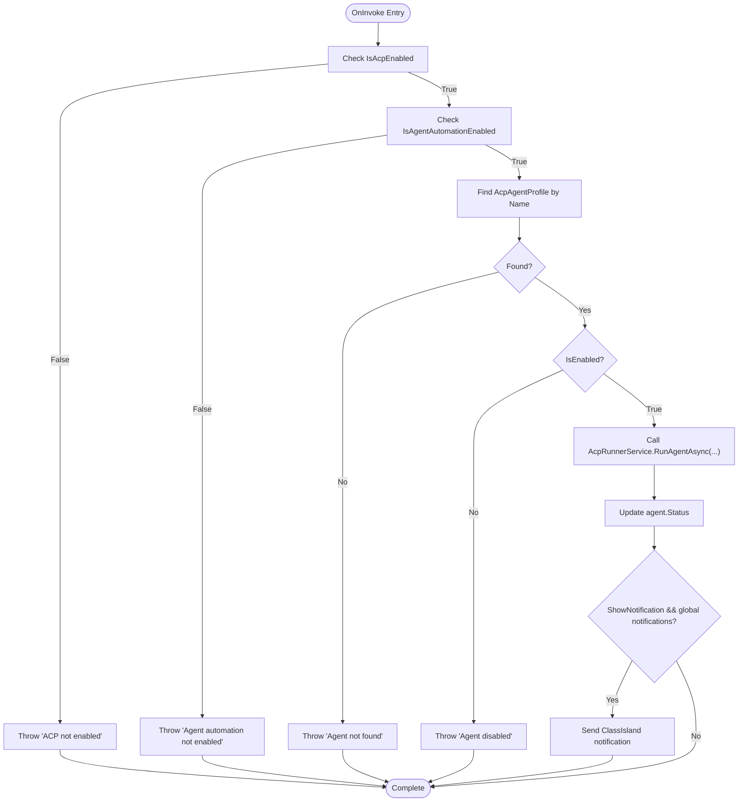
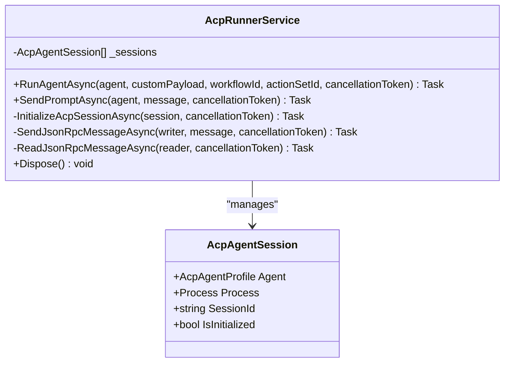
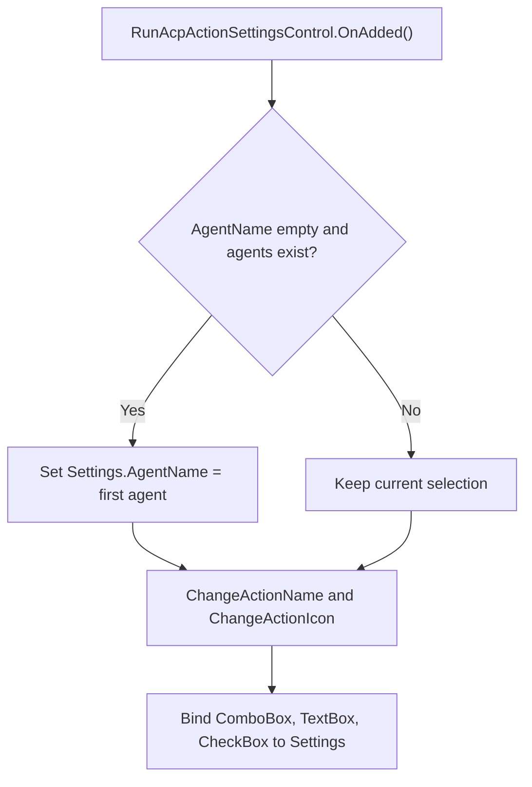
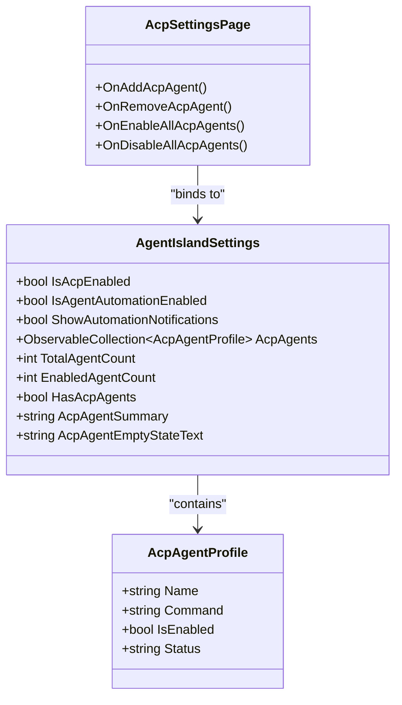
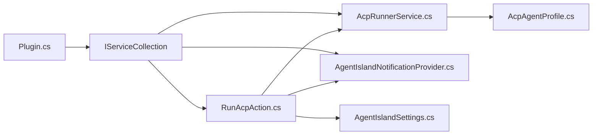

# ClassIsland Automation Integration

<cite>
**Referenced Files in This Document**
- [Plugin.cs](file://Plugin.cs)
- [Automation/RunAcpAction.cs](file://Automation/RunAcpAction.cs)
- [Models/RunAcpActionSettings.cs](file://Models/RunAcpActionSettings.cs)
- [Views/ActionSettings/RunAcpActionSettingsControl.axaml.cs](file://Views/ActionSettings/RunAcpActionSettingsControl.axaml.cs)
- [Views/ActionSettings/RunAcpActionSettingsControl.axaml](file://Views/ActionSettings/RunAcpActionSettingsControl.axaml)
- [Services/AcpRunnerService.cs](file://Services/AcpRunnerService.cs)
- [Models/AcpAgentProfile.cs](file://Models/AcpAgentProfile.cs)
- [Models/AgentIslandSettings.cs](file://Models/AgentIslandSettings.cs)
- [Mcp/Tools/AgentIslandNotificationProvider.cs](file://Mcp/Tools/AgentIslandNotificationProvider.cs)
- [Views/SettingsPages/AcpSettingsPage.axaml.cs](file://Views/SettingsPages/AcpSettingsPage.axaml.cs)
</cite>

## Table of Contents
1. [Introduction](#introduction)
2. [Project Structure](#project-structure)
3. [Core Components](#core-components)
4. [Architecture Overview](#architecture-overview)
5. [Detailed Component Analysis](#detailed-component-analysis)
6. [Dependency Analysis](#dependency-analysis)
7. [Performance Considerations](#performance-considerations)
8. [Troubleshooting Guide](#troubleshooting-guide)
9. [Conclusion](#conclusion)
10. [Appendices](#appendices)

## Introduction
This document explains how ClassIsland automation integrates with ACP agents through the RunAcpAction implementation. It covers trigger conditions, parameter binding, execution context, error propagation to ClassIsland, and result handling. It also documents the action settings UI for configuring agent execution within ClassIsland workflows, event-driven execution patterns, common automation scenarios, conditional execution based on classroom state, integration with other actions, and debugging techniques.

## Project Structure
The integration spans several layers:
- Plugin registration and dependency injection
- Automation action definition and invocation
- Settings model and UI for action configuration
- Agent runner service that manages process lifecycle and ACP protocol communication
- Notification provider for user feedback
- Global plugin settings and ACP agent profiles

**Diagram sources**
- [Plugin.cs:1-114](file://Plugin.cs#L1-L114)
- [Automation/RunAcpAction.cs:1-84](file://Automation/RunAcpAction.cs#L1-L84)
- [Services/AcpRunnerService.cs:1-207](file://Services/AcpRunnerService.cs#L1-L207)
- [Mcp/Tools/AgentIslandNotificationProvider.cs:1-52](file://Mcp/Tools/AgentIslandNotificationProvider.cs#L1-L52)
- [Models/AgentIslandSettings.cs:1-394](file://Models/AgentIslandSettings.cs#L1-L394)
- [Models/AcpAgentProfile.cs:1-44](file://Models/AcpAgentProfile.cs#L1-L44)
- [Models/RunAcpActionSettings.cs:1-36](file://Models/RunAcpActionSettings.cs#L1-L36)
- [Views/ActionSettings/RunAcpActionSettingsControl.axaml.cs:1-37](file://Views/ActionSettings/RunAcpActionSettingsControl.axaml.cs#L1-L37)
- [Views/ActionSettings/RunAcpActionSettingsControl.axaml:1-55](file://Views/ActionSettings/RunAcpActionSettingsControl.axaml#L1-L55)
- [Views/SettingsPages/AcpSettingsPage.axaml.cs:1-67](file://Views/SettingsPages/AcpSettingsPage.axaml.cs#L1-L67)

**Section sources**
- [Plugin.cs:29-53](file://Plugin.cs#L29-L53)
- [Automation/RunAcpAction.cs:10-16](file://Automation/RunAcpAction.cs#L10-L16)

## Core Components
- RunAcpAction: The ClassIsland automation action that triggers ACP agent execution. It validates global and per-agent settings, locates the target agent, starts it via AcpRunnerService, updates status, and optionally shows a notification.
- AcpRunnerService: Manages ACP agent process lifecycle, initializes an ACP session over stdio using JSON-RPC, and provides methods to send prompts.
- AgentIslandSettings: Centralized plugin settings including toggles for ACP and agent automation, notification preferences, and the list of configured ACP agents.
- AcpAgentProfile: Represents a single ACP agent configuration (name, command, enabled flag, status).
- RunAcpActionSettings: Per-action configuration (agent name, custom payload, show notification).
- RunAcpActionSettingsControl: UI control for configuring the action, binding to available agents and settings.
- AgentIslandNotificationProvider: Provides ClassIsland notifications from automation flows.

Key responsibilities:
- Trigger validation and gating
- Parameter binding and context propagation
- Process management and protocol initialization
- User feedback and telemetry breadcrumbs

**Section sources**
- [Automation/RunAcpAction.cs:29-82](file://Automation/RunAcpAction.cs#L29-L82)
- [Services/AcpRunnerService.cs:25-77](file://Services/AcpRunnerService.cs#L25-L77)
- [Models/AgentIslandSettings.cs:64-102](file://Models/AgentIslandSettings.cs#L64-L102)
- [Models/AcpAgentProfile.cs:9-43](file://Models/AcpAgentProfile.cs#L9-L43)
- [Models/RunAcpActionSettings.cs:9-35](file://Models/RunAcpActionSettings.cs#L9-L35)
- [Views/ActionSettings/RunAcpActionSettingsControl.axaml.cs:15-35](file://Views/ActionSettings/RunAcpActionSettingsControl.axaml.cs#L15-L35)
- [Mcp/Tools/AgentIslandNotificationProvider.cs:27-50](file://Mcp/Tools/AgentIslandNotificationProvider.cs#L27-L50)

## Architecture Overview
The automation flow is event-driven by ClassIsland’s action framework. When a workflow invokes the “Run ACP” action, the action validates configuration, starts the agent process, initializes an ACP session, and reports status and optional notifications.

**Diagram sources**
- [Automation/RunAcpAction.cs:29-82](file://Automation/RunAcpAction.cs#L29-L82)
- [Services/AcpRunnerService.cs:25-77](file://Services/AcpRunnerService.cs#L25-L77)
- [Models/AgentIslandSettings.cs:127-143](file://Models/AgentIslandSettings.cs#L127-L143)
- [Mcp/Tools/AgentIslandNotificationProvider.cs:27-50](file://Mcp/Tools/AgentIslandNotificationProvider.cs#L27-L50)

## Detailed Component Analysis

### RunAcpAction Implementation
- Trigger conditions:
  - Global ACP feature must be enabled.
  - Agent-based automation must be enabled.
  - Target agent must exist and be enabled.
- Parameter binding:
  - AgentName selects the configured ACP agent profile.
  - CustomPayload is passed to the runner service.
  - Workflow identifiers (ActionSet.Guid, ActionItem.Id) are forwarded to the runner service.
- Execution context:
  - Uses InterruptCancellationToken to support cancellation.
  - Updates agent status after successful start.
  - Optionally posts a ClassIsland notification if both global and per-action flags are set.
- Error propagation:
  - Throws InvalidOperationException when preconditions fail; ClassIsland will surface these errors to the workflow engine.

**Diagram sources**
- [Automation/RunAcpAction.cs:29-82](file://Automation/RunAcpAction.cs#L29-L82)

**Section sources**
- [Automation/RunAcpAction.cs:10-16](file://Automation/RunAcpAction.cs#L10-L16)
- [Automation/RunAcpAction.cs:29-82](file://Automation/RunAcpAction.cs#L29-L82)

### AcpRunnerService and ACP Protocol
- Responsibilities:
  - Start the agent process using the configured command.
  - Initialize an ACP session via JSON-RPC over stdio.
  - Maintain active sessions and provide prompt sending capability.
  - Dispose processes gracefully on shutdown.
- Key behaviors:
  - Validates command presence and format.
  - Sends an initialize request and expects a result property.
  - Tracks session initialization state and assigns a unique sessionId.
  - Logs breadcrumbs for telemetry.

**Diagram sources**
- [Services/AcpRunnerService.cs:14-206](file://Services/AcpRunnerService.cs#L14-L206)

**Section sources**
- [Services/AcpRunnerService.cs:25-77](file://Services/AcpRunnerService.cs#L25-L77)
- [Services/AcpRunnerService.cs:79-100](file://Services/AcpRunnerService.cs#L79-L100)
- [Services/AcpRunnerService.cs:102-131](file://Services/AcpRunnerService.cs#L102-L131)
- [Services/AcpRunnerService.cs:156-191](file://Services/AcpRunnerService.cs#L156-L191)

### Action Settings UI
- Purpose:
  - Allow users to select a configured ACP agent, supply a custom JSON payload, and toggle post-run notifications.
- Behavior:
  - Populates a dropdown with available agent names from global settings.
  - Preselects the first agent if none selected.
  - Dynamically changes action display name and icon based on selection.
  - Displays guidance text depending on whether any agents are configured.

**Diagram sources**
- [Views/ActionSettings/RunAcpActionSettingsControl.axaml.cs:22-35](file://Views/ActionSettings/RunAcpActionSettingsControl.axaml.cs#L22-L35)
- [Views/ActionSettings/RunAcpActionSettingsControl.axaml:35-51](file://Views/ActionSettings/RunAcpActionSettingsControl.axaml#L35-L51)

**Section sources**
- [Views/ActionSettings/RunAcpActionSettingsControl.axaml.cs:15-35](file://Views/ActionSettings/RunAcpActionSettingsControl.axaml.cs#L15-L35)
- [Views/ActionSettings/RunAcpActionSettingsControl.axaml:11-53](file://Views/ActionSettings/RunAcpActionSettingsControl.axaml#L11-L53)

### Global Settings and ACP Management
- AgentIslandSettings:
  - Toggles for ACP panel capabilities and agent automation.
  - Notification preference for automation events.
  - Collection of AcpAgentProfile entries with derived properties (counts, summaries).
- AcpSettingsPage:
  - Adds/removes agents and bulk enable/disable operations.
  - Binds to global settings for live updates.

**Diagram sources**
- [Models/AgentIslandSettings.cs:64-102](file://Models/AgentIslandSettings.cs#L64-L102)
- [Models/AgentIslandSettings.cs:127-143](file://Models/AgentIslandSettings.cs#L127-L143)
- [Models/AcpAgentProfile.cs:9-43](file://Models/AcpAgentProfile.cs#L9-L43)
- [Views/SettingsPages/AcpSettingsPage.axaml.cs:31-64](file://Views/SettingsPages/AcpSettingsPage.axaml.cs#L31-L64)

**Section sources**
- [Models/AgentIslandSettings.cs:64-102](file://Models/AgentIslandSettings.cs#L64-L102)
- [Models/AgentIslandSettings.cs:127-143](file://Models/AgentIslandSettings.cs#L127-L143)
- [Views/SettingsPages/AcpSettingsPage.axaml.cs:25-64](file://Views/SettingsPages/AcpSettingsPage.axaml.cs#L25-L64)

### Notifications and Telemetry
- Notifications:
  - AgentIslandNotificationProvider posts ClassIsland notifications with mask and overlay content.
  - Controlled by global ShowAutomationNotifications and per-action ShowNotification.
- Telemetry:
  - AcpRunnerService adds breadcrumbs for agent run and prompt events.
  - Plugin initializes SentryTelemetryService and logs lifecycle events.

**Section sources**
- [Mcp/Tools/AgentIslandNotificationProvider.cs:27-50](file://Mcp/Tools/AgentIslandNotificationProvider.cs#L27-L50)
- [Services/AcpRunnerService.cs:32-33](file://Services/AcpRunnerService.cs#L32-L33)
- [Services/AcpRunnerService.cs:107-108](file://Services/AcpRunnerService.cs#L107-L108)
- [Plugin.cs:36-38](file://Plugin.cs#L36-L38)

## Dependency Analysis
- Registration:
  - Plugin registers services, components, settings pages, and the RunAcpAction with its settings control.
- Runtime dependencies:
  - RunAcpAction depends on AgentIslandSettings, AcpRunnerService, and ILogger.
  - AcpRunnerService depends on Process APIs and JSON serialization.
  - Notification provider depends on ClassIsland notification channels.

**Diagram sources**
- [Plugin.cs:40-49](file://Plugin.cs#L40-L49)
- [Automation/RunAcpAction.cs:18-27](file://Automation/RunAcpAction.cs#L18-L27)
- [Services/AcpRunnerService.cs:14-23](file://Services/AcpRunnerService.cs#L14-L23)
- [Mcp/Tools/AgentIslandNotificationProvider.cs:12-25](file://Mcp/Tools/AgentIslandNotificationProvider.cs#L12-L25)
- [Models/AgentIslandSettings.cs:127-143](file://Models/AgentIslandSettings.cs#L127-L143)
- [Models/AcpAgentProfile.cs:9-43](file://Models/AcpAgentProfile.cs#L9-L43)

**Section sources**
- [Plugin.cs:29-53](file://Plugin.cs#L29-L53)

## Performance Considerations
- Process startup overhead: Each RunAgentAsync call spawns a new process. For frequent triggers, consider reusing existing sessions where appropriate.
- I/O throughput: JSON-RPC messages are line-delimited; ensure payloads are concise to reduce serialization/deserialization costs.
- Cancellation: Use InterruptCancellationToken to avoid long-running operations blocking workflows.
- Logging volume: Excessive logging can impact performance; keep debug-level logs minimal in production.

[No sources needed since this section provides general guidance]

## Troubleshooting Guide
Common issues and resolutions:
- ACP feature disabled:
  - Symptom: Action throws an exception indicating ACP is not enabled.
  - Resolution: Enable IsAcpEnabled in global settings.
- Agent automation disabled:
  - Symptom: Action throws an exception indicating agent automation is not enabled.
  - Resolution: Enable IsAgentAutomationEnabled in global settings.
- Agent not found or disabled:
  - Symptom: Action throws an exception about missing or disabled agent.
  - Resolution: Ensure the agent exists in AcpAgents and IsEnabled is true.
- Invalid agent command:
  - Symptom: Runner service throws an exception about invalid or missing command.
  - Resolution: Configure a valid Command string in the agent profile.
- Session not initialized:
  - Symptom: Sending prompts fails because the agent is not initialized.
  - Resolution: Verify the agent responds to the initialize request and sets IsInitialized.
- Notifications not shown:
  - Symptom: No notification appears after running the action.
  - Resolution: Ensure ShowAutomationNotifications is enabled globally and ShowNotification is enabled in the action settings.

Debugging techniques:
- Inspect logs:
  - Look for informational and warning logs around action invocation and agent startup.
- Telemetry breadcrumbs:
  - Review breadcrumbs added by AcpRunnerService for agent run and prompt events.
- Process diagnostics:
  - Confirm the agent process starts and exits cleanly; check standard streams for JSON-RPC messages during development.
- UI state:
  - Verify the action settings control binds correctly and displays the expected agent list and selections.

**Section sources**
- [Automation/RunAcpAction.cs:35-60](file://Automation/RunAcpAction.cs#L35-L60)
- [Services/AcpRunnerService.cs:37-48](file://Services/AcpRunnerService.cs#L37-L48)
- [Services/AcpRunnerService.cs:112-116](file://Services/AcpRunnerService.cs#L112-L116)
- [Mcp/Tools/AgentIslandNotificationProvider.cs:27-50](file://Mcp/Tools/AgentIslandNotificationProvider.cs#L27-L50)
- [Services/AcpRunnerService.cs:32-33](file://Services/AcpRunnerService.cs#L32-L33)

## Conclusion
The RunAcpAction integrates ClassIsland automation with ACP agents by validating configuration, launching agent processes, initializing ACP sessions, and providing user feedback. The design separates concerns across action logic, runner service, settings, and UI controls, enabling clear extensibility and maintainability. Proper use of global toggles, per-action parameters, and notifications ensures robust and observable automation flows.

[No sources needed since this section summarizes without analyzing specific files]

## Appendices

### Common Automation Scenarios
- Start an agent at a specific time:
  - Create a scheduled ClassIsland action that invokes RunAcpAction with the desired agent name and optional custom payload.
- Conditional execution based on classroom state:
  - Combine RunAcpAction with other ClassIsland actions that query schedule tools and conditionally branch based on current class information.
- Integrate with other actions:
  - Chain RunAcpAction with actions that update AI text components or swap classes, using workflow variables to pass results between steps.

[No sources needed since this section doesn't analyze specific source files]

### Data Models Reference
- RunAcpActionSettings fields:
  - AgentName: Selected agent identifier.
  - ShowNotification: Whether to show a notification after execution.
  - CustomPayload: Optional JSON payload passed to the runner service.
- AcpAgentProfile fields:
  - Name: Unique agent name used for selection.
  - Command: Executable path and arguments to start the agent.
  - IsEnabled: Toggle to allow or block execution.
  - Status: Human-readable status updated after runs.

**Section sources**
- [Models/RunAcpActionSettings.cs:15-34](file://Models/RunAcpActionSettings.cs#L15-L34)
- [Models/AcpAgentProfile.cs:16-42](file://Models/AcpAgentProfile.cs#L16-L42)