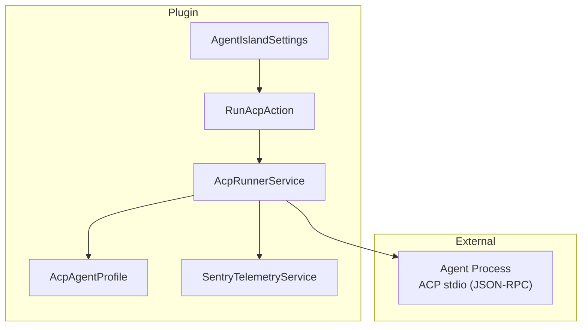
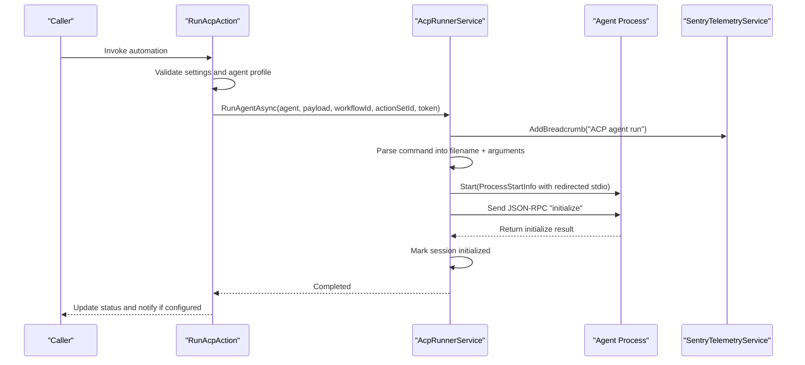
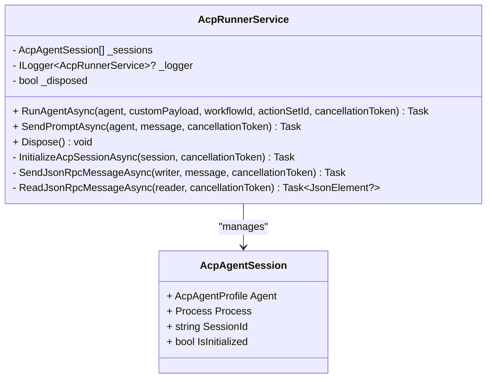
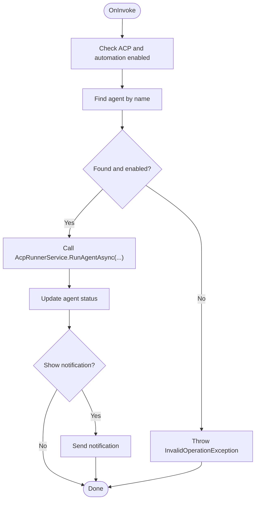
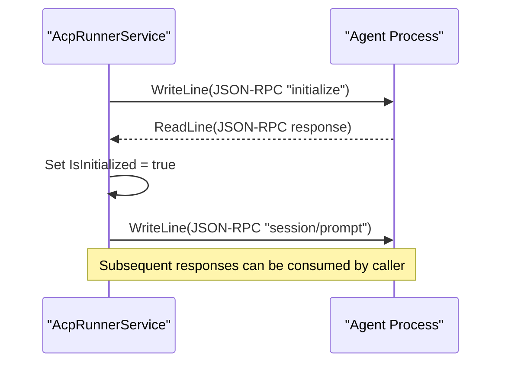
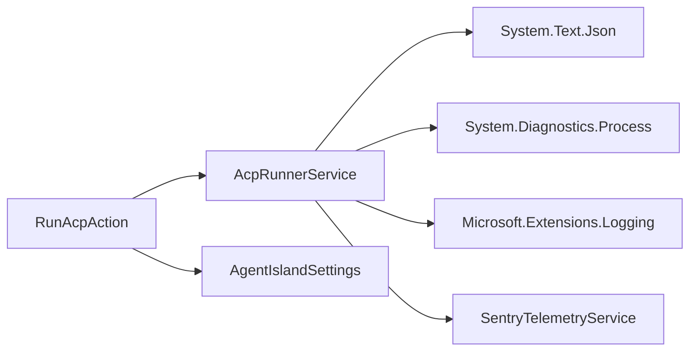

# Process Management and Lifecycle

<cite>
**Referenced Files in This Document**
- [AcpRunnerService.cs](file://Services/AcpRunnerService.cs)
- [RunAcpAction.cs](file://Automation/RunAcpAction.cs)
- [AcpAgentProfile.cs](file://Models/AcpAgentProfile.cs)
- [RunAcpActionSettings.cs](file://Models/RunAcpActionSettings.cs)
- [AgentIslandSettings.cs](file://Models/AgentIslandSettings.cs)
- [SentryTelemetryService.cs](file://Services/SentryTelemetryService.cs)
- [AgentIsland.csproj](file://AgentIsland.csproj)
</cite>

## Table of Contents
1. [Introduction](#introduction)
2. [Project Structure](#project-structure)
3. [Core Components](#core-components)
4. [Architecture Overview](#architecture-overview)
5. [Detailed Component Analysis](#detailed-component-analysis)
6. [Dependency Analysis](#dependency-analysis)
7. [Performance Considerations](#performance-considerations)
8. [Troubleshooting Guide](#troubleshooting-guide)
9. [Conclusion](#conclusion)

## Introduction
This document explains the ACP agent process management and lifecycle control implemented by the plugin. It focuses on how the AcpRunnerService spawns, configures, monitors, and cleans up external agent processes that communicate via the ACP stdio protocol using JSON-RPC over standard input/output streams. It also covers session creation, graceful shutdown, error handling, resource cleanup, and performance considerations for managing multiple concurrent agent processes.

## Project Structure
The process management functionality is primarily implemented in the Services layer with supporting models and automation actions:
- AcpRunnerService orchestrates process lifecycle and I/O communication
- RunAcpAction triggers agent execution from automation workflows
- AcpAgentProfile defines per-agent configuration (name, command, enabled state, status)
- AgentIslandSettings holds global settings including whether ACP and agent automation are enabled
- SentryTelemetryService provides telemetry breadcrumbs and exception capture used during process operations
- The project file declares dependencies relevant to JSON serialization and telemetry

**Diagram sources**
- [AcpRunnerService.cs:14-206](file://Services/AcpRunnerService.cs#L14-L206)
- [RunAcpAction.cs:16-83](file://Automation/RunAcpAction.cs#L16-L83)
- [AcpAgentProfile.cs:9-43](file://Models/AcpAgentProfile.cs#L9-L43)
- [AgentIslandSettings.cs:13-102](file://Models/AgentIslandSettings.cs#L13-L102)
- [SentryTelemetryService.cs:11-122](file://Services/SentryTelemetryService.cs#L11-L122)

**Section sources**
- [AcpRunnerService.cs:14-206](file://Services/AcpRunnerService.cs#L14-L206)
- [RunAcpAction.cs:16-83](file://Automation/RunAcpAction.cs#L16-L83)
- [AcpAgentProfile.cs:9-43](file://Models/AcpAgentProfile.cs#L9-L43)
- [AgentIslandSettings.cs:13-102](file://Models/AgentIslandSettings.cs#L13-L102)
- [SentryTelemetryService.cs:11-122](file://Services/SentryTelemetryService.cs#L11-L122)
- [AgentIsland.csproj:22-29](file://AgentIsland.csproj#L22-L29)

## Core Components
- AcpRunnerService: Manages one or more ACP agent sessions, each backed by a separate OS process. It handles process spawning, JSON-RPC initialization, prompt sending, and disposal/cleanup.
- RunAcpAction: Automation action that validates settings and invokes AcpRunnerService to start an agent based on a configured profile.
- AcpAgentProfile: Represents a single agent’s configuration (name, command, enabled flag, status).
- AgentIslandSettings: Global plugin settings controlling whether ACP and agent automation are enabled, and holding the list of agents.
- SentryTelemetryService: Provides telemetry breadcrumbs and exception capture used throughout process operations.

Key responsibilities:
- Process isolation: Each agent runs as a separate OS process with redirected standard streams.
- Session lifecycle: Initialize ACP session via JSON-RPC “initialize”, then send prompts via “session/prompt”.
- Resource cleanup: Close stdin, wait briefly, kill if necessary, and dispose process objects.

**Section sources**
- [AcpRunnerService.cs:14-206](file://Services/AcpRunnerService.cs#L14-L206)
- [RunAcpAction.cs:16-83](file://Automation/RunAcpAction.cs#L16-L83)
- [AcpAgentProfile.cs:9-43](file://Models/AcpAgentProfile.cs#L9-L43)
- [AgentIslandSettings.cs:13-102](file://Models/AgentIslandSettings.cs#L13-L102)
- [SentryTelemetryService.cs:11-122](file://Services/SentryTelemetryService.cs#L11-L122)

## Architecture Overview
The runtime flow begins when an automation action requests running an ACP agent. The service validates configuration, spawns a new process, initializes the ACP session over stdio, and tracks the session for subsequent interactions. On shutdown, it attempts graceful termination and enforces cleanup.

**Diagram sources**
- [RunAcpAction.cs:29-82](file://Automation/RunAcpAction.cs#L29-L82)
- [AcpRunnerService.cs:25-77](file://Services/AcpRunnerService.cs#L25-L77)
- [AcpRunnerService.cs:79-100](file://Services/AcpRunnerService.cs#L79-L100)
- [SentryTelemetryService.cs:114-122](file://Services/SentryTelemetryService.cs#L114-L122)

## Detailed Component Analysis

### AcpRunnerService: Process Spawning, I/O, and Cleanup
Responsibilities:
- Spawn a child process using ProcessStartInfo with shell execution disabled and all standard streams redirected.
- Create a session object that associates the agent profile, the Process instance, a generated session identifier, and initialization state.
- Initialize the ACP session by sending a JSON-RPC “initialize” request and reading the response.
- Provide a method to send prompts to the agent via JSON-RPC “session/prompt”.
- Dispose all tracked sessions on service disposal, attempting graceful exit before forced termination.

Process configuration options:
- Command parsing: The agent’s command string is split into executable path and arguments.
- Process isolation: UseShellExecute is false; CreateNoWindow is true; StandardInput/Output/Error are redirected.
- No environment variable injection is performed at this time; the child inherits the parent process environment.

Standard I/O stream handling:
- Messages are serialized to JSON and written line-delimited to StandardInput.
- Responses are read line-by-line from StandardOutput and deserialized to JSON elements.

Resource cleanup:
- On disposal, the service closes StandardInput, waits up to a short timeout, kills the process if still alive, disposes the Process object, clears the session list, and marks itself disposed.

Error handling:
- Throws invalid operation exceptions for missing or malformed commands and uninitialized sessions.
- Logs errors during stop operations and continues cleanup for remaining sessions.

**Diagram sources**
- [AcpRunnerService.cs:14-206](file://Services/AcpRunnerService.cs#L14-L206)

**Section sources**
- [AcpRunnerService.cs:25-77](file://Services/AcpRunnerService.cs#L25-L77)
- [AcpRunnerService.cs:79-100](file://Services/AcpRunnerService.cs#L79-L100)
- [AcpRunnerService.cs:102-131](file://Services/AcpRunnerService.cs#L102-L131)
- [AcpRunnerService.cs:133-154](file://Services/AcpRunnerService.cs#L133-L154)
- [AcpRunnerService.cs:156-191](file://Services/AcpRunnerService.cs#L156-L191)
- [AcpRunnerService.cs:193-205](file://Services/AcpRunnerService.cs#L193-L205)

### RunAcpAction: Automation Entry Point
Responsibilities:
- Validates that ACP and agent automation features are enabled.
- Resolves the named agent profile and ensures it is enabled.
- Invokes AcpRunnerService.RunAgentAsync with cancellation support.
- Updates agent status and optionally shows a notification.

Integration points:
- Consumes AgentIslandSettings for feature flags and agent list.
- Uses SentryTelemetryService indirectly through AcpRunnerService for breadcrumbs.

**Diagram sources**
- [RunAcpAction.cs:29-82](file://Automation/RunAcpAction.cs#L29-L82)

**Section sources**
- [RunAcpAction.cs:16-83](file://Automation/RunAcpAction.cs#L16-L83)
- [AgentIslandSettings.cs:67-102](file://Models/AgentIslandSettings.cs#L67-L102)

### AcpAgentProfile and Settings
- AcpAgentProfile exposes Name, Command, IsEnabled, and Status properties used to configure and track individual agents.
- AgentIslandSettings includes IsAcpEnabled and IsAgentAutomationEnabled flags, plus an observable collection of AcpAgentProfile instances.

These models drive validation and runtime behavior in both the automation action and runner service.

**Section sources**
- [AcpAgentProfile.cs:9-43](file://Models/AcpAgentProfile.cs#L9-L43)
- [AgentIslandSettings.cs:13-102](file://Models/AgentIslandSettings.cs#L13-L102)

### JSON-RPC Over Stdio Protocol
The service implements a simple line-based JSON-RPC transport:
- Initialization: Sends an “initialize” request with protocol version and client capabilities, then reads the response.
- Prompting: Sends a “session/prompt” request containing the session identifier and user message.

**Diagram sources**
- [AcpRunnerService.cs:79-100](file://Services/AcpRunnerService.cs#L79-L100)
- [AcpRunnerService.cs:102-131](file://Services/AcpRunnerService.cs#L102-L131)
- [AcpRunnerService.cs:133-154](file://Services/AcpRunnerService.cs#L133-L154)

## Dependency Analysis
- AcpRunnerService depends on:
  - System.Diagnostics.Process for process management
  - System.Text.Json for JSON serialization/deserialization
  - Microsoft.Extensions.Logging for structured logging
  - SentryTelemetryService for telemetry breadcrumbs
- RunAcpAction depends on:
  - AgentIslandSettings for feature flags and agent list
  - AcpRunnerService for process orchestration
  - Notification provider (external) for UI notifications
- Models are plain data structures with JSON serialization attributes.

**Diagram sources**
- [AcpRunnerService.cs:1-8](file://Services/AcpRunnerService.cs#L1-L8)
- [RunAcpAction.cs:1-7](file://Automation/RunAcpAction.cs#L1-L7)
- [AgentIsland.csproj:22-29](file://AgentIsland.csproj#L22-L29)

**Section sources**
- [AcpRunnerService.cs:1-8](file://Services/AcpRunnerService.cs#L1-L8)
- [RunAcpAction.cs:1-7](file://Automation/RunAcpAction.cs#L1-L7)
- [AgentIsland.csproj:22-29](file://AgentIsland.csproj#L22-L29)

## Performance Considerations
- Concurrency:
  - Each agent runs in its own OS process, providing strong isolation.
  - The current implementation does not implement a process pool; each RunAgentAsync call creates a new process and session. For high-frequency invocations, consider implementing a session cache keyed by agent profile to reuse existing processes where appropriate.
- I/O throughput:
  - Line-based JSON-RPC over StreamWriter/StreamReader is straightforward but may become a bottleneck under heavy load. Consider buffering strategies or asynchronous pipelining if many messages are exchanged per session.
- Memory management:
  - Ensure that long-running sessions do not accumulate large payloads in memory. If you extend the service to consume stdout/stderr continuously, implement bounded buffers and backpressure.
- Startup overhead:
  - Process startup latency can dominate total runtime for short-lived tasks. Reuse sessions when possible and avoid unnecessary reinitialization.
- Telemetry overhead:
  - Breadcrumbs are added around key operations. Keep breadcrumb volume reasonable to avoid impacting performance.

[No sources needed since this section provides general guidance]

## Troubleshooting Guide
Common issues and remedies:
- Missing or invalid command:
  - Symptom: InvalidOperation exception indicating no command or invalid command.
  - Cause: Empty or whitespace-only command string in the agent profile.
  - Resolution: Configure a valid executable path and arguments in the agent profile.
- Uninitialized session:
  - Symptom: InvalidOperation exception when sending a prompt.
  - Cause: Attempted to send a prompt before successful initialization or after a failure.
  - Resolution: Ensure initialization completes successfully before prompting; handle failures and retry if appropriate.
- Process hangs on shutdown:
  - Symptom: Process remains after disposal attempt.
  - Behavior: Service closes stdin, waits briefly, then kills the process if still alive.
  - Resolution: Verify that the agent responds to stdin closure; ensure no blocking reads without timeouts.
- Environment variables:
  - Current behavior: Child process inherits the parent environment.
  - If specific variables are required, inject them into the parent process environment before starting the child or modify the runner to set ProcessStartInfo.EnvironmentVariables explicitly.

Operational tips:
- Enable logging to capture detailed lifecycle events and errors.
- Use telemetry breadcrumbs to trace agent run and prompt flows.
- Monitor agent status fields updated by the automation action and runner.

**Section sources**
- [AcpRunnerService.cs:37-48](file://Services/AcpRunnerService.cs#L37-L48)
- [AcpRunnerService.cs:112-116](file://Services/AcpRunnerService.cs#L112-L116)
- [AcpRunnerService.cs:156-191](file://Services/AcpRunnerService.cs#L156-L191)
- [RunAcpAction.cs:35-60](file://Automation/RunAcpAction.cs#L35-L60)

## Conclusion
The ACP agent process management is implemented with clear separation of concerns: RunAcpAction validates inputs and delegates to AcpRunnerService, which manages process lifecycle and JSON-RPC over stdio. The design provides strong process isolation and basic resource cleanup. To scale to many concurrent agents or high-throughput messaging, consider session reuse, buffered I/O, and explicit environment configuration. Robust error handling and telemetry breadcrumbs aid in diagnosing issues across the process boundary.