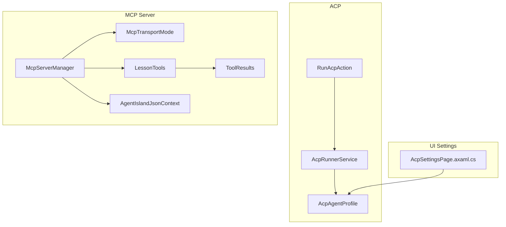
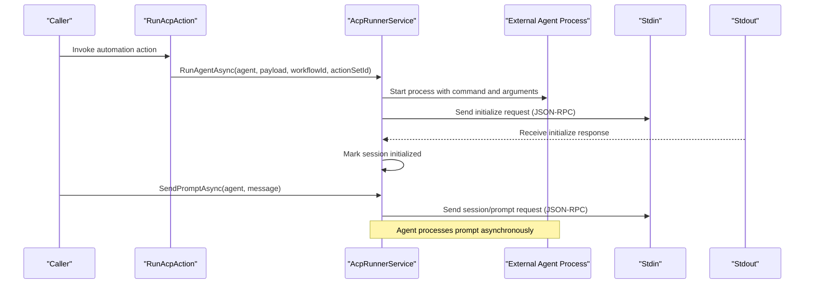
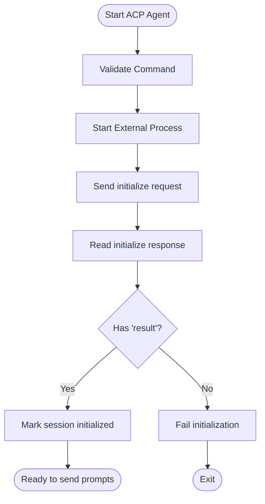
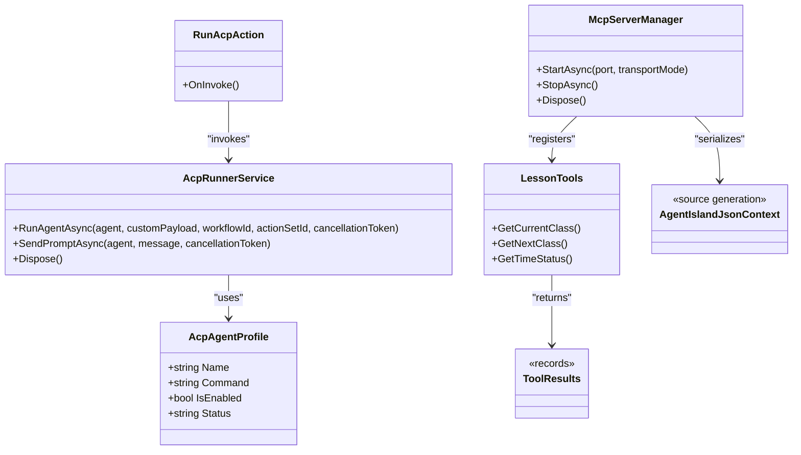

# ACP Protocol Specification

<cite>
**Referenced Files in This Document**
- [AcpRunnerService.cs](file://Services/AcpRunnerService.cs)
- [AcpAgentProfile.cs](file://Models/AcpAgentProfile.cs)
- [RunAcpAction.cs](file://Automation/RunAcpAction.cs)
- [McpServerManager.cs](file://Mcp/McpServerManager.cs)
- [McpTransportMode.cs](file://Models/McpTransportMode.cs)
- [LessonTools.cs](file://Mcp/Tools/LessonTools.cs)
- [ToolResults.cs](file://Models/ToolResults.cs)
- [AgentIslandJsonContext.cs](file://Models/AgentIslandJsonContext.cs)
- [RunAcpActionSettings.cs](file://Models/RunAcpActionSettings.cs)
- [AcpSettingsPage.axaml.cs](file://Views/SettingsPages/AcpSettingsPage.axaml.cs)
</cite>

## Table of Contents
1. [Introduction](#introduction)
2. [Project Structure](#project-structure)
3. [Core Components](#core-components)
4. [Architecture Overview](#architecture-overview)
5. [Detailed Component Analysis](#detailed-component-analysis)
6. [Dependency Analysis](#dependency-analysis)
7. [Performance Considerations](#performance-considerations)
8. [Troubleshooting Guide](#troubleshooting-guide)
9. [Conclusion](#conclusion)
10. [Appendices](#appendices)

## Introduction
This document specifies the Agent Client Protocol (ACP) as implemented in this repository. It covers:
- JSON-RPC message format and lifecycle methods used by ACP agents over stdio
- Connection establishment, session management, and prompt invocation
- Transport options for MCP (HTTP/SSE) and how external agents can extend functionality via MCP tools
- Process management details for running ACP agents
- Error handling patterns, timeouts, and security considerations
- Examples of client implementation flows and integration points between ACP agents and MCP tools

The ACP implementation uses a simple JSON-RPC 2.0 protocol over standard input/output streams to control external agent processes. The same application also exposes an MCP server that provides tools to external clients over HTTP or SSE transports.

## Project Structure
Key areas relevant to ACP and MCP:
- Services: ACP process runner and communication logic
- Models: ACP agent profile and settings
- Automation: Action entry point to run ACP agents
- Mcp: MCP server manager and transport configuration
- Tools: MCP tool implementations and result models

**Diagram sources**
- [AcpRunnerService.cs:1-207](file://Services/AcpRunnerService.cs#L1-L207)
- [AcpAgentProfile.cs:1-44](file://Models/AcpAgentProfile.cs#L1-L44)
- [RunAcpAction.cs:1-84](file://Automation/RunAcpAction.cs#L1-L84)
- [McpServerManager.cs:1-125](file://Mcp/McpServerManager.cs#L1-L125)
- [McpTransportMode.cs:1-18](file://Models/McpTransportMode.cs#L1-L18)
- [LessonTools.cs:1-146](file://Mcp/Tools/LessonTools.cs#L1-L146)
- [ToolResults.cs:1-59](file://Models/ToolResults.cs#L1-L59)
- [AgentIslandJsonContext.cs:1-20](file://Models/AgentIslandJsonContext.cs#L1-L20)
- [AcpSettingsPage.axaml.cs:1-67](file://Views/SettingsPages/AcpSettingsPage.axaml.cs#L1-L67)

**Section sources**
- [AcpRunnerService.cs:1-207](file://Services/AcpRunnerService.cs#L1-L207)
- [AcpAgentProfile.cs:1-44](file://Models/AcpAgentProfile.cs#L1-L44)
- [RunAcpAction.cs:1-84](file://Automation/RunAcpAction.cs#L1-L84)
- [McpServerManager.cs:1-125](file://Mcp/McpServerManager.cs#L1-L125)
- [McpTransportMode.cs:1-18](file://Models/McpTransportMode.cs#L1-L18)
- [LessonTools.cs:1-146](file://Mcp/Tools/LessonTools.cs#L1-L146)
- [ToolResults.cs:1-59](file://Models/ToolResults.cs#L1-L59)
- [AgentIslandJsonContext.cs:1-20](file://Models/AgentIslandJsonContext.cs#L1-L20)
- [AcpSettingsPage.axaml.cs:1-67](file://Views/SettingsPages/AcpSettingsPage.axaml.cs#L1-L67)

## Core Components
- AcpRunnerService: Manages external agent processes, establishes ACP sessions via JSON-RPC over stdio, and sends prompts.
- AcpAgentProfile: Configuration model for each ACP agent including name, command, enabled state, and status.
- RunAcpAction: Automation action that triggers ACP agent execution based on settings and feature flags.
- McpServerManager: Hosts an MCP server with configurable transport mode (Streamable HTTP or SSE), registers tools, and manages lifecycle.
- LessonTools and ToolResults: Example MCP tools and structured result types exposed by the MCP server.
- AgentIslandJsonContext: Source-generated JSON serialization context for MCP tool results.
- AcpSettingsPage: UI page to manage ACP agent profiles.

**Section sources**
- [AcpRunnerService.cs:1-207](file://Services/AcpRunnerService.cs#L1-L207)
- [AcpAgentProfile.cs:1-44](file://Models/AcpAgentProfile.cs#L1-L44)
- [RunAcpAction.cs:1-84](file://Automation/RunAcpAction.cs#L1-L84)
- [McpServerManager.cs:1-125](file://Mcp/McpServerManager.cs#L1-L125)
- [LessonTools.cs:1-146](file://Mcp/Tools/LessonTools.cs#L1-L146)
- [ToolResults.cs:1-59](file://Models/ToolResults.cs#L1-L59)
- [AgentIslandJsonContext.cs:1-20](file://Models/AgentIslandJsonContext.cs#L1-L20)
- [AcpSettingsPage.axaml.cs:1-67](file://Views/SettingsPages/AcpSettingsPage.axaml.cs#L1-L67)

## Architecture Overview
The system integrates two protocols:
- ACP: JSON-RPC over stdio to control external agent processes.
- MCP: HTTP/SSE server exposing tools to external clients.

**Diagram sources**
- [RunAcpAction.cs:29-82](file://Automation/RunAcpAction.cs#L29-L82)
- [AcpRunnerService.cs:25-131](file://Services/AcpRunnerService.cs#L25-L131)

**Section sources**
- [RunAcpAction.cs:29-82](file://Automation/RunAcpAction.cs#L29-L82)
- [AcpRunnerService.cs:25-131](file://Services/AcpRunnerService.cs#L25-L131)

## Detailed Component Analysis

### ACP JSON-RPC Message Format
- Version: jsonrpc field is set to "2.0".
- Transport: Messages are serialized to JSON and written line-delimited to the process’s StandardInput; responses are read from StandardOutput line-by-line.
- Methods:
  - initialize: Used during connection setup.
  - session/prompt: Used to send user prompts to an active session.

Request structure examples (described):
- initialize request:
  - Fields: jsonrpc, id, method, params
  - params includes:
    - protocolVersion: integer
    - clientCapabilities: object
- session/prompt request:
  - Fields: jsonrpc, id, method, params
  - params includes:
    - sessionId: string
    - message: string

Response expectations:
- initialize response should include a result field indicating success.
- session/prompt may return a result or error depending on agent implementation.

Error handling:
- If no response is received or the response lacks a result, initialization is considered failed.
- Sending prompts requires an initialized session; otherwise, an exception is thrown.

**Section sources**
- [AcpRunnerService.cs:79-100](file://Services/AcpRunnerService.cs#L79-L100)
- [AcpRunnerService.cs:102-131](file://Services/AcpRunnerService.cs#L102-L131)
- [AcpRunnerService.cs:133-154](file://Services/AcpRunnerService.cs#L133-L154)

### Connection Establishment and Session Management
- Process creation:
  - The service starts an external process using the agent’s Command (executable path and optional arguments).
  - StandardInput and StandardOutput are redirected for JSON-RPC communication.
- Initialization:
  - After starting the process, the service sends an initialize request and waits for a response containing a result.
  - On success, the session is marked initialized and associated with a unique sessionId.
- Prompting:
  - To interact with the agent, the service sends a session/prompt request with the current sessionId and message.
- Lifecycle:
  - Sessions are tracked per agent instance.
  - Disposal closes stdin, waits briefly for graceful exit, and kills the process if necessary.

**Diagram sources**
- [AcpRunnerService.cs:25-100](file://Services/AcpRunnerService.cs#L25-L100)

**Section sources**
- [AcpRunnerService.cs:25-100](file://Services/AcpRunnerService.cs#L25-L100)
- [AcpRunnerService.cs:156-191](file://Services/AcpRunnerService.cs#L156-L191)

### Lifecycle Methods and Parameters
- initialize
  - Purpose: Establish protocol version and negotiate capabilities.
  - Params:
    - protocolVersion: integer
    - clientCapabilities: object
  - Response:
    - result: object (presence indicates success)
- session/prompt
  - Purpose: Deliver a user message to the agent within a specific session.
  - Params:
    - sessionId: string
    - message: string
  - Response:
    - May contain a result or error depending on agent behavior.

Notes:
- The current implementation does not implement additional lifecycle methods beyond initialize and session/prompt.
- The service enforces that a session must be initialized before sending prompts.

**Section sources**
- [AcpRunnerService.cs:79-100](file://Services/AcpRunnerService.cs#L79-L100)
- [AcpRunnerService.cs:102-131](file://Services/AcpRunnerService.cs#L102-L131)

### Agent Profile Configuration Structure
- AcpAgentProfile fields:
  - name: string
  - command: string (executable path and optional arguments)
  - isEnabled: boolean
  - status: string (e.g., connected timestamp or last run time)

Usage:
- Profiles are created and managed via the ACP settings UI.
- The automation action selects a profile by name and checks enabled state before execution.

**Section sources**
- [AcpAgentProfile.cs:1-44](file://Models/AcpAgentProfile.cs#L1-L44)
- [AcpSettingsPage.axaml.cs:31-48](file://Views/SettingsPages/AcpSettingsPage.axaml.cs#L31-L48)
- [RunAcpAction.cs:47-60](file://Automation/RunAcpAction.cs#L47-L60)

### Transport Mode Options (HTTP/SSE) for MCP
- McpTransportMode enum:
  - StreamableHttp: Modern streamable HTTP transport
  - Sse: Legacy Server-Sent Events transport
- McpServerManager configures the server based on selected transport mode:
  - StreamableHttp endpoint: /mcp
  - SSE endpoint: /sse
- Port and enable/disable controls are provided in the MCP settings UI.

**Section sources**
- [McpTransportMode.cs:1-18](file://Models/McpTransportMode.cs#L1-L18)
- [McpServerManager.cs:25-82](file://Mcp/McpServerManager.cs#L25-L82)
- [McpServerManager.cs:84-112](file://Mcp/McpServerManager.cs#L84-L112)

### Process Management Details
- Process start:
  - FileName and Arguments parsed from agent.Command
  - Redirected I/O for JSON-RPC
- Graceful shutdown:
  - Close stdin, wait up to 5 seconds, then kill if still alive
- Telemetry:
  - Breadcrumbs logged around agent runs and prompts

**Section sources**
- [AcpRunnerService.cs:44-77](file://Services/AcpRunnerService.cs#L44-L77)
- [AcpRunnerService.cs:156-191](file://Services/AcpRunnerService.cs#L156-L191)

### Communication Protocols Summary
- ACP:
  - JSON-RPC 2.0 over stdio
  - Methods: initialize, session/prompt
- MCP:
  - HTTP-based transports (Streamable HTTP or SSE)
  - Tools registered via builder pattern

**Section sources**
- [AcpRunnerService.cs:79-131](file://Services/AcpRunnerService.cs#L79-L131)
- [McpServerManager.cs:41-71](file://Mcp/McpServerManager.cs#L41-L71)

## Dependency Analysis
Relationships among core components:

**Diagram sources**
- [AcpRunnerService.cs:1-207](file://Services/AcpRunnerService.cs#L1-L207)
- [AcpAgentProfile.cs:1-44](file://Models/AcpAgentProfile.cs#L1-L44)
- [RunAcpAction.cs:1-84](file://Automation/RunAcpAction.cs#L1-L84)
- [McpServerManager.cs:1-125](file://Mcp/McpServerManager.cs#L1-L125)
- [LessonTools.cs:1-146](file://Mcp/Tools/LessonTools.cs#L1-L146)
- [ToolResults.cs:1-59](file://Models/ToolResults.cs#L1-L59)
- [AgentIslandJsonContext.cs:1-20](file://Models/AgentIslandJsonContext.cs#L1-L20)

**Section sources**
- [AcpRunnerService.cs:1-207](file://Services/AcpRunnerService.cs#L1-L207)
- [RunAcpAction.cs:1-84](file://Automation/RunAcpAction.cs#L1-L84)
- [McpServerManager.cs:1-125](file://Mcp/McpServerManager.cs#L1-L125)
- [LessonTools.cs:1-146](file://Mcp/Tools/LessonTools.cs#L1-L146)
- [ToolResults.cs:1-59](file://Models/ToolResults.cs#L1-L59)
- [AgentIslandJsonContext.cs:1-20](file://Models/AgentIslandJsonContext.cs#L1-L20)

## Performance Considerations
- Process startup overhead: Each agent run spawns a new process; consider reusing long-lived agents where possible.
- I/O throughput: Line-delimited JSON-RPC over stdio is efficient but synchronous reads/writes can block; ensure agents respond promptly.
- Serialization: Use source-generated serializers (as configured for MCP) to reduce allocation and improve performance.
- Concurrency: Avoid sending multiple prompts concurrently without proper sequencing; maintain one active session per agent instance.

[No sources needed since this section provides general guidance]

## Troubleshooting Guide
Common issues and resolutions:
- Agent not configured:
  - Ensure agent.Command is set and valid.
  - Check that the executable exists and has appropriate permissions.
- Feature disabled:
  - Verify ACP feature flag and agent automation flag are enabled in settings.
- Agent not found or disabled:
  - Confirm the agent name matches a configured profile and that it is enabled.
- Initialization failure:
  - Inspect initialize response; absence of a result indicates failure.
  - Validate protocolVersion and clientCapabilities compatibility.
- Prompt errors:
  - Ensure the session is initialized before sending prompts.
  - Check agent logs for processing errors.
- Shutdown hangs:
  - If the agent does not exit gracefully, the service will force-kill after a timeout.

**Section sources**
- [RunAcpAction.cs:35-60](file://Automation/RunAcpAction.cs#L35-L60)
- [AcpRunnerService.cs:37-48](file://Services/AcpRunnerService.cs#L37-L48)
- [AcpRunnerService.cs:112-116](file://Services/AcpRunnerService.cs#L112-L116)
- [AcpRunnerService.cs:156-191](file://Services/AcpRunnerService.cs#L156-L191)

## Conclusion
This specification outlines the ACP protocol as implemented in the repository, focusing on JSON-RPC over stdio for agent control and MCP over HTTP/SSE for tool exposure. The design emphasizes simplicity and clear separation between process management and protocol messaging. Extensibility is achieved through MCP tools, allowing external clients to integrate with the platform’s domain features.

[No sources needed since this section summarizes without analyzing specific files]

## Appendices

### ACP Client Implementation Example (Conceptual)
- Steps:
  - Start the agent process with its command and arguments.
  - Send initialize request with protocolVersion and clientCapabilities.
  - Wait for initialize response containing a result.
  - Generate a sessionId and store it for subsequent requests.
  - Send session/prompt requests with sessionId and message.
  - Handle responses and errors appropriately.
  - On shutdown, close stdin and terminate the process if needed.

[No sources needed since this diagram shows conceptual workflow, not actual code structure]

### MCP Tools Reference
- LessonTools exposes:
  - get_current_class
  - get_next_class
  - get_time_status
- Result structures are defined in ToolResults and serialized via AgentIslandJsonContext.

**Section sources**
- [LessonTools.cs:14-113](file://Mcp/Tools/LessonTools.cs#L14-L113)
- [ToolResults.cs:1-59](file://Models/ToolResults.cs#L1-L59)
- [AgentIslandJsonContext.cs:1-20](file://Models/AgentIslandJsonContext.cs#L1-L20)

### Security Considerations
- Command validation:
  - Ensure only trusted commands are executed; validate paths and arguments.
- Process isolation:
  - Run agents with least privilege; avoid granting unnecessary permissions.
- Input sanitization:
  - Treat messages from users as untrusted; sanitize inputs before forwarding to agents.
- Network exposure:
  - For MCP servers, bind to localhost unless explicitly required; configure ports carefully.
- Logging and telemetry:
  - Log operational events and errors without leaking sensitive data.

[No sources needed since this section provides general guidance]