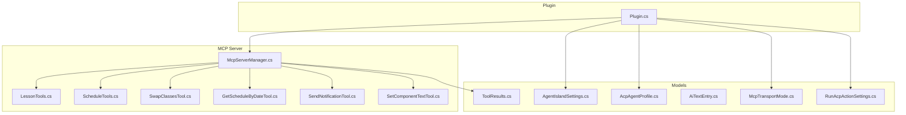
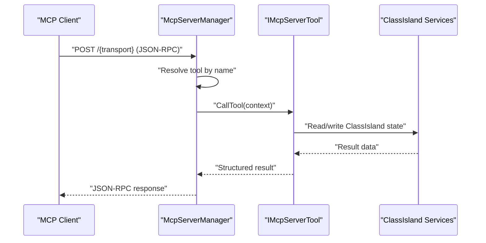
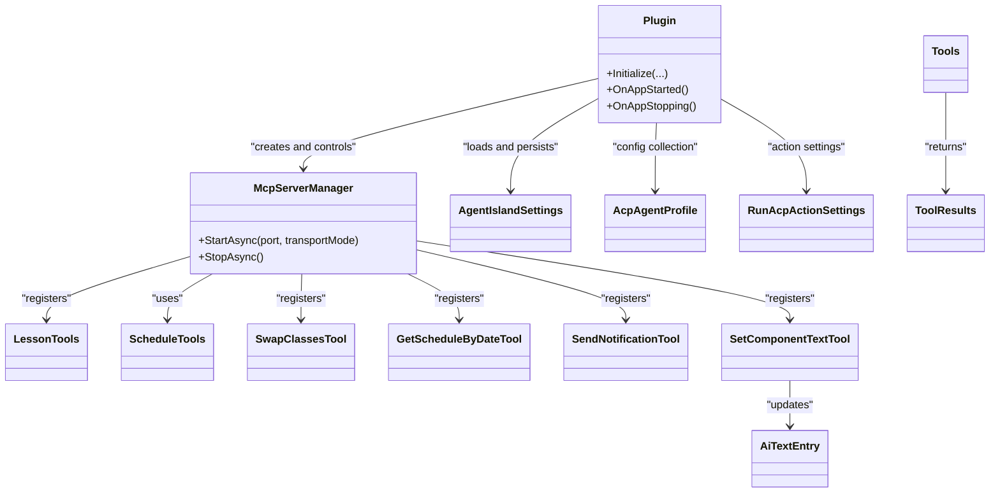

# API Reference

<cite>
**Referenced Files in This Document**
- [Plugin.cs](file://Plugin.cs)
- [McpServerManager.cs](file://Mcp/McpServerManager.cs)
- [LessonTools.cs](file://Mcp/Tools/LessonTools.cs)
- [ScheduleTools.cs](file://Mcp/Tools/ScheduleTools.cs)
- [SwapClassesTool.cs](file://Mcp/Tools/SwapClassesTool.cs)
- [GetScheduleByDateTool.cs](file://Mcp/Tools/GetScheduleByDateTool.cs)
- [SendNotificationTool.cs](file://Mcp/Tools/SendNotificationTool.cs)
- [SetComponentTextTool.cs](file://Mcp/Tools/SetComponentTextTool.cs)
- [AgentIslandSettings.cs](file://Models/AgentIslandSettings.cs)
- [AcpAgentProfile.cs](file://Models/AcpAgentProfile.cs)
- [ToolResults.cs](file://Models/ToolResults.cs)
- [AiTextEntry.cs](file://Models/AiTextEntry.cs)
- [McpTransportMode.cs](file://Models/McpTransportMode.cs)
- [RunAcpActionSettings.cs](file://Models/RunAcpActionSettings.cs)
</cite>

## Table of Contents
1. Introduction
2. Project Structure
3. Core Components
4. Architecture Overview
5. Detailed Component Analysis
6. Dependency Analysis
7. Performance Considerations
8. Troubleshooting Guide
9. Conclusion

## Introduction
This document provides a comprehensive API reference for AgentIsland’s public interfaces and data models. It covers:
- MCP tool endpoints with request/response schemas, parameters, and return structures
- ACP protocol specification (JSON-RPC message formats, method definitions, error codes)
- Plugin extension points (component registration, action implementation, settings pages)
- Data models including AgentIslandSettings, AcpAgentProfile, ToolResults, and related DTOs
- Serialization contexts, type mappings, and version compatibility notes
- Code examples for common usage patterns and integration scenarios

## Project Structure
AgentIsland exposes an MCP server that registers tools for lesson/schedule queries and UI notifications. The plugin initializes configuration, telemetry, and the MCP server at application start.

**Diagram sources**
- [Plugin.cs](file://Plugin.cs)
- [McpServerManager.cs](file://Mcp/McpServerManager.cs)
- [LessonTools.cs](file://Mcp/Tools/LessonTools.cs)
- [ScheduleTools.cs](file://Mcp/Tools/ScheduleTools.cs)
- [SwapClassesTool.cs](file://Mcp/Tools/SwapClassesTool.cs)
- [GetScheduleByDateTool.cs](file://Mcp/Tools/GetScheduleByDateTool.cs)
- [SendNotificationTool.cs](file://Mcp/Tools/SendNotificationTool.cs)
- [SetComponentTextTool.cs](file://Mcp/Tools/SetComponentTextTool.cs)
- [AgentIslandSettings.cs](file://Models/AgentIslandSettings.cs)
- [AcpAgentProfile.cs](file://Models/AcpAgentProfile.cs)
- [ToolResults.cs](file://Models/ToolResults.cs)
- [AiTextEntry.cs](file://Models/AiTextEntry.cs)
- [McpTransportMode.cs](file://Models/McpTransportMode.cs)
- [RunAcpActionSettings.cs](file://Models/RunAcpActionSettings.cs)

**Section sources**
- [Plugin.cs](file://Plugin.cs)
- [McpServerManager.cs](file://Mcp/McpServerManager.cs)

## Core Components
- Plugin initialization: loads settings, configures telemetry, registers components/actions/settings pages, starts/stops MCP server based on transport mode and port.
- MCP server manager: builds server with tools, selects HTTP endpoint path based on transport mode, handles lifecycle and telemetry.
- Tools: read-only query tools and write-capable tools for schedule manipulation, notifications, and UI text updates.

Key responsibilities:
- Configuration persistence and derived properties
- Transport selection (StreamableHttp vs SSE)
- Structured JSON serialization via a shared context
- Telemetry instrumentation and breadcrumbs

**Section sources**
- [Plugin.cs](file://Plugin.cs)
- [McpServerManager.cs](file://Mcp/McpServerManager.cs)
- [AgentIslandSettings.cs](file://Models/AgentIslandSettings.cs)
- [McpTransportMode.cs](file://Models/McpTransportMode.cs)

## Architecture Overview
The system is a local MCP server hosted by the ClassIsland plugin host. Clients connect to either /mcp (StreamableHttp) or /sse (SSE) on localhost:Port. Tools are registered declaratively or via IMcpServerTool implementations.

**Diagram sources**
- [McpServerManager.cs](file://Mcp/McpServerManager.cs)
- [SwapClassesTool.cs](file://Mcp/Tools/SwapClassesTool.cs)
- [GetScheduleByDateTool.cs](file://Mcp/Tools/GetScheduleByDateTool.cs)
- [SendNotificationTool.cs](file://Mcp/Tools/SendNotificationTool.cs)
- [SetComponentTextTool.cs](file://Mcp/Tools/SetComponentTextTool.cs)

## Detailed Component Analysis

### MCP Transport and Endpoints
- Transport modes: StreamableHttp and SSE
- Endpoints:
  - StreamableHttp: http://localhost:{port}/mcp
  - SSE: http://localhost:{port}/sse
- Version: Server identifies itself as "AgentIsland" version "1.0.0"

Notes:
- ConnectionAddress helper derives the correct endpoint from Port and TransportMode.

**Section sources**
- [McpTransportMode.cs](file://Models/McpTransportMode.cs)
- [McpServerManager.cs](file://Mcp/McpServerManager.cs)
- [AgentIslandSettings.cs](file://Models/AgentIslandSettings.cs)

### MCP Tool Catalog

#### Lesson Tools (read-only)
- get_current_class
  - Parameters: none
  - Returns: CurrentClassResult
- get_next_class
  - Parameters: none
  - Returns: NextClassResult
- get_time_status
  - Parameters: none
  - Returns: TimeStatusResult

Return types:
- CurrentClassResult: SubjectName, TeacherName, StartTime, EndTime, RemainingSeconds, IsInClass
- NextClassResult: SubjectName, TeacherName, StartTime, EndTime, SecondsUntilStart, HasNextClass
- TimeStatusResult: CurrentState, RemainingSeconds, CurrentTime

Validation rules:
- All fields are strongly typed; time values are formatted strings when present.

**Section sources**
- [LessonTools.cs](file://Mcp/Tools/LessonTools.cs)
- [ToolResults.cs](file://Models/ToolResults.cs)

#### Schedule Tools (read-only and write)
- get_today_schedule
  - Parameters: none
  - Returns: ScheduleResult
- list_subjects
  - Parameters: none
  - Returns: SubjectListResult
- swap_classes (via SwapClassesTool)
  - Parameters: classIndex1 (int), classIndex2 (int), date (string, optional yyyy-MM-dd)
  - Returns: SwapResult
- get_schedule_by_date (via GetScheduleByDateTool)
  - Parameters: date (string, required yyyy-MM-dd)
  - Returns: ScheduleResult

Data structures:
- ScheduleResult: ClassPlanName, Date, Classes[]
- ScheduleClassEntry: Index, SubjectName, TeacherName, StartTime, EndTime, IsChangedClass, IsEnabled
- SubjectListResult: Subjects[]
- SubjectEntry: Id, Name, TeacherName, Initial

Validation rules:
- Dates must be yyyy-MM-dd; invalid format raises argument error.
- Indices are validated against the plan length.

**Section sources**
- [ScheduleTools.cs](file://Mcp/Tools/ScheduleTools.cs)
- [SwapClassesTool.cs](file://Mcp/Tools/SwapClassesTool.cs)
- [GetScheduleByDateTool.cs](file://Mcp/Tools/GetScheduleByDateTool.cs)
- [ToolResults.cs](file://Models/ToolResults.cs)

#### Notification Tool
- send_notification
  - Parameters:
    - message (string, required): Title/mask text
    - body (string, optional): Detail content
    - maskDuration (number, optional): Mask display seconds (default 3.0)
    - overlayDuration (number, optional): Overlay display seconds (default 5.0)
  - Returns: NotificationResult (Success, Message)

Behavior:
- If notification provider is not initialized, returns failure with descriptive message.

**Section sources**
- [SendNotificationTool.cs](file://Mcp/Tools/SendNotificationTool.cs)
- [ToolResults.cs](file://Models/ToolResults.cs)

#### UI Text Component Tool
- set_component_text
  - Parameters:
    - id (string, required): AI text entry ID
    - text (string, required): Content to display
  - Returns: SetTextResult (Success, Message)

Behavior:
- Updates existing entry or creates a new one if missing.

**Section sources**
- [SetComponentTextTool.cs](file://Mcp/Tools/SetComponentTextTool.cs)
- [AiTextEntry.cs](file://Models/AiTextEntry.cs)
- [ToolResults.cs](file://Models/ToolResults.cs)

### ACP Protocol Specification (JSON-RPC)
AgentIsland uses Model Context Protocol over HTTP. The underlying transport is JSON-RPC.

Message envelope:
- Standard JSON-RPC 2.0 messages
- Methods include tool calls and standard MCP methods (initialize, tools/list, tools/call, etc.)

Request example (tools/call):
- jsonrpc: "2.0"
- id: <request_id>
- method: "tools/call"
- params: { "name": "<tool_name>", "arguments": { ... } }

Response example (success):
- jsonrpc: "2.0"
- id: <request_id>
- result: { "content": [...] }

Error responses:
- Follow JSON-RPC error structure with code and message.
- Common error categories:
  - Invalid parameter types or missing required parameters
  - Invalid date format
  - Out-of-range indices
  - Provider not initialized
  - Internal exceptions during tool execution

Notes:
- The server identifies itself as "AgentIsland" version "1.0.0".
- Structured outputs are serialized using a shared System.Text.Json context.

**Section sources**
- [McpServerManager.cs](file://Mcp/McpServerManager.cs)

### Plugin Extension Points
Registration occurs during plugin initialization:
- Add notification provider
- Register component and its settings control
- Register multiple settings pages
- Register automation action and its settings control

These registrations expose UI and runtime capabilities to the host.

**Section sources**
- [Plugin.cs](file://Plugin.cs)

## Dependency Analysis
High-level dependencies among core modules:

**Diagram sources**
- [Plugin.cs](file://Plugin.cs)
- [McpServerManager.cs](file://Mcp/McpServerManager.cs)
- [LessonTools.cs](file://Mcp/Tools/LessonTools.cs)
- [ScheduleTools.cs](file://Mcp/Tools/ScheduleTools.cs)
- [SwapClassesTool.cs](file://Mcp/Tools/SwapClassesTool.cs)
- [GetScheduleByDateTool.cs](file://Mcp/Tools/GetScheduleByDateTool.cs)
- [SendNotificationTool.cs](file://Mcp/Tools/SendNotificationTool.cs)
- [SetComponentTextTool.cs](file://Mcp/Tools/SetComponentTextTool.cs)
- [AgentIslandSettings.cs](file://Models/AgentIslandSettings.cs)
- [AcpAgentProfile.cs](file://Models/AcpAgentProfile.cs)
- [ToolResults.cs](file://Models/ToolResults.cs)
- [AiTextEntry.cs](file://Models/AiTextEntry.cs)
- [RunAcpActionSettings.cs](file://Models/RunAcpActionSettings.cs)

**Section sources**
- [Plugin.cs](file://Plugin.cs)
- [McpServerManager.cs](file://Mcp/McpServerManager.cs)

## Performance Considerations
- Prefer read-only tools for frequent polling (e.g., current/next class).
- Use structured outputs to avoid parsing overhead.
- Avoid excessive swap operations; they create temporary overlays and persist profile changes.
- Batch UI text updates where possible to reduce UI thread work.

## Troubleshooting Guide
Common issues and resolutions:
- MCP server fails to start: check port availability and transport mode configuration.
- Invalid date format: ensure yyyy-MM-dd for date parameters.
- Out-of-range indices: verify class index bounds before calling swap.
- Notification provider not initialized: wait until provider is ready or retry later.
- Unexpected errors: review telemetry breadcrumbs and captured exceptions.

**Section sources**
- [McpServerManager.cs](file://Mcp/McpServerManager.cs)
- [SwapClassesTool.cs](file://Mcp/Tools/SwapClassesTool.cs)
- [GetScheduleByDateTool.cs](file://Mcp/Tools/GetScheduleByDateTool.cs)
- [SendNotificationTool.cs](file://Mcp/Tools/SendNotificationTool.cs)

## Conclusion
AgentIsland provides a concise MCP-based API surface for querying class schedules, managing swaps, sending notifications, and updating UI text. Its plugin architecture integrates cleanly with the host, while structured JSON serialization and telemetry support robust integrations.

## Appendices

### Data Models Reference

- AgentIslandSettings
  - Fields: Port, IsEnabled, TransportMode, IsAcpEnabled, IsAgentAutomationEnabled, AutoStartAgentsWithClassIsland, ShowAutomationNotifications, AiTextEntries[], AcpAgents[], IsTelemetryEnabled, HasAgreedToPrivacyPolicy, CustomSentryDsn
  - Derived: ConnectionAddress, IsTelemetryActive, CanToggleTelemetry, EffectiveSentryDsn, TotalAgentCount, EnabledAgentCount, HasAcpAgents, AcpAgentSummary, AcpAgentEmptyStateText
  - Validation: ConnectionAddress depends on Port and TransportMode; telemetry toggles depend on privacy agreement or custom DSN.

- AcpAgentProfile
  - Fields: Name, Command, IsEnabled, Status

- ToolResults
  - Records: CurrentClassResult, NextClassResult, TimeStatusResult, ScheduleResult, ScheduleClassEntry, SwapResult, SubjectListResult, SubjectEntry, NotificationResult, SetTextResult

- AiTextEntry
  - Fields: Id, Description, Text
  - Derived: DisplayName, HasNoDescription

- RunAcpActionSettings
  - Fields: AgentName, ShowNotification, CustomPayload

- McpTransportMode
  - Values: StreamableHttp, Sse

Serialization and versioning:
- JSON serialization uses a shared context for consistent field names and performance.
- Server version string is "1.0.0".

**Section sources**
- [AgentIslandSettings.cs](file://Models/AgentIslandSettings.cs)
- [AcpAgentProfile.cs](file://Models/AcpAgentProfile.cs)
- [ToolResults.cs](file://Models/ToolResults.cs)
- [AiTextEntry.cs](file://Models/AiTextEntry.cs)
- [RunAcpActionSettings.cs](file://Models/RunAcpActionSettings.cs)
- [McpTransportMode.cs](file://Models/McpTransportMode.cs)
- [McpServerManager.cs](file://Mcp/McpServerManager.cs)

### Example Usage Patterns

- Query current class
  - Method: tools/call
  - Tool: get_current_class
  - Arguments: {}
  - Response: CurrentClassResult

- Get next class
  - Method: tools/call
  - Tool: get_next_class
  - Arguments: {}
  - Response: NextClassResult

- Get today’s schedule
  - Method: tools/call
  - Tool: get_today_schedule
  - Arguments: {}
  - Response: ScheduleResult

- Get schedule by date
  - Method: tools/call
  - Tool: get_schedule_by_date
  - Arguments: { "date": "YYYY-MM-DD" }
  - Response: ScheduleResult

- Swap classes
  - Method: tools/call
  - Tool: swap_classes
  - Arguments: { "classIndex1": int, "classIndex2": int, "date": "YYYY-MM-DD" }
  - Response: SwapResult

- Send notification
  - Method: tools/call
  - Tool: send_notification
  - Arguments: { "message": string, "body": string?, "maskDuration": number?, "overlayDuration": number? }
  - Response: NotificationResult

- Update UI text component
  - Method: tools/call
  - Tool: set_component_text
  - Arguments: { "id": string, "text": string }
  - Response: SetTextResult

[No sources needed since this section provides general guidance]