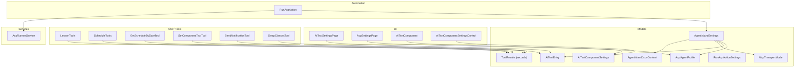
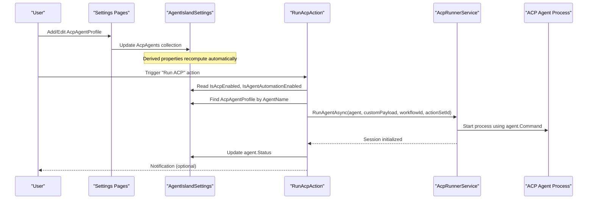
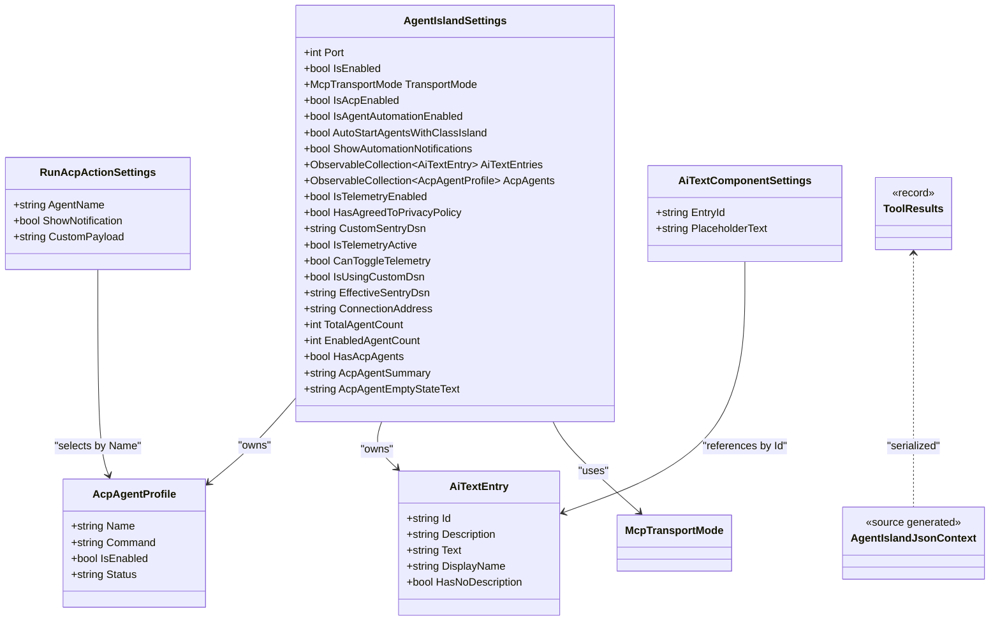

# Data Models and DTOs

<cite>
**Referenced Files in This Document**
- [AgentIslandSettings.cs](file://Models/AgentIslandSettings.cs)
- [AcpAgentProfile.cs](file://Models/AcpAgentProfile.cs)
- [ToolResults.cs](file://Models/ToolResults.cs)
- [AiTextComponentSettings.cs](file://Models/AiTextComponentSettings.cs)
- [AiTextEntry.cs](file://Models/AiTextEntry.cs)
- [McpTransportMode.cs](file://Models/McpTransportMode.cs)
- [RunAcpActionSettings.cs](file://Models/RunAcpActionSettings.cs)
- [AgentIslandJsonContext.cs](file://Models/AgentIslandJsonContext.cs)
- [LessonTools.cs](file://Mcp/Tools/LessonTools.cs)
- [ScheduleTools.cs](file://Mcp/Tools/ScheduleTools.cs)
- [GetScheduleByDateTool.cs](file://Mcp/Tools/GetScheduleByDateTool.cs)
- [SetComponentTextTool.cs](file://Mcp/Tools/SetComponentTextTool.cs)
- [SendNotificationTool.cs](file://Mcp/Tools/SendNotificationTool.cs)
- [SwapClassesTool.cs](file://Mcp/Tools/SwapClassesTool.cs)
- [AcpRunnerService.cs](file://Services/AcpRunnerService.cs)
- [RunAcpAction.cs](file://Automation/RunAcpAction.cs)
- [AiTextComponent.axaml.cs](file://Components/AiTextComponent.axaml.cs)
- [AiTextComponentSettingsControl.axaml.cs](file://Components/AiTextComponentSettingsControl.axaml.cs)
- [AiTextSettingsPage.axaml.cs](file://Views/SettingsPages/AiTextSettingsPage.axaml.cs)
- [AcpSettingsPage.axaml.cs](file://Views/SettingsPages/AcpSettingsPage.axaml.cs)
</cite>

## Table of Contents
1. [Introduction](#introduction)
2. [Project Structure](#project-structure)
3. [Core Components](#core-components)
4. [Architecture Overview](#architecture-overview)
5. [Detailed Component Analysis](#detailed-component-analysis)
6. [Dependency Analysis](#dependency-analysis)
7. [Performance Considerations](#performance-considerations)
8. [Troubleshooting Guide](#troubleshooting-guide)
9. [Conclusion](#conclusion)
10. [Appendices](#appendices)

## Introduction
This document provides comprehensive data model documentation for AgentIsland’s core structures, including configuration settings, agent profiles, API response models, and AI text component models. It details field types, defaults, validation rules, serialization context, type mappings, version compatibility considerations, instantiation examples, validation scenarios, common usage patterns, and relationships across subsystems (settings UI, automation actions, MCP tools, and services).

## Project Structure
The data models are primarily located under the Models directory and are consumed by:
- Settings pages and components (UI binding and user management)
- Automation actions (invoking ACP agents)
- MCP tools (exposing structured results to external clients)
- Services (running and managing agent sessions)

**Diagram sources**
- [AgentIslandSettings.cs:1-394](file://Models/AgentIslandSettings.cs#L1-L394)
- [AcpAgentProfile.cs:1-44](file://Models/AcpAgentProfile.cs#L1-L44)
- [AiTextComponentSettings.cs:1-13](file://Models/AiTextComponentSettings.cs#L1-L13)
- [AiTextEntry.cs:1-31](file://Models/AiTextEntry.cs#L1-L31)
- [ToolResults.cs:1-59](file://Models/ToolResults.cs#L1-L59)
- [McpTransportMode.cs:1-18](file://Models/McpTransportMode.cs#L1-L18)
- [RunAcpActionSettings.cs:1-36](file://Models/RunAcpActionSettings.cs#L1-L36)
- [AgentIslandJsonContext.cs:1-20](file://Models/AgentIslandJsonContext.cs#L1-L20)
- [AiTextSettingsPage.axaml.cs:1-35](file://Views/SettingsPages/AiTextSettingsPage.axaml.cs#L1-L35)
- [AcpSettingsPage.axaml.cs:1-48](file://Views/SettingsPages/AcpSettingsPage.axaml.cs#L1-L48)
- [AiTextComponent.axaml.cs:1-71](file://Components/AiTextComponent.axaml.cs#L1-L71)
- [AiTextComponentSettingsControl.axaml.cs:1-52](file://Components/AiTextComponentSettingsControl.axaml.cs#L1-L52)
- [RunAcpAction.cs:1-83](file://Automation/RunAcpAction.cs#L1-L83)
- [LessonTools.cs:1-145](file://Mcp/Tools/LessonTools.cs#L1-L145)
- [ScheduleTools.cs:1-177](file://Mcp/Tools/ScheduleTools.cs#L1-L177)
- [GetScheduleByDateTool.cs:1-92](file://Mcp/Tools/GetScheduleByDateTool.cs#L1-L92)
- [SetComponentTextTool.cs:1-39](file://Mcp/Tools/SetComponentTextTool.cs#L1-L39)
- [SendNotificationTool.cs:47-79](file://Mcp/Tools/SendNotificationTool.cs#L47-L79)
- [SwapClassesTool.cs:42-74](file://Mcp/Tools/SwapClassesTool.cs#L42-L74)
- [AcpRunnerService.cs:1-77](file://Services/AcpRunnerService.cs#L1-L77)

**Section sources**
- [AgentIslandSettings.cs:1-394](file://Models/AgentIslandSettings.cs#L1-L394)
- [AcpAgentProfile.cs:1-44](file://Models/AcpAgentProfile.cs#L1-L44)
- [AiTextComponentSettings.cs:1-13](file://Models/AiTextComponentSettings.cs#L1-L13)
- [AiTextEntry.cs:1-31](file://Models/AiTextEntry.cs#L1-L31)
- [ToolResults.cs:1-59](file://Models/ToolResults.cs#L1-L59)
- [McpTransportMode.cs:1-18](file://Models/McpTransportMode.cs#L1-L18)
- [RunAcpActionSettings.cs:1-36](file://Models/RunAcpActionSettings.cs#L1-L36)
- [AgentIslandJsonContext.cs:1-20](file://Models/AgentIslandJsonContext.cs#L1-L20)

## Core Components
This section summarizes each key model with its purpose, fields, defaults, constraints, and usage.

### AgentIslandSettings
- Purpose: Central plugin configuration container that wires UI collections and derived properties.
- Key properties:
  - Port (int): Default 5943; used to build ConnectionAddress.
  - IsEnabled (bool): Enables/disables MCP server.
  - TransportMode (enum McpTransportMode): StreamableHttp or SSE; affects endpoint path.
  - IsAcpEnabled (bool): Toggles ACP panel capability.
  - IsAgentAutomationEnabled (bool): Toggles agent-based automation.
  - AutoStartAgentsWithClassIsland (bool): Auto-start behavior on app launch.
  - ShowAutomationNotifications (bool): Controls notification visibility.
  - AiTextEntries (ObservableCollection<AiTextEntry>): Managed list of AI text entries.
  - AcpAgents (ObservableCollection<AcpAgentProfile>): Managed list of agent profiles.
  - IsTelemetryEnabled (bool): Telemetry toggle.
  - HasAgreedToPrivacyPolicy (bool): Privacy agreement flag.
  - CustomSentryDsn (string): Optional custom DSN; if set, bypasses privacy check.
- Derived properties:
  - IsTelemetryActive: Enabled only when telemetry is enabled and either privacy agreed or custom DSN provided.
  - CanToggleTelemetry: True when privacy agreed or custom DSN provided.
  - IsUsingCustomDsn: True when a non-empty custom DSN is set.
  - EffectiveSentryDsn: Returns custom DSN if present, otherwise default from telemetry service.
  - ConnectionAddress: Builds http://localhost:{Port}/{mcp|sse} based on TransportMode.
  - TotalAgentCount, EnabledAgentCount, HasAcpAgents, AcpAgentSummary, AcpAgentEmptyStateText: Aggregates over AcpAgents collection.
- Validation and business rules:
  - Changing Port or TransportMode recomputes ConnectionAddress.
  - When CanToggleTelemetry becomes true and telemetry is disabled, it auto-enables telemetry.
  - Collection change events keep derived counts and summaries in sync.
- Serialization:
  - Uses JsonPropertyName attributes for camelCase JSON keys.
  - Consumed by settings persistence and UI binding.

**Section sources**
- [AgentIslandSettings.cs:1-394](file://Models/AgentIslandSettings.cs#L1-L394)

### AcpAgentProfile
- Purpose: Represents an ACP agent definition with minimal runtime metadata.
- Fields:
  - Name (string): Display name; default placeholder value.
  - Command (string): Executable command line to start the agent process.
  - IsEnabled (bool): Whether the agent can be invoked.
  - Status (string): Human-readable status string updated at runtime.
- Constraints:
  - Command must be non-empty before running; otherwise, execution throws an error.
  - Name is used to locate agents in automation flows.
- Usage:
  - Added via ACP settings page.
  - Referenced by RunAcpAction to find and run a specific agent.
  - Status updated by AcpRunnerService after connection attempts.

**Section sources**
- [AcpAgentProfile.cs:1-44](file://Models/AcpAgentProfile.cs#L1-L44)
- [AcpSettingsPage.axaml.cs:31-48](file://Views/SettingsPages/AcpSettingsPage.axaml.cs#L31-L48)
- [RunAcpAction.cs:47-72](file://Automation/RunAcpAction.cs#L47-L72)
- [AcpRunnerService.cs:35-77](file://Services/AcpRunnerService.cs#L35-L77)

### ToolResults (API Response Records)
- Purpose: Strongly typed, immutable records returned by MCP tools.
- Records:
  - CurrentClassResult: SubjectName, TeacherName, StartTime?, EndTime?, RemainingSeconds, IsInClass.
  - NextClassResult: SubjectName, TeacherName, StartTime?, EndTime?, SecondsUntilStart, HasNextClass.
  - TimeStatusResult: CurrentState, RemainingSeconds, CurrentTime.
  - ScheduleResult: ClassPlanName, Date, List<ScheduleClassEntry>.
  - ScheduleClassEntry: Index, SubjectName, TeacherName, StartTime?, EndTime?, IsChangedClass, IsEnabled.
  - SwapResult: Success, Message.
  - SubjectListResult: List<SubjectEntry>.
  - SubjectEntry: Id, Name, TeacherName, Initial.
  - NotificationResult: Success, Message.
  - SetTextResult: Success, Message.
- Type mapping and serialization:
  - All records are registered in AgentIslandJsonContext with camelCase naming policy.
  - Used as structured outputs for MCP tool calls.
- Business semantics:
  - Time fields use formatted strings where applicable.
  - Boolean flags indicate presence or state (e.g., IsInClass, HasNextClass).

**Section sources**
- [ToolResults.cs:1-59](file://Models/ToolResults.cs#L1-L59)
- [AgentIslandJsonContext.cs:1-20](file://Models/AgentIslandJsonContext.cs#L1-L20)
- [LessonTools.cs:14-145](file://Mcp/Tools/LessonTools.cs#L14-L145)
- [ScheduleTools.cs:15-177](file://Mcp/Tools/ScheduleTools.cs#L15-L177)
- [GetScheduleByDateTool.cs:53-78](file://Mcp/Tools/GetScheduleByDateTool.cs#L53-L78)

### AiTextEntry
- Purpose: Represents a single AI-managed text entry identified by a unique ID.
- Fields:
  - Id (string): Unique identifier for the entry.
  - Description (string): Optional human-friendly description.
  - Text (string): The actual content displayed by the AI text component.
- Computed properties:
  - DisplayName: Falls back to Id when Description is empty.
  - HasNoDescription: Indicates whether Description is empty.
- Behavior:
  - Updates DisplayName and HasNoDescription when Id or Description changes.
- Usage:
  - Managed in AiTextSettingsPage (add/remove).
  - Bound by AiTextComponent and AiTextComponentSettingsControl.
  - Updated via MCP tool set_component_text.

**Section sources**
- [AiTextEntry.cs:1-31](file://Models/AiTextEntry.cs#L1-L31)
- [AiTextSettingsPage.axaml.cs:22-34](file://Views/SettingsPages/AiTextSettingsPage.axaml.cs#L22-L34)
- [AiTextComponent.axaml.cs:40-71](file://Components/AiTextComponent.axaml.cs#L40-L71)
- [AiTextComponentSettingsControl.axaml.cs:29-51](file://Components/AiTextComponentSettingsControl.axaml.cs#L29-L51)
- [SetComponentTextTool.cs:19-39](file://Mcp/Tools/SetComponentTextTool.cs#L19-L39)

### AiTextComponentSettings
- Purpose: Per-instance settings for the AI text component, linking to an AiTextEntry and controlling placeholder display.
- Fields:
  - EntryId (string): References an AiTextEntry.Id.
  - PlaceholderText (string): Shown when resolved text is empty; default placeholder text.
- Behavior:
  - Changes trigger UI updates in AiTextComponent.
- Usage:
  - Configured via AiTextComponentSettingsControl.
  - Consumed by AiTextComponent to resolve final display text.

**Section sources**
- [AiTextComponentSettings.cs:1-13](file://Models/AiTextComponentSettings.cs#L1-L13)
- [AiTextComponentSettingsControl.axaml.cs:35-51](file://Components/AiTextComponentSettingsControl.axaml.cs#L35-L51)
- [AiTextComponent.axaml.cs:36-56](file://Components/AiTextComponent.axaml.cs#L36-L56)

### McpTransportMode
- Purpose: Enumerates supported transport modes for the MCP server.
- Values:
  - StreamableHttp: Modern transport protocol.
  - Sse: Legacy Server-Sent Events transport.
- Impact:
  - Determines endpoint suffix in ConnectionAddress.

**Section sources**
- [McpTransportMode.cs:1-18](file://Models/McpTransportMode.cs#L1-L18)
- [AgentIslandSettings.cs:204-211](file://Models/AgentIslandSettings.cs#L204-L211)

### RunAcpActionSettings
- Purpose: Configuration for the “Run ACP” automation action.
- Fields:
  - AgentName (string): Name of the target AcpAgentProfile.
  - ShowNotification (bool): Whether to show a notification upon execution.
  - CustomPayload (string): Optional payload passed to the agent runner.
- Usage:
  - Consumed by RunAcpAction to select and invoke an agent.

**Section sources**
- [RunAcpActionSettings.cs:1-36](file://Models/RunAcpActionSettings.cs#L1-L36)
- [RunAcpAction.cs:16-83](file://Automation/RunAcpAction.cs#L16-L83)

### AgentIslandJsonContext
- Purpose: Source-generated JSON serializer context for strongly-typed serialization of ToolResults and related lists.
- Options:
  - PropertyNamingPolicy = CamelCase.
- Registered types include all ToolResults records and common collections.

**Section sources**
- [AgentIslandJsonContext.cs:1-20](file://Models/AgentIslandJsonContext.cs#L1-L20)

## Architecture Overview
The data models participate in multiple subsystems:
- Settings and UI: Bind to AgentIslandSettings, AiTextEntry, and AcpAgentProfile.
- Automation: Use RunAcpActionSettings and AgentIslandSettings to validate and execute agent runs.
- MCP Tools: Return structured ToolResults records serialized via AgentIslandJsonContext.
- Services: Manage agent lifecycle and update AcpAgentProfile.Status.

**Diagram sources**
- [AcpSettingsPage.axaml.cs:31-48](file://Views/SettingsPages/AcpSettingsPage.axaml.cs#L31-L48)
- [AgentIslandSettings.cs:275-338](file://Models/AgentIslandSettings.cs#L275-L338)
- [RunAcpAction.cs:29-83](file://Automation/RunAcpAction.cs#L29-L83)
- [AcpRunnerService.cs:25-77](file://Services/AcpRunnerService.cs#L25-L77)

## Detailed Component Analysis

### AgentIslandSettings: Configuration and Derived State
- Field summary and defaults:
  - Port: int, default 5943.
  - IsEnabled: bool, default true.
  - TransportMode: McpTransportMode.StreamableHttp.
  - IsAcpEnabled: bool, default true.
  - IsAgentAutomationEnabled: bool, default true.
  - AutoStartAgentsWithClassIsland: bool, default false.
  - ShowAutomationNotifications: bool, default true.
  - AiTextEntries: ObservableCollection<AiTextEntry>, initialized empty.
  - AcpAgents: ObservableCollection<AcpAgentProfile>, initialized empty.
  - IsTelemetryEnabled: bool, default true.
  - HasAgreedToPrivacyPolicy: bool, default false.
  - CustomSentryDsn: string, default empty.
- Derived logic:
  - ConnectionAddress depends on Port and TransportMode.
  - Telemetry activation requires privacy agreement or custom DSN; auto-enables telemetry when allowed.
  - Collection hooks ensure counts and summaries reflect live changes.
- Validation scenarios:
  - If IsAcpEnabled or IsAgentAutomationEnabled is false, automation actions should reject execution.
  - If CustomSentryDsn is empty, effective DSN falls back to default telemetry service value.
- Common usage patterns:
  - UI binds directly to properties; changes propagate via property change notifications.
  - Collections are manipulated through settings pages; derived properties update automatically.

**Section sources**
- [AgentIslandSettings.cs:14-239](file://Models/AgentIslandSettings.cs#L14-L239)
- [AgentIslandSettings.cs:240-273](file://Models/AgentIslandSettings.cs#L240-L273)
- [AgentIslandSettings.cs:275-338](file://Models/AgentIslandSettings.cs#L275-L338)

### AcpAgentProfile: Agent Definition and Runtime Status
- Field summary and defaults:
  - Name: string, default placeholder.
  - Command: string, required for execution.
  - IsEnabled: bool, default true.
  - Status: string, default disconnected message.
- Validation scenarios:
  - Running an agent without a configured Command throws an error.
  - Automation checks IsEnabled before invoking the agent.
- Common usage patterns:
  - Created via ACP settings page with default values.
  - Status updated after connection attempts by the runner service.

**Section sources**
- [AcpAgentProfile.cs:9-43](file://Models/AcpAgentProfile.cs#L9-L43)
- [AcpRunnerService.cs:35-77](file://Services/AcpRunnerService.cs#L35-L77)
- [RunAcpAction.cs:56-72](file://Automation/RunAcpAction.cs#L56-L72)

### ToolResults: Structured API Responses
- Record definitions and semantics:
  - CurrentClassResult: Describes current class info and remaining time; IsInClass indicates active class.
  - NextClassResult: Describes next class info and seconds until start; HasNextClass indicates availability.
  - TimeStatusResult: Provides normalized state, remaining seconds, and current timestamp.
  - ScheduleResult: Contains plan name, date, and list of classes.
  - ScheduleClassEntry: Individual class entry with index, subject, teacher, times, and flags.
  - SwapResult, NotificationResult, SetTextResult: Simple success/message responses.
  - SubjectListResult and SubjectEntry: Subject catalog with identifiers and initials.
- Serialization:
  - All records are source-generated for efficient serialization with camelCase naming.
- Common usage patterns:
  - Returned by MCP tools get_current_class, get_next_class, get_time_status, get_today_schedule, get_schedule_by_date.
  - Errors wrapped into appropriate result types (e.g., ScheduleResult with error message).

**Section sources**
- [ToolResults.cs:1-59](file://Models/ToolResults.cs#L1-L59)
- [LessonTools.cs:14-145](file://Mcp/Tools/LessonTools.cs#L14-L145)
- [ScheduleTools.cs:15-177](file://Mcp/Tools/ScheduleTools.cs#L15-L177)
- [GetScheduleByDateTool.cs:53-78](file://Mcp/Tools/GetScheduleByDateTool.cs#L53-L78)
- [AgentIslandJsonContext.cs:1-20](file://Models/AgentIslandJsonContext.cs#L1-L20)

### AiTextEntry and AiTextComponentSettings: AI Text Management
- AiTextEntry:
  - Id uniquely identifies the entry; Description is optional and influences DisplayName.
  - Text holds the dynamic content managed by MCP tools.
- AiTextComponentSettings:
  - EntryId links to an AiTextEntry; PlaceholderText controls fallback display.
- Relationships:
  - AiTextComponent reads Plugin.Settings.AiTextEntries and resolves ResolvedText based on Settings.EntryId.
  - AiTextComponentSettingsControl binds EntryComboBox to available entries and updates Settings.EntryId.
- Common usage patterns:
  - Create entries via AiTextSettingsPage; bind them in components via settings control.
  - Update text via MCP tool set_component_text using id and text parameters.

**Section sources**
- [AiTextEntry.cs:1-31](file://Models/AiTextEntry.cs#L1-L31)
- [AiTextComponentSettings.cs:1-13](file://Models/AiTextComponentSettings.cs#L1-L13)
- [AiTextComponent.axaml.cs:40-71](file://Components/AiTextComponent.axaml.cs#L40-L71)
- [AiTextComponentSettingsControl.axaml.cs:29-51](file://Components/AiTextComponentSettingsControl.axaml.cs#L29-L51)
- [AiTextSettingsPage.axaml.cs:22-34](file://Views/SettingsPages/AiTextSettingsPage.axaml.cs#L22-L34)
- [SetComponentTextTool.cs:19-39](file://Mcp/Tools/SetComponentTextTool.cs#L19-L39)

### McpTransportMode: Transport Selection
- Values:
  - StreamableHttp: Preferred modern mode.
  - Sse: Legacy mode.
- Impact:
  - ConnectionAddress endpoint suffix switches between mcp and sse accordingly.

**Section sources**
- [McpTransportMode.cs:1-18](file://Models/McpTransportMode.cs#L1-L18)
- [AgentIslandSettings.cs:204-211](file://Models/AgentIslandSettings.cs#L204-L211)

### RunAcpActionSettings: Automation Action Configuration
- Fields:
  - AgentName selects which AcpAgentProfile to run.
  - ShowNotification toggles UI feedback.
  - CustomPayload passes additional input to the runner.
- Validation scenarios:
  - If no matching agent exists or agent is disabled, execution fails with clear errors.

**Section sources**
- [RunAcpActionSettings.cs:1-36](file://Models/RunAcpActionSettings.cs#L1-L36)
- [RunAcpAction.cs:47-72](file://Automation/RunAcpAction.cs#L47-L72)

## Dependency Analysis
- Model-to-model relationships:
  - AgentIslandSettings owns collections of AcpAgentProfile and AiTextEntry.
  - AiTextComponentSettings references AiTextEntry by Id.
- External dependencies:
  - ToolResults are consumed by MCP tools and serialized via AgentIslandJsonContext.
  - AcpRunnerService updates AcpAgentProfile.Status during lifecycle.
  - Automation validates settings and uses AcpAgentProfile.Command to spawn processes.

**Diagram sources**
- [AgentIslandSettings.cs:14-239](file://Models/AgentIslandSettings.cs#L14-L239)
- [AcpAgentProfile.cs:9-43](file://Models/AcpAgentProfile.cs#L9-L43)
- [AiTextEntry.cs:1-31](file://Models/AiTextEntry.cs#L1-L31)
- [AiTextComponentSettings.cs:1-13](file://Models/AiTextComponentSettings.cs#L1-L13)
- [McpTransportMode.cs:1-18](file://Models/McpTransportMode.cs#L1-L18)
- [RunAcpActionSettings.cs:1-36](file://Models/RunAcpActionSettings.cs#L1-L36)
- [ToolResults.cs:1-59](file://Models/ToolResults.cs#L1-L59)
- [AgentIslandJsonContext.cs:1-20](file://Models/AgentIslandJsonContext.cs#L1-L20)

**Section sources**
- [AgentIslandSettings.cs:14-239](file://Models/AgentIslandSettings.cs#L14-L239)
- [AcpAgentProfile.cs:9-43](file://Models/AcpAgentProfile.cs#L9-L43)
- [AiTextEntry.cs:1-31](file://Models/AiTextEntry.cs#L1-L31)
- [AiTextComponentSettings.cs:1-13](file://Models/AiTextComponentSettings.cs#L1-L13)
- [McpTransportMode.cs:1-18](file://Models/McpTransportMode.cs#L1-L18)
- [RunAcpActionSettings.cs:1-36](file://Models/RunAcpActionSettings.cs#L1-L36)
- [ToolResults.cs:1-59](file://Models/ToolResults.cs#L1-L59)
- [AgentIslandJsonContext.cs:1-20](file://Models/AgentIslandJsonContext.cs#L1-L20)

## Performance Considerations
- Observable collections: Frequent add/remove operations may trigger many property change notifications; batch updates where possible.
- Derived properties: Keep derived computations lightweight; avoid heavy work in OnPropertyChanged handlers.
- Serialization: Using source-generated contexts reduces overhead; prefer precompiled serializers for hot paths.
- UI binding: Avoid excessive bindings to computed properties; cache intermediate values if needed.

## Troubleshooting Guide
- ACP agent not starting:
  - Ensure AcpAgentProfile.Command is non-empty and valid.
  - Verify IsEnabled is true and IsAcpEnabled/IsAgentAutomationEnabled are true in AgentIslandSettings.
- Automation rejected:
  - Check IsAcpEnabled and IsAgentAutomationEnabled flags.
  - Confirm the selected AgentName matches an existing profile.
- Telemetry not active:
  - Set HasAgreedToPrivacyPolicy or provide CustomSentryDsn; IsTelemetryActive will become true and may auto-enable telemetry.
- AI text not updating:
  - Ensure AiTextEntry.Id exists and Settings.EntryId points to it.
  - Verify set_component_text tool call includes correct id and text parameters.

**Section sources**
- [AcpRunnerService.cs:35-77](file://Services/AcpRunnerService.cs#L35-L77)
- [RunAcpAction.cs:35-60](file://Automation/RunAcpAction.cs#L35-L60)
- [AgentIslandSettings.cs:178-200](file://Models/AgentIslandSettings.cs#L178-L200)
- [SetComponentTextTool.cs:19-39](file://Mcp/Tools/SetComponentTextTool.cs#L19-L39)

## Conclusion
AgentIsland’s data models form a cohesive system supporting configuration, agent orchestration, UI binding, and structured API responses. Clear separation between settings, profiles, and results enables robust validation, predictable serialization, and straightforward integration across UI, automation, and MCP layers. Following the documented constraints and usage patterns ensures reliable operation and maintainability.

## Appendices

### Serialization Context and Version Compatibility
- AgentIslandJsonContext enforces camelCase naming for all serialized records.
- Adding new ToolResults records requires registering them in the context to leverage source generation.
- Backward compatibility:
  - New optional fields in records should be nullable to avoid breaking older clients.
  - Preserve existing property names to maintain JSON contract stability.

**Section sources**
- [AgentIslandJsonContext.cs:1-20](file://Models/AgentIslandJsonContext.cs#L1-L20)
- [ToolResults.cs:1-59](file://Models/ToolResults.cs#L1-L59)

### Examples of Model Instantiation and Validation Scenarios
- Creating an ACP agent:
  - Instantiate AcpAgentProfile with Name and Command; add to AgentIslandSettings.AcpAgents via ACP settings page.
  - Validate Command non-empty before running; ensure IsEnabled is true.
- Managing AI text entries:
  - Add AiTextEntry with Id and optional Description; bind via AiTextComponentSettings.EntryId.
  - Update text using set_component_text tool with id and text parameters.
- Querying schedule:
  - Call get_today_schedule or get_schedule_by_date; parse ScheduleResult and ScheduleClassEntry fields.
- Checking current class:
  - Call get_current_class; inspect IsInClass and RemainingSeconds.

**Section sources**
- [AcpSettingsPage.axaml.cs:31-48](file://Views/SettingsPages/AcpSettingsPage.axaml.cs#L31-L48)
- [AiTextSettingsPage.axaml.cs:22-34](file://Views/SettingsPages/AiTextSettingsPage.axaml.cs#L22-L34)
- [SetComponentTextTool.cs:19-39](file://Mcp/Tools/SetComponentTextTool.cs#L19-L39)
- [ScheduleTools.cs:15-177](file://Mcp/Tools/ScheduleTools.cs#L15-L177)
- [GetScheduleByDateTool.cs:53-78](file://Mcp/Tools/GetScheduleByDateTool.cs#L53-L78)
- [LessonTools.cs:14-45](file://Mcp/Tools/LessonTools.cs#L14-L45)