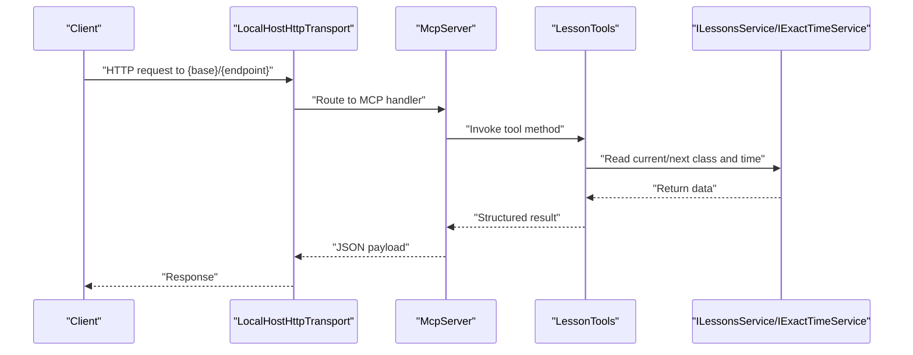
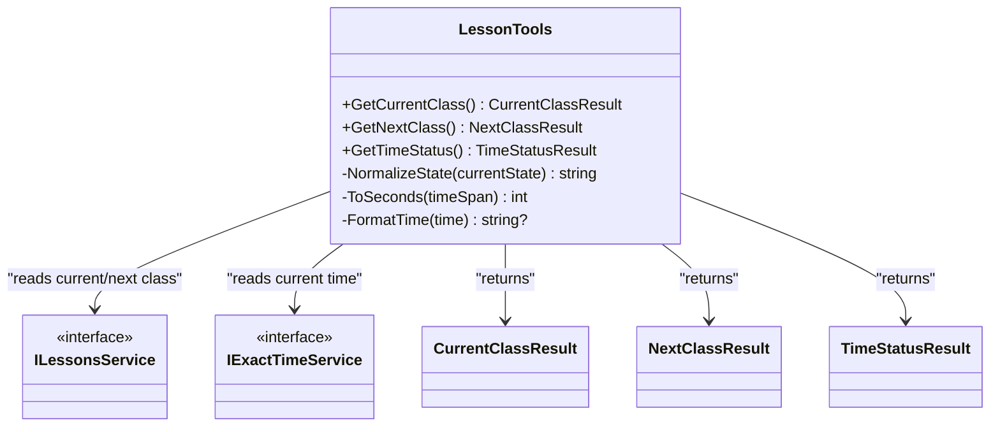

# Lesson Management Tools

<cite>
**Referenced Files in This Document**
- [LessonTools.cs](file://Mcp/Tools/LessonTools.cs)
- [ToolResults.cs](file://Models/ToolResults.cs)
- [McpServerManager.cs](file://Mcp/McpServerManager.cs)
- [Plugin.cs](file://Plugin.cs)
- [AgentIslandSettings.cs](file://Models/AgentIslandSettings.cs)
</cite>

## Table of Contents
1. [Introduction](#introduction)
2. [Project Structure](#project-structure)
3. [Core Components](#core-components)
4. [Architecture Overview](#architecture-overview)
5. [Detailed Component Analysis](#detailed-component-analysis)
6. [Dependency Analysis](#dependency-analysis)
7. [Performance Considerations](#performance-considerations)
8. [Troubleshooting Guide](#troubleshooting-guide)
9. [Conclusion](#conclusion)

## Introduction
This document provides detailed API documentation for the lesson management MCP tools exposed by the AgentIsland plugin. It focuses on three read-only tools:
- get_current_class: Returns current class information including subject name, teacher name, start/end times, remaining time, and active status.
- get_next_class: Provides next class details with countdown seconds until start.
- get_time_status: Returns current time state (InClass, Breaking, AfterSchool), remaining time in seconds, and current timestamp.

These tools are implemented as Model Context Protocol (MCP) server tools and are served over HTTP using a local transport endpoint configured at runtime.

## Project Structure
The lesson management tools are implemented under the Mcp/Tools directory and registered via the MCP server manager. The result models are defined in Models/ToolResults.cs. The server is started by the plugin entry point and exposes an HTTP endpoint based on configuration.

```mermaid
graph TB
subgraph "Plugin"
Plugin["Plugin.cs"]
Settings["AgentIslandSettings.cs"]
end
subgraph "MCP Server"
Manager["McpServerManager.cs"]
Builder["McpServerBuilder<br/>WithTools(...)"]
end
subgraph "Tools"
LessonTools["LessonTools.cs"]
end
subgraph "Models"
Results["ToolResults.cs"]
end
Plugin --> Manager
Plugin --> Settings
Manager --> Builder
Builder --> LessonTools
LessonTools --> Results
```

**Diagram sources**
- [Plugin.cs:55-79](file://Plugin.cs#L55-L79)
- [McpServerManager.cs:41-71](file://Mcp/McpServerManager.cs#L41-L71)
- [LessonTools.cs:12-145](file://Mcp/Tools/LessonTools.cs#L12-L145)
- [ToolResults.cs:1-23](file://Models/ToolResults.cs#L1-L23)

**Section sources**
- [Plugin.cs:55-79](file://Plugin.cs#L55-L79)
- [McpServerManager.cs:41-71](file://Mcp/McpServerManager.cs#L41-L71)
- [LessonTools.cs:12-145](file://Mcp/Tools/LessonTools.cs#L12-L145)
- [ToolResults.cs:1-23](file://Models/ToolResults.cs#L1-L23)

## Core Components
- LessonTools: Implements the three lesson-related MCP tools. Each tool method is annotated to be discoverable by the MCP server and returns strongly-typed result records.
- ToolResults: Defines the response record types used by the tools.
- McpServerManager: Builds and starts the MCP server, registers tools, and configures the HTTP transport endpoint.
- Plugin: Initializes the server during application startup and logs the base connection address.

Key responsibilities:
- Data retrieval from ClassIsland services (lessons and exact time).
- Normalization of internal states into user-friendly labels.
- Formatting of time values and computation of remaining seconds.

**Section sources**
- [LessonTools.cs:12-145](file://Mcp/Tools/LessonTools.cs#L12-L145)
- [ToolResults.cs:1-23](file://Models/ToolResults.cs#L1-L23)
- [McpServerManager.cs:41-71](file://Mcp/McpServerManager.cs#L41-L71)
- [Plugin.cs:55-79](file://Plugin.cs#L55-L79)

## Architecture Overview
The MCP server is hosted locally and serves tools over HTTP. The base endpoint path depends on the selected transport mode:
- Streamable HTTP: /mcp
- SSE: /sse

Each tool is invoked through the MCP protocol; the underlying HTTP transport handles request/response serialization.



**Diagram sources**
- [McpServerManager.cs:53-71](file://Mcp/McpServerManager.cs#L53-L71)
- [LessonTools.cs:22-113](file://Mcp/Tools/LessonTools.cs#L22-L113)

## Detailed Component Analysis

### Base URL and Transport Mode
- Base URL: http://localhost:{Port}/mcp (Streamable HTTP) or http://localhost:{Port}/sse (SSE)
- Port and mode are configurable via settings and logged at startup.

Notes:
- The actual HTTP routing for individual tools is handled by the MCP framework. Clients should use the MCP client library to call tools by name rather than constructing raw HTTP URLs.

**Section sources**
- [Plugin.cs:69-72](file://Plugin.cs#L69-L72)
- [AgentIslandSettings.cs:204-211](file://Models/AgentIslandSettings.cs#L204-L211)
- [McpServerManager.cs:53-67](file://Mcp/McpServerManager.cs#L53-L67)

### Tool: get_current_class
Purpose:
- Returns current class information when a class is active.

Request:
- Method: GET (via MCP transport)
- URL pattern: Not directly constructed by clients; invoke tool by name through the MCP client.
- Parameters: None (read-only)

Response schema:
- SubjectName: string
- TeacherName: string
- StartTime: string? (format hh:mm:ss)
- EndTime: string? (format hh:mm:ss)
- RemainingSeconds: integer (>= 0)
- IsInClass: boolean

Behavior:
- If no class is active, returns empty strings for names, null for times, zero remaining seconds, and false for active status.

Example response:
{
  "SubjectName": "Mathematics",
  "TeacherName": "Alice",
  "StartTime": "08:30:00",
  "EndTime": "09:15:00",
  "RemainingSeconds": 1200,
  "IsInClass": true
}

Error handling:
- No explicit HTTP errors are returned by this tool. In absence of an active class, it returns a neutral “no class” payload.

Usage patterns:
- Classroom automation: Trigger notifications or UI updates when IsInClass becomes true.
- Real-time monitoring: Poll periodically to display remaining time and subject info.

**Section sources**
- [LessonTools.cs:14-45](file://Mcp/Tools/LessonTools.cs#L14-L45)
- [ToolResults.cs:3-9](file://Models/ToolResults.cs#L3-L9)

### Tool: get_next_class
Purpose:
- Returns details about the next scheduled class and the countdown in seconds until its start.

Request:
- Method: GET (via MCP transport)
- URL pattern: Not directly constructed by clients; invoke tool by name through the MCP client.
- Parameters: None (read-only)

Response schema:
- SubjectName: string
- TeacherName: string
- StartTime: string? (format hh:mm:ss)
- EndTime: string? (format hh:mm:ss)
- SecondsUntilStart: integer (>= 0)
- HasNextClass: boolean

Behavior:
- If there is no next class available, returns empty strings for names, null for times, zero countdown, and false for availability.

Example response:
{
  "SubjectName": "Physics",
  "TeacherName": "Bob",
  "StartTime": "09:20:00",
  "EndTime": "10:05:00",
  "SecondsUntilStart": 3600,
  "HasNextClass": true
}

Error handling:
- No explicit HTTP errors are returned by this tool. In absence of a next class, it returns a neutral “no next class” payload.

Usage patterns:
- Countdown timers: Display SecondsUntilStart to prepare students before class.
- Automation: Preload materials or switch device modes ahead of class start.

**Section sources**
- [LessonTools.cs:47-83](file://Mcp/Tools/LessonTools.cs#L47-L83)
- [ToolResults.cs:11-17](file://Models/ToolResults.cs#L11-L17)

### Tool: get_time_status
Purpose:
- Returns the current time state, remaining time in seconds, and the current timestamp.

Request:
- Method: GET (via MCP transport)
- URL pattern: Not directly constructed by clients; invoke tool by name through the MCP client.
- Parameters: None (read-only)

Response schema:
- CurrentState: string (one of "InClass", "Breaking", "AfterSchool")
- RemainingSeconds: integer (>= 0)
- CurrentTime: string (ISO 8601 format)

Behavior:
- RemainingSeconds reflects:
  - OnClassLeftTime when CurrentState is "InClass"
  - OnBreakingTimeLeftTime when CurrentState is "Breaking"
  - Zero otherwise

Example responses:
- During class:
{
  "CurrentState": "InClass",
  "RemainingSeconds": 900,
  "CurrentTime": "2025-01-01T08:45:00.0000000+08:00"
}
- Between classes:
{
  "CurrentState": "Breaking",
  "RemainingSeconds": 300,
  "CurrentTime": "2025-01-01T09:15:00.0000000+08:00"
}
- After school:
{
  "CurrentState": "AfterSchool",
  "RemainingSeconds": 0,
  "CurrentTime": "2025-01-01T17:05:00.0000000+08:00"
}

Error handling:
- No explicit HTTP errors are returned by this tool. It always returns a valid state and non-negative remaining seconds.

Usage patterns:
- Real-time status monitoring: Drive dashboards that reflect InClass/Breaking/AfterSchool transitions.
- Automation: Pause background tasks during class and resume after school.

**Section sources**
- [LessonTools.cs:85-113](file://Mcp/Tools/LessonTools.cs#L85-L113)
- [ToolResults.cs:19-22](file://Models/ToolResults.cs#L19-L22)

## Dependency Analysis
The tools depend on:
- ILessonsService: Provides current and next class subjects and time layout items, plus remaining time counters.
- IExactTimeService: Provides the current local date/time for computing countdowns and timestamps.
- UiThreadHelper: Ensures calls run on the UI thread where required.
- SentryTelemetryService: Optional instrumentation wrapper around tool methods.



**Diagram sources**
- [LessonTools.cs:22-113](file://Mcp/Tools/LessonTools.cs#L22-L113)
- [ToolResults.cs:3-22](file://Models/ToolResults.cs#L3-L22)

**Section sources**
- [LessonTools.cs:22-113](file://Mcp/Tools/LessonTools.cs#L22-L113)
- [ToolResults.cs:3-22](file://Models/ToolResults.cs#L3-L22)

## Performance Considerations
- All three tools are read-only and lightweight, primarily performing service lookups and simple arithmetic.
- Calls are marshaled onto the UI thread to ensure safe access to shared state.
- For high-frequency polling (e.g., real-time dashboards), consider debouncing or throttling client-side requests to avoid excessive load.

[No sources needed since this section provides general guidance]

## Troubleshooting Guide
Common issues and resolutions:
- Server not reachable:
  - Ensure the plugin is enabled and the MCP server has started successfully. Check the logged base URL and port.
- Incorrect transport endpoint:
  - Verify whether Streamable HTTP (/mcp) or SSE (/sse) is configured. Use the correct base URL accordingly.
- Empty results:
  - get_current_class may return empty fields if no class is active.
  - get_next_class may return no next class if none is scheduled.
  - get_time_status will report AfterSchool with zero remaining seconds outside class hours.

Operational checks:
- Confirm the server started without exceptions and log messages indicate success.
- Validate that the configured port is not blocked by firewall rules.

**Section sources**
- [Plugin.cs:69-78](file://Plugin.cs#L69-L78)
- [McpServerManager.cs:76-81](file://Mcp/McpServerManager.cs#L76-L81)

## Conclusion
The lesson management MCP tools provide concise, structured insights into the current and upcoming schedule and overall time state. They are designed for easy integration into classroom automation workflows and real-time monitoring systems. By leveraging the MCP client library and the documented response schemas, developers can build robust integrations that react dynamically to class transitions and countdowns.

[No sources needed since this section summarizes without analyzing specific files]