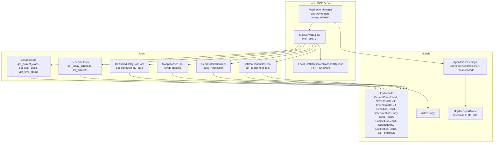
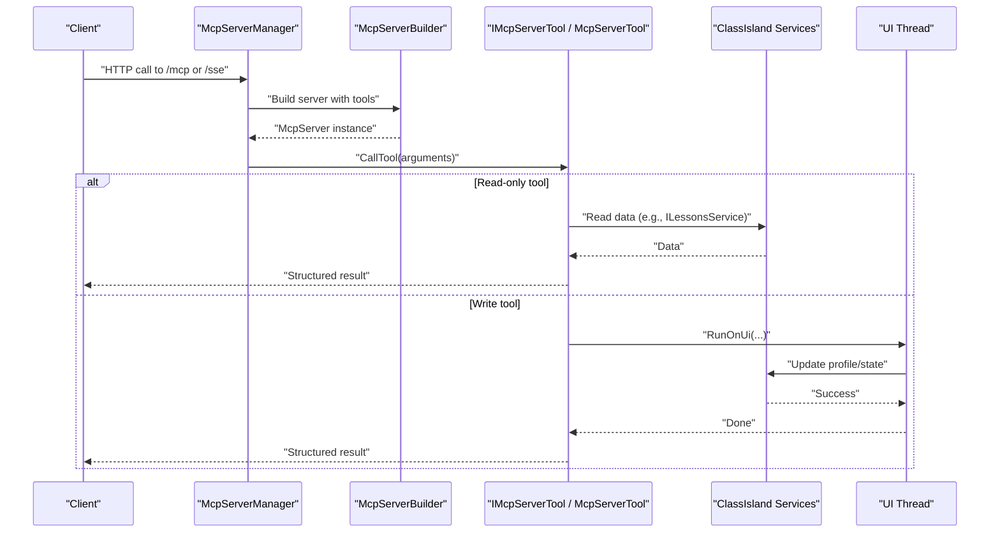
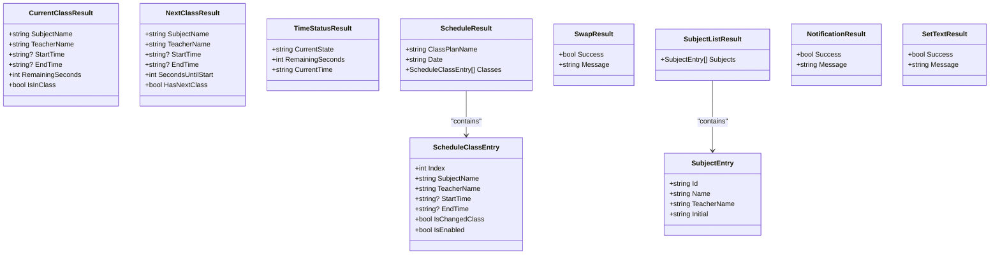
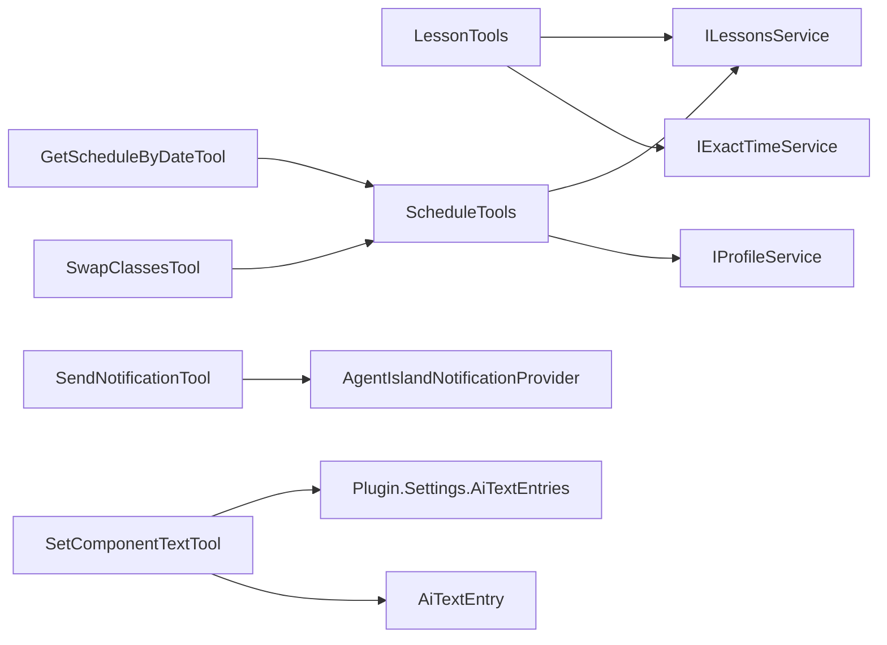

# MCP Tools API

<cite>
**Referenced Files in This Document**
- [McpServerManager.cs](file://Mcp/McpServerManager.cs)
- [LessonTools.cs](file://Mcp/Tools/LessonTools.cs)
- [ScheduleTools.cs](file://Mcp/Tools/ScheduleTools.cs)
- [GetScheduleByDateTool.cs](file://Mcp/Tools/GetScheduleByDateTool.cs)
- [SwapClassesTool.cs](file://Mcp/Tools/SwapClassesTool.cs)
- [SendNotificationTool.cs](file://Mcp/Tools/SendNotificationTool.cs)
- [SetComponentTextTool.cs](file://Mcp/Tools/SetComponentTextTool.cs)
- [AgentIslandNotificationProvider.cs](file://Mcp/Tools/AgentIslandNotificationProvider.cs)
- [ToolResults.cs](file://Models/ToolResults.cs)
- [AiTextEntry.cs](file://Models/AiTextEntry.cs)
- [AgentIslandSettings.cs](file://Models/AgentIslandSettings.cs)
- [McpTransportMode.cs](file://Models/McpTransportMode.cs)
</cite>

## Table of Contents
1. [Introduction](#introduction)
2. [Project Structure](#project-structure)
3. [Core Components](#core-components)
4. [Architecture Overview](#architecture-overview)
5. [Detailed Component Analysis](#detailed-component-analysis)
6. [Dependency Analysis](#dependency-analysis)
7. [Performance Considerations](#performance-considerations)
8. [Troubleshooting Guide](#troubleshooting-guide)
9. [Conclusion](#conclusion)
10. [Appendices](#appendices)

## Introduction
This document provides comprehensive API documentation for AgentIsland’s Model Context Protocol (MCP) tools. It covers lesson management, schedule management, notifications, and component control endpoints exposed by the local MCP server. For each tool, it specifies:
- Tool name and purpose
- Transport mode and URL patterns
- Request parameters with types and validation rules
- Response schemas with field descriptions
- Error handling behavior
- JSON request/response examples
- Authentication requirements
- Rate limiting information
- Common usage patterns
- ToolResults models and their relationships to responses

The MCP server runs locally on a configurable port and supports two transport modes: Streamable HTTP and Server-Sent Events (SSE).

## Project Structure
AgentIsland exposes MCP tools via a local HTTP server. The server is configured through settings and registers multiple tool classes that implement or decorate MCP tool functionality.

**Diagram sources**
- [McpServerManager.cs:25-82](file://Mcp/McpServerManager.cs#L25-L82)
- [LessonTools.cs:14-146](file://Mcp/Tools/LessonTools.cs#L14-L146)
- [ScheduleTools.cs:15-204](file://Mcp/Tools/ScheduleTools.cs#L15-L204)
- [GetScheduleByDateTool.cs:16-92](file://Mcp/Tools/GetScheduleByDateTool.cs#L16-L92)
- [SwapClassesTool.cs:16-103](file://Mcp/Tools/SwapClassesTool.cs#L16-L103)
- [SendNotificationTool.cs:16-137](file://Mcp/Tools/SendNotificationTool.cs#L16-L137)
- [SetComponentTextTool.cs:17-92](file://Mcp/Tools/SetComponentTextTool.cs#L17-L92)
- [ToolResults.cs:1-59](file://Models/ToolResults.cs#L1-L59)
- [AiTextEntry.cs:1-31](file://Models/AiTextEntry.cs#L1-L31)
- [AgentIslandSettings.cs:34-211](file://Models/AgentIslandSettings.cs#L34-L211)
- [McpTransportMode.cs:1-18](file://Models/McpTransportMode.cs#L1-L18)

**Section sources**
- [McpServerManager.cs:25-82](file://Mcp/McpServerManager.cs#L25-L82)
- [AgentIslandSettings.cs:34-211](file://Models/AgentIslandSettings.cs#L34-L211)
- [McpTransportMode.cs:1-18](file://Models/McpTransportMode.cs#L1-L18)

## Core Components
- LessonTools: Provides read-only tools for current class, next class, and time status.
- ScheduleTools: Provides read-only tools for today’s schedule and subject listing; also contains logic used by swap and date-based schedule retrieval.
- GetScheduleByDateTool: Exposes a tool to retrieve a schedule for a specific date.
- SwapClassesTool: Exposes a tool to swap two classes on a given date.
- SendNotificationTool: Exposes a tool to display a notification overlay in the UI.
- SetComponentTextTool: Exposes a tool to update text displayed by an AI text component identified by ID.
- ToolResults: Defines structured response models for all tools.

Key behaviors:
- All tools are registered with the MCP server builder and serialized using a shared JSON context.
- Read-only tools are annotated as such; write operations are marked non-idempotent where applicable.
- Some tools execute UI-bound operations on the UI thread.

**Section sources**
- [LessonTools.cs:14-146](file://Mcp/Tools/LessonTools.cs#L14-L146)
- [ScheduleTools.cs:15-204](file://Mcp/Tools/ScheduleTools.cs#L15-L204)
- [GetScheduleByDateTool.cs:16-92](file://Mcp/Tools/GetScheduleByDateTool.cs#L16-L92)
- [SwapClassesTool.cs:16-103](file://Mcp/Tools/SwapClassesTool.cs#L16-L103)
- [SendNotificationTool.cs:16-137](file://Mcp/Tools/SendNotificationTool.cs#L16-L137)
- [SetComponentTextTool.cs:17-92](file://Mcp/Tools/SetComponentTextTool.cs#L17-L92)
- [ToolResults.cs:1-59](file://Models/ToolResults.cs#L1-L59)

## Architecture Overview
The MCP server listens locally and routes tool calls to the appropriate handler. Depending on the configured transport mode, the endpoint path differs.

**Diagram sources**
- [McpServerManager.cs:25-82](file://Mcp/McpServerManager.cs#L25-L82)
- [LessonTools.cs:14-146](file://Mcp/Tools/LessonTools.cs#L14-L146)
- [ScheduleTools.cs:15-204](file://Mcp/Tools/ScheduleTools.cs#L15-L204)
- [SendNotificationTool.cs:16-137](file://Mcp/Tools/SendNotificationTool.cs#L16-L137)
- [SetComponentTextTool.cs:17-92](file://Mcp/Tools/SetComponentTextTool.cs#L17-L92)

## Detailed Component Analysis

### General Connection Information
- Localhost only.
- Default port: 5943.
- Transport modes:
  - Streamable HTTP: endpoint path “mcp”
  - SSE: endpoint path “sse”
- Base URLs:
  - Streamable HTTP: http://localhost:{port}/mcp
  - SSE: http://localhost:{port}/sse

These are derived from configuration properties and transport selection.

**Section sources**
- [AgentIslandSettings.cs:34-211](file://Models/AgentIslandSettings.cs#L34-L211)
- [McpTransportMode.cs:1-18](file://Models/McpTransportMode.cs#L1-L18)
- [McpServerManager.cs:53-67](file://Mcp/McpServerManager.cs#L53-L67)

### Authentication
- No authentication is implemented for the local MCP server. Calls originate from localhost.

[No sources needed since this section summarizes behavior without analyzing specific files]

### Rate Limiting
- No rate limiting is implemented in the server or tools.

[No sources needed since this section summarizes behavior without analyzing specific files]

---

### Lesson Management Tools

#### get_current_class
- Purpose: Returns information about the currently active class, if any.
- Transport: Streamable HTTP or SSE (same tool name across transports).
- Method: As defined by MCP protocol over HTTP (tool invocation).
- URL pattern: http://localhost:{port}/mcp or http://localhost:{port}/sse
- Parameters: None.
- Response schema: CurrentClassResult
  - SubjectName: string
  - TeacherName: string
  - StartTime: string? formatted as hh:mm:ss
  - EndTime: string? formatted as hh:mm:ss
  - RemainingSeconds: int seconds remaining in class (non-negative)
  - IsInClass: bool true when a class is active
- Example response:
  {
    "SubjectName": "Mathematics",
    "TeacherName": "Alice",
    "StartTime": "09:00:00",
    "EndTime": "09:45:00",
    "RemainingSeconds": 1200,
    "IsInClass": true
  }
- Errors: None expected; returns empty fields when no class is active.

**Section sources**
- [LessonTools.cs:14-45](file://Mcp/Tools/LessonTools.cs#L14-L45)
- [ToolResults.cs:3-9](file://Models/ToolResults.cs#L3-L9)

#### get_next_class
- Purpose: Returns information about the next scheduled class.
- Parameters: None.
- Response schema: NextClassResult
  - SubjectName: string
  - TeacherName: string
  - StartTime: string? hh:mm:ss
  - EndTime: string? hh:mm:ss
  - SecondsUntilStart: int seconds until start (non-negative)
  - HasNextClass: bool true if a next class exists
- Example response:
  {
    "SubjectName": "Physics",
    "TeacherName": "Bob",
    "StartTime": "10:00:00",
    "EndTime": "10:45:00",
    "SecondsUntilStart": 3600,
    "HasNextClass": true
  }

**Section sources**
- [LessonTools.cs:47-83](file://Mcp/Tools/LessonTools.cs#L47-L83)
- [ToolResults.cs:11-17](file://Models/ToolResults.cs#L11-L17)

#### get_time_status
- Purpose: Returns the current state and remaining time.
- Parameters: None.
- Response schema: TimeStatusResult
  - CurrentState: string normalized state (e.g., InClass, Breaking, AfterSchool)
  - RemainingSeconds: int seconds remaining in current period (non-negative)
  - CurrentTime: string ISO 8601 local time
- Example response:
  {
    "CurrentState": "InClass",
    "RemainingSeconds": 1200,
    "CurrentTime": "2026-06-19T09:20:00.0000000+08:00"
  }

**Section sources**
- [LessonTools.cs:85-113](file://Mcp/Tools/LessonTools.cs#L85-L113)
- [ToolResults.cs:19-22](file://Models/ToolResults.cs#L19-L22)

---

### Schedule Management Tools

#### get_today_schedule
- Purpose: Returns today’s schedule based on the current class plan.
- Parameters: None.
- Response schema: ScheduleResult
  - ClassPlanName: string
  - Date: string yyyy-MM-dd
  - Classes: list of ScheduleClassEntry
- ScheduleClassEntry fields:
  - Index: int zero-based index
  - SubjectName: string
  - TeacherName: string
  - StartTime: string? hh:mm:ss
  - EndTime: string? hh:mm:ss
  - IsChangedClass: bool indicates overridden class
  - IsEnabled: bool indicates whether the class is enabled
- Example response:
  {
    "ClassPlanName": "Monday Plan",
    "Date": "2026-06-19",
    "Classes": [
      {
        "Index": 0,
        "SubjectName": "Mathematics",
        "TeacherName": "Alice",
        "StartTime": "09:00:00",
        "EndTime": "09:45:00",
        "IsChangedClass": false,
        "IsEnabled": true
      }
    ]
  }

**Section sources**
- [ScheduleTools.cs:15-39](file://Mcp/Tools/ScheduleTools.cs#L15-L39)
- [ToolResults.cs:24-36](file://Models/ToolResults.cs#L24-L36)

#### get_schedule_by_date
- Purpose: Returns the schedule for a specified date.
- Parameters:
  - date: string required, format yyyy-MM-dd (e.g., 2026-06-19)
- Validation:
  - If missing or invalid, throws argument error which is caught and returned as an error payload.
- Response schema: ScheduleResult (same as above)
- Example request:
  {
    "date": "2026-06-19"
  }
- Example success response:
  {
    "ClassPlanName": "Friday Plan",
    "Date": "2026-06-19",
    "Classes": []
  }
- Example error response (invalid date):
  {
    "ClassPlanName": "Error: Invalid date format. Use yyyy-MM-dd.",
    "Date": "",
    "Classes": []
  }

**Section sources**
- [GetScheduleByDateTool.cs:16-92](file://Mcp/Tools/GetScheduleByDateTool.cs#L16-L92)
- [ScheduleTools.cs:41-56](file://Mcp/Tools/ScheduleTools.cs#L41-L56)
- [ToolResults.cs:24-36](file://Models/ToolResults.cs#L24-L36)

#### list_subjects
- Purpose: Lists all subjects available in the profile.
- Parameters: None.
- Response schema: SubjectListResult
  - Subjects: list of SubjectEntry
- SubjectEntry fields:
  - Id: string GUID
  - Name: string
  - TeacherName: string
  - Initial: string
- Example response:
  {
    "Subjects": [
      {
        "Id": "a1b2c3d4-e5f6-7890-abcd-ef1234567890",
        "Name": "Mathematics",
        "TeacherName": "Alice",
        "Initial": "M"
      }
    ]
  }

**Section sources**
- [ScheduleTools.cs:105-131](file://Mcp/Tools/ScheduleTools.cs#L105-L131)
- [ToolResults.cs:42-49](file://Models/ToolResults.cs#L42-L49)

#### swap_classes
- Purpose: Swaps two classes on a given date by creating or reusing a temporary overlay class plan.
- Parameters:
  - classIndex1: integer required, zero-based index
  - classIndex2: integer required, zero-based index
  - date: string optional, yyyy-MM-dd; empty string means today
- Validation:
  - Indices must be within range of the day’s classes.
  - If no class plan exists for the date, returns failure message.
- Response schema: SwapResult
  - Success: boolean
  - Message: string human-readable status
- Example request:
  {
    "classIndex1": 0,
    "classIndex2": 1,
    "date": "2026-06-19"
  }
- Example success response:
  {
    "Success": true,
    "Message": "Classes swapped successfully."
  }
- Example error response (out-of-range indices):
  {
    "Success": false,
    "Message": "Class index is out of range."
  }

Notes:
- The operation modifies the profile by creating or updating a temporary overlay class plan and persists changes.

**Section sources**
- [SwapClassesTool.cs:16-103](file://Mcp/Tools/SwapClassesTool.cs#L16-L103)
- [ScheduleTools.cs:58-103](file://Mcp/Tools/ScheduleTools.cs#L58-L103)
- [ToolResults.cs:38-40](file://Models/ToolResults.cs#L38-L40)

---

### Notification Tools

#### send_notification
- Purpose: Displays a notification overlay in the UI with optional body text and durations.
- Parameters:
  - message: string required; main title/mask text
  - body: string optional; detailed content
  - maskDuration: number optional; seconds for mask display (default 3.0)
  - overlayDuration: number optional; seconds for overlay display (default 5.0)
- Validation:
  - message is required and must be a string.
  - Optional parameters default if omitted.
- Response schema: NotificationResult
  - Success: boolean
  - Message: string human-readable status
- Example request:
  {
    "message": "Upcoming class reminder",
    "body": "Mathematics starts in 5 minutes",
    "maskDuration": 4.0,
    "overlayDuration": 6.0
  }
- Example success response:
  {
    "Success": true,
    "Message": "Notification sent successfully."
  }
- Example error response (provider not initialized):
  {
    "Success": false,
    "Message": "Notification provider is not initialized yet."
  }

Behavior:
- Uses the notification provider to show a mask and optional overlay content on the UI thread.

**Section sources**
- [SendNotificationTool.cs:16-137](file://Mcp/Tools/SendNotificationTool.cs#L16-L137)
- [AgentIslandNotificationProvider.cs:12-52](file://Mcp/Tools/AgentIslandNotificationProvider.cs#L12-L52)
- [ToolResults.cs:51-53](file://Models/ToolResults.cs#L51-L53)

---

### Component Control Tools

#### set_component_text
- Purpose: Updates the text shown by an AI text component identified by its ID.
- Parameters:
  - id: string required; component identifier
  - text: string required; new text content
- Behavior:
  - If the entry exists, updates its text.
  - If not, creates a new entry with the provided id and text.
- Response schema: SetTextResult
  - Success: boolean
  - Message: string human-readable status
- Example request:
  {
    "id": "status-banner",
    "text": "Exam week schedule active"
  }
- Example success response:
  {
    "Success": true,
    "Message": "Text updated."
  }

Persistence:
- Entries are stored in plugin settings and can be managed via the UI settings page.

**Section sources**
- [SetComponentTextTool.cs:17-92](file://Mcp/Tools/SetComponentTextTool.cs#L17-L92)
- [AiTextEntry.cs:1-31](file://Models/AiTextEntry.cs#L1-L31)
- [ToolResults.cs:55-57](file://Models/ToolResults.cs#L55-L57)

---

### ToolResults Models and Relationships
All tools return structured results defined in ToolResults. These records map directly to JSON payloads returned by the MCP server.

**Diagram sources**
- [ToolResults.cs:1-59](file://Models/ToolResults.cs#L1-L59)

**Section sources**
- [ToolResults.cs:1-59](file://Models/ToolResults.cs#L1-L59)

## Dependency Analysis
The following diagram shows how tools depend on services and models during execution.

**Diagram sources**
- [LessonTools.cs:22-45](file://Mcp/Tools/LessonTools.cs#L22-L45)
- [LessonTools.cs:55-83](file://Mcp/Tools/LessonTools.cs#L55-L83)
- [LessonTools.cs:93-113](file://Mcp/Tools/LessonTools.cs#L93-L113)
- [ScheduleTools.cs:23-39](file://Mcp/Tools/ScheduleTools.cs#L23-L39)
- [ScheduleTools.cs:41-56](file://Mcp/Tools/ScheduleTools.cs#L41-L56)
- [ScheduleTools.cs:58-103](file://Mcp/Tools/ScheduleTools.cs#L58-L103)
- [GetScheduleByDateTool.cs:53-78](file://Mcp/Tools/GetScheduleByDateTool.cs#L53-L78)
- [SwapClassesTool.cs:63-80](file://Mcp/Tools/SwapClassesTool.cs#L63-L80)
- [SendNotificationTool.cs:85-96](file://Mcp/Tools/SendNotificationTool.cs#L85-L96)
- [SetComponentTextTool.cs:56-65](file://Mcp/Tools/SetComponentTextTool.cs#L56-L65)
- [AiTextEntry.cs:1-31](file://Models/AiTextEntry.cs#L1-L31)

**Section sources**
- [LessonTools.cs:14-146](file://Mcp/Tools/LessonTools.cs#L14-L146)
- [ScheduleTools.cs:15-204](file://Mcp/Tools/ScheduleTools.cs#L15-L204)
- [GetScheduleByDateTool.cs:16-92](file://Mcp/Tools/GetScheduleByDateTool.cs#L16-L92)
- [SwapClassesTool.cs:16-103](file://Mcp/Tools/SwapClassesTool.cs#L16-L103)
- [SendNotificationTool.cs:16-137](file://Mcp/Tools/SendNotificationTool.cs#L16-L137)
- [SetComponentTextTool.cs:17-92](file://Mcp/Tools/SetComponentTextTool.cs#L17-L92)
- [AiTextEntry.cs:1-31](file://Models/AiTextEntry.cs#L1-L31)

## Performance Considerations
- UI-bound operations: Several tools run on the UI thread to access UI-related services safely. Avoid excessive concurrent calls to prevent UI thread contention.
- Profile persistence: Swap operations save the profile; batch operations should be minimized to reduce I/O overhead.
- Time calculations: Time computations are lightweight but rely on exact time services; ensure system clock accuracy for correct countdowns.

[No sources needed since this section provides general guidance]

## Troubleshooting Guide
Common issues and resolutions:
- Invalid date format for get_schedule_by_date: Ensure the date parameter uses yyyy-MM-dd. Errors are returned as a ScheduleResult with an error message in the ClassPlanName field.
- Missing required parameters:
  - send_notification requires message.
  - set_component_text requires both id and text.
  - swap_classes requires classIndex1 and classIndex2.
- Out-of-range indices for swap_classes: Verify indices against the length of the day’s classes.
- Notification provider not initialized: send_notification may fail if the provider is not ready; retry after initialization.
- No class plan found: swap_classes returns a failure message if there is no class plan for the specified date.

**Section sources**
- [GetScheduleByDateTool.cs:71-78](file://Mcp/Tools/GetScheduleByDateTool.cs#L71-L78)
- [SwapClassesTool.cs:71-80](file://Mcp/Tools/SwapClassesTool.cs#L71-L80)
- [ScheduleTools.cs:70-103](file://Mcp/Tools/ScheduleTools.cs#L70-L103)
- [SendNotificationTool.cs:85-96](file://Mcp/Tools/SendNotificationTool.cs#L85-L96)

## Conclusion
AgentIsland’s MCP tools provide a concise, structured interface for querying and modifying schedule data, retrieving real-time class status, sending notifications, and controlling UI components. The server operates locally with no authentication and no rate limiting. Clients should respect parameter validation rules and handle structured error responses appropriately.

[No sources needed since this section summarizes without analyzing specific files]

## Appendices

### Endpoint Summary
- Transport modes:
  - Streamable HTTP: http://localhost:{port}/mcp
  - SSE: http://localhost:{port}/sse
- Tool names (transport-agnostic):
  - get_current_class
  - get_next_class
  - get_time_status
  - get_today_schedule
  - get_schedule_by_date
  - list_subjects
  - swap_classes
  - send_notification
  - set_component_text

**Section sources**
- [McpServerManager.cs:53-67](file://Mcp/McpServerManager.cs#L53-L67)
- [AgentIslandSettings.cs:204-211](file://Models/AgentIslandSettings.cs#L204-L211)
- [McpTransportMode.cs:1-18](file://Models/McpTransportMode.cs#L1-L18)