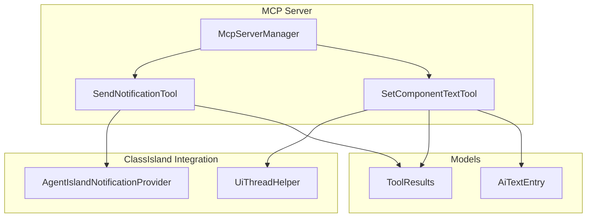
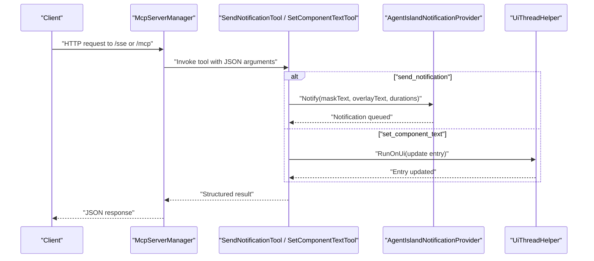
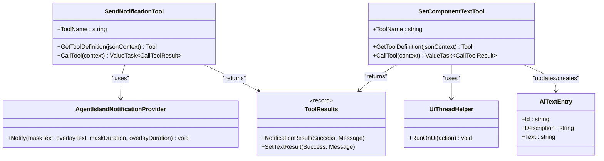

# Notification and Component Tools

<cite>
**Referenced Files in This Document**
- [SendNotificationTool.cs](file://Mcp/Tools/SendNotificationTool.cs)
- [SetComponentTextTool.cs](file://Mcp/Tools/SetComponentTextTool.cs)
- [AgentIslandNotificationProvider.cs](file://Mcp/Tools/AgentIslandNotificationProvider.cs)
- [McpServerManager.cs](file://Mcp/McpServerManager.cs)
- [Plugin.cs](file://Plugin.cs)
- [ToolResults.cs](file://Models/ToolResults.cs)
- [AiTextEntry.cs](file://Models/AiTextEntry.cs)
- [UiThreadHelper.cs](file://Helpers/UiThreadHelper.cs)
- [McpTransportMode.cs](file://Models/McpTransportMode.cs)
</cite>

## Table of Contents
1. [Introduction](#introduction)
2. [Project Structure](#project-structure)
3. [Core Components](#core-components)
4. [Architecture Overview](#architecture-overview)
5. [Detailed Component Analysis](#detailed-component-analysis)
6. [Dependency Analysis](#dependency-analysis)
7. [Performance Considerations](#performance-considerations)
8. [Troubleshooting Guide](#troubleshooting-guide)
9. [Conclusion](#conclusion)
10. [Appendices](#appendices)

## Introduction
This document provides detailed API documentation for two Model Context Protocol (MCP) tools exposed by the AgentIsland plugin:
- send_notification: Sends notifications through ClassIsland’s notification system with configurable mask text, overlay body, and display durations.
- set_component_text: Updates dynamic AI Text components on the ClassIsland UI by component ID.

The MCP server is hosted locally and can operate in two transport modes: Streamable HTTP or Server-Sent Events (SSE). The endpoints are served under a local host base URL with mode-specific paths.

## Project Structure
The relevant implementation is organized as follows:
- Mcp/Tools: Contains tool implementations and the notification provider integration.
- Models: Defines result types and settings used by tools.
- Helpers: Provides UI thread marshalling utilities.
- Plugin entrypoint initializes services and starts the MCP server.

**Diagram sources**
- [McpServerManager.cs:41-51](file://Mcp/McpServerManager.cs#L41-L51)
- [SendNotificationTool.cs:16-66](file://Mcp/Tools/SendNotificationTool.cs#L16-L66)
- [SetComponentTextTool.cs:17-39](file://Mcp/Tools/SetComponentTextTool.cs#L17-L39)
- [AgentIslandNotificationProvider.cs:12-26](file://Mcp/Tools/AgentIslandNotificationProvider.cs#L12-L26)
- [UiThreadHelper.cs:5-24](file://Helpers/UiThreadHelper.cs#L5-L24)
- [ToolResults.cs:51-57](file://Models/ToolResults.cs#L51-L57)
- [AiTextEntry.cs:5-14](file://Models/AiTextEntry.cs#L5-L14)

**Section sources**
- [McpServerManager.cs:25-82](file://Mcp/McpServerManager.cs#L25-L82)
- [Plugin.cs:55-79](file://Plugin.cs#L55-L79)

## Core Components
- SendNotificationTool: Implements the send_notification tool. Validates input parameters, logs telemetry, and delegates to AgentIslandNotificationProvider to show a notification via ClassIsland channels. Returns a structured result indicating success or failure.
- SetComponentTextTool: Implements the set_component_text tool. Validates required parameters id and text, then updates or creates an AI Text entry in the plugin settings using UiThreadHelper to ensure UI-thread safety. Returns a structured result.

Key behaviors:
- Input validation enforces required fields and types.
- Errors are captured via telemetry and returned as structured results.
- Both tools use structured JSON responses defined in models.

**Section sources**
- [SendNotificationTool.cs:16-105](file://Mcp/Tools/SendNotificationTool.cs#L16-L105)
- [SetComponentTextTool.cs:17-91](file://Mcp/Tools/SetComponentTextTool.cs#L17-L91)
- [ToolResults.cs:51-57](file://Models/ToolResults.cs#L51-L57)

## Architecture Overview
The MCP server exposes tools over HTTP. Depending on configuration, it uses either SSE or Streamable HTTP endpoints. Clients call tools via the MCP protocol; the server routes calls to the corresponding tool implementations.

**Diagram sources**
- [McpServerManager.cs:53-71](file://Mcp/McpServerManager.cs#L53-L71)
- [SendNotificationTool.cs:68-105](file://Mcp/Tools/SendNotificationTool.cs#L68-L105)
- [SetComponentTextTool.cs:41-72](file://Mcp/Tools/SetComponentTextTool.cs#L41-L72)
- [AgentIslandNotificationProvider.cs:27-50](file://Mcp/Tools/AgentIslandNotificationProvider.cs#L27-L50)
- [UiThreadHelper.cs:14-23](file://Helpers/UiThreadHelper.cs#L14-L23)

## Detailed Component Analysis

### Tool: send_notification
Purpose:
- Display a notification in ClassIsland with a mask message and optional overlay body, with configurable durations.

HTTP transport and endpoints:
- Base URL: http://localhost:{port}
- Transport modes:
  - SSE: path "/sse"
  - Streamable HTTP: path "/mcp"
- Method: POST (MCP tool invocation)
- Endpoint pattern: http://localhost:{port}/sse or http://localhost:{port}/mcp
- Content-Type: application/json
- Request body: JSON object containing tool name and parameters per MCP protocol conventions.

Request parameters:
- message (string, required): Mask text displayed prominently.
- body (string, optional): Overlay content shown after the mask.
- maskDuration (number, optional): Mask display duration in seconds. Default 3.0.
- overlayDuration (number, optional): Overlay display duration in seconds. Default 5.0.

Validation rules:
- message must be present and a string.
- body must be a string if provided.
- maskDuration and overlayDuration must be numbers if provided.
- No explicit length limits are enforced at the tool layer; values are passed through to the notification provider.

Response schema:
- Structured JSON with fields:
  - Success (boolean): Operation status.
  - Message (string): Human-readable status or error details.

Error handling:
- Missing or invalid required parameter message raises an argument error.
- If the notification provider is not initialized, returns a failure result with a descriptive message.
- Exceptions are captured via telemetry and returned as failure results.

JSON examples:
- Request example:
  {
    "tool": "send_notification",
    "arguments": {
      "message": "Meeting in 5 minutes",
      "body": "Join link: https://example.com",
      "maskDuration": 3.0,
      "overlayDuration": 5.0
    }
  }
- Success response example:
  {
    "Success": true,
    "Message": "Notification sent successfully."
  }
- Failure response example:
  {
    "Success": false,
    "Message": "Notification provider is not initialized yet."
  }

Integration patterns:
- Automated messaging systems can trigger notifications based on external events (e.g., calendar reminders, CI/CD pipeline statuses).
- Use overlayDuration to control how long the detailed message remains visible.
- For high-frequency notifications, consider batching or throttling client-side to avoid UI flooding.

**Section sources**
- [SendNotificationTool.cs:18-66](file://Mcp/Tools/SendNotificationTool.cs#L18-L66)
- [SendNotificationTool.cs:68-105](file://Mcp/Tools/SendNotificationTool.cs#L68-L105)
- [AgentIslandNotificationProvider.cs:27-50](file://Mcp/Tools/AgentIslandNotificationProvider.cs#L27-L50)
- [McpServerManager.cs:53-71](file://Mcp/McpServerManager.cs#L53-L71)
- [Plugin.cs:69-72](file://Plugin.cs#L69-L72)

### Tool: set_component_text
Purpose:
- Update the text of a dynamic AI Text component identified by its ID. If the ID does not exist, a new entry is created.

HTTP transport and endpoints:
- Base URL: http://localhost:{port}
- Transport modes:
  - SSE: path "/sse"
  - Streamable HTTP: path "/mcp"
- Method: POST (MCP tool invocation)
- Endpoint pattern: http://localhost:{port}/sse or http://localhost:{port}/mcp
- Content-Type: application/json
- Request body: JSON object containing tool name and parameters per MCP protocol conventions.

Request parameters:
- id (string, required): Identifier of the AI Text component. Must match an existing entry or will create a new one.
- text (string, required): New text content to display.

Validation rules:
- Both id and text are required and must be strings.
- No explicit length limits are enforced at the tool layer.

Behavior:
- Updates the text of the matching AiTextEntry in plugin settings.
- If no entry exists for the given id, a new entry is added with the provided id and text.
- UI updates are performed on the UI thread to ensure thread safety.

Response schema:
- Structured JSON with fields:
  - Success (boolean): Operation status.
  - Message (string): Human-readable status or error details.

Error handling:
- Missing or invalid required parameters return a failure result with a descriptive message.
- Exceptions are captured via telemetry and returned as failure results.

JSON examples:
- Request example:
  {
    "tool": "set_component_text",
    "arguments": {
      "id": "status-line-1",
      "text": "Build succeeded"
    }
  }
- Success response example:
  {
    "Success": true,
    "Message": "Text updated."
  }
- Failure response example:
  {
    "Success": false,
    "Message": "Missing required parameters 'id' and 'text'."
  }

Integration patterns:
- Dynamic UI updates based on external events:
  - CI/CD pipelines update build status components.
  - Monitoring systems update health indicators.
  - Chat bots reflect incoming messages or actions.
- Idempotent updates: Repeated calls with the same id and text are safe and do not cause side effects beyond setting the value.

**Section sources**
- [SetComponentTextTool.cs:19-39](file://Mcp/Tools/SetComponentTextTool.cs#L19-L39)
- [SetComponentTextTool.cs:41-72](file://Mcp/Tools/SetComponentTextTool.cs#L41-L72)
- [AiTextEntry.cs:5-14](file://Models/AiTextEntry.cs#L5-L14)
- [UiThreadHelper.cs:14-23](file://Helpers/UiThreadHelper.cs#L14-L23)
- [McpServerManager.cs:53-71](file://Mcp/McpServerManager.cs#L53-L71)
- [Plugin.cs:69-72](file://Plugin.cs#L69-L72)

## Dependency Analysis
The following diagram shows key dependencies between tools, providers, and helpers.

**Diagram sources**
- [SendNotificationTool.cs:16-105](file://Mcp/Tools/SendNotificationTool.cs#L16-L105)
- [SetComponentTextTool.cs:17-91](file://Mcp/Tools/SetComponentTextTool.cs#L17-L91)
- [AgentIslandNotificationProvider.cs:12-50](file://Mcp/Tools/AgentIslandNotificationProvider.cs#L12-L50)
- [UiThreadHelper.cs:5-24](file://Helpers/UiThreadHelper.cs#L5-L24)
- [ToolResults.cs:51-57](file://Models/ToolResults.cs#L51-L57)
- [AiTextEntry.cs:5-14](file://Models/AiTextEntry.cs#L5-L14)

**Section sources**
- [McpServerManager.cs:41-51](file://Mcp/McpServerManager.cs#L41-L51)
- [Plugin.cs:43-48](file://Plugin.cs#L43-L48)

## Performance Considerations
- Notification provider schedules UI updates on the UI thread; frequent notifications may impact responsiveness. Throttle or debounce high-rate triggers.
- set_component_text performs UI-thread updates; batch multiple updates when possible to reduce UI churn.
- Both tools log debug and informational messages; ensure logging levels are appropriate for production environments.

[No sources needed since this section provides general guidance]

## Troubleshooting Guide
Common issues and resolutions:
- Notification provider not initialized:
  - Symptom: send_notification returns a failure result indicating the provider is not initialized.
  - Resolution: Ensure the plugin has registered the notification provider and the app has started before invoking the tool.
- Missing or invalid parameters:
  - send_notification: missing or non-string message.
  - set_component_text: missing or non-string id/text.
  - Resolution: Validate request payloads before sending.
- UI thread errors:
  - set_component_text updates UI state; ensure calls originate from the MCP server context which marshals to the UI thread.
- Telemetry capture:
  - Exceptions are captured via Sentry; check telemetry dashboards for stack traces and breadcrumbs.

**Section sources**
- [SendNotificationTool.cs:85-104](file://Mcp/Tools/SendNotificationTool.cs#L85-L104)
- [SetComponentTextTool.cs:49-71](file://Mcp/Tools/SetComponentTextTool.cs#L49-L71)

## Conclusion
The AgentIsland MCP tools provide straightforward mechanisms to integrate external automation with ClassIsland’s UI and notification system. send_notification enables rich, timed notifications, while set_component_text allows dynamic UI updates driven by external events. Proper parameter validation and structured responses facilitate reliable integration into automated workflows.

[No sources needed since this section summarizes without analyzing specific files]

## Appendices

### HTTP Endpoints Summary
- Base URL: http://localhost:{port}
- Modes:
  - SSE: /sse
  - Streamable HTTP: /mcp
- Methods:
  - POST for both tools (per MCP protocol conventions)
- Content-Type: application/json

**Section sources**
- [McpServerManager.cs:53-71](file://Mcp/McpServerManager.cs#L53-L71)
- [Plugin.cs:69-72](file://Plugin.cs#L69-L72)
- [McpTransportMode.cs:6-17](file://Models/McpTransportMode.cs#L6-L17)