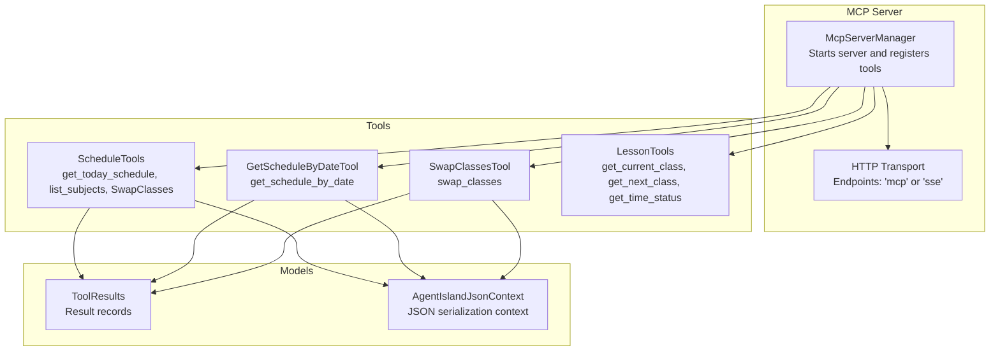
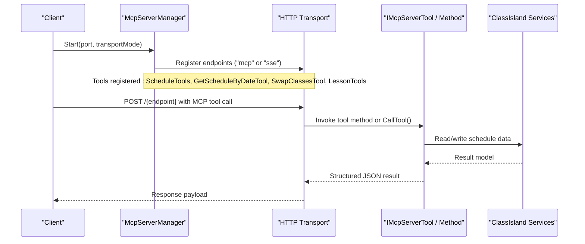
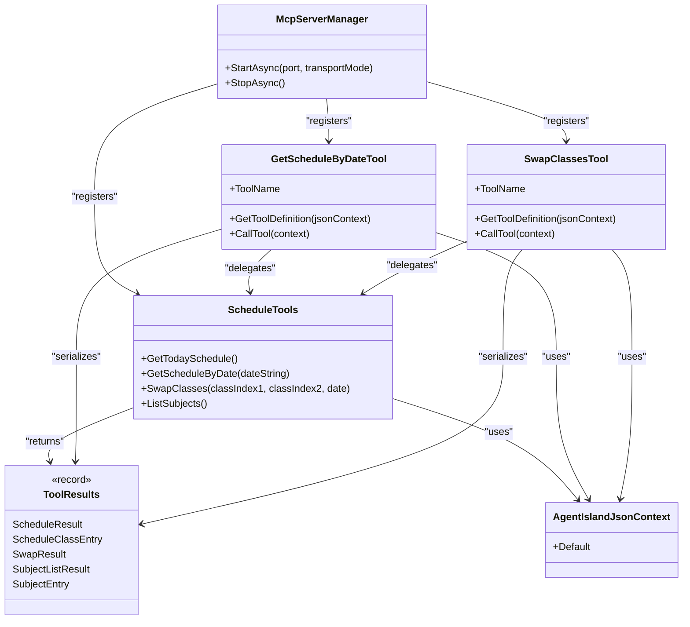

# Schedule Management Tools

<cite>
**Referenced Files in This Document**
- [McpServerManager.cs](file://Mcp/McpServerManager.cs)
- [ScheduleTools.cs](file://Mcp/Tools/ScheduleTools.cs)
- [GetScheduleByDateTool.cs](file://Mcp/Tools/GetScheduleByDateTool.cs)
- [SwapClassesTool.cs](file://Mcp/Tools/SwapClassesTool.cs)
- [LessonTools.cs](file://Mcp/Tools/LessonTools.cs)
- [ToolResults.cs](file://Models/ToolResults.cs)
- [AgentIslandJsonContext.cs](file://Models/AgentIslandJsonContext.cs)
- [McpTransportMode.cs](file://Models/McpTransportMode.cs)
</cite>

## Table of Contents
1. [Introduction](#introduction)
2. [Project Structure](#project-structure)
3. [Core Components](#core-components)
4. [Architecture Overview](#architecture-overview)
5. [Detailed Component Analysis](#detailed-component-analysis)
6. [Dependency Analysis](#dependency-analysis)
7. [Performance Considerations](#performance-considerations)
8. [Troubleshooting Guide](#troubleshooting-guide)
9. [Conclusion](#conclusion)
10. [Appendices](#appendices)

## Introduction
This document provides comprehensive API documentation for the schedule management MCP tools exposed by the application. It covers:
- getTodaySchedule: retrieves today’s complete class schedule with subjects, times, and teachers
- getScheduleByDate: retrieves schedules for a specific date
- listSubjects: returns available subjects in the system
- swapClasses: swaps two classes by their indices on a given date

The server exposes these tools over HTTP using the Model Context Protocol (MCP). The transport can be Streamable HTTP or Server-Sent Events (SSE), configured at startup.

## Project Structure
The schedule-related functionality is implemented under Mcp/Tools and Models. The MCP server registers these tools and configures HTTP endpoints based on the selected transport mode.

**Diagram sources**
- [McpServerManager.cs:41-71](file://Mcp/McpServerManager.cs#L41-L71)
- [ScheduleTools.cs:13-131](file://Mcp/Tools/ScheduleTools.cs#L13-L131)
- [GetScheduleByDateTool.cs:16-78](file://Mcp/Tools/GetScheduleByDateTool.cs#L16-L78)
- [SwapClassesTool.cs:16-80](file://Mcp/Tools/SwapClassesTool.cs#L16-L80)
- [ToolResults.cs:24-49](file://Models/ToolResults.cs#L24-L49)
- [AgentIslandJsonContext.cs:1-19](file://Models/AgentIslandJsonContext.cs#L1-L19)

**Section sources**
- [McpServerManager.cs:25-71](file://Mcp/McpServerManager.cs#L25-L71)
- [McpTransportMode.cs:6-17](file://Models/McpTransportMode.cs#L6-L17)

## Core Components
- ScheduleTools: Implements read-only and write operations for schedules and subjects. Includes get_today_schedule, list_subjects, and SwapClasses.
- GetScheduleByDateTool: Wrapper tool that parses JSON arguments and delegates to ScheduleTools.GetScheduleByDate.
- SwapClassesTool: Wrapper tool that parses JSON arguments and delegates to ScheduleTools.SwapClasses.
- LessonTools: Additional read-only tools for current and next class information (not part of the requested scope but registered alongside).
- ToolResults: Defines all response record types used across tools.
- AgentIslandJsonContext: Configures camelCase JSON serialization for responses.

Key behaviors:
- All tools run on the UI thread via a helper to access ClassIsland services safely.
- Date parsing accepts ISO-like formats; invalid dates raise an argument error.
- Indices are zero-based and validated against the number of classes for the target date.

**Section sources**
- [ScheduleTools.cs:13-131](file://Mcp/Tools/ScheduleTools.cs#L13-L131)
- [GetScheduleByDateTool.cs:16-78](file://Mcp/Tools/GetScheduleByDateTool.cs#L16-L78)
- [SwapClassesTool.cs:16-80](file://Mcp/Tools/SwapClassesTool.cs#L16-L80)
- [ToolResults.cs:24-49](file://Models/ToolResults.cs#L24-L49)
- [AgentIslandJsonContext.cs:18-19](file://Models/AgentIslandJsonContext.cs#L18-L19)

## Architecture Overview
The MCP server registers multiple tools and exposes them over HTTP. Depending on the transport mode, the endpoint path differs:
- Streamable HTTP: endpoint "mcp"
- SSE: endpoint "sse"

Clients call tools through the MCP protocol messages routed to the appropriate tool handler.

**Diagram sources**
- [McpServerManager.cs:41-71](file://Mcp/McpServerManager.cs#L41-L71)
- [GetScheduleByDateTool.cs:53-78](file://Mcp/Tools/GetScheduleByDateTool.cs#L53-L78)
- [SwapClassesTool.cs:63-80](file://Mcp/Tools/SwapClassesTool.cs#L63-L80)

## Detailed Component Analysis

### getTodaySchedule
Retrieves today’s complete class schedule including subject names, teacher names, start/end times, and flags indicating changes and enabled state.

- Tool name: get_today_schedule
- Operation type: Read-only
- Input parameters: None
- Output schema: ScheduleResult
  - classPlanName: string
  - date: string (yyyy-MM-dd)
  - classes: array of ScheduleClassEntry
    - index: integer (zero-based)
    - subjectName: string
    - teacherName: string
    - startTime: string? (hh:mm:ss or null)
    - endTime: string? (hh:mm:ss or null)
    - isChangedClass: boolean
    - isEnabled: boolean
- Error handling: If no class plan exists for today, returns an empty schedule with the current date.
- Notes:
  - Runs on the UI thread.
  - Uses ILessonsService and IProfileService to build the result.

Example response (conceptual):
{
  "classPlanName": "Default Plan",
  "date": "2026-06-19",
  "classes": [
    {
      "index": 0,
      "subjectName": "Mathematics",
      "teacherName": "Dr. Smith",
      "startTime": "08:00:00",
      "endTime": "09:30:00",
      "isChangedClass": false,
      "isEnabled": true
    }
  ]
}

**Section sources**
- [ScheduleTools.cs:15-39](file://Mcp/Tools/ScheduleTools.cs#L15-L39)
- [ScheduleTools.cs:133-160](file://Mcp/Tools/ScheduleTools.cs#L133-L160)
- [ToolResults.cs:24-36](file://Models/ToolResults.cs#L24-L36)

### getScheduleByDate
Retrieves the schedule for a specified date.

- Tool name: get_schedule_by_date
- Operation type: Read-only
- Input parameters:
  - date: string (required)
    - Format: yyyy-MM-dd
    - Validation: Parsed using invariant culture; invalid format raises an argument error.
- Output schema: ScheduleResult (same fields as above)
- Error handling:
  - Missing or invalid parameter: throws an argument error.
  - Invalid date format: throws an argument error.
  - No class plan found: returns an empty schedule with the provided date.
- Notes:
  - Implemented via GetScheduleByDateTool.CallTool which validates input and delegates to ScheduleTools.GetScheduleByDate.

Example request (conceptual):
{
  "date": "2026-06-19"
}

Example response (conceptual):
{
  "classPlanName": "Default Plan",
  "date": "2026-06-19",
  "classes": []
}

**Section sources**
- [GetScheduleByDateTool.cs:18-51](file://Mcp/Tools/GetScheduleByDateTool.cs#L18-L51)
- [GetScheduleByDateTool.cs:53-78](file://Mcp/Tools/GetScheduleByDateTool.cs#L53-L78)
- [ScheduleTools.cs:41-56](file://Mcp/Tools/ScheduleTools.cs#L41-L56)
- [ScheduleTools.cs:184-197](file://Mcp/Tools/ScheduleTools.cs#L184-L197)
- [ToolResults.cs:24-36](file://Models/ToolResults.cs#L24-L36)

### listSubjects
Returns all available subjects in the system, sorted alphabetically by name.

- Tool name: list_subjects
- Operation type: Read-only
- Input parameters: None
- Output schema: SubjectListResult
  - subjects: array of SubjectEntry
    - id: string (GUID as string)
    - name: string
    - teacherName: string
    - initial: string
- Notes:
  - Subjects are ordered by name using current culture comparison.
  - Returns an empty list if none exist.

Example response (conceptual):
{
  "subjects": [
    {
      "id": "a1b2c3d4-e5f6-7890-abcd-ef1234567890",
      "name": "Mathematics",
      "teacherName": "Dr. Smith",
      "initial": "M"
    },
    {
      "id": "b2c3d4e5-f6a7-8901-bcde-f12345678901",
      "name": "Physics",
      "teacherName": "Prof. Jones",
      "initial": "P"
    }
  ]
}

**Section sources**
- [ScheduleTools.cs:105-131](file://Mcp/Tools/ScheduleTools.cs#L105-L131)
- [ToolResults.cs:42-49](file://Models/ToolResults.cs#L42-L49)

### swapClasses
Swaps two classes by their indices on a given date. Creates or reuses a temporary overlay class plan for the date.

- Tool name: swap_classes
- Operation type: Write (modifies profile)
- Input parameters:
  - classIndex1: integer (required, zero-based)
  - classIndex2: integer (required, zero-based)
  - date: string (optional)
    - Format: yyyy-MM-dd
    - Behavior: Empty string defaults to today
- Output schema: SwapResult
  - success: boolean
  - message: string
- Validation rules:
  - Required integers must be present and valid.
  - Optional date is parsed; invalid format raises an argument error.
  - Both indices must be within range [0, count-1] for the target date’s class plan.
- Side effects:
  - Creates or reuses a temporary overlay class plan for the date.
  - Swaps SubjectId values between the two classes and marks them as changed.
  - Persists the profile.
- Error handling:
  - No class plan found for the date: returns success=false with a descriptive message.
  - Failed to create overlay: returns success=false with a descriptive message.
  - Out-of-range indices: returns success=false with a descriptive message.
  - Any exception: returns success=false with the exception message.

Example request (conceptual):
{
  "classIndex1": 0,
  "classIndex2": 1,
  "date": "2026-06-19"
}

Example success response (conceptual):
{
  "success": true,
  "message": "Classes swapped successfully."
}

Example failure response (conceptual):
{
  "success": false,
  "message": "Class index is out of range."
}

**Section sources**
- [SwapClassesTool.cs:18-61](file://Mcp/Tools/SwapClassesTool.cs#L18-L61)
- [SwapClassesTool.cs:63-80](file://Mcp/Tools/SwapClassesTool.cs#L63-L80)
- [SwapClassesTool.cs:82-101](file://Mcp/Tools/SwapClassesTool.cs#L82-L101)
- [ScheduleTools.cs:58-103](file://Mcp/Tools/ScheduleTools.cs#L58-L103)
- [ScheduleTools.cs:162-182](file://Mcp/Tools/ScheduleTools.cs#L162-L182)
- [ToolResults.cs:38-40](file://Models/ToolResults.cs#L38-L40)

## Dependency Analysis
The following diagram shows how tools depend on shared models and the MCP server registration.

**Diagram sources**
- [McpServerManager.cs:41-71](file://Mcp/McpServerManager.cs#L41-L71)
- [ScheduleTools.cs:13-131](file://Mcp/Tools/ScheduleTools.cs#L13-L131)
- [GetScheduleByDateTool.cs:16-78](file://Mcp/Tools/GetScheduleByDateTool.cs#L16-L78)
- [SwapClassesTool.cs:16-80](file://Mcp/Tools/SwapClassesTool.cs#L16-L80)
- [ToolResults.cs:24-49](file://Models/ToolResults.cs#L24-L49)
- [AgentIslandJsonContext.cs:1-19](file://Models/AgentIslandJsonContext.cs#L1-L19)

**Section sources**
- [McpServerManager.cs:41-71](file://Mcp/McpServerManager.cs#L41-L71)
- [AgentIslandJsonContext.cs:18-19](file://Models/AgentIslandJsonContext.cs#L18-L19)

## Performance Considerations
- UI Thread Execution: All tools execute on the UI thread via a helper. Avoid long-running operations to prevent blocking the UI.
- Minimal Data Transfer: Responses include only necessary fields; avoid adding heavy payloads.
- Index Validation: Validate indices early to fail fast and reduce unnecessary processing.
- Date Parsing: Use invariant culture parsing to avoid locale-dependent overhead and errors.
- Overlay Reuse: For swap operations, existing overlays are reused when possible to minimize persistence writes.

[No sources needed since this section provides general guidance]

## Troubleshooting Guide
Common issues and resolutions:
- Invalid date format: Ensure the date string matches yyyy-MM-dd. The parser uses invariant culture and will throw an argument error otherwise.
- Missing required parameters: For get_schedule_by_date, provide the date field. For swap_classes, provide both classIndex1 and classIndex2.
- Out-of-range indices: Verify that indices are within [0, count-1] for the target date’s class plan.
- No class plan found: If there is no schedule for the specified date, read-only tools return an empty schedule; swap operations return a failure message.
- Serialization issues: The JSON context uses camelCase naming; ensure client code expects lowercase property names.

**Section sources**
- [ScheduleTools.cs:184-197](file://Mcp/Tools/ScheduleTools.cs#L184-L197)
- [GetScheduleByDateTool.cs:80-90](file://Mcp/Tools/GetScheduleByDateTool.cs#L80-L90)
- [SwapClassesTool.cs:82-101](file://Mcp/Tools/SwapClassesTool.cs#L82-L101)
- [AgentIslandJsonContext.cs:18-19](file://Models/AgentIslandJsonContext.cs#L18-L19)

## Conclusion
The schedule management MCP tools provide robust read and write capabilities for managing class schedules. They enforce strict input validation, handle edge cases gracefully, and integrate with the underlying ClassIsland services through a clean, structured API. When automating scheduling tasks, prefer read-only tools for querying and use swapClasses carefully with proper authorization and safeguards.

[No sources needed since this section summarizes without analyzing specific files]

## Appendices

### HTTP Endpoints and Transport Modes
- Streamable HTTP: Endpoint path "mcp"
- SSE: Endpoint path "sse"
- Port: Configurable at server startup

These endpoints host the MCP protocol; clients send tool calls according to the MCP specification.

**Section sources**
- [McpServerManager.cs:53-67](file://Mcp/McpServerManager.cs#L53-L67)
- [McpTransportMode.cs:6-17](file://Models/McpTransportMode.cs#L6-L17)

### Security Considerations for Write Operations (swapClasses)
- Authorization: Restrict access to swapClasses to trusted clients or users with appropriate permissions.
- Rate Limiting: Apply rate limits to prevent abuse or accidental mass swaps.
- Audit Logging: Log successful and failed swap attempts with timestamps and user identifiers.
- Idempotency: The operation is not idempotent; callers should implement retry logic carefully and avoid duplicate requests.
- Input Sanitization: Validate indices and date strings strictly before processing.
- Least Privilege: Run the service with minimal privileges and restrict network exposure to localhost unless explicitly required.

[No sources needed since this section provides general guidance]