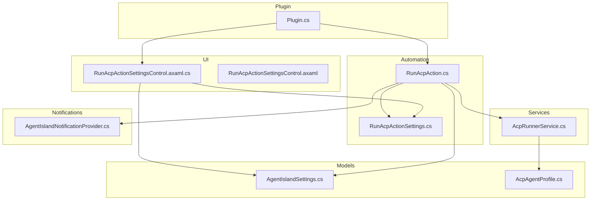
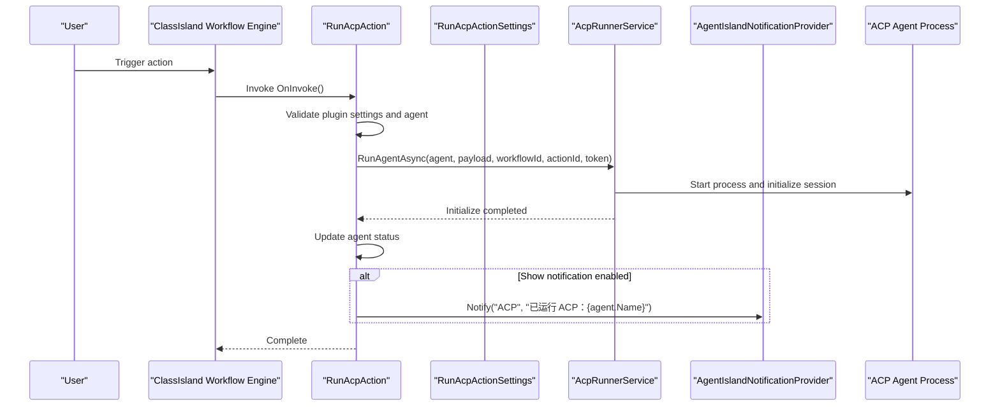
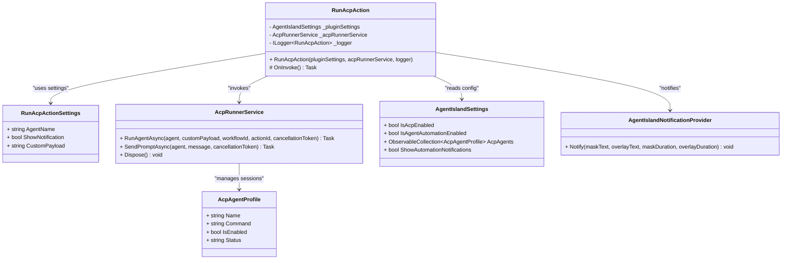
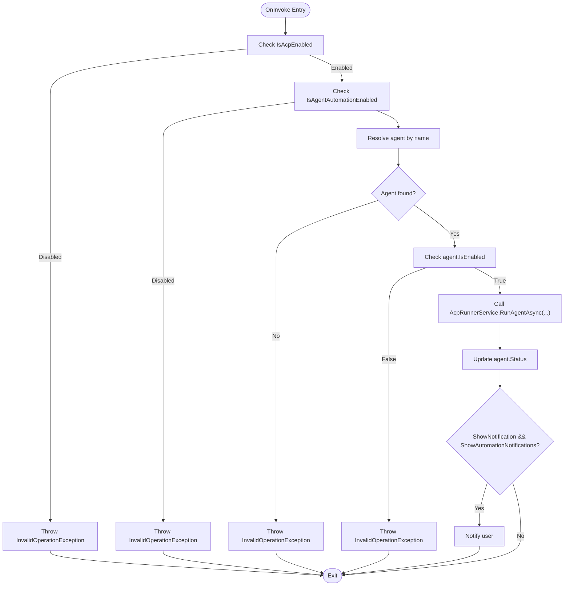
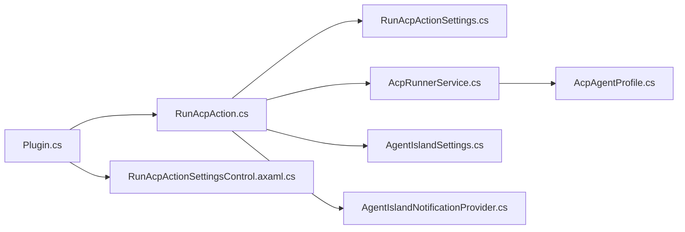

# Automation Actions System

<cite>
**Referenced Files in This Document**
- [RunAcpAction.cs](file://Automation/RunAcpAction.cs)
- [RunAcpActionSettings.cs](file://Models/RunAcpActionSettings.cs)
- [RunAcpActionSettingsControl.axaml.cs](file://Views/ActionSettings/RunAcpActionSettingsControl.axaml.cs)
- [RunAcpActionSettingsControl.axaml](file://Views/ActionSettings/RunAcpActionSettingsControl.axaml)
- [AcpRunnerService.cs](file://Services/AcpRunnerService.cs)
- [Plugin.cs](file://Plugin.cs)
- [AgentIslandNotificationProvider.cs](file://Mcp/Tools/AgentIslandNotificationProvider.cs)
- [AcpAgentProfile.cs](file://Models/AcpAgentProfile.cs)
- [AgentIslandSettings.cs](file://Models/AgentIslandSettings.cs)
</cite>

## Table of Contents
1. [Introduction](#introduction)
2. [Project Structure](#project-structure)
3. [Core Components](#core-components)
4. [Architecture Overview](#architecture-overview)
5. [Detailed Component Analysis](#detailed-component-analysis)
6. [Dependency Analysis](#dependency-analysis)
7. [Performance Considerations](#performance-considerations)
8. [Troubleshooting Guide](#troubleshooting-guide)
9. [Conclusion](#conclusion)
10. [Appendices](#appendices)

## Introduction
This document explains how to extend AgentIsland’s automation action system by analyzing the RunAcpAction implementation as a complete example. It covers:
- How actions are defined and registered
- How settings models and UI controls integrate with actions
- The execution flow, error handling, logging, and interaction with ACP agents
- Practical guidance for building custom actions, handling user input, integrating external services, testing, debugging, and performance considerations

The goal is to provide both high-level understanding and code-level details so you can confidently create new automation actions that fit seamlessly into the ClassIsland plugin ecosystem used by AgentIsland.

## Project Structure
Key files involved in the automation action system for running an ACP agent:
- Action logic: Automation/RunAcpAction.cs
- Settings model: Models/RunAcpActionSettings.cs
- Settings UI control (code-behind): Views/ActionSettings/RunAcpActionSettingsControl.axaml.cs
- Settings UI markup: Views/ActionSettings/RunAcpActionSettingsControl.axaml
- Service orchestrating ACP process lifecycle: Services/AcpRunnerService.cs
- Plugin registration and DI wiring: Plugin.cs
- Notification integration: Mcp/Tools/AgentIslandNotificationProvider.cs
- Configuration models: Models/AcpAgentProfile.cs, Models/AgentIslandSettings.cs

**Diagram sources**
- [Plugin.cs](file://Plugin.cs)
- [RunAcpAction.cs](file://Automation/RunAcpAction.cs)
- [RunAcpActionSettings.cs](file://Models/RunAcpActionSettings.cs)
- [RunAcpActionSettingsControl.axaml.cs](file://Views/ActionSettings/RunAcpActionSettingsControl.axaml.cs)
- [RunAcpActionSettingsControl.axaml](file://Views/ActionSettings/RunAcpActionSettingsControl.axaml)
- [AcpRunnerService.cs](file://Services/AcpRunnerService.cs)
- [AgentIslandSettings.cs](file://Models/AgentIslandSettings.cs)
- [AcpAgentProfile.cs](file://Models/AcpAgentProfile.cs)
- [AgentIslandNotificationProvider.cs](file://Mcp/Tools/AgentIslandNotificationProvider.cs)

**Section sources**
- [Plugin.cs](file://Plugin.cs)
- [RunAcpAction.cs](file://Automation/RunAcpAction.cs)
- [RunAcpActionSettings.cs](file://Models/RunAcpActionSettings.cs)
- [RunAcpActionSettingsControl.axaml.cs](file://Views/ActionSettings/RunAcpActionSettingsControl.axaml.cs)
- [RunAcpActionSettingsControl.axaml](file://Views/ActionSettings/RunAcpActionSettingsControl.axaml)
- [AcpRunnerService.cs](file://Services/AcpRunnerService.cs)
- [AgentIslandSettings.cs](file://Models/AgentIslandSettings.cs)
- [AcpAgentProfile.cs](file://Models/AcpAgentProfile.cs)
- [AgentIslandNotificationProvider.cs](file://Mcp/Tools/AgentIslandNotificationProvider.cs)

## Core Components
- RunAcpAction: Implements the automation action that triggers an ACP agent run. It validates global and agent-specific settings, logs events, invokes the runner service, updates agent status, and optionally shows a notification.
- RunAcpActionSettings: Defines the per-action configuration properties persisted and bound to the UI.
- RunAcpActionSettingsControl: Provides the settings UI for configuring the action, including dynamic defaults and display name/icon updates.
- AcpRunnerService: Manages ACP agent process lifecycle and JSON-RPC over stdio communication.
- Plugin: Registers the action and its settings UI, wires up dependency injection, and initializes services.
- AgentIslandNotificationProvider: Posts user notifications via the ClassIsland notification framework.
- AgentIslandSettings and AcpAgentProfile: Provide runtime configuration and agent definitions.

**Section sources**
- [RunAcpAction.cs](file://Automation/RunAcpAction.cs)
- [RunAcpActionSettings.cs](file://Models/RunAcpActionSettings.cs)
- [RunAcpActionSettingsControl.axaml.cs](file://Views/ActionSettings/RunAcpActionSettingsControl.axaml.cs)
- [RunAcpActionSettingsControl.axaml](file://Views/ActionSettings/RunAcpActionSettingsControl.axaml)
- [AcpRunnerService.cs](file://Services/AcpRunnerService.cs)
- [Plugin.cs](file://Plugin.cs)
- [AgentIslandNotificationProvider.cs](file://Mcp/Tools/AgentIslandNotificationProvider.cs)
- [AgentIslandSettings.cs](file://Models/AgentIslandSettings.cs)
- [AcpAgentProfile.cs](file://Models/AcpAgentProfile.cs)

## Architecture Overview
The automation action system integrates with ClassIsland’s plugin architecture. Actions are discovered and executed by the core framework; each action declares metadata and implements invocation logic. Settings UIs are paired with actions to allow users to configure parameters at design time.

**Diagram sources**
- [RunAcpAction.cs](file://Automation/RunAcpAction.cs)
- [AcpRunnerService.cs](file://Services/AcpRunnerService.cs)
- [AgentIslandNotificationProvider.cs](file://Mcp/Tools/AgentIslandNotificationProvider.cs)

## Detailed Component Analysis

### RunAcpAction: Custom Action Implementation
RunAcpAction demonstrates the pattern for creating a custom automation action:
- Declares action metadata using an attribute
- Inherits from a base action class parameterized by the settings type
- Uses constructor injection to receive plugin settings, the ACP runner service, and optional logger
- Overrides the asynchronous invoke method to perform validation, orchestration, logging, and post-execution tasks

Key behaviors:
- Validates global feature flags before proceeding
- Resolves the target agent by name from configured agents
- Ensures the selected agent is enabled
- Invokes the runner service with context identifiers (workflow and action IDs) and cancellation token
- Updates agent status and optionally posts a notification based on user preferences

Error handling:
- Throws explicit exceptions when preconditions fail (e.g., features disabled or agent not found/disabled)
- Logs warnings prior to throwing to aid diagnostics

Logging:
- Uses structured logging throughout to record trigger, decisions, and outcomes

Integration points:
- Reads/writes to global settings and agent profiles
- Uses the notification provider to surface results to the user

**Section sources**
- [RunAcpAction.cs](file://Automation/RunAcpAction.cs)

#### Class Diagram: Action and Dependencies

**Diagram sources**
- [RunAcpAction.cs](file://Automation/RunAcpAction.cs)
- [RunAcpActionSettings.cs](file://Models/RunAcpActionSettings.cs)
- [AcpRunnerService.cs](file://Services/AcpRunnerService.cs)
- [AgentIslandSettings.cs](file://Models/AgentIslandSettings.cs)
- [AcpAgentProfile.cs](file://Models/AcpAgentProfile.cs)
- [AgentIslandNotificationProvider.cs](file://Mcp/Tools/AgentIslandNotificationProvider.cs)

### Action Registration via AddAction
Actions are registered through the plugin’s service container. The registration associates the action type with its settings UI control, enabling the framework to discover and present the action in the workflow editor.

Registration highlights:
- The plugin registers the action and its settings control during initialization
- The action metadata attribute provides the unique identifier, display name, icon glyph, and category

Best practices:
- Ensure the action ID is globally unique
- Keep the display name concise and localized if needed
- Choose an appropriate icon glyph for quick recognition

**Section sources**
- [Plugin.cs](file://Plugin.cs)
- [RunAcpAction.cs](file://Automation/RunAcpAction.cs)

### Settings Model: RunAcpActionSettings
The settings model defines the parameters exposed to users and persisted across runs:
- AgentName: Target agent selection
- ShowNotification: Whether to show a notification after execution
- CustomPayload: Optional JSON payload passed to the agent

Implementation notes:
- Properties use observable patterns to support UI binding
- JSON serialization attributes define stable property names for persistence

Validation strategy:
- Lightweight validation occurs in the action logic rather than the model
- The UI may provide guidance but should not enforce business rules

**Section sources**
- [RunAcpActionSettings.cs](file://Models/RunAcpActionSettings.cs)

### Settings UI: RunAcpActionSettingsControl
The settings control binds to the action’s settings model and exposes additional UI logic:
- Displays available agent names derived from global settings
- Provides empty-state messaging to guide users when no agents are configured
- Initializes default values and updates the action’s display name and icon upon adding the action

Binding and UX:
- Two-way bindings keep the model in sync with user input
- Dynamic text and selections improve usability and reduce errors

**Section sources**
- [RunAcpActionSettingsControl.axaml.cs](file://Views/ActionSettings/RunAcpActionSettingsControl.axaml.cs)
- [RunAcpActionSettingsControl.axaml](file://Views/ActionSettings/RunAcpActionSettingsControl.axaml)

### Execution Flow and Error Handling
The action’s execution path includes:
- Precondition checks against global settings
- Agent resolution and enablement verification
- Invocation of the runner service with context identifiers and cancellation token
- Post-run status update and optional notification

Error handling:
- Throws descriptive exceptions for invalid states
- Logs warnings before failures to capture decision context
- Uses cancellation tokens to respect workflow interruption

**Diagram sources**
- [RunAcpAction.cs](file://Automation/RunAcpAction.cs)
- [AcpRunnerService.cs](file://Services/AcpRunnerService.cs)
- [AgentIslandSettings.cs](file://Models/AgentIslandSettings.cs)
- [AcpAgentProfile.cs](file://Models/AcpAgentProfile.cs)

### Interaction with ACP Agents
The AcpRunnerService manages the agent process lifecycle and JSON-RPC communication:
- Starts the agent process using the configured command
- Initializes a session via an “initialize” request
- Tracks active sessions and supports sending prompts
- Disposes processes gracefully on shutdown

Communication protocol:
- JSON-RPC 2.0 over standard I/O
- Initialization handshake followed by prompt requests

Process management:
- Redirected streams for input/output/error
- Session tracking with unique identifiers
- Graceful termination with fallback kill on timeout

**Section sources**
- [AcpRunnerService.cs](file://Services/AcpRunnerService.cs)

### Notification Integration
After successful execution, the action can notify the user:
- Checks both global and per-action notification preferences
- Uses the notification provider to display a mask and optional overlay message
- Ensures UI thread safety when posting notifications

**Section sources**
- [RunAcpAction.cs](file://Automation/RunAcpAction.cs)
- [AgentIslandNotificationProvider.cs](file://Mcp/Tools/AgentIslandNotificationProvider.cs)

## Dependency Analysis
The following diagram maps key dependencies between components:

**Diagram sources**
- [Plugin.cs](file://Plugin.cs)
- [RunAcpAction.cs](file://Automation/RunAcpAction.cs)
- [RunAcpActionSettings.cs](file://Models/RunAcpActionSettings.cs)
- [RunAcpActionSettingsControl.axaml.cs](file://Views/ActionSettings/RunAcpActionSettingsControl.axaml.cs)
- [AcpRunnerService.cs](file://Services/AcpRunnerService.cs)
- [AgentIslandSettings.cs](file://Models/AgentIslandSettings.cs)
- [AcpAgentProfile.cs](file://Models/AcpAgentProfile.cs)
- [AgentIslandNotificationProvider.cs](file://Mcp/Tools/AgentIslandNotificationProvider.cs)

**Section sources**
- [Plugin.cs](file://Plugin.cs)
- [RunAcpAction.cs](file://Automation/RunAcpAction.cs)
- [RunAcpActionSettings.cs](file://Models/RunAcpActionSettings.cs)
- [RunAcpActionSettingsControl.axaml.cs](file://Views/ActionSettings/RunAcpActionSettingsControl.axaml.cs)
- [AcpRunnerService.cs](file://Services/AcpRunnerService.cs)
- [AgentIslandSettings.cs](file://Models/AgentIslandSettings.cs)
- [AcpAgentProfile.cs](file://Models/AcpAgentProfile.cs)
- [AgentIslandNotificationProvider.cs](file://Mcp/Tools/AgentIslandNotificationProvider.cs)

## Performance Considerations
- Avoid heavy work in the action’s invoke method; delegate long-running operations to background services
- Use cancellation tokens to honor workflow interruptions and prevent orphaned processes
- Minimize logging verbosity in hot paths; prefer structured logs with contextual identifiers
- Reuse services where possible (e.g., single AcpRunnerService instance managed by DI)
- Be mindful of UI thread constraints when updating UI-bound state or showing notifications

[No sources needed since this section provides general guidance]

## Troubleshooting Guide
Common issues and resolutions:
- Feature flags disabled: If ACP or agent automation is disabled, the action will refuse to execute. Enable the relevant settings and retry.
- Missing or disabled agent: Ensure the selected agent exists and is enabled in the global settings.
- Invalid agent command: The runner service requires a valid command string; verify the agent’s command configuration.
- Process startup failures: Check file paths and permissions for the agent executable; review logs for detailed errors.
- Notifications not shown: Confirm both global and per-action notification preferences are enabled.

Diagnostic techniques:
- Inspect structured logs around action invocation and runner service calls
- Verify session initialization messages and any JSON-RPC errors
- Use cancellation tokens to test graceful shutdown behavior

**Section sources**
- [RunAcpAction.cs](file://Automation/RunAcpAction.cs)
- [AcpRunnerService.cs](file://Services/AcpRunnerService.cs)

## Conclusion
RunAcpAction serves as a comprehensive example of extending AgentIsland’s automation action system. By following the established patterns—declaring action metadata, implementing async invocation with robust validation and logging, pairing with a settings model and UI control, and integrating with services—you can build reliable, user-friendly automation actions. The runner service abstracts process management and JSON-RPC communication, while the plugin registration ensures seamless discovery and presentation within the workflow editor.

[No sources needed since this section summarizes without analyzing specific files]

## Appendices

### Building a Custom Automation Action: Step-by-Step
- Define a settings model with observable properties and JSON serialization attributes
- Implement an action class inheriting from the base action type, decorated with action metadata
- Inject required services via constructor (settings, runners, loggers)
- Override the async invoke method to validate inputs, call services, handle errors, and log outcomes
- Create a settings UI control bound to the settings model, providing defaults and helpful messages
- Register the action and its settings UI in the plugin’s initialization routine

**Section sources**
- [RunAcpAction.cs](file://Automation/RunAcpAction.cs)
- [RunAcpActionSettings.cs](file://Models/RunAcpActionSettings.cs)
- [RunAcpActionSettingsControl.axaml.cs](file://Views/ActionSettings/RunAcpActionSettingsControl.axaml.cs)
- [Plugin.cs](file://Plugin.cs)

### Handling User Input and External Integrations
- Use two-way bindings in the settings UI to keep the model synchronized
- Validate user input early in the action logic and provide clear error messages
- For external services, encapsulate network/process interactions in dedicated services
- Respect cancellation tokens and avoid blocking the UI thread

**Section sources**
- [RunAcpActionSettingsControl.axaml](file://Views/ActionSettings/RunAcpActionSettingsControl.axaml)
- [RunAcpAction.cs](file://Automation/RunAcpAction.cs)
- [AcpRunnerService.cs](file://Services/AcpRunnerService.cs)

### Testing and Debugging Techniques
- Unit test action logic by mocking injected services and verifying exception paths
- Test settings UI by asserting default values and binding behavior
- Use structured logs to trace execution flows and identify failure points
- Simulate agent process failures to validate error handling and cleanup

**Section sources**
- [RunAcpAction.cs](file://Automation/RunAcpAction.cs)
- [AcpRunnerService.cs](file://Services/AcpRunnerService.cs)