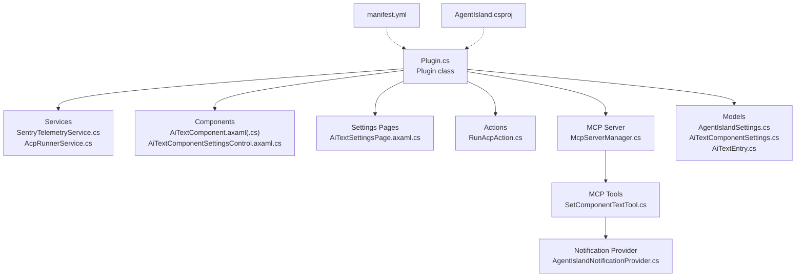
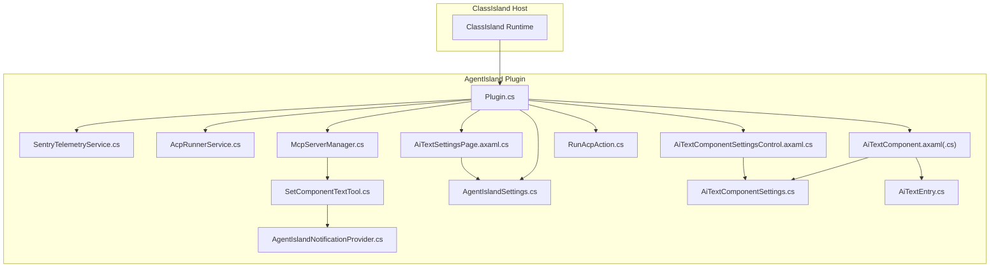
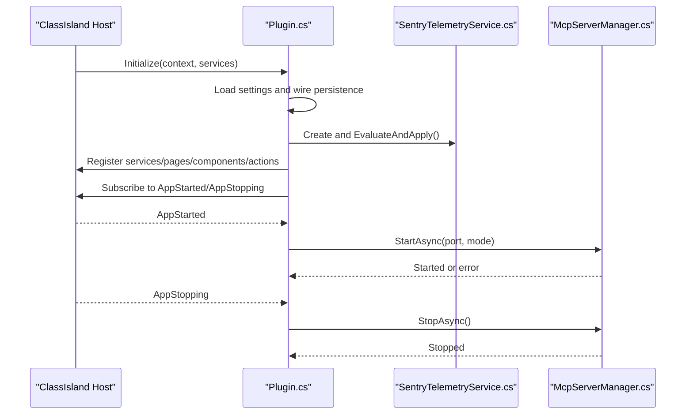
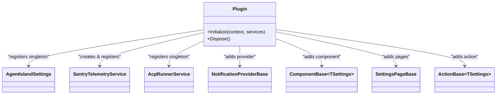
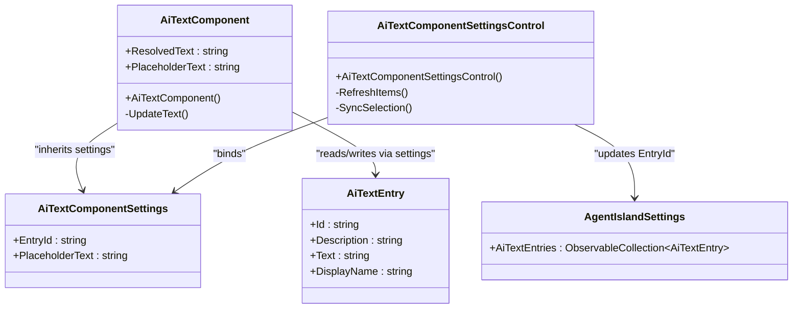
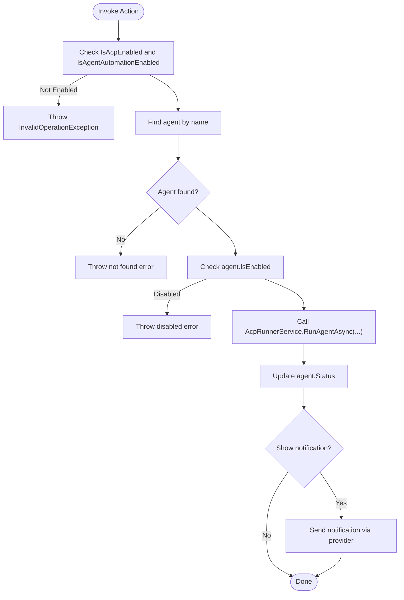
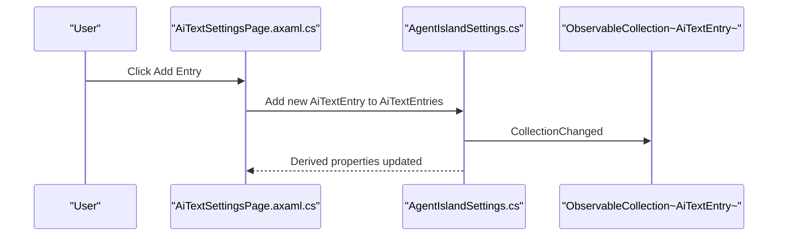
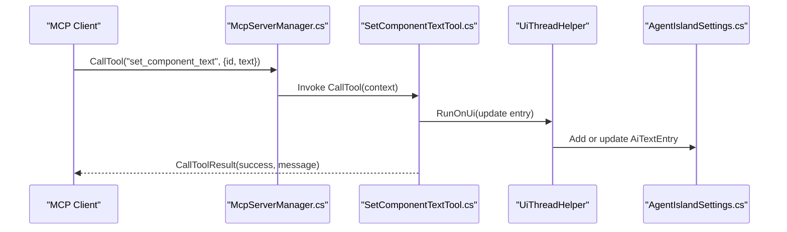
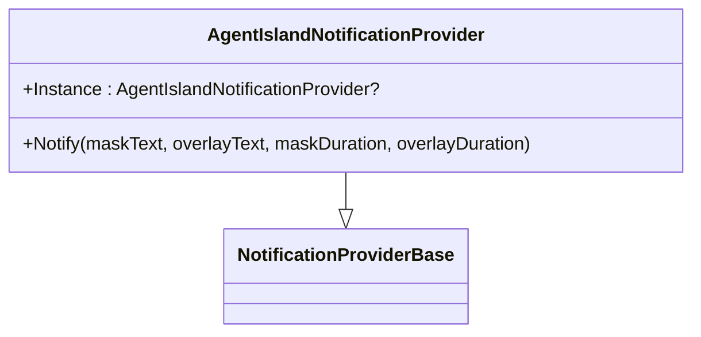
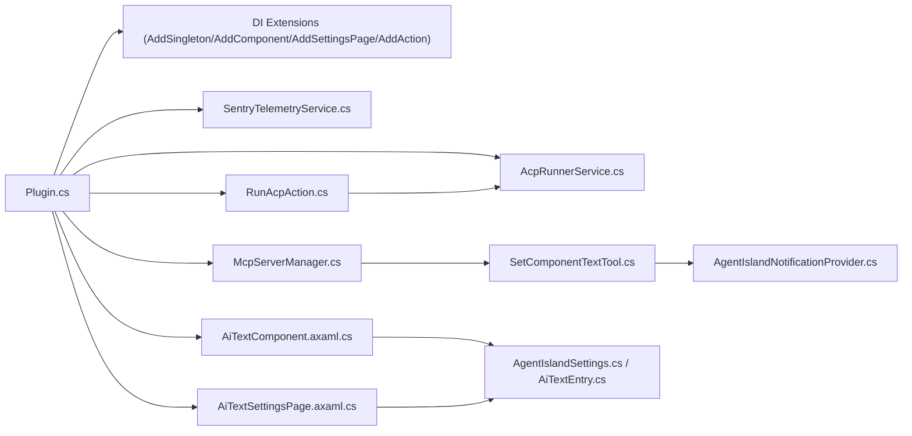

# Plugin Extension Points

<cite>
**Referenced Files in This Document**
- [Plugin.cs](file://Plugin.cs)
- [AgentIsland.csproj](file://AgentIsland.csproj)
- [manifest.yml](file://manifest.yml)
- [AiTextComponent.axaml](file://Components/AiTextComponent.axaml)
- [AiTextComponent.axaml.cs](file://Components/AiTextComponent.axaml.cs)
- [AiTextComponentSettingsControl.axaml.cs](file://Components/AiTextComponentSettingsControl.axaml.cs)
- [AiTextComponentSettings.cs](file://Models/AiTextComponentSettings.cs)
- [AiTextEntry.cs](file://Models/AiTextEntry.cs)
- [AgentIslandSettings.cs](file://Models/AgentIslandSettings.cs)
- [SentryTelemetryService.cs](file://Services/SentryTelemetryService.cs)
- [AcpRunnerService.cs](file://Services/AcpRunnerService.cs)
- [RunAcpAction.cs](file://Automation/RunAcpAction.cs)
- [McpServerManager.cs](file://Mcp/McpServerManager.cs)
- [SetComponentTextTool.cs](file://Mcp/Tools/SetComponentTextTool.cs)
- [AgentIslandNotificationProvider.cs](file://Mcp/Tools/AgentIslandNotificationProvider.cs)
- [AiTextSettingsPage.axaml.cs](file://Views/SettingsPages/AiTextSettingsPage.axaml.cs)
</cite>

## Table of Contents
1. Introduction
2. Project Structure
3. Core Components
4. Architecture Overview
5. Detailed Component Analysis
6. Dependency Analysis
7. Performance Considerations
8. Troubleshooting Guide
9. Conclusion

## Introduction
This document explains AgentIsland’s plugin extension points for ClassIsland, focusing on:
- Plugin lifecycle and dependency injection setup
- Service registration patterns
- Custom UI components (e.g., AiTextComponent) with Avalonia XAML integration and property binding
- Action system extensions for automation workflows
- Settings pages with reactive properties
- Event handling mechanisms
- MCP tool integration and notifications

It provides code-level diagrams and references to source files so you can implement custom plugins, register services, and integrate with existing AgentIsland functionality.

## Project Structure
AgentIsland is a ClassIsland plugin that registers services, UI components, actions, settings pages, and an MCP server. The plugin entry point is marked by an attribute and implements the standard lifecycle methods.

**Diagram sources**
- [Plugin.cs:19-53](file://Plugin.cs#L19-L53)
- [SentryTelemetryService.cs:11-40](file://Services/SentryTelemetryService.cs#L11-L40)
- [AcpRunnerService.cs:14-30](file://Services/AcpRunnerService.cs#L14-L30)
- [AiTextComponent.axaml.cs:16-56](file://Components/AiTextComponent.axaml.cs#L16-L56)
- [AiTextComponentSettingsControl.axaml.cs:7-27](file://Components/AiTextComponentSettingsControl.axaml.cs#L7-L27)
- [AiTextSettingsPage.axaml.cs:9-20](file://Views/SettingsPages/AiTextSettingsPage.axaml.cs#L9-L20)
- [RunAcpAction.cs:10-27](file://Automation/RunAcpAction.cs#L10-L27)
- [McpServerManager.cs:11-30](file://Mcp/McpServerManager.cs#L11-L30)
- [SetComponentTextTool.cs:17-40](file://Mcp/Tools/SetComponentTextTool.cs#L17-L40)
- [AgentIslandNotificationProvider.cs:10-25](file://Mcp/Tools/AgentIslandNotificationProvider.cs#L10-L25)
- [AgentIslandSettings.cs:13-32](file://Models/AgentIslandSettings.cs#L13-L32)
- [AiTextComponentSettings.cs:5-12](file://Models/AiTextComponentSettings.cs#L5-L12)
- [AiTextEntry.cs:5-18](file://Models/AiTextEntry.cs#L5-L18)
- [manifest.yml:1-13](file://manifest.yml#L1-L13)
- [AgentIsland.csproj:22-29](file://AgentIsland.csproj#L22-L29)

**Section sources**
- [Plugin.cs:19-53](file://Plugin.cs#L19-L53)
- [manifest.yml:1-13](file://manifest.yml#L1-L13)
- [AgentIsland.csproj:22-29](file://AgentIsland.csproj#L22-L29)

## Core Components
- Plugin lifecycle and DI registration:
  - Initialize loads settings, wires telemetry, registers services, components, settings pages, and actions, and subscribes to app events.
  - Start behavior is driven by AppStarted event; Stop behavior by AppStopping event.
  - Dispose unsubscribes and disposes resources.
- Services:
  - SentryTelemetryService manages SDK initialization/shutdown based on settings and exposes instrumentation helpers.
  - AcpRunnerService orchestrates external agent processes via stdio JSON-RPC.
- UI components:
  - AiTextComponent renders text or placeholder based on selected entry and settings.
  - AiTextComponentSettingsControl binds to component settings and updates selection.
- Actions:
  - RunAcpAction invokes AcpRunnerService after validating settings and permissions.
- MCP server:
  - McpServerManager builds and starts/stops the server, registering tools.
  - SetComponentTextTool updates AI text entries from MCP calls.
  - AgentIslandNotificationProvider posts notifications through ClassIsland channels.

**Section sources**
- [Plugin.cs:29-53](file://Plugin.cs#L29-L53)
- [Plugin.cs:55-97](file://Plugin.cs#L55-L97)
- [Plugin.cs:99-112](file://Plugin.cs#L99-L112)
- [SentryTelemetryService.cs:21-40](file://Services/SentryTelemetryService.cs#L21-L40)
- [AcpRunnerService.cs:25-77](file://Services/AcpRunnerService.cs#L25-L77)
- [AiTextComponent.axaml.cs:36-56](file://Components/AiTextComponent.axaml.cs#L36-L56)
- [AiTextComponentSettingsControl.axaml.cs:16-27](file://Components/AiTextComponentSettingsControl.axaml.cs#L16-L27)
- [RunAcpAction.cs:29-82](file://Automation/RunAcpAction.cs#L29-L82)
- [McpServerManager.cs:25-82](file://Mcp/McpServerManager.cs#L25-L82)
- [SetComponentTextTool.cs:41-72](file://Mcp/Tools/SetComponentTextTool.cs#L41-L72)
- [AgentIslandNotificationProvider.cs:27-50](file://Mcp/Tools/AgentIslandNotificationProvider.cs#L27-L50)

## Architecture Overview
The plugin integrates with ClassIsland via attributes and DI, exposing UI components, actions, settings pages, and an MCP server. Telemetry is optional and controlled by settings.

**Diagram sources**
- [Plugin.cs:29-53](file://Plugin.cs#L29-L53)
- [SentryTelemetryService.cs:11-40](file://Services/SentryTelemetryService.cs#L11-L40)
- [AcpRunnerService.cs:14-30](file://Services/AcpRunnerService.cs#L14-L30)
- [AiTextComponent.axaml.cs:16-56](file://Components/AiTextComponent.axaml.cs#L16-L56)
- [AiTextComponentSettingsControl.axaml.cs:7-27](file://Components/AiTextComponentSettingsControl.axaml.cs#L7-L27)
- [AiTextSettingsPage.axaml.cs:9-20](file://Views/SettingsPages/AiTextSettingsPage.axaml.cs#L9-L20)
- [RunAcpAction.cs:10-27](file://Automation/RunAcpAction.cs#L10-L27)
- [McpServerManager.cs:11-30](file://Mcp/McpServerManager.cs#L11-L30)
- [SetComponentTextTool.cs:17-40](file://Mcp/Tools/SetComponentTextTool.cs#L17-L40)
- [AgentIslandNotificationProvider.cs:10-25](file://Mcp/Tools/AgentIslandNotificationProvider.cs#L10-L25)
- [AgentIslandSettings.cs:13-32](file://Models/AgentIslandSettings.cs#L13-L32)
- [AiTextComponentSettings.cs:5-12](file://Models/AiTextComponentSettings.cs#L5-L12)
- [AiTextEntry.cs:5-18](file://Models/AiTextEntry.cs#L5-L18)

## Detailed Component Analysis

### Plugin Lifecycle and Dependency Injection
- Initialize:
  - Loads settings from disk and persists changes automatically.
  - Creates and registers telemetry service.
  - Registers singleton services (settings, telemetry, AcpRunnerService).
  - Adds notification provider, UI component, and multiple settings pages.
  - Adds action type with its settings control.
  - Subscribes to application start/stop events.
- Start:
  - On AppStarted, if enabled, constructs logger and MCP manager, then starts the server.
- Stop:
  - On AppStopping, stops the MCP server gracefully.
- Dispose:
  - Unsubscribes from app events and disposes managed resources.

**Diagram sources**
- [Plugin.cs:29-53](file://Plugin.cs#L29-L53)
- [Plugin.cs:55-79](file://Plugin.cs#L55-L79)
- [Plugin.cs:81-97](file://Plugin.cs#L81-L97)
- [SentryTelemetryService.cs:30-40](file://Services/SentryTelemetryService.cs#L30-L40)
- [McpServerManager.cs:25-82](file://Mcp/McpServerManager.cs#L25-L82)

**Section sources**
- [Plugin.cs:29-53](file://Plugin.cs#L29-L53)
- [Plugin.cs:55-97](file://Plugin.cs#L55-L97)
- [Plugin.cs:99-112](file://Plugin.cs#L99-L112)

### Service Registration Patterns and DI Setup
- Singleton registrations:
  - Settings object (global configuration).
  - Telemetry service (lifecycle-aware).
  - AcpRunnerService (process orchestration).
- Notification provider registration:
  - Adds a notification provider implementation.
- Component registration:
  - Registers a custom component and its settings control.
- Settings pages:
  - Registers multiple settings pages for different features.
- Actions:
  - Registers an action with its settings control.

**Diagram sources**
- [Plugin.cs:29-53](file://Plugin.cs#L29-L53)
- [SentryTelemetryService.cs:11-40](file://Services/SentryTelemetryService.cs#L11-L40)
- [AcpRunnerService.cs:14-30](file://Services/AcpRunnerService.cs#L14-L30)
- [AgentIslandNotificationProvider.cs:10-25](file://Mcp/Tools/AgentIslandNotificationProvider.cs#L10-L25)
- [AiTextComponent.axaml.cs:16-20](file://Components/AiTextComponent.axaml.cs#L16-L20)
- [AiTextSettingsPage.axaml.cs:9-14](file://Views/SettingsPages/AiTextSettingsPage.axaml.cs#L9-L14)
- [RunAcpAction.cs:10-16](file://Automation/RunAcpAction.cs#L10-L16)

**Section sources**
- [Plugin.cs:29-53](file://Plugin.cs#L29-L53)

### Custom UI Component: AiTextComponent
- Purpose:
  - Displays dynamic text content bound to an entry in settings, with a placeholder when empty.
- Implementation highlights:
  - Inherits from ComponentBase<TSettings>.
  - Exposes Avalonia StyledProperties for ResolvedText and PlaceholderText.
  - Wires collection and property change events to update display.
  - Uses RelativeSource bindings in XAML to bind to component properties.
- Settings control:
  - Binds a combo box to the list of entries and updates the component’s EntryId setting.

**Diagram sources**
- [AiTextComponent.axaml.cs:16-83](file://Components/AiTextComponent.axaml.cs#L16-L83)
- [AiTextComponent.axaml:1-20](file://Components/AiTextComponent.axaml#L1-L20)
- [AiTextComponentSettingsControl.axaml.cs:7-52](file://Components/AiTextComponentSettingsControl.axaml.cs#L7-L52)
- [AiTextComponentSettings.cs:5-12](file://Models/AiTextComponentSettings.cs#L5-L12)
- [AiTextEntry.cs:5-18](file://Models/AiTextEntry.cs#L5-L18)
- [AgentIslandSettings.cs:107-122](file://Models/AgentIslandSettings.cs#L107-L122)

**Section sources**
- [AiTextComponent.axaml.cs:36-83](file://Components/AiTextComponent.axaml.cs#L36-L83)
- [AiTextComponent.axaml:10-18](file://Components/AiTextComponent.axaml#L10-L18)
- [AiTextComponentSettingsControl.axaml.cs:29-51](file://Components/AiTextComponentSettingsControl.axaml.cs#L29-L51)

### Action System Extension: RunAcpAction
- Purpose:
  - Triggers execution of an ACP agent process based on configured settings.
- Behavior:
  - Validates global and feature flags.
  - Locates the named agent and checks it is enabled.
  - Invokes AcpRunnerService.RunAgentAsync with context identifiers.
  - Updates last-run status and optionally shows a notification.

**Diagram sources**
- [RunAcpAction.cs:29-82](file://Automation/RunAcpAction.cs#L29-L82)
- [AcpRunnerService.cs:25-77](file://Services/AcpRunnerService.cs#L25-L77)
- [AgentIslandNotificationProvider.cs:27-50](file://Mcp/Tools/AgentIslandNotificationProvider.cs#L27-L50)

**Section sources**
- [RunAcpAction.cs:29-82](file://Automation/RunAcpAction.cs#L29-L82)

### Settings Page Creation with Reactive Properties
- AiTextSettingsPage:
  - Declares metadata for discovery and UI placement.
  - Binds DataContext to global settings.
  - Provides handlers to add/remove entries in the observable collection.
- Reactive model:
  - AgentIslandSettings uses ObservableObject and raises derived property changes for computed values.
  - Collections hook/unhook item events to keep derived properties updated.

**Diagram sources**
- [AiTextSettingsPage.axaml.cs:22-34](file://Views/SettingsPages/AiTextSettingsPage.axaml.cs#L22-L34)
- [AgentIslandSettings.cs:340-392](file://Models/AgentIslandSettings.cs#L340-L392)

**Section sources**
- [AiTextSettingsPage.axaml.cs:9-34](file://Views/SettingsPages/AiTextSettingsPage.axaml.cs#L9-L34)
- [AgentIslandSettings.cs:240-273](file://Models/AgentIslandSettings.cs#L240-L273)

### MCP Tool Integration: SetComponentTextTool
- Purpose:
  - Allows agents to update AI text component content by ID.
- Behavior:
  - Validates required parameters.
  - Runs UI updates on the UI thread.
  - Adds or updates entries in the settings collection.
  - Returns structured result and captures telemetry.

**Diagram sources**
- [McpServerManager.cs:41-51](file://Mcp/McpServerManager.cs#L41-L51)
- [SetComponentTextTool.cs:41-72](file://Mcp/Tools/SetComponentTextTool.cs#L41-L72)
- [AgentIslandSettings.cs:107-122](file://Models/AgentIslandSettings.cs#L107-L122)

**Section sources**
- [SetComponentTextTool.cs:41-72](file://Mcp/Tools/SetComponentTextTool.cs#L41-L72)

### Notification Provider: AgentIslandNotificationProvider
- Purpose:
  - Posts mask and overlay notifications via ClassIsland channels.
- Behavior:
  - Initializes static instance.
  - Marshals UI updates onto the UI thread.
  - Builds notification content and shows via channel.

**Diagram sources**
- [AgentIslandNotificationProvider.cs:10-25](file://Mcp/Tools/AgentIslandNotificationProvider.cs#L10-L25)
- [AgentIslandNotificationProvider.cs:27-50](file://Mcp/Tools/AgentIslandNotificationProvider.cs#L27-L50)

**Section sources**
- [AgentIslandNotificationProvider.cs:27-50](file://Mcp/Tools/AgentIslandNotificationProvider.cs#L27-L50)

## Dependency Analysis
Key dependencies and relationships:
- Plugin depends on ClassIsland core abstractions and attributes for discovery.
- Services depend on logging and telemetry.
- MCP server depends on transport and tool implementations.
- UI components depend on models and settings.

**Diagram sources**
- [Plugin.cs:29-53](file://Plugin.cs#L29-L53)
- [McpServerManager.cs:41-51](file://Mcp/McpServerManager.cs#L41-L51)
- [SetComponentTextTool.cs:41-72](file://Mcp/Tools/SetComponentTextTool.cs#L41-L72)
- [AiTextComponent.axaml.cs:36-83](file://Components/AiTextComponent.axaml.cs#L36-L83)
- [AiTextSettingsPage.axaml.cs:22-34](file://Views/SettingsPages/AiTextSettingsPage.axaml.cs#L22-L34)
- [RunAcpAction.cs:29-82](file://Automation/RunAcpAction.cs#L29-L82)

**Section sources**
- [Plugin.cs:29-53](file://Plugin.cs#L29-L53)

## Performance Considerations
- Avoid heavy work on the UI thread; use background tasks and marshal UI updates where needed (as seen in MCP tool updates).
- Reuse singletons registered via DI to minimize allocations and ensure consistent state.
- Use cancellation tokens for long-running operations (e.g., MCP server lifecycle, ACP process communication).
- Keep settings updates minimal and batched; rely on observable collections and derived properties to avoid redundant UI refreshes.

[No sources needed since this section provides general guidance]

## Troubleshooting Guide
Common issues and resolutions:
- MCP server fails to start:
  - Check port availability and transport mode configuration.
  - Review logs and telemetry breadcrumbs for errors during startup.
- ACP agent does not run:
  - Ensure IsAcpEnabled and IsAgentAutomationEnabled are true.
  - Verify agent exists and is enabled in settings.
  - Confirm command line arguments are valid.
- Notifications do not appear:
  - Verify notification provider is registered and channel IDs match.
  - Ensure UI thread marshaling is used when creating notification content.
- Telemetry not captured:
  - Confirm telemetry is active and privacy policy consent or custom DSN is set.
  - Validate DSN and network connectivity.

**Section sources**
- [Plugin.cs:67-79](file://Plugin.cs#L67-L79)
- [Plugin.cs:81-97](file://Plugin.cs#L81-L97)
- [RunAcpAction.cs:35-60](file://Automation/RunAcpAction.cs#L35-L60)
- [AgentIslandNotificationProvider.cs:27-50](file://Mcp/Tools/AgentIslandNotificationProvider.cs#L27-L50)
- [SentryTelemetryService.cs:30-40](file://Services/SentryTelemetryService.cs#L30-L40)

## Conclusion
AgentIsland demonstrates a complete ClassIsland plugin architecture:
- Lifecycle management via Initialize/Start/Stop/Dispose
- Centralized DI registration for services, components, actions, and settings pages
- Reactive UI components with Avalonia XAML and property binding
- Automation actions with robust validation and notifications
- MCP server integration with tools that interact with UI state safely
- Optional telemetry with privacy controls

Use these patterns to extend AgentIsland or build your own ClassIsland plugins.

[No sources needed since this section summarizes without analyzing specific files]