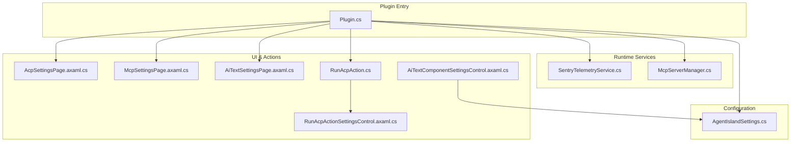
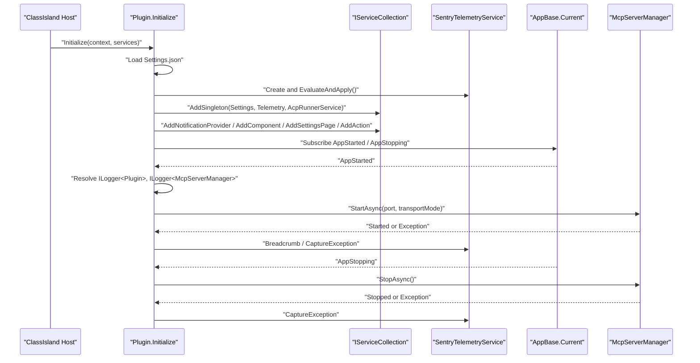
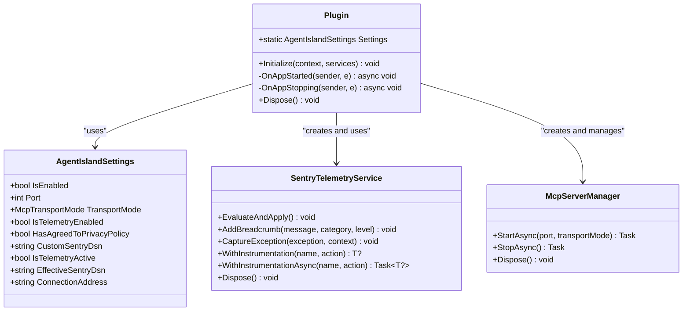
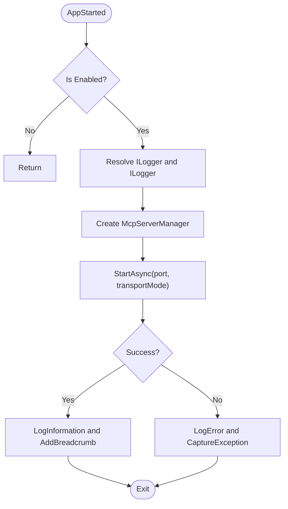
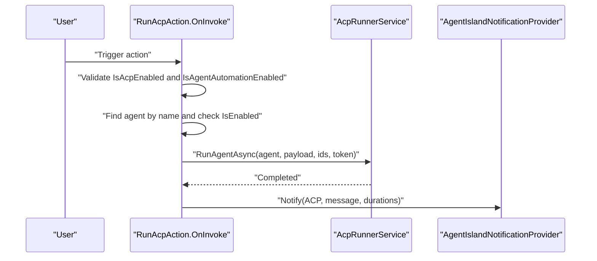
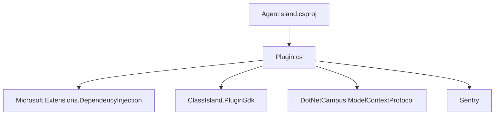

# Plugin Lifecycle Management

<cite>
**Referenced Files in This Document**
- [Plugin.cs](file://Plugin.cs)
- [SentryTelemetryService.cs](file://Services/SentryTelemetryService.cs)
- [McpServerManager.cs](file://Mcp/McpServerManager.cs)
- [AgentIslandSettings.cs](file://Models/AgentIslandSettings.cs)
- [RunAcpAction.cs](file://Automation/RunAcpAction.cs)
- [AiTextComponentSettingsControl.axaml.cs](file://Components/AiTextComponentSettingsControl.axaml.cs)
- [McpSettingsPage.axaml.cs](file://Views/SettingsPages/McpSettingsPage.axaml.cs)
- [AcpSettingsPage.axaml.cs](file://Views/SettingsPages/AcpSettingsPage.axaml.cs)
- [AiTextSettingsPage.axaml.cs](file://Views/SettingsPages/AiTextSettingsPage.axaml.cs)
- [RunAcpActionSettingsControl.axaml.cs](file://Views/ActionSettings/RunAcpActionSettingsControl.axaml.cs)
- [AgentIsland.csproj](file://AgentIsland.csproj)
</cite>

## Table of Contents
1. [Introduction](#introduction)
2. [Project Structure](#project-structure)
3. [Core Components](#core-components)
4. [Architecture Overview](#architecture-overview)
5. [Detailed Component Analysis](#detailed-component-analysis)
6. [Dependency Analysis](#dependency-analysis)
7. [Performance Considerations](#performance-considerations)
8. [Troubleshooting Guide](#troubleshooting-guide)
9. [Conclusion](#conclusion)

## Introduction
This document explains AgentIsland’s plugin lifecycle management with a focus on the Plugin class that extends PluginBase. It covers initialization and configuration loading, dependency injection setup using Microsoft.Extensions.DependencyInjection, service registration patterns (AddSingleton, AddComponent, AddSettingsPage, AddAction), event handling for AppStarted and AppStopping, error handling strategies, and telemetry integration throughout the lifecycle. It also provides code example paths to demonstrate proper initialization order, service resolution, and graceful shutdown procedures.

## Project Structure
The plugin is implemented as a ClassIsland plugin entry point. The main responsibilities are:
- Load settings from disk and persist changes
- Register services and UI extensions via DI and registry helpers
- Start and stop an MCP server at runtime
- Integrate Sentry telemetry across lifecycle events
- Provide automation actions and settings pages

**Diagram sources**
- [Plugin.cs:1-114](file://Plugin.cs#L1-L114)
- [AgentIslandSettings.cs:1-394](file://Models/AgentIslandSettings.cs#L1-L394)
- [SentryTelemetryService.cs:1-182](file://Services/SentryTelemetryService.cs#L1-L182)
- [McpServerManager.cs:1-125](file://Mcp/McpServerManager.cs#L1-L125)
- [AcpSettingsPage.axaml.cs:1-48](file://Views/SettingsPages/AcpSettingsPage.axaml.cs#L1-L48)
- [McpSettingsPage.axaml.cs:1-41](file://Views/SettingsPages/McpSettingsPage.axaml.cs#L1-L41)
- [AiTextSettingsPage.axaml.cs:1-35](file://Views/SettingsPages/AiTextSettingsPage.axaml.cs#L1-L35)
- [RunAcpAction.cs:1-84](file://Automation/RunAcpAction.cs#L1-L84)
- [RunAcpActionSettingsControl.axaml.cs:1-36](file://Views/ActionSettings/RunAcpActionSettingsControl.axaml.cs#L1-L36)
- [AiTextComponentSettingsControl.axaml.cs:1-52](file://Components/AiTextComponentSettingsControl.axaml.cs#L1-L52)

**Section sources**
- [Plugin.cs:1-114](file://Plugin.cs#L1-L114)
- [AgentIsland.csproj:1-52](file://AgentIsland.csproj#L1-L52)

## Core Components
- Plugin: The plugin entry point extending PluginBase. Responsible for configuration loading, DI registrations, event subscriptions, and runtime control of the MCP server.
- AgentIslandSettings: Observable settings model persisted to Settings.json; drives feature toggles, transport mode, port, and telemetry behavior.
- SentryTelemetryService: Manages Sentry SDK lifecycle based on privacy and telemetry settings; exposes breadcrumb, exception capture, and instrumentation helpers.
- McpServerManager: Starts/stops the Model Context Protocol server with tool registration and telemetry transactions.
- Automation and UI: RunAcpAction and related settings controls; settings pages expose configuration to users.

Key responsibilities and interactions:
- Initialize loads settings, wires persistence, initializes telemetry, registers services and UI components, and subscribes to AppStarted/AppStopping.
- OnAppStarted starts the MCP server if enabled, logs status, and records telemetry breadcrumbs.
- OnAppStopping gracefully stops the MCP server and captures errors.
- Dispose unsubscribes from app events and disposes managed resources.

**Section sources**
- [Plugin.cs:29-53](file://Plugin.cs#L29-L53)
- [Plugin.cs:55-97](file://Plugin.cs#L55-L97)
- [Plugin.cs:99-112](file://Plugin.cs#L99-L112)
- [AgentIslandSettings.cs:14-200](file://Models/AgentIslandSettings.cs#L14-L200)
- [SentryTelemetryService.cs:21-90](file://Services/SentryTelemetryService.cs#L21-L90)
- [McpServerManager.cs:19-82](file://Mcp/McpServerManager.cs#L19-L82)

## Architecture Overview
The plugin integrates with ClassIsland’s host and uses Microsoft.Extensions.DependencyInjection for service registration. It leverages registry extension methods to register components, settings pages, and actions. Telemetry is integrated via Sentry, and runtime control is driven by application lifecycle events.

**Diagram sources**
- [Plugin.cs:29-53](file://Plugin.cs#L29-L53)
- [Plugin.cs:55-79](file://Plugin.cs#L55-L79)
- [Plugin.cs:81-97](file://Plugin.cs#L81-L97)
- [SentryTelemetryService.cs:30-90](file://Services/SentryTelemetryService.cs#L30-L90)
- [McpServerManager.cs:25-82](file://Mcp/McpServerManager.cs#L25-L82)

## Detailed Component Analysis

### Plugin class lifecycle
- Initialization:
  - Loads settings from the plugin config folder and persists changes on property updates.
  - Creates and evaluates telemetry service based on current settings.
  - Registers singleton services and UI extensions via DI and registry helpers.
  - Subscribes to AppStarted and AppStopping events.
- Runtime control:
  - OnAppStarted resolves logging services, constructs McpServerManager, and starts the server with configured port and transport mode. Logs success and adds telemetry breadcrumbs. Catches exceptions and reports them via logging and telemetry.
  - OnAppStopping attempts to stop the server gracefully and captures any errors.
- Disposal:
  - Unsubscribes from app events, disposes McpServerManager and telemetry service, sets disposal flag, and suppresses finalization.

**Diagram sources**
- [Plugin.cs:19-112](file://Plugin.cs#L19-L112)
- [AgentIslandSettings.cs:14-200](file://Models/AgentIslandSettings.cs#L14-L200)
- [SentryTelemetryService.cs:11-182](file://Services/SentryTelemetryService.cs#L11-L182)
- [McpServerManager.cs:11-125](file://Mcp/McpServerManager.cs#L11-L125)

**Section sources**
- [Plugin.cs:29-53](file://Plugin.cs#L29-L53)
- [Plugin.cs:55-97](file://Plugin.cs#L55-L97)
- [Plugin.cs:99-112](file://Plugin.cs#L99-L112)

### Dependency injection setup and service registration patterns
- AddSingleton:
  - Registers shared instances such as settings, telemetry, and AcpRunnerService.
- AddComponent:
  - Registers UI components and their associated settings controls.
- AddSettingsPage:
  - Registers multiple settings pages for MCP, ACP, AI Text, and Telemetry.
- AddAction:
  - Registers automation actions and their settings controls.

These registrations occur during Initialize and make services available for resolution later in the lifecycle.

Example references:
- Service registrations: [Plugin.cs:40-49](file://Plugin.cs#L40-L49)
- Action registration and settings control: [RunAcpAction.cs:10-27](file://Automation/RunAcpAction.cs#L10-L27), [RunAcpActionSettingsControl.axaml.cs:8-36](file://Views/ActionSettings/RunAcpActionSettingsControl.axaml.cs#L8-L36)
- Settings page registrations: [Plugin.cs:45-48](file://Plugin.cs#L45-L48), [McpSettingsPage.axaml.cs:14-18](file://Views/SettingsPages/McpSettingsPage.axaml.cs#L14-L18), [AcpSettingsPage.axaml.cs:13-17](file://Views/SettingsPages/AcpSettingsPage.axaml.cs#L13-L17), [AiTextSettingsPage.axaml.cs:9-13](file://Views/SettingsPages/AiTextSettingsPage.axaml.cs#L9-L13)

**Section sources**
- [Plugin.cs:40-49](file://Plugin.cs#L40-L49)
- [RunAcpAction.cs:10-27](file://Automation/RunAcpAction.cs#L10-L27)
- [RunAcpActionSettingsControl.axaml.cs:8-36](file://Views/ActionSettings/RunAcpActionSettingsControl.axaml.cs#L8-L36)
- [McpSettingsPage.axaml.cs:14-18](file://Views/SettingsPages/McpSettingsPage.axaml.cs#L14-L18)
- [AcpSettingsPage.axaml.cs:13-17](file://Views/SettingsPages/AcpSettingsPage.axaml.cs#L13-L17)
- [AiTextSettingsPage.axaml.cs:9-13](file://Views/SettingsPages/AiTextSettingsPage.axaml.cs#L9-L13)

### Event handling for AppStarted and AppStopping
- AppStarted:
  - Adds telemetry breadcrumb.
  - If plugin is disabled, returns early.
  - Resolves logging services from IAppHost.
  - Constructs McpServerManager and starts it with configured port and transport mode.
  - Logs start information and adds telemetry breadcrumb; captures exceptions via logging and telemetry.
- AppStopping:
  - Adds telemetry breadcrumb.
  - Stops the MCP server if present.
  - Captures exceptions via logging and telemetry.

**Diagram sources**
- [Plugin.cs:55-79](file://Plugin.cs#L55-L79)

**Section sources**
- [Plugin.cs:55-79](file://Plugin.cs#L55-L79)
- [Plugin.cs:81-97](file://Plugin.cs#L81-L97)

### Error handling strategies
- Logging: Uses ILogger<T> to log informational and error messages during startup and shutdown.
- Telemetry: Uses SentryTelemetryService to add breadcrumbs and capture exceptions with contextual tags.
- Graceful failure: Exceptions during server start/stop are caught and reported without crashing the host.

References:
- Startup error handling: [Plugin.cs:74-78](file://Plugin.cs#L74-L78)
- Shutdown error handling: [Plugin.cs:92-96](file://Plugin.cs#L92-L96)
- Telemetry capture helper: [SentryTelemetryService.cs:95-109](file://Services/SentryTelemetryService.cs#L95-L109)

**Section sources**
- [Plugin.cs:74-78](file://Plugin.cs#L74-L78)
- [Plugin.cs:92-96](file://Plugin.cs#L92-L96)
- [SentryTelemetryService.cs:95-109](file://Services/SentryTelemetryService.cs#L95-L109)

### Telemetry integration throughout the lifecycle
- Initialization:
  - Creates SentryTelemetryService with settings and calls EvaluateAndApply to initialize SDK when appropriate.
  - Adds a breadcrumb indicating plugin initialization.
- Runtime:
  - Adds breadcrumbs for app started/stopped and MCP server start/stop.
  - Captures exceptions with context tags for diagnostics.
- Instrumentation helpers:
  - WithInstrumentation and WithInstrumentationAsync wrap operations with transactions and automatic error reporting.

References:
- Telemetry creation and evaluation: [Plugin.cs:36-38](file://Plugin.cs#L36-L38)
- Breadcrumb usage: [Plugin.cs:57](file://Plugin.cs#L57), [Plugin.cs:72](file://Plugin.cs#L72), [Plugin.cs:83](file://Plugin.cs#L83)
- Exception capture: [Plugin.cs:77](file://Plugin.cs#L77), [Plugin.cs:95](file://Plugin.cs#L95)
- Instrumentation helpers: [SentryTelemetryService.cs:127-174](file://Services/SentryTelemetryService.cs#L127-L174)

**Section sources**
- [Plugin.cs:36-38](file://Plugin.cs#L36-L38)
- [Plugin.cs:57](file://Plugin.cs#L57)
- [Plugin.cs:72](file://Plugin.cs#L72)
- [Plugin.cs:77](file://Plugin.cs#L77)
- [Plugin.cs:83](file://Plugin.cs#L83)
- [Plugin.cs:95](file://Plugin.cs#L95)
- [SentryTelemetryService.cs:127-174](file://Services/SentryTelemetryService.cs#L127-L174)

### Configuration loading and persistence
- Settings are loaded from Settings.json in the plugin config folder.
- PropertyChanged on settings triggers SaveConfig to persist changes automatically.
- Derived properties and notifications ensure UI reflects changes and requests restarts when necessary.

References:
- Load and save wiring: [Plugin.cs:31-34](file://Plugin.cs#L31-L34)
- Settings properties and derived values: [AgentIslandSettings.cs:14-200](file://Models/AgentIslandSettings.cs#L14-L200)
- Restart request on critical settings change: [McpSettingsPage.axaml.cs:33-41](file://Views/SettingsPages/McpSettingsPage.axaml.cs#L33-L41)

**Section sources**
- [Plugin.cs:31-34](file://Plugin.cs#L31-L34)
- [AgentIslandSettings.cs:14-200](file://Models/AgentIslandSettings.cs#L14-L200)
- [McpSettingsPage.axaml.cs:33-41](file://Views/SettingsPages/McpSettingsPage.axaml.cs#L33-L41)

### Automation action execution flow
- RunAcpAction validates feature flags and agent availability, then invokes AcpRunnerService to run the selected agent.
- Provides user feedback via notifications when enabled.

**Diagram sources**
- [RunAcpAction.cs:29-82](file://Automation/RunAcpAction.cs#L29-L82)

**Section sources**
- [RunAcpAction.cs:29-82](file://Automation/RunAcpAction.cs#L29-L82)

### UI component and settings page integration
- AiTextComponentSettingsControl binds to global settings and syncs selection with entries.
- Settings pages bind DataContext to Plugin.Settings and react to property changes.

References:
- Component settings binding: [AiTextComponentSettingsControl.axaml.cs:16-51](file://Components/AiTextComponentSettingsControl.axaml.cs#L16-L51)
- Settings pages binding: [AcpSettingsPage.axaml.cs:25-29](file://Views/SettingsPages/AcpSettingsPage.axaml.cs#L25-L29), [AiTextSettingsPage.axaml.cs:16-20](file://Views/SettingsPages/AiTextSettingsPage.axaml.cs#L16-L20)

**Section sources**
- [AiTextComponentSettingsControl.axaml.cs:16-51](file://Components/AiTextComponentSettingsControl.axaml.cs#L16-L51)
- [AcpSettingsPage.axaml.cs:25-29](file://Views/SettingsPages/AcpSettingsPage.axaml.cs#L25-L29)
- [AiTextSettingsPage.axaml.cs:16-20](file://Views/SettingsPages/AiTextSettingsPage.axaml.cs#L16-L20)

## Dependency Analysis
The plugin depends on:
- ClassIsland.PluginSdk for plugin infrastructure and registry extensions.
- DotNetCampus.ModelContextProtocol for MCP server capabilities.
- Sentry for telemetry.
- Microsoft.Extensions.DependencyInjection for service registration and resolution.

**Diagram sources**
- [AgentIsland.csproj:22-29](file://AgentIsland.csproj#L22-L29)
- [Plugin.cs:1-16](file://Plugin.cs#L1-L16)

**Section sources**
- [AgentIsland.csproj:22-29](file://AgentIsland.csproj#L22-L29)
- [Plugin.cs:1-16](file://Plugin.cs#L1-L16)

## Performance Considerations
- Avoid heavy work in Initialize; defer expensive tasks to AppStarted where possible.
- Use singletons sparingly; prefer scoped lifetimes if needed by the host.
- Ensure McpServerManager.StopAsync completes promptly to avoid blocking shutdown.
- Minimize telemetry overhead by limiting breadcrumb frequency and transaction sampling rates.

[No sources needed since this section provides general guidance]

## Troubleshooting Guide
Common issues and resolutions:
- MCP server fails to start:
  - Check port availability and transport mode configuration.
  - Review logs and telemetry breadcrumbs for detailed error context.
  - References: [Plugin.cs:74-78](file://Plugin.cs#L74-L78), [McpServerManager.cs:76-81](file://Mcp/McpServerManager.cs#L76-L81)
- Telemetry not active:
  - Verify privacy policy agreement and telemetry toggle state.
  - Confirm effective DSN is set or default DSN is used.
  - References: [AgentIslandSettings.cs:178-199](file://Models/AgentIslandSettings.cs#L178-L199), [SentryTelemetryService.cs:30-40](file://Services/SentryTelemetryService.cs#L30-L40)
- Settings not persisting:
  - Ensure PropertyChanged handler is wired and file path is correct.
  - References: [Plugin.cs:31-34](file://Plugin.cs#L31-L34)
- Action execution blocked:
  - Validate feature flags and agent configuration.
  - References: [RunAcpAction.cs:35-60](file://Automation/RunAcpAction.cs#L35-L60)

**Section sources**
- [Plugin.cs:74-78](file://Plugin.cs#L74-L78)
- [McpServerManager.cs:76-81](file://Mcp/McpServerManager.cs#L76-L81)
- [AgentIslandSettings.cs:178-199](file://Models/AgentIslandSettings.cs#L178-L199)
- [SentryTelemetryService.cs:30-40](file://Services/SentryTelemetryService.cs#L30-L40)
- [Plugin.cs:31-34](file://Plugin.cs#L31-L34)
- [RunAcpAction.cs:35-60](file://Automation/RunAcpAction.cs#L35-L60)

## Conclusion
AgentIsland’s plugin lifecycle is centered around a well-structured Plugin class that orchestrates configuration loading, dependency injection, UI registration, and runtime control of the MCP server. Telemetry is integrated throughout the lifecycle to provide observability, while robust error handling ensures resilience. The use of registry extension methods simplifies service and UI registration, and the separation of concerns between Plugin, settings, telemetry, and server management yields a maintainable architecture.

[No sources needed since this section summarizes without analyzing specific files]