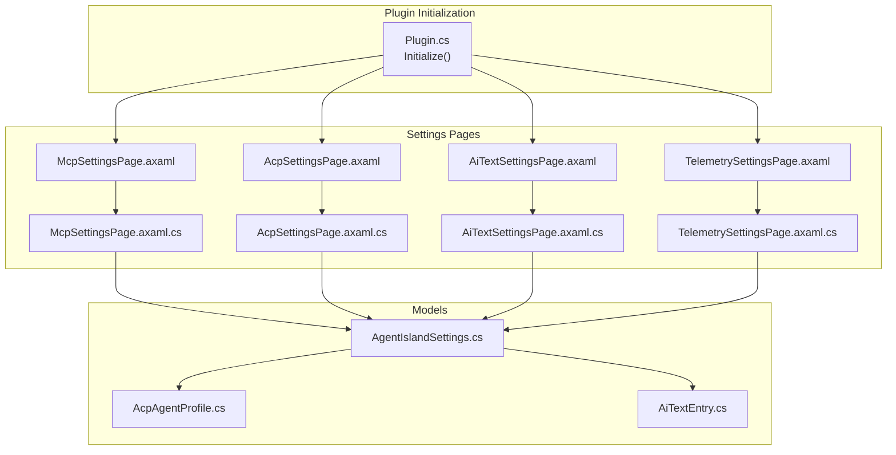
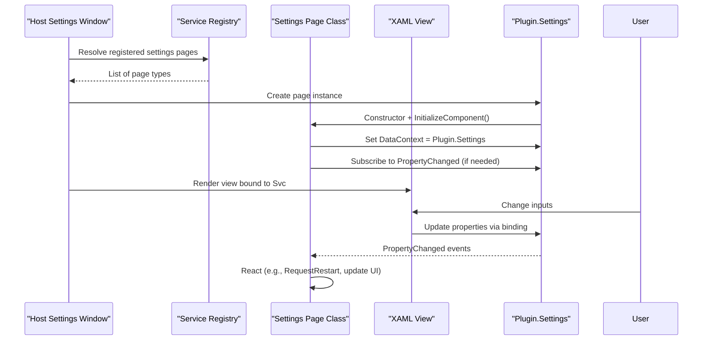
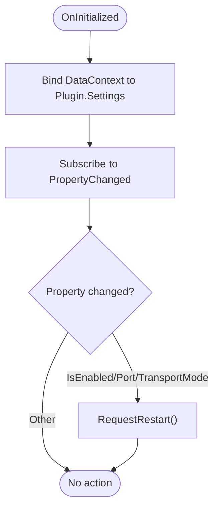
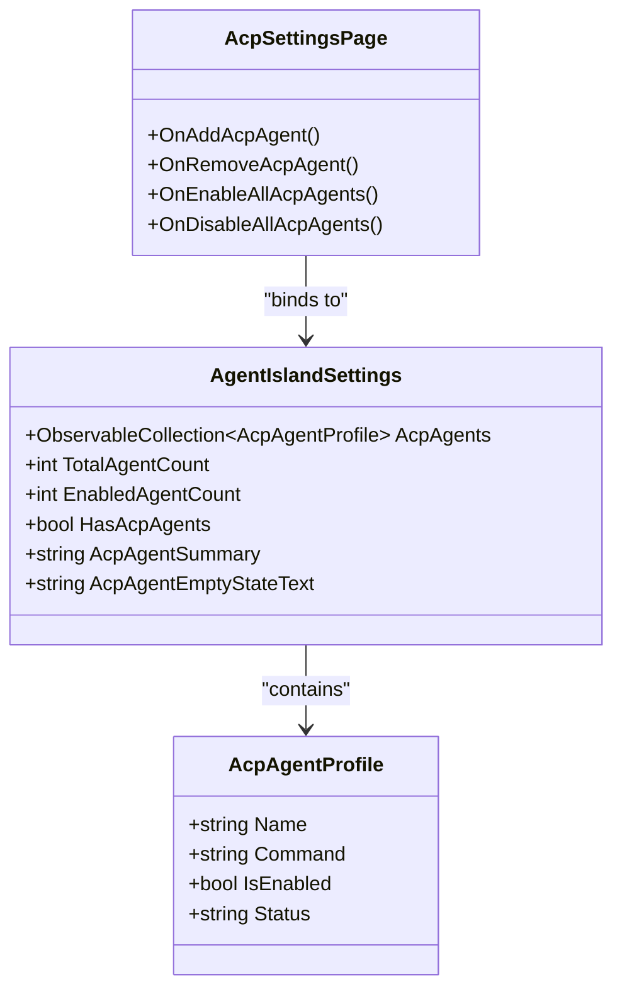
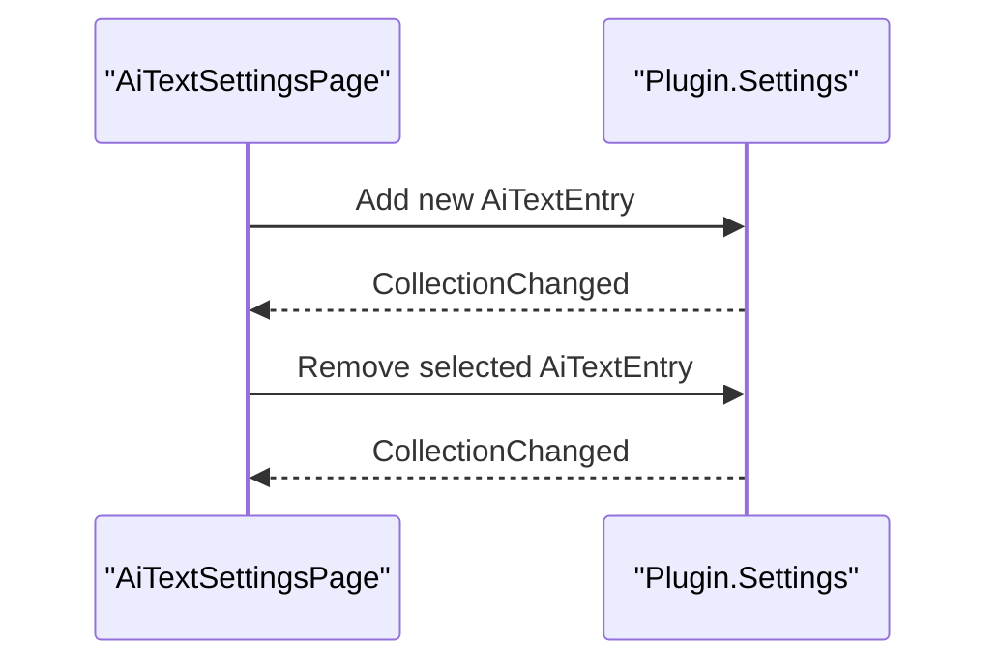
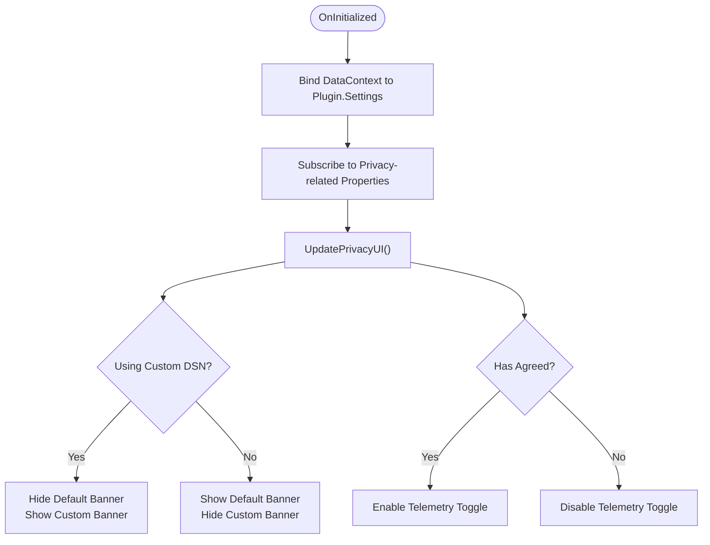
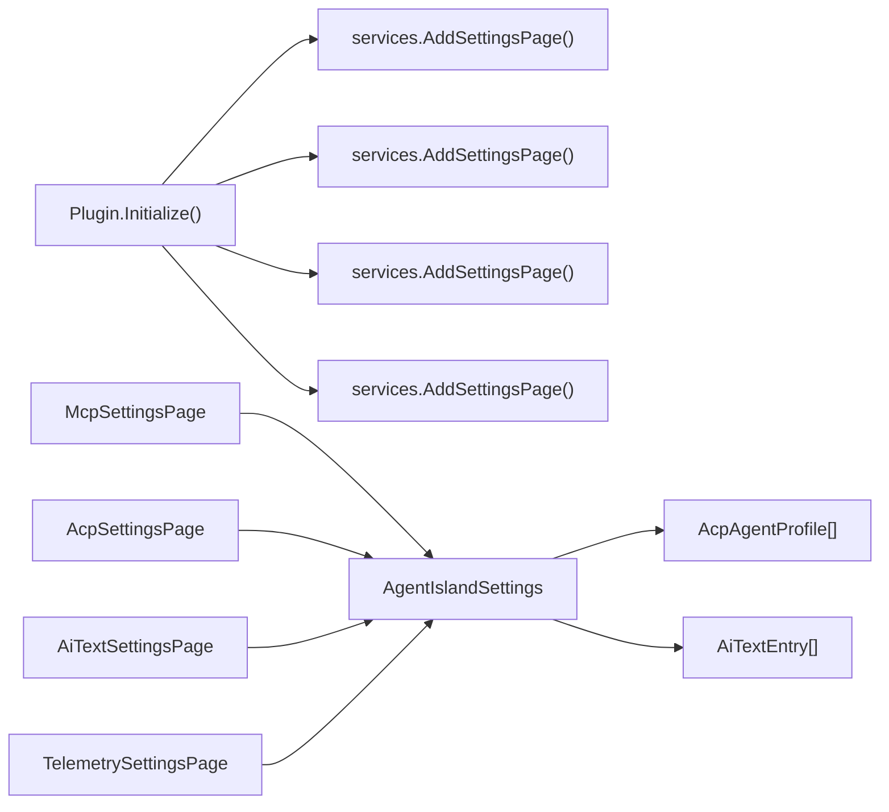

# Settings Pages Extension

<cite>
**Referenced Files in This Document**
- [Plugin.cs](file://Plugin.cs)
- [McpSettingsPage.axaml](file://Views/SettingsPages/McpSettingsPage.axaml)
- [McpSettingsPage.axaml.cs](file://Views/SettingsPages/McpSettingsPage.axaml.cs)
- [AcpSettingsPage.axaml](file://Views/SettingsPages/AcpSettingsPage.axaml)
- [AcpSettingsPage.axaml.cs](file://Views/SettingsPages/AcpSettingsPage.axaml.cs)
- [AiTextSettingsPage.axaml](file://Views/SettingsPages/AiTextSettingsPage.axaml)
- [AiTextSettingsPage.axaml.cs](file://Views/SettingsPages/AiTextSettingsPage.axaml.cs)
- [TelemetrySettingsPage.axaml](file://Views/SettingsPages/TelemetrySettingsPage.axaml)
- [TelemetrySettingsPage.axaml.cs](file://Views/SettingsPages/TelemetrySettingsPage.axaml.cs)
- [AgentIslandSettings.cs](file://Models/AgentIslandSettings.cs)
- [AcpAgentProfile.cs](file://Models/AcpAgentProfile.cs)
- [AiTextEntry.cs](file://Models/AiTextEntry.cs)
</cite>

## Table of Contents
1. [Introduction](#introduction)
2. [Project Structure](#project-structure)
3. [Core Components](#core-components)
4. [Architecture Overview](#architecture-overview)
5. [Detailed Component Analysis](#detailed-component-analysis)
6. [Dependency Analysis](#dependency-analysis)
7. [Performance Considerations](#performance-considerations)
8. [Troubleshooting Guide](#troubleshooting-guide)
9. [Conclusion](#conclusion)
10. [Appendices](#appendices)

## Introduction
This document explains how to create custom settings pages in AgentIsland using the provided examples: McpSettingsPage, AcpSettingsPage, AiTextSettingsPage, and TelemetrySettingsPage. It covers page registration via AddSettingsPage, reactive property binding with XAML, user input handling, real-time configuration updates, integration with AgentIslandSettings, validation patterns, error display, localization considerations, accessibility tips, best practices for UX, and testing strategies for configuration interfaces.

## Project Structure
The settings pages are implemented as Avalonia XAML views paired with code-behind classes. They extend a shared base control and are registered into the host’s dependency injection container so that the settings window can discover and render them.

**Diagram sources**
- [Plugin.cs:29-53](file://Plugin.cs#L29-L53)
- [McpSettingsPage.axaml:1-89](file://Views/SettingsPages/McpSettingsPage.axaml#L1-L89)
- [McpSettingsPage.axaml.cs:1-66](file://Views/SettingsPages/McpSettingsPage.axaml.cs#L1-L66)
- [AcpSettingsPage.axaml:1-108](file://Views/SettingsPages/AcpSettingsPage.axaml#L1-L108)
- [AcpSettingsPage.axaml.cs:1-67](file://Views/SettingsPages/AcpSettingsPage.axaml.cs#L1-L67)
- [AiTextSettingsPage.axaml:1-81](file://Views/SettingsPages/AiTextSettingsPage.axaml#L1-L81)
- [AiTextSettingsPage.axaml.cs:1-36](file://Views/SettingsPages/AiTextSettingsPage.axaml.cs#L1-L36)
- [TelemetrySettingsPage.axaml:1-106](file://Views/SettingsPages/TelemetrySettingsPage.axaml#L1-L106)
- [TelemetrySettingsPage.axaml.cs:1-145](file://Views/SettingsPages/TelemetrySettingsPage.axaml.cs#L1-L145)
- [AgentIslandSettings.cs:1-394](file://Models/AgentIslandSettings.cs#L1-L394)
- [AcpAgentProfile.cs:1-44](file://Models/AcpAgentProfile.cs#L1-L44)
- [AiTextEntry.cs:1-31](file://Models/AiTextEntry.cs#L1-L31)

**Section sources**
- [Plugin.cs:29-53](file://Plugin.cs#L29-L53)

## Core Components
- Settings page base: All pages inherit from a shared base control (SettingsPageBase), which provides lifecycle hooks such as OnInitialized and helpers like RequestRestart.
- Registration: Pages are registered with the host via AddSettingsPage<T> during plugin initialization.
- Data binding: Each page sets its DataContext to Plugin.Settings (an instance of AgentIslandSettings). XAML binds directly to properties on this object.
- Reactive updates: The settings model raises property change notifications; pages subscribe to PropertyChanged when they need to react to specific changes.

Key responsibilities by example:
- McpSettingsPage: Binds server enablement, port, transport mode, and connection address; requests restart when relevant settings change.
- AcpSettingsPage: Manages an observable list of agent profiles; supports add/remove and bulk enable/disable operations.
- AiTextSettingsPage: Manages an observable list of text entries; supports add/delete and two-way binding for ID/description/text.
- TelemetrySettingsPage: Controls telemetry toggle, privacy agreement, custom DSN, and UI banners; reacts to privacy-related changes.

**Section sources**
- [Plugin.cs:45-48](file://Plugin.cs#L45-L48)
- [McpSettingsPage.axaml.cs:26-41](file://Views/SettingsPages/McpSettingsPage.axaml.cs#L26-L41)
- [AcpSettingsPage.axaml.cs:25-64](file://Views/SettingsPages/AcpSettingsPage.axaml.cs#L25-L64)
- [AiTextSettingsPage.axaml.cs:16-35](file://Views/SettingsPages/AiTextSettingsPage.axaml.cs#L16-L35)
- [TelemetrySettingsPage.axaml.cs:27-42](file://Views/SettingsPages/TelemetrySettingsPage.axaml.cs#L27-L42)
- [AgentIslandSettings.cs:13-33](file://Models/AgentIslandSettings.cs#L13-L33)

## Architecture Overview
The settings system follows a simple MVVM-like pattern:
- View: XAML defines layout and bindings.
- Code-behind: Initializes DataContext, handles events, and coordinates UI state.
- Model: AgentIslandSettings exposes observable properties and collections, persists changes, and computes derived values.

**Diagram sources**
- [Plugin.cs:45-48](file://Plugin.cs#L45-L48)
- [McpSettingsPage.axaml.cs:26-41](file://Views/SettingsPages/McpSettingsPage.axaml.cs#L26-L41)
- [TelemetrySettingsPage.axaml.cs:27-42](file://Views/SettingsPages/TelemetrySettingsPage.axaml.cs#L27-L42)
- [AgentIslandSettings.cs:240-273](file://Models/AgentIslandSettings.cs#L240-L273)

## Detailed Component Analysis

### McpSettingsPage
Responsibilities:
- Bind IsEnabled, Port, TransportMode, ConnectionAddress.
- Provide copy-to-clipboard for the connection address.
- Open external documentation link.
- Request restart when server-affecting settings change.

Reactive behavior:
- Subscribes to PropertyChanged for IsEnabled, Port, TransportMode and calls RequestRestart.

User input handling:
- ToggleSwitch for enabling/disabling the server.
- NumericUpDown for port selection.
- ComboBox for transport mode.
- Button with Flyout feedback for copying address.

Validation patterns:
- Numeric range enforced by NumericUpDown Minimum/Maximum.
- Restart prompt ensures server reconfiguration is applied safely.

Accessibility and UX:
- Uses semantic controls (ToggleSwitch, NumericUpDown, ComboBox) with descriptive headers and descriptions.
- Provides clear affordances (copy button with tooltip and flyout confirmation).

Localization support:
- Text content is embedded in XAML; for multi-language support, replace static strings with resource keys and bind to localized resources.

**Diagram sources**
- [McpSettingsPage.axaml.cs:26-41](file://Views/SettingsPages/McpSettingsPage.axaml.cs#L26-L41)

**Section sources**
- [McpSettingsPage.axaml:16-83](file://Views/SettingsPages/McpSettingsPage.axaml#L16-L83)
- [McpSettingsPage.axaml.cs:26-63](file://Views/SettingsPages/McpSettingsPage.axaml.cs#L26-L63)
- [AgentIslandSettings.cs:204-211](file://Models/AgentIslandSettings.cs#L204-L211)

### AcpSettingsPage
Responsibilities:
- Manage AcpAgents collection (add/remove).
- Bulk enable/disable all agents.
- Display summary and empty-state messages.

Reactive behavior:
- Two-way binding to Name, Command, IsEnabled, Status on each agent profile.
- Derived properties on AgentIslandSettings update summaries automatically.

User input handling:
- ItemsControl with DataTemplate for per-agent editing.
- Buttons for adding/removing agents and toggling all.

Validation patterns:
- No explicit validation shown; consider adding input validation for command fields and status indicators if required.

Accessibility and UX:
- Clear section headers and descriptions.
- Empty state guidance improves first-run experience.

**Diagram sources**
- [AgentIslandSettings.cs:127-143](file://Models/AgentIslandSettings.cs#L127-L143)
- [AgentIslandSettings.cs:214-238](file://Models/AgentIslandSettings.cs#L214-L238)
- [AcpAgentProfile.cs:16-42](file://Models/AcpAgentProfile.cs#L16-L42)
- [AcpSettingsPage.axaml.cs:31-64](file://Views/SettingsPages/AcpSettingsPage.axaml.cs#L31-L64)

**Section sources**
- [AcpSettingsPage.axaml:41-102](file://Views/SettingsPages/AcpSettingsPage.axaml#L41-L102)
- [AcpSettingsPage.axaml.cs:25-64](file://Views/SettingsPages/AcpSettingsPage.axaml.cs#L25-L64)
- [AgentIslandSettings.cs:275-338](file://Models/AgentIslandSettings.cs#L275-L338)

### AiTextSettingsPage
Responsibilities:
- Manage AiTextEntries collection (add/delete).
- Display item details and allow inline editing.

Reactive behavior:
- Two-way binding to Id, Description, Text.
- DisplayName and HasNoDescription computed from underlying properties.

User input handling:
- Button to add new entry.
- Per-item delete button.
- Inline editors for ID, description, and current text.

Validation patterns:
- Ensure unique IDs at the model level if necessary.
- Consider disabling delete for protected items or prompting before deletion.

Accessibility and UX:
- Use meaningful labels and watermarks.
- Show empty state when no entries exist.

**Diagram sources**
- [AiTextSettingsPage.axaml.cs:22-34](file://Views/SettingsPages/AiTextSettingsPage.axaml.cs#L22-L34)
- [AiTextEntry.cs:16-29](file://Models/AiTextEntry.cs#L16-L29)

**Section sources**
- [AiTextSettingsPage.axaml:25-76](file://Views/SettingsPages/AiTextSettingsPage.axaml#L25-L76)
- [AiTextSettingsPage.axaml.cs:16-35](file://Views/SettingsPages/AiTextSettingsPage.axaml.cs#L16-L35)
- [AgentIslandSettings.cs:340-392](file://Models/AgentIslandSettings.cs#L340-L392)

### TelemetrySettingsPage
Responsibilities:
- Control telemetry toggle, privacy agreement, and custom Sentry DSN.
- Dynamically show/hide banners and test controls based on settings.
- Prompt user for consent and provide links to policy.

Reactive behavior:
- Subscribes to PropertyChanged for privacy-related properties and updates UI accordingly.
- Updates visibility of banners and test expander based on IsUsingCustomDsn and debug builds.

User input handling:
- ToggleSwitch for enabling telemetry.
- TextBox for custom DSN.
- Buttons for privacy actions and viewing policy.

Validation patterns:
- Enforce that telemetry can only be enabled when privacy conditions are met (via CanToggleTelemetry logic in the model).
- Optional DSN validation could be added to prevent invalid URLs.

Accessibility and UX:
- Clear status text and actionable buttons.
- Informative banners explain implications of choices.

**Diagram sources**
- [TelemetrySettingsPage.axaml.cs:27-73](file://Views/SettingsPages/TelemetrySettingsPage.axaml.cs#L27-L73)
- [AgentIslandSettings.cs:178-200](file://Models/AgentIslandSettings.cs#L178-L200)

**Section sources**
- [TelemetrySettingsPage.axaml:16-101](file://Views/SettingsPages/TelemetrySettingsPage.axaml#L16-L101)
- [TelemetrySettingsPage.axaml.cs:27-144](file://Views/SettingsPages/TelemetrySettingsPage.axaml.cs#L27-L144)
- [AgentIslandSettings.cs:178-200](file://Models/AgentIslandSettings.cs#L178-L200)

## Dependency Analysis
- Plugin initialization registers all four settings pages with the host.
- Each page depends on Plugin.Settings for data binding and side effects.
- Models implement INotifyPropertyChanged and ObservableObject patterns to drive reactive UI updates.

**Diagram sources**
- [Plugin.cs:45-48](file://Plugin.cs#L45-L48)
- [AgentIslandSettings.cs:127-143](file://Models/AgentIslandSettings.cs#L127-L143)
- [AgentIslandSettings.cs:107-122](file://Models/AgentIslandSettings.cs#L107-L122)

**Section sources**
- [Plugin.cs:45-48](file://Plugin.cs#L45-L48)

## Performance Considerations
- Prefer lightweight bindings and avoid heavy computations in property getters used frequently by the UI.
- Use derived properties judiciously; ensure OnPropertyChanged is raised only when necessary.
- For large lists (e.g., many agents or entries), consider virtualization and lazy loading where applicable.
- Debounce expensive operations triggered by frequent property changes (e.g., network checks or file I/O).

[No sources needed since this section provides general guidance]

## Troubleshooting Guide
Common issues and resolutions:
- Changes not reflected in UI:
  - Verify that properties raise PropertyChanged and that XAML binds to the correct properties.
  - Ensure collections are ObservableCollection and that pages subscribe to PropertyChanged when needed.
- Restart not requested after changing server settings:
  - Confirm that the page subscribes to PropertyChanged for IsEnabled, Port, TransportMode and calls RequestRestart.
- Privacy banner not updating:
  - Check subscription to HasAgreedToPrivacyPolicy and CustomSentryDsn and that UpdatePrivacyUI runs on changes.
- Copy-to-clipboard not working:
  - Ensure TopLevel.GetTopLevel(this) returns a valid TopLevel and Clipboard is available.

**Section sources**
- [McpSettingsPage.axaml.cs:33-41](file://Views/SettingsPages/McpSettingsPage.axaml.cs#L33-L41)
- [TelemetrySettingsPage.axaml.cs:35-73](file://Views/SettingsPages/TelemetrySettingsPage.axaml.cs#L35-L73)
- [McpSettingsPage.axaml.cs:43-54](file://Views/SettingsPages/McpSettingsPage.axaml.cs#L43-L54)

## Conclusion
AgentIsland’s settings pages follow a consistent pattern: register pages via AddSettingsPage, bind to a central settings model, and handle user interactions through event handlers and reactive property subscriptions. By leveraging observable collections, derived properties, and clear UI affordances, developers can build robust, accessible, and user-friendly configuration interfaces.

[No sources needed since this section summarizes without analyzing specific files]

## Appendices

### Step-by-step guide to implement a new settings page
1. Create a new class under Views/SettingsPages that extends the shared settings page base.
2. Add a corresponding XAML file defining the layout and bindings to Plugin.Settings.
3. In the constructor or OnInitialized, set DataContext to Plugin.Settings and subscribe to PropertyChanged if you need to react to specific changes.
4. Register the page in Plugin.Initialize using services.AddSettingsPage<YourPage>().
5. Implement user input handlers for actions like add/remove, enable/disable, and any validation or side effects.
6. Test the page in the settings window and verify persistence and reactivity.

**Section sources**
- [Plugin.cs:45-48](file://Plugin.cs#L45-L48)
- [McpSettingsPage.axaml.cs:26-31](file://Views/SettingsPages/McpSettingsPage.axaml.cs#L26-L31)
- [TelemetrySettingsPage.axaml.cs:27-33](file://Views/SettingsPages/TelemetrySettingsPage.axaml.cs#L27-L33)

### Best practices for user experience
- Provide clear headers and descriptions for each setting group.
- Use appropriate input controls (ToggleSwitch, NumericUpDown, ComboBox, TextBox) with constraints and watermarks.
- Show informative banners and empty states to guide users.
- Offer immediate feedback (e.g., copy confirmation, dialogs for destructive actions).
- Keep critical changes safe by requesting restart or confirming irreversible actions.

[No sources needed since this section provides general guidance]

### Testing strategies for configuration interfaces
- Unit tests for models:
  - Validate derived properties (e.g., effective DSN, connection address).
  - Ensure collection change notifications propagate correctly.
- UI tests for pages:
  - Simulate user interactions (toggle switches, entering values, adding/removing items).
  - Assert UI state changes (visibility of banners, enabled/disabled states).
  - Verify side effects (restart prompts, clipboard operations).
- Integration tests:
  - Load settings from disk, modify via UI, and confirm persistence.
  - Validate telemetry behavior under different privacy configurations.

[No sources needed since this section provides general guidance]