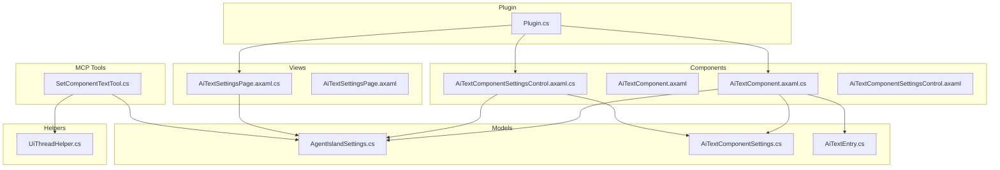
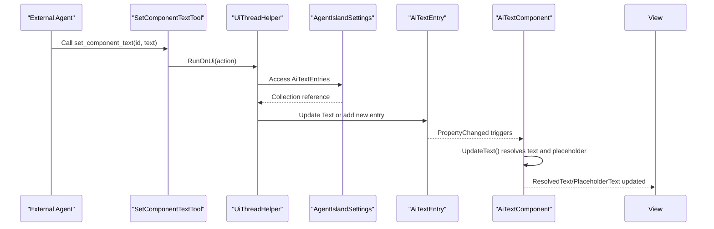
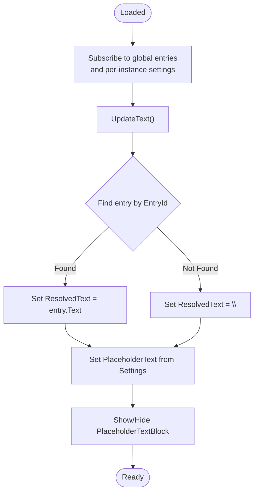
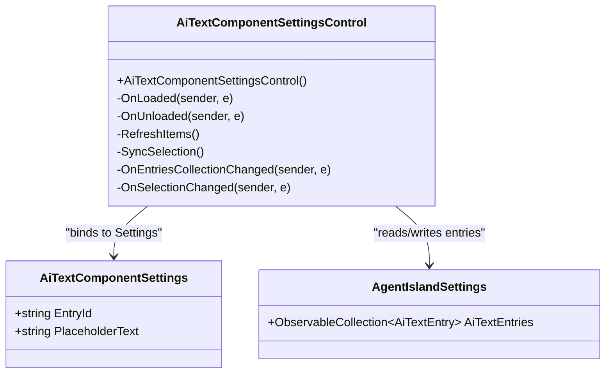
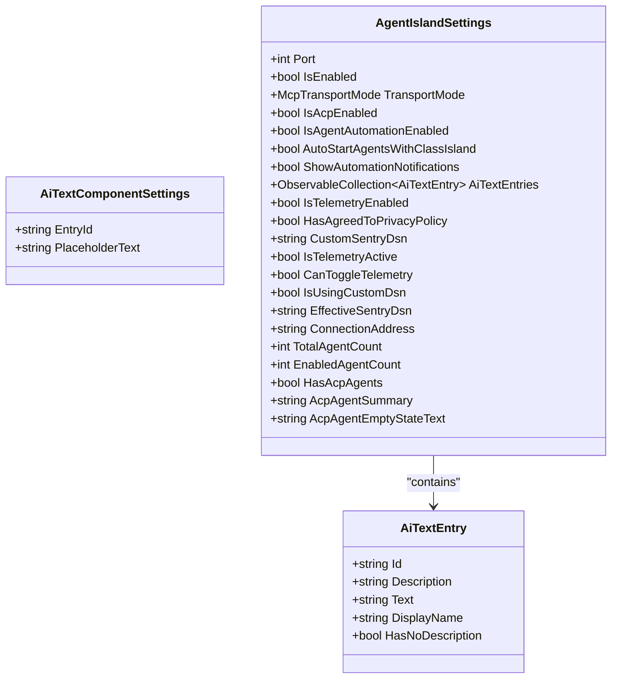
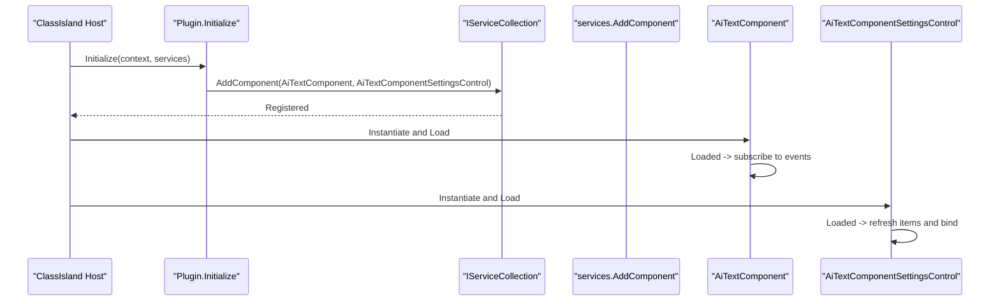
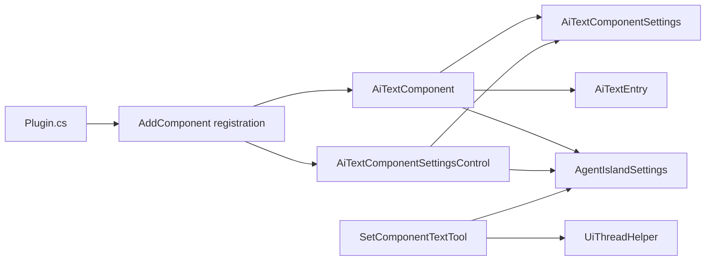

# UI Components Extension

<cite>
**Referenced Files in This Document**
- [Plugin.cs](file://Plugin.cs)
- [AiTextComponent.axaml.cs](file://Components/AiTextComponent.axaml.cs)
- [AiTextComponent.axaml](file://Components/AiTextComponent.axaml)
- [AiTextComponentSettingsControl.axaml.cs](file://Components/AiTextComponentSettingsControl.axaml.cs)
- [AiTextComponentSettingsControl.axaml](file://Components/AiTextComponentSettingsControl.axaml)
- [AgentIslandSettings.cs](file://Models/AgentIslandSettings.cs)
- [AiTextComponentSettings.cs](file://Models/AiTextComponentSettings.cs)
- [AiTextEntry.cs](file://Models/AiTextEntry.cs)
- [SetComponentTextTool.cs](file://Mcp/Tools/SetComponentTextTool.cs)
- [UiThreadHelper.cs](file://Helpers/UiThreadHelper.cs)
- [AiTextSettingsPage.axaml.cs](file://Views/SettingsPages/AiTextSettingsPage.axaml.cs)
- [AiTextSettingsPage.axaml](file://Views/SettingsPages/AiTextSettingsPage.axaml)
</cite>

## Table of Contents
1. [Introduction](#introduction)
2. [Project Structure](#project-structure)
3. [Core Components](#core-components)
4. [Architecture Overview](#architecture-overview)
5. [Detailed Component Analysis](#detailed-component-analysis)
6. [Dependency Analysis](#dependency-analysis)
7. [Performance Considerations](#performance-considerations)
8. [Troubleshooting Guide](#troubleshooting-guide)
9. [Conclusion](#conclusion)
10. [Appendices](#appendices)

## Introduction
This document explains how to create custom UI components in AgentIsland using Avalonia XAML within ClassIsland’s plugin framework. It focuses on the AiTextComponent architecture, including component registration via AddComponent, property binding patterns, reactive updates, and the separation between component logic (AiTextComponent) and settings control (AiTextComponentSettingsControl). It also details XAML markup structure, data binding to AgentIslandSettings, component lifecycle within ClassIsland’s UI framework, event handling, styling options, and integration with the main application. Finally, it provides a step-by-step guide for implementing new components, MVVM best practices, and troubleshooting common UI issues.

## Project Structure
The project is organized by feature areas:
- Components: UI components and their settings controls
- Models: Settings and data models
- Views: Settings pages for configuration
- Mcp/Tools: MCP tools that update component state
- Helpers: Utilities like UiThreadHelper
- Plugin entry point: Registration and initialization

**Diagram sources**
- [Plugin.cs](file://Plugin.cs)
- [AiTextComponent.axaml.cs](file://Components/AiTextComponent.axaml.cs)
- [AiTextComponent.axaml](file://Components/AiTextComponent.axaml)
- [AiTextComponentSettingsControl.axaml.cs](file://Components/AiTextComponentSettingsControl.axaml.cs)
- [AiTextComponentSettingsControl.axaml](file://Components/AiTextComponentSettingsControl.axaml)
- [AgentIslandSettings.cs](file://Models/AgentIslandSettings.cs)
- [AiTextComponentSettings.cs](file://Models/AiTextComponentSettings.cs)
- [AiTextEntry.cs](file://Models/AiTextEntry.cs)
- [AiTextSettingsPage.axaml.cs](file://Views/SettingsPages/AiTextSettingsPage.axaml.cs)
- [AiTextSettingsPage.axaml](file://Views/SettingsPages/AiTextSettingsPage.axaml)
- [SetComponentTextTool.cs](file://Mcp/Tools/SetComponentTextTool.cs)
- [UiThreadHelper.cs](file://Helpers/UiThreadHelper.cs)

**Section sources**
- [Plugin.cs](file://Plugin.cs)
- [AiTextComponent.axaml.cs](file://Components/AiTextComponent.axaml.cs)
- [AiTextComponent.axaml](file://Components/AiTextComponent.axaml)
- [AiTextComponentSettingsControl.axaml.cs](file://Components/AiTextComponentSettingsControl.axaml.cs)
- [AiTextComponentSettingsControl.axaml](file://Components/AiTextComponentSettingsControl.axaml)
- [AgentIslandSettings.cs](file://Models/AgentIslandSettings.cs)
- [AiTextComponentSettings.cs](file://Models/AiTextComponentSettings.cs)
- [AiTextEntry.cs](file://Models/AiTextEntry.cs)
- [AiTextSettingsPage.axaml.cs](file://Views/SettingsPages/AiTextSettingsPage.axaml.cs)
- [AiTextSettingsPage.axaml](file://Views/SettingsPages/AiTextSettingsPage.axaml)
- [SetComponentTextTool.cs](file://Mcp/Tools/SetComponentTextTool.cs)
- [UiThreadHelper.cs](file://Helpers/UiThreadHelper.cs)

## Core Components
- AiTextComponent: The visual component displayed in ClassIsland. It binds to resolved text and placeholder text, and reacts to changes in entries and settings.
- AiTextComponentSettingsControl: The settings UI used to select an entry and configure placeholder text.
- AgentIslandSettings: Central settings object containing collections of entries and other plugin configuration.
- AiTextComponentSettings: Per-instance settings for each component instance (e.g., which entry to bind to).
- AiTextEntry: A single text entry with ID, description, and current text.
- SetComponentTextTool: An MCP tool that updates an entry’s text from external agents.
- UiThreadHelper: Ensures UI updates occur on the UI thread.

Key responsibilities:
- Component logic vs. settings control separation
- Reactive updates through properties and collection change notifications
- Data binding to global settings and per-instance settings
- Integration with ClassIsland’s component system via attributes and registration

**Section sources**
- [AiTextComponent.axaml.cs](file://Components/AiTextComponent.axaml.cs)
- [AiTextComponent.axaml](file://Components/AiTextComponent.axaml)
- [AiTextComponentSettingsControl.axaml.cs](file://Components/AiTextComponentSettingsControl.axaml.cs)
- [AiTextComponentSettingsControl.axaml](file://Components/AiTextComponentSettingsControl.axaml)
- [AgentIslandSettings.cs](file://Models/AgentIslandSettings.cs)
- [AiTextComponentSettings.cs](file://Models/AiTextComponentSettings.cs)
- [AiTextEntry.cs](file://Models/AiTextEntry.cs)
- [SetComponentTextTool.cs](file://Mcp/Tools/SetComponentTextTool.cs)
- [UiThreadHelper.cs](file://Helpers/UiThreadHelper.cs)

## Architecture Overview
The component architecture follows MVVM principles:
- Model: AgentIslandSettings, AiTextEntry
- View: AiTextComponent (Avalonia XAML)
- ViewModel-like behavior: Component code-behind manages reactive updates and exposes StyledProperties for binding
- Settings Control: AiTextComponentSettingsControl for configuring per-instance settings
- Global Settings: AgentIslandSettings holds collections and persists changes
- External Updates: MCP tool SetComponentTextTool updates entries on the UI thread

**Diagram sources**
- [SetComponentTextTool.cs](file://Mcp/Tools/SetComponentTextTool.cs)
- [UiThreadHelper.cs](file://Helpers/UiThreadHelper.cs)
- [AgentIslandSettings.cs](file://Models/AgentIslandSettings.cs)
- [AiTextEntry.cs](file://Models/AiTextEntry.cs)
- [AiTextComponent.axaml.cs](file://Components/AiTextComponent.axaml.cs)

## Detailed Component Analysis

### AiTextComponent
- Inherits from ComponentBase<AiTextComponentSettings>, integrating with ClassIsland’s component system.
- Declares two Avalonia StyledProperties: ResolvedText and PlaceholderText for binding.
- Subscribes to:
  - Global collection changes (Plugin.Settings.AiTextEntries.CollectionChanged)
  - Individual entry property changes (AiTextEntry.PropertyChanged)
  - Per-instance settings changes (Settings.PropertyChanged)
- On Loaded/Unloaded, subscribes/unsubscribes to avoid memory leaks.
- UpdateText method:
  - Finds the entry matching Settings.EntryId
  - Sets ResolvedText to entry.Text if present; otherwise empty
  - Sets PlaceholderText from Settings.PlaceholderText
  - Shows/hides placeholder TextBlock based on content presence

**Diagram sources**
- [AiTextComponent.axaml.cs](file://Components/AiTextComponent.axaml.cs)
- [AiTextComponent.axaml](file://Components/AiTextComponent.axaml)

**Section sources**
- [AiTextComponent.axaml.cs](file://Components/AiTextComponent.axaml.cs)
- [AiTextComponent.axaml](file://Components/AiTextComponent.axaml)

### AiTextComponentSettingsControl
- Inherits from ComponentBase<AiTextComponentSettings>.
- Binds ComboBox.ItemsSource to global entries and syncs selection with Settings.EntryId.
- Provides TextBox bound to Settings.PlaceholderText for user input.
- Handles SelectionChanged to update Settings.EntryId when user picks an entry.
- Subscribes/unsubscribes to global collection changes on Loaded/Unloaded.

**Diagram sources**
- [AiTextComponentSettingsControl.axaml.cs](file://Components/AiTextComponentSettingsControl.axaml.cs)
- [AiTextComponentSettingsControl.axaml](file://Components/AiTextComponentSettingsControl.axaml)
- [AiTextComponentSettings.cs](file://Models/AiTextComponentSettings.cs)
- [AgentIslandSettings.cs](file://Models/AgentIslandSettings.cs)

**Section sources**
- [AiTextComponentSettingsControl.axaml.cs](file://Components/AiTextComponentSettingsControl.axaml.cs)
- [AiTextComponentSettingsControl.axaml](file://Components/AiTextComponentSettingsControl.axaml)
- [AiTextComponentSettings.cs](file://Models/AiTextComponentSettings.cs)
- [AgentIslandSettings.cs](file://Models/AgentIslandSettings.cs)

### Data Models
- AiTextEntry: Observable model with Id, Description, Text, DisplayName, HasNoDescription.
- AiTextComponentSettings: Per-instance settings with EntryId and PlaceholderText.
- AgentIslandSettings: Central settings with collections and derived properties; hooks into collection changes to propagate updates.

**Diagram sources**
- [AiTextEntry.cs](file://Models/AiTextEntry.cs)
- [AiTextComponentSettings.cs](file://Models/AiTextComponentSettings.cs)
- [AgentIslandSettings.cs](file://Models/AgentIslandSettings.cs)

**Section sources**
- [AiTextEntry.cs](file://Models/AiTextEntry.cs)
- [AiTextComponentSettings.cs](file://Models/AiTextComponentSettings.cs)
- [AgentIslandSettings.cs](file://Models/AgentIslandSettings.cs)

### Component Registration and Lifecycle
- Registration: In Plugin.Initialize, services.AddComponent registers the component and its settings control.
- Lifecycle:
  - ComponentBase handles instantiation and disposal within ClassIsland.
  - AiTextComponent subscribes to events on Loaded and unsubscribes on Unloaded.
  - Settings page sets DataContext to Plugin.Settings and manages entries.

**Diagram sources**
- [Plugin.cs](file://Plugin.cs)
- [AiTextComponent.axaml.cs](file://Components/AiTextComponent.axaml.cs)
- [AiTextComponentSettingsControl.axaml.cs](file://Components/AiTextComponentSettingsControl.axaml.cs)

**Section sources**
- [Plugin.cs](file://Plugin.cs)
- [AiTextComponent.axaml.cs](file://Components/AiTextComponent.axaml.cs)
- [AiTextComponentSettingsControl.axaml.cs](file://Components/AiTextComponentSettingsControl.axaml.cs)

### XAML Markup Structure and Binding Patterns
- AiTextComponent.axaml:
  - Uses Ci:ComponentBase with x:TypeArguments pointing to AiTextComponentSettings.
  - Two TextBlocks: one bound to ResolvedText, another to PlaceholderText.
  - Placeholder visibility toggled in code-behind based on content presence.
- AiTextComponentSettingsControl.axaml:
  - ComboBox bound to global entries with item template showing Id and Description.
  - TextBox bound to Settings.PlaceholderText via RelativeSource ancestor binding.
  - Instructional text explaining usage.

**Section sources**
- [AiTextComponent.axaml](file://Components/AiTextComponent.axaml)
- [AiTextComponentSettingsControl.axaml](file://Components/AiTextComponentSettingsControl.axaml)

### Styling Options
- Opacity used for placeholder text to visually indicate non-active state.
- Spacing and layout controlled via StackPanel and Panel containers.
- Watermark placeholders in TextBox for guidance.
- FluentAvalonia controls used in settings pages for consistent look-and-feel.

[No sources needed since this section provides general guidance]

### Integration with Main Application
- Plugin.Initialize loads settings, wires persistence, and registers components and settings pages.
- AppStarted/AppStopping events manage MCP server lifecycle.
- Settings are persisted automatically via ConfigureFileHelper on property changes.

**Section sources**
- [Plugin.cs](file://Plugin.cs)

## Dependency Analysis
- AiTextComponent depends on:
  - AgentIslandSettings for global entries
  - AiTextComponentSettings for per-instance configuration
  - AiTextEntry for individual text content
- AiTextComponentSettingsControl depends on:
  - AgentIslandSettings for entries list
  - AiTextComponentSettings for selected entry and placeholder text
- SetComponentTextTool depends on:
  - UiThreadHelper for UI thread access
  - AgentIslandSettings for updating entries
- Plugin orchestrates registration and initialization.

**Diagram sources**
- [Plugin.cs](file://Plugin.cs)
- [AiTextComponent.axaml.cs](file://Components/AiTextComponent.axaml.cs)
- [AiTextComponentSettingsControl.axaml.cs](file://Components/AiTextComponentSettingsControl.axaml.cs)
- [AgentIslandSettings.cs](file://Models/AgentIslandSettings.cs)
- [AiTextComponentSettings.cs](file://Models/AiTextComponentSettings.cs)
- [AiTextEntry.cs](file://Models/AiTextEntry.cs)
- [SetComponentTextTool.cs](file://Mcp/Tools/SetComponentTextTool.cs)
- [UiThreadHelper.cs](file://Helpers/UiThreadHelper.cs)

**Section sources**
- [Plugin.cs](file://Plugin.cs)
- [AiTextComponent.axaml.cs](file://Components/AiTextComponent.axaml.cs)
- [AiTextComponentSettingsControl.axaml.cs](file://Components/AiTextComponentSettingsControl.axaml.cs)
- [AgentIslandSettings.cs](file://Models/AgentIslandSettings.cs)
- [AiTextComponentSettings.cs](file://Models/AiTextComponentSettings.cs)
- [AiTextEntry.cs](file://Models/AiTextEntry.cs)
- [SetComponentTextTool.cs](file://Mcp/Tools/SetComponentTextTool.cs)
- [UiThreadHelper.cs](file://Helpers/UiThreadHelper.cs)

## Performance Considerations
- Avoid heavy work in property change handlers; keep UpdateText lightweight.
- Use relative source bindings where possible to reduce code-behind complexity.
- Ensure proper unsubscription on Unloaded to prevent memory leaks.
- Batch UI updates when multiple entries change simultaneously.
- Prefer computed properties (like DisplayName) to minimize redundant calculations in UI.

[No sources needed since this section provides general guidance]

## Troubleshooting Guide
Common issues and resolutions:
- Placeholder not visible when no content:
  - Verify UpdateText sets PlaceholderText correctly and toggles PlaceholderTextBlock visibility.
- Selected entry not reflected in component:
  - Confirm Settings.EntryId matches an existing entry Id and SyncSelection runs after collection changes.
- UI not updating after MCP tool call:
  - Ensure SetComponentTextTool uses UiThreadHelper.RunOnUi to update entries on the UI thread.
- Memory leaks due to event subscriptions:
  - Check Loaded/Unloaded handlers for proper subscription/unsubscription.
- Settings not persisting:
  - Validate Plugin.Initialize wires ConfigureFileHelper save on Settings.PropertyChanged.

**Section sources**
- [AiTextComponent.axaml.cs](file://Components/AiTextComponent.axaml.cs)
- [AiTextComponentSettingsControl.axaml.cs](file://Components/AiTextComponentSettingsControl.axaml.cs)
- [SetComponentTextTool.cs](file://Mcp/Tools/SetComponentTextTool.cs)
- [UiThreadHelper.cs](file://Helpers/UiThreadHelper.cs)
- [Plugin.cs](file://Plugin.cs)

## Conclusion
The AiTextComponent demonstrates a clean separation of concerns between display logic and settings control, leveraging Avalonia XAML and ClassIsland’s component system. Reactive updates are achieved through property change notifications and collection change events, while MCP tools provide external mechanisms to update content. Following MVVM patterns and ensuring proper lifecycle management yields robust, maintainable UI components.

[No sources needed since this section summarizes without analyzing specific files]

## Appendices

### Step-by-Step Guide: Implementing a New Component
1. Create a new component class inheriting from ComponentBase<TSettings>:
   - Define any required StyledProperties for binding.
   - Subscribe to relevant events on Loaded and unsubscribe on Unloaded.
   - Implement update logic to reflect changes in settings or global data.
2. Create corresponding XAML markup:
   - Use Ci:ComponentBase with x:TypeArguments set to your settings type.
   - Bind UI elements to StyledProperties or use RelativeSource bindings to Settings.
3. Create a settings control class inheriting from ComponentBase<TSettings>:
   - Provide UI to edit per-instance settings.
   - Bind to global collections where necessary.
4. Register the component:
   - In Plugin.Initialize, call services.AddComponent(ComponentType, SettingsControlType).
5. Persist settings:
   - Ensure global settings are wired to save on property changes.
6. Test:
   - Verify UI updates reactively when global data or per-instance settings change.
   - Confirm proper cleanup on Unloaded.

**Section sources**
- [Plugin.cs](file://Plugin.cs)
- [AiTextComponent.axaml.cs](file://Components/AiTextComponent.axaml.cs)
- [AiTextComponent.axaml](file://Components/AiTextComponent.axaml)
- [AiTextComponentSettingsControl.axaml.cs](file://Components/AiTextComponentSettingsControl.axaml.cs)
- [AiTextComponentSettingsControl.axaml](file://Components/AiTextComponentSettingsControl.axaml)

### Best Practices for MVVM Pattern
- Keep UI logic minimal in code-behind; prefer bindings and computed properties.
- Use ObservableObject and ObservableRecipient for efficient property change notifications.
- Separate concerns:
  - Models hold data and business rules
  - Views handle presentation
  - ViewModels (or component code-behind acting as VM) coordinate updates
- Avoid direct UI manipulation outside UI thread; use UiThreadHelper.

**Section sources**
- [AiTextEntry.cs](file://Models/AiTextEntry.cs)
- [AiTextComponentSettings.cs](file://Models/AiTextComponentSettings.cs)
- [AgentIslandSettings.cs](file://Models/AgentIslandSettings.cs)
- [UiThreadHelper.cs](file://Helpers/UiThreadHelper.cs)