# Architecture Overview

<cite>
**Referenced Files in This Document**
- [Plugin.cs](file://Plugin.cs)
- [manifest.yml](file://manifest.yml)
- [McpServerManager.cs](file://Mcp/McpServerManager.cs)
- [AcpRunnerService.cs](file://Services/AcpRunnerService.cs)
- [SentryTelemetryService.cs](file://Services/SentryTelemetryService.cs)
- [AgentIslandSettings.cs](file://Models/AgentIslandSettings.cs)
- [McpTransportMode.cs](file://Models/McpTransportMode.cs)
- [AiTextComponent.axaml.cs](file://Components/AiTextComponent.axaml.cs)
- [RunAcpAction.cs](file://Automation/RunAcpAction.cs)
- [LessonTools.cs](file://Mcp/Tools/LessonTools.cs)
- [ScheduleTools.cs](file://Mcp/Tools/ScheduleTools.cs)
- [ToolResults.cs](file://Models/ToolResults.cs)
- [AiTextEntry.cs](file://Models/AiTextEntry.cs)
- [AcpAgentProfile.cs](file://Models/AcpAgentProfile.cs)
- [RunAcpActionSettings.cs](file://Models/RunAcpActionSettings.cs)
- [AiTextSettingsPage.axaml.cs](file://Views/SettingsPages/AiTextSettingsPage.axaml.cs)
- [AgentIslandNotificationProvider.cs](file://Mcp/Tools/AgentIslandNotificationProvider.cs)
</cite>

## Table of Contents
1. Introduction
2. Project Structure
3. Core Components
4. Architecture Overview
5. Detailed Component Analysis
6. Dependency Analysis
7. Performance Considerations
8. Troubleshooting Guide
9. Conclusion

## Introduction
AgentIsland is a ClassIsland plugin that exposes an MCP server and integrates with ClassIsland services to enable AI agents to interact with the timetable system, schedule management, and UI components. It also provides ACP (agent control protocol) support for running external agent processes via stdio, and offers MVVM-based UI components and settings pages. The plugin uses dependency injection, observable settings, and telemetry for observability.

## Project Structure
The project follows a feature-oriented layout:
- Plugin entrypoint and lifecycle orchestration
- MCP server manager and tools
- Services for ACP runner and telemetry
- Models for settings, profiles, and tool results
- UI components and settings pages
- Automation action integration

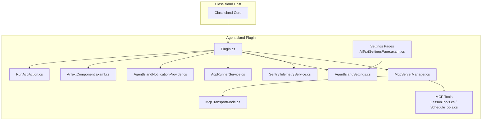

**Diagram sources**
- [Plugin.cs:1-114](file://Plugin.cs#L1-L114)
- [McpServerManager.cs:1-125](file://Mcp/McpServerManager.cs#L1-L125)
- [LessonTools.cs:1-146](file://Mcp/Tools/LessonTools.cs#L1-L146)
- [ScheduleTools.cs:1-204](file://Mcp/Tools/ScheduleTools.cs#L1-L204)
- [AcpRunnerService.cs:1-207](file://Services/AcpRunnerService.cs#L1-L207)
- [SentryTelemetryService.cs:1-182](file://Services/SentryTelemetryService.cs#L1-L182)
- [AgentIslandSettings.cs:1-394](file://Models/AgentIslandSettings.cs#L1-L394)
- [McpTransportMode.cs:1-18](file://Models/McpTransportMode.cs#L1-L18)
- [AiTextComponent.axaml.cs:1-85](file://Components/AiTextComponent.axaml.cs#L1-L85)
- [RunAcpAction.cs:1-84](file://Automation/RunAcpAction.cs#L1-L84)
- [AiTextSettingsPage.axaml.cs:1-35](file://Views/SettingsPages/AiTextSettingsPage.axaml.cs#L1-L35)
- [AgentIslandNotificationProvider.cs:1-52](file://Mcp/Tools/AgentIslandNotificationProvider.cs#L1-L52)

**Section sources**
- [manifest.yml:1-13](file://manifest.yml#L1-L13)
- [Plugin.cs:1-114](file://Plugin.cs#L1-L114)

## Core Components
- Plugin entrypoint: Initializes settings, registers services, subscribes to host lifecycle events, starts/stops MCP server, and wires telemetry.
- MCP Server Manager: Builds and runs the MCP server, selects transport mode (StreamableHttp or SSE), registers tools, and manages lifecycle.
- MCP Tools: Expose ClassIsland timetable operations (current/next class, time status, schedule queries, subject listing, swapping classes).
- ACP Runner Service: Starts external agent processes over stdio, initializes sessions, and sends prompts.
- Telemetry Service: Manages Sentry SDK lifecycle based on user consent and settings; instruments tool calls and server lifecycle.
- Settings and Models: Centralized observable settings, transport mode enum, ACP agent profiles, AI text entries, and tool result records.
- UI Components and Settings Pages: Avalonia-based component and settings pages bound to observable settings.
- Notification Provider: Integrates with ClassIsland notification channels to show overlays from automation flows.

**Section sources**
- [Plugin.cs:1-114](file://Plugin.cs#L1-L114)
- [McpServerManager.cs:1-125](file://Mcp/McpServerManager.cs#L1-L125)
- [LessonTools.cs:1-146](file://Mcp/Tools/LessonTools.cs#L1-L146)
- [ScheduleTools.cs:1-204](file://Mcp/Tools/ScheduleTools.cs#L1-L204)
- [AcpRunnerService.cs:1-207](file://Services/AcpRunnerService.cs#L1-L207)
- [SentryTelemetryService.cs:1-182](file://Services/SentryTelemetryService.cs#L1-L182)
- [AgentIslandSettings.cs:1-394](file://Models/AgentIslandSettings.cs#L1-L394)
- [McpTransportMode.cs:1-18](file://Models/McpTransportMode.cs#L1-L18)
- [AiTextComponent.axaml.cs:1-85](file://Components/AiTextComponent.axaml.cs#L1-L85)
- [AiTextSettingsPage.axaml.cs:1-35](file://Views/SettingsPages/AiTextSettingsPage.axaml.cs#L1-L35)
- [AgentIslandNotificationProvider.cs:1-52](file://Mcp/Tools/AgentIslandNotificationProvider.cs#L1-L52)

## Architecture Overview
High-level architecture shows AgentIsland as a ClassIsland plugin providing:
- An MCP server exposing tools to external AI clients
- ACP process runner for external agents
- UI components and settings integrated into ClassIsland
- Telemetry and notifications

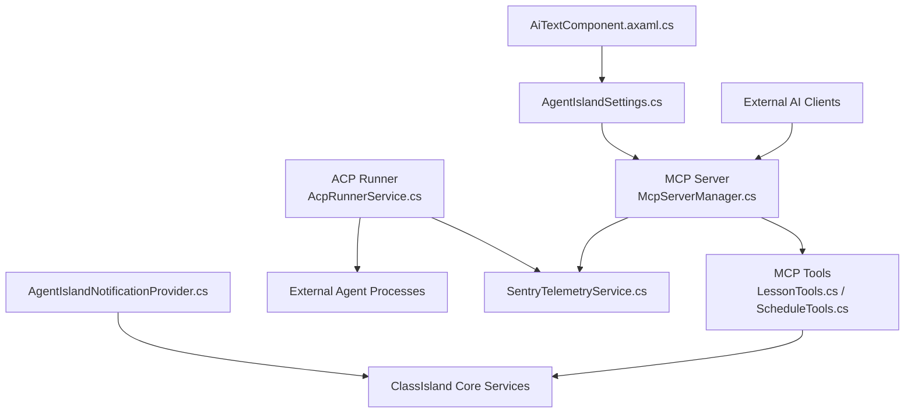

**Diagram sources**
- [Plugin.cs:1-114](file://Plugin.cs#L1-L114)
- [McpServerManager.cs:1-125](file://Mcp/McpServerManager.cs#L1-L125)
- [LessonTools.cs:1-146](file://Mcp/Tools/LessonTools.cs#L1-L146)
- [ScheduleTools.cs:1-204](file://Mcp/Tools/ScheduleTools.cs#L1-L204)
- [AcpRunnerService.cs:1-207](file://Services/AcpRunnerService.cs#L1-L207)
- [SentryTelemetryService.cs:1-182](file://Services/SentryTelemetryService.cs#L1-L182)
- [AgentIslandSettings.cs:1-394](file://Models/AgentIslandSettings.cs#L1-L394)
- [AiTextComponent.axaml.cs:1-85](file://Components/AiTextComponent.axaml.cs#L1-L85)
- [AgentIslandNotificationProvider.cs:1-52](file://Mcp/Tools/AgentIslandNotificationProvider.cs#L1-L52)

## Detailed Component Analysis

### Plugin Lifecycle and DI Registration
- Loads and persists settings with change tracking
- Registers services (settings, telemetry, ACP runner, notification provider, component, settings pages, automation action)
- Subscribes to host start/stop events to start/stop MCP server
- Disposes resources and unregisters event handlers

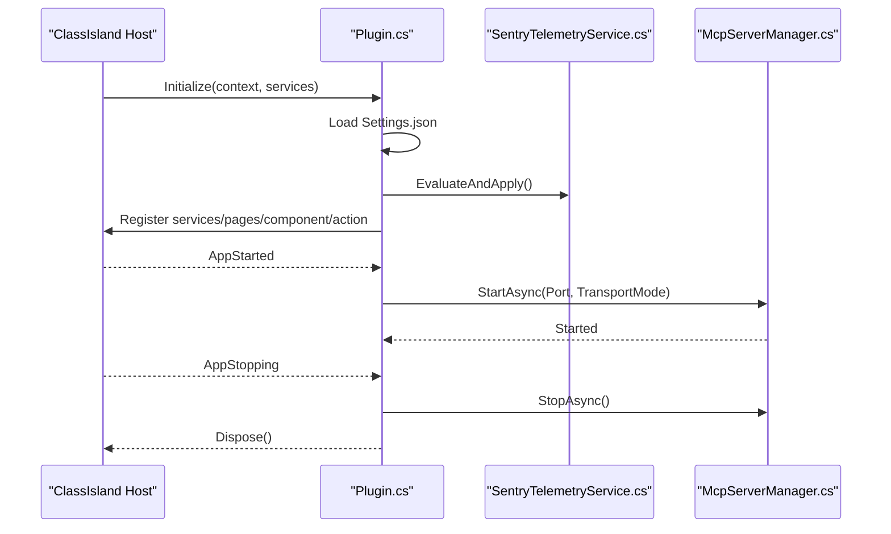

**Diagram sources**
- [Plugin.cs:1-114](file://Plugin.cs#L1-L114)
- [SentryTelemetryService.cs:1-182](file://Services/SentryTelemetryService.cs#L1-L182)
- [McpServerManager.cs:1-125](file://Mcp/McpServerManager.cs#L1-L125)

**Section sources**
- [Plugin.cs:1-114](file://Plugin.cs#L1-L114)

### MCP Server Manager and Transport Strategy
- Uses a builder pattern to construct the MCP server
- Applies a strategy to select transport mode (StreamableHttp vs SSE)
- Registers tools and JSON serializer context
- Wraps start/stop with telemetry transactions

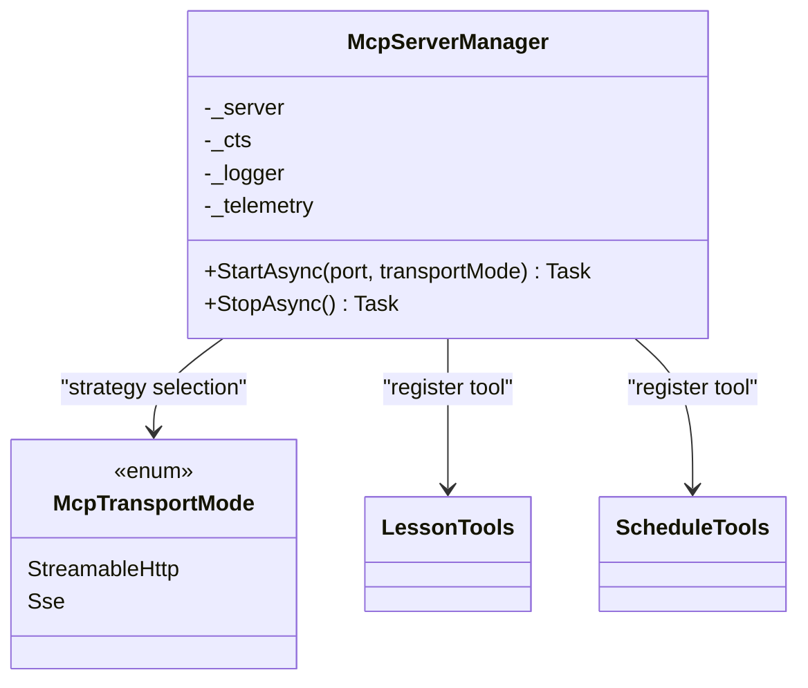

**Diagram sources**
- [McpServerManager.cs:1-125](file://Mcp/McpServerManager.cs#L1-L125)
- [McpTransportMode.cs:1-18](file://Models/McpTransportMode.cs#L1-L18)
- [LessonTools.cs:1-146](file://Mcp/Tools/LessonTools.cs#L1-L146)
- [ScheduleTools.cs:1-204](file://Mcp/Tools/ScheduleTools.cs#L1-L204)

**Section sources**
- [McpServerManager.cs:1-125](file://Mcp/McpServerManager.cs#L1-L125)
- [McpTransportMode.cs:1-18](file://Models/McpTransportMode.cs#L1-L18)

### MCP Tools and Data Flow
- Tools call ClassIsland services (lessons, profile, exact time) via IAppHost
- All UI-bound reads are marshaled to the UI thread
- Each tool method is wrapped by telemetry instrumentation

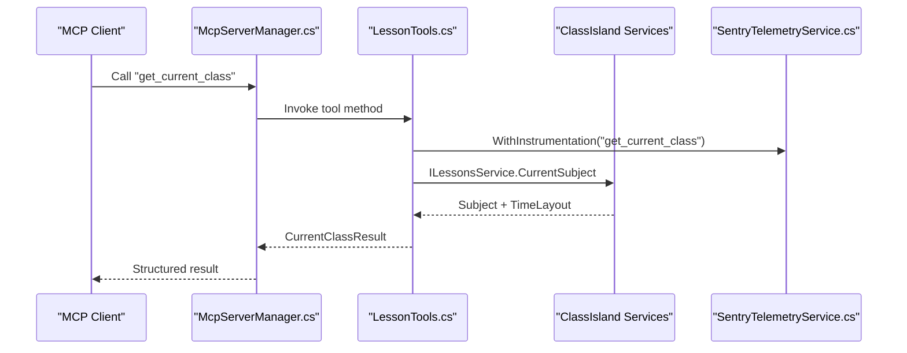

**Diagram sources**
- [McpServerManager.cs:1-125](file://Mcp/McpServerManager.cs#L1-L125)
- [LessonTools.cs:1-146](file://Mcp/Tools/LessonTools.cs#L1-L146)
- [SentryTelemetryService.cs:1-182](file://Services/SentryTelemetryService.cs#L1-L182)

**Section sources**
- [LessonTools.cs:1-146](file://Mcp/Tools/LessonTools.cs#L1-L146)
- [ScheduleTools.cs:1-204](file://Mcp/Tools/ScheduleTools.cs#L1-L204)
- [ToolResults.cs:1-59](file://Models/ToolResults.cs#L1-L59)

### ACP Runner Service and Process Lifecycle
- Spawns external agent processes using configured command lines
- Initializes session via JSON-RPC initialize handshake
- Sends prompt messages over stdin/stdout
- Ensures graceful shutdown with kill fallback

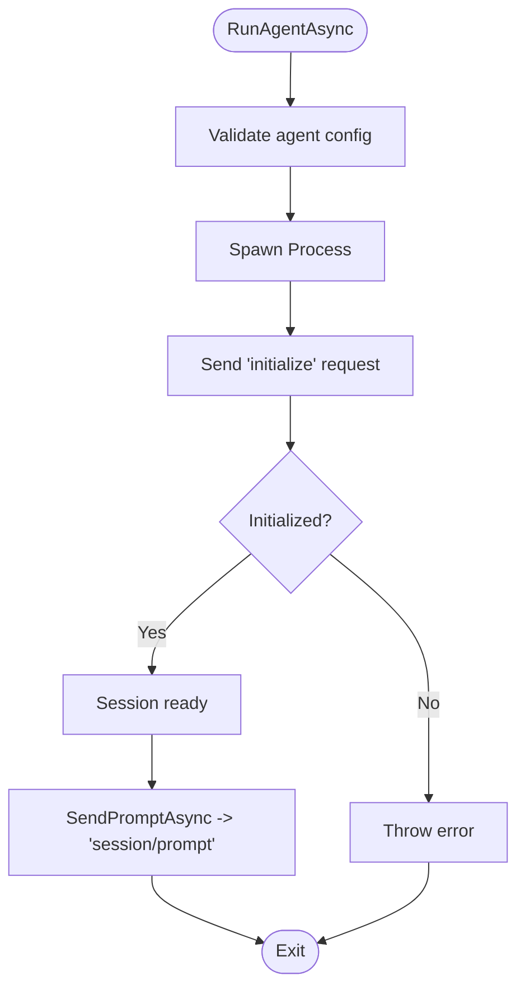

**Diagram sources**
- [AcpRunnerService.cs:1-207](file://Services/AcpRunnerService.cs#L1-L207)

**Section sources**
- [AcpRunnerService.cs:1-207](file://Services/AcpRunnerService.cs#L1-L207)

### MVVM UI Component and Reactive Properties
- AiTextComponent binds to observable settings and entries
- Updates resolved text and placeholder visibility reactively
- Observes collection changes and property updates

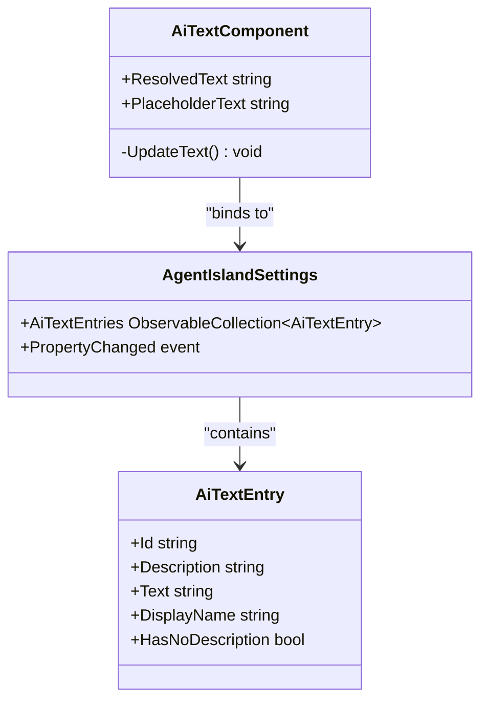

**Diagram sources**
- [AiTextComponent.axaml.cs:1-85](file://Components/AiTextComponent.axaml.cs#L1-L85)
- [AgentIslandSettings.cs:1-394](file://Models/AgentIslandSettings.cs#L1-L394)
- [AiTextEntry.cs:1-31](file://Models/AiTextEntry.cs#L1-L31)

**Section sources**
- [AiTextComponent.axaml.cs:1-85](file://Components/AiTextComponent.axaml.cs#L1-L85)
- [AgentIslandSettings.cs:1-394](file://Models/AgentIslandSettings.cs#L1-L394)
- [AiTextEntry.cs:1-31](file://Models/AiTextEntry.cs#L1-L31)

### Automation Action Integration
- RunAcpAction validates feature flags and agent availability
- Invokes AcpRunnerService to start the agent
- Optionally shows a notification via the notification provider

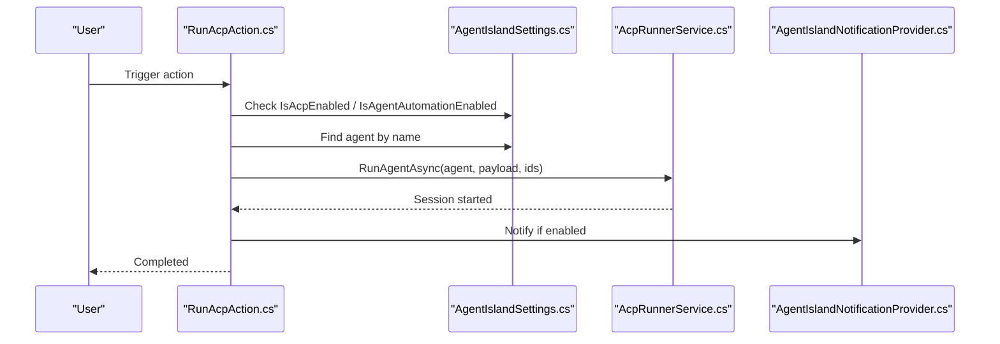

**Diagram sources**
- [RunAcpAction.cs:1-84](file://Automation/RunAcpAction.cs#L1-L84)
- [AgentIslandSettings.cs:1-394](file://Models/AgentIslandSettings.cs#L1-L394)
- [AcpRunnerService.cs:1-207](file://Services/AcpRunnerService.cs#L1-L207)
- [AgentIslandNotificationProvider.cs:1-52](file://Mcp/Tools/AgentIslandNotificationProvider.cs#L1-L52)

**Section sources**
- [RunAcpAction.cs:1-84](file://Automation/RunAcpAction.cs#L1-L84)
- [RunAcpActionSettings.cs:1-36](file://Models/RunAcpActionSettings.cs#L1-L36)

### Telemetry and Observability
- SentryTelemetryService initializes/shuts down SDK based on settings and privacy consent
- Provides instrumentation wrappers for synchronous and asynchronous operations
- Adds breadcrumbs and captures exceptions with context tags

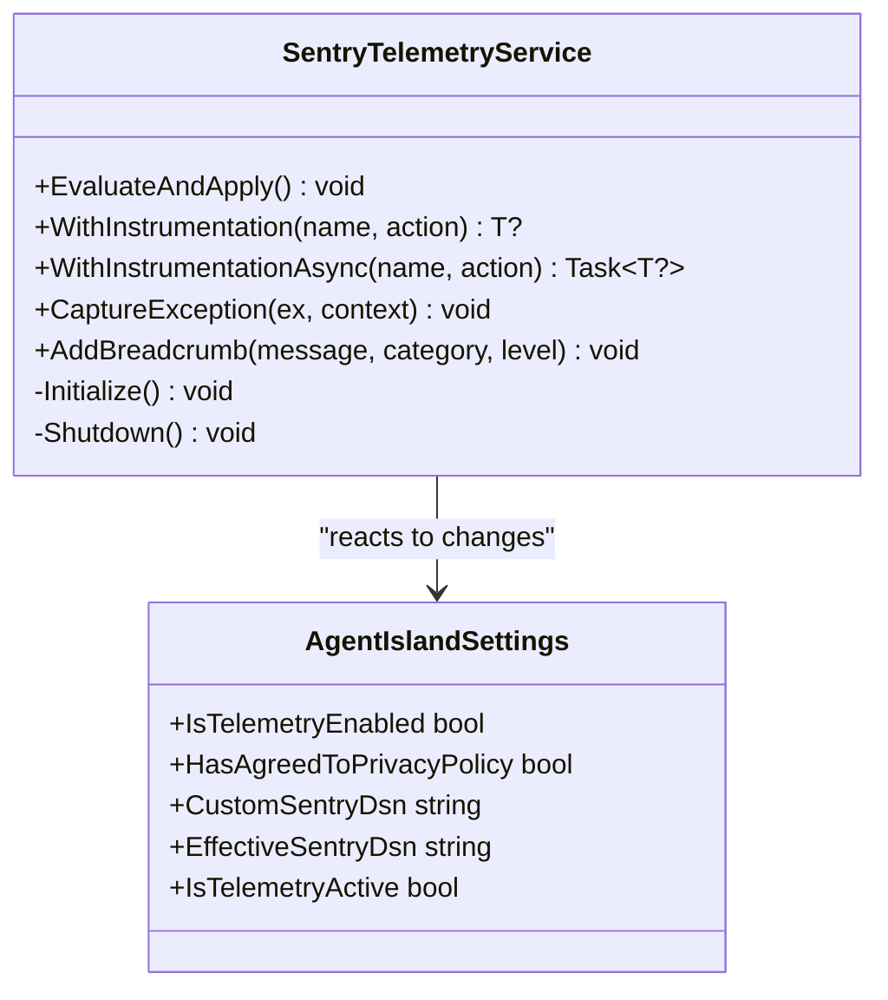

**Diagram sources**
- [SentryTelemetryService.cs:1-182](file://Services/SentryTelemetryService.cs#L1-L182)
- [AgentIslandSettings.cs:1-394](file://Models/AgentIslandSettings.cs#L1-L394)

**Section sources**
- [SentryTelemetryService.cs:1-182](file://Services/SentryTelemetryService.cs#L1-L182)
- [AgentIslandSettings.cs:1-394](file://Models/AgentIslandSettings.cs#L1-L394)

### System Context Diagram (Ecosystem and Protocols)
Shows how AgentIsland fits within ClassIsland and communicates with external AI agents through MCP and ACP protocols.

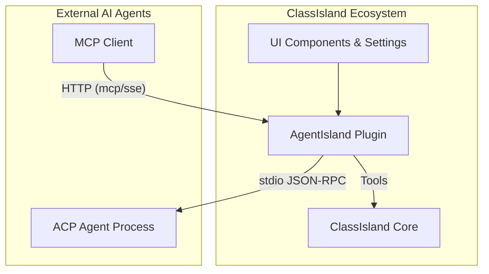

**Diagram sources**
- [Plugin.cs:1-114](file://Plugin.cs#L1-L114)
- [McpServerManager.cs:1-125](file://Mcp/McpServerManager.cs#L1-L125)
- [AcpRunnerService.cs:1-207](file://Services/AcpRunnerService.cs#L1-L207)
- [AiTextComponent.axaml.cs:1-85](file://Components/AiTextComponent.axaml.cs#L1-L85)

## Dependency Analysis
Key dependencies and relationships:
- Plugin depends on ClassIsland Core for hosting, DI, and service access
- MCP Server Manager depends on transport configuration and tool implementations
- Tools depend on ClassIsland services (lessons, profile, time)
- ACP Runner depends on OS process APIs and JSON-RPC over stdio
- Telemetry depends on Sentry SDK and settings
- UI components and settings pages depend on observable models

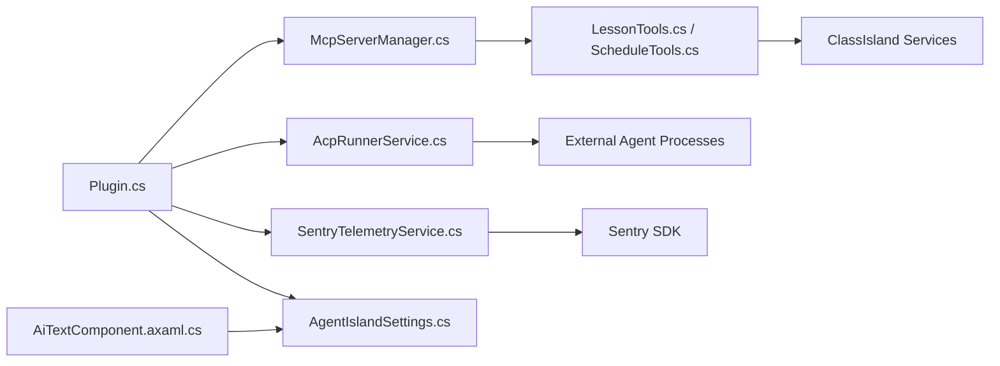

**Diagram sources**
- [Plugin.cs:1-114](file://Plugin.cs#L1-L114)
- [McpServerManager.cs:1-125](file://Mcp/McpServerManager.cs#L1-L125)
- [LessonTools.cs:1-146](file://Mcp/Tools/LessonTools.cs#L1-L146)
- [ScheduleTools.cs:1-204](file://Mcp/Tools/ScheduleTools.cs#L1-L204)
- [AcpRunnerService.cs:1-207](file://Services/AcpRunnerService.cs#L1-L207)
- [SentryTelemetryService.cs:1-182](file://Services/SentryTelemetryService.cs#L1-L182)
- [AgentIslandSettings.cs:1-394](file://Models/AgentIslandSettings.cs#L1-L394)
- [AiTextComponent.axaml.cs:1-85](file://Components/AiTextComponent.axaml.cs#L1-L85)

**Section sources**
- [Plugin.cs:1-114](file://Plugin.cs#L1-L114)
- [McpServerManager.cs:1-125](file://Mcp/McpServerManager.cs#L1-L125)
- [AcpRunnerService.cs:1-207](file://Services/AcpRunnerService.cs#L1-L207)
- [SentryTelemetryService.cs:1-182](file://Services/SentryTelemetryService.cs#L1-L182)
- [AgentIslandSettings.cs:1-394](file://Models/AgentIslandSettings.cs#L1-L394)

## Performance Considerations
- Prefer StreamableHttp transport for modern performance unless SSE compatibility is required.
- Keep MCP tool methods lightweight; offload heavy work to background tasks where possible.
- Use telemetry sampling judiciously in production to reduce overhead.
- Reuse ACP sessions when feasible to avoid frequent process startup costs.
- Avoid excessive UI thread marshaling; batch updates in components.

## Troubleshooting Guide
- MCP server fails to start:
  - Verify port availability and transport mode configuration.
  - Check logs and telemetry breadcrumbs for errors during start.
- ACP agent not starting:
  - Ensure command line is valid and executable path exists.
  - Confirm JSON-RPC initialize response is received.
- Notifications not shown:
  - Verify notification channel registration and UI thread invocation.
- Settings not persisting:
  - Confirm settings file path and write permissions.

**Section sources**
- [Plugin.cs:55-97](file://Plugin.cs#L55-L97)
- [McpServerManager.cs:25-112](file://Mcp/McpServerManager.cs#L25-L112)
- [AcpRunnerService.cs:25-100](file://Services/AcpRunnerService.cs#L25-L100)
- [AgentIslandNotificationProvider.cs:27-50](file://Mcp/Tools/AgentIslandNotificationProvider.cs#L27-L50)

## Conclusion
AgentIsland integrates tightly with ClassIsland to provide an MCP server and ACP runner, enabling external AI agents to interact with timetable data and automate actions. Its architecture leverages DI, observable settings, MVVM UI, and robust telemetry. The modular design supports extensibility through new tools, transports, and automation actions while maintaining clear separation of concerns.