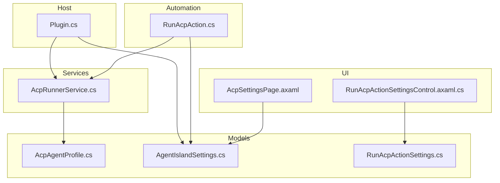
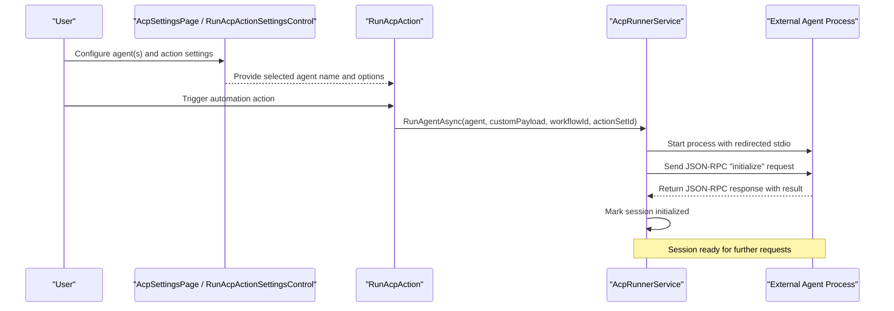
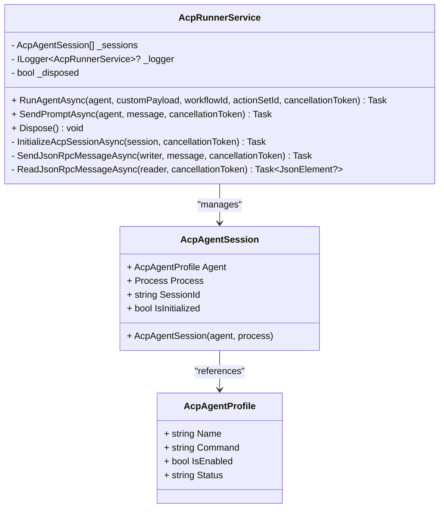
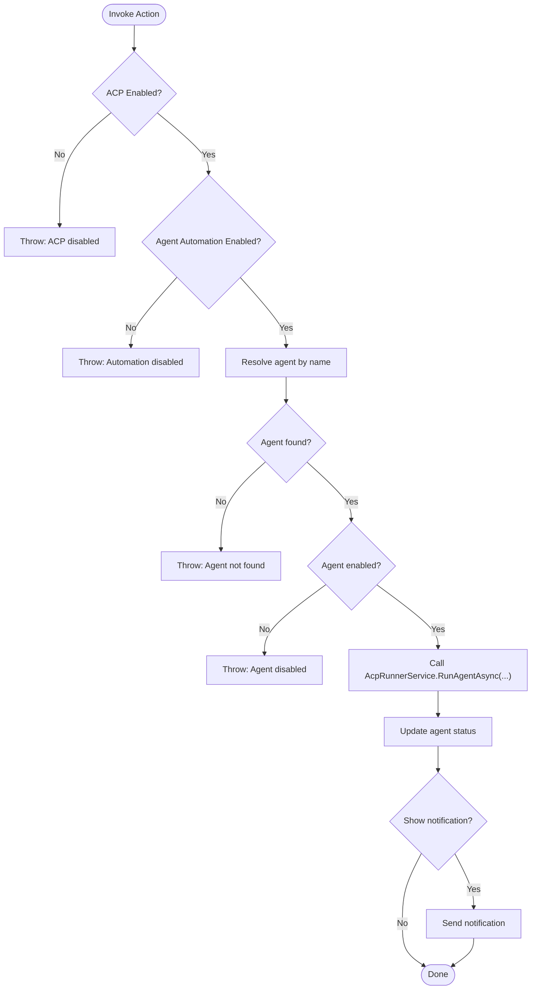
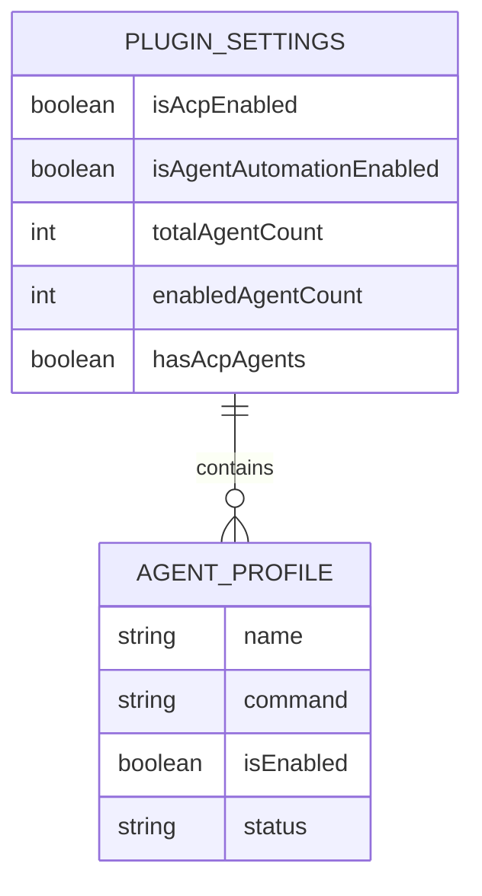
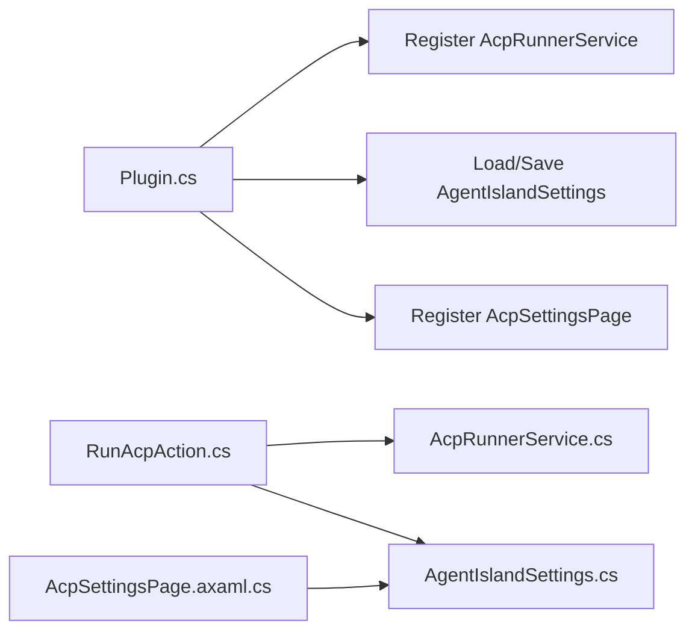

# Agent Client Protocol (ACP)

<cite>
**Referenced Files in This Document**
- [AcpRunnerService.cs](file://Services/AcpRunnerService.cs)
- [AcpAgentProfile.cs](file://Models/AcpAgentProfile.cs)
- [RunAcpAction.cs](file://Automation/RunAcpAction.cs)
- [RunAcpActionSettings.cs](file://Models/RunAcpActionSettings.cs)
- [RunAcpActionSettingsControl.axaml.cs](file://Views/ActionSettings/RunAcpActionSettingsControl.axaml.cs)
- [AcpSettingsPage.axaml.cs](file://Views/SettingsPages/AcpSettingsPage.axaml.cs)
- [AcpSettingsPage.axaml](file://Views/SettingsPages/AcpSettingsPage.axaml)
- [AgentIslandSettings.cs](file://Models/AgentIslandSettings.cs)
- [Plugin.cs](file://Plugin.cs)
</cite>

## Table of Contents
1. [Introduction](#introduction)
2. [Project Structure](#project-structure)
3. [Core Components](#core-components)
4. [Architecture Overview](#architecture-overview)
5. [Detailed Component Analysis](#detailed-component-analysis)
6. [Dependency Analysis](#dependency-analysis)
7. [Performance Considerations](#performance-considerations)
8. [Troubleshooting Guide](#troubleshooting-guide)
9. [Conclusion](#conclusion)
10. [Appendices](#appendices)

## Introduction
This document describes the Agent Client Protocol (ACP) implementation for external process management within the project. It explains how JSON-RPC messages are exchanged over standard I/O streams, how processes are spawned and managed, how sessions are initialized and routed, and how the AcpRunnerService orchestrates agent profiles, lifecycle, and error handling. It also provides configuration examples, parameter passing guidance, security considerations, resource management practices, and debugging techniques for ACP-based communications.

## Project Structure
The ACP feature is implemented as a service that manages external processes and communicates with them via JSON-RPC over stdio. The automation action triggers the service to start an agent based on configured profiles. Settings and UI components allow users to manage agents and control behavior.

**Diagram sources**
- [AcpSettingsPage.axaml:1-108](file://Views/SettingsPages/AcpSettingsPage.axaml#L1-L108)
- [RunAcpActionSettingsControl.axaml.cs:1-37](file://Views/ActionSettings/RunAcpActionSettingsControl.axaml.cs#L1-L37)
- [RunAcpAction.cs:1-84](file://Automation/RunAcpAction.cs#L1-L84)
- [AcpRunnerService.cs:1-207](file://Services/AcpRunnerService.cs#L1-L207)
- [AcpAgentProfile.cs:1-44](file://Models/AcpAgentProfile.cs#L1-L44)
- [AgentIslandSettings.cs:1-394](file://Models/AgentIslandSettings.cs#L1-L394)
- [RunAcpActionSettings.cs:1-36](file://Models/RunAcpActionSettings.cs#L1-L36)
- [Plugin.cs:1-114](file://Plugin.cs#L1-L114)

**Section sources**
- [Plugin.cs:29-53](file://Plugin.cs#L29-L53)
- [AcpSettingsPage.axaml.cs:25-48](file://Views/SettingsPages/AcpSettingsPage.axaml.cs#L25-L48)
- [RunAcpAction.cs:29-82](file://Automation/RunAcpAction.cs#L29-L82)
- [AcpRunnerService.cs:25-77](file://Services/AcpRunnerService.cs#L25-L77)

## Core Components
- AcpRunnerService: Orchestrates spawning external processes, initializes JSON-RPC sessions, sends prompts, and disposes resources safely.
- AcpAgentProfile: Represents an agent’s name, command, enabled state, and status.
- RunAcpAction: Automation action that validates settings and invokes AcpRunnerService to start an agent.
- RunAcpActionSettings: Configuration for the automation action including agent selection, notification preference, and custom payload.
- AgentIslandSettings: Central plugin settings including toggles for ACP and agent automation, plus the list of AcpAgentProfile entries.
- AcpSettingsPage: UI page to add/remove agents and toggle enablement.
- RunAcpActionSettingsControl: UI control for the automation action settings, prepopulating defaults and updating action metadata.

Key responsibilities:
- Process lifecycle: spawn, initialize, prompt, dispose.
- JSON-RPC over stdio: serialize/deserialize line-delimited JSON messages.
- Session tracking: maintain per-agent session state and IDs.
- Error handling: validate inputs, log errors, and ensure graceful shutdown.

**Section sources**
- [AcpRunnerService.cs:14-206](file://Services/AcpRunnerService.cs#L14-L206)
- [AcpAgentProfile.cs:9-43](file://Models/AcpAgentProfile.cs#L9-L43)
- [RunAcpAction.cs:16-83](file://Automation/RunAcpAction.cs#L16-L83)
- [RunAcpActionSettings.cs:9-35](file://Models/RunAcpActionSettings.cs#L9-L35)
- [AgentIslandSettings.cs:13-143](file://Models/AgentIslandSettings.cs#L13-L143)
- [AcpSettingsPage.axaml.cs:18-65](file://Views/SettingsPages/AcpSettingsPage.axaml.cs#L18-L65)
- [RunAcpActionSettingsControl.axaml.cs:8-36](file://Views/ActionSettings/RunAcpActionSettingsControl.axaml.cs#L8-L36)

## Architecture Overview
The ACP architecture centers around a single service that manages multiple agent sessions. Each agent profile defines an executable command. When invoked by an automation action, the service spawns the process, performs an initialization handshake via JSON-RPC, and then routes subsequent requests (e.g., prompts) to the correct session.

**Diagram sources**
- [RunAcpAction.cs:29-82](file://Automation/RunAcpAction.cs#L29-L82)
- [AcpRunnerService.cs:25-100](file://Services/AcpRunnerService.cs#L25-L100)

## Detailed Component Analysis

### AcpRunnerService
Responsibilities:
- Spawn external processes using a command string from the agent profile.
- Initialize JSON-RPC session by sending an "initialize" method and verifying a successful response.
- Route messages like "session/prompt" to the appropriate session.
- Manage session lifecycle and disposal, ensuring processes exit or are killed if necessary.

JSON-RPC over stdio:
- Messages are serialized to JSON and written line-by-line to StandardInput.
- Responses are read line-by-line from StandardOutput and deserialized into JSON elements.
- Initialization expects a response containing a "result" property to mark the session as initialized.

Session management:
- Each session holds a reference to the agent profile, the Process instance, a generated SessionId, and an IsInitialized flag.
- Sessions are tracked in a list; lookup uses the agent reference.

Error handling and recovery:
- Validates agent command presence and format before spawning.
- Throws exceptions when the agent is not initialized or when features are disabled.
- On disposal, attempts graceful close and waits briefly; kills the process if it does not exit.

**Diagram sources**
- [AcpRunnerService.cs:14-206](file://Services/AcpRunnerService.cs#L14-L206)
- [AcpAgentProfile.cs:9-43](file://Models/AcpAgentProfile.cs#L9-L43)

**Section sources**
- [AcpRunnerService.cs:25-77](file://Services/AcpRunnerService.cs#L25-L77)
- [AcpRunnerService.cs:79-100](file://Services/AcpRunnerService.cs#L79-L100)
- [AcpRunnerService.cs:102-131](file://Services/AcpRunnerService.cs#L102-L131)
- [AcpRunnerService.cs:133-154](file://Services/AcpRunnerService.cs#L133-L154)
- [AcpRunnerService.cs:156-191](file://Services/AcpRunnerService.cs#L156-L191)
- [AcpRunnerService.cs:193-205](file://Services/AcpRunnerService.cs#L193-L205)

### RunAcpAction and Settings
RunAcpAction:
- Validates global toggles for ACP and agent automation.
- Resolves the selected agent by name from settings.
- Ensures the agent is enabled.
- Invokes AcpRunnerService.RunAgentAsync with parameters including custom payload and identifiers.
- Updates agent status and optionally shows a notification.

RunAcpActionSettings:
- Holds agentName, showNotification, and customPayload fields used by the automation action.

RunAcpActionSettingsControl:
- Provides a dropdown of available agent names.
- Preselects the first agent if none is set.
- Dynamically updates action name and icon based on settings.

**Diagram sources**
- [RunAcpAction.cs:29-82](file://Automation/RunAcpAction.cs#L29-L82)
- [RunAcpActionSettings.cs:9-35](file://Models/RunAcpActionSettings.cs#L9-L35)
- [RunAcpActionSettingsControl.axaml.cs:15-35](file://Views/ActionSettings/RunAcpActionSettingsControl.axaml.cs#L15-L35)

**Section sources**
- [RunAcpAction.cs:29-82](file://Automation/RunAcpAction.cs#L29-L82)
- [RunAcpActionSettings.cs:9-35](file://Models/RunAcpActionSettings.cs#L9-L35)
- [RunAcpActionSettingsControl.axaml.cs:15-35](file://Views/ActionSettings/RunAcpActionSettingsControl.axaml.cs#L15-L35)

### Agent Profile Management and Settings
AgentIslandSettings:
- Maintains AcpAgents collection and derived properties such as counts and summaries.
- Exposes toggles for ACP and agent automation.

AcpSettingsPage:
- Adds/removes agents and toggles enablement for all agents.
- Binds to AgentIslandSettings for live updates.

AcpAgentProfile:
- Defines Name, Command, IsEnabled, and Status fields.

**Diagram sources**
- [AcpAgentProfile.cs:9-43](file://Models/AcpAgentProfile.cs#L9-L43)
- [AgentIslandSettings.cs:13-143](file://Models/AgentIslandSettings.cs#L13-L143)
- [AcpSettingsPage.axaml.cs:31-64](file://Views/SettingsPages/AcpSettingsPage.axaml.cs#L31-L64)

**Section sources**
- [AgentIslandSettings.cs:127-143](file://Models/AgentIslandSettings.cs#L127-L143)
- [AcpSettingsPage.axaml.cs:31-64](file://Views/SettingsPages/AcpSettingsPage.axaml.cs#L31-L64)
- [AcpAgentProfile.cs:9-43](file://Models/AcpAgentProfile.cs#L9-L43)

## Dependency Analysis
The plugin registers services and UI components during initialization. AcpRunnerService is registered as a singleton and consumed by RunAcpAction. Settings are persisted and bound to UI pages.

**Diagram sources**
- [Plugin.cs:29-53](file://Plugin.cs#L29-L53)
- [RunAcpAction.cs:22-27](file://Automation/RunAcpAction.cs#L22-L27)
- [AcpSettingsPage.axaml.cs:25-29](file://Views/SettingsPages/AcpSettingsPage.axaml.cs#L25-L29)

**Section sources**
- [Plugin.cs:29-53](file://Plugin.cs#L29-L53)
- [RunAcpAction.cs:22-27](file://Automation/RunAcpAction.cs#L22-L27)
- [AcpSettingsPage.axaml.cs:25-29](file://Views/SettingsPages/AcpSettingsPage.axaml.cs#L25-L29)

## Performance Considerations
- Process startup overhead: Spawning external processes can be expensive; consider reusing sessions where feasible.
- Stdio throughput: Line-delimited JSON serialization/deserialization is straightforward but may become a bottleneck under high load; batching or buffering strategies could be considered if needed.
- Resource cleanup: Ensure timely disposal of processes and streams to avoid leaks; the current implementation closes input and waits briefly before killing.

[No sources needed since this section provides general guidance]

## Troubleshooting Guide
Common issues and diagnostics:
- Missing or invalid command: The service throws an exception if the agent command is empty or invalid. Verify the agent profile’s Command field.
- Feature toggles disabled: If ACP or agent automation is disabled, the action will throw an exception. Check global settings.
- Agent not found or disabled: The action resolves agents by name and checks IsEnabled. Confirm the agent exists and is enabled.
- Session not initialized: Sending a prompt requires the session to be initialized. Ensure the initialization handshake completes successfully.
- Process hangs or fails to exit: On disposal, the service closes input and waits briefly; if the process does not exit, it is killed. Investigate the external agent’s shutdown logic.

Logging and telemetry:
- The service logs informational and debug events for lifecycle and operations.
- Telemetry breadcrumbs are added for key actions.

**Section sources**
- [AcpRunnerService.cs:35-53](file://Services/AcpRunnerService.cs#L35-L53)
- [AcpRunnerService.cs:79-100](file://Services/AcpRunnerService.cs#L79-L100)
- [AcpRunnerService.cs:102-131](file://Services/AcpRunnerService.cs#L102-L131)
- [AcpRunnerService.cs:156-191](file://Services/AcpRunnerService.cs#L156-L191)
- [RunAcpAction.cs:35-60](file://Automation/RunAcpAction.cs#L35-L60)

## Conclusion
The ACP implementation provides a robust mechanism for managing external agent processes via JSON-RPC over stdio. It integrates with the plugin’s settings and automation framework, offering clear lifecycle management, error handling, and user-facing controls. By following the configuration and troubleshooting guidance, users can reliably run and interact with ACP-enabled agents.

[No sources needed since this section summarizes without analyzing specific files]

## Appendices

### JSON-RPC Communication Details
- Transport: Standard input/output streams.
- Message framing: One JSON object per line.
- Methods:
  - initialize: Sent once after process start; expects a response with a "result" property to mark the session initialized.
  - session/prompt: Sends a message along with the active sessionId.

Example request/response patterns:
- Initialize request includes jsonrpc version, id, method, and params with protocolVersion and clientCapabilities.
- Prompt request includes sessionId and message.

Note: The current implementation writes requests and reads responses synchronously per operation. For advanced scenarios, consider asynchronous streaming and more robust error handling.

**Section sources**
- [AcpRunnerService.cs:79-100](file://Services/AcpRunnerService.cs#L79-L100)
- [AcpRunnerService.cs:102-131](file://Services/AcpRunnerService.cs#L102-L131)
- [AcpRunnerService.cs:133-154](file://Services/AcpRunnerService.cs#L133-L154)

### Security Considerations
- Command validation: The service splits the command string into file name and arguments; ensure only trusted commands are configured.
- Process isolation: Processes are started without shell execution and with hidden windows; verify environment variables and working directories are controlled.
- Input sanitization: External payloads should be validated before being sent to agents.
- Least privilege: Run the host application with minimal required permissions to reduce risk when spawning external processes.

[No sources needed since this section provides general guidance]

### Resource Management
- Streams: StandardInput, StandardOutput, and StandardError are redirected; ensure they are closed appropriately.
- Process disposal: The service disposes processes and clears sessions on disposal.
- Graceful shutdown: Close input and wait briefly before killing; adjust timeouts based on agent behavior.

**Section sources**
- [AcpRunnerService.cs:156-191](file://Services/AcpRunnerService.cs#L156-L191)

### Debugging Techniques
- Enable logging at debug level to trace command parsing, process start, and JSON-RPC exchanges.
- Inspect agent status strings updated by the service and action.
- Use telemetry breadcrumbs to correlate events across the system.
- Validate JSON-RPC messages by capturing stdio output when developing or testing agents.

**Section sources**
- [AcpRunnerService.cs:42-53](file://Services/AcpRunnerService.cs#L42-L53)
- [AcpRunnerService.cs:107-110](file://Services/AcpRunnerService.cs#L107-L110)
- [RunAcpAction.cs:62-72](file://Automation/RunAcpAction.cs#L62-L72)