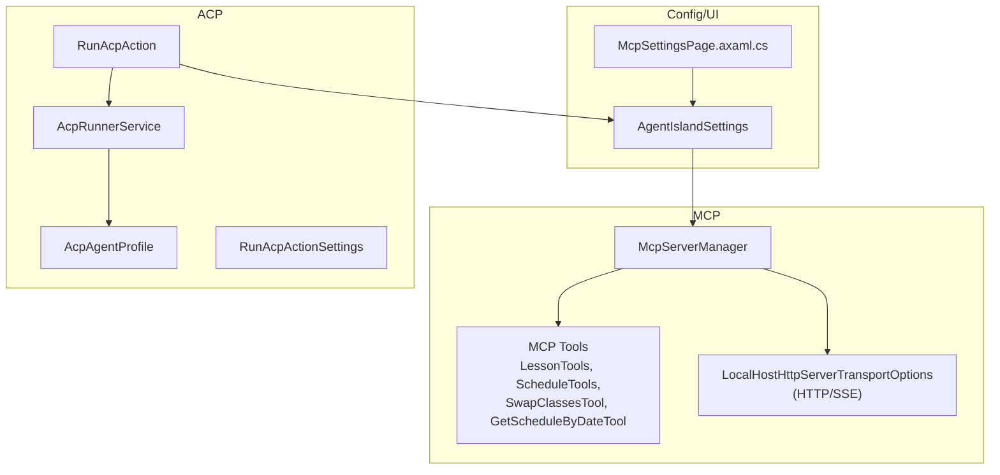
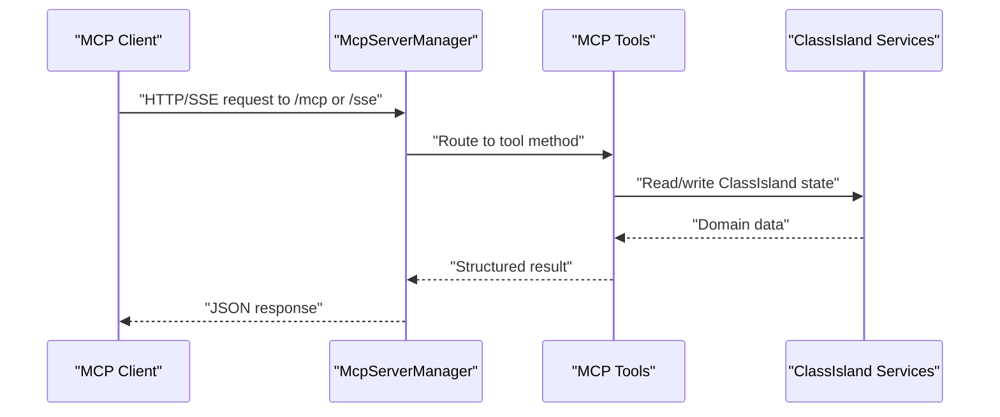
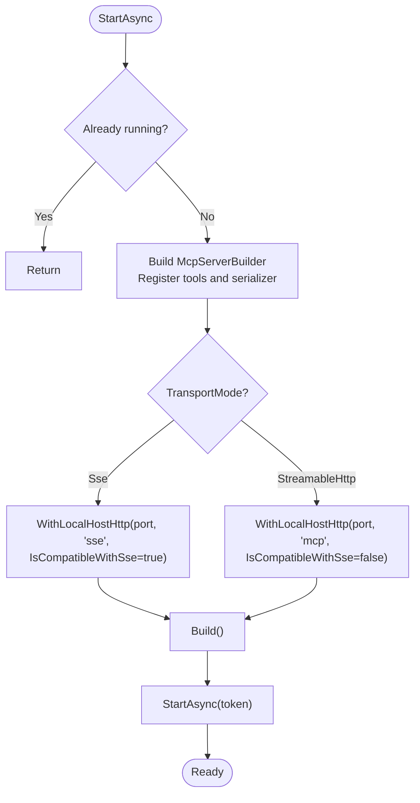
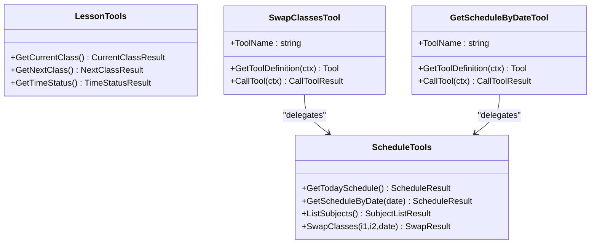
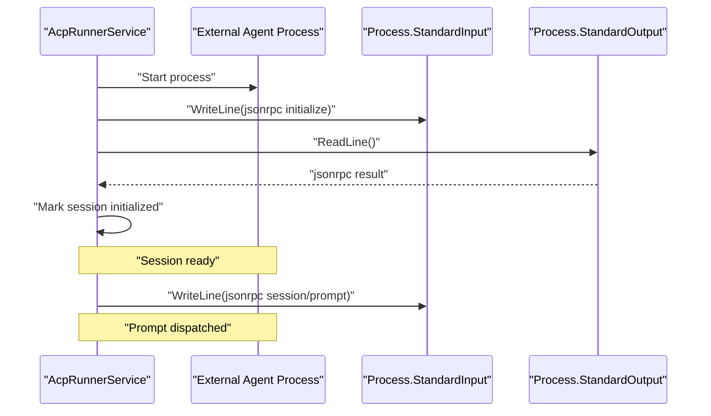
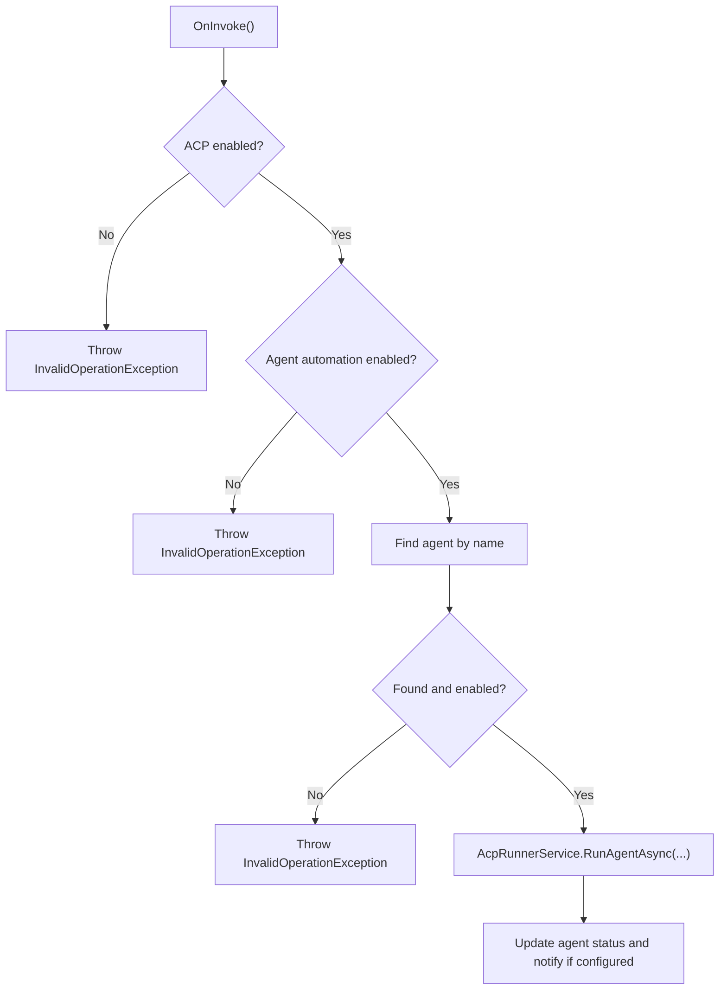
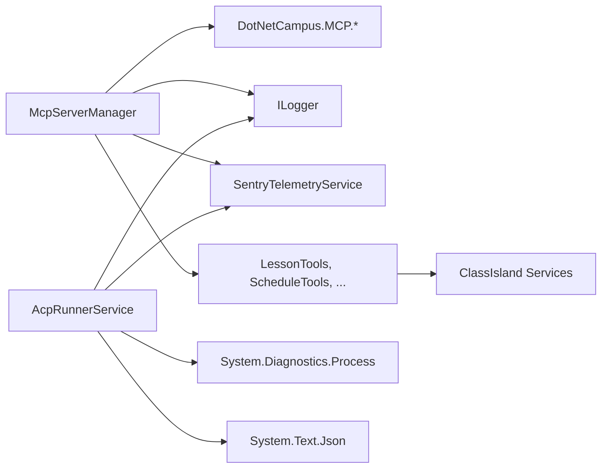

# Communication Protocols

<cite>
**Referenced Files in This Document**
- [McpServerManager.cs](file://Mcp/McpServerManager.cs)
- [McpTransportMode.cs](file://Models/McpTransportMode.cs)
- [AgentIslandSettings.cs](file://Models/AgentIslandSettings.cs)
- [LessonTools.cs](file://Mcp/Tools/LessonTools.cs)
- [ScheduleTools.cs](file://Mcp/Tools/ScheduleTools.cs)
- [SwapClassesTool.cs](file://Mcp/Tools/SwapClassesTool.cs)
- [GetScheduleByDateTool.cs](file://Mcp/Tools/GetScheduleByDateTool.cs)
- [AcpRunnerService.cs](file://Services/AcpRunnerService.cs)
- [AcpAgentProfile.cs](file://Models/AcpAgentProfile.cs)
- [RunAcpAction.cs](file://Automation/RunAcpAction.cs)
- [RunAcpActionSettings.cs](file://Models/RunAcpActionSettings.cs)
- [McpSettingsPage.axaml.cs](file://Views/SettingsPages/McpSettingsPage.axaml.cs)
</cite>

## Table of Contents
1. Introduction
2. Project Structure
3. Core Components
4. Architecture Overview
5. Detailed Component Analysis
6. Dependency Analysis
7. Performance Considerations
8. Troubleshooting Guide
9. Conclusion

## Introduction
This document explains AgentIsland’s communication protocols:
- Model Context Protocol (MCP) server supporting HTTP and Server-Sent Events (SSE) transports, including endpoint configuration, request routing via tools, and response handling.
- Agent Client Protocol (ACP) for external process management using JSON-RPC over standard I/O streams, covering session lifecycle, prompt dispatch, and error handling.

It also provides protocol-specific examples, security considerations, and performance optimization techniques for both internal and external communications.

## Project Structure
The relevant parts of the codebase are organized by feature:
- MCP server orchestration and transport selection
- MCP tool implementations exposing ClassIsland capabilities
- ACP runner service managing external agent processes
- Settings and UI wiring for enabling/configuring features

**Diagram sources**
- [McpServerManager.cs:25-82](file://Mcp/McpServerManager.cs#L25-L82)
- [LessonTools.cs:14-45](file://Mcp/Tools/LessonTools.cs#L14-L45)
- [ScheduleTools.cs:15-56](file://Mcp/Tools/ScheduleTools.cs#L15-L56)
- [SwapClassesTool.cs:42-80](file://Mcp/Tools/SwapClassesTool.cs#L42-L80)
- [GetScheduleByDateTool.cs:32-78](file://Mcp/Tools/GetScheduleByDateTool.cs#L32-L78)
- [AcpRunnerService.cs:25-100](file://Services/AcpRunnerService.cs#L25-L100)
- [AcpAgentProfile.cs:9-43](file://Models/AcpAgentProfile.cs#L9-L43)
- [RunAcpAction.cs:29-82](file://Automation/RunAcpAction.cs#L29-L82)
- [RunAcpActionSettings.cs:9-35](file://Models/RunAcpActionSettings.cs#L9-L35)
- [AgentIslandSettings.cs:34-62](file://Models/AgentIslandSettings.cs#L34-L62)
- [McpSettingsPage.axaml.cs:26-41](file://Views/SettingsPages/McpSettingsPage.axaml.cs#L26-L41)

**Section sources**
- [McpServerManager.cs:1-125](file://Mcp/McpServerManager.cs#L1-L125)
- [McpTransportMode.cs:1-18](file://Models/McpTransportMode.cs#L1-L18)
- [AgentIslandSettings.cs:14-62](file://Models/AgentIslandSettings.cs#L14-L62)
- [AcpRunnerService.cs:1-207](file://Services/AcpRunnerService.cs#L1-L207)
- [AcpAgentProfile.cs:1-44](file://Models/AcpAgentProfile.cs#L1-L44)
- [RunAcpAction.cs:1-84](file://Automation/RunAcpAction.cs#L1-L84)
- [RunAcpActionSettings.cs:1-36](file://Models/RunAcpActionSettings.cs#L1-L36)
- [McpSettingsPage.axaml.cs:1-66](file://Views/SettingsPages/McpSettingsPage.axaml.cs#L1-L66)

## Core Components
- MCP Server Manager: Builds and starts an MCP server with a set of tools and selects HTTP or SSE transport based on configuration. It handles start/stop lifecycle and telemetry integration.
- MCP Tools: Expose ClassIsland domain operations (lesson queries, schedule retrieval, class swapping) as MCP tools with structured schemas and annotations.
- ACP Runner Service: Spawns external agents, initializes sessions via JSON-RPC over stdio, sends prompts, and manages process lifecycles.
- Settings and UI: Provide configuration for port, transport mode, enablement flags, and derived connection address; UI requests restart when critical settings change.

Key responsibilities:
- Endpoint configuration and routing: The manager configures endpoints and routes tool calls to implementations.
- Session lifecycle: ACP runner creates sessions, performs initialization handshake, and tracks readiness.
- Error handling: Both layers capture exceptions, log errors, and return structured results or throw operational errors.

**Section sources**
- [McpServerManager.cs:25-82](file://Mcp/McpServerManager.cs#L25-L82)
- [LessonTools.cs:14-45](file://Mcp/Tools/LessonTools.cs#L14-L45)
- [ScheduleTools.cs:15-56](file://Mcp/Tools/ScheduleTools.cs#L15-L56)
- [SwapClassesTool.cs:42-80](file://Mcp/Tools/SwapClassesTool.cs#L42-L80)
- [GetScheduleByDateTool.cs:32-78](file://Mcp/Tools/GetScheduleByDateTool.cs#L32-L78)
- [AcpRunnerService.cs:25-100](file://Services/AcpRunnerService.cs#L25-L100)
- [AgentIslandSettings.cs:202-211](file://Models/AgentIslandSettings.cs#L202-L211)
- [McpSettingsPage.axaml.cs:33-41](file://Views/SettingsPages/McpSettingsPage.axaml.cs#L33-L41)

## Architecture Overview
The system exposes two communication channels:
- Internal: MCP server running locally, serving tools over HTTP or SSE.
- External: ACP runner launching and communicating with external agent processes via JSON-RPC over stdio.

**Diagram sources**
- [McpServerManager.cs:53-71](file://Mcp/McpServerManager.cs#L53-L71)
- [LessonTools.cs:22-45](file://Mcp/Tools/LessonTools.cs#L22-L45)
- [ScheduleTools.cs:23-56](file://Mcp/Tools/ScheduleTools.cs#L23-L56)

## Detailed Component Analysis

### MCP Server and Transport Configuration
- Transport selection: Based on McpTransportMode, the server binds either to an SSE-compatible endpoint or a streamable HTTP endpoint.
- Endpoints:
  - Streamable HTTP: endpoint path “mcp”
  - SSE: endpoint path “sse”
- Connection address derivation: The settings compute a local URL combining host, port, and selected endpoint.

**Diagram sources**
- [McpServerManager.cs:25-82](file://Mcp/McpServerManager.cs#L25-L82)
- [McpTransportMode.cs:6-17](file://Models/McpTransportMode.cs#L6-L17)
- [AgentIslandSettings.cs:202-211](file://Models/AgentIslandSettings.cs#L202-L211)

**Section sources**
- [McpServerManager.cs:25-82](file://Mcp/McpServerManager.cs#L25-L82)
- [McpTransportMode.cs:1-18](file://Models/McpTransportMode.cs#L1-L18)
- [AgentIslandSettings.cs:202-211](file://Models/AgentIslandSettings.cs#L202-L211)
- [McpSettingsPage.axaml.cs:33-41](file://Views/SettingsPages/McpSettingsPage.axaml.cs#L33-L41)

### MCP Tools: Routing and Response Handling
Tools implement MCP tool interfaces and expose methods annotated for discovery and schema generation. They access ClassIsland services and return structured results.

**Diagram sources**
- [LessonTools.cs:14-45](file://Mcp/Tools/LessonTools.cs#L14-L45)
- [ScheduleTools.cs:15-56](file://Mcp/Tools/ScheduleTools.cs#L15-L56)
- [SwapClassesTool.cs:42-80](file://Mcp/Tools/SwapClassesTool.cs#L42-L80)
- [GetScheduleByDateTool.cs:32-78](file://Mcp/Tools/GetScheduleByDateTool.cs#L32-L78)

**Section sources**
- [LessonTools.cs:14-45](file://Mcp/Tools/LessonTools.cs#L14-L45)
- [ScheduleTools.cs:15-56](file://Mcp/Tools/ScheduleTools.cs#L15-L56)
- [SwapClassesTool.cs:42-80](file://Mcp/Tools/SwapClassesTool.cs#L42-L80)
- [GetScheduleByDateTool.cs:32-78](file://Mcp/Tools/GetScheduleByDateTool.cs#L32-L78)

### ACP: JSON-RPC over Standard I/O Streams
ACP uses a simple line-delimited JSON-RPC 2.0 protocol over stdin/stdout. The runner:
- Starts the external process
- Sends an initialize request and waits for a result
- Tracks session readiness
- Dispatches prompts with a per-session identifier

**Diagram sources**
- [AcpRunnerService.cs:25-100](file://Services/AcpRunnerService.cs#L25-L100)
- [AcpRunnerService.cs:102-131](file://Services/AcpRunnerService.cs#L102-L131)

**Section sources**
- [AcpRunnerService.cs:25-100](file://Services/AcpRunnerService.cs#L25-L100)
- [AcpRunnerService.cs:102-131](file://Services/AcpRunnerService.cs#L102-L131)
- [AcpRunnerService.cs:133-154](file://Services/AcpRunnerService.cs#L133-L154)
- [AcpRunnerService.cs:156-191](file://Services/AcpRunnerService.cs#L156-L191)
- [AcpAgentProfile.cs:9-43](file://Models/AcpAgentProfile.cs#L9-L43)

### Automation Integration: Run ACP Action
An automation action triggers ACP execution after validating global and agent-level settings, then delegates to the runner service.

**Diagram sources**
- [RunAcpAction.cs:29-82](file://Automation/RunAcpAction.cs#L29-L82)
- [RunAcpActionSettings.cs:9-35](file://Models/RunAcpActionSettings.cs#L9-L35)

**Section sources**
- [RunAcpAction.cs:29-82](file://Automation/RunAcpAction.cs#L29-L82)
- [RunAcpActionSettings.cs:9-35](file://Models/RunAcpActionSettings.cs#L9-L35)

## Dependency Analysis
- McpServerManager depends on:
  - DotNetCampus.ModelContextProtocol libraries for server building and HTTP transport
  - Application services for logging and telemetry
  - Tool classes for capability exposure
- Tools depend on:
  - ClassIsland services for reading/writing lesson/schedule data
  - Telemetry for instrumentation
- AcpRunnerService depends on:
  - System.Diagnostics.Process for spawning and controlling external processes
  - System.Text.Json for JSON-RPC serialization/deserialization
  - Logging and telemetry

**Diagram sources**
- [McpServerManager.cs:1-24](file://Mcp/McpServerManager.cs#L1-L24)
- [LessonTools.cs:1-9](file://Mcp/Tools/LessonTools.cs#L1-L9)
- [ScheduleTools.cs:1-9](file://Mcp/Tools/ScheduleTools.cs#L1-L9)
- [AcpRunnerService.cs:1-8](file://Services/AcpRunnerService.cs#L1-L8)

**Section sources**
- [McpServerManager.cs:1-24](file://Mcp/McpServerManager.cs#L1-L24)
- [LessonTools.cs:1-9](file://Mcp/Tools/LessonTools.cs#L1-L9)
- [ScheduleTools.cs:1-9](file://Mcp/Tools/ScheduleTools.cs#L1-L9)
- [AcpRunnerService.cs:1-8](file://Services/AcpRunnerService.cs#L1-L8)

## Performance Considerations
- Use streamable HTTP transport for lower overhead and better throughput compared to SSE where supported.
- Keep MCP tool handlers short and synchronous-friendly; offload heavy work to background tasks if needed.
- Prefer structured responses and avoid large payloads; paginate or filter when possible.
- For ACP:
  - Minimize JSON payload size and use efficient serializers.
  - Avoid blocking reads/writes on stdio; ensure asynchronous I/O is used consistently.
  - Implement timeouts and graceful shutdown to prevent resource leaks.
- Enable telemetry selectively to reduce overhead in production.

[No sources needed since this section provides general guidance]

## Troubleshooting Guide
Common issues and resolutions:
- MCP server not reachable:
  - Verify port and transport mode settings; UI requests restart when these change.
  - Confirm the computed connection address matches the expected endpoint (/mcp or /sse).
- Tool call failures:
  - Inspect logs from tool implementations and check for missing parameters or invalid inputs.
  - Ensure required ClassIsland services are available and initialized.
- ACP agent not initializing:
  - Validate the agent command and arguments.
  - Confirm the external process responds to the initialize JSON-RPC message with a result field.
  - If the process does not exit gracefully, the runner will kill it after a timeout.

Operational notes:
- ACP runner disposes processes and closes stdin; if the agent hangs, expect a forced termination after the wait period.
- Exceptions during MCP start/stop are captured and surfaced; review telemetry for details.

**Section sources**
- [McpServerManager.cs:76-82](file://Mcp/McpServerManager.cs#L76-L82)
- [McpServerManager.cs:84-112](file://Mcp/McpServerManager.cs#L84-L112)
- [AcpRunnerService.cs:35-48](file://Services/AcpRunnerService.cs#L35-L48)
- [AcpRunnerService.cs:79-100](file://Services/AcpRunnerService.cs#L79-L100)
- [AcpRunnerService.cs:156-191](file://Services/AcpRunnerService.cs#L156-L191)
- [McpSettingsPage.axaml.cs:33-41](file://Views/SettingsPages/McpSettingsPage.axaml.cs#L33-L41)

## Conclusion
AgentIsland integrates two complementary protocols:
- MCP provides a robust, tool-centric interface over HTTP/SSE for internal automation and AI-driven workflows.
- ACP enables safe, standardized control of external agents through JSON-RPC over stdio with clear lifecycle management.

Adhering to the recommended practices for transport selection, payload design, and error handling ensures reliable and performant operation across both internal and external communication paths.