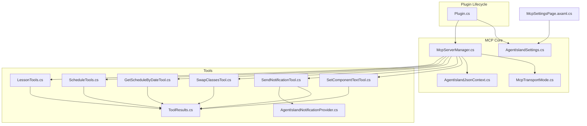
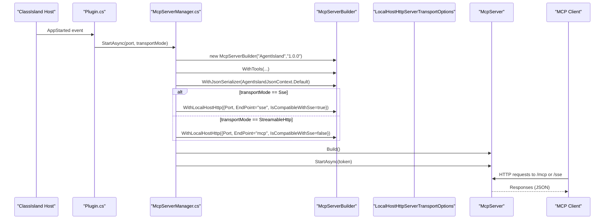
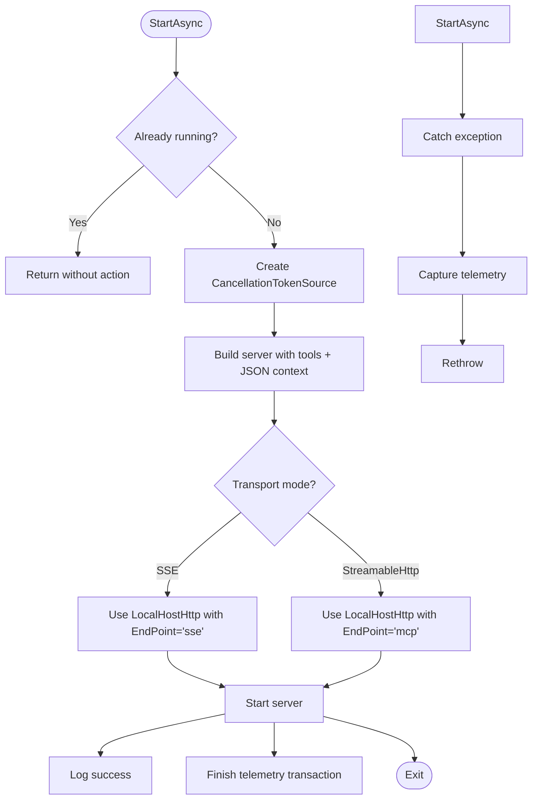
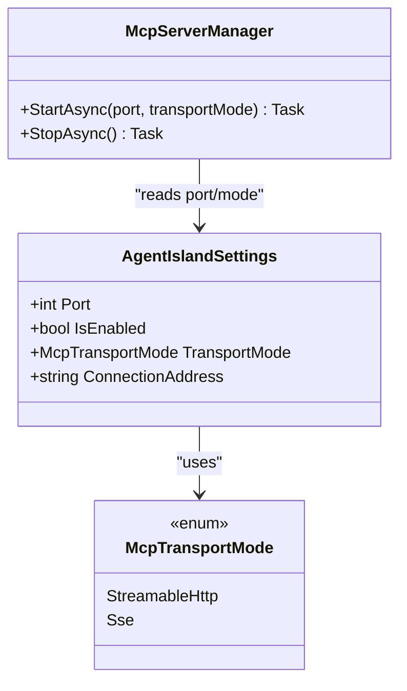
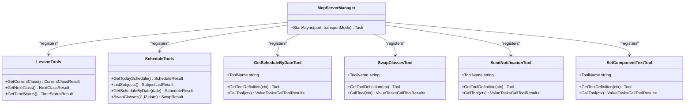
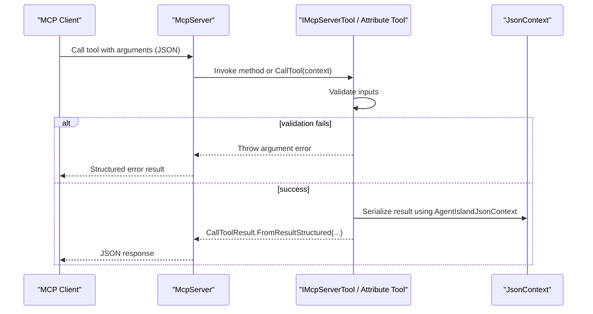
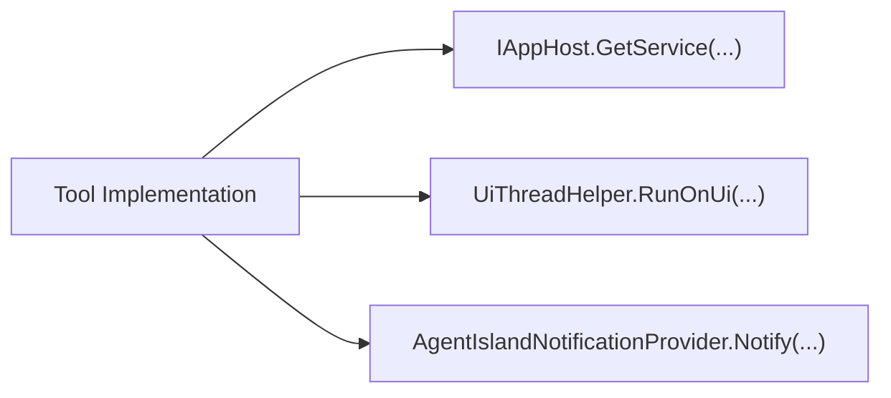
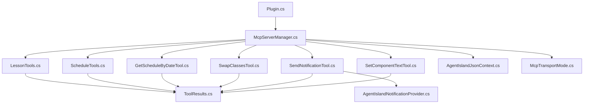

# Model Context Protocol (MCP)

<cite>
**Referenced Files in This Document**
- [Plugin.cs](file://Plugin.cs)
- [McpServerManager.cs](file://Mcp/McpServerManager.cs)
- [McpTransportMode.cs](file://Models/McpTransportMode.cs)
- [AgentIslandSettings.cs](file://Models/AgentIslandSettings.cs)
- [AgentIslandJsonContext.cs](file://Models/AgentIslandJsonContext.cs)
- [LessonTools.cs](file://Mcp/Tools/LessonTools.cs)
- [ScheduleTools.cs](file://Mcp/Tools/ScheduleTools.cs)
- [GetScheduleByDateTool.cs](file://Mcp/Tools/GetScheduleByDateTool.cs)
- [SwapClassesTool.cs](file://Mcp/Tools/SwapClassesTool.cs)
- [SendNotificationTool.cs](file://Mcp/Tools/SendNotificationTool.cs)
- [SetComponentTextTool.cs](file://Mcp/Tools/SetComponentTextTool.cs)
- [AgentIslandNotificationProvider.cs](file://Mcp/Tools/AgentIslandNotificationProvider.cs)
- [ToolResults.cs](file://Models/ToolResults.cs)
- [McpSettingsPage.axaml.cs](file://Views/SettingsPages/McpSettingsPage.axaml.cs)
</cite>

## Table of Contents
1. [Introduction](#introduction)
2. [Project Structure](#project-structure)
3. [Core Components](#core-components)
4. [Architecture Overview](#architecture-overview)
5. [Detailed Component Analysis](#detailed-component-analysis)
6. [Dependency Analysis](#dependency-analysis)
7. [Performance Considerations](#performance-considerations)
8. [Troubleshooting Guide](#troubleshooting-guide)
9. [Conclusion](#conclusion)

## Introduction
This document explains the Model Context Protocol (MCP) implementation in AgentIsland, built on DotNetCampus.ModelContextProtocol. It covers server lifecycle management, tool registration, transport configuration (HTTP and Server-Sent Events), endpoints (/mcp and /sse), port configuration, request/response patterns, error handling strategies, performance optimizations, builder pattern usage for server configuration, JSON serialization context, and integration with ClassIsland services.

## Project Structure
The MCP feature is implemented under the Mcp directory and integrates with the plugin lifecycle via Plugin.cs. Configuration and settings are defined in Models, while tools that expose functionality to MCP clients live under Mcp/Tools.

**Diagram sources**
- [Plugin.cs:1-114](file://Plugin.cs#L1-L114)
- [McpServerManager.cs:1-125](file://Mcp/McpServerManager.cs#L1-L125)
- [McpTransportMode.cs:1-18](file://Models/McpTransportMode.cs#L1-L18)
- [AgentIslandSettings.cs:1-394](file://Models/AgentIslandSettings.cs#L1-L394)
- [AgentIslandJsonContext.cs:1-20](file://Models/AgentIslandJsonContext.cs#L1-L20)
- [LessonTools.cs:1-146](file://Mcp/Tools/LessonTools.cs#L1-L146)
- [ScheduleTools.cs:1-204](file://Mcp/Tools/ScheduleTools.cs#L1-L204)
- [GetScheduleByDateTool.cs:1-92](file://Mcp/Tools/GetScheduleByDateTool.cs#L1-L92)
- [SwapClassesTool.cs:1-103](file://Mcp/Tools/SwapClassesTool.cs#L1-L103)
- [SendNotificationTool.cs:1-137](file://Mcp/Tools/SendNotificationTool.cs#L1-L137)
- [SetComponentTextTool.cs:1-92](file://Mcp/Tools/SetComponentTextTool.cs#L1-L92)
- [AgentIslandNotificationProvider.cs:1-52](file://Mcp/Tools/AgentIslandNotificationProvider.cs#L1-L52)
- [ToolResults.cs:1-59](file://Models/ToolResults.cs#L1-L59)
- [McpSettingsPage.axaml.cs:1-66](file://Views/SettingsPages/McpSettingsPage.axaml.cs#L1-L66)

**Section sources**
- [Plugin.cs:1-114](file://Plugin.cs#L1-L114)
- [McpServerManager.cs:1-125](file://Mcp/McpServerManager.cs#L1-L125)
- [McpTransportMode.cs:1-18](file://Models/McpTransportMode.cs#L1-L18)
- [AgentIslandSettings.cs:1-394](file://Models/AgentIslandSettings.cs#L1-L394)
- [AgentIslandJsonContext.cs:1-20](file://Models/AgentIslandJsonContext.cs#L1-L20)
- [McpSettingsPage.axaml.cs:1-66](file://Views/SettingsPages/McpSettingsPage.axaml.cs#L1-L66)

## Core Components
- McpServerManager: Orchestrates server lifecycle (start/stop), configures transport mode and endpoints, registers tools, and wires JSON serialization context.
- Transport modes: StreamableHttp uses endpoint /mcp; SSE uses endpoint /sse. Both listen on localhost at a configurable port.
- Tool system: Two styles supported:
  - Attribute-based tools using an attribute macro to auto-register methods as MCP tools.
  - Manual IMcpServerTool implementations for dynamic schemas and explicit control over input/output.
- JSON serialization: A source-generated JsonSerializerContext is provided to the server builder for efficient serialization of tool results.
- Integration points: Tools access ClassIsland services via IAppHost service locator and interact with UI thread safely.

Key responsibilities:
- Builder pattern: The server is configured via a fluent builder that sets version, tools, JSON context, and HTTP transport options.
- Endpoints:
  - StreamableHttp: /mcp
  - SSE: /sse
- Port configuration: Read from settings; default value present in settings class.

**Section sources**
- [McpServerManager.cs:25-82](file://Mcp/McpServerManager.cs#L25-L82)
- [McpTransportMode.cs:1-18](file://Models/McpTransportMode.cs#L1-L18)
- [AgentIslandSettings.cs:34-62](file://Models/AgentIslandSettings.cs#L34-L62)
- [AgentIslandJsonContext.cs:1-20](file://Models/AgentIslandJsonContext.cs#L1-L20)

## Architecture Overview
The MCP server runs inside the ClassIsland host process. On application start, if enabled, the plugin initializes and starts the MCP server with the configured transport and port. Clients connect to http://localhost:<port>/<endpoint>.

**Diagram sources**
- [Plugin.cs:55-79](file://Plugin.cs#L55-L79)
- [McpServerManager.cs:41-71](file://Mcp/McpServerManager.cs#L41-L71)
- [McpTransportMode.cs:1-18](file://Models/McpTransportMode.cs#L1-L18)

## Detailed Component Analysis

### Server Lifecycle Management
- StartAsync:
  - Guards against double-start.
  - Creates cancellation token.
  - Builds server with tools and JSON context.
  - Configures transport based on McpTransportMode.
  - Starts server and logs success.
  - Captures telemetry on errors.
- StopAsync:
  - Cancels token, stops server, disposes resources, logs status.
  - Captures telemetry on errors.
- Dispose:
  - Ensures synchronous cleanup by awaiting stop.

**Diagram sources**
- [McpServerManager.cs:25-82](file://Mcp/McpServerManager.cs#L25-L82)

**Section sources**
- [McpServerManager.cs:25-112](file://Mcp/McpServerManager.cs#L25-L112)

### Transport Mode Configuration and Endpoints
- StreamableHttp: Endpoint /mcp, not compatible with SSE.
- SSE: Endpoint /sse, compatible with SSE.
- Port is read from settings and defaults to a specific value.
- ConnectionAddress helper computes the full URL based on selected transport mode.

**Diagram sources**
- [McpTransportMode.cs:1-18](file://Models/McpTransportMode.cs#L1-L18)
- [AgentIslandSettings.cs:34-62](file://Models/AgentIslandSettings.cs#L34-L62)
- [AgentIslandSettings.cs:202-211](file://Models/AgentIslandSettings.cs#L202-L211)
- [McpServerManager.cs:53-67](file://Mcp/McpServerManager.cs#L53-L67)

**Section sources**
- [McpTransportMode.cs:1-18](file://Models/McpTransportMode.cs#L1-L18)
- [AgentIslandSettings.cs:34-62](file://Models/AgentIslandSettings.cs#L34-L62)
- [AgentIslandSettings.cs:202-211](file://Models/AgentIslandSettings.cs#L202-L211)
- [McpServerManager.cs:53-67](file://Mcp/McpServerManager.cs#L53-L67)

### Tool Registration System
Two approaches are used:

1) Attribute-based tools (auto-registered):
- LessonTools exposes multiple methods annotated to be MCP tools.
- ScheduleTools exposes methods annotated to be MCP tools.

2) Manual IMcpServerTool implementations (explicit schema and behavior):
- GetScheduleByDateTool
- SwapClassesTool
- SendNotificationTool
- SetComponentTextTool

All tools are registered during server builder configuration.

**Diagram sources**
- [McpServerManager.cs:42-50](file://Mcp/McpServerManager.cs#L42-L50)
- [LessonTools.cs:14-145](file://Mcp/Tools/LessonTools.cs#L14-L145)
- [ScheduleTools.cs:15-131](file://Mcp/Tools/ScheduleTools.cs#L15-L131)
- [GetScheduleByDateTool.cs:16-78](file://Mcp/Tools/GetScheduleByDateTool.cs#L16-L78)
- [SwapClassesTool.cs:16-102](file://Mcp/Tools/SwapClassesTool.cs#L16-L102)
- [SendNotificationTool.cs:16-136](file://Mcp/Tools/SendNotificationTool.cs#L16-L136)
- [SetComponentTextTool.cs:17-91](file://Mcp/Tools/SetComponentTextTool.cs#L17-L91)

**Section sources**
- [McpServerManager.cs:42-50](file://Mcp/McpServerManager.cs#L42-L50)
- [LessonTools.cs:14-145](file://Mcp/Tools/LessonTools.cs#L14-L145)
- [ScheduleTools.cs:15-131](file://Mcp/Tools/ScheduleTools.cs#L15-L131)
- [GetScheduleByDateTool.cs:16-78](file://Mcp/Tools/GetScheduleByDateTool.cs#L16-L78)
- [SwapClassesTool.cs:16-102](file://Mcp/Tools/SwapClassesTool.cs#L16-L102)
- [SendNotificationTool.cs:16-136](file://Mcp/Tools/SendNotificationTool.cs#L16-L136)
- [SetComponentTextTool.cs:17-91](file://Mcp/Tools/SetComponentTextTool.cs#L17-L91)

### Request/Response Patterns and Error Handling
- Tools return structured result records serialized via the provided JSON context.
- Input parsing is performed manually for IMcpServerTool implementations, validating required fields and types.
- Errors are captured via telemetry and returned as structured results indicating failure with messages.

**Diagram sources**
- [SendNotificationTool.cs:68-105](file://Mcp/Tools/SendNotificationTool.cs#L68-L105)
- [SwapClassesTool.cs:63-80](file://Mcp/Tools/SwapClassesTool.cs#L63-L80)
- [GetScheduleByDateTool.cs:53-78](file://Mcp/Tools/GetScheduleByDateTool.cs#L53-L78)
- [SetComponentTextTool.cs:41-72](file://Mcp/Tools/SetComponentTextTool.cs#L41-L72)
- [AgentIslandJsonContext.cs:1-20](file://Models/AgentIslandJsonContext.cs#L1-L20)

**Section sources**
- [SendNotificationTool.cs:68-105](file://Mcp/Tools/SendNotificationTool.cs#L68-L105)
- [SwapClassesTool.cs:63-80](file://Mcp/Tools/SwapClassesTool.cs#L63-L80)
- [GetScheduleByDateTool.cs:53-78](file://Mcp/Tools/GetScheduleByDateTool.cs#L53-L78)
- [SetComponentTextTool.cs:41-72](file://Mcp/Tools/SetComponentTextTool.cs#L41-L72)
- [AgentIslandJsonContext.cs:1-20](file://Models/AgentIslandJsonContext.cs#L1-L20)

### JSON Serialization Context
- A source-generated context enumerates all tool result types and lists used by tools.
- Property naming policy is set to camelCase for consistent client consumption.
- The server builder is configured to use this context for efficient serialization.

**Section sources**
- [AgentIslandJsonContext.cs:1-20](file://Models/AgentIslandJsonContext.cs#L1-L20)
- [McpServerManager.cs:51](file://Mcp/McpServerManager.cs#L51)

### Integration with ClassIsland Services
- Tools obtain services through IAppHost service locator (e.g., ILessonsService, IProfileService, IExactTimeService).
- UI updates are marshaled onto the UI thread using a helper to avoid cross-thread exceptions.
- Notifications are sent via a registered notification provider.

**Diagram sources**
- [LessonTools.cs:22-45](file://Mcp/Tools/LessonTools.cs#L22-L45)
- [ScheduleTools.cs:23-39](file://Mcp/Tools/ScheduleTools.cs#L23-L39)
- [SetComponentTextTool.cs:56-63](file://Mcp/Tools/SetComponentTextTool.cs#L56-L63)
- [AgentIslandNotificationProvider.cs:27-50](file://Mcp/Tools/AgentIslandNotificationProvider.cs#L27-L50)

**Section sources**
- [LessonTools.cs:22-45](file://Mcp/Tools/LessonTools.cs#L22-L45)
- [ScheduleTools.cs:23-39](file://Mcp/Tools/ScheduleTools.cs#L23-L39)
- [SetComponentTextTool.cs:56-63](file://Mcp/Tools/SetComponentTextTool.cs#L56-L63)
- [AgentIslandNotificationProvider.cs:27-50](file://Mcp/Tools/AgentIslandNotificationProvider.cs#L27-L50)

### Builder Pattern for Server Configuration
- The server is constructed via a fluent builder:
  - Version and name are set.
  - Tools are registered either by type or instance.
  - JSON serializer context is attached.
  - Transport is configured with port and endpoint selection based on transport mode.

**Section sources**
- [McpServerManager.cs:41-71](file://Mcp/McpServerManager.cs#L41-L71)

### Settings and UI Integration
- Settings include MCP enable flag, port, and transport mode.
- Changing these triggers a restart request in the settings page.
- Connection address is computed dynamically based on current settings.

**Section sources**
- [AgentIslandSettings.cs:34-62](file://Models/AgentIslandSettings.cs#L34-L62)
- [AgentIslandSettings.cs:202-211](file://Models/AgentIslandSettings.cs#L202-L211)
- [McpSettingsPage.axaml.cs:33-41](file://Views/SettingsPages/McpSettingsPage.axaml.cs#L33-L41)

## Dependency Analysis
The following diagram shows key dependencies between components involved in MCP operation.

**Diagram sources**
- [Plugin.cs:1-114](file://Plugin.cs#L1-L114)
- [McpServerManager.cs:1-125](file://Mcp/McpServerManager.cs#L1-L125)
- [LessonTools.cs:1-146](file://Mcp/Tools/LessonTools.cs#L1-L146)
- [ScheduleTools.cs:1-204](file://Mcp/Tools/ScheduleTools.cs#L1-L204)
- [GetScheduleByDateTool.cs:1-92](file://Mcp/Tools/GetScheduleByDateTool.cs#L1-L92)
- [SwapClassesTool.cs:1-103](file://Mcp/Tools/SwapClassesTool.cs#L1-L103)
- [SendNotificationTool.cs:1-137](file://Mcp/Tools/SendNotificationTool.cs#L1-L137)
- [SetComponentTextTool.cs:1-92](file://Mcp/Tools/SetComponentTextTool.cs#L1-L92)
- [AgentIslandNotificationProvider.cs:1-52](file://Mcp/Tools/AgentIslandNotificationProvider.cs#L1-L52)
- [AgentIslandJsonContext.cs:1-20](file://Models/AgentIslandJsonContext.cs#L1-L20)
- [McpTransportMode.cs:1-18](file://Models/McpTransportMode.cs#L1-L18)
- [ToolResults.cs:1-59](file://Models/ToolResults.cs#L1-L59)

**Section sources**
- [Plugin.cs:1-114](file://Plugin.cs#L1-L114)
- [McpServerManager.cs:1-125](file://Mcp/McpServerManager.cs#L1-L125)
- [ToolResults.cs:1-59](file://Models/ToolResults.cs#L1-L59)

## Performance Considerations
- Prefer attribute-based tools when possible to reduce boilerplate and leverage compiler-generated metadata.
- Use the provided JSON source generator context to minimize reflection overhead during serialization.
- Keep tool operations short and offload heavy work to background tasks where feasible; ensure UI-bound updates are marshaled to the UI thread.
- Avoid unnecessary allocations in hot paths; reuse constants like input schemas where appropriate.
- Instrument critical operations via telemetry to identify bottlenecks.

[No sources needed since this section provides general guidance]

## Troubleshooting Guide
Common issues and resolutions:
- Server does not start:
  - Verify port availability and permissions.
  - Check logs for exceptions during StartAsync; telemetry captures failures.
- Wrong endpoint:
  - Ensure correct endpoint based on transport mode: /mcp for StreamableHttp, /sse for SSE.
- Invalid parameters:
  - Tools validate inputs and throw argument errors; clients should handle structured error responses.
- UI-related crashes:
  - Ensure UI updates are executed on the UI thread using the provided helper.
- Notification not shown:
  - Confirm notification provider is initialized before calling send_notification.

**Section sources**
- [McpServerManager.cs:76-81](file://Mcp/McpServerManager.cs#L76-L81)
- [McpServerManager.cs:106-111](file://Mcp/McpServerManager.cs#L106-L111)
- [SendNotificationTool.cs:85-96](file://Mcp/Tools/SendNotificationTool.cs#L85-L96)
- [SetComponentTextTool.cs:56-63](file://Mcp/Tools/SetComponentTextTool.cs#L56-L63)

## Conclusion
AgentIsland’s MCP implementation provides a robust, extensible server leveraging DotNetCampus.ModelContextProtocol. It supports both modern streamable HTTP and legacy SSE transports, offers a flexible tool registration system, and integrates tightly with ClassIsland services. Proper configuration via the builder pattern and source-generated JSON serialization ensures high performance and maintainability.