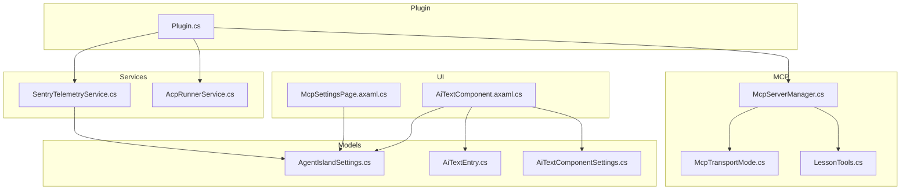
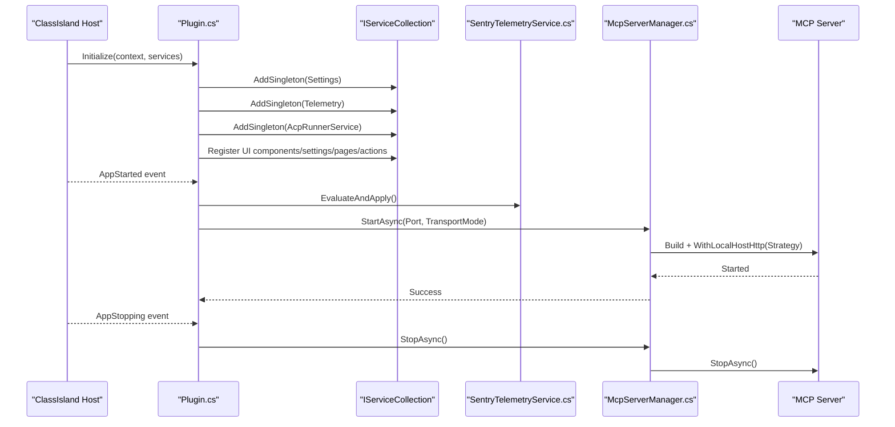
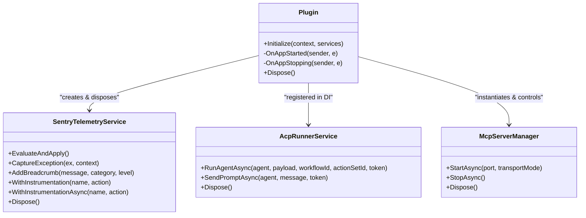
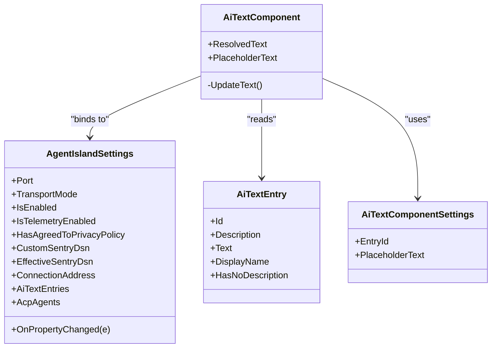
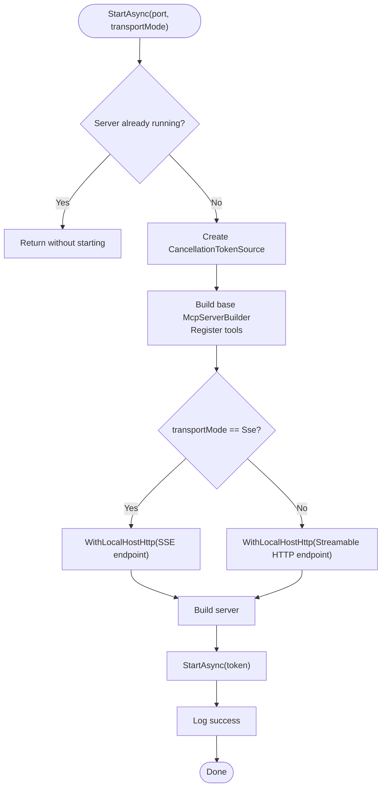
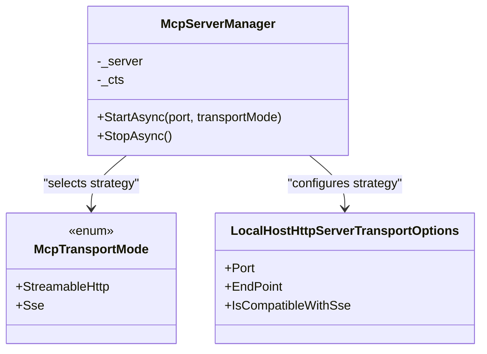
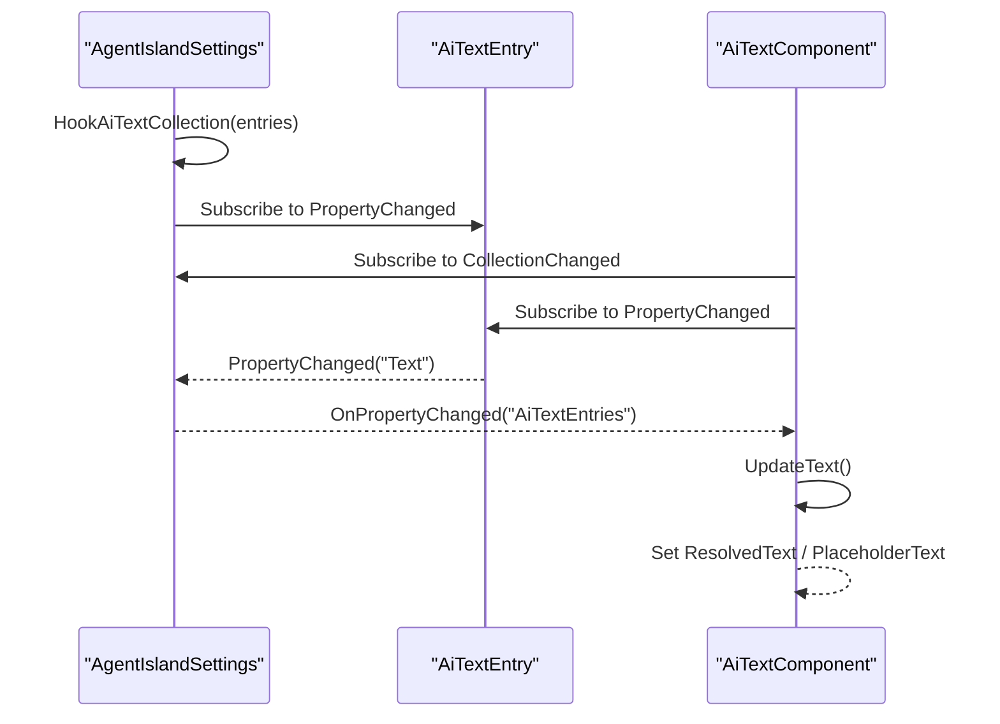
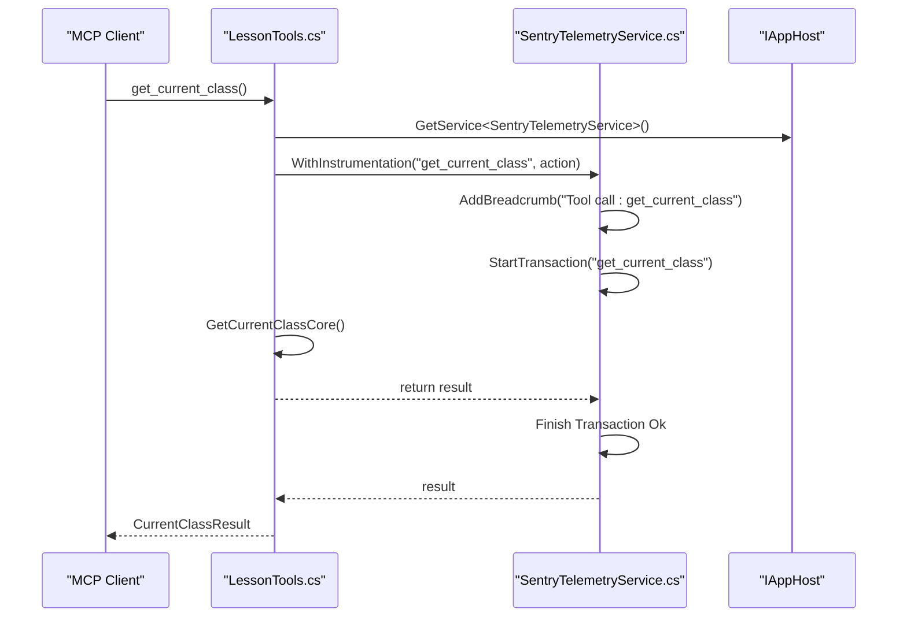
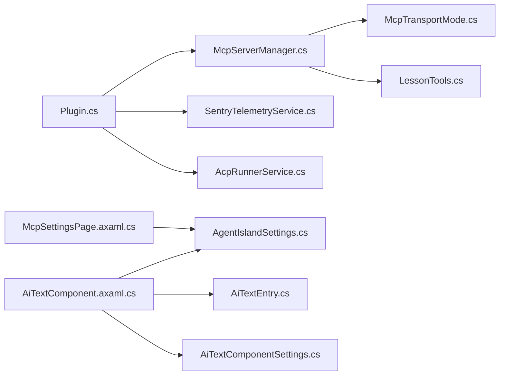

# Core Architecture Patterns

<cite>
**Referenced Files in This Document**
- [Plugin.cs](file://Plugin.cs)
- [McpServerManager.cs](file://Mcp/McpServerManager.cs)
- [McpTransportMode.cs](file://Models/McpTransportMode.cs)
- [SentryTelemetryService.cs](file://Services/SentryTelemetryService.cs)
- [AcpRunnerService.cs](file://Services/AcpRunnerService.cs)
- [AiTextComponent.axaml.cs](file://Components/AiTextComponent.axaml.cs)
- [AiTextComponentSettings.cs](file://Models/AiTextComponentSettings.cs)
- [AiTextEntry.cs](file://Models/AiTextEntry.cs)
- [AgentIslandSettings.cs](file://Models/AgentIslandSettings.cs)
- [McpSettingsPage.axaml.cs](file://Views/SettingsPages/McpSettingsPage.axaml.cs)
- [LessonTools.cs](file://Mcp/Tools/LessonTools.cs)
- [AgentIsland.csproj](file://AgentIsland.csproj)
</cite>

## Table of Contents
1. [Introduction](#introduction)
2. [Project Structure](#project-structure)
3. [Core Components](#core-components)
4. [Architecture Overview](#architecture-overview)
5. [Detailed Component Analysis](#detailed-component-analysis)
6. [Dependency Analysis](#dependency-analysis)
7. [Performance Considerations](#performance-considerations)
8. [Troubleshooting Guide](#troubleshooting-guide)
9. [Conclusion](#conclusion)

## Introduction
This document explains AgentIsland’s core architecture patterns and how they combine to form a maintainable, extensible plugin system:
- Service-oriented architecture with dependency injection using Microsoft.Extensions.DependencyInjection for registration and resolution.
- MVVM pattern implementation in UI components built on Avalonia, with reactive properties via CommunityToolkit.Mvvm.
- Factory pattern for MCP server instantiation based on transport mode.
- Strategy pattern for handling different communication protocols (Streamable HTTP vs SSE).
- Concrete examples from the codebase demonstrating these patterns working together across services, tools, and UI.

## Project Structure
The project is organized by feature areas and responsibilities:
- Plugin entry point and DI registration
- MCP server lifecycle and tooling
- Services for telemetry and ACP agent execution
- Models implementing MVVM with observable collections and derived properties
- UI components and settings pages bound to models
- Tools exposing MCP capabilities

**Diagram sources**
- [Plugin.cs:29-53](file://Plugin.cs#L29-L53)
- [McpServerManager.cs:25-73](file://Mcp/McpServerManager.cs#L25-L73)
- [McpTransportMode.cs:6-17](file://Models/McpTransportMode.cs#L6-L17)
- [SentryTelemetryService.cs:21-40](file://Services/SentryTelemetryService.cs#L21-L40)
- [AcpRunnerService.cs:25-77](file://Services/AcpRunnerService.cs#L25-L77)
- [AiTextComponent.axaml.cs:36-56](file://Components/AiTextComponent.axaml.cs#L36-L56)
- [AiTextEntry.cs:5-31](file://Models/AiTextEntry.cs#L5-L31)
- [AiTextComponentSettings.cs:5-12](file://Models/AiTextComponentSettings.cs#L5-L12)
- [AgentIslandSettings.cs:13-32](file://Models/AgentIslandSettings.cs#L13-L32)
- [McpSettingsPage.axaml.cs:26-41](file://Views/SettingsPages/McpSettingsPage.axaml.cs#L26-L41)

**Section sources**
- [Plugin.cs:29-53](file://Plugin.cs#L29-L53)
- [AgentIsland.csproj:22-29](file://AgentIsland.csproj#L22-L29)

## Core Components
- Plugin: Initializes configuration, registers services, subscribes to application lifecycle events, starts/stops MCP server, and wires telemetry.
- McpServerManager: Builds and runs the MCP server, registering tools and selecting transport strategy based on configuration.
- SentryTelemetryService: Manages telemetry SDK lifecycle and provides instrumentation helpers.
- AcpRunnerService: Orchestrates external ACP agents over stdio JSON-RPC.
- MVVM Models: AgentIslandSettings, AiTextEntry, AiTextComponentSettings implement observable properties and collections.
- UI Components: Avalonia-based component and settings page bind to models and react to changes.

**Section sources**
- [Plugin.cs:29-79](file://Plugin.cs#L29-L79)
- [McpServerManager.cs:25-82](file://Mcp/McpServerManager.cs#L25-L82)
- [SentryTelemetryService.cs:21-40](file://Services/SentryTelemetryService.cs#L21-L40)
- [AcpRunnerService.cs:25-77](file://Services/AcpRunnerService.cs#L25-L77)
- [AgentIslandSettings.cs:13-32](file://Models/AgentIslandSettings.cs#L13-L32)
- [AiTextEntry.cs:5-31](file://Models/AiTextEntry.cs#L5-L31)
- [AiTextComponentSettings.cs:5-12](file://Models/AiTextComponentSettings.cs#L5-L12)
- [AiTextComponent.axaml.cs:36-56](file://Components/AiTextComponent.axaml.cs#L36-L56)
- [McpSettingsPage.axaml.cs:26-41](file://Views/SettingsPages/McpSettingsPage.axaml.cs#L26-L41)

## Architecture Overview
The plugin uses a service-oriented architecture with DI. The plugin entry point configures services and orchestrates runtime behavior. The MCP server manager acts as a factory/strategy for transport selection and tool registration. UI components follow MVVM with reactive bindings. Telemetry is integrated throughout.

**Diagram sources**
- [Plugin.cs:29-79](file://Plugin.cs#L29-L79)
- [McpServerManager.cs:25-82](file://Mcp/McpServerManager.cs#L25-L82)
- [SentryTelemetryService.cs:21-40](file://Services/SentryTelemetryService.cs#L21-L40)

## Detailed Component Analysis

### Service-Oriented Architecture with Dependency Injection
- Registration occurs in the plugin initialization phase. Services registered include settings, telemetry, ACP runner, notification provider, UI components, settings pages, and actions.
- Resolution happens at runtime via IAppHost.GetService<T>() or constructor injection where supported.

Key behaviors:
- Settings are loaded from disk and persisted on change.
- Telemetry service is initialized and disposed according to user consent and DSN configuration.
- ACP runner is available for external agent orchestration.

**Diagram sources**
- [Plugin.cs:29-53](file://Plugin.cs#L29-L53)
- [Plugin.cs:55-97](file://Plugin.cs#L55-L97)
- [SentryTelemetryService.cs:21-40](file://Services/SentryTelemetryService.cs#L21-L40)
- [AcpRunnerService.cs:25-77](file://Services/AcpRunnerService.cs#L25-L77)
- [McpServerManager.cs:25-82](file://Mcp/McpServerManager.cs#L25-L82)

**Section sources**
- [Plugin.cs:29-53](file://Plugin.cs#L29-L53)
- [Plugin.cs:55-97](file://Plugin.cs#L55-L97)
- [SentryTelemetryService.cs:21-40](file://Services/SentryTelemetryService.cs#L21-L40)
- [AcpRunnerService.cs:25-77](file://Services/AcpRunnerService.cs#L25-L77)

### MVVM Pattern Implementation in UI Components
- Models use CommunityToolkit.Mvvm to expose observable properties and handle derived property updates.
- Ui components subscribe to collection and property changes to update Avalonia properties.

Highlights:
- AgentIslandSettings exposes derived properties like ConnectionAddress and telemetry flags, raising PropertyChanged when dependencies change.
- AiTextEntry and AiTextComponentSettings use ObservableObject/ObservableRecipient and [ObservableProperty] attributes.
- AiTextComponent binds to settings and entries, updating ResolvedText and PlaceholderText accordingly.

**Diagram sources**
- [AgentIslandSettings.cs:13-32](file://Models/AgentIslandSettings.cs#L13-L32)
- [AgentIslandSettings.cs:178-211](file://Models/AgentIslandSettings.cs#L178-L211)
- [AiTextEntry.cs:5-31](file://Models/AiTextEntry.cs#L5-L31)
- [AiTextComponentSettings.cs:5-12](file://Models/AiTextComponentSettings.cs#L5-L12)
- [AiTextComponent.axaml.cs:36-83](file://Components/AiTextComponent.axaml.cs#L36-L83)

**Section sources**
- [AgentIslandSettings.cs:13-32](file://Models/AgentIslandSettings.cs#L13-L32)
- [AgentIslandSettings.cs:178-211](file://Models/AgentIslandSettings.cs#L178-L211)
- [AiTextEntry.cs:5-31](file://Models/AiTextEntry.cs#L5-L31)
- [AiTextComponentSettings.cs:5-12](file://Models/AiTextComponentSettings.cs#L5-L12)
- [AiTextComponent.axaml.cs:36-83](file://Components/AiTextComponent.axaml.cs#L36-L83)

### Factory Pattern for MCP Server Instantiation Based on Transport Mode
- McpServerManager constructs an McpServerBuilder, registers tools, and selects transport options based on McpTransportMode.
- The switch expression chooses between Streamable HTTP and SSE endpoints, effectively acting as a factory that produces configured server instances.

**Diagram sources**
- [McpServerManager.cs:25-73](file://Mcp/McpServerManager.cs#L25-L73)
- [McpTransportMode.cs:6-17](file://Models/McpTransportMode.cs#L6-L17)

**Section sources**
- [McpServerManager.cs:25-73](file://Mcp/McpServerManager.cs#L25-L73)
- [McpTransportMode.cs:6-17](file://Models/McpTransportMode.cs#L6-L17)

### Strategy Pattern for Communication Protocols
- The transport selection logic implements a strategy pattern: depending on McpTransportMode, different LocalHostHttpServerTransportOptions are applied.
- This allows adding new protocol strategies without changing existing code paths beyond the switch selection.

**Diagram sources**
- [McpServerManager.cs:53-67](file://Mcp/McpServerManager.cs#L53-L67)
- [McpTransportMode.cs:6-17](file://Models/McpTransportMode.cs#L6-L17)

**Section sources**
- [McpServerManager.cs:53-67](file://Mcp/McpServerManager.cs#L53-L67)
- [McpTransportMode.cs:6-17](file://Models/McpTransportMode.cs#L6-L17)

### Observer Pattern Usage for Reactive Properties
- AgentIslandSettings hooks into ObservableCollection.CollectionChanged and individual item PropertyChanged to keep derived properties consistent.
- AiTextComponent subscribes to settings and entries changes to update UI-bound properties.

**Diagram sources**
- [AgentIslandSettings.cs:340-392](file://Models/AgentIslandSettings.cs#L340-L392)
- [AiTextComponent.axaml.cs:36-83](file://Components/AiTextComponent.axaml.cs#L36-L83)

**Section sources**
- [AgentIslandSettings.cs:340-392](file://Models/AgentIslandSettings.cs#L340-L392)
- [AiTextComponent.axaml.cs:36-83](file://Components/AiTextComponent.axaml.cs#L36-L83)

### Example: Tool Invocation Flow with Telemetry Instrumentation
- LessonTools methods wrap calls with SentryTelemetryService instrumentation to capture breadcrumbs and transactions.

**Diagram sources**
- [LessonTools.cs:14-45](file://Mcp/Tools/LessonTools.cs#L14-L45)
- [SentryTelemetryService.cs:127-148](file://Services/SentryTelemetryService.cs#L127-L148)

**Section sources**
- [LessonTools.cs:14-45](file://Mcp/Tools/LessonTools.cs#L14-L45)
- [SentryTelemetryService.cs:127-148](file://Services/SentryTelemetryService.cs#L127-L148)

## Dependency Analysis
- External packages: ClassIsland.PluginSdk, DotNetCampus.ModelContextProtocol, AgentClientProtocol, Sentry.
- Internal dependencies:
  - Plugin depends on McpServerManager, SentryTelemetryService, and AcpRunnerService.
  - McpServerManager depends on McpTransportMode and tool classes.
  - UI components depend on models and global settings.
  - Tools depend on IAppHost services and telemetry.

**Diagram sources**
- [Plugin.cs:29-53](file://Plugin.cs#L29-L53)
- [McpServerManager.cs:25-73](file://Mcp/McpServerManager.cs#L25-L73)
- [McpTransportMode.cs:6-17](file://Models/McpTransportMode.cs#L6-L17)
- [LessonTools.cs:14-45](file://Mcp/Tools/LessonTools.cs#L14-L45)
- [AiTextComponent.axaml.cs:36-83](file://Components/AiTextComponent.axaml.cs#L36-L83)
- [AgentIslandSettings.cs:13-32](file://Models/AgentIslandSettings.cs#L13-L32)
- [AiTextEntry.cs:5-31](file://Models/AiTextEntry.cs#L5-L31)
- [AiTextComponentSettings.cs:5-12](file://Models/AiTextComponentSettings.cs#L5-L12)
- [McpSettingsPage.axaml.cs:26-41](file://Views/SettingsPages/McpSettingsPage.axaml.cs#L26-L41)

**Section sources**
- [AgentIsland.csproj:22-29](file://AgentIsland.csproj#L22-L29)
- [Plugin.cs:29-53](file://Plugin.cs#L29-L53)

## Performance Considerations
- Avoid redundant server starts: McpServerManager checks if a server is already running before starting again.
- Minimize UI thread work: Tools execute UI-dependent operations via UiThreadHelper.RunOnUi to prevent blocking.
- Efficient telemetry: Instrumentation wraps only necessary operations; optional telemetry path avoids overhead when disabled.
- Derived properties: AgentIslandSettings raises PropertyChanged selectively to reduce unnecessary UI updates.

[No sources needed since this section provides general guidance]

## Troubleshooting Guide
Common issues and resolutions:
- MCP server fails to start:
  - Check port availability and transport mode configuration.
  - Review logs and telemetry breadcrumbs captured during startup.
- Telemetry not active:
  - Ensure privacy policy agreement or custom DSN is set.
  - Verify IsTelemetryActive and EffectiveSentryDsn values.
- ACP agent not responding:
  - Validate command configuration and process lifecycle.
  - Inspect session initialization and JSON-RPC messages.

**Section sources**
- [Plugin.cs:67-79](file://Plugin.cs#L67-L79)
- [McpServerManager.cs:76-82](file://Mcp/McpServerManager.cs#L76-L82)
- [SentryTelemetryService.cs:30-40](file://Services/SentryTelemetryService.cs#L30-L40)
- [AcpRunnerService.cs:79-100](file://Services/AcpRunnerService.cs#L79-L100)

## Conclusion
AgentIsland demonstrates a cohesive architecture combining DI-driven service registration, MVVM with reactive properties, factory and strategy patterns for server and transport management, and comprehensive telemetry integration. These patterns promote modularity, testability, and extensibility, enabling smooth evolution of features such as additional transports, tools, and UI components.