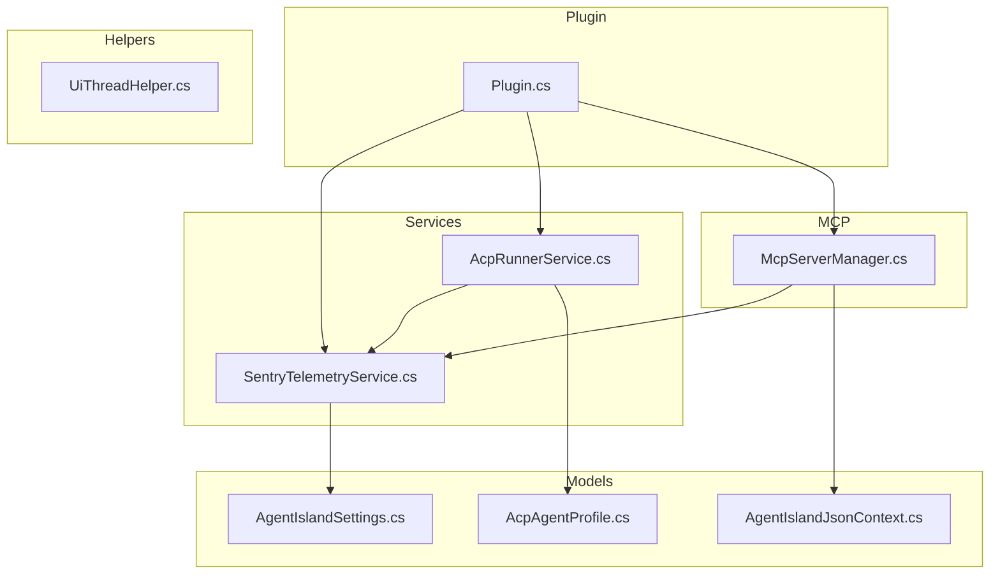
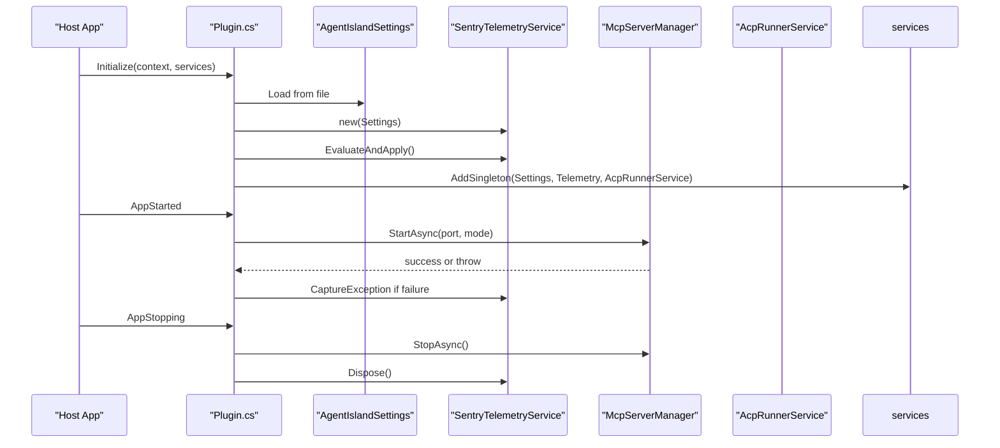
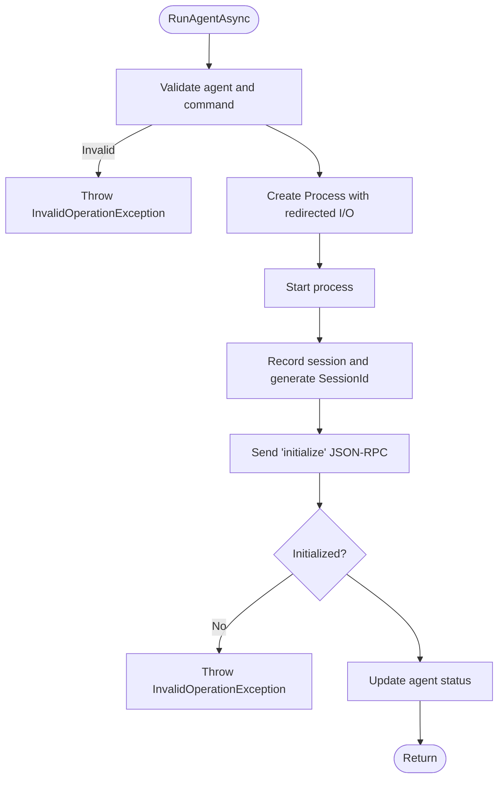
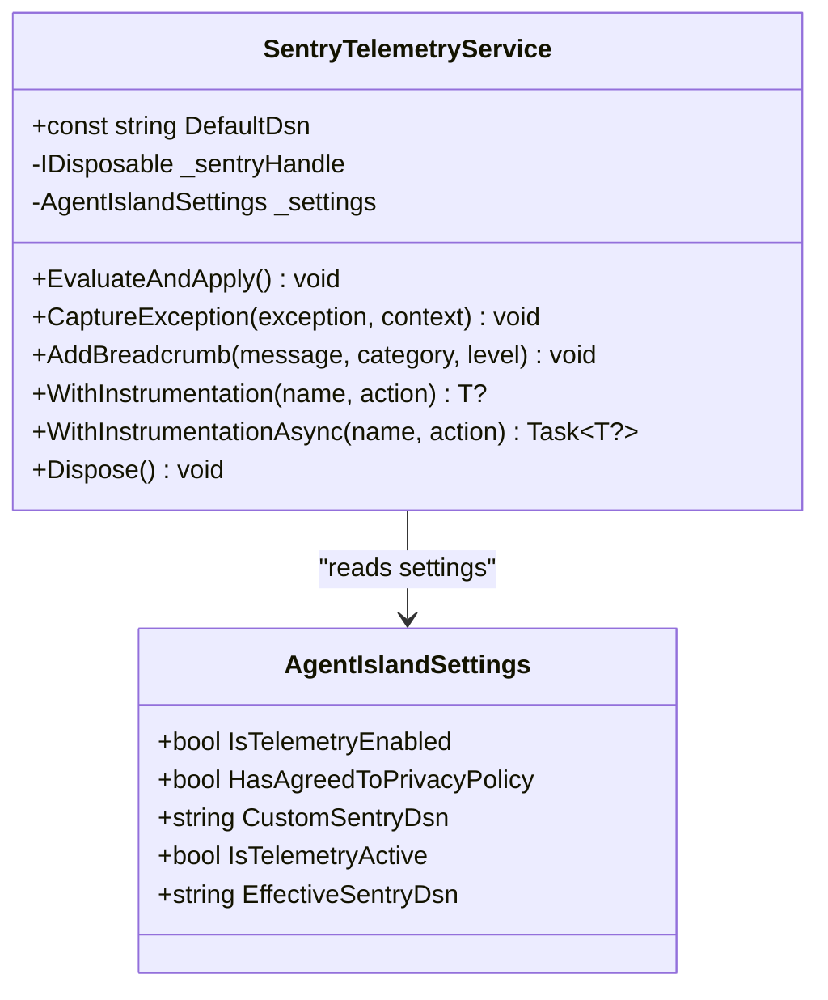
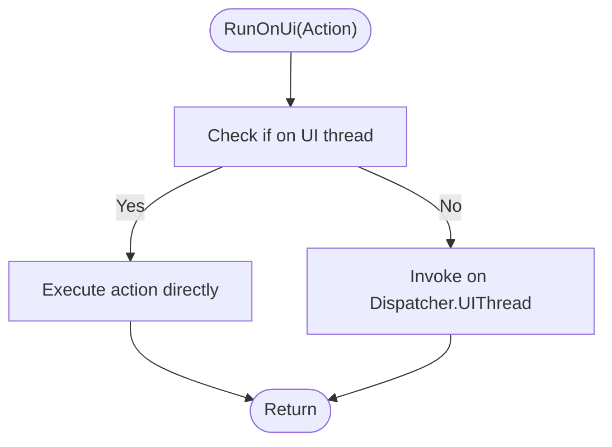
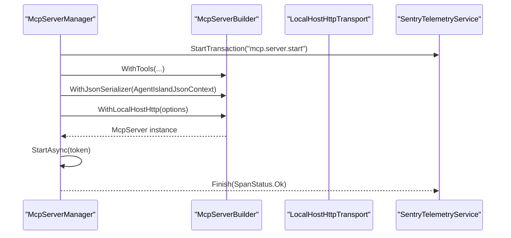
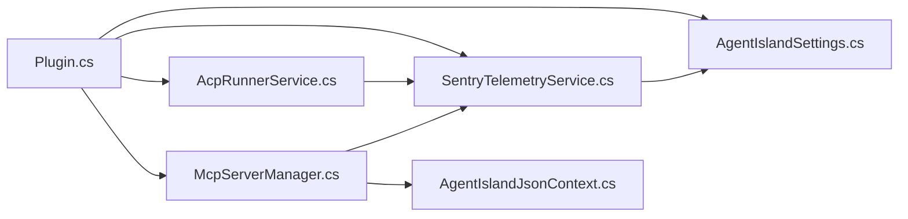

# Service Layer Design

<cite>
**Referenced Files in This Document**
- [Plugin.cs](file://Plugin.cs)
- [AcpRunnerService.cs](file://Services/AcpRunnerService.cs)
- [SentryTelemetryService.cs](file://Services/SentryTelemetryService.cs)
- [UiThreadHelper.cs](file://Helpers/UiThreadHelper.cs)
- [McpServerManager.cs](file://Mcp/McpServerManager.cs)
- [AgentIslandSettings.cs](file://Models/AgentIslandSettings.cs)
- [AcpAgentProfile.cs](file://Models/AcpAgentProfile.cs)
- [AgentIslandJsonContext.cs](file://Models/AgentIslandJsonContext.cs)
</cite>

## Table of Contents
1. [Introduction](#introduction)
2. [Project Structure](#project-structure)
3. [Core Components](#core-components)
4. [Architecture Overview](#architecture-overview)
5. [Detailed Component Analysis](#detailed-component-analysis)
6. [Dependency Analysis](#dependency-analysis)
7. [Performance Considerations](#performance-considerations)
8. [Troubleshooting Guide](#troubleshooting-guide)
9. [Conclusion](#conclusion)

## Introduction
This document describes the service layer design of AgentIsland with a focus on separation of concerns across business logic services, infrastructure services, and utility helpers. It explains:
- AcpRunnerService for external process management (lifecycle, cleanup, inter-process communication via stdio JSON-RPC).
- SentryTelemetryService for error tracking and performance monitoring with privacy controls.
- UiThreadHelper for cross-thread operations and UI synchronization.
- Service registration patterns, dependency resolution, and error propagation strategies used throughout the application.

## Project Structure
The service layer is organized by responsibility:
- Services: Business and infrastructure services (e.g., ACP runner, telemetry).
- Helpers: Cross-cutting utilities (e.g., UI thread helper).
- Models: Configuration and data contracts (settings, agent profiles, JSON context).
- Plugin entrypoint: Registers services and orchestrates lifecycle events.

**Diagram sources**
- [Plugin.cs:29-53](file://Plugin.cs#L29-L53)
- [AcpRunnerService.cs:14-206](file://Services/AcpRunnerService.cs#L14-L206)
- [SentryTelemetryService.cs:11-181](file://Services/SentryTelemetryService.cs#L11-L181)
- [UiThreadHelper.cs:5-24](file://Helpers/UiThreadHelper.cs#L5-L24)
- [McpServerManager.cs:11-124](file://Mcp/McpServerManager.cs#L11-L124)
- [AgentIslandSettings.cs:13-394](file://Models/AgentIslandSettings.cs#L13-L394)
- [AcpAgentProfile.cs:9-43](file://Models/AcpAgentProfile.cs#L9-L43)
- [AgentIslandJsonContext.cs:1-20](file://Models/AgentIslandJsonContext.cs#L1-L20)

**Section sources**
- [Plugin.cs:29-53](file://Plugin.cs#L29-L53)

## Core Components
- AcpRunnerService: Manages external ACP agents over stdio using JSON-RPC. Handles process creation, initialization handshake, prompt sending, and resource cleanup.
- SentryTelemetryService: Wraps Sentry SDK lifecycle based on user privacy settings. Provides exception capture, breadcrumbs, and instrumentation wrappers.
- UiThreadHelper: Utility to run code on the UI thread when needed, avoiding cross-thread exceptions.
- McpServerManager: Starts/stops an MCP server and instruments its lifecycle with telemetry.
- AgentIslandSettings: Central configuration with privacy-aware telemetry toggles and derived properties.
- AcpAgentProfile: Represents an ACP agent’s configuration and runtime status.
- AgentIslandJsonContext: Source-generated JSON serialization context for MCP payloads.

Key responsibilities and boundaries:
- Business logic services: AcpRunnerService orchestrates agent sessions and protocol interactions.
- Infrastructure services: SentryTelemetryService encapsulates external observability integration; McpServerManager encapsulates network server lifecycle.
- Utilities: UiThreadHelper provides safe cross-thread execution.

**Section sources**
- [AcpRunnerService.cs:14-206](file://Services/AcpRunnerService.cs#L14-L206)
- [SentryTelemetryService.cs:11-181](file://Services/SentryTelemetryService.cs#L11-L181)
- [UiThreadHelper.cs:5-24](file://Helpers/UiThreadHelper.cs#L5-L24)
- [McpServerManager.cs:11-124](file://Mcp/McpServerManager.cs#L11-L124)
- [AgentIslandSettings.cs:13-394](file://Models/AgentIslandSettings.cs#L13-L394)
- [AcpAgentProfile.cs:9-43](file://Models/AcpAgentProfile.cs#L9-L43)
- [AgentIslandJsonContext.cs:1-20](file://Models/AgentIslandJsonContext.cs#L1-L20)

## Architecture Overview
The plugin bootstraps services, wires up settings persistence, and starts the MCP server. Telemetry is opt-in based on privacy policy agreement or custom DSN. ACP agent processes are spawned per session and communicate via stdin/stdout JSON-RPC.

**Diagram sources**
- [Plugin.cs:29-97](file://Plugin.cs#L29-L97)
- [SentryTelemetryService.cs:30-90](file://Services/SentryTelemetryService.cs#L30-L90)
- [McpServerManager.cs:25-112](file://Mcp/McpServerManager.cs#L25-L112)

## Detailed Component Analysis

### AcpRunnerService (External Process Management)
Responsibilities:
- Spawn external ACP agent processes with configurable command lines.
- Establish JSON-RPC sessions over stdio (initialize handshake).
- Send prompts to running sessions.
- Manage session state and ensure proper cleanup on disposal.

Process lifecycle:
- RunAgentAsync validates configuration, constructs ProcessStartInfo with redirected streams, starts the process, records the session, performs initialize handshake, and updates agent status.
- SendPromptAsync locates an initialized session and sends a session/prompt request.
- Dispose closes input, waits briefly, kills if necessary, disposes processes, clears sessions, and marks disposed.

Inter-process communication:
- Uses System.Text.Json to serialize/deserialize JSON-RPC messages.
- Writes one message per line to StandardInput and reads one line from StandardOutput.

Error handling:
- Throws InvalidOperationException for invalid configuration or uninitialized sessions.
- Logs errors during cleanup and continues disposing remaining resources.

Resource cleanup:
- Ensures all processes are terminated and disposed even if some fail.

**Diagram sources**
- [AcpRunnerService.cs:25-77](file://Services/AcpRunnerService.cs#L25-L77)
- [AcpRunnerService.cs:79-100](file://Services/AcpRunnerService.cs#L79-L100)
- [AcpRunnerService.cs:102-131](file://Services/AcpRunnerService.cs#L102-L131)
- [AcpRunnerService.cs:156-191](file://Services/AcpRunnerService.cs#L156-L191)

**Section sources**
- [AcpRunnerService.cs:25-77](file://Services/AcpRunnerService.cs#L25-L77)
- [AcpRunnerService.cs:79-100](file://Services/AcpRunnerService.cs#L79-L100)
- [AcpRunnerService.cs:102-131](file://Services/AcpRunnerService.cs#L102-L131)
- [AcpRunnerService.cs:156-191](file://Services/AcpRunnerService.cs#L156-L191)

### SentryTelemetryService (Error Tracking and Performance Monitoring)
Responsibilities:
- Control Sentry SDK lifecycle based on privacy settings.
- Provide APIs to capture exceptions, add breadcrumbs, and wrap synchronous/asynchronous operations with transactions.

Privacy controls:
- IsTelemetryActive depends on IsTelemetryEnabled and either HasAgreedToPrivacyPolicy or presence of CustomSentryDsn.
- EffectiveSentryDsn selects between default and custom DSN.
- On settings changes, re-evaluates and applies initialization/shutdown accordingly.

Instrumentation:
- WithInstrumentation and WithInstrumentationAsync create transactions, add breadcrumbs, capture exceptions, and finish spans with appropriate statuses.

Configuration:
- Disables PII and auto session tracking by default.
- Adds tags for plugin identification.

**Diagram sources**
- [SentryTelemetryService.cs:11-181](file://Services/SentryTelemetryService.cs#L11-L181)
- [AgentIslandSettings.cs:178-200](file://Models/AgentIslandSettings.cs#L178-L200)

**Section sources**
- [SentryTelemetryService.cs:30-90](file://Services/SentryTelemetryService.cs#L30-L90)
- [SentryTelemetryService.cs:95-174](file://Services/SentryTelemetryService.cs#L95-L174)
- [AgentIslandSettings.cs:178-200](file://Models/AgentIslandSettings.cs#L178-L200)

### UiThreadHelper (Cross-thread Operations)
Responsibilities:
- Provide simple helpers to execute actions on the UI thread regardless of current thread.
- Avoid cross-thread exceptions by checking access and invoking when necessary.

Usage pattern:
- Use RunOnUi(Action) for side effects.
- Use RunOnUi<T>(Func<T>) for returning values.

**Diagram sources**
- [UiThreadHelper.cs:7-23](file://Helpers/UiThreadHelper.cs#L7-L23)

**Section sources**
- [UiThreadHelper.cs:5-24](file://Helpers/UiThreadHelper.cs#L5-L24)

### McpServerManager (Infrastructure Service)
Responsibilities:
- Build and start an MCP server with tools and transports.
- Instrument start/stop with telemetry transactions.
- Handle cancellation and graceful shutdown.

Integration points:
- Accepts optional ILogger and SentryTelemetryService via constructor.
- Uses source-generated JSON context for efficient serialization.

**Diagram sources**
- [McpServerManager.cs:25-82](file://Mcp/McpServerManager.cs#L25-L82)
- [AgentIslandJsonContext.cs:1-20](file://Models/AgentIslandJsonContext.cs#L1-L20)

**Section sources**
- [McpServerManager.cs:25-82](file://Mcp/McpServerManager.cs#L25-L82)
- [McpServerManager.cs:84-112](file://Mcp/McpServerManager.cs#L84-L112)
- [AgentIslandJsonContext.cs:1-20](file://Models/AgentIslandJsonContext.cs#L1-L20)

## Dependency Analysis
Service registration and resolution:
- Plugin.Initialize registers Settings, SentryTelemetryService, and AcpRunnerService as singletons.
- Additional registrations include notification providers, components, settings pages, and actions.
- At app start, Plugin resolves ILogger and creates McpServerManager with injected dependencies.

Dependency relationships:
- AcpRunnerService uses ILogger and SentryTelemetryService (via global host accessor).
- SentryTelemetryService depends on AgentIslandSettings for privacy-driven behavior.
- McpServerManager optionally depends on ILogger and SentryTelemetryService.

**Diagram sources**
- [Plugin.cs:29-53](file://Plugin.cs#L29-L53)
- [AcpRunnerService.cs:20-23](file://Services/AcpRunnerService.cs#L20-L23)
- [SentryTelemetryService.cs:21-25](file://Services/SentryTelemetryService.cs#L21-L25)
- [McpServerManager.cs:19-23](file://Mcp/McpServerManager.cs#L19-L23)
- [AgentIslandJsonContext.cs:1-20](file://Models/AgentIslandJsonContext.cs#L1-L20)

**Section sources**
- [Plugin.cs:29-53](file://Plugin.cs#L29-L53)
- [Plugin.cs:55-79](file://Plugin.cs#L55-L79)

## Performance Considerations
- JSON serialization: AcpRunnerService serializes each JSON-RPC message per line; consider batching or buffering if high throughput is required.
- Process I/O: Ensure flush after writes and handle backpressure; avoid blocking the calling thread.
- Telemetry overhead: Transactions and breadcrumbs add minimal overhead but should be disabled in low-power modes if needed.
- UI thread usage: Prefer UiThreadHelper only when updating UI state; keep heavy work off the UI thread.

[No sources needed since this section provides general guidance]

## Troubleshooting Guide
Common issues and strategies:
- ACP agent not starting:
  - Validate command parsing and existence of executable.
  - Check logs for initialization failures and JSON-RPC handshake errors.
  - Ensure process streams are properly redirected and closed.
- Prompt not delivered:
  - Confirm session exists and is initialized before sending.
  - Verify that the agent responds to initialize and sets IsInitialized.
- Telemetry not reporting:
  - Check IsTelemetryActive and EffectiveSentryDsn.
  - Ensure privacy policy agreement or custom DSN is configured.
  - Verify EvaluateAndApply runs on settings change.
- UI cross-thread exceptions:
  - Wrap UI updates with UiThreadHelper.RunOnUi.

Error propagation:
- AcpRunnerService throws InvalidOperationException for invalid configurations and uninitialized sessions.
- McpServerManager propagates exceptions from server start/stop and captures them via telemetry.
- Plugin catches exceptions during server startup/shutdown and reports via telemetry.

**Section sources**
- [AcpRunnerService.cs:35-48](file://Services/AcpRunnerService.cs#L35-L48)
- [AcpRunnerService.cs:112-116](file://Services/AcpRunnerService.cs#L112-L116)
- [SentryTelemetryService.cs:30-90](file://Services/SentryTelemetryService.cs#L30-L90)
- [McpServerManager.cs:76-81](file://Mcp/McpServerManager.cs#L76-L81)
- [Plugin.cs:67-78](file://Plugin.cs#L67-L78)

## Conclusion
AgentIsland’s service layer cleanly separates concerns:
- AcpRunnerService manages external processes and JSON-RPC sessions.
- SentryTelemetryService centralizes observability with privacy controls.
- UiThreadHelper ensures safe UI interactions.
- Plugin orchestrates registration and lifecycle, while McpServerManager encapsulates server infrastructure.

This design promotes testability, maintainability, and clear error propagation, enabling robust operation across UI, background, and external process boundaries.