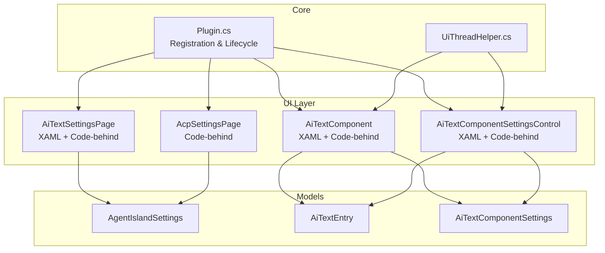
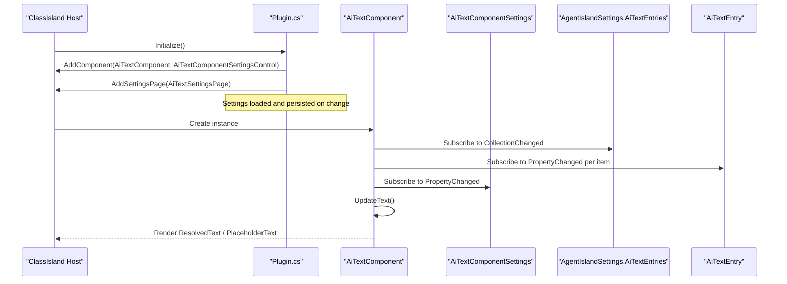
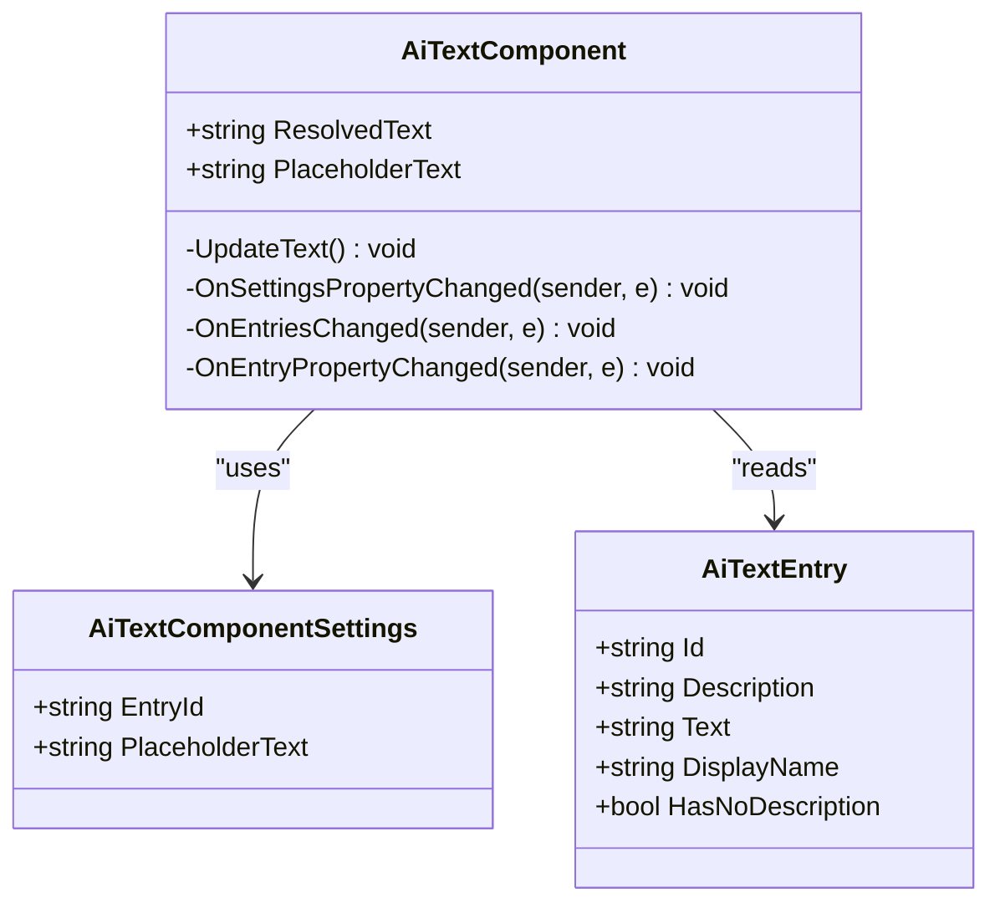
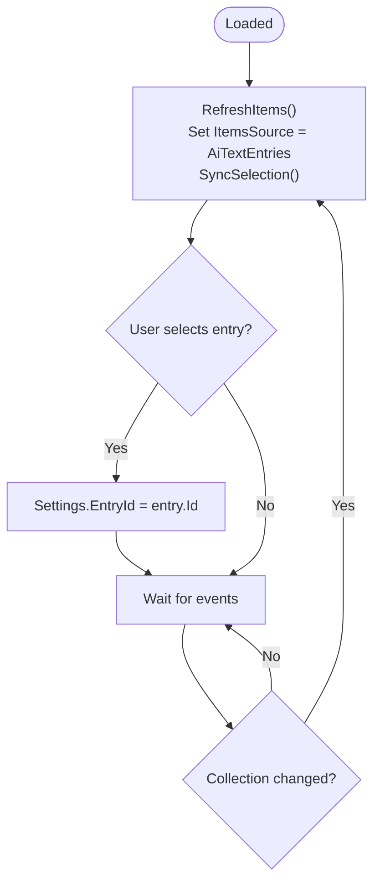
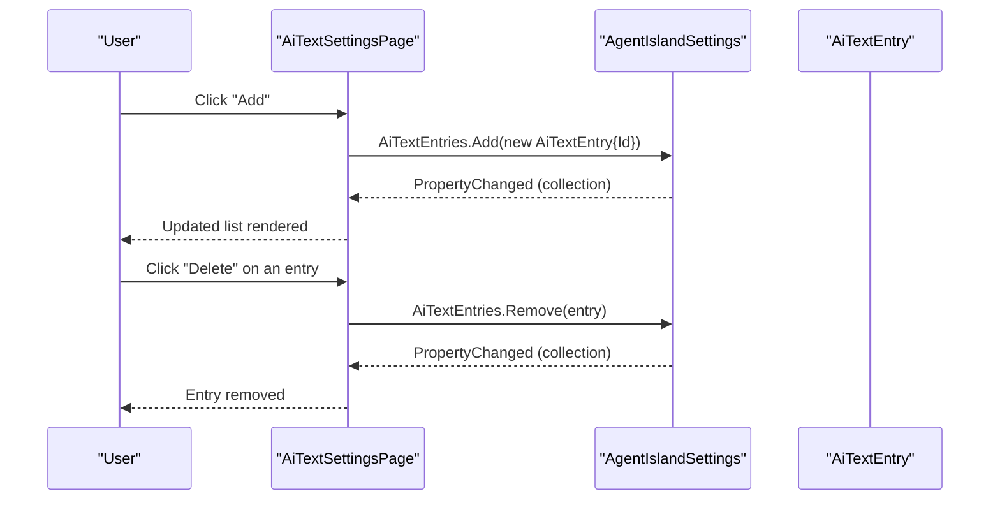
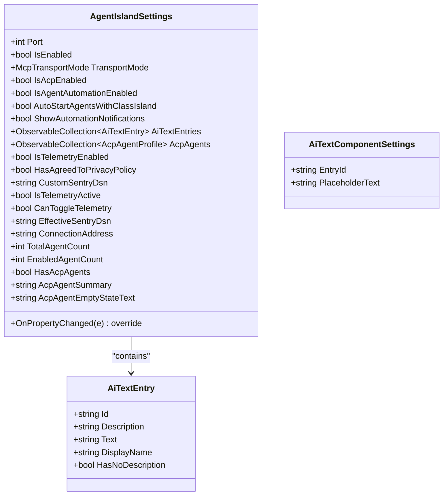
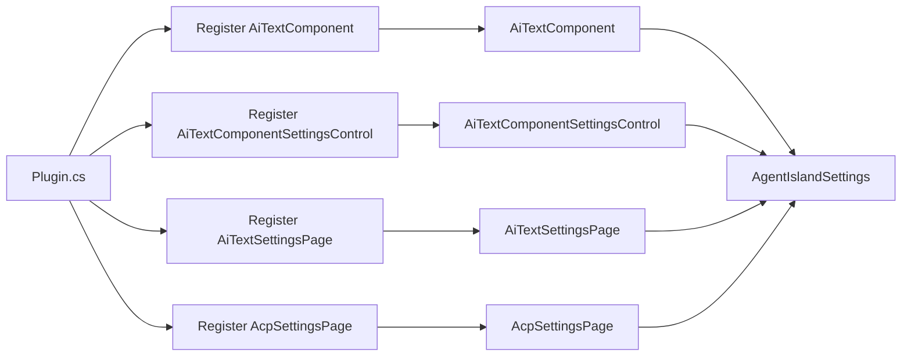

# UI Architecture

<cite>
**Referenced Files in This Document**
- [Plugin.cs](file://Plugin.cs)
- [AiTextComponent.axaml](file://Components/AiTextComponent.axaml)
- [AiTextComponent.axaml.cs](file://Components/AiTextComponent.axaml.cs)
- [AiTextComponentSettingsControl.axaml](file://Components/AiTextComponentSettingsControl.axaml)
- [AiTextComponentSettingsControl.axaml.cs](file://Components/AiTextComponentSettingsControl.axaml.cs)
- [AiTextEntry.cs](file://Models/AiTextEntry.cs)
- [AiTextComponentSettings.cs](file://Models/AiTextComponentSettings.cs)
- [AgentIslandSettings.cs](file://Models/AgentIslandSettings.cs)
- [AiTextSettingsPage.axaml](file://Views/SettingsPages/AiTextSettingsPage.axaml)
- [AiTextSettingsPage.axaml.cs](file://Views/SettingsPages/AiTextSettingsPage.axaml.cs)
- [AcpSettingsPage.axaml.cs](file://Views/SettingsPages/AcpSettingsPage.axaml.cs)
- [UiThreadHelper.cs](file://Helpers/UiThreadHelper.cs)
- [AgentIsland.csproj](file://AgentIsland.csproj)
</cite>

## Table of Contents
1. Introduction
2. Project Structure
3. Core Components
4. Architecture Overview
5. Detailed Component Analysis
6. Dependency Analysis
7. Performance Considerations
8. Troubleshooting Guide
9. Conclusion
10. Appendices

## Introduction
This document explains AgentIsland’s UI architecture built on Avalonia and integrated with the ClassIsland plugin framework. It focuses on:
- MVVM pattern implementation using data binding, property change notifications, and view-model separation
- The component system for reusable UI components (e.g., AiTextComponent) with dynamic content updates
- Settings pages architecture including validation, user feedback, and reactive configuration updates
- Guidelines for creating new UI components, customizing appearance, and ensuring accessibility across ClassIsland themes and configurations

The project targets Windows (.NET 8) and uses CommunityToolkit.Mvvm for observable models and properties, Avalonia XAML for declarative UI, and FluentAvalonia controls for settings pages.

## Project Structure
AgentIsland organizes its UI around three main areas:
- Components: Reusable UI elements that integrate into ClassIsland’s component surface
- Models: Observable settings and data structures used by views and components
- Views/SettingsPages: Configuration pages exposed to users via ClassIsland’s settings window

**Diagram sources**
- [Plugin.cs](file://Plugin.cs)
- [AiTextComponent.axaml](file://Components/AiTextComponent.axaml)
- [AiTextComponent.axaml.cs](file://Components/AiTextComponent.axaml.cs)
- [AiTextComponentSettingsControl.axaml](file://Components/AiTextComponentSettingsControl.axaml)
- [AiTextComponentSettingsControl.axaml.cs](file://Components/AiTextComponentSettingsControl.axaml.cs)
- [AiTextEntry.cs](file://Models/AiTextEntry.cs)
- [AiTextComponentSettings.cs](file://Models/AiTextComponentSettings.cs)
- [AgentIslandSettings.cs](file://Models/AgentIslandSettings.cs)
- [AiTextSettingsPage.axaml](file://Views/SettingsPages/AiTextSettingsPage.axaml)
- [AiTextSettingsPage.axaml.cs](file://Views/SettingsPages/AiTextSettingsPage.axaml.cs)
- [AcpSettingsPage.axaml.cs](file://Views/SettingsPages/AcpSettingsPage.axaml.cs)
- [UiThreadHelper.cs](file://Helpers/UiThreadHelper.cs)

**Section sources**
- [AgentIsland.csproj](file://AgentIsland.csproj)
- [Plugin.cs](file://Plugin.cs)

## Core Components
- AiTextComponent: A reusable text display component that resolves content from a selected entry and shows placeholder text when empty. It exposes Avalonia StyledProperties for ResolvedText and PlaceholderText and reacts to changes in entries and settings.
- AiTextComponentSettingsControl: A settings control for selecting an entry and configuring placeholder text. It binds to the component’s settings and syncs selection with the global collection.
- AiTextEntry: An observable model representing a single text entry with Id, Description, and Text fields. Derived properties like DisplayName and HasNoDescription support UI presentation.
- AiTextComponentSettings: Component-specific settings holding EntryId and PlaceholderText, implemented as an ObservableRecipient for integration with the plugin’s settings container.
- AgentIslandSettings: Central settings object exposing collections (AiTextEntries), derived properties (e.g., ConnectionAddress, telemetry flags), and automatic persistence via PropertyChanged.

Key MVVM characteristics:
- Data binding through RelativeSource bindings in XAML to component properties
- Property change notifications via CommunityToolkit.Mvvm attributes ([ObservableProperty]) and manual OnPropertyChanged calls
- Collections are ObservableCollection<T>, enabling reactive UI updates when items are added or removed

**Section sources**
- [AiTextComponent.axaml](file://Components/AiTextComponent.axaml)
- [AiTextComponent.axaml.cs](file://Components/AiTextComponent.axaml.cs)
- [AiTextComponentSettingsControl.axaml](file://Components/AiTextComponentSettingsControl.axaml)
- [AiTextComponentSettingsControl.axaml.cs](file://Components/AiTextComponentSettingsControl.axaml.cs)
- [AiTextEntry.cs](file://Models/AiTextEntry.cs)
- [AiTextComponentSettings.cs](file://Models/AiTextComponentSettings.cs)
- [AgentIslandSettings.cs](file://Models/AgentIslandSettings.cs)

## Architecture Overview
The UI architecture follows a clear separation between views, models, and registration/lifecycle:
- Plugin.cs registers components and settings pages with ClassIsland’s DI and registry
- Components and settings pages bind directly to observable models
- Global settings persist automatically on change and drive UI state

**Diagram sources**
- [Plugin.cs](file://Plugin.cs)
- [AiTextComponent.axaml.cs](file://Components/AiTextComponent.axaml.cs)
- [AgentIslandSettings.cs](file://Models/AgentIslandSettings.cs)
- [AiTextEntry.cs](file://Models/AiTextEntry.cs)
- [AiTextComponentSettings.cs](file://Models/AiTextComponentSettings.cs)

## Detailed Component Analysis

### AiTextComponent
Responsibilities:
- Resolve current text based on Settings.EntryId and the global AiTextEntries collection
- Show placeholder text when no content is available
- React to changes in entries and settings without manual refresh logic in the view

Data binding:
- XAML binds Text blocks to ResolvedText and PlaceholderText via RelativeSource to the component itself
- Visibility of placeholder is controlled by computed visibility logic in code-behind

Reactive updates:
- Subscribes to global AiTextEntries.CollectionChanged and individual AiTextEntry.PropertyChanged
- Subscribes to Settings.PropertyChanged
- Unsubscribes on Unloaded to prevent leaks

**Diagram sources**
- [AiTextComponent.axaml.cs](file://Components/AiTextComponent.axaml.cs)
- [AiTextComponentSettings.cs](file://Models/AiTextComponentSettings.cs)
- [AiTextEntry.cs](file://Models/AiTextEntry.cs)

**Section sources**
- [AiTextComponent.axaml](file://Components/AiTextComponent.axaml)
- [AiTextComponent.axaml.cs](file://Components/AiTextComponent.axaml.cs)

### AiTextComponentSettingsControl
Responsibilities:
- Provide a ComboBox to select an AiTextEntry by Id
- Allow editing PlaceholderText for the component
- Sync selection with Settings.EntryId and update when the global collection changes

Reactive behavior:
- Binds ItemsSource to Plugin.Settings.AiTextEntries
- Updates SelectedItem to match Settings.EntryId
- Listens to CollectionChanged to refresh the list

**Diagram sources**
- [AiTextComponentSettingsControl.axaml.cs](file://Components/AiTextComponentSettingsControl.axaml.cs)
- [AiTextComponentSettingsControl.axaml](file://Components/AiTextComponentSettingsControl.axaml)

**Section sources**
- [AiTextComponentSettingsControl.axaml.cs](file://Components/AiTextComponentSettingsControl.axaml.cs)
- [AiTextComponentSettingsControl.axaml](file://Components/AiTextComponentSettingsControl.axaml)

### Settings Pages Architecture
AiTextSettingsPage:
- Declares metadata via SettingsPageInfo attribute for discovery
- Sets DataContext to Plugin.Settings for two-way binding
- Provides Add/Delete operations for AiTextEntries
- Uses FluentAvalonia SettingsExpander and ItemsControl to render entries

Validation and user feedback:
- Empty-state visibility bound to !AiTextEntries.Count
- Watermarks guide users on expected input
- Derived properties in AgentIslandSettings enable conditional UI (e.g., telemetry toggles)

AcpSettingsPage:
- Similar pattern: sets DataContext to Plugin.Settings and provides bulk actions (enable/disable all)

**Diagram sources**
- [AiTextSettingsPage.axaml.cs](file://Views/SettingsPages/AiTextSettingsPage.axaml.cs)
- [AiTextSettingsPage.axaml](file://Views/SettingsPages/AiTextSettingsPage.axaml)
- [AgentIslandSettings.cs](file://Models/AgentIslandSettings.cs)

**Section sources**
- [AiTextSettingsPage.axaml.cs](file://Views/SettingsPages/AiTextSettingsPage.axaml.cs)
- [AiTextSettingsPage.axaml](file://Views/SettingsPages/AiTextSettingsPage.axaml)
- [AcpSettingsPage.axaml.cs](file://Views/SettingsPages/AcpSettingsPage.axaml.cs)

### Model Observability and Reactive Updates
AgentIslandSettings:
- Exposes collections (AiTextEntries, AcpAgents) with hooking/unhooking of PropertyChanged and CollectionChanged
- Computes derived properties (e.g., ConnectionAddress, IsTelemetryActive, CanToggleTelemetry) and raises OnPropertyChanged accordingly
- Persists changes automatically via Plugin initialization wiring

AiTextEntry:
- Uses [ObservableProperty] for Id, Description, Text
- Implements partial methods to recompute DisplayName and HasNoDescription when base properties change

AiTextComponentSettings:
- Extends ObservableRecipient to integrate with the plugin’s settings container
- Uses [ObservableProperty] for EntryId and PlaceholderText

**Diagram sources**
- [AgentIslandSettings.cs](file://Models/AgentIslandSettings.cs)
- [AiTextEntry.cs](file://Models/AiTextEntry.cs)
- [AiTextComponentSettings.cs](file://Models/AiTextComponentSettings.cs)

**Section sources**
- [AgentIslandSettings.cs](file://Models/AgentIslandSettings.cs)
- [AiTextEntry.cs](file://Models/AiTextEntry.cs)
- [AiTextComponentSettings.cs](file://Models/AiTextComponentSettings.cs)

## Dependency Analysis
- Plugin.cs registers components and settings pages with ClassIsland’s service container and registry
- Components depend on global settings via Plugin.Settings and react to changes
- XAML bindings rely on Avalonia’s RelativeSource and DataContext patterns
- FluentAvalonia controls provide consistent styling and UX for settings pages

**Diagram sources**
- [Plugin.cs](file://Plugin.cs)
- [AiTextComponent.axaml.cs](file://Components/AiTextComponent.axaml.cs)
- [AiTextComponentSettingsControl.axaml.cs](file://Components/AiTextComponentSettingsControl.axaml.cs)
- [AiTextSettingsPage.axaml.cs](file://Views/SettingsPages/AiTextSettingsPage.axaml.cs)
- [AcpSettingsPage.axaml.cs](file://Views/SettingsPages/AcpSettingsPage.axaml.cs)
- [AgentIslandSettings.cs](file://Models/AgentIslandSettings.cs)

**Section sources**
- [Plugin.cs](file://Plugin.cs)

## Performance Considerations
- Prefer lightweight property updates; avoid heavy computations in property setters
- Use ObservableCollection<T> for collections to minimize UI refresh overhead
- Ensure subscriptions are properly unsubscribed on Unloaded to prevent memory leaks
- Use Dispatcher.UIThread helpers when updating UI from background threads

[No sources needed since this section provides general guidance]

## Troubleshooting Guide
Common issues and resolutions:
- UI not updating after changing entries: Verify that AiTextEntries is an ObservableCollection and that PropertyChanged is raised for items
- Placeholder not showing: Check ResolvedText computation and PlaceholderTextBlock visibility logic
- Cross-thread access errors: Use UiThreadHelper.RunOnUi to marshal UI updates onto the dispatcher thread
- Settings not persisting: Confirm Plugin initialization wires Settings.PropertyChanged to save config

**Section sources**
- [AiTextComponent.axaml.cs](file://Components/AiTextComponent.axaml.cs)
- [AiTextComponentSettingsControl.axaml.cs](file://Components/AiTextComponentSettingsControl.axaml.cs)
- [UiThreadHelper.cs](file://Helpers/UiThreadHelper.cs)
- [Plugin.cs](file://Plugin.cs)

## Conclusion
AgentIsland’s UI architecture leverages Avalonia and ClassIsland to deliver a clean MVVM experience:
- Components expose StyledProperties and react to global settings and collections
- Settings pages use FluentAvalonia for consistent UX and bind directly to observable models
- Centralized settings management ensures reactive updates and persistence
Following the guidelines below will help maintain consistency, performance, and accessibility.

[No sources needed since this section summarizes without analyzing specific files]

## Appendices

### Guidelines for Creating New UI Components
- Inherit from ComponentBase<TSettings> and register via services.AddComponent in Plugin.Initialize
- Define public Avalonia StyledProperties for values bound in XAML
- Subscribe to relevant collections and settings in Loaded; unsubscribe in Unloaded
- Keep UI logic minimal; prefer data binding and computed properties

**Section sources**
- [Plugin.cs](file://Plugin.cs)
- [AiTextComponent.axaml.cs](file://Components/AiTextComponent.axaml.cs)

### Guidelines for Customizing Appearance
- Use FluentAvalonia controls for settings pages to inherit theme styles
- Apply DynamicResource brushes where appropriate for theme compatibility
- Maintain consistent spacing and typography using Classes and Spacing attributes in XAML

**Section sources**
- [AiTextSettingsPage.axaml](file://Views/SettingsPages/AiTextSettingsPage.axaml)

### Ensuring Accessibility Compliance
- Provide meaningful placeholders and watermarks for inputs
- Ensure visible focus indicators and keyboard navigation
- Use semantic controls (ComboBox, TextBox) with proper labels or headers
- Test contrast and readability under different ClassIsland themes

[No sources needed since this section provides general guidance]