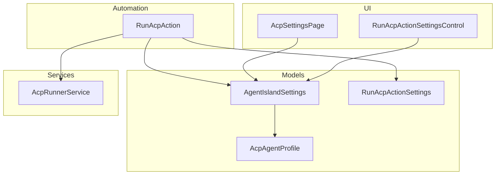
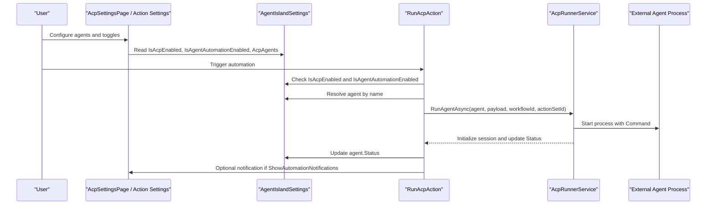
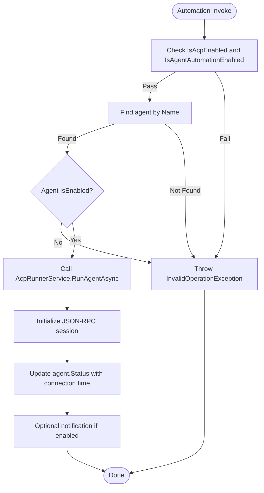
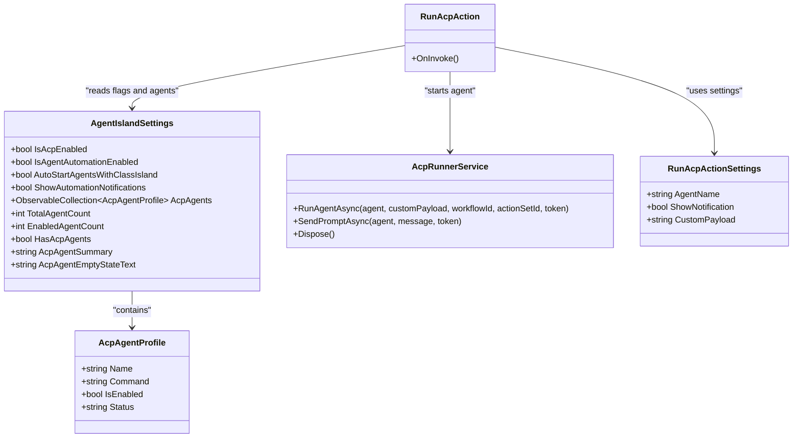

# ACP Agent Configuration

<cite>
**Referenced Files in This Document**
- [AgentIslandSettings.cs](file://Models/AgentIslandSettings.cs)
- [AcpAgentProfile.cs](file://Models/AcpAgentProfile.cs)
- [AcpRunnerService.cs](file://Services/AcpRunnerService.cs)
- [RunAcpAction.cs](file://Automation/RunAcpAction.cs)
- [RunAcpActionSettings.cs](file://Models/RunAcpActionSettings.cs)
- [AcpSettingsPage.axaml.cs](file://Views/SettingsPages/AcpSettingsPage.axaml.cs)
- [AcpSettingsPage.axaml](file://Views/SettingsPages/AcpSettingsPage.axaml)
- [RunAcpActionSettingsControl.axaml.cs](file://Views/ActionSettings/RunAcpActionSettingsControl.axaml.cs)
</cite>

## Table of Contents
1. [Introduction](#introduction)
2. [Project Structure](#project-structure)
3. [Core Components](#core-components)
4. [Architecture Overview](#architecture-overview)
5. [Detailed Component Analysis](#detailed-component-analysis)
6. [Dependency Analysis](#dependency-analysis)
7. [Performance Considerations](#performance-considerations)
8. [Troubleshooting Guide](#troubleshooting-guide)
9. [Conclusion](#conclusion)
10. [Appendices](#appendices)

## Introduction
This document explains how ACP agent configuration is managed in the project, focusing on:
- Global toggles and feature flags: IsAcpEnabled, IsAgentAutomationEnabled
- Startup behavior: AutoStartAgentsWithClassIsland
- Display option: ShowAutomationNotifications
- The AcpAgents collection and AcpAgentProfile model
- Derived properties: TotalAgentCount, EnabledAgentCount, HasAcpAgents, and summary text generation
- Examples for configuring multiple agents with different commands, managing lifecycle, and handling status changes

## Project Structure
The ACP agent configuration spans models, services, automation actions, and UI pages:
- Models define settings and profiles
- Services manage process lifecycle and communication
- Automation actions enforce feature flags and trigger execution
- UI pages bind to settings and provide management controls

**Diagram sources**
- [AgentIslandSettings.cs:1-394](file://Models/AgentIslandSettings.cs#L1-L394)
- [AcpAgentProfile.cs:1-44](file://Models/AcpAgentProfile.cs#L1-L44)
- [RunAcpActionSettings.cs:1-35](file://Models/RunAcpActionSettings.cs#L1-L35)
- [AcpRunnerService.cs:1-207](file://Services/AcpRunnerService.cs#L1-L207)
- [RunAcpAction.cs:1-83](file://Automation/RunAcpAction.cs#L1-L83)
- [AcpSettingsPage.axaml.cs:1-67](file://Views/SettingsPages/AcpSettingsPage.axaml.cs#L1-L67)
- [RunAcpActionSettingsControl.axaml.cs:1-37](file://Views/ActionSettings/RunAcpActionSettingsControl.axaml.cs#L1-L37)

**Section sources**
- [AgentIslandSettings.cs:1-394](file://Models/AgentIslandSettings.cs#L1-L394)
- [AcpAgentProfile.cs:1-44](file://Models/AcpAgentProfile.cs#L1-L44)
- [AcpRunnerService.cs:1-207](file://Services/AcpRunnerService.cs#L1-L207)
- [RunAcpAction.cs:1-83](file://Automation/RunAcpAction.cs#L1-L83)
- [RunAcpActionSettings.cs:1-35](file://Models/RunAcpActionSettings.cs#L1-L35)
- [AcpSettingsPage.axaml.cs:1-67](file://Views/SettingsPages/AcpSettingsPage.axaml.cs#L1-L67)
- [RunAcpActionSettingsControl.axaml.cs:1-37](file://Views/ActionSettings/RunAcpActionSettingsControl.axaml.cs#L1-L37)

## Core Components
- AgentIslandSettings: Central configuration container exposing global toggles, feature flags, startup options, notifications preference, and the AcpAgents collection with derived properties.
- AcpAgentProfile: Per-agent configuration including name, command, enabled state, and runtime status.
- AcpRunnerService: Starts and manages external agent processes via stdio JSON-RPC, updates agent status, and handles session lifecycle.
- RunAcpAction: Automation action that enforces feature flags, locates an agent by name, starts it, updates status, and optionally shows a notification.
- UI pages: Bind to settings and provide add/remove/bulk enable/disable operations and display summaries.

Key configuration items:
- IsAcpEnabled: Global toggle gating ACP features.
- IsAgentAutomationEnabled: Feature flag enabling automation-based agent runs.
- AutoStartAgentsWithClassIsland: Startup behavior setting (available for use at application start).
- ShowAutomationNotifications: Display option controlling whether automation triggers show notifications.
- AcpAgents: ObservableCollection<AcpAgentProfile>.
- Derived properties: TotalAgentCount, EnabledAgentCount, HasAcpAgents, AcpAgentSummary, AcpAgentEmptyStateText.

**Section sources**
- [AgentIslandSettings.cs:14-102](file://Models/AgentIslandSettings.cs#L14-L102)
- [AgentIslandSettings.cs:213-238](file://Models/AgentIslandSettings.cs#L213-L238)
- [AcpAgentProfile.cs:9-43](file://Models/AcpAgentProfile.cs#L9-L43)
- [AcpRunnerService.cs:25-77](file://Services/AcpRunnerService.cs#L25-L77)
- [RunAcpAction.cs:29-82](file://Automation/RunAcpAction.cs#L29-L82)
- [AcpSettingsPage.axaml.cs:31-64](file://Views/SettingsPages/AcpSettingsPage.axaml.cs#L31-L64)

## Architecture Overview
ACP agent configuration flows from settings into automation and service layers:
- Settings expose toggles and collections.
- Automation checks flags, resolves agent, and invokes runner.
- Runner spawns process, initializes session, and updates status.
- UI binds to settings and provides management controls.

**Diagram sources**
- [RunAcpAction.cs:29-82](file://Automation/RunAcpAction.cs#L29-L82)
- [AcpRunnerService.cs:25-77](file://Services/AcpRunnerService.cs#L25-L77)
- [AgentIslandSettings.cs:14-102](file://Models/AgentIslandSettings.cs#L14-L102)
- [AcpSettingsPage.axaml.cs:25-40](file://Views/SettingsPages/AcpSettingsPage.axaml.cs#L25-L40)

## Detailed Component Analysis

### Global Toggles and Feature Flags
- IsAcpEnabled: When false, automation rejects execution early.
- IsAgentAutomationEnabled: When false, automation rejects execution even if IsAcpEnabled is true.
- AutoStartAgentsWithClassIsland: Available for startup-time logic; currently exposed for future integration.
- ShowAutomationNotifications: Controls whether automation triggers show user notifications.

Usage patterns:
- Automation action checks both IsAcpEnabled and IsAgentAutomationEnabled before proceeding.
- Notifications are shown only when both the global ShowAutomationNotifications and per-action ShowNotification are true.

**Section sources**
- [RunAcpAction.cs:35-45](file://Automation/RunAcpAction.cs#L35-L45)
- [RunAcpAction.cs:74-81](file://Automation/RunAcpAction.cs#L74-L81)
- [AgentIslandSettings.cs:67-102](file://Models/AgentIslandSettings.cs#L67-L102)

### Startup Behavior: AutoStartAgentsWithClassIsland
- Property exists in settings for potential startup-time auto-start of agents.
- No direct usage found in current codebase; intended for integration at application initialization.

Recommendation:
- Use this flag during plugin initialization to iterate AcpAgents and call the runner for each enabled agent when ClassIsland starts.

**Section sources**
- [AgentIslandSettings.cs:84-92](file://Models/AgentIslandSettings.cs#L84-L92)

### Display Option: ShowAutomationNotifications
- When true and per-action ShowNotification is true, automation displays a notification after starting an agent.

**Section sources**
- [RunAcpAction.cs:74-81](file://Automation/RunAcpAction.cs#L74-L81)
- [RunAcpActionSettings.cs:22-27](file://Models/RunAcpActionSettings.cs#L22-L27)

### AcpAgents Collection and AcpAgentProfile
- AcpAgents is an ObservableCollection<AcpAgentProfile>, enabling reactive UI updates and derived property recalculation.
- AcpAgentProfile fields:
  - Name: Identifier used to resolve agents in automation.
  - Command: External executable path plus arguments string.
  - IsEnabled: Toggle to allow or block execution.
  - Status: Runtime status string updated by automation and runner.

Note: Working directory and environment variables are not present in the current profile. If needed, extend the model accordingly.

**Section sources**
- [AgentIslandSettings.cs:124-143](file://Models/AgentIslandSettings.cs#L124-L143)
- [AcpAgentProfile.cs:9-43](file://Models/AcpAgentProfile.cs#L9-L43)

### Derived Properties and Summary Text
- TotalAgentCount: Count of all configured agents.
- EnabledAgentCount: Count of agents where IsEnabled is true.
- HasAcpAgents: True when there is at least one agent.
- AcpAgentSummary: Human-readable summary combining total and enabled counts.
- AcpAgentEmptyStateText: Guidance text when no agents are configured.

These properties are recalculated whenever the collection changes or any agent property changes.

**Section sources**
- [AgentIslandSettings.cs:213-238](file://Models/AgentIslandSettings.cs#L213-L238)
- [AgentIslandSettings.cs:303-338](file://Models/AgentIslandSettings.cs#L303-L338)

### Agent Lifecycle Management
- Automation validates flags and agent existence/enabled state.
- Runner starts the external process using Command, initializes a JSON-RPC session, and sets connection status.
- After successful run initiation, automation updates last-run timestamp in Status.
- On disposal, runner attempts graceful termination and cleanup.

**Diagram sources**
- [RunAcpAction.cs:29-82](file://Automation/RunAcpAction.cs#L29-L82)
- [AcpRunnerService.cs:25-77](file://Services/AcpRunnerService.cs#L25-L77)

**Section sources**
- [RunAcpAction.cs:29-82](file://Automation/RunAcpAction.cs#L29-L82)
- [AcpRunnerService.cs:25-77](file://Services/AcpRunnerService.cs#L25-L77)
- [AcpRunnerService.cs:156-191](file://Services/AcpRunnerService.cs#L156-L191)

### UI Integration and Management
- AcpSettingsPage binds to AgentIslandSettings and exposes:
  - Add agent button creating a new AcpAgentProfile with default values.
  - Remove agent button removing selected profile.
  - Enable all / Disable all bulk operations.
  - Summary and empty-state text bound to derived properties.

- RunAcpActionSettingsControl lists available agent names and defaults selection when possible.

**Section sources**
- [AcpSettingsPage.axaml.cs:25-64](file://Views/SettingsPages/AcpSettingsPage.axaml.cs#L25-L64)
- [AcpSettingsPage.axaml:31-102](file://Views/SettingsPages/AcpSettingsPage.axaml#L31-L102)
- [RunAcpActionSettingsControl.axaml.cs:15-35](file://Views/ActionSettings/RunAcpActionSettingsControl.axaml.cs#L15-L35)

## Dependency Analysis
- RunAcpAction depends on AgentIslandSettings and AcpRunnerService.
- AcpRunnerService depends on system process APIs and optional telemetry/logging.
- UI components depend on AgentIslandSettings for data binding.

**Diagram sources**
- [AgentIslandSettings.cs:14-102](file://Models/AgentIslandSettings.cs#L14-L102)
- [AcpAgentProfile.cs:9-43](file://Models/AcpAgentProfile.cs#L9-L43)
- [AcpRunnerService.cs:25-77](file://Services/AcpRunnerService.cs#L25-L77)
- [RunAcpAction.cs:16-27](file://Automation/RunAcpAction.cs#L16-L27)
- [RunAcpActionSettings.cs:9-35](file://Models/RunAcpActionSettings.cs#L9-L35)

**Section sources**
- [AgentIslandSettings.cs:14-102](file://Models/AgentIslandSettings.cs#L14-L102)
- [AcpAgentProfile.cs:9-43](file://Models/AcpAgentProfile.cs#L9-L43)
- [AcpRunnerService.cs:25-77](file://Services/AcpRunnerService.cs#L25-L77)
- [RunAcpAction.cs:16-27](file://Automation/RunAcpAction.cs#L16-L27)
- [RunAcpActionSettings.cs:9-35](file://Models/RunAcpActionSettings.cs#L9-L35)

## Performance Considerations
- Derived properties compute counts over the entire AcpAgents list; keep the list size reasonable to avoid unnecessary recomputation.
- Avoid frequent bulk updates to agent properties in tight loops; batch changes where possible.
- Process spawning and JSON-RPC initialization are asynchronous; ensure cancellation tokens are respected to prevent resource leaks.

[No sources needed since this section provides general guidance]

## Troubleshooting Guide
Common issues and resolutions:
- Automation blocked due to disabled flags:
  - Ensure IsAcpEnabled and IsAgentAutomationEnabled are true.
  - Verify the target agent exists and IsEnabled is true.
- Missing or invalid command:
  - Confirm the agent’s Command is set and points to a valid executable.
- Notification not shown:
  - Check ShowAutomationNotifications and per-action ShowNotification.
- Status not updating:
  - Confirm automation updates agent.Status after successful run initiation.

Operational references:
- Flag checks and error throwing paths in automation.
- Process start and initialization flow in runner.
- Status updates in automation and runner.

**Section sources**
- [RunAcpAction.cs:35-60](file://Automation/RunAcpAction.cs#L35-L60)
- [AcpRunnerService.cs:37-77](file://Services/AcpRunnerService.cs#L37-L77)
- [RunAcpAction.cs:71-81](file://Automation/RunAcpAction.cs#L71-L81)

## Conclusion
ACP agent configuration centers on a small set of clear toggles and a flexible agent profile model. Automation enforces safety through feature flags and per-agent enablement, while the runner manages process lifecycle and status. UI bindings provide intuitive management and real-time summaries. Extensibility points exist for working directory and environment variables if required.

[No sources needed since this section summarizes without analyzing specific files]

## Appendices

### Example Scenarios

- Configure multiple agents with different commands:
  - Add several AcpAgentProfile entries with unique Names and Commands.
  - Use bulk enable/disable operations to control activation.
  - Observe derived counts and summary text update automatically.

- Manage agent lifecycle:
  - Trigger automation to start an agent; verify Status reflects connection or last-run time.
  - Use disposal to terminate sessions cleanly.

- Handle agent status changes:
  - Monitor Status in UI; automation updates it after successful run initiation.

Implementation references:
- Adding/removing agents and bulk toggles in UI.
- Automation invocation and status updates.
- Runner process lifecycle and initialization.

**Section sources**
- [AcpSettingsPage.axaml.cs:31-64](file://Views/SettingsPages/AcpSettingsPage.axaml.cs#L31-L64)
- [RunAcpAction.cs:62-81](file://Automation/RunAcpAction.cs#L62-L81)
- [AcpRunnerService.cs:25-77](file://Services/AcpRunnerService.cs#L25-L77)