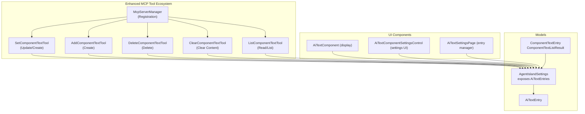
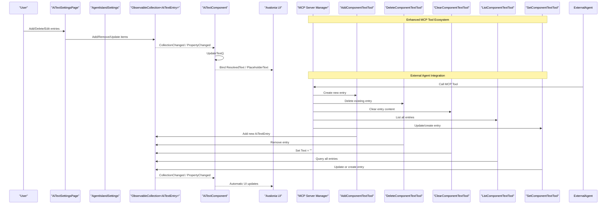
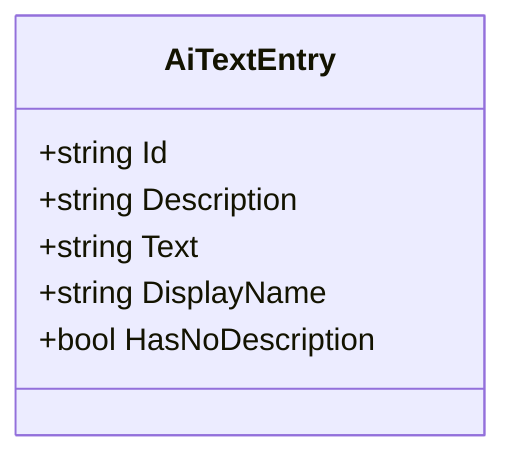
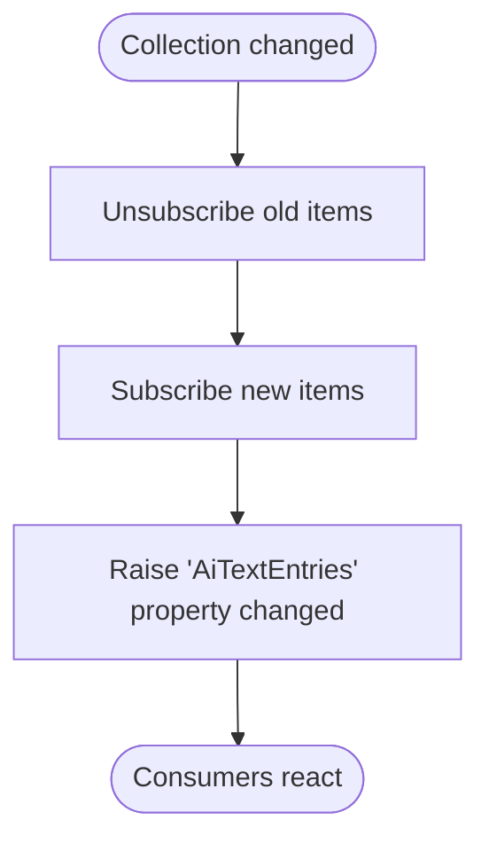
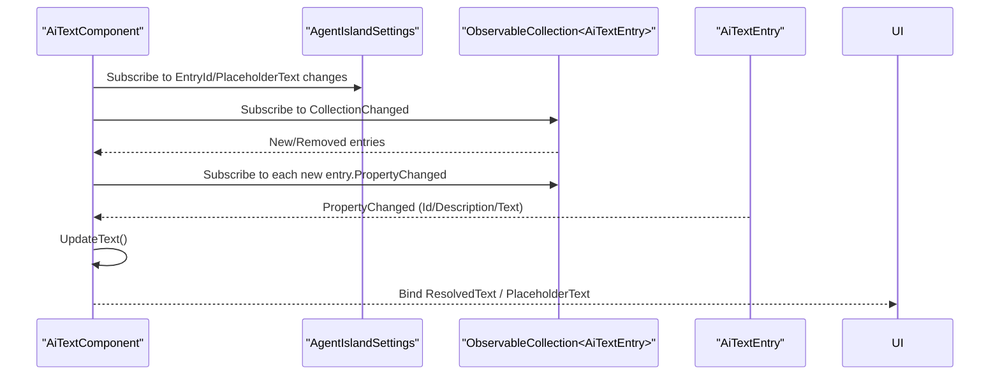
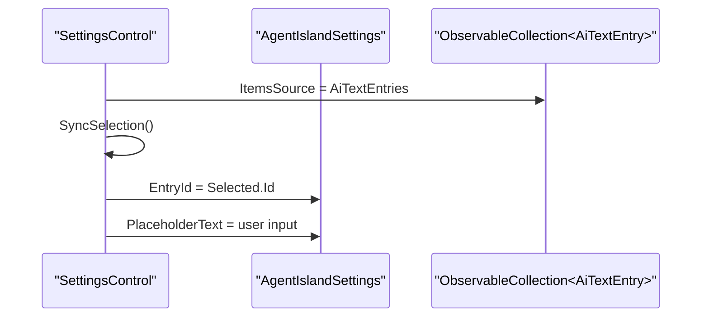
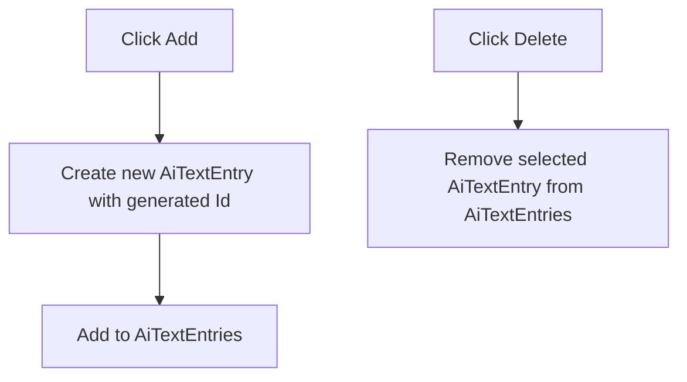
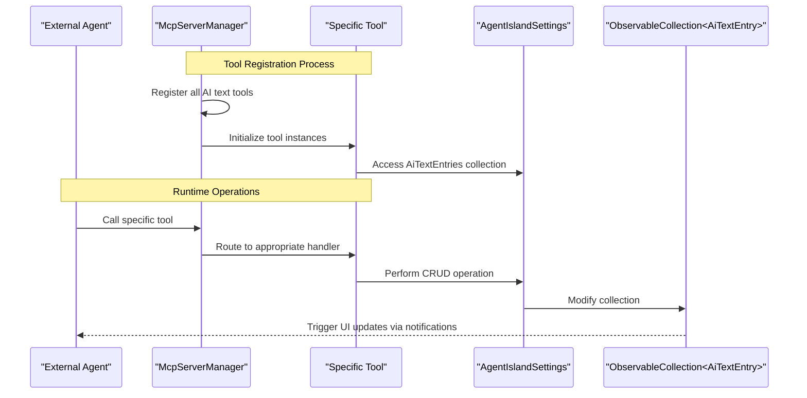
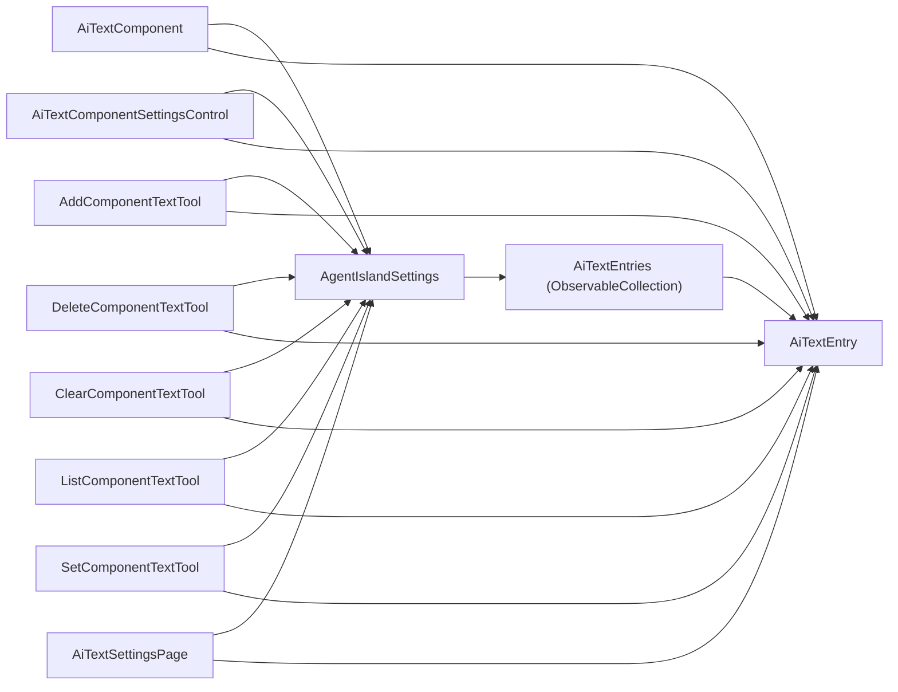

# AI Text Component Configuration

<cite>
**Referenced Files in This Document**
- [AiTextEntry.cs](file://Models/AiTextEntry.cs)
- [AgentIslandSettings.cs](file://Models/AgentIslandSettings.cs)
- [AiTextComponent.axaml.cs](file://Components/AiTextComponent.axaml.cs)
- [AiTextComponent.axaml](file://Components/AiTextComponent.axaml)
- [AiTextComponentSettingsControl.axaml.cs](file://Components/AiTextComponentSettingsControl.axaml.cs)
- [AiTextComponentSettingsControl.axaml](file://Components/AiTextComponentSettingsControl.axaml)
- [SetComponentTextTool.cs](file://Mcp/Tools/SetComponentTextTool.cs)
- [AddComponentTextTool.cs](file://Mcp/Tools/AddComponentTextTool.cs)
- [DeleteComponentTextTool.cs](file://Mcp/Tools/DeleteComponentTextTool.cs)
- [ClearComponentTextTool.cs](file://Mcp/Tools/ClearComponentTextTool.cs)
- [ListComponentTextTool.cs](file://Mcp/Tools/ListComponentTextTool.cs)
- [McpServerManager.cs](file://Mcp/McpServerManager.cs)
- [ToolResults.cs](file://Models/ToolResults.cs)
- [AiTextSettingsPage.axaml.cs](file://Views/SettingsPages/AiTextSettingsPage.axaml.cs)
- [AiTextSettingsPage.axaml](file://Views/SettingsPages/AiTextSettingsPage.axaml)
</cite>

## Update Summary
**Changes Made**
- Enhanced MCP tool ecosystem with full CRUD operations beyond the original set_component_text tool
- Added comprehensive management capabilities through dedicated tools for add, delete, clear, and list operations
- Introduced structured response models for better API consistency
- Updated architecture diagrams to reflect the expanded tool ecosystem

## Table of Contents
1. [Introduction](#introduction)
2. [Project Structure](#project-structure)
3. [Core Components](#core-components)
4. [Architecture Overview](#architecture-overview)
5. [Detailed Component Analysis](#detailed-component-analysis)
6. [MCP Tool Ecosystem](#mcp-tool-ecosystem)
7. [Dependency Analysis](#dependency-analysis)
8. [Performance Considerations](#performance-considerations)
9. [Troubleshooting Guide](#troubleshooting-guide)
10. [Conclusion](#conclusion)
11. [Appendices](#appendices)

## Introduction
This document explains how to configure and use the AI text component system. It focuses on the AiTextEntries ObservableCollection, the AiTextEntry data model, UI binding, real-time updates via property change notifications, collection change handling, and lifecycle management. The system now provides comprehensive CRUD operations through multiple MCP tools, enabling full programmatic management of AI text entries from external agents.

## Project Structure
The AI text feature spans models, components, settings UI, and an enhanced MCP tool ecosystem providing full CRUD operations for runtime content management.

**Diagram sources**
- [AiTextEntry.cs:1-31](file://Models/AiTextEntry.cs#L1-L31)
- [AgentIslandSettings.cs:104-122](file://Models/AgentIslandSettings.cs#L104-L122)
- [ToolResults.cs:55-69](file://Models/ToolResults.cs#L55-L69)
- [AiTextComponent.axaml.cs:1-85](file://Components/AiTextComponent.axaml.cs#L1-L85)
- [AiTextComponentSettingsControl.axaml.cs:1-53](file://Components/AiTextComponentSettingsControl.axaml.cs#L1-L53)
- [AiTextSettingsPage.axaml.cs:1-36](file://Views/SettingsPages/AiTextSettingsPage.axaml.cs#L1-L36)
- [McpServerManager.cs:42-55](file://Mcp/McpServerManager.cs#L42-L55)

**Section sources**
- [AiTextEntry.cs:1-31](file://Models/AiTextEntry.cs#L1-L31)
- [AgentIslandSettings.cs:104-122](file://Models/AgentIslandSettings.cs#L104-L122)
- [ToolResults.cs:55-69](file://Models/ToolResults.cs#L55-L69)
- [AiTextComponent.axaml.cs:1-85](file://Components/AiTextComponent.axaml.cs#L1-L85)
- [AiTextComponentSettingsControl.axaml.cs:1-53](file://Components/AiTextComponentSettingsControl.axaml.cs#L1-L53)
- [AiTextSettingsPage.axaml.cs:1-36](file://Views/SettingsPages/AiTextSettingsPage.axaml.cs#L1-L36)
- [McpServerManager.cs:42-55](file://Mcp/McpServerManager.cs#L42-L55)

## Core Components
- AiTextEntry: Observable model with Id, Description, Text, DisplayName, HasNoDescription. Property changes notify derived properties.
- AgentIslandSettings.AiTextEntries: ObservableCollection<AiTextEntry> with hooks to propagate collection and item changes.
- AiTextComponent: Displays ResolvedText and PlaceholderText based on selected EntryId; subscribes to collection and item changes.
- AiTextComponentSettingsControl: Settings UI to select a bound entry and set placeholder text.
- **Enhanced MCP Tool Ecosystem**: Five specialized tools providing full CRUD operations for external agent integration.
- AiTextSettingsPage: UI to add/delete entries and edit their properties.

Key responsibilities:
- Data model observability and derived properties
- Collection change propagation
- UI binding and real-time updates
- **Comprehensive external content management through specialized MCP tools**

**Section sources**
- [AiTextEntry.cs:1-31](file://Models/AiTextEntry.cs#L1-L31)
- [AgentIslandSettings.cs:340-392](file://Models/AgentIslandSettings.cs#L340-L392)
- [AiTextComponent.axaml.cs:1-85](file://Components/AiTextComponent.axaml.cs#L1-L85)
- [AiTextComponentSettingsControl.axaml.cs:1-53](file://Components/AiTextComponentSettingsControl.axaml.cs#L1-L53)
- [McpServerManager.cs:42-55](file://Mcp/McpServerManager.cs#L42-L55)
- [AiTextSettingsPage.axaml.cs:1-36](file://Views/SettingsPages/AiTextSettingsPage.axaml.cs#L1-L36)

## Architecture Overview
The system uses MVVM-style bindings and observable collections to keep UI in sync with data. The enhanced MCP ecosystem provides multiple specialized tools for different operations, each designed for specific use cases and idempotency requirements.

**Diagram sources**
- [AiTextSettingsPage.axaml.cs:22-34](file://Views/SettingsPages/AiTextSettingsPage.axaml.cs#L22-L34)
- [AgentIslandSettings.cs:340-392](file://Models/AgentIslandSettings.cs#L340-L392)
- [AiTextComponent.axaml.cs:36-83](file://Components/AiTextComponent.axaml.cs#L36-L83)
- [McpServerManager.cs:42-55](file://Mcp/McpServerManager.cs#L42-L55)

## Detailed Component Analysis

### Data Model: AiTextEntry
- Properties:
  - Id: Unique identifier used for selection and updates.
  - Description: Optional human-readable label.
  - Text: Dynamic content updated by AI/MCP.
- Derived properties:
  - DisplayName: Uses Description if present; otherwise falls back to Id.
  - HasNoDescription: Boolean helper for UI visibility logic.
- Notifications:
  - OnIdChanged and OnDescriptionChanged raise OnPropertyChanged for DisplayName and HasNoDescription.

**Diagram sources**
- [AiTextEntry.cs:5-30](file://Models/AiTextEntry.cs#L5-L30)

**Section sources**
- [AiTextEntry.cs:1-31](file://Models/AiTextEntry.cs#L1-L31)

### Collection Management: AgentIslandSettings.AiTextEntries
- Exposes an ObservableCollection<AiTextEntry>.
- Hooks into collection and item events to re-raise property changes for consumers.
- Ensures proper unhooking when the collection is replaced.

**Diagram sources**
- [AgentIslandSettings.cs:340-392](file://Models/AgentIslandSettings.cs#L340-L392)

**Section sources**
- [AgentIslandSettings.cs:104-122](file://Models/AgentIslandSettings.cs#L104-L122)
- [AgentIslandSettings.cs:340-392](file://Models/AgentIslandSettings.cs#L340-L392)

### Display Component: AiTextComponent
- Avalonia component exposing ResolvedText and PlaceholderText.
- Subscribes to:
  - Global collection changes.
  - Individual entry property changes.
  - Settings property changes (EntryId, PlaceholderText).
- UpdateText():
  - Finds the entry by EntryId.
  - Sets ResolvedText to entry.Text if non-empty; otherwise empty.
  - Sets PlaceholderText from settings.
  - Toggles placeholder visibility based on content presence.

**Diagram sources**
- [AiTextComponent.axaml.cs:36-83](file://Components/AiTextComponent.axaml.cs#L36-L83)
- [AiTextComponent.axaml:10-18](file://Components/AiTextComponent.axaml#L10-L18)

**Section sources**
- [AiTextComponent.axaml.cs:1-85](file://Components/AiTextComponent.axaml.cs#L1-L85)
- [AiTextComponent.axaml:1-20](file://Components/AiTextComponent.axaml#L1-L20)

### Settings Control: AiTextComponentSettingsControl
- Binds a ComboBox to the global AiTextEntries.
- Syncs selected item with Settings.EntryId.
- Updates placeholder text via Settings.PlaceholderText.

**Diagram sources**
- [AiTextComponentSettingsControl.axaml.cs:16-51](file://Components/AiTextComponentSettingsControl.axaml.cs#L16-L51)
- [AiTextComponentSettingsControl.axaml:11-27](file://Components/AiTextComponentSettingsControl.axaml#L11-L27)

**Section sources**
- [AiTextComponentSettingsControl.axaml.cs:1-53](file://Components/AiTextComponentSettingsControl.axaml.cs#L1-L53)
- [AiTextComponentSettingsControl.axaml:1-32](file://Components/AiTextComponentSettingsControl.axaml#L1-L32)

### Entry Manager UI: AiTextSettingsPage
- Provides Add and Delete operations for entries.
- Binds to the global collection and exposes editable fields for Id, Description, and Text.

**Diagram sources**
- [AiTextSettingsPage.axaml.cs:22-34](file://Views/SettingsPages/AiTextSettingsPage.axaml.cs#L22-L34)
- [AiTextSettingsPage.axaml:25-70](file://Views/SettingsPages/AiTextSettingsPage.axaml#L25-L70)

**Section sources**
- [AiTextSettingsPage.axaml.cs:1-36](file://Views/SettingsPages/AiTextSettingsPage.axaml.cs#L1-L36)
- [AiTextSettingsPage.axaml:1-81](file://Views/SettingsPages/AiTextSettingsPage.axaml#L1-L81)

## MCP Tool Ecosystem

### Enhanced CRUD Operations
The system now provides five specialized MCP tools offering comprehensive management capabilities beyond the original single tool:

#### Create Operations
- **AddComponentTextTool**: Creates new entries with validation for unique IDs
  - Parameters: `id` (required), `text` (optional), `description` (optional)
  - Validates uniqueness before creation
  - Returns structured success/failure response

#### Read Operations  
- **ListComponentTextTool**: Retrieves all entries with complete metadata
  - No parameters required
  - Returns `ComponentTextListResult` containing array of `ComponentTextEntry` objects
  - Includes Id, Description, Text, and DisplayName for each entry

#### Update Operations
- **SetComponentTextTool**: Updates existing entries or creates new ones
  - Parameters: `id` (required), `text` (required)
  - Idempotent operation that can create missing entries
  - Original functionality maintained

#### Delete Operations
- **DeleteComponentTextTool**: Removes specific entries by ID
  - Parameters: `id` (required)
  - Fails gracefully if entry doesn't exist
  - Permanent deletion of entry and all associated data

#### Content Management
- **ClearComponentTextTool**: Clears text content while preserving entry structure
  - Parameters: `id` (required) - supports special value "all" for bulk clearing
  - Distinguishes between deleting entries vs clearing their content
  - Supports both individual and batch operations

### Tool Registration and Management
All tools are centrally registered through McpServerManager, which handles:
- Tool discovery and registration
- JSON serialization context configuration
- Transport mode setup (HTTP/SSE)
- Lifecycle management

**Diagram sources**
- [McpServerManager.cs:42-55](file://Mcp/McpServerManager.cs#L42-L55)
- [AddComponentTextTool.cs:60-78](file://Mcp/Tools/AddComponentTextTool.cs#L60-L78)
- [DeleteComponentTextTool.cs:57-69](file://Mcp/Tools/DeleteComponentTextTool.cs#L57-L69)
- [ClearComponentTextTool.cs:59-89](file://Mcp/Tools/ClearComponentTextTool.cs#L59-L89)
- [ListComponentTextTool.cs:47-50](file://Mcp/Tools/ListComponentTextTool.cs#L47-L50)

### Structured Response Models
The enhanced system introduces specialized result types for consistent API responses:

- **SetTextResult**: Standardized success/failure responses for write operations
- **ComponentTextEntry**: Represents individual entry data for listing operations
- **ComponentTextListResult**: Container for multiple entry listings

**Section sources**
- [McpServerManager.cs:42-55](file://Mcp/McpServerManager.cs#L42-L55)
- [AddComponentTextTool.cs:18-109](file://Mcp/Tools/AddComponentTextTool.cs#L18-L109)
- [DeleteComponentTextTool.cs:18-100](file://Mcp/Tools/DeleteComponentTextTool.cs#L18-L100)
- [ClearComponentTextTool.cs:18-120](file://Mcp/Tools/ClearComponentTextTool.cs#L18-L120)
- [ListComponentTextTool.cs:18-66](file://Mcp/Tools/ListComponentTextTool.cs#L18-L66)
- [ToolResults.cs:55-69](file://Models/ToolResults.cs#L55-L69)

## Dependency Analysis
- AiTextComponent depends on:
  - Plugin.Settings.AiTextEntries (collection)
  - Settings.EntryId and Settings.PlaceholderText
- AiTextComponentSettingsControl depends on:
  - Plugin.Settings.AiTextEntries
  - Settings.EntryId and Settings.PlaceholderText
- **Enhanced MCP Tools depend on**:
  - Plugin.Settings.AiTextEntries
  - UiThreadHelper for UI-thread access
  - Structured result models for consistent responses
- AiTextSettingsPage depends on:
  - Plugin.Settings.AiTextEntries

**Diagram sources**
- [AgentIslandSettings.cs:104-122](file://Models/AgentIslandSettings.cs#L104-L122)
- [AiTextComponent.axaml.cs:36-83](file://Components/AiTextComponent.axaml.cs#L36-L83)
- [AiTextComponentSettingsControl.axaml.cs:16-51](file://Components/AiTextComponentSettingsControl.axaml.cs#L16-L51)
- [AddComponentTextTool.cs:60-78](file://Mcp/Tools/AddComponentTextTool.cs#L60-L78)
- [DeleteComponentTextTool.cs:57-69](file://Mcp/Tools/DeleteComponentTextTool.cs#L57-L69)
- [ClearComponentTextTool.cs:59-89](file://Mcp/Tools/ClearComponentTextTool.cs#L59-L89)
- [ListComponentTextTool.cs:47-50](file://Mcp/Tools/ListComponentTextTool.cs#L47-L50)
- [SetComponentTextTool.cs:56-63](file://Mcp/Tools/SetComponentTextTool.cs#L56-L63)
- [AiTextSettingsPage.axaml.cs:22-34](file://Views/SettingsPages/AiTextSettingsPage.axaml.cs#L22-L34)

**Section sources**
- [AgentIslandSettings.cs:104-122](file://Models/AgentIslandSettings.cs#L104-L122)
- [AiTextComponent.axaml.cs:36-83](file://Components/AiTextComponent.axaml.cs#L36-L83)
- [AiTextComponentSettingsControl.axaml.cs:16-51](file://Components/AiTextComponentSettingsControl.axaml.cs#L16-L51)
- [AddComponentTextTool.cs:60-78](file://Mcp/Tools/AddComponentTextTool.cs#L60-L78)
- [DeleteComponentTextTool.cs:57-69](file://Mcp/Tools/DeleteComponentTextTool.cs#L57-L69)
- [ClearComponentTextTool.cs:59-89](file://Mcp/Tools/ClearComponentTextTool.cs#L59-L89)
- [ListComponentTextTool.cs:47-50](file://Mcp/Tools/ListComponentTextTool.cs#L47-L50)
- [SetComponentTextTool.cs:56-63](file://Mcp/Tools/SetComponentTextTool.cs#L56-L63)
- [AiTextSettingsPage.axaml.cs:22-34](file://Views/SettingsPages/AiTextSettingsPage.axaml.cs#L22-L34)

## Performance Considerations
- Large collections:
  - Each entry adds two event subscriptions (collection and item). For very large lists, consider virtualizing the settings UI and avoiding heavy per-item computations.
  - Avoid frequent bulk mutations; batch updates where possible to reduce notification storms.
  - **Enhanced consideration**: Use ListComponentTextTool judiciously for large collections as it returns complete entry data.
- Binding efficiency:
  - Use DisplayName and HasNoDescription to minimize conditional logic in XAML.
  - Keep placeholder text short and avoid complex formatting in ResolvedText.
- UI thread safety:
  - All modifications to the collection occur on the UI thread via UiThreadHelper to prevent cross-thread exceptions.
  - **Enhanced consideration**: All MCP tools properly handle UI thread marshaling for safe collection access.
- Memory leaks:
  - Ensure all event handlers are unsubscribed on Unloaded to prevent memory leaks.
- **New considerations for enhanced tools**:
  - Implement proper error handling and logging for failed operations
  - Consider rate limiting for high-frequency tool calls
  - Monitor memory usage when dealing with large numbers of entries

[No sources needed since this section provides general guidance]

## Troubleshooting Guide
- No text displayed:
  - Verify that Settings.EntryId matches an existing entry's Id.
  - Confirm that the entry's Text is not empty; otherwise, placeholder should be visible.
- Placeholder not updating:
  - Ensure Settings.PlaceholderText is set and the component has loaded so it can subscribe to settings changes.
- Changes not reflected:
  - Confirm that the MCP tool call succeeded and that the entry was created or updated.
  - Check logs for errors in the MCP tool and ensure the UI thread is available.
- Selection mismatch in settings control:
  - Re-check SyncSelection logic and ensure EntryId is persisted correctly after selection changes.
- **Enhanced troubleshooting for new tools**:
  - **Add failures**: Check for duplicate ID conflicts and verify parameter validation
  - **Delete issues**: Confirm entry existence before deletion attempts
  - **Clear operations**: Distinguish between clearing content vs deleting entries
  - **List operations**: Verify proper JSON serialization and response formatting
  - **Tool registration**: Ensure all tools are properly registered in McpServerManager

**Section sources**
- [AiTextComponent.axaml.cs:73-83](file://Components/AiTextComponent.axaml.cs#L73-L83)
- [SetComponentTextTool.cs:41-72](file://Mcp/Tools/SetComponentTextTool.cs#L41-L72)
- [AddComponentTextTool.cs:60-78](file://Mcp/Tools/AddComponentTextTool.cs#L60-L78)
- [DeleteComponentTextTool.cs:57-69](file://Mcp/Tools/DeleteComponentTextTool.cs#L57-L69)
- [ClearComponentTextTool.cs:59-89](file://Mcp/Tools/ClearComponentTextTool.cs#L59-L89)
- [ListComponentTextTool.cs:47-50](file://Mcp/Tools/ListComponentTextTool.cs#L47-L50)
- [AiTextComponentSettingsControl.axaml.cs:35-51](file://Components/AiTextComponentSettingsControl.axaml.cs#L35-L51)

## Conclusion
The AI text component system has been significantly enhanced with a comprehensive MCP tool ecosystem providing full CRUD operations. The original single tool approach has evolved into five specialized tools, each optimized for specific operations: creation, reading, updating, deletion, and content clearing. This architectural improvement enables more granular control, better error handling, and improved maintainability while preserving backward compatibility with existing implementations. The enhanced system maintains real-time UI updates through observable collections while providing robust external integration capabilities for AI agents.

[No sources needed since this section summarizes without analyzing specific files]

## Appendices

### Examples and Best Practices

- Creating entries:
  - Use the settings page to add entries with unique Ids and optional descriptions.
  - **Enhanced**: Use AddComponentTextTool for programmatic creation with validation.
  - Example path: [AiTextSettingsPage.axaml.cs:22-28](file://Views/SettingsPages/AiTextSettingsPage.axaml.cs#L22-L28)

- Configuring display format:
  - Use Description for friendly labels; DisplayName will fall back to Id if Description is empty.
  - Configure PlaceholderText in the component settings control.
  - Example paths:
    - [AiTextEntry.cs:16-18](file://Models/AiTextEntry.cs#L16-L18)
    - [AiTextComponentSettingsControl.axaml.cs:44-51](file://Components/AiTextComponentSettingsControl.axaml.cs#L44-L51)

- Managing entry lifecycle:
  - Add entries via the settings page or AddComponentTextTool.
  - Delete entries using the delete button or DeleteComponentTextTool.
  - Clear content using ClearComponentTextTool without deleting entries.
  - Update content via SetComponentTextTool or ClearComponentTextTool.
  - List entries using ListComponentTextTool for monitoring and debugging.
  - Example paths:
    - [AiTextSettingsPage.axaml.cs:30-34](file://Views/SettingsPages/AiTextSettingsPage.axaml.cs#L30-L34)
    - [AddComponentTextTool.cs:60-78](file://Mcp/Tools/AddComponentTextTool.cs#L60-L78)
    - [DeleteComponentTextTool.cs:57-69](file://Mcp/Tools/DeleteComponentTextTool.cs#L57-L69)
    - [ClearComponentTextTool.cs:59-89](file://Mcp/Tools/ClearComponentTextTool.cs#L59-L89)
    - [ListComponentTextTool.cs:47-50](file://Mcp/Tools/ListComponentTextTool.cs#L47-L50)

- Organizing text content:
  - Group related entries by naming conventions for Ids and descriptive labels.
  - Keep descriptions concise for better readability in the settings UI.
  - Avoid excessive nested formatting in Text to maintain rendering performance.
  - **Enhanced**: Use the list tool regularly to audit entry organization and clean up unused entries.

- **New best practices for enhanced tool usage**:
  - Prefer AddComponentTextTool for initial creation to ensure proper validation
  - Use ClearComponentTextTool for temporary content rather than creating/deleting entries
  - Implement proper error handling for all tool operations
  - Use ListComponentTextTool for debugging and monitoring entry states
  - Consider idempotency requirements when designing automation workflows

[No sources needed since this section aggregates previously analyzed information]