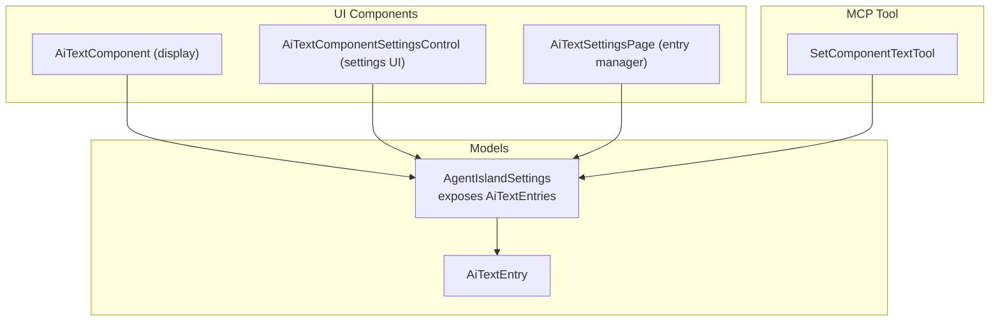
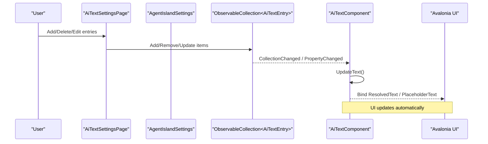
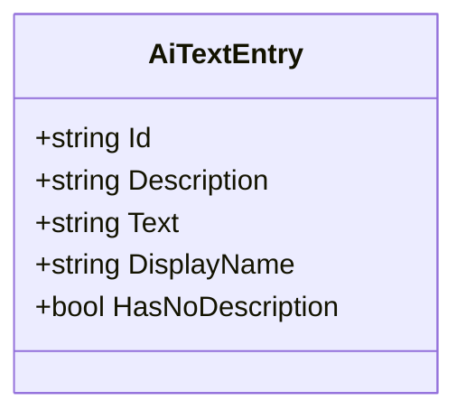
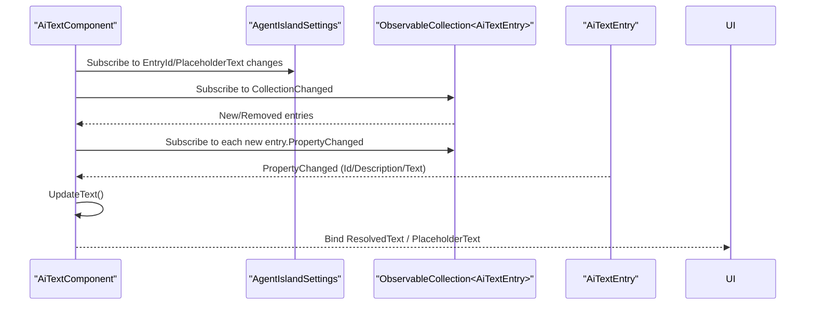
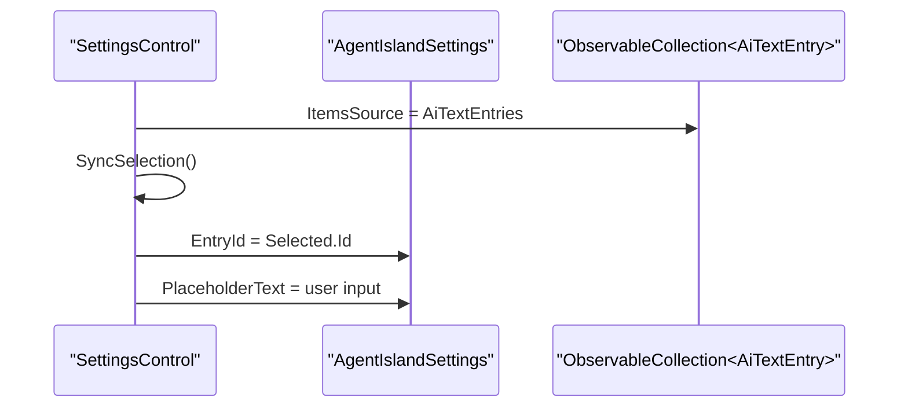
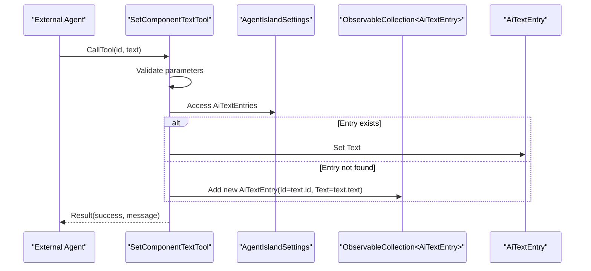
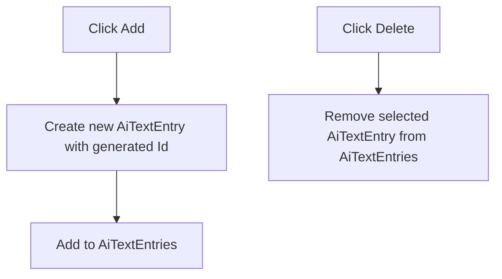
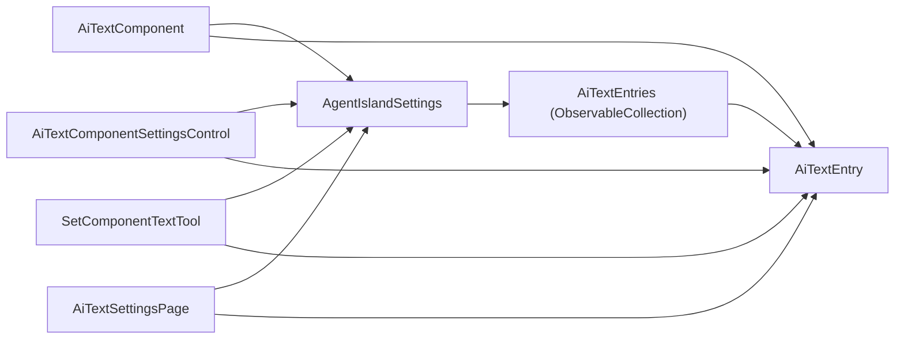

# AI Text Component Configuration

<cite>
**Referenced Files in This Document**
- [AiTextEntry.cs](file://Models/AiTextEntry.cs)
- [AgentIslandSettings.cs](file://Models/AgentIslandSettings.cs)
- [AiTextComponent.axaml.cs](file://Components/AiTextComponent.axaml.cs)
- [AiTextComponent.axaml](file://Components/AiTextComponent.axaml)
- [AiTextComponentSettingsControl.axaml.cs](file://Components/AiTextComponentSettingsControl.axaml.cs)
- [AiTextComponentSettingsControl.axaml](file://Components/AiTextComponentSettingsControl.axaml)
- [SetComponentTextTool.cs](file://Mcp/Tools/SetComponentTextTool.cs)
- [AiTextSettingsPage.axaml.cs](file://Views/SettingsPages/AiTextSettingsPage.axaml.cs)
- [AiTextSettingsPage.axaml](file://Views/SettingsPages/AiTextSettingsPage.axaml)
</cite>

## Table of Contents
1. [Introduction](#introduction)
2. [Project Structure](#project-structure)
3. [Core Components](#core-components)
4. [Architecture Overview](#architecture-overview)
5. [Detailed Component Analysis](#detailed-component-analysis)
6. [Dependency Analysis](#dependency-analysis)
7. [Performance Considerations](#performance-considerations)
8. [Troubleshooting Guide](#troubleshooting-guide)
9. [Conclusion](#conclusion)
10. [Appendices](#appendices)

## Introduction
This document explains how to configure and use the AI text component system. It focuses on the AiTextEntries ObservableCollection, the AiTextEntry data model, UI binding, real-time updates via property change notifications, collection change handling, and lifecycle management. It also provides examples for creating different types of entries, configuring display formats, managing entry lifecycles, and offers performance guidance for large collections.

## Project Structure
The AI text feature spans models, components, settings UI, and an MCP tool that updates content at runtime.

**Diagram sources**
- [AiTextEntry.cs:1-31](file://Models/AiTextEntry.cs#L1-L31)
- [AgentIslandSettings.cs:104-122](file://Models/AgentIslandSettings.cs#L104-L122)
- [AiTextComponent.axaml.cs:1-85](file://Components/AiTextComponent.axaml.cs#L1-L85)
- [AiTextComponentSettingsControl.axaml.cs:1-53](file://Components/AiTextComponentSettingsControl.axaml.cs#L1-L53)
- [AiTextSettingsPage.axaml.cs:1-36](file://Views/SettingsPages/AiTextSettingsPage.axaml.cs#L1-L36)
- [SetComponentTextTool.cs:1-92](file://Mcp/Tools/SetComponentTextTool.cs#L1-L92)

**Section sources**
- [AiTextEntry.cs:1-31](file://Models/AiTextEntry.cs#L1-L31)
- [AgentIslandSettings.cs:104-122](file://Models/AgentIslandSettings.cs#L104-L122)
- [AiTextComponent.axaml.cs:1-85](file://Components/AiTextComponent.axaml.cs#L1-L85)
- [AiTextComponentSettingsControl.axaml.cs:1-53](file://Components/AiTextComponentSettingsControl.axaml.cs#L1-L53)
- [AiTextSettingsPage.axaml.cs:1-36](file://Views/SettingsPages/AiTextSettingsPage.axaml.cs#L1-L36)
- [SetComponentTextTool.cs:1-92](file://Mcp/Tools/SetComponentTextTool.cs#L1-L92)

## Core Components
- AiTextEntry: Observable model with Id, Description, Text, DisplayName, HasNoDescription. Property changes notify derived properties.
- AgentIslandSettings.AiTextEntries: ObservableCollection<AiTextEntry> with hooks to propagate collection and item changes.
- AiTextComponent: Displays ResolvedText and PlaceholderText based on selected EntryId; subscribes to collection and item changes.
- AiTextComponentSettingsControl: Settings UI to select a bound entry and set placeholder text.
- SetComponentTextTool: MCP tool to update or create entries by ID from external agents.
- AiTextSettingsPage: UI to add/delete entries and edit their properties.

Key responsibilities:
- Data model observability and derived properties
- Collection change propagation
- UI binding and real-time updates
- External content updates via MCP

**Section sources**
- [AiTextEntry.cs:1-31](file://Models/AiTextEntry.cs#L1-L31)
- [AgentIslandSettings.cs:340-392](file://Models/AgentIslandSettings.cs#L340-L392)
- [AiTextComponent.axaml.cs:1-85](file://Components/AiTextComponent.axaml.cs#L1-L85)
- [AiTextComponentSettingsControl.axaml.cs:1-53](file://Components/AiTextComponentSettingsControl.axaml.cs#L1-L53)
- [SetComponentTextTool.cs:1-92](file://Mcp/Tools/SetComponentTextTool.cs#L1-L92)
- [AiTextSettingsPage.axaml.cs:1-36](file://Views/SettingsPages/AiTextSettingsPage.axaml.cs#L1-L36)

## Architecture Overview
The system uses MVVM-style bindings and observable collections to keep UI in sync with data. The component resolves its displayed text by matching the configured EntryId to an entry in the global collection.

**Diagram sources**
- [AiTextSettingsPage.axaml.cs:22-34](file://Views/SettingsPages/AiTextSettingsPage.axaml.cs#L22-L34)
- [AgentIslandSettings.cs:340-392](file://Models/AgentIslandSettings.cs#L340-L392)
- [AiTextComponent.axaml.cs:36-83](file://Components/AiTextComponent.axaml.cs#L36-L83)

## Detailed Component Analysis

### Data Model: AiTextEntry
- Properties:
  - Id: Unique identifier used for selection and updates.
  - Description: Optional human-readable label.
  - Text: Dynamic content updated by AI/MCP.
- Derived properties:
  - DisplayName: Uses Description if present; otherwise falls back to Id.
  - HasNoDescription: Boolean helper for UI visibility logic.
- Notifications:
  - OnIdChanged and OnDescriptionChanged raise OnPropertyChanged for DisplayName and HasNoDescription.

**Diagram sources**
- [AiTextEntry.cs:5-30](file://Models/AiTextEntry.cs#L5-L30)

**Section sources**
- [AiTextEntry.cs:1-31](file://Models/AiTextEntry.cs#L1-L31)

### Collection Management: AgentIslandSettings.AiTextEntries
- Exposes an ObservableCollection<AiTextEntry>.
- Hooks into collection and item events to re-raise property changes for consumers.
- Ensures proper unhooking when the collection is replaced.

**Diagram sources**
- [AgentIslandSettings.cs:340-392](file://Models/AgentIslandSettings.cs#L340-L392)

**Section sources**
- [AgentIslandSettings.cs:104-122](file://Models/AgentIslandSettings.cs#L104-L122)
- [AgentIslandSettings.cs:340-392](file://Models/AgentIslandSettings.cs#L340-L392)

### Display Component: AiTextComponent
- Avalonia component exposing ResolvedText and PlaceholderText.
- Subscribes to:
  - Global collection changes.
  - Individual entry property changes.
  - Settings property changes (EntryId, PlaceholderText).
- UpdateText():
  - Finds the entry by EntryId.
  - Sets ResolvedText to entry.Text if non-empty; otherwise empty.
  - Sets PlaceholderText from settings.
  - Toggles placeholder visibility based on content presence.

**Diagram sources**
- [AiTextComponent.axaml.cs:36-83](file://Components/AiTextComponent.axaml.cs#L36-L83)
- [AiTextComponent.axaml:10-18](file://Components/AiTextComponent.axaml#L10-L18)

**Section sources**
- [AiTextComponent.axaml.cs:1-85](file://Components/AiTextComponent.axaml.cs#L1-L85)
- [AiTextComponent.axaml:1-20](file://Components/AiTextComponent.axaml#L1-L20)

### Settings Control: AiTextComponentSettingsControl
- Binds a ComboBox to the global AiTextEntries.
- Syncs selected item with Settings.EntryId.
- Updates placeholder text via Settings.PlaceholderText.

**Diagram sources**
- [AiTextComponentSettingsControl.axaml.cs:16-51](file://Components/AiTextComponentSettingsControl.axaml.cs#L16-L51)
- [AiTextComponentSettingsControl.axaml:11-27](file://Components/AiTextComponentSettingsControl.axaml#L11-L27)

**Section sources**
- [AiTextComponentSettingsControl.axaml.cs:1-53](file://Components/AiTextComponentSettingsControl.axaml.cs#L1-L53)
- [AiTextComponentSettingsControl.axaml:1-32](file://Components/AiTextComponentSettingsControl.axaml#L1-L32)

### MCP Integration: SetComponentTextTool
- Accepts id and text parameters.
- If an entry with the given id exists, updates its Text.
- Otherwise, creates a new AiTextEntry with the provided id and text.
- Runs on the UI thread to safely modify the collection.

**Diagram sources**
- [SetComponentTextTool.cs:41-72](file://Mcp/Tools/SetComponentTextTool.cs#L41-L72)

**Section sources**
- [SetComponentTextTool.cs:1-92](file://Mcp/Tools/SetComponentTextTool.cs#L1-L92)

### Entry Manager UI: AiTextSettingsPage
- Provides Add and Delete operations for entries.
- Binds to the global collection and exposes editable fields for Id, Description, and Text.

**Diagram sources**
- [AiTextSettingsPage.axaml.cs:22-34](file://Views/SettingsPages/AiTextSettingsPage.axaml.cs#L22-L34)
- [AiTextSettingsPage.axaml:25-70](file://Views/SettingsPages/AiTextSettingsPage.axaml#L25-L70)

**Section sources**
- [AiTextSettingsPage.axaml.cs:1-36](file://Views/SettingsPages/AiTextSettingsPage.axaml.cs#L1-L36)
- [AiTextSettingsPage.axaml:1-81](file://Views/SettingsPages/AiTextSettingsPage.axaml#L1-L81)

## Dependency Analysis
- AiTextComponent depends on:
  - Plugin.Settings.AiTextEntries (collection)
  - Settings.EntryId and Settings.PlaceholderText
- AiTextComponentSettingsControl depends on:
  - Plugin.Settings.AiTextEntries
  - Settings.EntryId and Settings.PlaceholderText
- SetComponentTextTool depends on:
  - Plugin.Settings.AiTextEntries
  - UiThreadHelper for UI-thread access
- AiTextSettingsPage depends on:
  - Plugin.Settings.AiTextEntries

**Diagram sources**
- [AgentIslandSettings.cs:104-122](file://Models/AgentIslandSettings.cs#L104-L122)
- [AiTextComponent.axaml.cs:36-83](file://Components/AiTextComponent.axaml.cs#L36-L83)
- [AiTextComponentSettingsControl.axaml.cs:16-51](file://Components/AiTextComponentSettingsControl.axaml.cs#L16-L51)
- [SetComponentTextTool.cs:56-63](file://Mcp/Tools/SetComponentTextTool.cs#L56-L63)
- [AiTextSettingsPage.axaml.cs:22-34](file://Views/SettingsPages/AiTextSettingsPage.axaml.cs#L22-L34)

**Section sources**
- [AgentIslandSettings.cs:104-122](file://Models/AgentIslandSettings.cs#L104-L122)
- [AiTextComponent.axaml.cs:36-83](file://Components/AiTextComponent.axaml.cs#L36-L83)
- [AiTextComponentSettingsControl.axaml.cs:16-51](file://Components/AiTextComponentSettingsControl.axaml.cs#L16-L51)
- [SetComponentTextTool.cs:56-63](file://Mcp/Tools/SetComponentTextTool.cs#L56-L63)
- [AiTextSettingsPage.axaml.cs:22-34](file://Views/SettingsPages/AiTextSettingsPage.axaml.cs#L22-L34)

## Performance Considerations
- Large collections:
  - Each entry adds two event subscriptions (collection and item). For very large lists, consider virtualizing the settings UI and avoiding heavy per-item computations.
  - Avoid frequent bulk mutations; batch updates where possible to reduce notification storms.
- Binding efficiency:
  - Use DisplayName and HasNoDescription to minimize conditional logic in XAML.
  - Keep placeholder text short and avoid complex formatting in ResolvedText.
- UI thread safety:
  - All modifications to the collection occur on the UI thread via UiThreadHelper to prevent cross-thread exceptions.
- Memory leaks:
  - Ensure all event handlers are unsubscribed on Unloaded to prevent memory leaks.

[No sources needed since this section provides general guidance]

## Troubleshooting Guide
- No text displayed:
  - Verify that Settings.EntryId matches an existing entry’s Id.
  - Confirm that the entry’s Text is not empty; otherwise, placeholder should be visible.
- Placeholder not updating:
  - Ensure Settings.PlaceholderText is set and the component has loaded so it can subscribe to settings changes.
- Changes not reflected:
  - Confirm that the MCP tool call succeeded and that the entry was created or updated.
  - Check logs for errors in the MCP tool and ensure the UI thread is available.
- Selection mismatch in settings control:
  - Re-check SyncSelection logic and ensure EntryId is persisted correctly after selection changes.

**Section sources**
- [AiTextComponent.axaml.cs:73-83](file://Components/AiTextComponent.axaml.cs#L73-L83)
- [SetComponentTextTool.cs:41-72](file://Mcp/Tools/SetComponentTextTool.cs#L41-L72)
- [AiTextComponentSettingsControl.axaml.cs:35-51](file://Components/AiTextComponentSettingsControl.axaml.cs#L35-L51)

## Conclusion
The AI text component system leverages observable models and collections to provide real-time, reactive UI updates. Entries are centrally managed, easily created and edited through the settings page, and dynamically updated via the MCP tool. Proper subscription/unsubscription and careful handling of large collections ensure robust performance and stability.

[No sources needed since this section summarizes without analyzing specific files]

## Appendices

### Examples and Best Practices

- Creating entries:
  - Use the settings page to add entries with unique Ids and optional descriptions.
  - Example path: [AiTextSettingsPage.axaml.cs:22-28](file://Views/SettingsPages/AiTextSettingsPage.axaml.cs#L22-L28)

- Configuring display format:
  - Use Description for friendly labels; DisplayName will fall back to Id if Description is empty.
  - Configure PlaceholderText in the component settings control.
  - Example paths:
    - [AiTextEntry.cs:16-18](file://Models/AiTextEntry.cs#L16-L18)
    - [AiTextComponentSettingsControl.axaml.cs:44-51](file://Components/AiTextComponentSettingsControl.axaml.cs#L44-L51)

- Managing entry lifecycle:
  - Add entries via the settings page.
  - Delete entries using the delete button in the settings page.
  - Update content via the MCP tool by specifying id and text.
  - Example paths:
    - [AiTextSettingsPage.axaml.cs:30-34](file://Views/SettingsPages/AiTextSettingsPage.axaml.cs#L30-L34)
    - [SetComponentTextTool.cs:56-63](file://Mcp/Tools/SetComponentTextTool.cs#L56-L63)

- Organizing text content:
  - Group related entries by naming conventions for Ids and descriptive labels.
  - Keep descriptions concise for better readability in the settings UI.
  - Avoid excessive nested formatting in Text to maintain rendering performance.

[No sources needed since this section aggregates previously analyzed information]