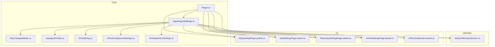
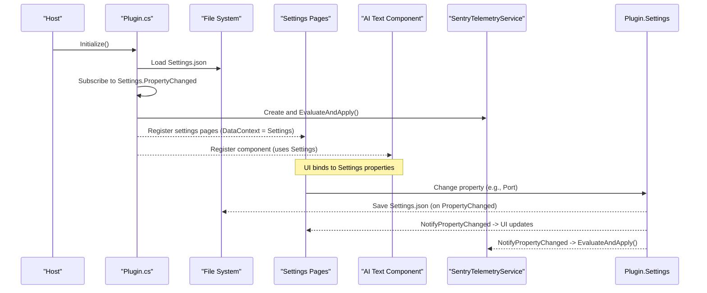
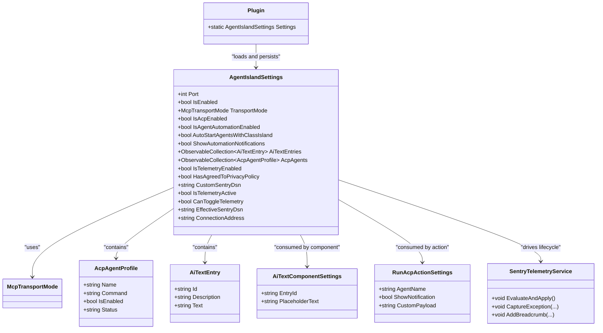

# Configuration Management

<cite>
**Referenced Files in This Document**
- [Plugin.cs](file://Plugin.cs)
- [AgentIslandSettings.cs](file://Models/AgentIslandSettings.cs)
- [McpTransportMode.cs](file://Models/McpTransportMode.cs)
- [AcpAgentProfile.cs](file://Models/AcpAgentProfile.cs)
- [AiTextEntry.cs](file://Models/AiTextEntry.cs)
- [AiTextComponentSettings.cs](file://Models/AiTextComponentSettings.cs)
- [RunAcpActionSettings.cs](file://Models/RunAcpActionSettings.cs)
- [SentryTelemetryService.cs](file://Services/SentryTelemetryService.cs)
- [McpSettingsPage.axaml.cs](file://Views/SettingsPages/McpSettingsPage.axaml.cs)
- [AcpSettingsPage.axaml.cs](file://Views/SettingsPages/AcpSettingsPage.axaml.cs)
- [AiTextSettingsPage.axaml.cs](file://Views/SettingsPages/AiTextSettingsPage.axaml.cs)
- [TelemetrySettingsPage.axaml.cs](file://Views/SettingsPages/TelemetrySettingsPage.axaml.cs)
- [AiTextComponent.axaml.cs](file://Components/AiTextComponent.axaml.cs)
</cite>

## Table of Contents
1. Introduction
2. Project Structure
3. Core Components
4. Architecture Overview
5. Detailed Component Analysis
6. Dependency Analysis
7. Performance Considerations
8. Troubleshooting Guide
9. Conclusion

## Introduction
This document explains AgentIsland’s configuration management system, including:
- The JSON configuration file format and default values
- Reactive persistence and real-time UI updates
- MCP server settings (transport modes, port, enable/disable)
- ACP agent profiles and automation actions
- AI text component configuration and display behavior
- Telemetry controls, privacy policy consent, and security considerations

The goal is to help you configure the plugin effectively, understand how changes are persisted and reflected in the UI, and apply best practices for privacy and security.

## Project Structure
Configuration spans models, services, views, and components:
- Models define settings structures and JSON serialization attributes
- Services implement telemetry lifecycle based on settings
- Views expose settings pages bound to the reactive settings object
- Components react to settings changes to update UI

**Diagram sources**
- [Plugin.cs](file://Plugin.cs)
- [AgentIslandSettings.cs](file://Models/AgentIslandSettings.cs)
- [McpTransportMode.cs](file://Models/McpTransportMode.cs)
- [AcpAgentProfile.cs](file://Models/AcpAgentProfile.cs)
- [AiTextEntry.cs](file://Models/AiTextEntry.cs)
- [AiTextComponentSettings.cs](file://Models/AiTextComponentSettings.cs)
- [RunAcpActionSettings.cs](file://Models/RunAcpActionSettings.cs)
- [SentryTelemetryService.cs](file://Services/SentryTelemetryService.cs)
- [McpSettingsPage.axaml.cs](file://Views/SettingsPages/McpSettingsPage.axaml.cs)
- [AcpSettingsPage.axaml.cs](file://Views/SettingsPages/AcpSettingsPage.axaml.cs)
- [AiTextSettingsPage.axaml.cs](file://Views/SettingsPages/AiTextSettingsPage.axaml.cs)
- [TelemetrySettingsPage.axaml.cs](file://Views/SettingsPages/TelemetrySettingsPage.axaml.cs)
- [AiTextComponent.axaml.cs](file://Components/AiTextComponent.axaml.cs)

**Section sources**
- [Plugin.cs](file://Plugin.cs)
- [AgentIslandSettings.cs](file://Models/AgentIslandSettings.cs)

## Core Components
- AgentIslandSettings: Central settings object with reactive properties, derived state, and collection change tracking. It persists changes automatically and exposes computed values such as connection address and telemetry status.
- McpTransportMode: Enumerates supported transport modes for the MCP server.
- AcpAgentProfile: Represents an ACP agent entry with name, command, enabled flag, and status.
- AiTextEntry: Defines a text item used by the AI text component.
- AiTextComponentSettings: Per-instance settings for the AI text component (e.g., entry ID and placeholder).
- RunAcpActionSettings: Settings for the “Run ACP” automation action.
- SentryTelemetryService: Manages telemetry SDK lifecycle based on settings; reacts to privacy and DSN changes.

Key behaviors:
- Reactive persistence: Any property change triggers automatic save to Settings.json.
- Derived properties: ConnectionAddress, telemetry active flags, and agent summaries update automatically.
- Collection reactivity: Adding/removing agents or AI text entries updates UI and derived counts.

**Section sources**
- [AgentIslandSettings.cs](file://Models/AgentIslandSettings.cs)
- [McpTransportMode.cs](file://Models/McpTransportMode.cs)
- [AcpAgentProfile.cs](file://Models/AcpAgentProfile.cs)
- [AiTextEntry.cs](file://Models/AiTextEntry.cs)
- [AiTextComponentSettings.cs](file://Models/AiTextComponentSettings.cs)
- [RunAcpActionSettings.cs](file://Models/RunAcpActionSettings.cs)
- [SentryTelemetryService.cs](file://Services/SentryTelemetryService.cs)

## Architecture Overview
The configuration system is centered around a single settings object that is:
- Loaded from Settings.json at startup
- Bound to multiple settings pages and components
- Persisted on every change
- Used to control runtime features like MCP server start and telemetry

**Diagram sources**
- [Plugin.cs](file://Plugin.cs)
- [AgentIslandSettings.cs](file://Models/AgentIslandSettings.cs)
- [SentryTelemetryService.cs](file://Services/SentryTelemetryService.cs)
- [McpSettingsPage.axaml.cs](file://Views/SettingsPages/McpSettingsPage.axaml.cs)
- [AiTextComponent.axaml.cs](file://Components/AiTextComponent.axaml.cs)

## Detailed Component Analysis

### Settings Model and Reactive Persistence
- Central model: AgentIslandSettings
  - Properties include MCP server port, enable/disable, transport mode, ACP automation toggles, auto-start, notifications, AI text entries, ACP agents list, telemetry toggle, privacy agreement, and custom Sentry DSN.
  - Derived properties:
    - IsTelemetryActive: Enabled only when telemetry is allowed and either privacy agreed or custom DSN provided.
    - CanToggleTelemetry: Whether the user can enable telemetry (requires privacy agreement or custom DSN).
    - EffectiveSentryDsn: Chooses custom DSN if set, otherwise uses service default.
    - ConnectionAddress: Builds local URL using port and transport mode.
    - Agent summary properties: Total count, enabled count, empty-state text.
  - Collection hooks:
    - Observes AcpAgents and AiTextEntries for add/remove and per-item changes.
    - Raises derived property updates accordingly.
  - Auto-enable telemetry: When privacy is agreed or custom DSN is provided, telemetry is automatically enabled if it was disabled.

Persistence:
- On any property change, the settings object triggers a save to Settings.json via the plugin’s subscription.

Validation rules:
- No explicit validation attributes are present; defaults are applied through field initializers.
- Transport mode is constrained to the defined enum values.

Default values:
- Port: 5943
- IsEnabled: true
- TransportMode: StreamableHttp
- IsAcpEnabled: true
- IsAgentAutomationEnabled: true
- ShowAutomationNotifications: true
- IsTelemetryEnabled: true
- HasAgreedToPrivacyPolicy: false
- CustomSentryDsn: empty string
- AcpAgents and AiTextEntries: empty collections

Common scenarios:
- Set different transport modes: Switch between StreamableHttp and Sse.
- Configure multiple ACP agents: Add entries with names and commands; enable/disable individually or in bulk.
- Customize AI text display: Add entries with IDs and texts; set placeholders per component instance.

Security considerations:
- CustomSentryDsn may contain sensitive tokens; treat Settings.json as sensitive data.
- Avoid storing personal identifiers in telemetry; the telemetry service disables sending PII.

**Section sources**
- [AgentIslandSettings.cs](file://Models/AgentIslandSettings.cs)
- [Plugin.cs](file://Plugin.cs)

### MCP Server Configuration
- Key properties:
  - isEnabled: Controls whether the MCP server starts on app start.
  - port: TCP port for local server.
  - transportMode: StreamableHttp or Sse.
- Behavior:
  - On app start, if enabled, the server is started with current port and mode.
  - ConnectionAddress provides a ready-to-use local endpoint string.
- UI:
  - McpSettingsPage binds to these properties and requests restart when they change.

Operational notes:
- Changing port or transport mode requires restarting the server.
- The UI offers a copy button for the connection address.

**Section sources**
- [AgentIslandSettings.cs](file://Models/AgentIslandSettings.cs)
- [McpTransportMode.cs](file://Models/McpTransportMode.cs)
- [McpSettingsPage.axaml.cs](file://Views/SettingsPages/McpSettingsPage.axaml.cs)
- [Plugin.cs](file://Plugin.cs)

### ACP Agents Configuration
- Data model:
  - AcpAgentProfile includes name, command, isEnabled, and status.
- Collections:
  - AcpAgents is an observable collection; adding/removing items updates derived counts and UI.
- UI:
  - AcpSettingsPage supports adding, removing, enabling/disabling all agents.
- Automation:
  - RunAcpActionSettings defines parameters for running an ACP action (agent name, notification, custom payload).

Best practices:
- Use descriptive names and clear commands.
- Keep status updated by your runner logic; UI reflects current state.

**Section sources**
- [AcpAgentProfile.cs](file://Models/AcpAgentProfile.cs)
- [RunAcpActionSettings.cs](file://Models/RunAcpActionSettings.cs)
- [AcpSettingsPage.axaml.cs](file://Views/SettingsPages/AcpSettingsPage.axaml.cs)
- [AgentIslandSettings.cs](file://Models/AgentIslandSettings.cs)

### AI Text Component Configuration
- Data model:
  - AiTextEntry has id, description, and text.
  - AiTextComponentSettings holds entryId and placeholderText for a specific component instance.
- Behavior:
  - AiTextComponent subscribes to collection changes and per-entry changes.
  - Resolves text by matching entryId; shows placeholder when no content.
- UI:
  - AiTextSettingsPage allows adding/deleting entries.
  - Component settings page lets users pick an entry and customize placeholder.

Display logic:
- If the selected entry has non-empty text, show it; otherwise show placeholder.

**Section sources**
- [AiTextEntry.cs](file://Models/AiTextEntry.cs)
- [AiTextComponentSettings.cs](file://Models/AiTextComponentSettings.cs)
- [AiTextComponent.axaml.cs](file://Components/AiTextComponent.axaml.cs)
- [AiTextSettingsPage.axaml.cs](file://Views/SettingsPages/AiTextSettingsPage.axaml.cs)
- [AgentIslandSettings.cs](file://Models/AgentIslandSettings.cs)

### Telemetry and Privacy Controls
- Controls:
  - isTelemetryEnabled: Opt-in/out switch.
  - hasAgreedToPrivacyPolicy: Consent required unless using a custom DSN.
  - customSentryDsn: Optional override for telemetry endpoint.
- Logic:
  - IsTelemetryActive depends on both the toggle and consent/custom DSN.
  - CanToggleTelemetry prevents enabling telemetry without consent or custom DSN.
  - EffectiveSentryDsn selects custom DSN if set, else uses service default.
- Lifecycle:
  - SentryTelemetryService listens to settings changes and initializes/shuts down the SDK accordingly.
  - In debug builds, a test message option is available; in release builds, it appears only when using a custom DSN.
- UI:
  - TelemetrySettingsPage manages consent dialogs, banner visibility, and testing options.

Privacy and security:
- Telemetry excludes personally identifiable information.
- Users can withdraw consent at any time; telemetry stops immediately.
- Treat custom DSN as sensitive; avoid sharing Settings.json publicly.

**Section sources**
- [AgentIslandSettings.cs](file://Models/AgentIslandSettings.cs)
- [SentryTelemetryService.cs](file://Services/SentryTelemetryService.cs)
- [TelemetrySettingsPage.axaml.cs](file://Views/SettingsPages/TelemetrySettingsPage.axaml.cs)

### JSON Configuration File Format
- Location: Settings.json in the plugin configuration folder.
- Serialization:
  - Uses camelCase naming for JSON keys.
  - Each setting maps to a property with a corresponding JsonPropertyName attribute.
- Top-level fields:
  - port: integer
  - isEnabled: boolean
  - transportMode: enum value ("StreamableHttp" or "Sse")
  - isAcpEnabled: boolean
  - isAgentAutomationEnabled: boolean
  - autoStartAgentsWithClassIsland: boolean
  - showAutomationNotifications: boolean
  - aiTextEntries: array of objects with id, description, text
  - acpAgents: array of objects with name, command, isEnabled, status
  - isTelemetryEnabled: boolean
  - hasAgreedToPrivacyPolicy: boolean
  - customSentryDsn: string
- Validation:
  - Defaults are applied via property initializers.
  - TransportMode accepts only defined enum values.
  - No additional schema validation is enforced at load time.

Example structure overview:
- top-level object containing the fields listed above
- arrays for aiTextEntries and acpAgents
- nested objects within those arrays

Note: Do not paste actual JSON here; refer to the live Settings.json file generated by the application.

**Section sources**
- [AgentIslandSettings.cs](file://Models/AgentIslandSettings.cs)
- [Plugin.cs](file://Plugin.cs)

### Common Configuration Scenarios

- Set up different transport modes
  - Choose StreamableHttp or Sse via transportMode.
  - Update port if needed.
  - Restart the server after changing these settings.

- Configure multiple ACP agents
  - Add entries in ACP settings.
  - Provide a unique name and command for each.
  - Enable/disable individual agents or use bulk actions.

- Customize AI text display behavior
  - Add one or more AiTextEntry items with distinct ids.
  - For each component instance, select an entry id and set a placeholder.
  - The component shows the entry’s text when available; otherwise shows the placeholder.

- Control telemetry and privacy
  - Agree to the privacy policy to enable telemetry with the default endpoint.
  - Or provide a custom DSN to bypass consent requirement.
  - Toggle telemetry on/off; changes take effect immediately.

- Security considerations
  - Protect Settings.json; it may include a custom DSN.
  - Avoid embedding secrets in commands or payloads beyond what is necessary.
  - Review telemetry output to ensure no sensitive data is included.

[No sources needed since this section aggregates previously analyzed details]

## Dependency Analysis
The following diagram highlights key dependencies among configuration-related components:

**Diagram sources**
- [AgentIslandSettings.cs](file://Models/AgentIslandSettings.cs)
- [McpTransportMode.cs](file://Models/McpTransportMode.cs)
- [AcpAgentProfile.cs](file://Models/AcpAgentProfile.cs)
- [AiTextEntry.cs](file://Models/AiTextEntry.cs)
- [AiTextComponentSettings.cs](file://Models/AiTextComponentSettings.cs)
- [RunAcpActionSettings.cs](file://Models/RunAcpActionSettings.cs)
- [SentryTelemetryService.cs](file://Services/SentryTelemetryService.cs)
- [Plugin.cs](file://Plugin.cs)

**Section sources**
- [AgentIslandSettings.cs](file://Models/AgentIslandSettings.cs)
- [Plugin.cs](file://Plugin.cs)

## Performance Considerations
- Reactive persistence writes to disk on every property change. While convenient, frequent changes may cause many small writes. Batch changes where possible or avoid rapid toggling.
- Collection hooks propagate changes efficiently; however, large lists of agents or AI text entries will trigger more notifications. Keep lists reasonably sized.
- Telemetry initialization is lightweight but should be avoided when disabled. The service already shuts down when telemetry is inactive.

[No sources needed since this section provides general guidance]

## Troubleshooting Guide
- MCP server does not start
  - Ensure isEnabled is true.
  - Verify port availability and transport mode compatibility.
  - Check logs for errors during start/stop.

- UI does not reflect changes
  - Confirm that settings pages bind to the shared settings object.
  - Some changes (port, transport mode) require a restart request.

- Telemetry not working
  - If using default endpoint, confirm privacy consent is granted.
  - If using custom DSN, verify the value is correct and visible in the UI.
  - In debug builds, use the test message feature to validate setup.

- AI text not displayed
  - Ensure the component’s EntryId matches an existing AiTextEntry.
  - Verify the entry’s text is non-empty; otherwise, placeholder is shown.

**Section sources**
- [McpSettingsPage.axaml.cs](file://Views/SettingsPages/McpSettingsPage.axaml.cs)
- [TelemetrySettingsPage.axaml.cs](file://Views/SettingsPages/TelemetrySettingsPage.axaml.cs)
- [AiTextComponent.axaml.cs](file://Components/AiTextComponent.axaml.cs)
- [Plugin.cs](file://Plugin.cs)

## Conclusion
AgentIsland’s configuration system centers on a single reactive settings object that persists changes automatically and drives UI updates in real time. It supports flexible MCP transport modes, multiple ACP agents, customizable AI text displays, and robust telemetry controls with privacy safeguards. By understanding the settings model, JSON format, and reactive flow, you can confidently configure and operate the plugin while respecting privacy and security best practices.

[No sources needed since this section summarizes without analyzing specific files]