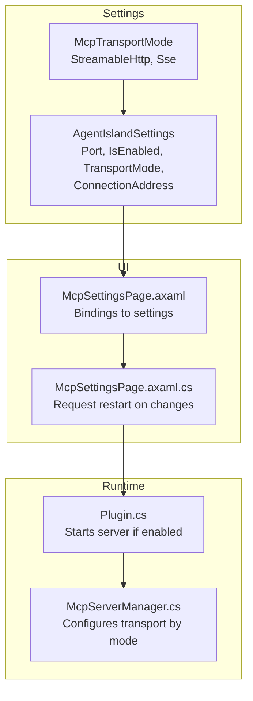
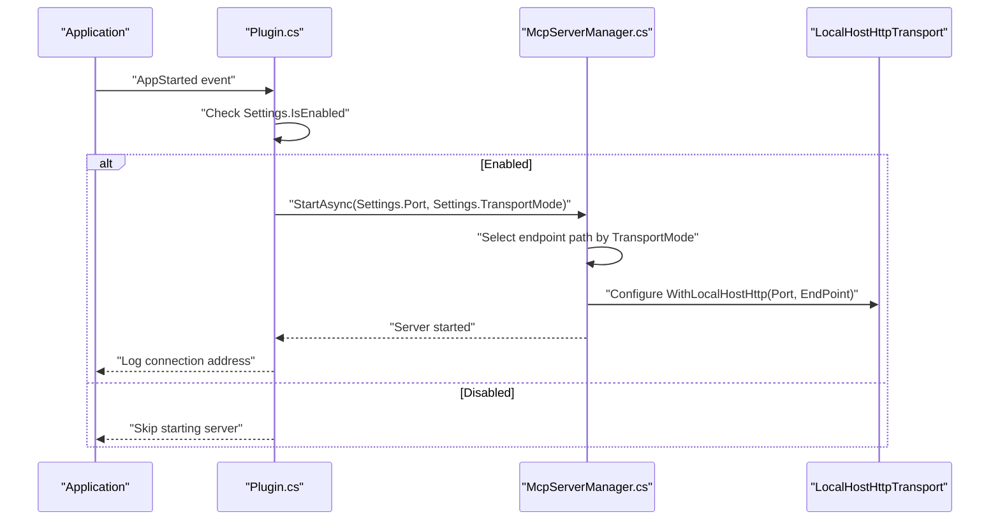
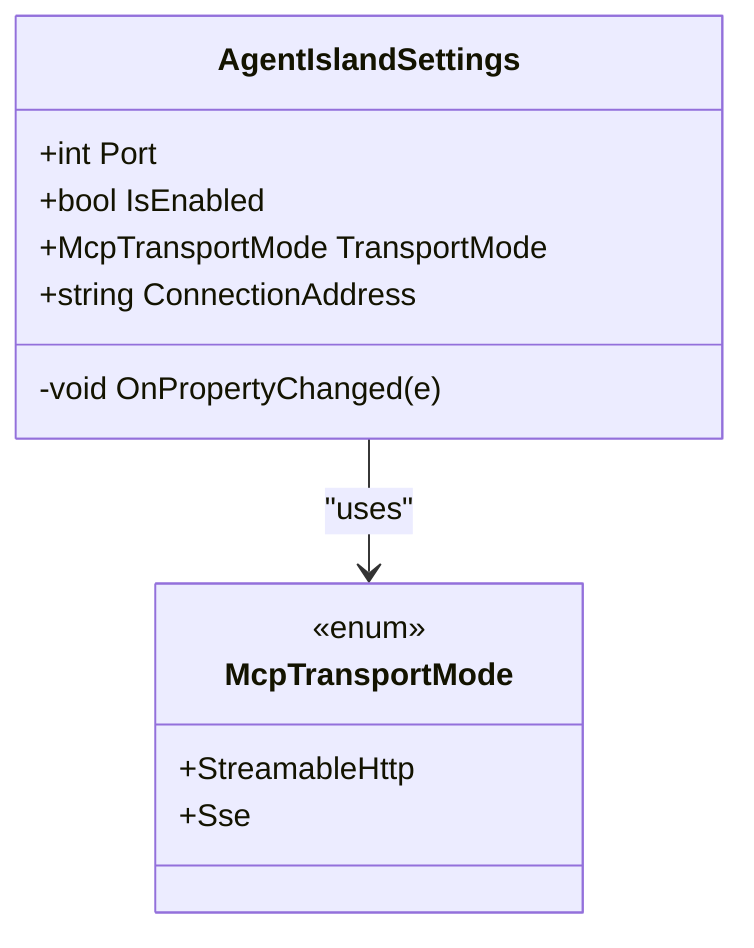
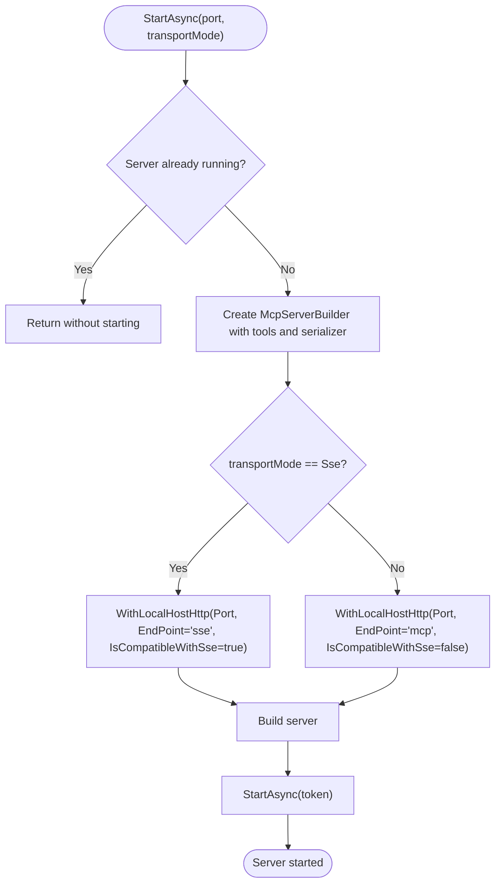
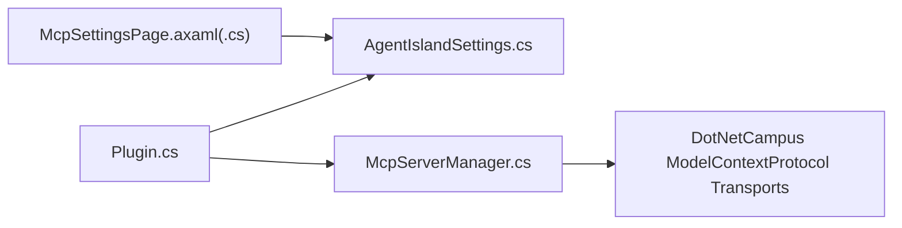

# MCP Server Configuration

<cite>
**Referenced Files in This Document**
- [Plugin.cs](file://Plugin.cs)
- [McpServerManager.cs](file://Mcp/McpServerManager.cs)
- [AgentIslandSettings.cs](file://Models/AgentIslandSettings.cs)
- [McpTransportMode.cs](file://Models/McpTransportMode.cs)
- [McpSettingsPage.axaml](file://Views/SettingsPages/McpSettingsPage.axaml)
- [McpSettingsPage.axaml.cs](file://Views/SettingsPages/McpSettingsPage.axaml.cs)
</cite>

## Table of Contents
1. [Introduction](#introduction)
2. [Project Structure](#project-structure)
3. [Core Components](#core-components)
4. [Architecture Overview](#architecture-overview)
5. [Detailed Component Analysis](#detailed-component-analysis)
6. [Dependency Analysis](#dependency-analysis)
7. [Performance Considerations](#performance-considerations)
8. [Troubleshooting Guide](#troubleshooting-guide)
9. [Conclusion](#conclusion)

## Introduction
This document explains how to configure the Model Context Protocol (MCP) server in AgentIsland, focusing on:
- Port property for customizing the listening port (default: 5943)
- IsEnabled toggle for server activation
- TransportMode selection between StreamableHttp and SSE modes
- ConnectionAddress computed property that generates the endpoint URL based on transport mode
It also includes configuration examples, security considerations for port exposure, troubleshooting guidance, and notes on client compatibility and performance characteristics.

## Project Structure
The MCP server configuration spans settings, UI, and runtime startup logic:
- Settings model defines properties and derived values
- UI page binds to these properties and requests restart when relevant settings change
- Plugin initializes and starts the server at application start
- Server manager configures the underlying HTTP transport based on selected transport mode

**Diagram sources**
- [AgentIslandSettings.cs:13-62](file://Models/AgentIslandSettings.cs#L13-L62)
- [McpTransportMode.cs:6-17](file://Models/McpTransportMode.cs#L6-L17)
- [McpSettingsPage.axaml:16-49](file://Views/SettingsPages/McpSettingsPage.axaml#L16-L49)
- [McpSettingsPage.axaml.cs:26-41](file://Views/SettingsPages/McpSettingsPage.axaml.cs#L26-L41)
- [Plugin.cs:55-79](file://Plugin.cs#L55-L79)
- [McpServerManager.cs:25-71](file://Mcp/McpServerManager.cs#L25-L71)

**Section sources**
- [AgentIslandSettings.cs:13-62](file://Models/AgentIslandSettings.cs#L13-L62)
- [McpTransportMode.cs:6-17](file://Models/McpTransportMode.cs#L6-L17)
- [McpSettingsPage.axaml:16-49](file://Views/SettingsPages/McpSettingsPage.axaml#L16-L49)
- [McpSettingsPage.axaml.cs:26-41](file://Views/SettingsPages/McpSettingsPage.axaml.cs#L26-L41)
- [Plugin.cs:55-79](file://Plugin.cs#L55-L79)
- [McpServerManager.cs:25-71](file://Mcp/McpServerManager.cs#L25-L71)

## Core Components
- Port: Configurable integer for the local HTTP listener. Default is 5943.
- IsEnabled: Boolean flag to enable or disable the MCP server at startup.
- TransportMode: Enumerated choice between StreamableHttp and SSE. The default is StreamableHttp.
- ConnectionAddress: Read-only computed property that returns the full local endpoint URL based on current Port and TransportMode.

Behavioral highlights:
- Changing IsEnabled, Port, or TransportMode triggers a request to restart the server so new settings take effect.
- ConnectionAddress updates automatically when Port or TransportMode changes.

**Section sources**
- [AgentIslandSettings.cs:15-17](file://Models/AgentIslandSettings.cs#L15-L17)
- [AgentIslandSettings.cs:37-62](file://Models/AgentIslandSettings.cs#L37-L62)
- [AgentIslandSettings.cs:203-211](file://Models/AgentIslandSettings.cs#L203-L211)
- [AgentIslandSettings.cs:243-247](file://Models/AgentIslandSettings.cs#L243-L247)
- [McpSettingsPage.axaml.cs:33-41](file://Views/SettingsPages/McpSettingsPage.axaml.cs#L33-L41)

## Architecture Overview
At application start, the plugin checks whether the MCP server is enabled. If so, it constructs and starts the server using the configured port and transport mode. The server manager selects the appropriate HTTP transport and endpoint path based on the chosen transport mode.

**Diagram sources**
- [Plugin.cs:55-79](file://Plugin.cs#L55-L79)
- [McpServerManager.cs:25-71](file://Mcp/McpServerManager.cs#L25-L71)

## Detailed Component Analysis

### Settings Model: AgentIslandSettings
Key responsibilities:
- Holds MCP server configuration: Port, IsEnabled, TransportMode
- Provides ConnectionAddress computed property that reflects current settings
- Raises property change notifications to update dependent UI and trigger restarts

Important behaviors:
- Default values: Port defaults to 5943; TransportMode defaults to StreamableHttp; IsEnabled defaults to true
- When Port or TransportMode changes, ConnectionAddress is recomputed and notified
- UI listens for changes to IsEnabled, Port, and TransportMode and requests a restart

**Diagram sources**
- [AgentIslandSettings.cs:13-62](file://Models/AgentIslandSettings.cs#L13-L62)
- [AgentIslandSettings.cs:203-211](file://Models/AgentIslandSettings.cs#L203-L211)
- [McpTransportMode.cs:6-17](file://Models/McpTransportMode.cs#L6-L17)

**Section sources**
- [AgentIslandSettings.cs:15-17](file://Models/AgentIslandSettings.cs#L15-L17)
- [AgentIslandSettings.cs:37-62](file://Models/AgentIslandSettings.cs#L37-L62)
- [AgentIslandSettings.cs:203-211](file://Models/AgentIslandSettings.cs#L203-L211)
- [AgentIslandSettings.cs:243-247](file://Models/AgentIslandSettings.cs#L243-L247)

### UI Page: McpSettingsPage
Responsibilities:
- Binds UI controls to IsEnabled, Port, and TransportMode
- Displays ConnectionAddress with a copy-to-clipboard action
- Requests a restart when relevant settings change

Notes:
- The UI shows both StreamableHttp and SSE options, but SSE is disabled in the control, indicating StreamableHttp is the active choice in this build.

**Section sources**
- [McpSettingsPage.axaml:16-49](file://Views/SettingsPages/McpSettingsPage.axaml#L16-L49)
- [McpSettingsPage.axaml.cs:26-41](file://Views/SettingsPages/McpSettingsPage.axaml.cs#L26-L41)
- [McpSettingsPage.axaml.cs:43-54](file://Views/SettingsPages/McpSettingsPage.axaml.cs#L43-L54)

### Runtime Startup: Plugin
Responsibilities:
- Loads settings from disk and persists changes
- Starts the MCP server during app startup if enabled
- Logs the effective connection address including transport mode

Startup flow:
- On AppStarted, check IsEnabled
- If enabled, create McpServerManager and call StartAsync with Port and TransportMode
- Log the resulting endpoint URL

**Section sources**
- [Plugin.cs:29-53](file://Plugin.cs#L29-L53)
- [Plugin.cs:55-79](file://Plugin.cs#L55-L79)

### Server Manager: McpServerManager
Responsibilities:
- Builds and starts the MCP server
- Selects transport configuration based on TransportMode
- Handles lifecycle (start/stop) and telemetry integration

Transport selection logic:
- For SSE mode: endpoint path is "sse", SSE compatibility enabled
- For StreamableHttp mode: endpoint path is "mcp", SSE compatibility disabled

**Diagram sources**
- [McpServerManager.cs:25-71](file://Mcp/McpServerManager.cs#L25-L71)

**Section sources**
- [McpServerManager.cs:25-82](file://Mcp/McpServerManager.cs#L25-L82)
- [McpServerManager.cs:84-112](file://Mcp/McpServerManager.cs#L84-L112)

## Dependency Analysis
High-level dependencies:
- Plugin depends on AgentIslandSettings and McpServerManager
- McpServerManager depends on DotNetCampus ModelContextProtocol transports
- UI depends on AgentIslandSettings via data binding

**Diagram sources**
- [Plugin.cs:55-79](file://Plugin.cs#L55-L79)
- [McpServerManager.cs:1-8](file://Mcp/McpServerManager.cs#L1-L8)
- [McpSettingsPage.axaml.cs:26-31](file://Views/SettingsPages/McpSettingsPage.axaml.cs#L26-L31)

**Section sources**
- [Plugin.cs:55-79](file://Plugin.cs#L55-L79)
- [McpServerManager.cs:1-8](file://Mcp/McpServerManager.cs#L1-L8)
- [McpSettingsPage.axaml.cs:26-31](file://Views/SettingsPages/McpSettingsPage.axaml.cs#L26-L31)

## Performance Considerations
- StreamableHttp vs SSE:
  - StreamableHttp is the default and recommended mode in this build. It uses a dedicated endpoint path ("mcp") and disables SSE compatibility, which can reduce overhead and simplify routing.
  - SSE mode enables SSE compatibility and uses an "sse" endpoint path. While supported, it may introduce additional streaming overhead compared to StreamableHttp.
- Localhost binding:
  - The server binds to localhost only, minimizing network exposure and reducing latency for local clients.
- Restart behavior:
  - Changes to Port, TransportMode, or IsEnabled require a restart to apply. This avoids mid-run reconfiguration costs but means users should plan configuration changes accordingly.

[No sources needed since this section provides general guidance]

## Troubleshooting Guide
Common issues and resolutions:
- Server not starting:
  - Ensure IsEnabled is true. The plugin skips starting the server if disabled.
  - Verify the selected Port is available and within valid range.
- Wrong endpoint path:
  - Confirm TransportMode matches your client expectations. StreamableHttp uses "mcp"; SSE uses "sse".
  - Use the ConnectionAddress displayed in the UI to verify the correct URL.
- Client cannot connect:
  - Confirm the client targets http://localhost:<Port>/<endpoint>.
  - Check firewall rules if exposing beyond localhost (not recommended).
- Settings changes not applied:
  - After changing IsEnabled, Port, or TransportMode, restart the application as requested by the UI.
- Logging and diagnostics:
  - Review logs for messages about server start/stop and errors. Errors are captured and logged during start and stop operations.

**Section sources**
- [Plugin.cs:55-79](file://Plugin.cs#L55-L79)
- [McpServerManager.cs:76-82](file://Mcp/McpServerManager.cs#L76-L82)
- [McpServerManager.cs:106-112](file://Mcp/McpServerManager.cs#L106-L112)
- [McpSettingsPage.axaml.cs:33-41](file://Views/SettingsPages/McpSettingsPage.axaml.cs#L33-L41)

## Conclusion
AgentIsland’s MCP server configuration centers on three key settings:
- Port (default 5943)
- IsEnabled (server activation)
- TransportMode (StreamableHttp or SSE)

The ConnectionAddress computed property reflects the current configuration and endpoint path. StreamableHttp is the recommended mode for modern clients, while SSE remains available for legacy compatibility. Always ensure the server is enabled and correctly bound to localhost, and use the provided UI to validate the connection address before connecting clients.