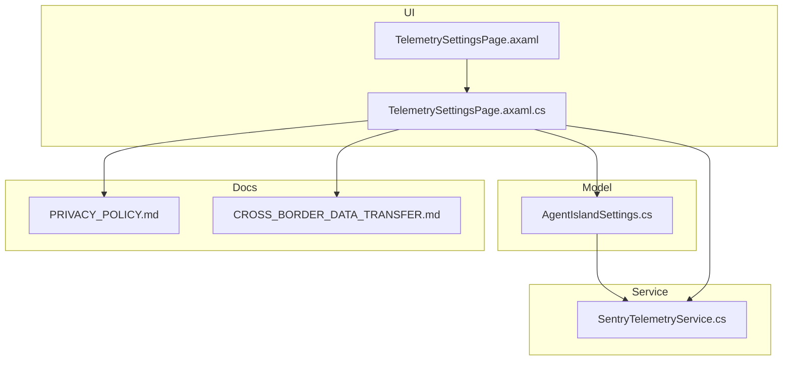
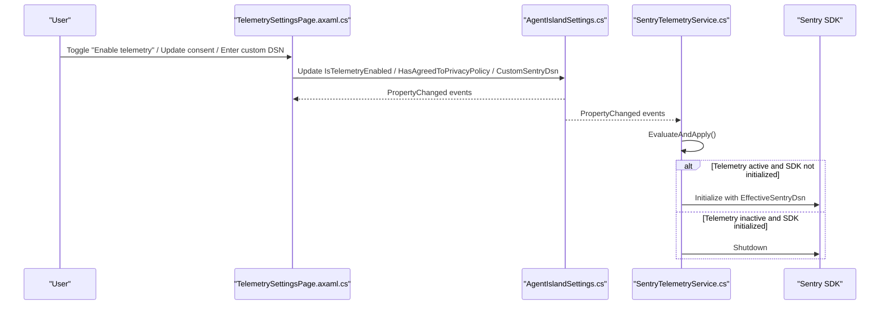
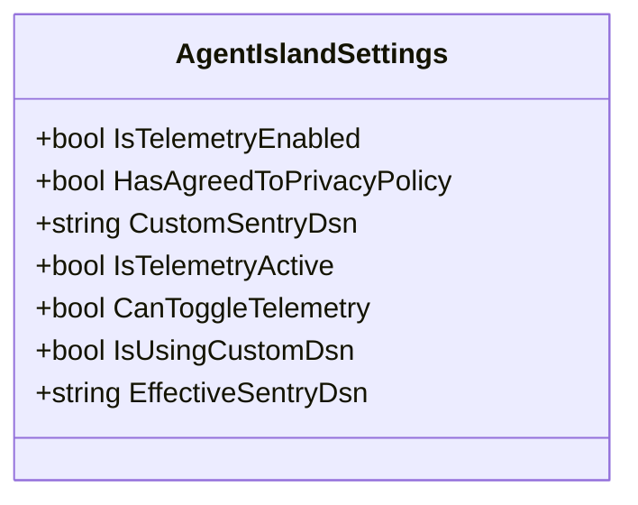
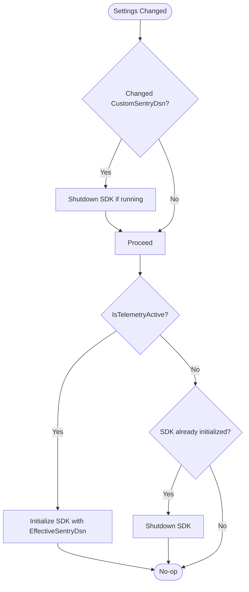
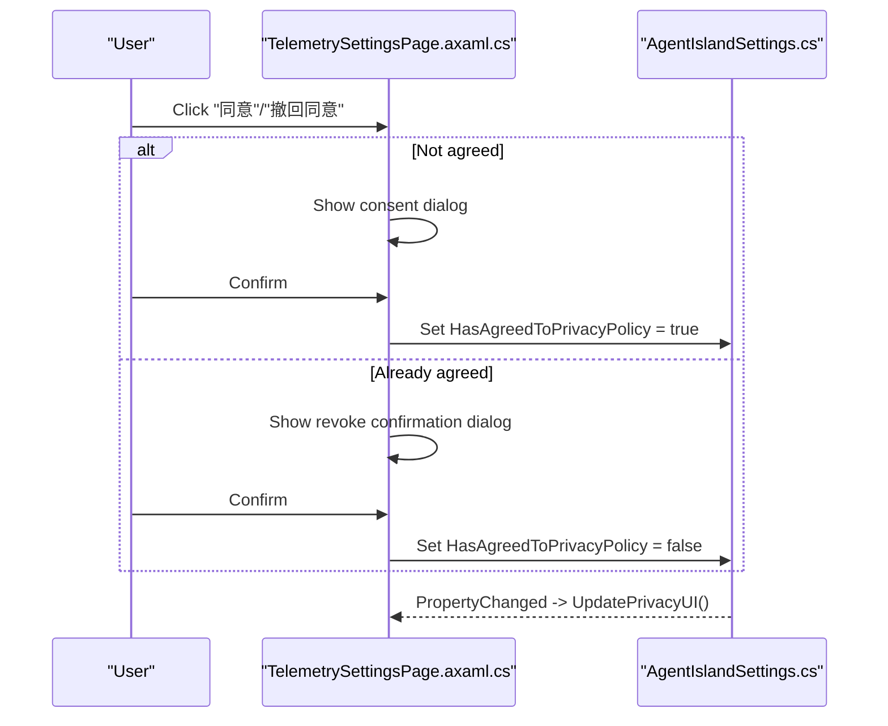
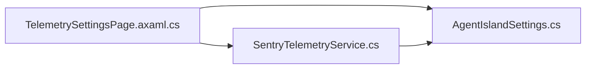

# Telemetry and Privacy Configuration

<cite>
**Referenced Files in This Document**
- [AgentIslandSettings.cs](file://Models/AgentIslandSettings.cs)
- [SentryTelemetryService.cs](file://Services/SentryTelemetryService.cs)
- [TelemetrySettingsPage.axaml.cs](file://Views/SettingsPages/TelemetrySettingsPage.axaml.cs)
- [TelemetrySettingsPage.axaml](file://Views/SettingsPages/TelemetrySettingsPage.axaml)
- [PRIVACY_POLICY.md](file://PRIVACY_POLICY.md)
- [CROSS_BORDER_DATA_TRANSFER.md](file://CROSS_BORDER_DATA_TRANSFER.md)
</cite>

## Table of Contents
1. [Introduction](#introduction)
2. [Project Structure](#project-structure)
3. [Core Components](#core-components)
4. [Architecture Overview](#architecture-overview)
5. [Detailed Component Analysis](#detailed-component-analysis)
6. [Dependency Analysis](#dependency-analysis)
7. [Performance Considerations](#performance-considerations)
8. [Troubleshooting Guide](#troubleshooting-guide)
9. [Conclusion](#conclusion)
10. [Appendices](#appendices)

## Introduction
This document explains the telemetry and privacy configuration controls implemented in the project. It focuses on:
- The IsTelemetryEnabled toggle for enabling or disabling telemetry collection.
- HasAgreedToPrivacyPolicy consent tracking to ensure compliance before using default Sentry endpoints.
- CustomSentryDsn override capability to route telemetry to a custom Sentry instance (e.g., enterprise self-hosted).
- Derived properties that control behavior: IsTelemetryActive, CanToggleTelemetry, IsUsingCustomDsn, EffectiveSentryDsn.
- The privacy policy agreement workflow, cross-border data transfer considerations, and enterprise deployment scenarios with custom Sentry instances.
- Examples of opt-in/opt-out procedures, custom DSN configuration, and compliance requirements across environments.

## Project Structure
The telemetry and privacy features are implemented across three primary areas:
- Settings model and derived logic: Models/AgentIslandSettings.cs
- Sentry SDK lifecycle and telemetry API: Services/SentryTelemetryService.cs
- User interface for consent and configuration: Views/SettingsPages/TelemetrySettingsPage.axaml and .axaml.cs
- Policy documents: PRIVACY_POLICY.md and CROSS_BORDER_DATA_TRANSFER.md

**Diagram sources**
- [TelemetrySettingsPage.axaml:1-106](file://Views/SettingsPages/TelemetrySettingsPage.axaml#L1-L106)
- [TelemetrySettingsPage.axaml.cs:1-145](file://Views/SettingsPages/TelemetrySettingsPage.axaml.cs#L1-L145)
- [AgentIslandSettings.cs:1-394](file://Models/AgentIslandSettings.cs#L1-L394)
- [SentryTelemetryService.cs:1-182](file://Services/SentryTelemetryService.cs#L1-L182)
- [PRIVACY_POLICY.md:1-145](file://PRIVACY_POLICY.md#L1-L145)
- [CROSS_BORDER_DATA_TRANSFER.md:1-141](file://CROSS_BORDER_DATA_TRANSFER.md#L1-L141)

**Section sources**
- [AgentIslandSettings.cs:148-200](file://Models/AgentIslandSettings.cs#L148-L200)
- [SentryTelemetryService.cs:11-90](file://Services/SentryTelemetryService.cs#L11-L90)
- [TelemetrySettingsPage.axaml.cs:27-73](file://Views/SettingsPages/TelemetrySettingsPage.axaml.cs#L27-L73)
- [TelemetrySettingsPage.axaml:16-52](file://Views/SettingsPages/TelemetrySettingsPage.axaml#L16-L52)
- [PRIVACY_POLICY.md:69-102](file://PRIVACY_POLICY.md#L69-L102)
- [CROSS_BORDER_DATA_TRANSFER.md:1-141](file://CROSS_BORDER_DATA_TRANSFER.md#L1-L141)

## Core Components
- AgentIslandSettings: Central settings object exposing user-facing toggles and derived state.
- SentryTelemetryService: Manages Sentry SDK initialization/shutdown based on settings and provides telemetry APIs.
- TelemetrySettingsPage: UI surface for consent, toggling telemetry, and configuring custom DSN.

Key configuration fields and derived properties:
- IsTelemetryEnabled: Opt-in toggle for telemetry.
- HasAgreedToPrivacyPolicy: Consent flag required when using default Sentry endpoint.
- CustomSentryDsn: Optional override to send telemetry to a custom Sentry instance.
- IsTelemetryActive: True only if telemetry is enabled and either consent is given or a custom DSN is configured.
- CanToggleTelemetry: Indicates whether the UI should allow enabling telemetry (requires consent or custom DSN).
- IsUsingCustomDsn: Shortcut indicating whether a custom DSN is set.
- EffectiveSentryDsn: Resolved DSN used by Sentry SDK (custom if provided, otherwise default).

Behavioral highlights:
- When consent is granted or a custom DSN is provided, the system can automatically enable telemetry if it was previously disabled.
- Changing CustomSentryDsn triggers re-initialization of Sentry SDK to apply the new endpoint.
- PII is not sent by default; traces are sampled at full rate; session tracking is disabled.

**Section sources**
- [AgentIslandSettings.cs:148-200](file://Models/AgentIslandSettings.cs#L148-L200)
- [AgentIslandSettings.cs:240-273](file://Models/AgentIslandSettings.cs#L240-L273)
- [SentryTelemetryService.cs:27-90](file://Services/SentryTelemetryService.cs#L27-L90)
- [TelemetrySettingsPage.axaml.cs:44-73](file://Views/SettingsPages/TelemetrySettingsPage.axaml.cs#L44-L73)

## Architecture Overview
The telemetry architecture follows a clear separation of concerns:
- UI layer binds to settings and updates consent and DSN values.
- Settings layer computes derived state and reacts to changes.
- Service layer initializes or shuts down Sentry SDK according to derived state.

**Diagram sources**
- [TelemetrySettingsPage.axaml.cs:27-73](file://Views/SettingsPages/TelemetrySettingsPage.axaml.cs#L27-L73)
- [AgentIslandSettings.cs:240-273](file://Models/AgentIslandSettings.cs#L240-L273)
- [SentryTelemetryService.cs:27-90](file://Services/SentryTelemetryService.cs#L27-L90)

## Detailed Component Analysis

### Settings Model: AgentIslandSettings
Responsibilities:
- Expose core configuration fields: IsTelemetryEnabled, HasAgreedToPrivacyPolicy, CustomSentryDsn.
- Compute derived properties: IsTelemetryActive, CanToggleTelemetry, IsUsingCustomDsn, EffectiveSentryDsn.
- React to property changes to keep derived state consistent and auto-enable telemetry when allowed.

Derived property logic:
- IsTelemetryActive = IsTelemetryEnabled AND (HasAgreedToPrivacyPolicy OR CustomSentryDsn is non-empty).
- CanToggleTelemetry = HasAgreedToPrivacyPolicy OR CustomSentryDsn is non-empty.
- IsUsingCustomDsn = CustomSentryDsn is non-empty.
- EffectiveSentryDsn = CustomSentryDsn if non-empty, otherwise default DSN from service.

Change propagation:
- Changes to IsTelemetryEnabled, HasAgreedToPrivacyPolicy, or CustomSentryDsn trigger recomputation of IsTelemetryActive.
- Changes to HasAgreedToPrivacyPolicy or CustomSentryDsn update CanToggleTelemetry and may auto-enable telemetry if permitted.
- Changes to CustomSentryDsn also update EffectiveSentryDsn and IsUsingCustomDsn.

**Diagram sources**
- [AgentIslandSettings.cs:148-200](file://Models/AgentIslandSettings.cs#L148-L200)

**Section sources**
- [AgentIslandSettings.cs:148-200](file://Models/AgentIslandSettings.cs#L148-L200)
- [AgentIslandSettings.cs:240-273](file://Models/AgentIslandSettings.cs#L240-L273)

### Telemetry Service: SentryTelemetryService
Responsibilities:
- Listen to settings changes and decide when to initialize or shut down Sentry SDK.
- Provide telemetry APIs: CaptureException, AddBreadcrumb, WithInstrumentation wrappers.
- Use EffectiveSentryDsn to determine target Sentry endpoint.

Lifecycle flow:
- On settings change, if CustomSentryDsn changed and SDK is initialized, shutdown first, then evaluate again.
- If IsTelemetryActive becomes true and SDK is not initialized, initialize with EffectiveSentryDsn.
- If IsTelemetryActive becomes false and SDK is initialized, shutdown.

Configuration details:
- Default DSN is defined in the service.
- PII sending is disabled; session tracking is disabled; debug mode is off; trace sampling is enabled.

**Diagram sources**
- [SentryTelemetryService.cs:27-90](file://Services/SentryTelemetryService.cs#L27-L90)

**Section sources**
- [SentryTelemetryService.cs:11-90](file://Services/SentryTelemetryService.cs#L11-L90)

### UI: TelemetrySettingsPage
Responsibilities:
- Bind to settings and reflect current state.
- Present consent dialogues for opt-in/opt-out.
- Show contextual banners for default vs custom DSN usage.
- Provide test message button (visible in Debug builds or when using custom DSN).

Consent workflow:
- If not agreed, show confirmation dialog describing collected data types and cross-border transfer implications.
- If agreed, offer revoke option with confirmation.
- When using custom DSN, consent status is marked as ignored and action button is disabled.

UI visibility rules:
- Default DSN banner visible when not using custom DSN.
- Custom DSN banner visible when using custom DSN.
- Test Sentry expander visible in Debug builds or when using custom DSN.

**Diagram sources**
- [TelemetrySettingsPage.axaml.cs:75-124](file://Views/SettingsPages/TelemetrySettingsPage.axaml.cs#L75-L124)
- [TelemetrySettingsPage.axaml.cs:44-73](file://Views/SettingsPages/TelemetrySettingsPage.axaml.cs#L44-L73)
- [AgentIslandSettings.cs:240-273](file://Models/AgentIslandSettings.cs#L240-L273)

**Section sources**
- [TelemetrySettingsPage.axaml.cs:27-73](file://Views/SettingsPages/TelemetrySettingsPage.axaml.cs#L27-L73)
- [TelemetrySettingsPage.axaml.cs:75-124](file://Views/SettingsPages/TelemetrySettingsPage.axaml.cs#L75-L124)
- [TelemetrySettingsPage.axaml:16-52](file://Views/SettingsPages/TelemetrySettingsPage.axaml#L16-L52)

## Dependency Analysis
High-level dependencies:
- TelemetrySettingsPage depends on AgentIslandSettings for binding and updates.
- SentryTelemetryService depends on AgentIslandSettings for derived state and effective DSN.
- Both UI and Service react to settings changes via property notifications.

**Diagram sources**
- [TelemetrySettingsPage.axaml.cs:27-73](file://Views/SettingsPages/TelemetrySettingsPage.axaml.cs#L27-L73)
- [SentryTelemetryService.cs:21-40](file://Services/SentryTelemetryService.cs#L21-L40)
- [AgentIslandSettings.cs:240-273](file://Models/AgentIslandSettings.cs#L240-L273)

**Section sources**
- [TelemetrySettingsPage.axaml.cs:27-73](file://Views/SettingsPages/TelemetrySettingsPage.axaml.cs#L27-L73)
- [SentryTelemetryService.cs:21-40](file://Services/SentryTelemetryService.cs#L21-L40)
- [AgentIslandSettings.cs:240-273](file://Models/AgentIslandSettings.cs#L240-L273)

## Performance Considerations
- Trace sampling is enabled at full rate; consider reducing sample rates in high-throughput environments.
- Session tracking is disabled to avoid overhead; rely on explicit breadcrumbs and transactions.
- PII is not sent by default; this reduces payload size and privacy risk.
- Re-initializing Sentry SDK on DSN changes ensures correctness but incurs brief overhead; batch DSN changes where possible.

[No sources needed since this section provides general guidance]

## Troubleshooting Guide
Common issues and resolutions:
- Telemetry not starting after granting consent:
  - Ensure CanToggleTelemetry is true and IsTelemetryEnabled is true; verify IsTelemetryActive reflects expected state.
  - Check that EffectiveSentryDsn resolves to a valid DSN (default or custom).
- Custom DSN not applied:
  - After entering a custom DSN, confirm that IsUsingCustomDsn is true and EffectiveSentryDsn matches your value.
  - Verify that Sentry SDK has been re-initialized; look for initialization breadcrumb in logs.
- Unable to toggle telemetry:
  - If CanToggleTelemetry is false, provide consent or enter a custom DSN.
- Cross-border transfer concerns:
  - Review PRIVACY_POLICY.md and CROSS_BORDER_DATA_TRANSFER.md for data flows and legal basis.
  - For enterprises, configure CustomSentryDsn to point to an internal Sentry instance to retain data residency.

**Section sources**
- [AgentIslandSettings.cs:178-200](file://Models/AgentIslandSettings.cs#L178-L200)
- [SentryTelemetryService.cs:42-90](file://Services/SentryTelemetryService.cs#L42-L90)
- [TelemetrySettingsPage.axaml.cs:44-73](file://Views/SettingsPages/TelemetrySettingsPage.axaml.cs#L44-L73)
- [PRIVACY_POLICY.md:69-102](file://PRIVACY_POLICY.md#L69-L102)
- [CROSS_BORDER_DATA_TRANSFER.md:1-141](file://CROSS_BORDER_DATA_TRANSFER.md#L1-L141)

## Conclusion
The telemetry and privacy configuration provides a robust, compliant framework:
- Users explicitly opt-in via consent when using default Sentry endpoints.
- Enterprises can deploy custom Sentry instances via CustomSentryDsn, bypassing consent checks while retaining control over data residency.
- Derived properties enforce correct behavior and simplify UI logic.
- The service layer dynamically manages Sentry SDK lifecycle based on real-time settings.

[No sources needed since this section summarizes without analyzing specific files]

## Appendices

### Opt-in/Opt-out Procedures
- Opt-in:
  - Open AgentIsland / 遥测与隐私 settings.
  - Click “同意” and confirm.
  - Enable “启用遥测数据收集”.
- Opt-out:
  - Open AgentIsland / 遥测与隐私 settings.
  - Click “撤回同意” and confirm.
  - Disable “启用遥测数据收集”.

**Section sources**
- [TelemetrySettingsPage.axaml.cs:75-124](file://Views/SettingsPages/TelemetrySettingsPage.axaml.cs#L75-L124)
- [PRIVACY_POLICY.md:69-94](file://PRIVACY_POLICY.md#L69-L94)

### Custom DSN Configuration
- Navigate to “自定义 Sentry DSN”.
- Enter a valid Sentry DSN URL.
- Observe banner indicating custom DSN usage; consent status is ignored.
- Clear the field to revert to default DSN.

**Section sources**
- [TelemetrySettingsPage.axaml:42-52](file://Views/SettingsPages/TelemetrySettingsPage.axaml#L42-L52)
- [AgentIslandSettings.cs:195-200](file://Models/AgentIslandSettings.cs#L195-L200)
- [SentryTelemetryService.cs:42-69](file://Services/SentryTelemetryService.cs#L42-L69)

### Compliance Requirements
- Default DSN usage requires explicit consent due to cross-border data transfer.
- Legal basis includes separate consent per applicable law.
- Data minimization and encryption in transit are enforced.
- Retention policies follow Sentry defaults unless adjusted by administrators.

**Section sources**
- [PRIVACY_POLICY.md:69-102](file://PRIVACY_POLICY.md#L69-L102)
- [CROSS_BORDER_DATA_TRANSFER.md:58-93](file://CROSS_BORDER_DATA_TRANSFER.md#L58-L93)