# Development Guide

<cite>
**Referenced Files in This Document**
- [AgentIsland.csproj](file://AgentIsland.csproj)
- [Plugin.cs](file://Plugin.cs)
- [build-debug.ps1](file://build-debug.ps1)
- [build-release.ps1](file://build-release.ps1)
- [create-cipx.ps1](file://create-cipx.ps1)
- [manifest.yml](file://manifest.yml)
- [McpServerManager.cs](file://Mcp/McpServerManager.cs)
- [LessonTools.cs](file://Mcp/Tools/LessonTools.cs)
- [AcpRunnerService.cs](file://Services/AcpRunnerService.cs)
- [SentryTelemetryService.cs](file://Services/SentryTelemetryService.cs)
- [AiTextComponent.axaml.cs](file://Components/AiTextComponent.axaml.cs)
- [RunAcpAction.cs](file://Automation/RunAcpAction.cs)
- [AgentIslandSettings.cs](file://Models/AgentIslandSettings.cs)
- [McpTransportMode.cs](file://Models/McpTransportMode.cs)
</cite>

## Table of Contents
1. Introduction
2. Project Structure
3. Core Components
4. Architecture Overview
5. Detailed Component Analysis
6. Dependency Analysis
7. Performance Considerations
8. Troubleshooting Guide
9. Conclusion
10. Appendices

## Introduction
This guide provides comprehensive development documentation for contributing to AgentIsland, a ClassIsland plugin that integrates AI agents and MCP (Model Context Protocol) tools into the ClassIsland desktop environment. It covers project structure, coding conventions, architectural patterns, build and packaging workflows using PowerShell scripts, guidelines for extending functionality (new MCP tools, UI components, automation actions, configuration), testing and debugging techniques, code review processes, version management, and contribution best practices.

## Project Structure
AgentIsland is organized by feature areas with clear separation of concerns:
- Plugin entrypoint and lifecycle orchestration
- MCP server management and tool registration
- Services for ACP agent execution and telemetry
- Models for settings and transport modes
- UI components and settings pages
- Automation actions
- Build and packaging scripts

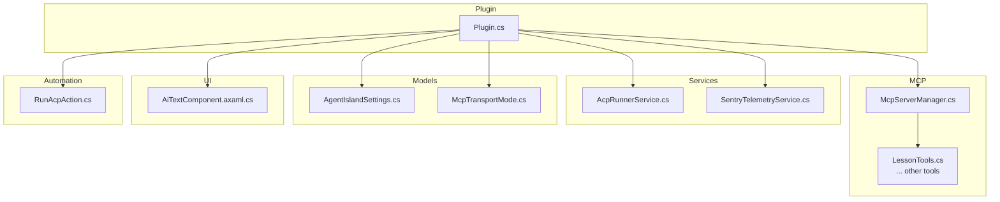

**Diagram sources**
- [Plugin.cs](file://Plugin.cs)
- [McpServerManager.cs](file://Mcp/McpServerManager.cs)
- [LessonTools.cs](file://Mcp/Tools/LessonTools.cs)
- [AcpRunnerService.cs](file://Services/AcpRunnerService.cs)
- [SentryTelemetryService.cs](file://Services/SentryTelemetryService.cs)
- [AgentIslandSettings.cs](file://Models/AgentIslandSettings.cs)
- [McpTransportMode.cs](file://Models/McpTransportMode.cs)
- [AiTextComponent.axaml.cs](file://Components/AiTextComponent.axaml.cs)
- [RunAcpAction.cs](file://Automation/RunAcpAction.cs)

**Section sources**
- [AgentIsland.csproj](file://AgentIsland.csproj)
- [Plugin.cs](file://Plugin.cs)

## Core Components
- Plugin entrypoint: Initializes settings, telemetry, services, components, settings pages, and actions; starts/stops the MCP server on app lifecycle events.
- MCP server manager: Builds and runs an MCP server with configured tools and JSON serialization context; supports Streamable HTTP and SSE transports.
- ACP runner service: Manages external ACP agent processes via stdio JSON-RPC, including initialization and prompt sending.
- Telemetry service: Wraps Sentry SDK lifecycle based on user consent and settings; provides instrumentation helpers for tools and operations.
- UI component: Displays AI-managed text entries bound to settings and updated via MCP tools.
- Automation action: Triggers ACP agent execution with guardrails and notifications.

Key responsibilities and interactions are illustrated below.

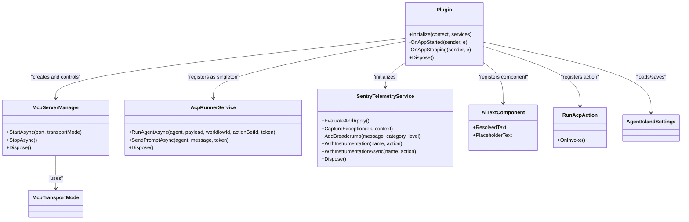

**Diagram sources**
- [Plugin.cs](file://Plugin.cs)
- [McpServerManager.cs](file://Mcp/McpServerManager.cs)
- [AcpRunnerService.cs](file://Services/AcpRunnerService.cs)
- [SentryTelemetryService.cs](file://Services/SentryTelemetryService.cs)
- [AiTextComponent.axaml.cs](file://Components/AiTextComponent.axaml.cs)
- [RunAcpAction.cs](file://Automation/RunAcpAction.cs)
- [AgentIslandSettings.cs](file://Models/AgentIslandSettings.cs)
- [McpTransportMode.cs](file://Models/McpTransportMode.cs)

**Section sources**
- [Plugin.cs](file://Plugin.cs)
- [McpServerManager.cs](file://Mcp/McpServerManager.cs)
- [AcpRunnerService.cs](file://Services/AcpRunnerService.cs)
- [SentryTelemetryService.cs](file://Services/SentryTelemetryService.cs)
- [AiTextComponent.axaml.cs](file://Components/AiTextComponent.axaml.cs)
- [RunAcpAction.cs](file://Automation/RunAcpAction.cs)
- [AgentIslandSettings.cs](file://Models/AgentIslandSettings.cs)
- [McpTransportMode.cs](file://Models/McpTransportMode.cs)

## Architecture Overview
The plugin follows a layered architecture:
- Presentation layer: Avalonia-based UI components and settings pages registered with ClassIsland.
- Application logic: MCP server orchestration, ACP agent process management, and telemetry.
- Data layer: Settings persistence and JSON serialization context.
- Integration points: ClassIsland plugin SDK, MCP server framework, and Sentry telemetry.

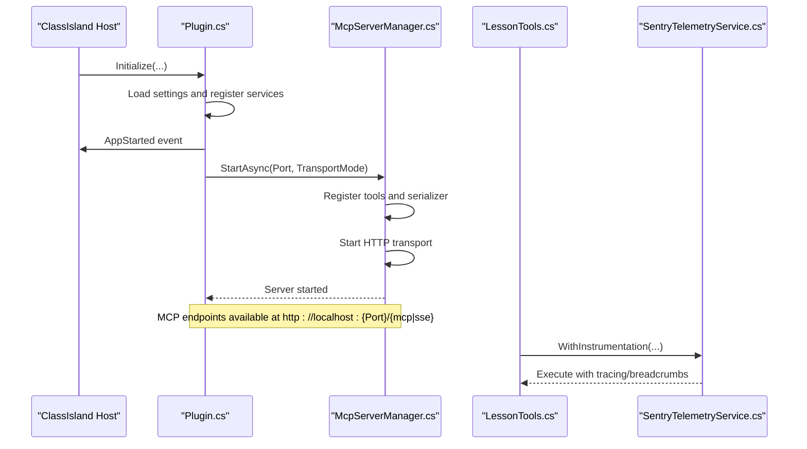

**Diagram sources**
- [Plugin.cs](file://Plugin.cs)
- [McpServerManager.cs](file://Mcp/McpServerManager.cs)
- [LessonTools.cs](file://Mcp/Tools/LessonTools.cs)
- [SentryTelemetryService.cs](file://Services/SentryTelemetryService.cs)

## Detailed Component Analysis

### Plugin Lifecycle and Registration
Responsibilities:
- Load and persist settings with change tracking.
- Initialize telemetry and apply runtime behavior based on privacy policy and DSN.
- Register services, components, settings pages, and automation actions.
- Start/stop MCP server on host lifecycle events.

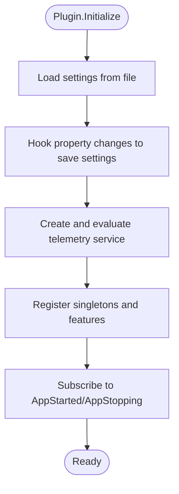

**Diagram sources**
- [Plugin.cs](file://Plugin.cs)
- [AgentIslandSettings.cs](file://Models/AgentIslandSettings.cs)
- [SentryTelemetryService.cs](file://Services/SentryTelemetryService.cs)

**Section sources**
- [Plugin.cs](file://Plugin.cs)
- [AgentIslandSettings.cs](file://Models/AgentIslandSettings.cs)

### MCP Server Management
Responsibilities:
- Build MCP server with tools and JSON serialization context.
- Configure transport mode (Streamable HTTP or SSE).
- Start/stop server with logging and telemetry transactions.

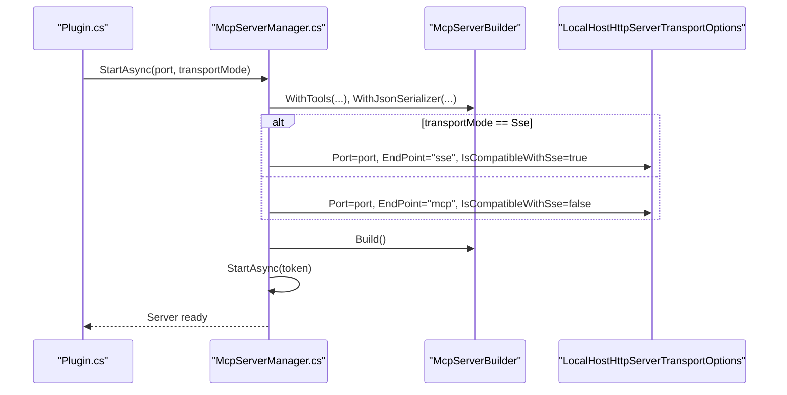

**Diagram sources**
- [McpServerManager.cs](file://Mcp/McpServerManager.cs)
- [McpTransportMode.cs](file://Models/McpTransportMode.cs)

**Section sources**
- [McpServerManager.cs](file://Mcp/McpServerManager.cs)
- [McpTransportMode.cs](file://Models/McpTransportMode.cs)

### MCP Tool Example: LessonTools
Responsibilities:
- Expose read-only MCP tools to query current/next class and time status.
- Use UiThreadHelper to safely access UI-thread-bound services.
- Wrap calls with telemetry instrumentation for tracing and breadcrumbs.

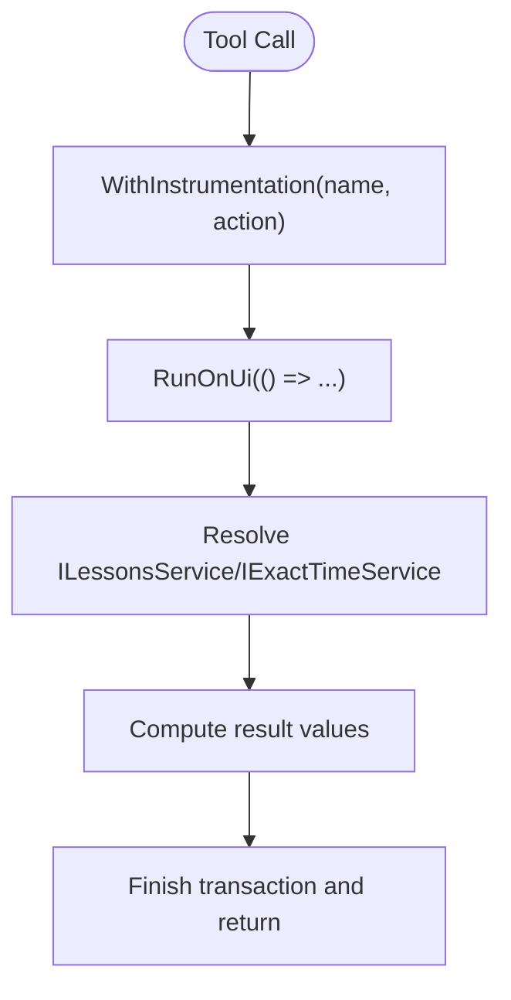

**Diagram sources**
- [LessonTools.cs](file://Mcp/Tools/LessonTools.cs)
- [SentryTelemetryService.cs](file://Services/SentryTelemetryService.cs)

**Section sources**
- [LessonTools.cs](file://Mcp/Tools/LessonTools.cs)
- [SentryTelemetryService.cs](file://Services/SentryTelemetryService.cs)

### ACP Runner Service
Responsibilities:
- Launch external ACP agent processes with stdio JSON-RPC.
- Initialize sessions and send prompts.
- Manage session lifecycle and graceful shutdown.

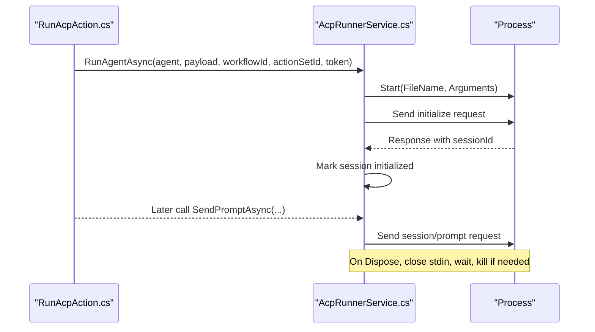

**Diagram sources**
- [RunAcpAction.cs](file://Automation/RunAcpAction.cs)
- [AcpRunnerService.cs](file://Services/AcpRunnerService.cs)

**Section sources**
- [AcpRunnerService.cs](file://Services/AcpRunnerService.cs)
- [RunAcpAction.cs](file://Automation/RunAcpAction.cs)

### Telemetry Service
Responsibilities:
- Dynamically initialize/shutdown Sentry SDK based on settings and consent.
- Provide instrumentation wrappers for synchronous and asynchronous operations.
- Add breadcrumbs and capture exceptions with contextual tags.

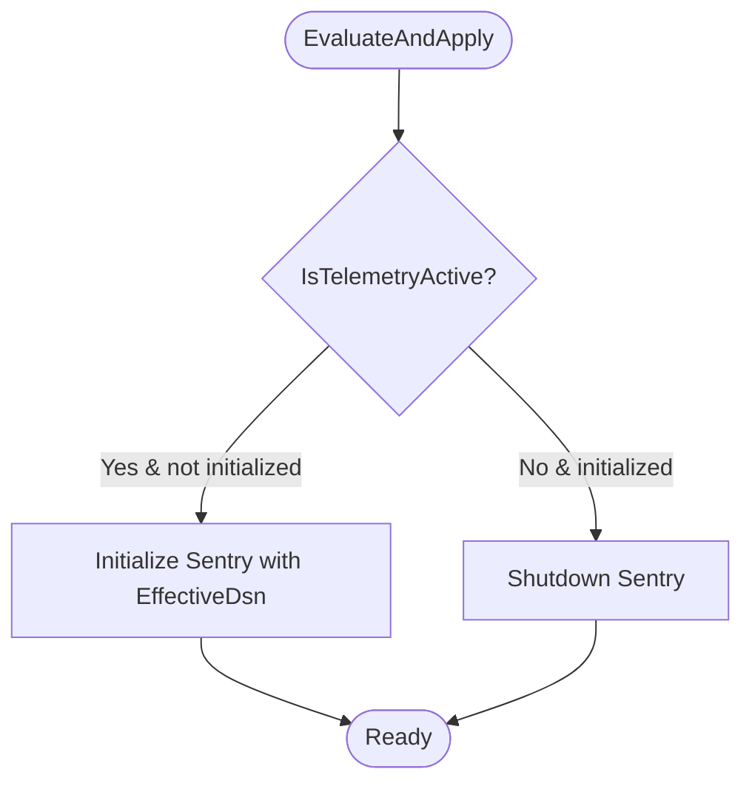

**Diagram sources**
- [SentryTelemetryService.cs](file://Services/SentryTelemetryService.cs)
- [AgentIslandSettings.cs](file://Models/AgentIslandSettings.cs)

**Section sources**
- [SentryTelemetryService.cs](file://Services/SentryTelemetryService.cs)
- [AgentIslandSettings.cs](file://Models/AgentIslandSettings.cs)

### UI Component: AiTextComponent
Responsibilities:
- Bind to AI text entries and settings to resolve displayed text and placeholder visibility.
- React to collection and property changes to update UI state.

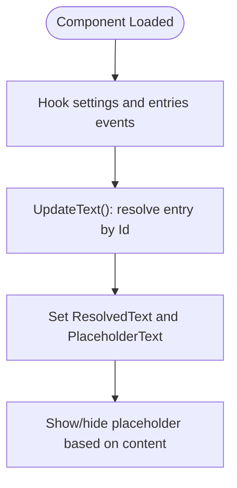

**Diagram sources**
- [AiTextComponent.axaml.cs](file://Components/AiTextComponent.axaml.cs)
- [AgentIslandSettings.cs](file://Models/AgentIslandSettings.cs)

**Section sources**
- [AiTextComponent.axaml.cs](file://Components/AiTextComponent.axaml.cs)
- [AgentIslandSettings.cs](file://Models/AgentIslandSettings.cs)

## Dependency Analysis
External dependencies and their roles:
- ClassIsland.PluginSdk: Plugin infrastructure and DI registration.
- DotNetCampus.ModelContextProtocol: MCP server builder and transports.
- AgentClientProtocol: ACP protocol support.
- Sentry: Error reporting and distributed tracing.

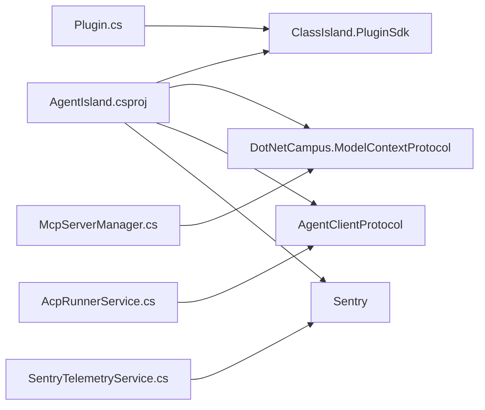

**Diagram sources**
- [AgentIsland.csproj](file://AgentIsland.csproj)
- [Plugin.cs](file://Plugin.cs)
- [McpServerManager.cs](file://Mcp/McpServerManager.cs)
- [AcpRunnerService.cs](file://Services/AcpRunnerService.cs)
- [SentryTelemetryService.cs](file://Services/SentryTelemetryService.cs)

**Section sources**
- [AgentIsland.csproj](file://AgentIsland.csproj)

## Performance Considerations
- Prefer async I/O and cancellation tokens when interacting with external processes or network endpoints.
- Avoid blocking UI thread; use UiThreadHelper for UI-bound operations.
- Keep MCP tool methods lightweight; offload heavy work to background tasks where appropriate.
- Use structured logging and telemetry sparingly to reduce overhead while retaining observability.
- Reuse shared resources (e.g., JSON serialization context) to minimize allocations.

[No sources needed since this section provides general guidance]

## Troubleshooting Guide
Common issues and resolutions:
- MCP server fails to start:
  - Verify port availability and transport mode configuration.
  - Check logs for error messages and telemetry breadcrumbs.
- ACP agent does not respond:
  - Ensure command path and arguments are correct.
  - Validate JSON-RPC handshake and session initialization.
- Telemetry not active:
  - Confirm privacy policy agreement or custom DSN configuration.
  - Inspect effective DSN and telemetry flags in settings.

Operational tips:
- Use debug build script to quickly rebuild and launch ClassIsland with the plugin.
- Use release build script to validate publish artifacts and packaging.
- Create cipx package for distribution after verifying release builds.

**Section sources**
- [build-debug.ps1](file://build-debug.ps1)
- [build-release.ps1](file://build-release.ps1)
- [create-cipx.ps1](file://create-cipx.ps1)
- [Plugin.cs](file://Plugin.cs)
- [McpServerManager.cs](file://Mcp/McpServerManager.cs)
- [AcpRunnerService.cs](file://Services/AcpRunnerService.cs)
- [SentryTelemetryService.cs](file://Services/SentryTelemetryService.cs)

## Conclusion
AgentIsland integrates seamlessly with ClassIsland through a well-structured plugin architecture. The codebase emphasizes clear separation of concerns, robust lifecycle management, and strong observability. By following the provided guidelines for building, packaging, extending functionality, and maintaining quality, contributors can efficiently develop and maintain high-quality features.

[No sources needed since this section summarizes without analyzing specific files]

## Appendices

### Build System and Packaging
- Debug build:
  - Script compiles and launches ClassIsland with the debug output directory.
- Release build:
  - Script publishes in Release configuration and launches ClassIsland with the published directory.
- Package creation:
  - Script publishes in Release with a flag to create a cipx plugin package.

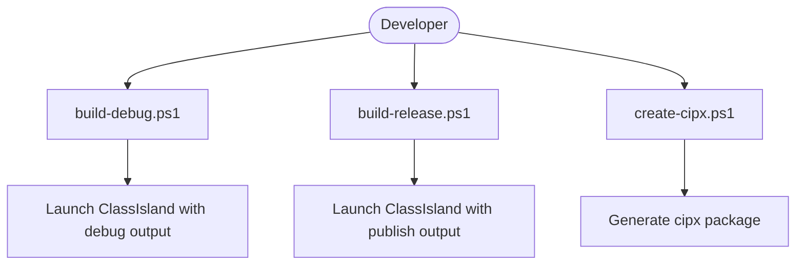

**Diagram sources**
- [build-debug.ps1](file://build-debug.ps1)
- [build-release.ps1](file://build-release.ps1)
- [create-cipx.ps1](file://create-cipx.ps1)

**Section sources**
- [build-debug.ps1](file://build-debug.ps1)
- [build-release.ps1](file://build-release.ps1)
- [create-cipx.ps1](file://create-cipx.ps1)

### Adding a New MCP Tool
Steps:
- Create a new class under Mcp/Tools.
- Decorate methods with the MCP tool attribute and define parameters/results.
- Register the tool in the MCP server builder within the server manager.
- Optionally wrap method bodies with telemetry instrumentation.

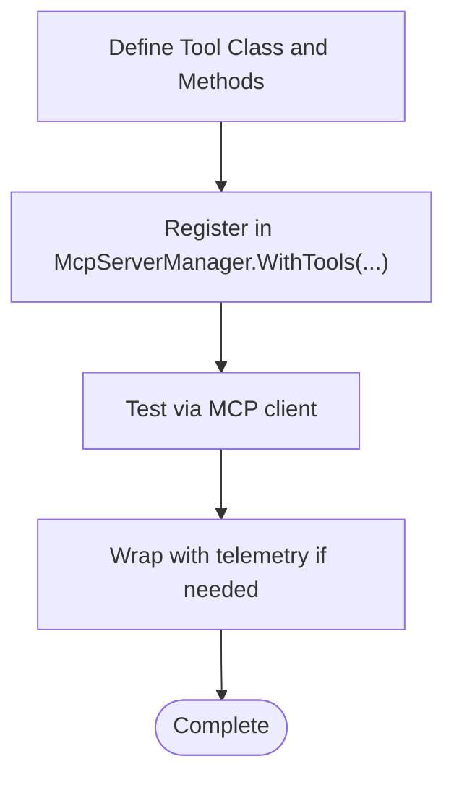

**Diagram sources**
- [LessonTools.cs](file://Mcp/Tools/LessonTools.cs)
- [McpServerManager.cs](file://Mcp/McpServerManager.cs)
- [SentryTelemetryService.cs](file://Services/SentryTelemetryService.cs)

**Section sources**
- [LessonTools.cs](file://Mcp/Tools/LessonTools.cs)
- [McpServerManager.cs](file://Mcp/McpServerManager.cs)

### Creating a Custom UI Component
Steps:
- Implement a component class inheriting from the base component type and decorate with component metadata.
- Bind properties to settings and react to changes.
- Register the component and its settings control in the plugin initializer.

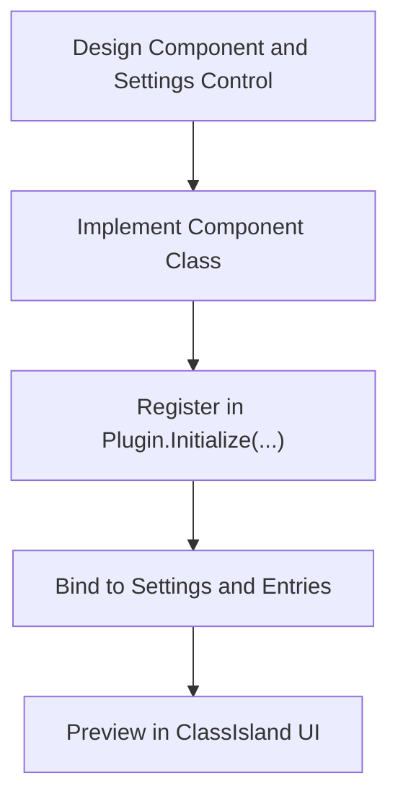

**Diagram sources**
- [AiTextComponent.axaml.cs](file://Components/AiTextComponent.axaml.cs)
- [Plugin.cs](file://Plugin.cs)

**Section sources**
- [AiTextComponent.axaml.cs](file://Components/AiTextComponent.axaml.cs)
- [Plugin.cs](file://Plugin.cs)

### Implementing a New Automation Action
Steps:
- Create an action class inheriting from the base action type and decorate with action metadata.
- Implement invocation logic with guard checks and logging.
- Register the action and its settings control in the plugin initializer.

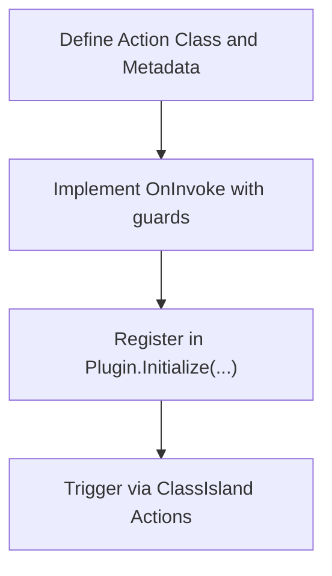

**Diagram sources**
- [RunAcpAction.cs](file://Automation/RunAcpAction.cs)
- [Plugin.cs](file://Plugin.cs)

**Section sources**
- [RunAcpAction.cs](file://Automation/RunAcpAction.cs)
- [Plugin.cs](file://Plugin.cs)

### Extending Configuration Options
Guidelines:
- Add properties to the settings model with JSON serialization attributes.
- Handle derived properties and collection change notifications.
- Persist settings automatically via property change hooks.

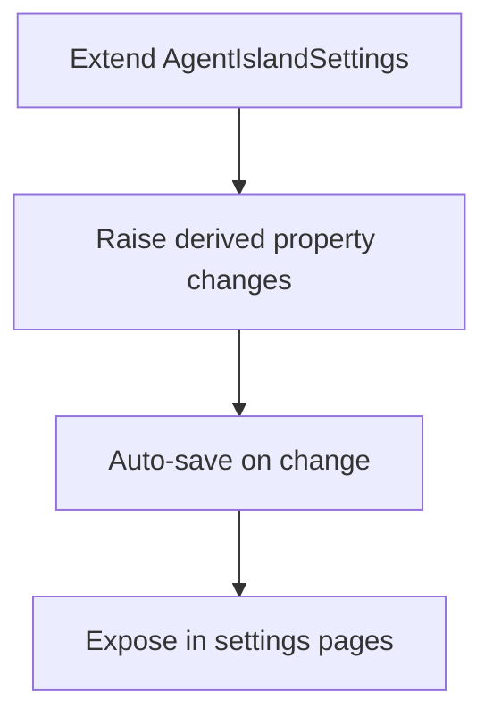

**Diagram sources**
- [AgentIslandSettings.cs](file://Models/AgentIslandSettings.cs)

**Section sources**
- [AgentIslandSettings.cs](file://Models/AgentIslandSettings.cs)

### Testing Approach
- Unit tests:
  - Focus on pure logic in tools and services; mock external dependencies like UI services and telemetry.
- Integration tests:
  - Validate MCP server startup and tool exposure with a test client.
  - Exercise ACP runner with a mock process implementing JSON-RPC.
- UI tests:
  - Use ClassIsland’s testing utilities to render components and verify bindings.

[No sources needed since this section provides general guidance]

### Debugging Techniques
- Enable detailed logging in tools and services.
- Use telemetry breadcrumbs and transactions to trace flows.
- Leverage debug build script to hot-reload during development.
- Inspect Sentry dashboard for captured exceptions and traces.

**Section sources**
- [SentryTelemetryService.cs](file://Services/SentryTelemetryService.cs)
- [build-debug.ps1](file://build-debug.ps1)

### Code Review Processes
- Ensure adherence to naming conventions and consistent use of attributes.
- Verify proper disposal and cancellation token propagation.
- Confirm telemetry instrumentation and structured logging.
- Validate settings persistence and derived property updates.

[No sources needed since this section provides general guidance]

### Version Management
- Update manifest version and API version for releases.
- Align .NET target framework and SDK versions in the project file.
- Coordinate dependency updates and validate compatibility.

**Section sources**
- [manifest.yml](file://manifest.yml)
- [AgentIsland.csproj](file://AgentIsland.csproj)

### Contribution Guidelines
- Follow repository conventions for folder organization and file naming.
- Write clear commit messages and include relevant screenshots or logs for UI changes.
- Submit pull requests with descriptions of changes, rationale, and testing steps.
- Ensure all build scripts succeed locally before submission.

[No sources needed since this section provides general guidance]

### Examples of Common Development Tasks
- Add a new MCP tool:
  - See tool definition and registration references.
- Create a custom UI component:
  - See component implementation and registration references.
- Implement a new automation action:
  - See action implementation and registration references.
- Extend configuration options:
  - See settings model extension references.

**Section sources**
- [LessonTools.cs](file://Mcp/Tools/LessonTools.cs)
- [McpServerManager.cs](file://Mcp/McpServerManager.cs)
- [AiTextComponent.axaml.cs](file://Components/AiTextComponent.axaml.cs)
- [RunAcpAction.cs](file://Automation/RunAcpAction.cs)
- [AgentIslandSettings.cs](file://Models/AgentIslandSettings.cs)