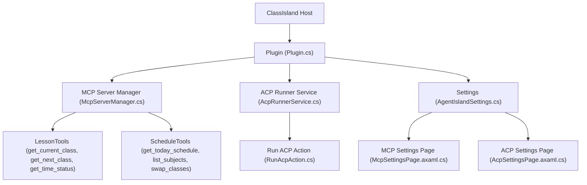

# Getting Started Guide

<cite>
**Referenced Files in This Document**
- [AgentIsland.csproj](file://AgentIsland.csproj)
- [Plugin.cs](file://Plugin.cs)
- [manifest.yml](file://manifest.yml)
- [AGENTS.md](file://AGENTS.md)
- [build-release.ps1](file://build-release.ps1)
- [Models/AgentIslandSettings.cs](file://Models/AgentIslandSettings.cs)
- [Models/McpTransportMode.cs](file://Models/McpTransportMode.cs)
- [Mcp/McpServerManager.cs](file://Mcp/McpServerManager.cs)
- [Mcp/Tools/LessonTools.cs](file://Mcp/Tools/LessonTools.cs)
- [Mcp/Tools/ScheduleTools.cs](file://Mcp/Tools/ScheduleTools.cs)
- [Services/AcpRunnerService.cs](file://Services/AcpRunnerService.cs)
- [Automation/RunAcpAction.cs](file://Automation/RunAcpAction.cs)
- [Views/SettingsPages/McpSettingsPage.axaml.cs](file://Views/SettingsPages/McpSettingsPage.axaml.cs)
- [Views/SettingsPages/AcpSettingsPage.axaml.cs](file://Views/SettingsPages/AcpSettingsPage.axaml.cs)
</cite>

## Table of Contents
1. Introduction
2. Prerequisites
3. Installation for End Users
4. Installation for Developers
5. First-Time Configuration
6. Common Usage Scenarios
7. Architecture Overview
8. Troubleshooting Guide
9. Verification Steps
10. Conclusion

## Introduction
AgentIsland is a ClassIsland plugin that exposes an MCP server to external AI agents and provides automation capabilities within ClassIsland. It integrates with ClassIsland’s timetable system, allowing AI agents to query class information, manage schedules, and interact with notifications. For developers, it also includes ACP (Agent Client Protocol) runner support to launch and communicate with external agent processes.

## Prerequisites
- .NET 8 runtime (Windows): The project targets net8.0-windows.
- ClassIsland installed: AgentIsland runs as a ClassIsland plugin.
- Development environment (optional): If you plan to build or modify the plugin, follow the ClassIsland development setup and ensure the required environment variables are configured.

Key references:
- Target framework and dependencies are defined in the project file.
- The development guide outlines prerequisites and build commands.

**Section sources**
- [AgentIsland.csproj:1-12](file://AgentIsland.csproj#L1-L12)
- [AGENTS.md:20-22](file://AGENTS.md#L20-L22)

## Installation for End Users
Follow these steps to install AgentIsland into ClassIsland:

1. Build or obtain the plugin output:
   - Use the provided scripts to publish the plugin.
   - Ensure the publish directory contains the compiled DLLs and assets.

2. Install into ClassIsland:
   - Launch ClassIsland with the plugin path argument pointing to the published folder.
   - Alternatively, use ClassIsland’s built-in packaging and installation features if available.

3. Verify the plugin loads:
   - Open ClassIsland settings and navigate to the AgentIsland sections (MCP Settings, ACP Settings).
   - Confirm that the plugin is enabled and the MCP server can start.

Notes:
- The manifest defines plugin metadata such as id, name, version, and supported platforms.
- The entry assembly is specified in the manifest.

**Section sources**
- [build-release.ps1:1-10](file://build-release.ps1#L1-L10)
- [manifest.yml:1-13](file://manifest.yml#L1-L13)

## Installation for Developers
To build and run AgentIsland during development:

1. Prepare the environment:
   - Install .NET 8 SDK/runtime.
   - Set up the ClassIsland development environment as described in the development guide.
   - Ensure the environment variable for the ClassIsland debug binary directory is set.

2. Build and launch:
   - Run the debug or release build script.
   - The script will compile the plugin and optionally launch ClassIsland with the plugin path.

3. Package for distribution (optional):
   - Use the provided script to create a .cipx package.

References:
- Development guide lists build commands and prerequisites.
- Project file shows target framework and dependencies.

**Section sources**
- [AGENTS.md:7-22](file://AGENTS.md#L7-L22)
- [AgentIsland.csproj:1-12](file://AgentIsland.csproj#L1-L12)

## First-Time Configuration
After installing AgentIsland, configure the following:

### Enable the Plugin and Configure MCP Server
- Open ClassIsland settings and go to AgentIsland / MCP Settings.
- Enable the plugin.
- Choose transport mode:
  - Streamable HTTP (default endpoint /mcp)
  - SSE (endpoint /sse)
- Set the listening port (default 5943).
- Copy the connection address when needed; the UI supports copying to clipboard.

Behavior:
- Changing IsEnabled, Port, or TransportMode triggers a restart request.
- The plugin starts the MCP server on ClassIsland startup if enabled.

**Section sources**
- [Views/SettingsPages/McpSettingsPage.axaml.cs:26-41](file://Views/SettingsPages/McpSettingsPage.axaml.cs#L26-L41)
- [Views/SettingsPages/McpSettingsPage.axaml.cs:43-54](file://Views/SettingsPages/McpSettingsPage.axaml.cs#L43-L54)
- [Plugin.cs:55-79](file://Plugin.cs#L55-L79)
- [Models/AgentIslandSettings.cs:34-62](file://Models/AgentIslandSettings.cs#L34-L62)
- [Models/McpTransportMode.cs:1-18](file://Models/McpTransportMode.cs#L1-L18)

### Create ACP Agent Profiles
- Go to AgentIsland / ACP Settings.
- Add new ACP Agent entries by providing:
  - Name
  - Command (executable path and arguments)
  - Status (read-only; updated at runtime)
- You can enable/disable all agents at once.

Behavior:
- The “Run ACP” automation action uses the selected agent profile.
- The runner validates command configuration before launching.

**Section sources**
- [Views/SettingsPages/AcpSettingsPage.axaml.cs:31-48](file://Views/SettingsPages/AcpSettingsPage.axaml.cs#L31-L48)
- [Models/AgentIslandSettings.cs:124-143](file://Models/AgentIslandSettings.cs#L124-L143)
- [Services/AcpRunnerService.cs:25-48](file://Services/AcpRunnerService.cs#L25-L48)

### Basic Settings and Telemetry
- Toggle telemetry collection and privacy agreement options.
- Optionally provide a custom Sentry DSN to bypass privacy agreement checks.
- Derived properties reflect active telemetry state and effective DSN.

**Section sources**
- [Models/AgentIslandSettings.cs:145-200](file://Models/AgentIslandSettings.cs#L145-L200)
- [Plugin.cs:29-42](file://Plugin.cs#L29-L42)

## Common Usage Scenarios
The MCP server exposes tools that external AI agents can call. Below are practical scenarios:

### Query Current Class Information
- Tool: get_current_class
- Purpose: Returns current subject, teacher, time window, remaining seconds, and whether currently in class.
- Typical flow:
  - External agent calls get_current_class via MCP.
  - Tool reads ClassIsland lessons service and returns structured result.

**Section sources**
- [Mcp/Tools/LessonTools.cs:14-45](file://Mcp/Tools/LessonTools.cs#L14-L45)

### Get Next Class Details
- Tool: get_next_class
- Purpose: Provides next class subject, teacher, scheduled times, and seconds until start.
- Typical flow:
  - External agent calls get_next_class via MCP.
  - Tool computes time difference using exact time service.

**Section sources**
- [Mcp/Tools/LessonTools.cs:47-83](file://Mcp/Tools/LessonTools.cs#L47-L83)

### Check Time Status
- Tool: get_time_status
- Purpose: Reports current state (e.g., InClass, Breaking), left time, and local time.
- Typical flow:
  - External agent calls get_time_status via MCP.
  - Tool normalizes state and returns structured data.

**Section sources**
- [Mcp/Tools/LessonTools.cs:85-113](file://Mcp/Tools/LessonTools.cs#L85-L113)

### Manage Schedules
- Tools:
  - get_today_schedule: Retrieves today’s schedule with class details.
  - list_subjects: Lists all subjects with names, teachers, and initials.
  - swap_classes: Swaps two classes on a given date by creating a temporary overlay plan.
- Typical flows:
  - Query today’s schedule or list subjects for context.
  - Swap classes by specifying indices and date; changes are persisted.

**Section sources**
- [Mcp/Tools/ScheduleTools.cs:15-39](file://Mcp/Tools/ScheduleTools.cs#L15-L39)
- [Mcp/Tools/ScheduleTools.cs:105-131](file://Mcp/Tools/ScheduleTools.cs#L105-L131)
- [Mcp/Tools/ScheduleTools.cs:58-103](file://Mcp/Tools/ScheduleTools.cs#L58-L103)

### Integrate with External AI Agents via ACP
- Use the “Run ACP” automation action to launch an external agent process.
- Configure the agent profile with a valid command.
- The runner initializes the session over stdio JSON-RPC and sends prompts.

Typical sequence:
- Trigger automation action.
- Validate settings and agent profile.
- Start process and initialize ACP session.
- Send prompt messages to the agent.

**Section sources**
- [Automation/RunAcpAction.cs:29-82](file://Automation/RunAcpAction.cs#L29-L82)
- [Services/AcpRunnerService.cs:25-77](file://Services/AcpRunnerService.cs#L25-L77)
- [Services/AcpRunnerService.cs:79-100](file://Services/AcpRunnerService.cs#L79-L100)
- [Services/AcpRunnerService.cs:102-131](file://Services/AcpRunnerService.cs#L102-L131)

## Architecture Overview
High-level components and interactions:

**Diagram sources**
- [Plugin.cs:29-79](file://Plugin.cs#L29-L79)
- [Mcp/McpServerManager.cs:25-82](file://Mcp/McpServerManager.cs#L25-L82)
- [Mcp/Tools/LessonTools.cs:14-113](file://Mcp/Tools/LessonTools.cs#L14-L113)
- [Mcp/Tools/ScheduleTools.cs:15-131](file://Mcp/Tools/ScheduleTools.cs#L15-L131)
- [Services/AcpRunnerService.cs:25-131](file://Services/AcpRunnerService.cs#L25-L131)
- [Automation/RunAcpAction.cs:29-82](file://Automation/RunAcpAction.cs#L29-L82)
- [Models/AgentIslandSettings.cs:34-62](file://Models/AgentIslandSettings.cs#L34-L62)
- [Views/SettingsPages/McpSettingsPage.axaml.cs:26-41](file://Views/SettingsPages/McpSettingsPage.axaml.cs#L26-L41)
- [Views/SettingsPages/AcpSettingsPage.axaml.cs:25-48](file://Views/SettingsPages/AcpSettingsPage.axaml.cs#L25-L48)

## Troubleshooting Guide
Common issues and resolutions:

- MCP server fails to start:
  - Check port availability and transport mode configuration.
  - Review logs for error messages captured during start.
  - Ensure the plugin is enabled and ClassIsland has started.

- Cannot connect to MCP endpoints:
  - Verify the connection address generated from settings (port and endpoint depend on transport mode).
  - Confirm firewall rules allow localhost access on the chosen port.

- ACP agent does not launch:
  - Ensure the agent profile has a valid command.
  - Confirm the “Run ACP” action is allowed by global settings (ACP enabled and agent automation enabled).
  - Check that the agent profile is enabled.

- Telemetry not working:
  - Confirm telemetry toggle and privacy agreement status.
  - If using a custom DSN, verify the value is set correctly.

- Settings changes require restart:
  - Changes to IsEnabled, Port, or TransportMode trigger a restart request; apply changes and restart ClassIsland.

**Section sources**
- [Plugin.cs:67-79](file://Plugin.cs#L67-L79)
- [Mcp/McpServerManager.cs:25-82](file://Mcp/McpServerManager.cs#L25-L82)
- [Models/AgentIslandSettings.cs:202-211](file://Models/AgentIslandSettings.cs#L202-L211)
- [Automation/RunAcpAction.cs:35-60](file://Automation/RunAcpAction.cs#L35-L60)
- [Services/AcpRunnerService.cs:35-48](file://Services/AcpRunnerService.cs#L35-L48)
- [Views/SettingsPages/McpSettingsPage.axaml.cs:33-41](file://Views/SettingsPages/McpSettingsPage.axaml.cs#L33-L41)

## Verification Steps
Perform these checks to confirm proper installation and configuration:

- Plugin loaded:
  - Open ClassIsland settings and locate AgentIsland sections.
  - Confirm the plugin is present and enabled.

- MCP server running:
  - Start ClassIsland with the plugin enabled.
  - Check logs for successful MCP server start message.
  - Access http://localhost:{Port}/mcp or http://localhost:{Port}/sse depending on transport mode.

- Tools callable:
  - From an external client, call get_current_class and get_today_schedule to verify responses.

- ACP integration:
  - Add an ACP agent profile with a valid command.
  - Trigger the “Run ACP” action and observe status updates.

**Section sources**
- [Plugin.cs:67-79](file://Plugin.cs#L67-L79)
- [Mcp/McpServerManager.cs:25-82](file://Mcp/McpServerManager.cs#L25-L82)
- [Mcp/Tools/LessonTools.cs:14-45](file://Mcp/Tools/LessonTools.cs#L14-L45)
- [Mcp/Tools/ScheduleTools.cs:15-39](file://Mcp/Tools/ScheduleTools.cs#L15-L39)
- [Automation/RunAcpAction.cs:62-82](file://Automation/RunAcpAction.cs#L62-L82)

## Conclusion
AgentIsland extends ClassIsland with powerful MCP-based integrations and ACP automation. By following the prerequisites, installation steps, and first-time configuration guidance, users can quickly expose timetable and scheduling capabilities to external AI agents. Developers can leverage the provided build scripts and architecture to extend functionality further.