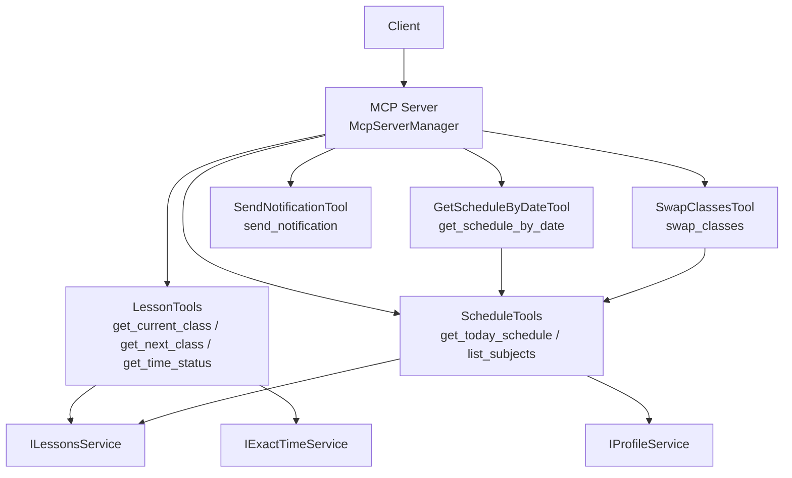
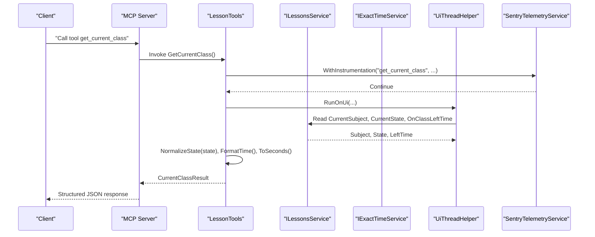
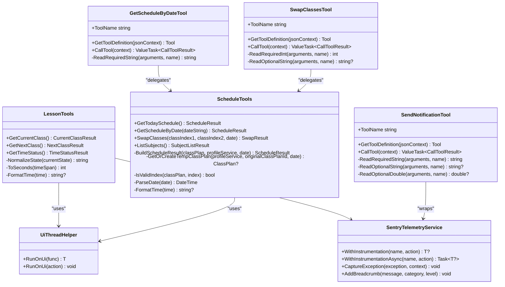

# Lesson Management Tools

<cite>
**Referenced Files in This Document**
- [LessonTools.cs](file://Mcp/Tools/LessonTools.cs)
- [ScheduleTools.cs](file://Mcp/Tools/ScheduleTools.cs)
- [GetScheduleByDateTool.cs](file://Mcp/Tools/GetScheduleByDateTool.cs)
- [SwapClassesTool.cs](file://Mcp/Tools/SwapClassesTool.cs)
- [SendNotificationTool.cs](file://Mcp/Tools/SendNotificationTool.cs)
- [ToolResults.cs](file://Models/ToolResults.cs)
- [UiThreadHelper.cs](file://Helpers/UiThreadHelper.cs)
- [SentryTelemetryService.cs](file://Services/SentryTelemetryService.cs)
- [McpServerManager.cs](file://Mcp/McpServerManager.cs)
</cite>

## Table of Contents
1. [Introduction](#introduction)
2. [Project Structure](#project-structure)
3. [Core Components](#core-components)
4. [Architecture Overview](#architecture-overview)
5. [Detailed Component Analysis](#detailed-component-analysis)
6. [Dependency Analysis](#dependency-analysis)
7. [Performance Considerations](#performance-considerations)
8. [Troubleshooting Guide](#troubleshooting-guide)
9. [Conclusion](#conclusion)

## Introduction
This document provides detailed API documentation for lesson management tools that integrate with ClassIsland’s services to expose real-time classroom information via Model Context Protocol (MCP). It focuses on three primary read-only tools:
- get_current_class
- get_next_class
- get_time_status

It explains request/response schemas, parameter validation, error handling, integration with ILessonsService and IExactTimeService, practical client usage patterns, caching strategies, performance considerations, and timeout handling.

## Project Structure
The lesson management tools are implemented as MCP server tools within the AgentIsland plugin. The key components include:
- Tool implementations for reading current and next class data and time status
- Shared result models used across tools
- UI thread marshalling helper to safely access ClassIsland services
- Telemetry service for instrumentation and error reporting
- MCP server manager that registers and exposes tools over HTTP

**Diagram sources**
- [McpServerManager.cs:41-50](file://Mcp/McpServerManager.cs#L41-L50)
- [LessonTools.cs:14-91](file://Mcp/Tools/LessonTools.cs#L14-L91)
- [ScheduleTools.cs:15-131](file://Mcp/Tools/ScheduleTools.cs#L15-L131)
- [GetScheduleByDateTool.cs:32-51](file://Mcp/Tools/GetScheduleByDateTool.cs#L32-L51)
- [SwapClassesTool.cs:42-61](file://Mcp/Tools/SwapClassesTool.cs#L42-L61)
- [SendNotificationTool.cs:47-66](file://Mcp/Tools/SendNotificationTool.cs#L47-L66)

**Section sources**
- [McpServerManager.cs:25-82](file://Mcp/McpServerManager.cs#L25-L82)
- [LessonTools.cs:12-146](file://Mcp/Tools/LessonTools.cs#L12-L146)
- [ScheduleTools.cs:13-204](file://Mcp/Tools/ScheduleTools.cs#L13-L204)
- [GetScheduleByDateTool.cs:14-92](file://Mcp/Tools/GetScheduleByDateTool.cs#L14-L92)
- [SwapClassesTool.cs:16-103](file://Mcp/Tools/SwapClassesTool.cs#L16-L103)
- [SendNotificationTool.cs:16-137](file://Mcp/Tools/SendNotificationTool.cs#L16-L137)
- [ToolResults.cs:1-59](file://Models/ToolResults.cs#L1-L59)
- [UiThreadHelper.cs:5-25](file://Helpers/UiThreadHelper.cs#L5-L25)
- [SentryTelemetryService.cs:11-182](file://Services/SentryTelemetryService.cs#L11-L182)

## Core Components
- LessonTools: Implements read-only tools for current class, next class, and time status. Integrates with ILessonsService and IExactTimeService. All operations run on the UI thread to ensure safe access to ClassIsland state.
- ScheduleTools: Provides schedule queries and subject listing. Used by other tools and exposed directly via MCP.
- GetScheduleByDateTool: Validates input parameters and delegates to ScheduleTools.
- SwapClassesTool: Validates inputs and delegates to ScheduleTools for swapping classes.
- SendNotificationTool: Sends notifications through a notification provider.
- SentryTelemetryService: Wraps tool calls with telemetry transactions and breadcrumbs; captures exceptions.
- UiThreadHelper: Ensures operations execute on the UI thread using Avalonia Dispatcher.

Key responsibilities:
- Parameter validation and error handling
- Safe UI-thread execution
- Integration with ClassIsland services
- Structured JSON responses via MCP

**Section sources**
- [LessonTools.cs:14-146](file://Mcp/Tools/LessonTools.cs#L14-L146)
- [ScheduleTools.cs:15-204](file://Mcp/Tools/ScheduleTools.cs#L15-L204)
- [GetScheduleByDateTool.cs:53-92](file://Mcp/Tools/GetScheduleByDateTool.cs#L53-L92)
- [SwapClassesTool.cs:63-103](file://Mcp/Tools/SwapClassesTool.cs#L63-L103)
- [SendNotificationTool.cs:68-137](file://Mcp/Tools/SendNotificationTool.cs#L68-L137)
- [SentryTelemetryService.cs:127-174](file://Services/SentryTelemetryService.cs#L127-L174)
- [UiThreadHelper.cs:7-23](file://Helpers/UiThreadHelper.cs#L7-L23)

## Architecture Overview
The MCP server registers multiple tools. For lesson management, clients call read-only tools that query ILessonsService and IExactTimeService. Responses are structured records serialized via System.Text.Json.

**Diagram sources**
- [McpServerManager.cs:41-50](file://Mcp/McpServerManager.cs#L41-L50)
- [LessonTools.cs:14-45](file://Mcp/Tools/LessonTools.cs#L14-L45)
- [UiThreadHelper.cs:7-12](file://Helpers/UiThreadHelper.cs#L7-L12)
- [SentryTelemetryService.cs:127-148](file://Services/SentryTelemetryService.cs#L127-L148)

## Detailed Component Analysis

### get_current_class
Purpose:
- Returns the currently active class if any, including subject name, teacher name, start/end times, remaining seconds, and an indicator that the client is in class.

Request schema:
- No parameters.

Response schema:
- Record fields:
  - SubjectName: string
  - TeacherName: string
  - StartTime: string? formatted as hh:mm:ss or null
  - EndTime: string? formatted as hh:mm:ss or null
  - RemainingSeconds: int non-negative seconds until class ends
  - IsInClass: boolean true when current state is “InClass”

Parameter validation:
- None required.

Error handling:
- If no current subject or state is not “InClass”, returns empty values with IsInClass false.
- Exceptions are captured by telemetry and rethrown; MCP layer converts to structured results where applicable.

Integration points:
- ILessonsService.CurrentSubject, ILessonsService.CurrentState, ILessonsService.OnClassLeftTime, ILessonsService.CurrentTimeLayoutItem
- IExactTimeService is not used here.
- UiThreadHelper ensures UI-thread safety.

Practical example:
- Client calls get_current_class with no arguments.
- Response includes current class details if in class; otherwise minimal fields with IsInClass false.

Common usage pattern:
- Poll periodically (e.g., every few seconds) to update UI or trigger reminders.

**Section sources**
- [LessonTools.cs:14-45](file://Mcp/Tools/LessonTools.cs#L14-L45)
- [ToolResults.cs:3-9](file://Models/ToolResults.cs#L3-L9)
- [UiThreadHelper.cs:7-12](file://Helpers/UiThreadHelper.cs#L7-L12)
- [SentryTelemetryService.cs:127-148](file://Services/SentryTelemetryService.cs#L127-L148)

### get_next_class
Purpose:
- Returns the next scheduled class, including subject name, teacher name, start/end times, seconds until start, and a flag indicating whether a next class exists.

Request schema:
- No parameters.

Response schema:
- Record fields:
  - SubjectName: string
  - TeacherName: string
  - StartTime: string? formatted as hh:mm:ss or null
  - EndTime: string? formatted as hh:mm:ss or null
  - SecondsUntilStart: int non-negative seconds until next class starts
  - HasNextClass: boolean true when next class info is available

Parameter validation:
- None required.

Error handling:
- If next subject or time layout item is missing, returns empty values with HasNextClass false.
- Uses IExactTimeService.GetCurrentLocalDateTime to compute seconds until start.

Integration points:
- ILessonsService.NextClassSubject, ILessonsService.NextClassTimeLayoutItem
- IExactTimeService.GetCurrentLocalDateTime
- UiThreadHelper ensures UI-thread safety.

Practical example:
- Client calls get_next_class with no arguments.
- Response includes next class details if available; otherwise minimal fields with HasNextClass false.

Common usage pattern:
- Use SecondsUntilStart to schedule pre-class notifications or countdown displays.

**Section sources**
- [LessonTools.cs:47-83](file://Mcp/Tools/LessonTools.cs#L47-L83)
- [ToolResults.cs:11-17](file://Models/ToolResults.cs#L11-L17)
- [UiThreadHelper.cs:7-12](file://Helpers/UiThreadHelper.cs#L7-L12)
- [SentryTelemetryService.cs:127-148](file://Services/SentryTelemetryService.cs#L127-L148)

### get_time_status
Purpose:
- Returns the current time state (“InClass”, “Breaking”, “AfterSchool”, or other), remaining seconds in the current period, and the current local time in ISO format.

Request schema:
- No parameters.

Response schema:
- Record fields:
  - CurrentState: string normalized state value
  - RemainingSeconds: int non-negative seconds remaining in current period
  - CurrentTime: string ISO 8601 representation of current local time

Parameter validation:
- None required.

Error handling:
- Normalizes ILessonsService.CurrentState into stable labels.
- Computes RemainingSeconds based on state: uses breaking time left when “Breaking”, class left time when “InClass”, zero otherwise.

Integration points:
- ILessonsService.CurrentState, ILessonsService.OnBreakingTimeLeftTime, ILessonsService.OnClassLeftTime
- IExactTimeService.GetCurrentLocalDateTime
- UiThreadHelper ensures UI-thread safety.

Practical example:
- Client calls get_time_status with no arguments.
- Response indicates current state and remaining time, useful for dashboards and timers.

Common usage pattern:
- Combine with get_current_class and get_next_class to build a full view of classroom timeline.

**Section sources**
- [LessonTools.cs:85-113](file://Mcp/Tools/LessonTools.cs#L85-L113)
- [ToolResults.cs:19-22](file://Models/ToolResults.cs#L19-L22)
- [UiThreadHelper.cs:7-12](file://Helpers/UiThreadHelper.cs#L7-L12)
- [SentryTelemetryService.cs:127-148](file://Services/SentryTelemetryService.cs#L127-L148)

### Supporting Tools and Models

#### get_today_schedule
- Returns today’s schedule from ILessonsService and IProfileService.
- Builds a list of classes with subject names, teacher names, time ranges, change flags, and enabled flags.

#### list_subjects
- Lists all subjects defined in the profile, including IDs, names, teacher names, and initials.

#### get_schedule_by_date
- Validates required date parameter in yyyy-MM-dd format.
- Delegates to ScheduleTools.GetScheduleByDate.
- Returns structured ScheduleResult.

#### swap_classes
- Validates integer indices and optional date.
- Creates or reuses temporary overlay class plan and swaps two classes.
- Persists changes via IProfileService.SaveProfile.

#### send_notification
- Validates message and optional body/duration parameters.
- Sends notification via AgentIslandNotificationProvider.

#### Result models
- CurrentClassResult, NextClassResult, TimeStatusResult, ScheduleResult, ScheduleClassEntry, SwapResult, SubjectListResult, SubjectEntry, NotificationResult, SetTextResult define structured outputs for MCP serialization.

**Section sources**
- [ScheduleTools.cs:15-131](file://Mcp/Tools/ScheduleTools.cs#L15-L131)
- [GetScheduleByDateTool.cs:53-92](file://Mcp/Tools/GetScheduleByDateTool.cs#L53-L92)
- [SwapClassesTool.cs:63-103](file://Mcp/Tools/SwapClassesTool.cs#L63-L103)
- [SendNotificationTool.cs:68-137](file://Mcp/Tools/SendNotificationTool.cs#L68-L137)
- [ToolResults.cs:1-59](file://Models/ToolResults.cs#L1-L59)

## Dependency Analysis
The following diagram shows how tools depend on services and helpers:

**Diagram sources**
- [LessonTools.cs:12-146](file://Mcp/Tools/LessonTools.cs#L12-L146)
- [ScheduleTools.cs:13-204](file://Mcp/Tools/ScheduleTools.cs#L13-L204)
- [GetScheduleByDateTool.cs:16-92](file://Mcp/Tools/GetScheduleByDateTool.cs#L16-L92)
- [SwapClassesTool.cs:16-103](file://Mcp/Tools/SwapClassesTool.cs#L16-L103)
- [SendNotificationTool.cs:16-137](file://Mcp/Tools/SendNotificationTool.cs#L16-L137)
- [UiThreadHelper.cs:5-25](file://Helpers/UiThreadHelper.cs#L5-L25)
- [SentryTelemetryService.cs:11-182](file://Services/SentryTelemetryService.cs#L11-L182)

**Section sources**
- [McpServerManager.cs:41-50](file://Mcp/McpServerManager.cs#L41-L50)
- [LessonTools.cs:12-146](file://Mcp/Tools/LessonTools.cs#L12-L146)
- [ScheduleTools.cs:13-204](file://Mcp/Tools/ScheduleTools.cs#L13-L204)
- [GetScheduleByDateTool.cs:16-92](file://Mcp/Tools/GetScheduleByDateTool.cs#L16-L92)
- [SwapClassesTool.cs:16-103](file://Mcp/Tools/SwapClassesTool.cs#L16-L103)
- [SendNotificationTool.cs:16-137](file://Mcp/Tools/SendNotificationTool.cs#L16-L137)
- [UiThreadHelper.cs:5-25](file://Helpers/UiThreadHelper.cs#L5-L25)
- [SentryTelemetryService.cs:11-182](file://Services/SentryTelemetryService.cs#L11-L182)

## Performance Considerations
- UI-thread marshalling: All lesson queries run on the UI thread via UiThreadHelper to avoid cross-thread issues. This introduces minimal overhead but ensures correctness.
- Caching strategy:
  - The tools do not implement internal caching. Clients should cache responses at their own layer to reduce load and improve responsiveness.
  - Recommended TTL:
    - get_current_class: 1–3 seconds during active class periods.
    - get_next_class: 5–10 seconds between classes.
    - get_time_status: 1–2 seconds for accurate countdowns.
- Timeout handling:
  - MCP transport is HTTP-based. Clients should set reasonable timeouts (e.g., 2–5 seconds) for tool calls.
  - If a call exceeds timeout, retry once with exponential backoff and degrade gracefully (show last known state).
- Serialization:
  - Responses are simple records; JSON serialization overhead is low. Avoid large payloads by limiting frequency.
- Telemetry:
  - Each tool call is wrapped with Sentry instrumentation. Ensure telemetry settings are configured appropriately to avoid impacting performance.

[No sources needed since this section provides general guidance]

## Troubleshooting Guide
Common issues and resolutions:
- Empty or null responses:
  - get_current_class returns empty fields when not in class. Check CurrentState normalization logic and verify ILessonsService availability.
  - get_next_class returns empty fields when no next class is scheduled. Verify ILessonsService.NextClassSubject and NextClassTimeLayoutItem.
- Incorrect remaining seconds:
  - get_time_status computes RemainingSeconds based on state. Confirm state normalization and correct use of OnClassLeftTime vs OnBreakingTimeLeftTime.
- UI-thread errors:
  - Ensure calls originate from non-UI threads; UiThreadHelper handles marshalling. If deadlocks occur, review caller threading model.
- Validation errors:
  - get_schedule_by_date requires a valid yyyy-MM-dd string. Invalid formats throw argument exceptions handled by the tool wrapper.
  - swap_classes requires integer indices within range. Out-of-range indices return failure messages.
- Telemetry and logging:
  - Use Sentry breadcrumbs and transactions to trace tool calls. Capture exceptions for deeper diagnostics.

**Section sources**
- [LessonTools.cs:115-144](file://Mcp/Tools/LessonTools.cs#L115-L144)
- [GetScheduleByDateTool.cs:80-92](file://Mcp/Tools/GetScheduleByDateTool.cs#L80-L92)
- [SwapClassesTool.cs:82-101](file://Mcp/Tools/SwapClassesTool.cs#L82-L101)
- [SentryTelemetryService.cs:95-148](file://Services/SentryTelemetryService.cs#L95-L148)

## Conclusion
The lesson management tools provide robust, structured APIs for querying real-time classroom information. They integrate seamlessly with ClassIsland’s ILessonsService and IExactTimeService, ensuring safe UI-thread access and comprehensive telemetry. Clients can rely on consistent response schemas and apply caching and timeout strategies to achieve responsive user experiences.

[No sources needed since this section summarizes without analyzing specific files]