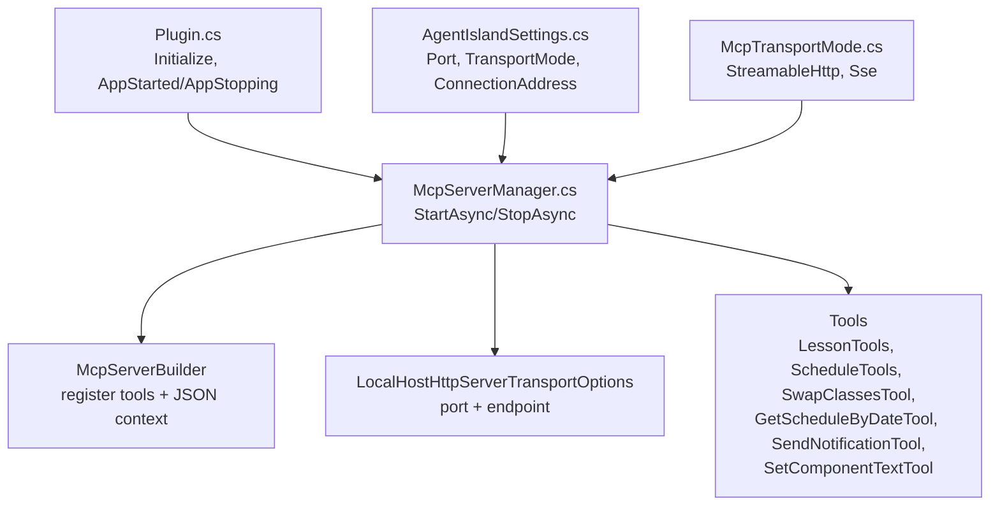
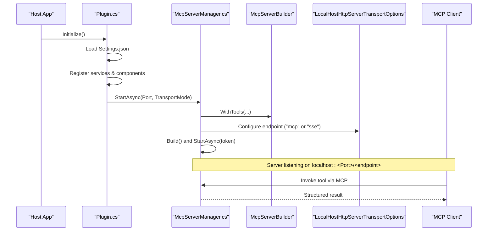
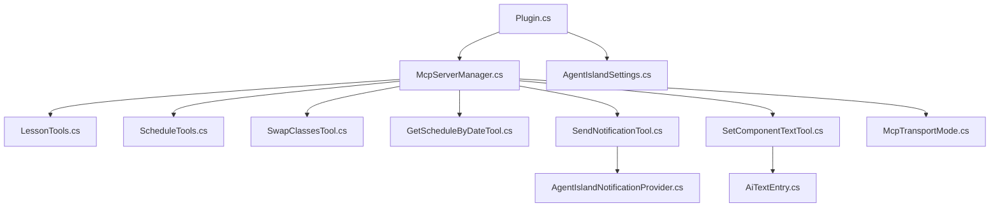
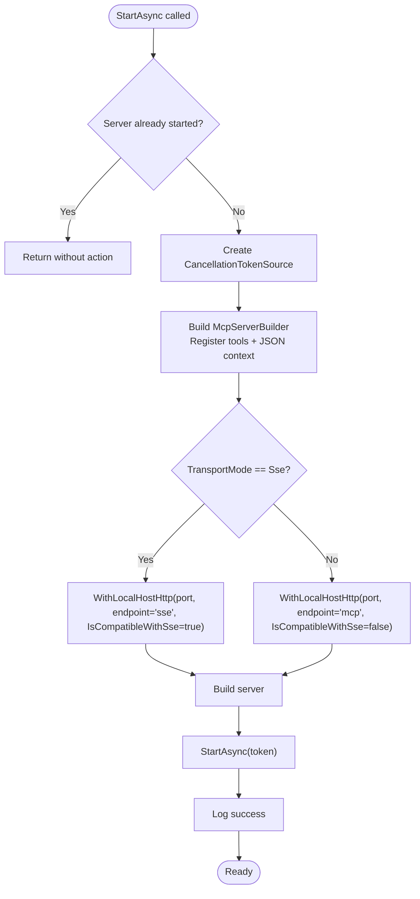

# MCP Server Implementation

<cite>
**Referenced Files in This Document**
- [Plugin.cs](file://Plugin.cs)
- [McpServerManager.cs](file://Mcp/McpServerManager.cs)
- [McpTransportMode.cs](file://Models/McpTransportMode.cs)
- [AgentIslandSettings.cs](file://Models/AgentIslandSettings.cs)
- [LessonTools.cs](file://Mcp/Tools/LessonTools.cs)
- [ScheduleTools.cs](file://Mcp/Tools/ScheduleTools.cs)
- [SwapClassesTool.cs](file://Mcp/Tools/SwapClassesTool.cs)
- [GetScheduleByDateTool.cs](file://Mcp/Tools/GetScheduleByDateTool.cs)
- [SendNotificationTool.cs](file://Mcp/Tools/SendNotificationTool.cs)
- [SetComponentTextTool.cs](file://Mcp/Tools/SetComponentTextTool.cs)
- [AgentIslandNotificationProvider.cs](file://Mcp/Tools/AgentIslandNotificationProvider.cs)
- [ToolResults.cs](file://Models/ToolResults.cs)
- [AiTextEntry.cs](file://Models/AiTextEntry.cs)
- [McpSettingsPage.axaml.cs](file://Views/SettingsPages/McpSettingsPage.axaml.cs)
</cite>

## Table of Contents
1. [Introduction](#introduction)
2. [Project Structure](#project-structure)
3. [Core Components](#core-components)
4. [Architecture Overview](#architecture-overview)
5. [Detailed Component Analysis](#detailed-component-analysis)
6. [Dependency Analysis](#dependency-analysis)
7. [Performance Considerations](#performance-considerations)
8. [Troubleshooting Guide](#troubleshooting-guide)
9. [Conclusion](#conclusion)
10. [Appendices](#appendices)

## Introduction
This document describes the Model Context Protocol (MCP) server implementation integrated into the AgentIsland plugin. It explains how the server is initialized, configured, and managed across its lifecycle; how tools are registered and invoked; and how HTTP and SSE transport modes are supported. It also documents all available MCP tools, their request/response schemas, error handling strategies, authentication considerations, and practical integration patterns for clients.

## Project Structure
The MCP server is implemented as part of the AgentIsland plugin and integrates with the host application’s service container and UI thread. Key areas:
- Plugin entrypoint initializes settings, telemetry, and starts/stops the MCP server based on configuration.
- McpServerManager builds the MCP server, registers tools, and configures transports.
- Tools implement lesson management, schedule operations, notifications, and dynamic text component control.
- Settings expose port, transport mode, and connection address helpers.

**Diagram sources**
- [Plugin.cs:29-79](file://Plugin.cs#L29-L79)
- [McpServerManager.cs:25-82](file://Mcp/McpServerManager.cs#L25-L82)
- [AgentIslandSettings.cs:34-62](file://Models/AgentIslandSettings.cs#L34-L62)
- [McpTransportMode.cs:6-17](file://Models/McpTransportMode.cs#L6-L17)

**Section sources**
- [Plugin.cs:29-79](file://Plugin.cs#L29-L79)
- [McpServerManager.cs:25-82](file://Mcp/McpServerManager.cs#L25-L82)
- [AgentIslandSettings.cs:34-62](file://Models/AgentIslandSettings.cs#L34-L62)
- [McpTransportMode.cs:6-17](file://Models/McpTransportMode.cs#L6-L17)

## Core Components
- Plugin: Loads settings, wires telemetry, registers notification provider and UI components, and controls MCP server lifecycle via events.
- McpServerManager: Builds the MCP server, registers tool implementations, selects transport (HTTP or SSE), and manages start/stop with cancellation and telemetry.
- Settings: Exposes Port, TransportMode, IsEnabled, and a computed ConnectionAddress used by UI and logs.
- Tools: Implement MCP tool methods using either attribute-based declarations or explicit IMcpServerTool implementations.

Key responsibilities:
- Lifecycle: StartAsync constructs builder, registers tools, configures transport, starts server; StopAsync cancels token and stops server gracefully.
- Tool registration: Uses builder to register both attribute-declared and explicit tool classes.
- Transports: Configures LocalHostHttpServerTransportOptions with different endpoints depending on mode.

**Section sources**
- [Plugin.cs:29-79](file://Plugin.cs#L29-L79)
- [McpServerManager.cs:25-82](file://Mcp/McpServerManager.cs#L25-L82)
- [AgentIslandSettings.cs:34-62](file://Models/AgentIslandSettings.cs#L34-L62)

## Architecture Overview
The MCP server runs locally and exposes an HTTP endpoint that can operate in two modes:
- Streamable HTTP: Endpoint “mcp”
- SSE: Endpoint “sse”

Clients connect to http://localhost:{Port}/{endpoint} and invoke tools through the MCP protocol. The server uses a shared JSON serialization context and optional telemetry instrumentation around tool calls.

**Diagram sources**
- [Plugin.cs:55-79](file://Plugin.cs#L55-L79)
- [McpServerManager.cs:25-82](file://Mcp/McpServerManager.cs#L25-L82)

## Detailed Component Analysis

### Server Lifecycle Management
- Initialization: Plugin loads settings, sets up telemetry, and subscribes to app lifecycle events. On AppStarted, it creates McpServerManager and calls StartAsync with configured port and transport mode.
- Startup: McpServerManager constructs McpServerBuilder, registers all tools, attaches JSON serializer context, configures transport options based on mode, builds the server, and starts it with a CancellationTokenSource.
- Shutdown: On AppStopping, Plugin calls StopAsync which cancels the token and stops the server, then disposes resources.

Error handling:
- Exceptions during start/stop are captured via telemetry and rethrown to propagate failure.
- Logging provides clear status messages at each step.

**Section sources**
- [Plugin.cs:55-97](file://Plugin.cs#L55-L97)
- [McpServerManager.cs:25-112](file://Mcp/McpServerManager.cs#L25-L112)

### Transport Modes and Configuration
- Supported modes:
  - StreamableHttp: Endpoint “mcp”
  - Sse: Endpoint “sse”
- Configuration:
  - Port: configurable via settings (default value present).
  - TransportMode: enum controlling endpoint selection.
  - ConnectionAddress: computed helper returning full local URL based on mode and port.

UI integration:
- Settings page listens for changes to IsEnabled, Port, and TransportMode and requests restart when they change.
- Provides a button to copy the current connection address to clipboard.

**Section sources**
- [McpTransportMode.cs:6-17](file://Models/McpTransportMode.cs#L6-L17)
- [AgentIslandSettings.cs:34-62](file://Models/AgentIslandSettings.cs#L34-L62)
- [AgentIslandSettings.cs:204-211](file://Models/AgentIslandSettings.cs#L204-L211)
- [McpSettingsPage.axaml.cs:33-41](file://Views/SettingsPages/McpSettingsPage.axaml.cs#L33-L41)
- [McpSettingsPage.axaml.cs:43-54](file://Views/SettingsPages/McpSettingsPage.axaml.cs#L43-L54)

### Tool Registration System
Tools are registered via the builder:
- Attribute-based tools: Methods decorated with tool attributes are automatically discovered and registered.
- Explicit tools: Classes implementing IMcpServerTool are registered with custom input/output schema definitions.

Registration points:
- LessonTools: get_current_class, get_next_class, get_time_status
- ScheduleTools: get_today_schedule, list_subjects
- SwapClassesTool: swap_classes (explicit IMcpServerTool)
- GetScheduleByDateTool: get_schedule_by_date (explicit IMcpServerTool)
- SendNotificationTool: send_notification (explicit IMcpServerTool)
- SetComponentTextTool: set_component_text (explicit IMcpServerTool)

**Section sources**
- [McpServerManager.cs:41-51](file://Mcp/McpServerManager.cs#L41-L51)
- [LessonTools.cs:14-145](file://Mcp/Tools/LessonTools.cs#L14-L145)
- [ScheduleTools.cs:15-131](file://Mcp/Tools/ScheduleTools.cs#L15-L131)
- [SwapClassesTool.cs:42-61](file://Mcp/Tools/SwapClassesTool.cs#L42-L61)
- [GetScheduleByDateTool.cs:32-51](file://Mcp/Tools/GetScheduleByDateTool.cs#L32-L51)
- [SendNotificationTool.cs:47-66](file://Mcp/Tools/SendNotificationTool.cs#L47-L66)
- [SetComponentTextTool.cs:30-39](file://Mcp/Tools/SetComponentTextTool.cs#L30-L39)

### Available MCP Tools

#### Lesson Management Tools
- get_current_class
  - Purpose: Returns information about the currently active class if any.
  - Input: None
  - Output: CurrentClassResult record fields include subject name, teacher name, formatted start/end times, remaining seconds, and a boolean indicating whether a class is in session.
  - Behavior: Runs on UI thread; normalizes state strings to canonical values; returns empty/default data when no class is active.
- get_next_class
  - Purpose: Returns details about the next scheduled class.
  - Input: None
  - Output: NextClassResult with subject name, teacher name, formatted start/end times, seconds until start, and a boolean indicating availability.
  - Behavior: Computes time difference from current local time to next class start; runs on UI thread.
- get_time_status
  - Purpose: Returns overall time status including current state, remaining seconds, and current ISO time string.
  - Input: None
  - Output: TimeStatusResult with normalized state (“InClass”, “Breaking”, “AfterSchool”), remaining seconds, and current time.
  - Behavior: Normalizes internal state to stable labels; computes remaining time based on state.

Notes:
- All three methods are marked read-only and structured.
- Telemetry instrumentation wraps each call when available.

**Section sources**
- [LessonTools.cs:14-145](file://Mcp/Tools/LessonTools.cs#L14-L145)
- [ToolResults.cs:3-22](file://Models/ToolResults.cs#L3-L22)

#### Schedule Operations
- get_today_schedule
  - Purpose: Retrieves today’s class plan and associated entries.
  - Input: None
  - Output: ScheduleResult containing plan name, date string, and a list of ScheduleClassEntry items with index, subject name, teacher name, formatted start/end times, flags for changed/enabled status.
  - Behavior: Resolves current class plan or falls back to today’s plan; maps subjects via profile service; formats times.
- get_schedule_by_date
  - Purpose: Retrieves class plan for a specific date.
  - Input: Required parameter date (string, yyyy-MM-dd).
  - Output: ScheduleResult similar to above.
  - Error handling: Invalid date format throws argument exception; tool catches exceptions and returns a ScheduleResult with error message.
- list_subjects
  - Purpose: Lists all configured subjects with identifiers, names, teacher names, and initials.
  - Input: None
  - Output: SubjectListResult containing a list of SubjectEntry records.
  - Behavior: Reads from profile service and sorts by name.
- swap_classes
  - Purpose: Swaps two classes by index within a specified date’s plan, creating or reusing a temporary overlay plan.
  - Input: Required parameters classIndex1, classIndex2 (integers); optional date (string, yyyy-MM-dd; empty means today).
  - Output: SwapResult with success flag and message.
  - Behavior: Validates indices; creates temp overlay if needed; marks swapped classes as changed; persists profile; handles errors and returns descriptive messages.

Notes:
- get_today_schedule and list_subjects are attribute-declared and read-only.
- get_schedule_by_date and swap_classes are explicit IMcpServerTool implementations with detailed input schemas.

**Section sources**
- [ScheduleTools.cs:15-131](file://Mcp/Tools/ScheduleTools.cs#L15-L131)
- [GetScheduleByDateTool.cs:18-91](file://Mcp/Tools/GetScheduleByDateTool.cs#L18-L91)
- [SwapClassesTool.cs:18-102](file://Mcp/Tools/SwapClassesTool.cs#L18-L102)
- [ToolResults.cs:24-49](file://Models/ToolResults.cs#L24-L49)

#### Notification System Integration
- send_notification
  - Purpose: Displays a ClassIsland notification with optional overlay content and durations.
  - Input: Required message (string); optional body (string); optional maskDuration (number, default 3.0); optional overlayDuration (number, default 5.0).
  - Output: NotificationResult with success flag and message.
  - Behavior: Checks notification provider initialization; posts notification on UI thread via dispatcher; captures telemetry breadcrumbs and exceptions.

**Section sources**
- [SendNotificationTool.cs:18-136](file://Mcp/Tools/SendNotificationTool.cs#L18-L136)
- [AgentIslandNotificationProvider.cs:10-51](file://Mcp/Tools/AgentIslandNotificationProvider.cs#L10-L51)
- [ToolResults.cs:51-53](file://Models/ToolResults.cs#L51-L53)

#### Dynamic Text Component Control
- set_component_text
  - Purpose: Updates the displayed text of an AI text component identified by ID.
  - Input: Required id (string), text (string).
  - Output: SetTextResult with success flag and message.
  - Behavior: Runs on UI thread; updates existing entry or adds new one; persists via settings collection; captures telemetry and errors.

**Section sources**
- [SetComponentTextTool.cs:19-91](file://Mcp/Tools/SetComponentTextTool.cs#L19-L91)
- [AiTextEntry.cs:5-30](file://Models/AiTextEntry.cs#L5-L30)
- [ToolResults.cs:55-57](file://Models/ToolResults.cs#L55-L57)

### Request/Response Schemas
All tools return structured results defined as C# records. Clients should expect JSON objects matching these structures:

- CurrentClassResult
  - Fields: SubjectName (string), TeacherName (string), StartTime (string?), EndTime (string?), RemainingSeconds (int), IsInClass (bool)
- NextClassResult
  - Fields: SubjectName (string), TeacherName (string), StartTime (string?), EndTime (string?), SecondsUntilStart (int), HasNextClass (bool)
- TimeStatusResult
  - Fields: CurrentState (string), RemainingSeconds (int), CurrentTime (string)
- ScheduleResult
  - Fields: ClassPlanName (string), Date (string), Classes (list of ScheduleClassEntry)
- ScheduleClassEntry
  - Fields: Index (int), SubjectName (string), TeacherName (string), StartTime (string?), EndTime (string?), IsChangedClass (bool), IsEnabled (bool)
- SwapResult
  - Fields: Success (bool), Message (string)
- SubjectListResult
  - Fields: Subjects (list of SubjectEntry)
- SubjectEntry
  - Fields: Id (string), Name (string), TeacherName (string), Initial (string)
- NotificationResult
  - Fields: Success (bool), Message (string)
- SetTextResult
  - Fields: Success (bool), Message (string)

Note:
- Optional fields may be null where indicated.
- Dates are formatted as yyyy-MM-dd; times are formatted as hh:mm:ss.

**Section sources**
- [ToolResults.cs:3-57](file://Models/ToolResults.cs#L3-L57)

### Error Handling Strategies
- Argument validation:
  - Required parameters are validated; missing or invalid types raise argument exceptions.
  - For get_schedule_by_date, invalid date formats throw argument exceptions; the tool catches and returns a ScheduleResult with an error message.
- Operational errors:
  - swap_classes validates indices and plan existence; returns SwapResult with descriptive messages on failure.
  - send_notification checks provider initialization and returns a failure result if not ready.
- Telemetry:
  - Exceptions are captured via Sentry telemetry service with contextual tags.
  - Breadcrumbs are added for tool invocations to aid debugging.

**Section sources**
- [GetScheduleByDateTool.cs:58-78](file://Mcp/Tools/GetScheduleByDateTool.cs#L58-L78)
- [SwapClassesTool.cs:63-80](file://Mcp/Tools/SwapClassesTool.cs#L63-L80)
- [SendNotificationTool.cs:73-105](file://Mcp/Tools/SendNotificationTool.cs#L73-L105)
- [McpServerManager.cs:76-81](file://Mcp/McpServerManager.cs#L76-L81)

### Authentication Considerations
- The server binds to localhost only and does not implement authentication or authorization.
- Access control relies on OS-level network restrictions; ensure the machine is not exposed externally if security is required.
- No credentials or tokens are exchanged in the current implementation.

[No sources needed since this section summarizes general security posture without analyzing specific files]

### Practical Examples and Integration Patterns
- Connecting to the server:
  - Use the ConnectionAddress property to obtain the correct endpoint URL based on selected transport mode and port.
  - For SSE mode, connect to http://localhost:{Port}/sse; for StreamableHttp, use http://localhost:{Port}/mcp.
- Invoking tools:
  - Follow the MCP client protocol to call tools by name with structured arguments.
  - For example, to retrieve today’s schedule, call get_today_schedule with no arguments and parse the returned ScheduleResult.
  - To swap classes, call swap_classes with classIndex1, classIndex2, and optionally date.
- Updating UI text:
  - Call set_component_text with id and text to update the AI text component dynamically.
- Notifications:
  - Call send_notification with message and optional body/durations to display user-facing alerts.

[No sources needed since this section provides general guidance]

## Dependency Analysis
The following diagram shows key dependencies between core modules and tools:

**Diagram sources**
- [Plugin.cs:29-79](file://Plugin.cs#L29-L79)
- [McpServerManager.cs:41-51](file://Mcp/McpServerManager.cs#L41-L51)
- [SendNotificationTool.cs:85-96](file://Mcp/Tools/SendNotificationTool.cs#L85-L96)
- [SetComponentTextTool.cs:56-65](file://Mcp/Tools/SetComponentTextTool.cs#L56-L65)
- [McpTransportMode.cs:6-17](file://Models/McpTransportMode.cs#L6-L17)
- [AgentIslandSettings.cs:34-62](file://Models/AgentIslandSettings.cs#L34-L62)

**Section sources**
- [Plugin.cs:29-79](file://Plugin.cs#L29-L79)
- [McpServerManager.cs:41-51](file://Mcp/McpServerManager.cs#L41-L51)

## Performance Considerations
- UI thread execution: Many tools run on the UI thread to access UI-bound services safely. Keep tool calls lightweight and avoid blocking operations.
- Serialization: A shared JSON serialization context is used to optimize performance. Ensure models remain compatible with the context.
- Telemetry overhead: Instrumentation adds minimal overhead but should be considered in high-frequency scenarios.

[No sources needed since this section provides general guidance]

## Troubleshooting Guide
Common issues and resolutions:
- Server fails to start:
  - Check port availability and transport mode configuration.
  - Review telemetry capture for exceptions during startup.
- Tool invocation errors:
  - Validate required parameters and types.
  - Inspect log messages for debug traces and telemetry breadcrumbs.
- Notification not displayed:
  - Ensure notification provider is initialized before calling send_notification.
- Text component not updating:
  - Verify the provided id exists or will be created; confirm UI thread execution.

**Section sources**
- [McpServerManager.cs:76-81](file://Mcp/McpServerManager.cs#L76-L81)
- [SendNotificationTool.cs:85-96](file://Mcp/Tools/SendNotificationTool.cs#L85-L96)
- [SetComponentTextTool.cs:56-65](file://Mcp/Tools/SetComponentTextTool.cs#L56-L65)

## Conclusion
The AgentIsland MCP server provides a robust, local-first interface to manage lessons, schedules, notifications, and UI text components. Its architecture cleanly separates lifecycle management, transport configuration, and tool implementations. With structured request/response schemas and comprehensive error handling, it offers a reliable foundation for client integrations. Security relies on localhost binding; additional measures should be applied if external exposure is required.

[No sources needed since this section summarizes without analyzing specific files]

## Appendices

### Transport Mode Selection Flow

**Diagram sources**
- [McpServerManager.cs:25-82](file://Mcp/McpServerManager.cs#L25-L82)