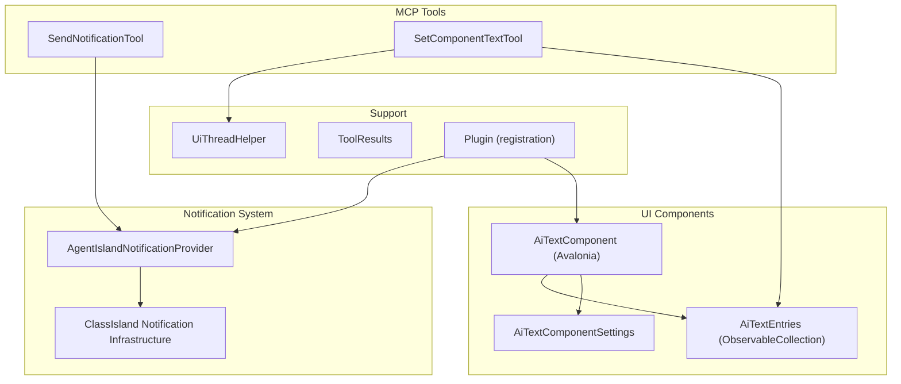
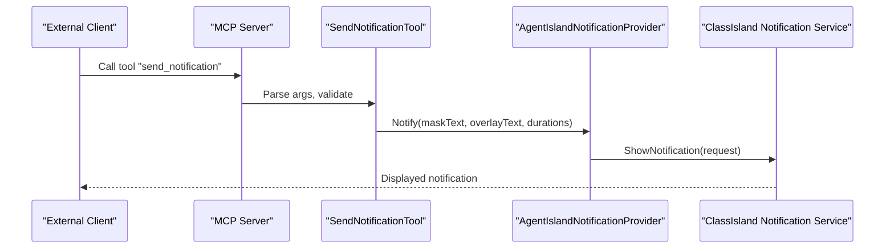
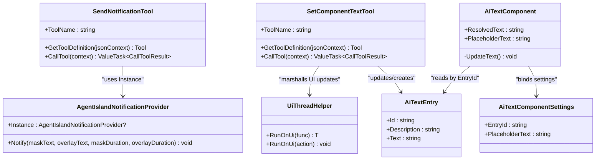

# Notification and Component Tools

<cite>
**Referenced Files in This Document**
- [Plugin.cs](file://Plugin.cs)
- [AgentIslandNotificationProvider.cs](file://Mcp/Tools/AgentIslandNotificationProvider.cs)
- [SendNotificationTool.cs](file://Mcp/Tools/SendNotificationTool.cs)
- [SetComponentTextTool.cs](file://Mcp/Tools/SetComponentTextTool.cs)
- [AiTextComponent.axaml.cs](file://Components/AiTextComponent.axaml.cs)
- [AiTextComponent.axaml](file://Components/AiTextComponent.axaml)
- [AiTextEntry.cs](file://Models/AiTextEntry.cs)
- [AiTextComponentSettings.cs](file://Models/AiTextComponentSettings.cs)
- [UiThreadHelper.cs](file://Helpers/UiThreadHelper.cs)
- [ToolResults.cs](file://Models/ToolResults.cs)
</cite>

## Table of Contents
1. [Introduction](#introduction)
2. [Project Structure](#project-structure)
3. [Core Components](#core-components)
4. [Architecture Overview](#architecture-overview)
5. [Detailed Component Analysis](#detailed-component-analysis)
6. [Dependency Analysis](#dependency-analysis)
7. [Performance Considerations](#performance-considerations)
8. [Troubleshooting Guide](#troubleshooting-guide)
9. [Conclusion](#conclusion)
10. [Appendices](#appendices)

## Introduction
This document explains the notification system and dynamic text component tools exposed by the AgentIsland plugin for ClassIsland. It focuses on:
- The send_notification tool and its message formats, target specifications, and update mechanisms.
- The set_component_text tool and how it targets AI Text components by ID to update displayed content in real time.
- The AgentIslandNotificationProvider implementation and its integration with ClassIsland’s notification infrastructure.
- Examples of different notification types, component targeting strategies, and real-time update patterns.
- Notes on queuing, delivery guarantees, and error recovery as implemented in this codebase.

## Project Structure
The relevant parts of the project are organized around MCP tools that expose functionality to external clients, a notification provider integrated into ClassIsland, and an Avalonia-based UI component that displays dynamic text.

**Diagram sources**
- [Plugin.cs:29-53](file://Plugin.cs#L29-L53)
- [SendNotificationTool.cs:16-66](file://Mcp/Tools/SendNotificationTool.cs#L16-L66)
- [SetComponentTextTool.cs:17-39](file://Mcp/Tools/SetComponentTextTool.cs#L17-L39)
- [AgentIslandNotificationProvider.cs:12-25](file://Mcp/Tools/AgentIslandNotificationProvider.cs#L12-L25)
- [AiTextComponent.axaml.cs:16-46](file://Components/AiTextComponent.axaml.cs#L16-L46)
- [AiTextComponentSettings.cs:5-12](file://Models/AiTextComponentSettings.cs#L5-L12)
- [AiTextEntry.cs:5-14](file://Models/AiTextEntry.cs#L5-L14)
- [UiThreadHelper.cs:5-24](file://Helpers/UiThreadHelper.cs#L5-L24)
- [ToolResults.cs:51-57](file://Models/ToolResults.cs#L51-L57)

**Section sources**
- [Plugin.cs:29-53](file://Plugin.cs#L29-L53)

## Core Components
- SendNotificationTool: Exposes an MCP tool named send_notification. It parses JSON arguments, validates required fields, logs telemetry, and delegates to AgentIslandNotificationProvider to display a notification.
- SetComponentTextTool: Exposes an MCP tool named set_component_text. It updates or creates an AiTextEntry by id and schedules the change on the UI thread so the component can react to property changes.
- AgentIslandNotificationProvider: Implements a ClassIsland notification provider. It constructs notification content and shows it via ClassIsland’s channel mechanism on the UI thread.
- AiTextComponent: An Avalonia component bound to settings and entries. It listens to collection and property changes and updates its displayed text accordingly.

Key responsibilities:
- Tool input validation and structured result serialization.
- UI-thread marshalling for safe cross-thread updates.
- Real-time binding between model entries and UI.

**Section sources**
- [SendNotificationTool.cs:16-105](file://Mcp/Tools/SendNotificationTool.cs#L16-L105)
- [SetComponentTextTool.cs:17-91](file://Mcp/Tools/SetComponentTextTool.cs#L17-L91)
- [AgentIslandNotificationProvider.cs:12-51](file://Mcp/Tools/AgentIslandNotificationProvider.cs#L12-L51)
- [AiTextComponent.axaml.cs:16-84](file://Components/AiTextComponent.axaml.cs#L16-L84)

## Architecture Overview
The architecture integrates three layers:
- MCP Tools layer: External clients call send_notification or set_component_text.
- Provider/Service layer: Notification provider interacts with ClassIsland’s notification service; component updater manipulates observable settings.
- UI layer: Avalonia component binds to settings and entries to render dynamic text.

**Diagram sources**
- [SendNotificationTool.cs:68-105](file://Mcp/Tools/SendNotificationTool.cs#L68-L105)
- [AgentIslandNotificationProvider.cs:27-50](file://Mcp/Tools/AgentIslandNotificationProvider.cs#L27-L50)

## Detailed Component Analysis

### send_notification Tool
Purpose:
- Accepts a message and optional body, plus mask and overlay durations, and displays a notification through ClassIsland.

Input schema:
- message (required): Primary title/mask text.
- body (optional): Overlay content text.
- maskDuration (optional, number): Mask display duration in seconds; default 3.0.
- overlayDuration (optional, number): Overlay display duration in seconds; default 5.0.

Output:
- Structured result containing success flag and message.

Behavior:
- Validates required parameters and coerces optional ones to defaults if missing.
- Logs breadcrumbs and information messages.
- If the notification provider is not initialized, returns a failure result.
- Invokes the provider on the UI thread internally to construct and show notifications.

Error handling:
- Catches exceptions, captures telemetry, and returns a failure result with the exception message.

Example usage patterns:
- Simple alert: Provide only message.
- Alert with details: Provide message and body.
- Custom durations: Adjust maskDuration and overlayDuration.

Delivery characteristics:
- No explicit queueing; each call triggers immediate notification rendering.
- Thread safety: The provider marshals UI work onto the UI thread before showing the notification.

**Section sources**
- [SendNotificationTool.cs:18-66](file://Mcp/Tools/SendNotificationTool.cs#L18-L66)
- [SendNotificationTool.cs:68-105](file://Mcp/Tools/SendNotificationTool.cs#L68-L105)
- [SendNotificationTool.cs:107-135](file://Mcp/Tools/SendNotificationTool.cs#L107-L135)
- [ToolResults.cs:51-53](file://Models/ToolResults.cs#L51-L53)

### set_component_text Tool
Purpose:
- Updates the text of an AI Text component identified by id. If the entry does not exist, it creates one.

Input schema:
- id (required): Entry identifier matching a configured AI Text component.
- text (required): New text content to display.

Output:
- Structured result containing success flag and message.

Behavior:
- Validates both required string parameters.
- Uses UiThreadHelper to ensure updates occur on the UI thread.
- Finds existing entry by id and updates its text; otherwise adds a new entry with the provided id and text.
- The AiTextComponent observes changes to the entries collection and individual properties to refresh the UI.

Real-time update pattern:
- Changes propagate immediately because the component subscribes to collection and property change events and recomputes ResolvedText and PlaceholderText.

Targeting strategy:
- Target by id. Ensure the id matches the EntryId configured in the specific AiTextComponent instance.

**Section sources**
- [SetComponentTextTool.cs:19-39](file://Mcp/Tools/SetComponentTextTool.cs#L19-L39)
- [SetComponentTextTool.cs:41-72](file://Mcp/Tools/SetComponentTextTool.cs#L41-L72)
- [SetComponentTextTool.cs:74-91](file://Mcp/Tools/SetComponentTextTool.cs#L74-L91)
- [AiTextComponent.axaml.cs:36-56](file://Components/AiTextComponent.axaml.cs#L36-L56)
- [AiTextComponent.axaml.cs:58-84](file://Components/AiTextComponent.axaml.cs#L58-L84)
- [UiThreadHelper.cs:7-23](file://Helpers/UiThreadHelper.cs#L7-L23)
- [ToolResults.cs:55-57](file://Models/ToolResults.cs#L55-L57)

### AgentIslandNotificationProvider
Role:
- Implements a ClassIsland notification provider registered during plugin initialization.
- Provides a static Instance accessor used by the send_notification tool.

Integration points:
- Registered via dependency injection and added to ClassIsland’s notification provider registry.
- Uses Channel(MessageChannelId).ShowNotification to deliver notifications through ClassIsland’s notification service.

Notification construction:
- Creates a two-icon mask content from the main message text.
- Optionally creates simple text overlay content when overlayText is provided and overlayDuration > 0.
- Sets durations for mask and overlay.

Threading:
- Marshals all UI-related operations to the UI thread using Dispatcher.UIThread.InvokeAsync.

Logging:
- Emits debug logs for initialization and notification sending.

**Section sources**
- [Plugin.cs:43](file://Plugin.cs#L43)
- [AgentIslandNotificationProvider.cs:10-25](file://Mcp/Tools/AgentIslandNotificationProvider.cs#L10-L25)
- [AgentIslandNotificationProvider.cs:27-50](file://Mcp/Tools/AgentIslandNotificationProvider.cs#L27-L50)

### AiTextComponent (Dynamic Text)
Responsibilities:
- Binds to ResolvedText and PlaceholderText properties.
- Subscribes to changes in the global AiTextEntries collection and individual entry properties.
- Recomputes visible text based on Settings.EntryId and the corresponding entry’s Text.

Data flow:
- set_component_text updates or creates an entry in Plugin.Settings.AiTextEntries.
- The component reacts to PropertyChanged and CollectionChanged events and updates ResolvedText and PlaceholderText.
- The XAML binds TextBlock elements to these properties to reflect updates instantly.

Configuration:
- Each component instance has AiTextComponentSettings with EntryId and PlaceholderText.
- The component uses EntryId to select which entry to display.

**Section sources**
- [AiTextComponent.axaml.cs:16-46](file://Components/AiTextComponent.axaml.cs#L16-L46)
- [AiTextComponent.axaml.cs:58-84](file://Components/AiTextComponent.axaml.cs#L58-L84)
- [AiTextComponent.axaml:10-17](file://Components/AiTextComponent.axaml#L10-L17)
- [AiTextEntry.cs:5-14](file://Models/AiTextEntry.cs#L5-L14)
- [AiTextComponentSettings.cs:5-12](file://Models/AiTextComponentSettings.cs#L5-L12)

## Dependency Analysis
High-level dependencies:
- SendNotificationTool depends on:
  - IAppHost for telemetry and logging services.
  - AgentIslandNotificationProvider.Instance to render notifications.
  - Structured result models for output.
- SetComponentTextTool depends on:
  - UiThreadHelper for UI-thread marshalling.
  - Plugin.Settings.AiTextEntries for data persistence and reactivity.
  - Structured result models for output.
- AgentIslandNotificationProvider depends on:
  - ClassIsland notification abstractions and attributes.
  - Dispatcher.UIThread for UI threading.
  - Logging service.
- AiTextComponent depends on:
  - Plugin.Settings.AiTextEntries and AiTextComponentSettings.
  - Avalonia property system and XAML bindings.

**Diagram sources**
- [SendNotificationTool.cs:16-66](file://Mcp/Tools/SendNotificationTool.cs#L16-L66)
- [SetComponentTextTool.cs:17-39](file://Mcp/Tools/SetComponentTextTool.cs#L17-L39)
- [AgentIslandNotificationProvider.cs:12-25](file://Mcp/Tools/AgentIslandNotificationProvider.cs#L12-L25)
- [AiTextComponent.axaml.cs:16-46](file://Components/AiTextComponent.axaml.cs#L16-L46)
- [AiTextEntry.cs:5-14](file://Models/AiTextEntry.cs#L5-L14)
- [AiTextComponentSettings.cs:5-12](file://Models/AiTextComponentSettings.cs#L5-L12)
- [UiThreadHelper.cs:7-23](file://Helpers/UiThreadHelper.cs#L7-L23)

**Section sources**
- [SendNotificationTool.cs:16-105](file://Mcp/Tools/SendNotificationTool.cs#L16-L105)
- [SetComponentTextTool.cs:17-91](file://Mcp/Tools/SetComponentTextTool.cs#L17-L91)
- [AgentIslandNotificationProvider.cs:12-51](file://Mcp/Tools/AgentIslandNotificationProvider.cs#L12-L51)
- [AiTextComponent.axaml.cs:16-84](file://Components/AiTextComponent.axaml.cs#L16-L84)

## Performance Considerations
- Immediate execution: Both tools execute synchronously within the MCP call context and return promptly after scheduling UI work. There is no background queueing.
- UI thread marshalling: Notifications and component updates are dispatched to the UI thread to avoid cross-thread violations. This ensures responsiveness but means heavy payloads should be avoided.
- Minimal allocations: Input parsing uses lightweight helpers; results are returned as structured records.

[No sources needed since this section provides general guidance]

## Troubleshooting Guide
Common issues and resolutions:
- Notification provider not initialized:
  - Symptom: send_notification returns a failure result indicating the provider is not initialized.
  - Cause: The provider may not have been registered or constructed yet.
  - Resolution: Ensure the plugin initializes and registers the notification provider before calling the tool.
- Missing or invalid parameters:
  - send_notification requires message; set_component_text requires id and text.
  - Resolution: Validate inputs according to the documented schemas before invoking tools.
- UI updates not reflected:
  - Ensure the component’s EntryId matches the id used in set_component_text.
  - Confirm the component is loaded and subscribed to settings and entries.
- Exceptions captured:
  - Telemetry captures exceptions for both tools. Check telemetry for stack traces and messages.

Operational notes:
- Error recovery:
  - Tools catch exceptions and return structured failure results rather than throwing to callers.
  - No retry or queueing logic is implemented; callers should handle retries at their level if needed.

**Section sources**
- [SendNotificationTool.cs:85-104](file://Mcp/Tools/SendNotificationTool.cs#L85-L104)
- [SetComponentTextTool.cs:46-72](file://Mcp/Tools/SetComponentTextTool.cs#L46-L72)
- [AiTextComponent.axaml.cs:36-56](file://Components/AiTextComponent.axaml.cs#L36-L56)

## Conclusion
The AgentIsland plugin exposes two primary MCP tools:
- send_notification for displaying ClassIsland notifications with customizable mask and overlay content.
- set_component_text for dynamically updating AI Text components by id, enabling real-time UI updates.

The notification provider integrates directly with ClassIsland’s notification infrastructure and marshals UI work safely. The dynamic text component leverages observable collections and property change notifications to keep the UI in sync with backend updates. While there is no built-in queuing or delivery guarantee beyond immediate execution, the design emphasizes simplicity, correctness, and responsiveness.

[No sources needed since this section summarizes without analyzing specific files]

## Appendices

### Message Formats and Parameters

- send_notification
  - Required:
    - message: string
  - Optional:
    - body: string
    - maskDuration: number (seconds)
    - overlayDuration: number (seconds)
  - Output:
    - Success: boolean
    - Message: string

- set_component_text
  - Required:
    - id: string
    - text: string
  - Output:
    - Success: boolean
    - Message: string

**Section sources**
- [SendNotificationTool.cs:18-45](file://Mcp/Tools/SendNotificationTool.cs#L18-L45)
- [SetComponentTextTool.cs:19-28](file://Mcp/Tools/SetComponentTextTool.cs#L19-L28)
- [ToolResults.cs:51-57](file://Models/ToolResults.cs#L51-L57)

### Example Scenarios

- Simple notification:
  - Provide message only; use default durations.
- Notification with details:
  - Provide message and body; adjust overlayDuration if needed.
- Dynamic text update:
  - Use set_component_text with an id that matches the component’s EntryId to update displayed text in real time.

[No sources needed since this section provides conceptual examples]