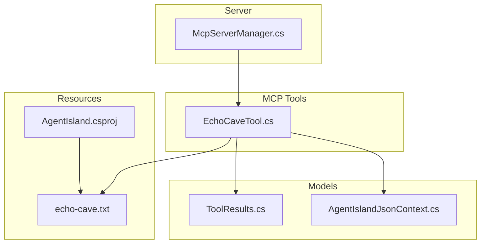
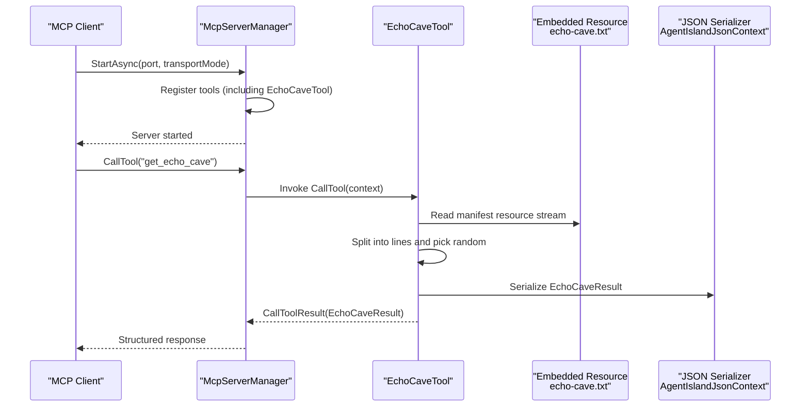
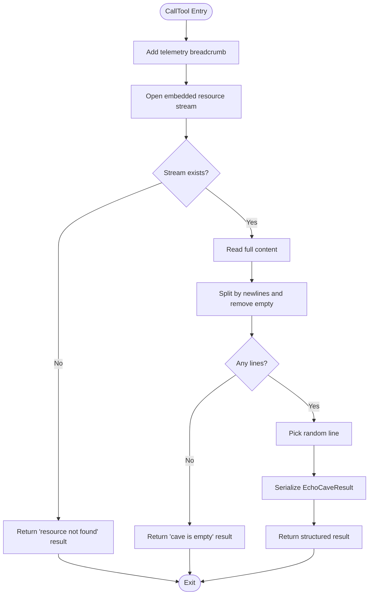
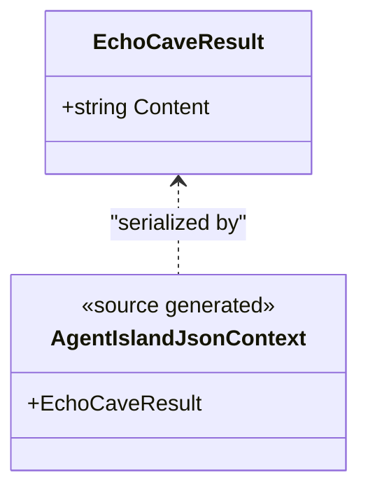
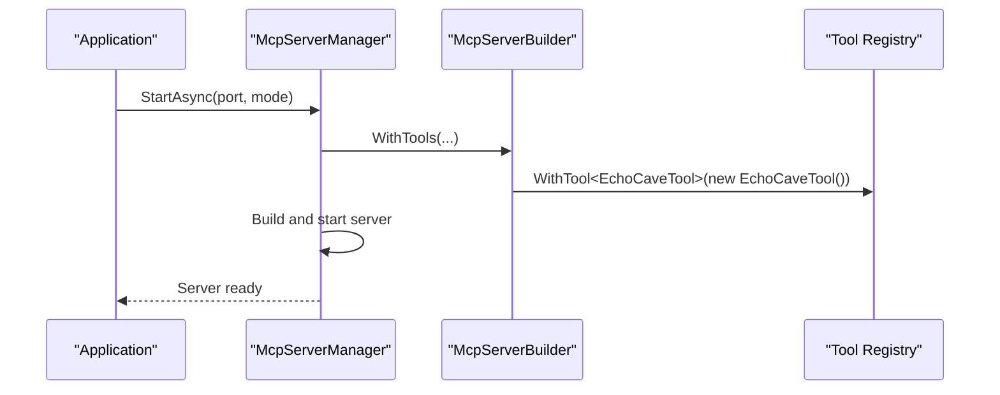
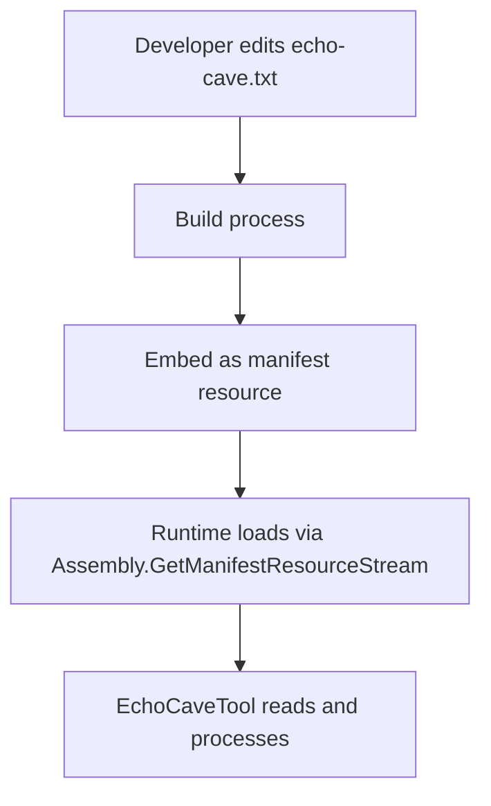
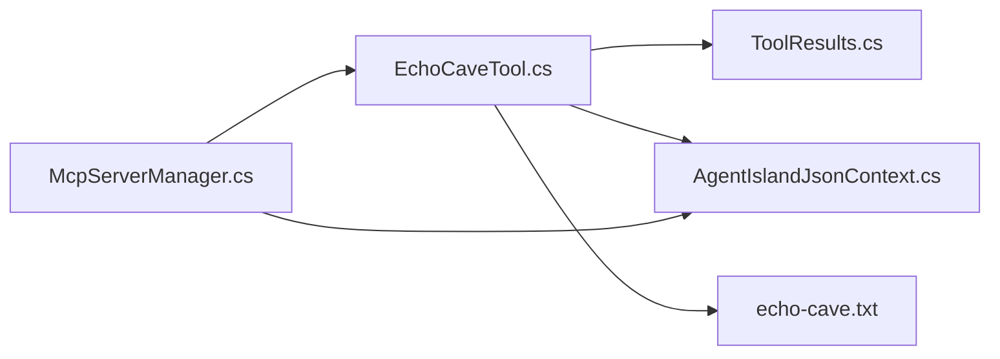

# Echo Cave Feature

<cite>
**Referenced Files in This Document**
- [EchoCaveTool.cs](file://Mcp/Tools/EchoCaveTool.cs)
- [ToolResults.cs](file://Models/ToolResults.cs)
- [AgentIslandJsonContext.cs](file://Models/AgentIslandJsonContext.cs)
- [McpServerManager.cs](file://Mcp/McpServerManager.cs)
- [echo-cave.txt](file://echo-cave.txt)
- [AgentIsland.csproj](file://AgentIsland.csproj)
</cite>

## Table of Contents
1. [Introduction](#introduction)
2. [Project Structure](#project-structure)
3. [Core Components](#core-components)
4. [Architecture Overview](#architecture-overview)
5. [Detailed Component Analysis](#detailed-component-analysis)
6. [Dependency Analysis](#dependency-analysis)
7. [Performance Considerations](#performance-considerations)
8. [Troubleshooting Guide](#troubleshooting-guide)
9. [Conclusion](#conclusion)

## Introduction
The Echo Cave feature provides a simple, read-only MCP tool that returns a random line from an embedded text resource. It is designed to be lightweight and easy to extend by editing the content file. The feature integrates into the application’s Model Context Protocol (MCP) server as a discoverable tool named get_echo_cave.

## Project Structure
The Echo Cave feature spans a small set of focused files:
- Tool implementation: Mcp/Tools/EchoCaveTool.cs
- Data model for the tool result: Models/ToolResults.cs
- JSON serialization context: Models/AgentIslandJsonContext.cs
- Server registration: Mcp/McpServerManager.cs
- Embedded data source: echo-cave.txt
- Build configuration embedding the data file: AgentIsland.csproj

**Diagram sources**
- [EchoCaveTool.cs:17-93](file://Mcp/Tools/EchoCaveTool.cs#L17-L93)
- [ToolResults.cs:59-60](file://Models/ToolResults.cs#L59-L60)
- [AgentIslandJsonContext.cs:14-15](file://Models/AgentIslandJsonContext.cs#L14-L15)
- [McpServerManager.cs:42-56](file://Mcp/McpServerManager.cs#L42-L56)
- [echo-cave.txt:1-2](file://echo-cave.txt#L1-L2)
- [AgentIsland.csproj:52](file://AgentIsland.csproj#L52)

**Section sources**
- [EchoCaveTool.cs:17-93](file://Mcp/Tools/EchoCaveTool.cs#L17-L93)
- [ToolResults.cs:59-60](file://Models/ToolResults.cs#L59-L60)
- [AgentIslandJsonContext.cs:14-15](file://Models/AgentIslandJsonContext.cs#L14-L15)
- [McpServerManager.cs:42-56](file://Mcp/McpServerManager.cs#L42-L56)
- [echo-cave.txt:1-2](file://echo-cave.txt#L1-L2)
- [AgentIsland.csproj:52](file://AgentIsland.csproj#L52)

## Core Components
- EchoCaveTool: Implements the MCP tool interface, defines the tool metadata, and handles execution logic. It reads an embedded resource, splits it into lines, selects one at random, and returns a structured result.
- EchoCaveResult: A minimal record type representing the tool output with a single Content field.
- AgentIslandJsonContext: Provides source-generated JSON serialization for EchoCaveResult and other models used by the MCP server.
- McpServerManager: Registers all tools, including EchoCaveTool, when starting the MCP server.
- echo-cave.txt: The embedded data source containing the pool of messages.
- AgentIsland.csproj: Embeds echo-cave.txt as a manifest resource so it can be read at runtime.

Key behaviors:
- Tool name: get_echo_cave
- Input schema: empty object (no parameters required)
- Output: structured EchoCaveResult
- Resource access: via assembly manifest resource stream
- Error handling: captures telemetry breadcrumbs and exceptions; returns user-friendly error strings

**Section sources**
- [EchoCaveTool.cs:27-46](file://Mcp/Tools/EchoCaveTool.cs#L27-L46)
- [EchoCaveTool.cs:48-92](file://Mcp/Tools/EchoCaveTool.cs#L48-L92)
- [ToolResults.cs:59-60](file://Models/ToolResults.cs#L59-L60)
- [AgentIslandJsonContext.cs:14-15](file://Models/AgentIslandJsonContext.cs#L14-L15)
- [McpServerManager.cs:54](file://Mcp/McpServerManager.cs#L54)
- [AgentIsland.csproj:52](file://AgentIsland.csproj#L52)

## Architecture Overview
The Echo Cave feature integrates into the MCP server lifecycle through tool registration and execution.

**Diagram sources**
- [McpServerManager.cs:25-87](file://Mcp/McpServerManager.cs#L25-L87)
- [McpServerManager.cs:42-56](file://Mcp/McpServerManager.cs#L42-L56)
- [EchoCaveTool.cs:48-92](file://Mcp/Tools/EchoCaveTool.cs#L48-L92)
- [AgentIslandJsonContext.cs:14-15](file://Models/AgentIslandJsonContext.cs#L14-L15)
- [echo-cave.txt:1-2](file://echo-cave.txt#L1-L2)

## Detailed Component Analysis

### EchoCaveTool Implementation
Responsibilities:
- Define tool metadata (name, title, description, input/output schemas, annotations)
- Execute tool logic: load embedded resource, parse lines, select randomly, serialize result
- Integrate logging and telemetry

Execution flow:
- Acquire telemetry service and log a breadcrumb
- Attempt to open the embedded resource stream
- If missing, return a structured error result
- Read content, split by newline characters, remove empty entries
- If no lines remain, return a structured “empty” result
- Otherwise, choose a random line and return a structured success result
- On any exception, capture telemetry and return a structured error result

**Diagram sources**
- [EchoCaveTool.cs:48-92](file://Mcp/Tools/EchoCaveTool.cs#L48-L92)

**Section sources**
- [EchoCaveTool.cs:27-46](file://Mcp/Tools/EchoCaveTool.cs#L27-L46)
- [EchoCaveTool.cs:48-92](file://Mcp/Tools/EchoCaveTool.cs#L48-L92)

### Data Model and Serialization
- EchoCaveResult: Simple record with a single string Content property.
- AgentIslandJsonContext: Source-generated serializer configured with camelCase naming policy and includes EchoCaveResult.

**Diagram sources**
- [ToolResults.cs:59-60](file://Models/ToolResults.cs#L59-L60)
- [AgentIslandJsonContext.cs:14-15](file://Models/AgentIslandJsonContext.cs#L14-L15)

**Section sources**
- [ToolResults.cs:59-60](file://Models/ToolResults.cs#L59-L60)
- [AgentIslandJsonContext.cs:14-15](file://Models/AgentIslandJsonContext.cs#L14-L15)

### Server Registration
The MCP server manager registers EchoCaveTool during startup, making it available to clients.

**Diagram sources**
- [McpServerManager.cs:25-87](file://Mcp/McpServerManager.cs#L25-L87)
- [McpServerManager.cs:42-56](file://Mcp/McpServerManager.cs#L42-L56)

**Section sources**
- [McpServerManager.cs:42-56](file://Mcp/McpServerManager.cs#L42-L56)

### Embedded Resource Configuration
The project embeds echo-cave.txt as a manifest resource, enabling runtime access via reflection.

**Diagram sources**
- [AgentIsland.csproj:52](file://AgentIsland.csproj#L52)
- [EchoCaveTool.cs:58-66](file://Mcp/Tools/EchoCaveTool.cs#L58-L66)

**Section sources**
- [AgentIsland.csproj:52](file://AgentIsland.csproj#L52)
- [EchoCaveTool.cs:58-66](file://Mcp/Tools/EchoCaveTool.cs#L58-L66)

## Dependency Analysis
- EchoCaveTool depends on:
  - System.IO and System.Reflection for reading embedded resources
  - System.Text.Json for serializing results
  - Application services for logging and telemetry
  - Models for EchoCaveResult and JSON context
- McpServerManager depends on:
  - Tool registry to register EchoCaveTool
  - JSON context for serialization
- echo-cave.txt is consumed only by EchoCaveTool at runtime

**Diagram sources**
- [EchoCaveTool.cs:1-14](file://Mcp/Tools/EchoCaveTool.cs#L1-L14)
- [ToolResults.cs:59-60](file://Models/ToolResults.cs#L59-L60)
- [AgentIslandJsonContext.cs:14-15](file://Models/AgentIslandJsonContext.cs#L14-L15)
- [McpServerManager.cs:42-56](file://Mcp/McpServerManager.cs#L42-L56)

**Section sources**
- [EchoCaveTool.cs:1-14](file://Mcp/Tools/EchoCaveTool.cs#L1-L14)
- [McpServerManager.cs:42-56](file://Mcp/McpServerManager.cs#L42-L56)

## Performance Considerations
- Resource loading: Each call opens and reads the entire embedded resource. For very large files, consider caching the parsed lines or preloading them at startup to avoid repeated I/O.
- Random selection: Uses a static Random instance; this is acceptable but ensure thread-safety if concurrency increases.
- Memory usage: Reading the whole file into memory is fine for small datasets; for larger datasets, streaming and lazy parsing may be preferable.
- Serialization overhead: Using source-generated serializers reduces overhead compared to reflection-based approaches.

[No sources needed since this section provides general guidance]

## Troubleshooting Guide
Common issues and resolutions:
- Missing resource: If the embedded resource cannot be found, the tool returns a specific error message. Verify that echo-cave.txt is included as an embedded resource in the project file.
- Empty cave: If the file contains no non-empty lines, the tool returns an “empty” result. Ensure the file has at least one line with content.
- Exceptions: Any unexpected errors are captured via telemetry and returned as a structured error message. Check telemetry logs for details.

Operational checks:
- Confirm the tool is registered by inspecting the MCP server’s tool list.
- Validate that the JSON context includes EchoCaveResult for serialization.

**Section sources**
- [EchoCaveTool.cs:61-77](file://Mcp/Tools/EchoCaveTool.cs#L61-L77)
- [EchoCaveTool.cs:85-91](file://Mcp/Tools/EchoCaveTool.cs#L85-L91)
- [AgentIsland.csproj:52](file://AgentIsland.csproj#L52)
- [AgentIslandJsonContext.cs:14-15](file://Models/AgentIslandJsonContext.cs#L14-L15)

## Conclusion
The Echo Cave feature is a concise, extensible MCP tool that demonstrates how to integrate a simple read-only operation using embedded resources, structured results, and source-generated serialization. Its design keeps dependencies minimal while providing clear integration points for logging and telemetry. Extending the feature primarily involves updating the embedded text file and optionally optimizing performance for larger datasets.