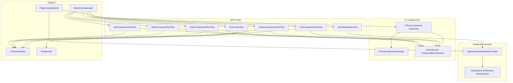
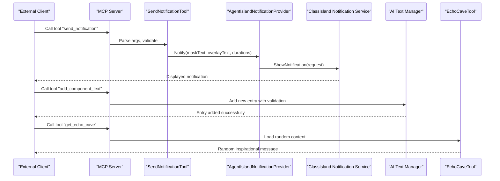

# Notification and Component Tools

<cite>
**Referenced Files in This Document**
- [Plugin.cs](file://Plugin.cs)
- [AgentIslandNotificationProvider.cs](file://Mcp/Tools/AgentIslandNotificationProvider.cs)
- [SendNotificationTool.cs](file://Mcp/Tools/SendNotificationTool.cs)
- [SetComponentTextTool.cs](file://Mcp/Tools/SetComponentTextTool.cs)
- [AddComponentTextTool.cs](file://Mcp/Tools/AddComponentTextTool.cs)
- [ClearComponentTextTool.cs](file://Mcp/Tools/ClearComponentTextTool.cs)
- [DeleteComponentTextTool.cs](file://Mcp/Tools/DeleteComponentTextTool.cs)
- [ListComponentTextTool.cs](file://Mcp/Tools/ListComponentTextTool.cs)
- [EchoCaveTool.cs](file://Mcp/Tools/EchoCaveTool.cs)
- [AiTextComponent.axaml.cs](file://Components/AiTextComponent.axaml.cs)
- [AiTextComponent.axaml](file://Components/AiTextComponent.axaml)
- [AiTextEntry.cs](file://Models/AiTextEntry.cs)
- [AiTextComponentSettings.cs](file://Models/AiTextComponentSettings.cs)
- [UiThreadHelper.cs](file://Helpers/UiThreadHelper.cs)
- [ToolResults.cs](file://Models/ToolResults.cs)
- [McpServerManager.cs](file://Mcp/McpServerManager.cs)
</cite>

## Update Summary
**Changes Made**
- Added comprehensive CRUD operations for AI text components: add_component_text, clear_component_text, delete_component_text, and list_component_text tools
- Added new Echo Cave random content generator tool (get_echo_cave)
- Enhanced existing set_component_text tool with improved error handling and logging
- Updated architecture diagrams to include new tools and their relationships
- Expanded API reference section with complete tool specifications

## Table of Contents
1. [Introduction](#introduction)
2. [Project Structure](#project-structure)
3. [Core Components](#core-components)
4. [Architecture Overview](#architecture-overview)
5. [Detailed Component Analysis](#detailed-component-analysis)
6. [Dependency Analysis](#dependency-analysis)
7. [Performance Considerations](#performance-considerations)
8. [Troubleshooting Guide](#troubleshooting-guide)
9. [Conclusion](#conclusion)
10. [Appendices](#appendices)

## Introduction
This document explains the notification system and dynamic text component tools exposed by the AgentIsland plugin for ClassIsland. It focuses on:
- The send_notification tool and its message formats, target specifications, and update mechanisms.
- Complete CRUD operations for AI Text components including add, set, clear, delete, and list operations.
- The new Echo Cave random content generator tool for retrieving random inspirational messages.
- The AgentIslandNotificationProvider implementation and its integration with ClassIsland's notification infrastructure.
- Examples of different notification types, component targeting strategies, and real-time update patterns.
- Notes on queuing, delivery guarantees, and error recovery as implemented in this codebase.

## Project Structure
The relevant parts of the project are organized around MCP tools that expose functionality to external clients, a notification provider integrated into ClassIsland, and an Avalonia-based UI component that displays dynamic text.

**Diagram sources**
- [Plugin.cs:29-53](file://Plugin.cs#L29-L53)
- [McpServerManager.cs:42-55](file://Mcp/McpServerManager.cs#L42-L55)
- [SendNotificationTool.cs:16-66](file://Mcp/Tools/SendNotificationTool.cs#L16-L66)
- [SetComponentTextTool.cs:17-39](file://Mcp/Tools/SetComponentTextTool.cs#L17-L39)
- [AddComponentTextTool.cs:18-41](file://Mcp/Tools/AddComponentTextTool.cs#L18-L41)
- [ClearComponentTextTool.cs:18-41](file://Mcp/Tools/ClearComponentTextTool.cs#L18-L41)
- [DeleteComponentTextTool.cs:18-39](file://Mcp/Tools/DeleteComponentTextTool.cs#L18-L39)
- [ListComponentTextTool.cs:18-35](file://Mcp/Tools/ListComponentTextTool.cs#L18-L35)
- [EchoCaveTool.cs:17-46](file://Mcp/Tools/EchoCaveTool.cs#L17-L46)
- [AgentIslandNotificationProvider.cs:12-25](file://Mcp/Tools/AgentIslandNotificationProvider.cs#L12-L25)
- [AiTextComponent.axaml.cs:16-46](file://Components/AiTextComponent.axaml.cs#L16-L46)
- [AiTextComponentSettings.cs:5-12](file://Models/AiTextComponentSettings.cs#L5-L12)
- [AiTextEntry.cs:5-14](file://Models/AiTextEntry.cs#L5-L14)
- [UiThreadHelper.cs:5-24](file://Helpers/UiThreadHelper.cs#L5-L24)
- [ToolResults.cs:51-57](file://Models/ToolResults.cs#L51-L57)

**Section sources**
- [Plugin.cs:29-53](file://Plugin.cs#L29-L53)

## Core Components
- **SendNotificationTool**: Exposes an MCP tool named send_notification. It parses JSON arguments, validates required fields, logs telemetry, and delegates to AgentIslandNotificationProvider to display a notification.
- **AI Text Component Management Tools**: Complete CRUD operations for managing AI Text entries:
  - **SetComponentTextTool**: Updates or creates an AiTextEntry by id and schedules the change on the UI thread.
  - **AddComponentTextTool**: Adds a new AI text entry with unique ID validation and optional description support.
  - **ClearComponentTextTool**: Clears text content of specific or all entries while preserving entry metadata.
  - **DeleteComponentTextTool**: Removes entire AI text entries by ID.
  - **ListComponentTextTool**: Lists all AI text entries with their IDs, descriptions, and current text content.
- **EchoCaveTool**: Provides random inspirational content from embedded echo-cave.txt resource file.
- **AgentIslandNotificationProvider**: Implements a ClassIsland notification provider. It constructs notification content and shows it via ClassIsland's channel mechanism on the UI thread.
- **AiTextComponent**: An Avalonia component bound to settings and entries. It listens to collection and property changes and updates its displayed text accordingly.

Key responsibilities:
- Tool input validation and structured result serialization.
- UI-thread marshalling for safe cross-thread updates.
- Real-time binding between model entries and UI.
- Comprehensive error handling and telemetry logging.

**Section sources**
- [SendNotificationTool.cs:16-105](file://Mcp/Tools/SendNotificationTool.cs#L16-L105)
- [SetComponentTextTool.cs:17-92](file://Mcp/Tools/SetComponentTextTool.cs#L17-L92)
- [AddComponentTextTool.cs:18-110](file://Mcp/Tools/AddComponentTextTool.cs#L18-L110)
- [ClearComponentTextTool.cs:18-121](file://Mcp/Tools/ClearComponentTextTool.cs#L18-L121)
- [DeleteComponentTextTool.cs:18-101](file://Mcp/Tools/DeleteComponentTextTool.cs#L18-L101)
- [ListComponentTextTool.cs:18-67](file://Mcp/Tools/ListComponentTextTool.cs#L18-L67)
- [EchoCaveTool.cs:17-94](file://Mcp/Tools/EchoCaveTool.cs#L17-L94)
- [AgentIslandNotificationProvider.cs:12-51](file://Mcp/Tools/AgentIslandNotificationProvider.cs#L12-L51)
- [AiTextComponent.axaml.cs:16-84](file://Components/AiTextComponent.axaml.cs#L16-L84)

## Architecture Overview
The architecture integrates multiple layers:
- **MCP Tools layer**: External clients call various tools for notifications, AI text management, and random content generation.
- **Provider/Service layer**: Notification provider interacts with ClassIsland's notification service; component updater manipulates observable settings.
- **UI layer**: Avalonia component binds to settings and entries to render dynamic text.
- **Resource layer**: Embedded resources like echo-cave.txt provide static content.

**Diagram sources**
- [SendNotificationTool.cs:68-105](file://Mcp/Tools/SendNotificationTool.cs#L68-L105)
- [AgentIslandNotificationProvider.cs:27-50](file://Mcp/Tools/AgentIslandNotificationProvider.cs#L27-L50)
- [AddComponentTextTool.cs:43-90](file://Mcp/Tools/AddComponentTextTool.cs#L43-L90)
- [EchoCaveTool.cs:48-93](file://Mcp/Tools/EchoCaveTool.cs#L48-L93)

## Detailed Component Analysis

### send_notification Tool
Purpose:
- Accepts a message and optional body, plus mask and overlay durations, and displays a notification through ClassIsland.

Input schema:
- message (required): Primary title/mask text.
- body (optional): Overlay content text.
- maskDuration (optional, number): Mask display duration in seconds; default 3.0.
- overlayDuration (optional, number): Overlay display duration in seconds; default 5.0.

Output:
- Structured result containing success flag and message.

Behavior:
- Validates required parameters and coerces optional ones to defaults if missing.
- Logs breadcrumbs and information messages.
- If the notification provider is not initialized, returns a failure result.
- Invokes the provider on the UI thread internally to construct and show notifications.

Error handling:
- Catches exceptions, captures telemetry, and returns a failure result with the exception message.

Example usage patterns:
- Simple alert: Provide only message.
- Alert with details: Provide message and body.
- Custom durations: Adjust maskDuration and overlayDuration.

Delivery characteristics:
- No explicit queueing; each call triggers immediate notification rendering.
- Thread safety: The provider marshals UI work onto the UI thread before showing the notification.

**Section sources**
- [SendNotificationTool.cs:18-66](file://Mcp/Tools/SendNotificationTool.cs#L18-L66)
- [SendNotificationTool.cs:68-105](file://Mcp/Tools/SendNotificationTool.cs#L68-L105)
- [SendNotificationTool.cs:107-135](file://Mcp/Tools/SendNotificationTool.cs#L107-L135)
- [ToolResults.cs:51-53](file://Models/ToolResults.cs#L51-L53)

### AI Text Component Management Tools

#### set_component_text Tool
Purpose:
- Updates the text of an AI Text component identified by id. If the entry does not exist, it creates one.

Input schema:
- id (required): Entry identifier matching a configured AI Text component.
- text (required): New text content to display.

Output:
- Structured result containing success flag and message.

Behavior:
- Validates both required string parameters.
- Uses UiThreadHelper to ensure updates occur on the UI thread.
- Finds existing entry by id and updates its text; otherwise adds a new entry with the provided id and text.
- The AiTextComponent observes changes to the entries collection and individual properties to refresh the UI.

Real-time update pattern:
- Changes propagate immediately because the component subscribes to collection and property change events and recomputes ResolvedText and PlaceholderText.

Targeting strategy:
- Target by id. Ensure the id matches the EntryId configured in the specific AiTextComponent instance.

**Section sources**
- [SetComponentTextTool.cs:19-39](file://Mcp/Tools/SetComponentTextTool.cs#L19-L39)
- [SetComponentTextTool.cs:41-72](file://Mcp/Tools/SetComponentTextTool.cs#L41-L72)
- [SetComponentTextTool.cs:74-92](file://Mcp/Tools/SetComponentTextTool.cs#L74-L92)
- [AiTextComponent.axaml.cs:36-56](file://Components/AiTextComponent.axaml.cs#L36-L56)
- [AiTextComponent.axaml.cs:58-84](file://Components/AiTextComponent.axaml.cs#L58-L84)
- [UiThreadHelper.cs:7-23](file://Helpers/UiThreadHelper.cs#L7-L23)
- [ToolResults.cs:55-57](file://Models/ToolResults.cs#L55-L57)

#### add_component_text Tool
Purpose:
- Creates a new AI text entry with unique ID validation and optional description support.

Input schema:
- id (required): Unique entry identifier.
- text (optional): Initial text content; defaults to empty string.
- description (optional): Description for the entry; defaults to empty string.

Output:
- SetTextResult with success status and descriptive message.

Behavior:
- Validates required id parameter and optional text/description parameters.
- Checks for duplicate IDs and prevents creation if entry already exists.
- Uses UiThreadHelper for thread-safe collection modification.
- Returns detailed error messages for validation failures.

Use cases:
- Creating new text entries for future use.
- Batch initialization of multiple text entries.
- Programmatic management of text entry collections.

**Section sources**
- [AddComponentTextTool.cs:20-30](file://Mcp/Tools/AddComponentTextTool.cs#L20-L30)
- [AddComponentTextTool.cs:43-90](file://Mcp/Tools/AddComponentTextTool.cs#L43-L90)
- [AddComponentTextTool.cs:92-110](file://Mcp/Tools/AddComponentTextTool.cs#L92-L110)

#### clear_component_text Tool
Purpose:
- Clears text content of specific or all AI text entries while preserving entry metadata.

Input schema:
- id (required): Entry ID to clear, or "all" (case-insensitive) to clear all entries.

Output:
- SetTextResult with success status and operation summary.

Behavior:
- Supports bulk clearing when id="all" is specified.
- Handles empty collections gracefully with appropriate messaging.
- Preserves entry IDs and descriptions while clearing only text content.
- Provides accurate count of cleared entries in success messages.

Use cases:
- Resetting all text content while maintaining entry structure.
- Clearing specific entries without deletion.
- Bulk operations for maintenance tasks.

**Section sources**
- [ClearComponentTextTool.cs:22-30](file://Mcp/Tools/ClearComponentTextTool.cs#L22-L30)
- [ClearComponentTextTool.cs:43-101](file://Mcp/Tools/ClearComponentTextTool.cs#L43-L101)
- [ClearComponentTextTool.cs:103-121](file://Mcp/Tools/ClearComponentTextTool.cs#L103-L121)

#### delete_component_text Tool
Purpose:
- Removes entire AI text entries by ID, including all associated data.

Input schema:
- id (required): Entry ID to delete.

Output:
- SetTextResult with success status and deletion confirmation.

Behavior:
- Validates existence of target entry before deletion.
- Performs atomic removal from the observable collection.
- Provides clear error messages for non-existent entries.
- Triggers UI updates through collection change notifications.

Use cases:
- Cleanup of unused text entries.
- Dynamic management of text entry collections.
- User-driven interface for entry management.

**Section sources**
- [DeleteComponentTextTool.cs:20-28](file://Mcp/Tools/DeleteComponentTextTool.cs#L20-L28)
- [DeleteComponentTextTool.cs:41-81](file://Mcp/Tools/DeleteComponentTextTool.cs#L41-L81)
- [DeleteComponentTextTool.cs:83-101](file://Mcp/Tools/DeleteComponentTextTool.cs#L83-L101)

#### list_component_text Tool
Purpose:
- Retrieves complete information about all AI text entries including IDs, descriptions, and current text content.

Input schema:
- No parameters required.

Output:
- ComponentTextListResult containing array of ComponentTextEntry objects.

Behavior:
- Returns comprehensive entry information including computed DisplayName.
- Handles empty collections gracefully with empty result arrays.
- Provides thread-safe access to the observable collection.
- Includes detailed logging for monitoring and debugging.

Use cases:
- Interface building for text entry management.
- Status reporting and monitoring.
- Backup and export operations.

**Section sources**
- [ListComponentTextTool.cs:20-24](file://Mcp/Tools/ListComponentTextTool.cs#L20-L24)
- [ListComponentTextTool.cs:37-67](file://Mcp/Tools/ListComponentTextTool.cs#L37-L67)

### get_echo_cave Tool
Purpose:
- Retrieves random inspirational content from the embedded echo-cave.txt resource file.

Input schema:
- No parameters required.

Output:
- EchoCaveResult containing randomly selected content line.

Behavior:
- Loads embedded resource file at runtime.
- Parses content into lines and selects random entry.
- Handles missing resources and empty files gracefully.
- Provides meaningful error messages for resource issues.

Use cases:
- Random motivational content generation.
- Background content for AI text components.
- Interactive features requiring random responses.

**Section sources**
- [EchoCaveTool.cs:20-25](file://Mcp/Tools/EchoCaveTool.cs#L20-L25)
- [EchoCaveTool.cs:48-93](file://Mcp/Tools/EchoCaveTool.cs#L48-L93)

### AgentIslandNotificationProvider
Role:
- Implements a ClassIsland notification provider registered during plugin initialization.
- Provides a static Instance accessor used by the send_notification tool.

Integration points:
- Registered via dependency injection and added to ClassIsland's notification provider registry.
- Uses Channel(MessageChannelId).ShowNotification to deliver notifications through ClassIsland's notification service.

Notification construction:
- Creates a two-icon mask content from the main message text.
- Optionally creates simple text overlay content when overlayText is provided and overlayDuration > 0.
- Sets durations for mask and overlay.

Threading:
- Marshals all UI-related operations to the UI thread using Dispatcher.UIThread.InvokeAsync.

Logging:
- Emits debug logs for initialization and notification sending.

**Section sources**
- [Plugin.cs:43](file://Plugin.cs#L43)
- [AgentIslandNotificationProvider.cs:10-25](file://Mcp/Tools/AgentIslandNotificationProvider.cs#L10-L25)
- [AgentIslandNotificationProvider.cs:27-50](file://Mcp/Tools/AgentIslandNotificationProvider.cs#L27-L50)

### AiTextComponent (Dynamic Text)
Responsibilities:
- Binds to ResolvedText and PlaceholderText properties.
- Subscribes to changes in the global AiTextEntries collection and individual entry properties.
- Recomputes visible text based on Settings.EntryId and the corresponding entry's Text.

Data flow:
- All AI text management tools update or create entries in Plugin.Settings.AiTextEntries.
- The component reacts to PropertyChanged and CollectionChanged events and updates ResolvedText and PlaceholderText.
- The XAML binds TextBlock elements to these properties to reflect updates instantly.

Configuration:
- Each component instance has AiTextComponentSettings with EntryId and PlaceholderText.
- The component uses EntryId to select which entry to display.

**Section sources**
- [AiTextComponent.axaml.cs:16-46](file://Components/AiTextComponent.axaml.cs#L16-L46)
- [AiTextComponent.axaml.cs:58-84](file://Components/AiTextComponent.axaml.cs#L58-L84)
- [AiTextComponent.axaml:10-17](file://Components/AiTextComponent.axaml#L10-L17)
- [AiTextEntry.cs:5-14](file://Models/AiTextEntry.cs#L5-L14)
- [AiTextComponentSettings.cs:5-12](file://Models/AiTextComponentSettings.cs#L5-L12)

## Dependency Analysis
High-level dependencies:
- **SendNotificationTool** depends on:
  - IAppHost for telemetry and logging services.
  - AgentIslandNotificationProvider.Instance to render notifications.
  - Structured result models for output.
- **AI Text Management Tools** depend on:
  - UiThreadHelper for UI-thread marshalling.
  - Plugin.Settings.AiTextEntries for data persistence and reactivity.
  - Structured result models for output.
- **EchoCaveTool** depends on:
  - Assembly.GetExecutingAssembly() for embedded resource access.
  - Random class for content selection.
  - EchoCaveResult model for structured output.
- **AgentIslandNotificationProvider** depends on:
  - ClassIsland notification abstractions and attributes.
  - Dispatcher.UIThread for UI threading.
  - Logging service.
- **AiTextComponent** depends on:
  - Plugin.Settings.AiTextEntries and AiTextComponentSettings.
  - Avalonia property system and XAML bindings.

```mermaid
classDiagram
class SendNotificationTool {
+ToolName : string
+GetToolDefinition(jsonContext) Tool
+CallTool(context) ValueTask~CallToolResult~
}
class SetComponentTextTool {
+ToolName : string
+GetToolDefinition(jsonContext) Tool
+CallTool(context) ValueTask~CallToolResult~
}
class AddComponentTextTool {
+ToolName : string
+GetToolDefinition(jsonContext) Tool
+CallTool(context) ValueTask~CallToolResult~
}
class ClearComponentTextTool {
+ToolName : string
+GetToolDefinition(jsonContext) Tool
+CallTool(context) ValueTask~CallToolResult~
}
class DeleteComponentTextTool {
+ToolName : string
+GetToolDefinition(jsonContext) Tool
+CallTool(context) ValueTask~CallToolResult~
}
class ListComponentTextTool {
+ToolName : string
+GetToolDefinition(jsonContext) Tool
+CallTool(context) ValueTask~CallToolResult~
}
class EchoCaveTool {
+ToolName : string
+GetToolDefinition(jsonContext) Tool
+CallTool(context) ValueTask~CallToolResult~
}
class AgentIslandNotificationProvider {
+Instance : AgentIslandNotificationProvider?
+Notify(maskText, overlayText, maskDuration, overlayDuration) void
}
class AiTextComponent {
+ResolvedText : string
+PlaceholderText : string
-UpdateText() void
}
class UiThreadHelper {
+RunOnUi(func) T
+RunOnUi(action) void
}
class AiTextEntry {
+Id : string
+Description : string
+Text : string
}
class AiTextComponentSettings {
+EntryId : string
+PlaceholderText : string
}
SendNotificationTool --> AgentIslandNotificationProvider : "uses Instance"
SetComponentTextTool --> UiThreadHelper : "marshalls UI updates"
AddComponentTextTool --> UiThreadHelper : "marshalls UI updates"
ClearComponentTextTool --> UiThreadHelper : "marshalls UI updates"
DeleteComponentTextTool --> UiThreadHelper : "marshalls UI updates"
ListComponentTextTool --> UiThreadHelper : "marshalls UI updates"
SetComponentTextTool --> AiTextEntry : "updates/creates"
AddComponentTextTool --> AiTextEntry : "creates new"
ClearComponentTextTool --> AiTextEntry : "clears text"
DeleteComponentTextTool --> AiTextEntry : "removes entry"
ListComponentTextTool --> AiTextEntry : "reads entries"
AiTextComponent --> AiTextEntry : "reads by EntryId"
AiTextComponent --> AiTextComponentSettings : "binds settings"
```

**Diagram sources**
- [SendNotificationTool.cs:16-66](file://Mcp/Tools/SendNotificationTool.cs#L16-L66)
- [SetComponentTextTool.cs:17-39](file://Mcp/Tools/SetComponentTextTool.cs#L17-L39)
- [AddComponentTextTool.cs:18-41](file://Mcp/Tools/AddComponentTextTool.cs#L18-L41)
- [ClearComponentTextTool.cs:18-41](file://Mcp/Tools/ClearComponentTextTool.cs#L18-L41)
- [DeleteComponentTextTool.cs:18-39](file://Mcp/Tools/DeleteComponentTextTool.cs#L18-L39)
- [ListComponentTextTool.cs:18-35](file://Mcp/Tools/ListComponentTextTool.cs#L18-L35)
- [EchoCaveTool.cs:17-46](file://Mcp/Tools/EchoCaveTool.cs#L17-L46)
- [AgentIslandNotificationProvider.cs:12-25](file://Mcp/Tools/AgentIslandNotificationProvider.cs#L12-L25)
- [AiTextComponent.axaml.cs:16-46](file://Components/AiTextComponent.axaml.cs#L16-L46)
- [AiTextEntry.cs:5-14](file://Models/AiTextEntry.cs#L5-L14)
- [AiTextComponentSettings.cs:5-12](file://Models/AiTextComponentSettings.cs#L5-L12)
- [UiThreadHelper.cs:7-23](file://Helpers/UiThreadHelper.cs#L7-L23)

**Section sources**
- [SendNotificationTool.cs:16-105](file://Mcp/Tools/SendNotificationTool.cs#L16-L105)
- [SetComponentTextTool.cs:17-92](file://Mcp/Tools/SetComponentTextTool.cs#L17-L92)
- [AddComponentTextTool.cs:18-110](file://Mcp/Tools/AddComponentTextTool.cs#L18-L110)
- [ClearComponentTextTool.cs:18-121](file://Mcp/Tools/ClearComponentTextTool.cs#L18-L121)
- [DeleteComponentTextTool.cs:18-101](file://Mcp/Tools/DeleteComponentTextTool.cs#L18-L101)
- [ListComponentTextTool.cs:18-67](file://Mcp/Tools/ListComponentTextTool.cs#L18-L67)
- [EchoCaveTool.cs:17-94](file://Mcp/Tools/EchoCaveTool.cs#L17-L94)
- [AgentIslandNotificationProvider.cs:12-51](file://Mcp/Tools/AgentIslandNotificationProvider.cs#L12-L51)
- [AiTextComponent.axaml.cs:16-84](file://Components/AiTextComponent.axaml.cs#L16-L84)

## Performance Considerations
- **Immediate execution**: All tools execute synchronously within the MCP call context and return promptly after scheduling UI work. There is no background queueing.
- **UI thread marshalling**: Notifications and component updates are dispatched to the UI thread to avoid cross-thread violations. This ensures responsiveness but means heavy payloads should be avoided.
- **Minimal allocations**: Input parsing uses lightweight helpers; results are returned as structured records.
- **Resource loading**: EchoCaveTool loads embedded resources at runtime, which may have slight overhead but provides flexibility for content updates.
- **Collection operations**: AI text management tools perform efficient LINQ operations on observable collections with proper change notification.

## Troubleshooting Guide
Common issues and resolutions:
- **Notification provider not initialized**:
  - Symptom: send_notification returns a failure result indicating the provider is not initialized.
  - Cause: The provider may not have been registered or constructed yet.
  - Resolution: Ensure the plugin initializes and registers the notification provider before calling the tool.
- **Missing or invalid parameters**:
  - send_notification requires message; AI text tools require appropriate parameters based on operation type.
  - Resolution: Validate inputs according to the documented schemas before invoking tools.
- **Duplicate entry creation**:
  - Symptom: add_component_text fails with "Entry already exists" message.
  - Cause: Attempting to create entry with existing ID.
  - Resolution: Use list_component_text to check existing entries or use set_component_text for upsert behavior.
- **Non-existent entry operations**:
  - Symptom: delete_component_text or clear_component_text fail with "Entry not found" message.
  - Cause: Targeting non-existent entry ID.
  - Resolution: Verify entry existence using list_component_text before deletion operations.
- **UI updates not reflected**:
  - Ensure the component's EntryId matches the id used in AI text operations.
  - Confirm the component is loaded and subscribed to settings and entries.
- **Echo cave resource issues**:
  - Symptom: get_echo_cave returns error about missing resource.
  - Cause: Embedded resource file not properly included in build.
  - Resolution: Verify echo-cave.txt is marked as embedded resource in project configuration.

Operational notes:
- **Error recovery**:
  - All tools catch exceptions and return structured failure results rather than throwing to callers.
  - No retry or queueing logic is implemented; callers should handle retries at their level if needed.
- **Telemetry**:
  - All tools log breadcrumbs and capture exceptions for monitoring and debugging.
  - Check telemetry service for detailed error information and performance metrics.

**Section sources**
- [SendNotificationTool.cs:85-104](file://Mcp/Tools/SendNotificationTool.cs#L85-L104)
- [SetComponentTextTool.cs:67-72](file://Mcp/Tools/SetComponentTextTool.cs#L67-L72)
- [AddComponentTextTool.cs:85-90](file://Mcp/Tools/AddComponentTextTool.cs#L85-L90)
- [ClearComponentTextTool.cs:96-101](file://Mcp/Tools/ClearComponentTextTool.cs#L96-L101)
- [DeleteComponentTextTool.cs:76-81](file://Mcp/Tools/DeleteComponentTextTool.cs#L76-L81)
- [ListComponentTextTool.cs:58-65](file://Mcp/Tools/ListComponentTextTool.cs#L58-L65)
- [EchoCaveTool.cs:85-93](file://Mcp/Tools/EchoCaveTool.cs#L85-L93)
- [AiTextComponent.axaml.cs:36-56](file://Components/AiTextComponent.axaml.cs#L36-L56)

## Conclusion
The AgentIsland plugin exposes a comprehensive suite of MCP tools:
- **send_notification** for displaying ClassIsland notifications with customizable mask and overlay content.
- **Complete AI Text CRUD operations** (add, set, clear, delete, list) for dynamic text component management.
- **get_echo_cave** for random inspirational content generation.

The notification provider integrates directly with ClassIsland's notification infrastructure and marshals UI work safely. The dynamic text component leverages observable collections and property change notifications to keep the UI in sync with backend updates. All tools implement consistent error handling, telemetry logging, and thread-safe operations. While there is no built-in queuing or delivery guarantee beyond immediate execution, the design emphasizes simplicity, correctness, and responsiveness across all operations.

## Appendices

### Complete API Reference

#### send_notification
- **Required Parameters:**
  - message: string
- **Optional Parameters:**
  - body: string
  - maskDuration: number (seconds)
  - overlayDuration: number (seconds)
- **Output:**
  - Success: boolean
  - Message: string

#### add_component_text
- **Required Parameters:**
  - id: string (unique)
- **Optional Parameters:**
  - text: string (defaults to empty)
  - description: string (defaults to empty)
- **Output:**
  - Success: boolean
  - Message: string

#### set_component_text
- **Required Parameters:**
  - id: string
  - text: string
- **Output:**
  - Success: boolean
  - Message: string

#### clear_component_text
- **Required Parameters:**
  - id: string ("all" supported for bulk operations)
- **Output:**
  - Success: boolean
  - Message: string

#### delete_component_text
- **Required Parameters:**
  - id: string
- **Output:**
  - Success: boolean
  - Message: string

#### list_component_text
- **Parameters:** None
- **Output:**
  - Entries: Array of ComponentTextEntry objects
    - Id: string
    - Description: string
    - Text: string
    - DisplayName: string

#### get_echo_cave
- **Parameters:** None
- **Output:**
  - Content: string (randomly selected from echo-cave.txt)

**Section sources**
- [SendNotificationTool.cs:18-45](file://Mcp/Tools/SendNotificationTool.cs#L18-L45)
- [AddComponentTextTool.cs:20-30](file://Mcp/Tools/AddComponentTextTool.cs#L20-L30)
- [SetComponentTextTool.cs:19-28](file://Mcp/Tools/SetComponentTextTool.cs#L19-L28)
- [ClearComponentTextTool.cs:22-30](file://Mcp/Tools/ClearComponentTextTool.cs#L22-L30)
- [DeleteComponentTextTool.cs:20-28](file://Mcp/Tools/DeleteComponentTextTool.cs#L20-L28)
- [ListComponentTextTool.cs:20-24](file://Mcp/Tools/ListComponentTextTool.cs#L20-L24)
- [EchoCaveTool.cs:20-25](file://Mcp/Tools/EchoCaveTool.cs#L20-L25)
- [ToolResults.cs:51-70](file://Models/ToolResults.cs#L51-L70)

### Example Scenarios

#### Notification Operations
- **Simple notification:**
  - Provide message only; use default durations.
- **Notification with details:**
  - Provide message and body; adjust overlayDuration if needed.

#### AI Text Management Operations
- **Create new entry:**
  - Use add_component_text with unique id and optional initial content.
- **Update existing content:**
  - Use set_component_text with existing id to update text.
- **Bulk operations:**
  - Use clear_component_text with id="all" to reset all entries.
- **Cleanup operations:**
  - Use delete_component_text to remove unwanted entries.
- **Monitoring operations:**
  - Use list_component_text to inspect current state.

#### Echo Cave Integration
- **Random content generation:**
  - Call get_echo_cave to retrieve inspirational messages.
- **Background content updates:**
  - Combine with set_component_text for dynamic content rotation.

### Real-time Update Patterns

#### Immediate Updates
All AI text operations trigger immediate UI updates through the observable collection pattern:
1. Tool modifies Plugin.Settings.AiTextEntries
2. Collection change notifications fire
3. AiTextComponent receives PropertyChanged events
4. ResolvedText and PlaceholderText properties update
5. XAML bindings reflect changes instantly

#### Error Handling Patterns
All tools follow consistent error handling:
1. Parameter validation with descriptive error messages
2. UI thread marshalling for thread safety
3. Exception catching with telemetry capture
4. Structured result return with success/failure status
5. Detailed logging for debugging and monitoring