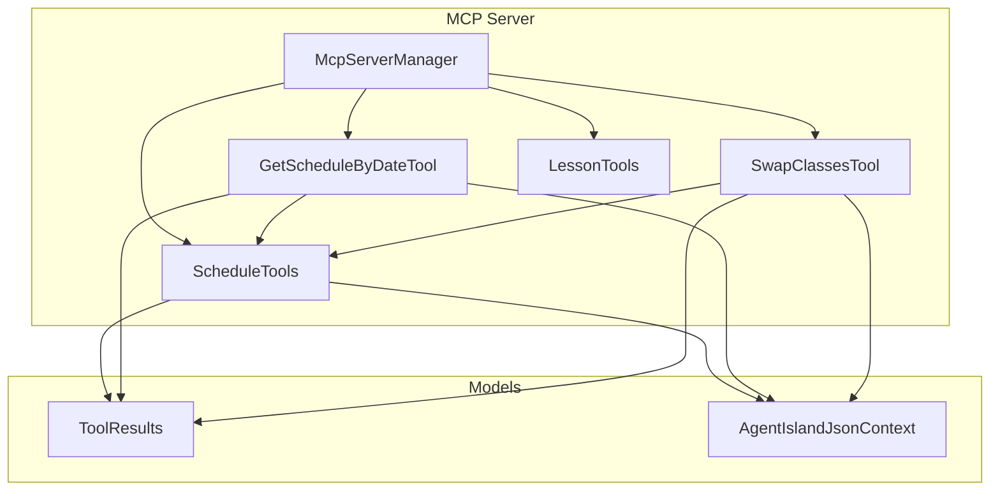
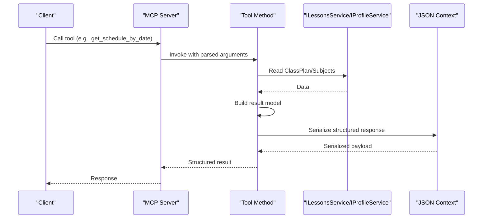
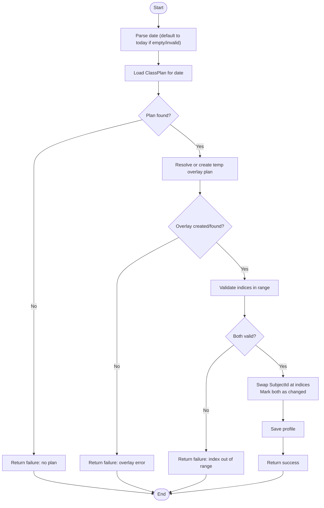
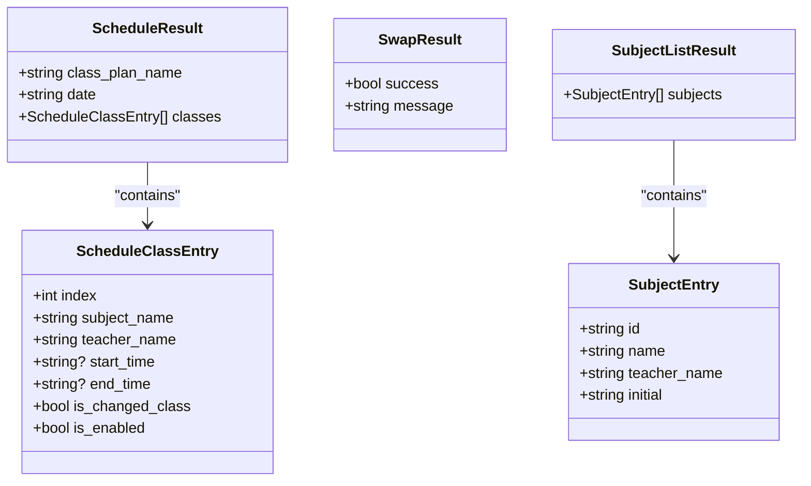
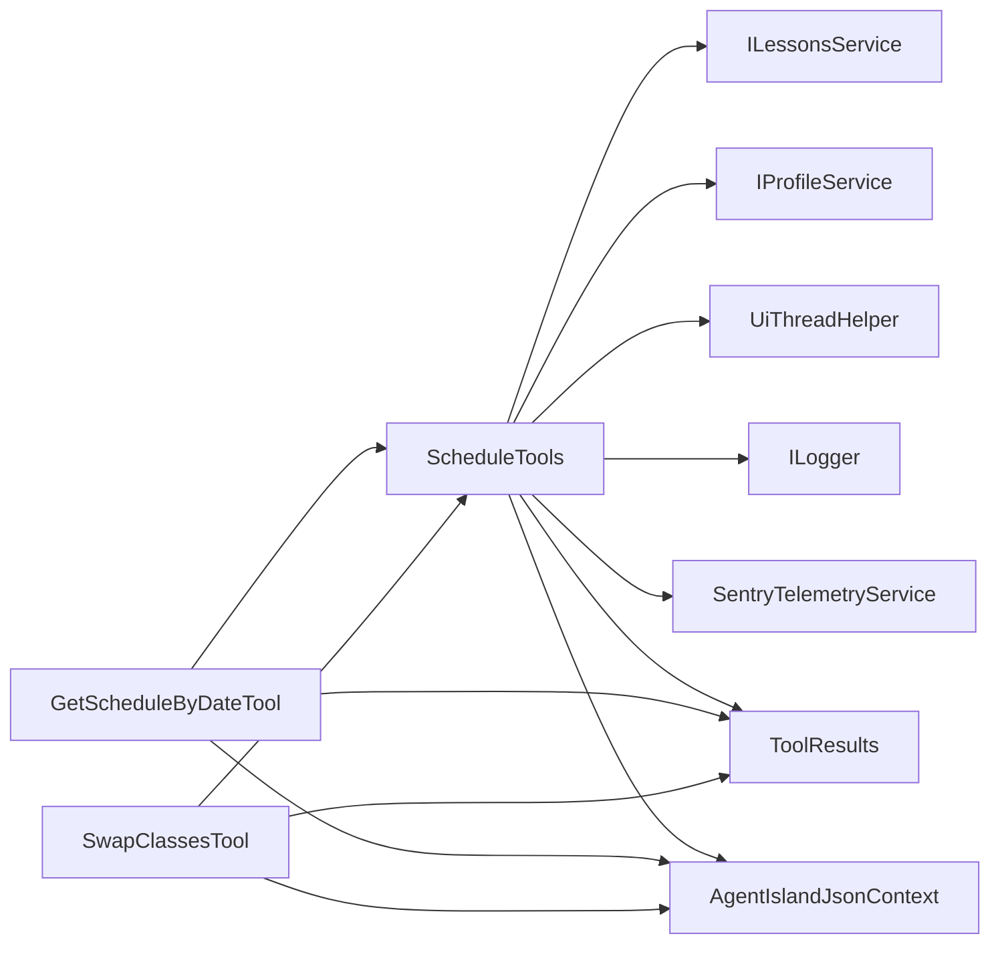

# Schedule Management Tools

<cite>
**Referenced Files in This Document**
- [ScheduleTools.cs](file://Mcp/Tools/ScheduleTools.cs)
- [GetScheduleByDateTool.cs](file://Mcp/Tools/GetScheduleByDateTool.cs)
- [SwapClassesTool.cs](file://Mcp/Tools/SwapClassesTool.cs)
- [LessonTools.cs](file://Mcp/Tools/LessonTools.cs)
- [ToolResults.cs](file://Models/ToolResults.cs)
- [AgentIslandJsonContext.cs](file://Models/AgentIslandJsonContext.cs)
- [McpServerManager.cs](file://Mcp/McpServerManager.cs)
- [README.md](file://README.md)
</cite>

## Table of Contents
1. [Introduction](#introduction)
2. [Project Structure](#project-structure)
3. [Core Components](#core-components)
4. [Architecture Overview](#architecture-overview)
5. [Detailed Component Analysis](#detailed-component-analysis)
6. [Dependency Analysis](#dependency-analysis)
7. [Performance Considerations](#performance-considerations)
8. [Troubleshooting Guide](#troubleshooting-guide)
9. [Conclusion](#conclusion)
10. [Appendices](#appendices)

## Introduction
This document provides comprehensive documentation for schedule management tools exposed by the AgentIsland plugin as an MCP server. It focuses on:
- get_today_schedule
- get_schedule_by_date
- list_subjects
- swap_classes

It explains request/response schemas, date parsing rules, schedule data structures, class swapping operations, validation and business logic constraints, transaction handling, and integration patterns with external scheduling systems.

## Project Structure
The schedule-related functionality is implemented under Mcp/Tools and Models:
- ScheduleTools.cs: Core logic for today’s schedule, schedule by date, subject listing, and class swapping.
- GetScheduleByDateTool.cs: MCP tool wrapper for querying a schedule by date.
- SwapClassesTool.cs: MCP tool wrapper for swapping classes.
- LessonTools.cs: Related lesson-time utilities (current/next class, time status).
- ToolResults.cs: Result models used across tools.
- AgentIslandJsonContext.cs: JSON serialization context for structured responses.
- McpServerManager.cs: Registers and starts the MCP server with these tools.

**Diagram sources**
- [McpServerManager.cs](file://Mcp/McpServerManager.cs)
- [GetScheduleByDateTool.cs](file://Mcp/Tools/GetScheduleByDateTool.cs)
- [SwapClassesTool.cs](file://Mcp/Tools/SwapClassesTool.cs)
- [ScheduleTools.cs](file://Mcp/Tools/ScheduleTools.cs)
- [LessonTools.cs](file://Mcp/Tools/LessonTools.cs)
- [ToolResults.cs](file://Models/ToolResults.cs)
- [AgentIslandJsonContext.cs](file://Models/AgentIslandJsonContext.cs)

**Section sources**
- [README.md](file://README.md)
- [McpServerManager.cs](file://Mcp/McpServerManager.cs)

## Core Components
- ScheduleTools: Implements core methods for reading schedules and swapping classes.
- GetScheduleByDateTool: Exposes get_schedule_by_date via MCP with input schema and structured output.
- SwapClassesTool: Exposes swap_classes via MCP with typed parameters and structured output.
- LessonTools: Provides related time-aware queries (not the focus here but useful for integrations).
- ToolResults: Defines all response records used by the above tools.
- AgentIslandJsonContext: Ensures consistent camelCase serialization for structured outputs.

Key responsibilities:
- Date parsing and normalization to yyyy-MM-dd.
- Building schedule results from ClassPlan and profile subjects.
- Creating or reusing temporary overlay plans for swaps.
- Persisting changes through profile save.

**Section sources**
- [ScheduleTools.cs](file://Mcp/Tools/ScheduleTools.cs)
- [GetScheduleByDateTool.cs](file://Mcp/Tools/GetScheduleByDateTool.cs)
- [SwapClassesTool.cs](file://Mcp/Tools/SwapClassesTool.cs)
- [ToolResults.cs](file://Models/ToolResults.cs)
- [AgentIslandJsonContext.cs](file://Models/AgentIslandJsonContext.cs)

## Architecture Overview
The MCP server registers multiple tools. For schedule operations:
- Clients call get_today_schedule, get_schedule_by_date, list_subjects, or swap_classes.
- The corresponding tool method executes on the UI thread.
- Data is read from ILessonsService and IProfileService.
- Responses are serialized using the shared JSON context.

**Diagram sources**
- [McpServerManager.cs](file://Mcp/McpServerManager.cs)
- [GetScheduleByDateTool.cs](file://Mcp/Tools/GetScheduleByDateTool.cs)
- [SwapClassesTool.cs](file://Mcp/Tools/SwapClassesTool.cs)
- [ScheduleTools.cs](file://Mcp/Tools/ScheduleTools.cs)
- [AgentIslandJsonContext.cs](file://Models/AgentIslandJsonContext.cs)

## Detailed Component Analysis

### get_today_schedule
- Purpose: Returns today’s schedule based on the current ClassPlan or the plan for today.
- Input: None.
- Output: ScheduleResult with classPlanName, date (yyyy-MM-dd), and classes array.
- Behavior:
  - Resolves today’s ClassPlan; if none exists, returns empty classes.
  - Builds each class entry with index, subject name, teacher, start/end times, IsChangedClass, IsEnabled.
  - Runs on UI thread for safe access to ClassIsland services.

Request/Response Schema
- Request: {}
- Response fields:
  - class_plan_name: string
  - date: string (yyyy-MM-dd)
  - classes: array of ScheduleClassEntry

ScheduleClassEntry fields:
- index: integer
- subject_name: string
- teacher_name: string
- start_time: string? (hh:mm:ss)
- end_time: string? (hh:mm:ss)
- is_changed_class: boolean
- is_enabled: boolean

Example usage
- Query today’s schedule without parameters.

Error scenarios
- If no ClassPlan for today, returns empty classes list.

**Section sources**
- [ScheduleTools.cs](file://Mcp/Tools/ScheduleTools.cs)
- [ToolResults.cs](file://Models/ToolResults.cs)

### get_schedule_by_date
- Purpose: Returns the schedule for a specified date.
- Input:
  - date: string (required, yyyy-MM-dd)
- Output: ScheduleResult.
- Behavior:
  - Parses date; defaults to today if invalid or empty.
  - Retrieves ClassPlan for that date; if not found, returns empty classes.
  - Builds entries similarly to today’s schedule.

Request/Response Schema
- Request: { "date": "YYYY-MM-DD" }
- Response: Same as get_today_schedule.

Examples
- Query schedule for a future date.
- Query with malformed date to trigger default-to-today behavior.

Validation and constraints
- Date must be parseable; otherwise treated as today.
- No ClassPlan yields empty classes.

**Section sources**
- [GetScheduleByDateTool.cs](file://Mcp/Tools/GetScheduleByDateTool.cs)
- [ScheduleTools.cs](file://Mcp/Tools/ScheduleTools.cs)
- [ToolResults.cs](file://Models/ToolResults.cs)

### list_subjects
- Purpose: Lists all configured subjects with metadata.
- Input: None.
- Output: SubjectListResult containing a list of SubjectEntry.

SubjectEntry fields:
- id: string (GUID as string)
- name: string
- teacher_name: string
- initial: string

Behavior:
- Reads subjects from profile and sorts by name using current culture.

Examples
- Retrieve available subjects to validate IDs before swapping.

**Section sources**
- [ScheduleTools.cs](file://Mcp/Tools/ScheduleTools.cs)
- [ToolResults.cs](file://Models/ToolResults.cs)

### swap_classes
- Purpose: Swaps two classes at given indices on a specific date, creating or reusing a temporary overlay plan.
- Input:
  - classIndex1: integer (0-based)
  - classIndex2: integer (0-based)
  - date: string (optional, yyyy-MM-dd; empty means today)
- Output: SwapResult with success flag and message.

Business logic and constraints:
- Requires a valid ClassPlan for the target date; otherwise fails.
- Validates indices within bounds.
- Creates or reuses a temporary overlay ClassPlan tied to the original plan.
- Marks swapped classes as changed and persists profile changes.

Request/Response Schema
- Request: { "classIndex1": int, "classIndex2": int, "date": "YYYY-MM-DD"? }
- Response:
  - success: boolean
  - message: string

Flowchart of swap operation

**Diagram sources**
- [ScheduleTools.cs](file://Mcp/Tools/ScheduleTools.cs)

**Section sources**
- [SwapClassesTool.cs](file://Mcp/Tools/SwapClassesTool.cs)
- [ScheduleTools.cs](file://Mcp/Tools/ScheduleTools.cs)
- [ToolResults.cs](file://Models/ToolResults.cs)

### Data Structures and Relationships

**Diagram sources**
- [ToolResults.cs](file://Models/ToolResults.cs)

## Dependency Analysis
- Tools depend on:
  - ILessonsService for ClassPlan and current/next class info.
  - IProfileService for subjects and saving profile changes.
  - UiThreadHelper to run operations on the UI thread.
  - ILogger for diagnostics.
  - SentryTelemetryService for instrumentation/breadcrumbs.
- Serialization uses AgentIslandJsonContext for consistent camelCase.

**Diagram sources**
- [ScheduleTools.cs](file://Mcp/Tools/ScheduleTools.cs)
- [GetScheduleByDateTool.cs](file://Mcp/Tools/GetScheduleByDateTool.cs)
- [SwapClassesTool.cs](file://Mcp/Tools/SwapClassesTool.cs)
- [ToolResults.cs](file://Models/ToolResults.cs)
- [AgentIslandJsonContext.cs](file://Models/AgentIslandJsonContext.cs)

**Section sources**
- [McpServerManager.cs](file://Mcp/McpServerManager.cs)
- [ScheduleTools.cs](file://Mcp/Tools/ScheduleTools.cs)
- [GetScheduleByDateTool.cs](file://Mcp/Tools/GetScheduleByDateTool.cs)
- [SwapClassesTool.cs](file://Mcp/Tools/SwapClassesTool.cs)
- [ToolResults.cs](file://Models/ToolResults.cs)
- [AgentIslandJsonContext.cs](file://Models/AgentIslandJsonContext.cs)

## Performance Considerations
- All schedule operations execute on the UI thread to safely access ClassIsland services; batch operations should minimize round-trips by combining requests where possible.
- Avoid excessive repeated calls to list_subjects; cache locally when feasible.
- Swap operations persist the profile once per swap; avoid redundant swaps on the same indices.

[No sources needed since this section provides general guidance]

## Troubleshooting Guide
Common issues and resolutions:
- Invalid date format: Ensure dates are yyyy-MM-dd. Empty or unparseable dates default to today for get_schedule_by_date.
- Index out of range: Verify indices against the length of the classes array returned by schedule queries.
- No ClassPlan for date: Swap will fail if there is no plan for the requested date; query first to confirm availability.
- Overlay creation failure: If creating a temporary overlay fails, swap cannot proceed; retry after ensuring the base plan exists.
- Persistence errors: Profile save occurs after swap; check logs for exceptions if changes do not persist.

Operational notes:
- Errors in get_schedule_by_date are captured and returned as structured results with error messages.
- Logging and telemetry breadcrumbs are recorded for tool invocations.

**Section sources**
- [GetScheduleByDateTool.cs](file://Mcp/Tools/GetScheduleByDateTool.cs)
- [ScheduleTools.cs](file://Mcp/Tools/ScheduleTools.cs)

## Conclusion
The schedule management tools provide robust APIs to read and modify ClassIsland timetable data via MCP. They enforce clear validation, handle overlays for non-destructive modifications, and return well-defined structured responses suitable for automation and integration with external scheduling systems.

[No sources needed since this section summarizes without analyzing specific files]

## Appendices

### Integration Patterns
- External system polling: Periodically call get_today_schedule and list_subjects to maintain local state.
- Event-driven updates: On user-triggered actions, call swap_classes and then refresh affected days.
- Batch workflows: Combine list_subjects and get_schedule_by_date to precompute mappings and perform multiple swaps in sequence.

### Example Scenarios
- Complex query: Fetch subjects, then retrieve schedules for a week by iterating dates and aggregating results.
- Bulk operations: Perform multiple swaps across different dates, validating indices and handling failures per day.
- Error scenarios: Attempt swap with invalid indices or missing plan; expect failure messages guiding correction.

[No sources needed since this section provides general guidance]