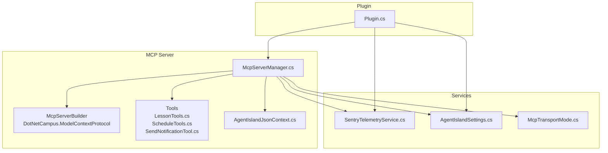
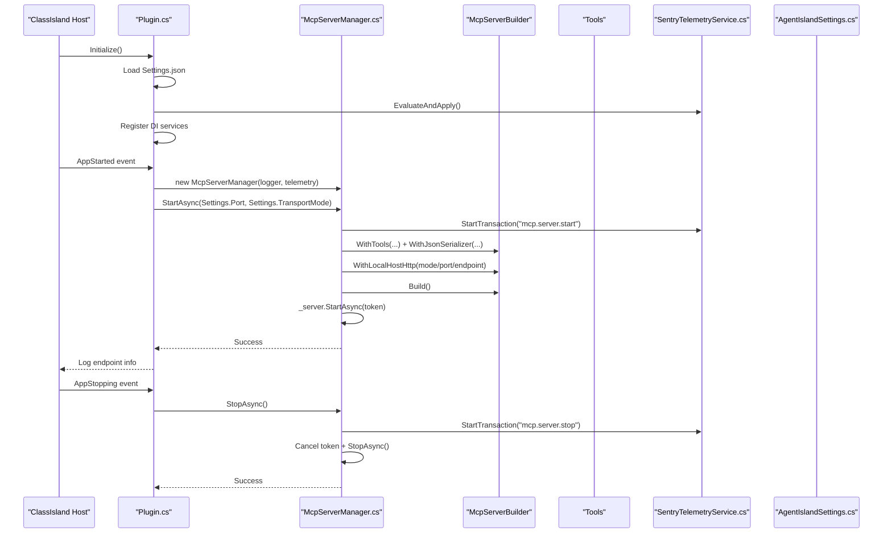
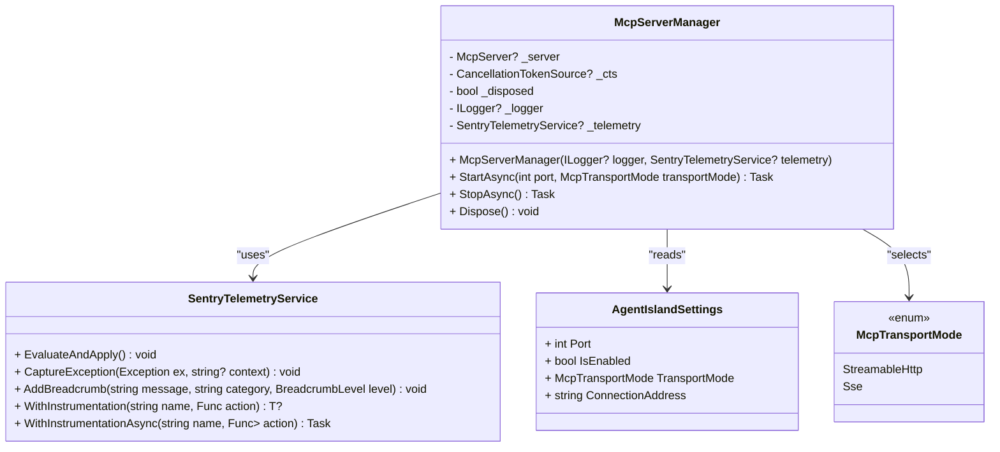
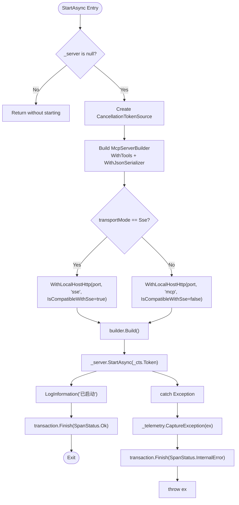
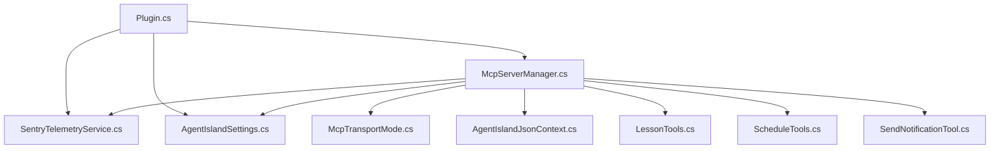

# Server Architecture and Lifecycle

<cite>
**Referenced Files in This Document**
- [Plugin.cs](file://Plugin.cs)
- [McpServerManager.cs](file://Mcp/McpServerManager.cs)
- [SentryTelemetryService.cs](file://Services/SentryTelemetryService.cs)
- [AgentIslandSettings.cs](file://Models/AgentIslandSettings.cs)
- [McpTransportMode.cs](file://Models/McpTransportMode.cs)
- [LessonTools.cs](file://Mcp/Tools/LessonTools.cs)
- [ScheduleTools.cs](file://Mcp/Tools/ScheduleTools.cs)
- [SendNotificationTool.cs](file://Mcp/Tools/SendNotificationTool.cs)
- [ToolResults.cs](file://Models/ToolResults.cs)
- [AgentIslandJsonContext.cs](file://Models/AgentIslandJsonContext.cs)
- [AgentIsland.csproj](file://AgentIsland.csproj)
</cite>

## Table of Contents
1. [Introduction](#introduction)
2. [Project Structure](#project-structure)
3. [Core Components](#core-components)
4. [Architecture Overview](#architecture-overview)
5. [Detailed Component Analysis](#detailed-component-analysis)
6. [Dependency Analysis](#dependency-analysis)
7. [Performance Considerations](#performance-considerations)
8. [Troubleshooting Guide](#troubleshooting-guide)
9. [Conclusion](#conclusion)

## Introduction
This document explains the MCP server architecture and lifecycle management within the AgentIsland plugin. It focuses on the McpServerManager class design, server initialization and shutdown flows, resource management patterns, dependency injection setup, logging integration with Sentry telemetry, error handling strategies, the server builder pattern for configuration, tool registration mechanism, and JSON serialization context. Practical examples are provided to illustrate startup/shutdown procedures, exception handling patterns, and performance monitoring integration.

## Project Structure
The MCP server is implemented as a ClassIsland plugin that starts an HTTP-based MCP server when the host application starts. The key responsibilities are:
- Plugin bootstrap and DI registration
- Server lifecycle management (start/stop)
- Tool discovery and registration via a builder
- Telemetry and logging integration
- Configuration-driven transport mode selection

**Diagram sources**
- [Plugin.cs:29-79](file://Plugin.cs#L29-L79)
- [McpServerManager.cs:25-82](file://Mcp/McpServerManager.cs#L25-L82)
- [SentryTelemetryService.cs:30-69](file://Services/SentryTelemetryService.cs#L30-L69)
- [AgentIslandSettings.cs:34-62](file://Models/AgentIslandSettings.cs#L34-L62)
- [McpTransportMode.cs:6-17](file://Models/McpTransportMode.cs#L6-L17)
- [AgentIslandJsonContext.cs:1-19](file://Models/AgentIslandJsonContext.cs#L1-L19)

**Section sources**
- [Plugin.cs:29-79](file://Plugin.cs#L29-L79)
- [McpServerManager.cs:25-82](file://Mcp/McpServerManager.cs#L25-L82)
- [AgentIslandSettings.cs:34-62](file://Models/AgentIslandSettings.cs#L34-L62)
- [McpTransportMode.cs:6-17](file://Models/McpTransportMode.cs#L6-L17)
- [AgentIslandJsonContext.cs:1-19](file://Models/AgentIslandJsonContext.cs#L1-L19)

## Core Components
- McpServerManager: Orchestrates server lifecycle, builds the server using a builder, registers tools, configures JSON serialization, selects transport mode, and integrates logging and telemetry.
- Plugin: Initializes settings, wires DI, subscribes to app lifecycle events, constructs McpServerManager with dependencies, and manages start/stop.
- SentryTelemetryService: Manages Sentry SDK lifecycle based on user privacy and telemetry settings; provides instrumentation helpers and breadcrumb capture.
- Tools: Implement MCP tool methods or IMcpServerTool interface; use IAppHost to resolve services and integrate telemetry.
- Settings and Transport Mode: Provide configuration values including port, enabled flags, and transport mode selection.
- JSON Context: Provides source-generated serializers for tool results and request/response models.

**Section sources**
- [McpServerManager.cs:11-124](file://Mcp/McpServerManager.cs#L11-L124)
- [Plugin.cs:29-113](file://Plugin.cs#L29-L113)
- [SentryTelemetryService.cs:11-181](file://Services/SentryTelemetryService.cs#L11-L181)
- [LessonTools.cs:12-145](file://Mcp/Tools/LessonTools.cs#L12-L145)
- [ScheduleTools.cs:13-203](file://Mcp/Tools/ScheduleTools.cs#L13-L203)
- [SendNotificationTool.cs:16-136](file://Mcp/Tools/SendNotificationTool.cs#L16-L136)
- [AgentIslandSettings.cs:13-211](file://Models/AgentIslandSettings.cs#L13-L211)
- [McpTransportMode.cs:6-17](file://Models/McpTransportMode.cs#L6-L17)
- [AgentIslandJsonContext.cs:1-19](file://Models/AgentIslandJsonContext.cs#L1-L19)

## Architecture Overview
The system follows a layered architecture:
- Plugin layer: Bootstraps settings, DI, and lifecycle hooks.
- Server management layer: Encapsulates server creation, configuration, and lifecycle.
- Tooling layer: Implements domain-specific tools exposed via MCP.
- Telemetry layer: Integrates Sentry for exceptions, breadcrumbs, and transactions.
- Configuration layer: Provides runtime settings and transport mode selection.
- Serialization layer: Uses System.Text.Json source generation for efficient serialization.

**Diagram sources**
- [Plugin.cs:55-97](file://Plugin.cs#L55-L97)
- [McpServerManager.cs:25-112](file://Mcp/McpServerManager.cs#L25-L112)
- [SentryTelemetryService.cs:30-69](file://Services/SentryTelemetryService.cs#L30-L69)
- [AgentIslandSettings.cs:34-62](file://Models/AgentIslandSettings.cs#L34-L62)

## Detailed Component Analysis

### McpServerManager Design and Lifecycle
Responsibilities:
- Construct and configure the server using a builder pattern.
- Register tools via WithTools callback.
- Configure JSON serialization context.
- Select transport mode (StreamableHttp vs SSE).
- Manage CancellationTokenSource for graceful shutdown.
- Integrate logging and Sentry telemetry around start/stop operations.
- Implement IDisposable to ensure cleanup.

Key behaviors:
- StartAsync creates a transaction, builds the server, starts it, logs success, and finishes the transaction. Exceptions are captured by telemetry and rethrown.
- StopAsync cancels the token, stops the server, disposes the token source, logs completion, and handles errors with telemetry.
- Dispose calls StopAsync synchronously and marks disposed state.

**Diagram sources**
- [McpServerManager.cs:11-124](file://Mcp/McpServerManager.cs#L11-L124)
- [SentryTelemetryService.cs:11-181](file://Services/SentryTelemetryService.cs#L11-L181)
- [AgentIslandSettings.cs:34-62](file://Models/AgentIslandSettings.cs#L34-L62)
- [McpTransportMode.cs:6-17](file://Models/McpTransportMode.cs#L6-L17)

**Section sources**
- [McpServerManager.cs:25-112](file://Mcp/McpServerManager.cs#L25-L112)

### Dependency Injection Setup
- Plugin.Initialize loads settings from file and persists changes back.
- Registers singleton instances for settings and telemetry service.
- Adds notification provider, components, settings pages, and actions to the host’s DI container.
- Subscribes to AppStarted and AppStopping events to manage server lifecycle.
- Resolves ILogger and constructs McpServerManager with injected dependencies.

Practical example references:
- Startup wiring and server construction: [Plugin.cs:55-79](file://Plugin.cs#L55-L79)
- Shutdown wiring: [Plugin.cs:81-97](file://Plugin.cs#L81-L97)
- DI registrations: [Plugin.cs:40-49](file://Plugin.cs#L40-L49)

**Section sources**
- [Plugin.cs:29-53](file://Plugin.cs#L29-L53)
- [Plugin.cs:55-97](file://Plugin.cs#L55-L97)

### Server Initialization Process
- On AppStarted, if enabled, Plugin constructs McpServerManager with logger and telemetry.
- Calls StartAsync with configured port and transport mode.
- McpServerManager:
  - Starts a Sentry transaction for tracing.
  - Creates a CancellationTokenSource.
  - Builds server with tools and JSON serializer context.
  - Configures local HTTP transport based on transport mode (SSE vs StreamableHttp).
  - Starts the server asynchronously.
  - Logs success and finishes the transaction.
  - Captures exceptions and finishes the transaction with error status.

**Diagram sources**
- [McpServerManager.cs:25-82](file://Mcp/McpServerManager.cs#L25-L82)

**Section sources**
- [McpServerManager.cs:25-82](file://Mcp/McpServerManager.cs#L25-L82)

### Resource Management Patterns
- CancellationTokenSource is created per server instance and canceled during stop to signal cancellation to underlying transports.
- Server reference is set to null after stopping to allow GC.
- Token source is disposed after stop to release resources.
- McpServerManager implements IDisposable and ensures synchronous disposal path calls StopAsync.

Best practices observed:
- Idempotent start: early return if already started.
- Defensive disposal: checks for null and disposed flags.
- Transaction boundaries around critical operations for observability.

**Section sources**
- [McpServerManager.cs:84-124](file://Mcp/McpServerManager.cs#L84-L124)

### Server Builder Pattern and Tool Registration
- The builder is constructed with server metadata (name, version).
- Tools are registered via WithTools callback:
  - Some tools are registered by type (e.g., LessonTools, ScheduleTools).
  - Others are registered with explicit instances (e.g., SwapClassesTool, GetScheduleByDateTool, SendNotificationTool, SetComponentTextTool).
- JSON serialization context is provided via WithJsonSerializer(AgentIslandJsonContext.Default), enabling source-generated serializers for tool results.

Examples:
- Tool registration block: [McpServerManager.cs:41-51](file://Mcp/McpServerManager.cs#L41-L51)
- JSON context declaration: [AgentIslandJsonContext.cs:1-19](file://Models/AgentIslandJsonContext.cs#L1-L19)

**Section sources**
- [McpServerManager.cs:41-51](file://Mcp/McpServerManager.cs#L41-L51)
- [AgentIslandJsonContext.cs:1-19](file://Models/AgentIslandJsonContext.cs#L1-L19)

### Logging Integration with Sentry Telemetry
- SentryTelemetryService initializes Sentry SDK based on settings (privacy consent and DSN).
- It adds tags and breadcrumbs for context.
- Provides WithInstrumentation wrappers for sync and async operations to automatically create transactions, add breadcrumbs, and capture exceptions.
- McpServerManager uses telemetry to wrap start/stop operations and log informational messages.

Practical usage references:
- Service evaluation and initialization: [SentryTelemetryService.cs:30-69](file://Services/SentryTelemetryService.cs#L30-L69)
- Instrumentation helpers: [SentryTelemetryService.cs:127-174](file://Services/SentryTelemetryService.cs#L127-L174)
- Server start/stop telemetry: [McpServerManager.cs:33-81](file://Mcp/McpServerManager.cs#L33-L81), [McpServerManager.cs:87-111](file://Mcp/McpServerManager.cs#L87-L111)

**Section sources**
- [SentryTelemetryService.cs:30-69](file://Services/SentryTelemetryService.cs#L30-L69)
- [SentryTelemetryService.cs:127-174](file://Services/SentryTelemetryService.cs#L127-L174)
- [McpServerManager.cs:33-81](file://Mcp/McpServerManager.cs#L33-L81)
- [McpServerManager.cs:87-111](file://Mcp/McpServerManager.cs#L87-L111)

### Error Handling Strategies
- Server start/stop: try/catch captures exceptions, reports via telemetry, finishes transactions with error status, and rethrows.
- Tool implementations:
  - Methods wrapped with WithInstrumentation to capture exceptions and finish transactions.
  - Manual try/catch in some tools (e.g., schedule swap) returns structured error results rather than throwing.
  - SendNotificationTool parses input arguments and returns structured error responses while capturing exceptions.

References:
- Server error handling: [McpServerManager.cs:76-81](file://Mcp/McpServerManager.cs#L76-L81), [McpServerManager.cs:106-111](file://Mcp/McpServerManager.cs#L106-L111)
- Tool instrumentation: [LessonTools.cs:17-20](file://Mcp/Tools/LessonTools.cs#L17-20), [ScheduleTools.cs:18-21](file://Mcp/Tools/ScheduleTools.cs#L18-21)
- Structured error result: [ScheduleTools.cs:98-102](file://Mcp/Tools/ScheduleTools.cs#L98-L102)
- Notification tool error handling: [SendNotificationTool.cs:98-104](file://Mcp/Tools/SendNotificationTool.cs#L98-L104)

**Section sources**
- [McpServerManager.cs:76-81](file://Mcp/McpServerManager.cs#L76-L81)
- [McpServerManager.cs:106-111](file://Mcp/McpServerManager.cs#L106-L111)
- [LessonTools.cs:17-20](file://Mcp/Tools/LessonTools.cs#L17-20)
- [ScheduleTools.cs:98-102](file://Mcp/Tools/ScheduleTools.cs#L98-L102)
- [SendNotificationTool.cs:98-104](file://Mcp/Tools/SendNotificationTool.cs#L98-L104)

### JSON Serialization Context
- AgentIslandJsonContext declares serializable types used by tools and results.
- Property naming policy is set to camelCase for consistent JSON output.
- Used by McpServerManager to configure the server’s JSON serializer.

References:
- Context definition: [AgentIslandJsonContext.cs:1-19](file://Models/AgentIslandJsonContext.cs#L1-L19)
- Usage in server builder: [McpServerManager.cs:51](file://Mcp/McpServerManager.cs#L51)

**Section sources**
- [AgentIslandJsonContext.cs:1-19](file://Models/AgentIslandJsonContext.cs#L1-L19)
- [McpServerManager.cs:51](file://Mcp/McpServerManager.cs#L51)

### Practical Examples

#### Server Startup Procedure
- Plugin loads settings and telemetry, then on AppStarted constructs McpServerManager and calls StartAsync with configured port and transport mode.
- McpServerManager builds server, registers tools, configures JSON serializer, selects transport endpoint, starts server, and logs success.

References:
- Startup flow: [Plugin.cs:55-79](file://Plugin.cs#L55-L79)
- Server build and start: [McpServerManager.cs:41-74](file://Mcp/McpServerManager.cs#L41-L74)

#### Server Shutdown Procedure
- On AppStopping, Plugin calls StopAsync on McpServerManager.
- McpServerManager cancels token, stops server, disposes token source, logs completion, and handles errors with telemetry.

References:
- Shutdown flow: [Plugin.cs:81-97](file://Plugin.cs#L81-L97)
- Stop implementation: [McpServerManager.cs:84-112](file://Mcp/McpServerManager.cs#L84-L112)

#### Exception Handling Patterns
- Wrap critical operations with try/catch, capture exceptions via telemetry, finish transactions with error status, and either rethrow or return structured error results depending on context.

References:
- Server start/stop: [McpServerManager.cs:76-81](file://Mcp/McpServerManager.cs#L76-L81), [McpServerManager.cs:106-111](file://Mcp/McpServerManager.cs#L106-L111)
- Tool-level handling: [ScheduleTools.cs:98-102](file://Mcp/Tools/ScheduleTools.cs#L98-L102), [SendNotificationTool.cs:98-104](file://Mcp/Tools/SendNotificationTool.cs#L98-L104)

#### Performance Monitoring Integration
- Use Sentry transactions for server start/stop and tool calls.
- Add breadcrumbs for lifecycle events and tool invocations.
- Leverage WithInstrumentation helpers to minimize boilerplate and ensure consistent telemetry.

References:
- Transactions and breadcrumbs: [SentryTelemetryService.cs:30-69](file://Services/SentryTelemetryService.cs#L30-L69), [SentryTelemetryService.cs:127-174](file://Services/SentryTelemetryService.cs#L127-L174)
- Server telemetry: [McpServerManager.cs:33-81](file://Mcp/McpServerManager.cs#L33-L81), [McpServerManager.cs:87-111](file://Mcp/McpServerManager.cs#L87-L111)

## Dependency Analysis
The following diagram shows core dependencies between components:

**Diagram sources**
- [Plugin.cs:29-79](file://Plugin.cs#L29-L79)
- [McpServerManager.cs:25-82](file://Mcp/McpServerManager.cs#L25-L82)
- [SentryTelemetryService.cs:30-69](file://Services/SentryTelemetryService.cs#L30-L69)
- [AgentIslandSettings.cs:34-62](file://Models/AgentIslandSettings.cs#L34-L62)
- [McpTransportMode.cs:6-17](file://Models/McpTransportMode.cs#L6-L17)
- [AgentIslandJsonContext.cs:1-19](file://Models/AgentIslandJsonContext.cs#L1-L19)
- [LessonTools.cs:12-145](file://Mcp/Tools/LessonTools.cs#L12-L145)
- [ScheduleTools.cs:13-203](file://Mcp/Tools/ScheduleTools.cs#L13-L203)
- [SendNotificationTool.cs:16-136](file://Mcp/Tools/SendNotificationTool.cs#L16-L136)

**Section sources**
- [Plugin.cs:29-79](file://Plugin.cs#L29-L79)
- [McpServerManager.cs:25-82](file://Mcp/McpServerManager.cs#L25-L82)

## Performance Considerations
- Source-generated JSON serialization via AgentIslandJsonContext reduces reflection overhead and improves throughput for tool results.
- Using WithInstrumentation helpers centralizes telemetry overhead and avoids redundant code paths.
- Avoid unnecessary allocations in tool implementations; reuse constants where possible.
- Prefer async operations for I/O-bound tasks and propagate cancellation tokens to avoid blocking.
- Keep transactions focused on meaningful boundaries to reduce noise in telemetry data.

[No sources needed since this section provides general guidance]

## Troubleshooting Guide
Common issues and resolutions:
- Server fails to start due to port conflict:
  - Verify configured port and transport mode in settings.
  - Check logs for error messages and telemetry captures.
  - References: [McpServerManager.cs:76-81](file://Mcp/McpServerManager.cs#L76-L81)
- Telemetry not reporting:
  - Ensure telemetry is active and privacy policy agreed or custom DSN provided.
  - Confirm Sentry SDK initialized and DSN effective.
  - References: [SentryTelemetryService.cs:30-69](file://Services/SentryTelemetryService.cs#L30-L69), [AgentIslandSettings.cs:178-199](file://Models/AgentIslandSettings.cs#L178-L199)
- Tool execution errors:
  - Inspect breadcrumbs and transactions for tool names and contexts.
  - Review structured error results returned by tools.
  - References: [SentryTelemetryService.cs:127-174](file://Services/SentryTelemetryService.cs#L127-L174), [ScheduleTools.cs:98-102](file://Mcp/Tools/ScheduleTools.cs#L98-L102), [SendNotificationTool.cs:98-104](file://Mcp/Tools/SendNotificationTool.cs#L98-L104)

**Section sources**
- [McpServerManager.cs:76-81](file://Mcp/McpServerManager.cs#L76-L81)
- [SentryTelemetryService.cs:30-69](file://Services/SentryTelemetryService.cs#L30-L69)
- [AgentIslandSettings.cs:178-199](file://Models/AgentIslandSettings.cs#L178-L199)
- [SentryTelemetryService.cs:127-174](file://Services/SentryTelemetryService.cs#L127-L174)
- [ScheduleTools.cs:98-102](file://Mcp/Tools/ScheduleTools.cs#L98-L102)
- [SendNotificationTool.cs:98-104](file://Mcp/Tools/SendNotificationTool.cs#L98-L104)

## Conclusion
The AgentIsland MCP server leverages a clear separation of concerns: plugin bootstrapping, server lifecycle management, tool registration, telemetry integration, and configuration-driven behavior. The McpServerManager encapsulates server construction and lifecycle, while SentryTelemetryService provides robust observability. The builder pattern simplifies configuration and tool registration, and source-generated JSON serialization enhances performance. Proper error handling and resource management ensure reliability and maintainability.

[No sources needed since this section summarizes without analyzing specific files]