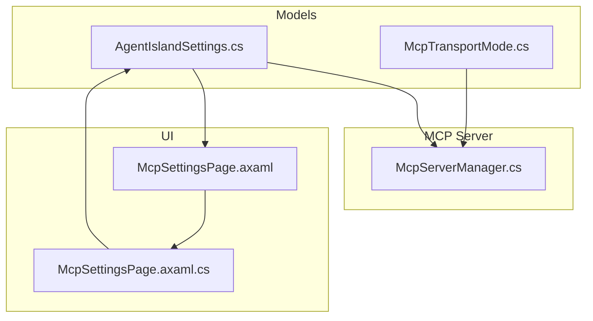
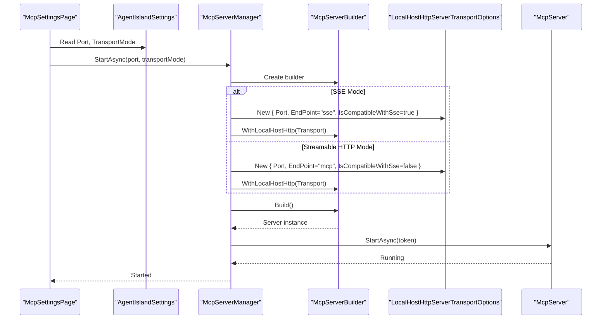
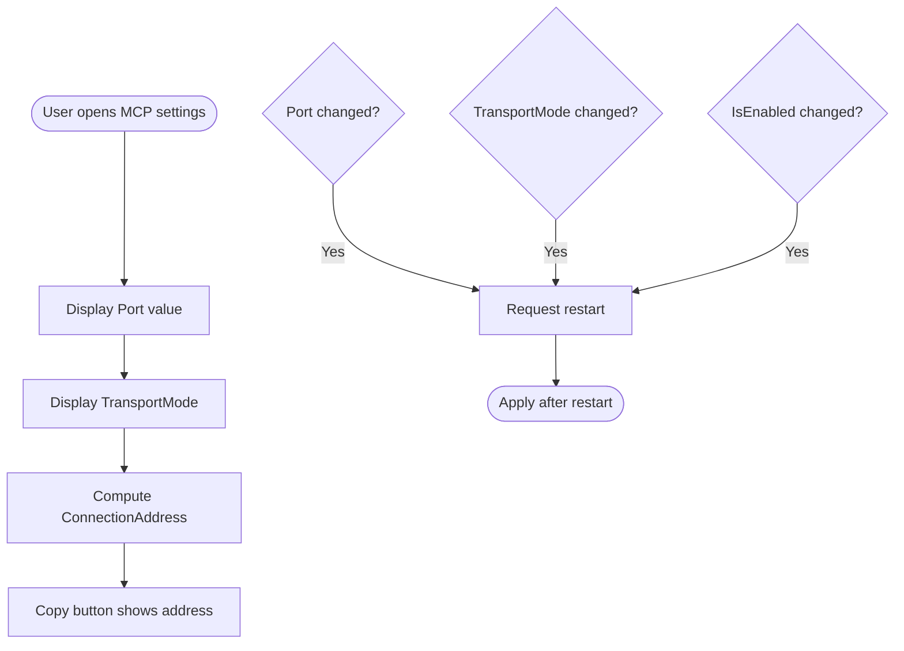
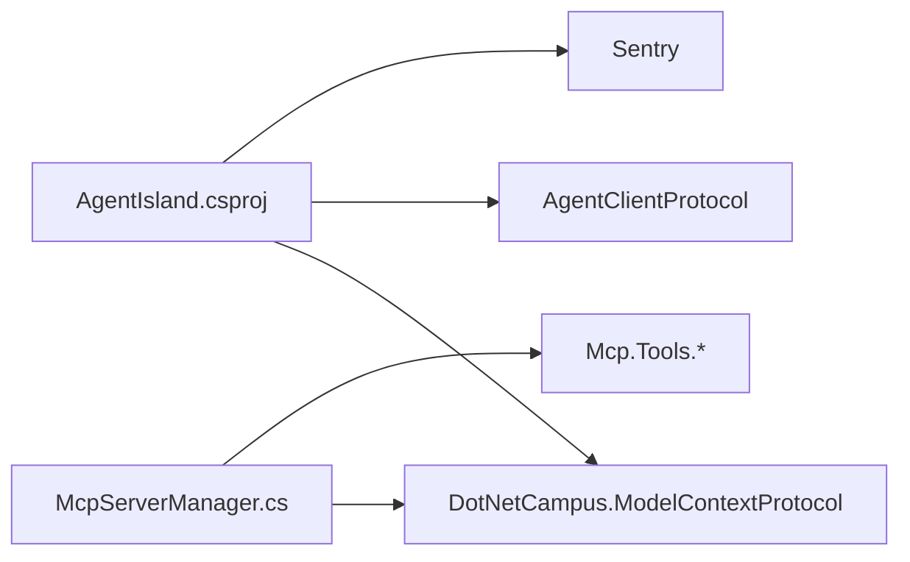

# Transport Modes and Configuration

<cite>
**Referenced Files in This Document**
- [McpTransportMode.cs](file://Models/McpTransportMode.cs)
- [McpServerManager.cs](file://Mcp/McpServerManager.cs)
- [AgentIslandSettings.cs](file://Models/AgentIslandSettings.cs)
- [McpSettingsPage.axaml](file://Views/SettingsPages/McpSettingsPage.axaml)
- [McpSettingsPage.axaml.cs](file://Views/SettingsPages/McpSettingsPage.axaml.cs)
- [AgentIsland.csproj](file://AgentIsland.csproj)
</cite>

## Table of Contents
1. [Introduction](#introduction)
2. [Project Structure](#project-structure)
3. [Core Components](#core-components)
4. [Architecture Overview](#architecture-overview)
5. [Detailed Component Analysis](#detailed-component-analysis)
6. [Dependency Analysis](#dependency-analysis)
7. [Performance Considerations](#performance-considerations)
8. [Troubleshooting Guide](#troubleshooting-guide)
9. [Conclusion](#conclusion)

## Introduction
This document explains the MCP transport modes supported by the application, how they are configured, and how clients connect to the server. It focuses on:
- The difference between Streamable HTTP and SSE (Server-Sent Events) transport modes
- Endpoint configuration and compatibility settings
- The LocalHostHttpServerTransportOptions properties used during server startup
- Practical configuration examples for both transport modes
- Network security considerations and client connection patterns
- Troubleshooting guidance for common transport-related issues

## Project Structure
The MCP transport behavior is implemented across a small set of focused components:
- A transport mode enumeration that defines available protocols
- A server manager that configures and starts the MCP server with the selected transport
- Settings that expose user-configurable options such as port and transport mode
- UI bindings that reflect these options and provide helper actions like copying the connection address

**Diagram sources**
- [McpTransportMode.cs:1-18](file://Models/McpTransportMode.cs#L1-L18)
- [AgentIslandSettings.cs:34-62](file://Models/AgentIslandSettings.cs#L34-L62)
- [McpServerManager.cs:25-82](file://Mcp/McpServerManager.cs#L25-L82)
- [McpSettingsPage.axaml:16-49](file://Views/SettingsPages/McpSettingsPage.axaml#L16-L49)
- [McpSettingsPage.axaml.cs:26-41](file://Views/SettingsPages/McpSettingsPage.axaml.cs#L26-L41)

**Section sources**
- [McpTransportMode.cs:1-18](file://Models/McpTransportMode.cs#L1-L18)
- [AgentIslandSettings.cs:34-62](file://Models/AgentIslandSettings.cs#L34-L62)
- [McpServerManager.cs:25-82](file://Mcp/McpServerManager.cs#L25-L82)
- [McpSettingsPage.axaml:16-49](file://Views/SettingsPages/McpSettingsPage.axaml#L16-L49)
- [McpSettingsPage.axaml.cs:26-41](file://Views/SettingsPages/McpSettingsPage.axaml.cs#L26-L41)

## Core Components
- McpTransportMode: Defines the available transport protocols for the MCP server.
- AgentIslandSettings: Exposes user-configurable options including Port and TransportMode, and computes the ConnectionAddress based on current settings.
- McpServerManager: Builds and starts the MCP server using DotNetCampus.ModelContextProtocol, selecting the appropriate endpoint and compatibility flags based on the chosen transport mode.
- McpSettingsPage: Provides the UI for enabling the server, setting the port, choosing the transport mode, and copying the connection address.

Key responsibilities:
- Transport selection logic resides in the server manager.
- User-facing configuration is centralized in settings and bound to the UI.
- The connection address is derived from the active transport mode and port.

**Section sources**
- [McpTransportMode.cs:1-18](file://Models/McpTransportMode.cs#L1-L18)
- [AgentIslandSettings.cs:34-62](file://Models/AgentIslandSettings.cs#L34-L62)
- [AgentIslandSettings.cs:201-211](file://Models/AgentIslandSettings.cs#L201-L211)
- [McpServerManager.cs:25-82](file://Mcp/McpServerManager.cs#L25-L82)
- [McpSettingsPage.axaml:16-49](file://Views/SettingsPages/McpSettingsPage.axaml#L16-L49)
- [McpSettingsPage.axaml.cs:26-41](file://Views/SettingsPages/McpSettingsPage.axaml.cs#L26-L41)

## Architecture Overview
At runtime, the server manager constructs an MCP server builder and configures it with a local HTTP transport. The transport configuration depends on the selected transport mode:
- For SSE mode, the server uses an SSE-compatible endpoint and enables SSE compatibility.
- For Streamable HTTP mode, the server uses a different endpoint and disables SSE compatibility.

**Diagram sources**
- [McpServerManager.cs:25-82](file://Mcp/McpServerManager.cs#L25-L82)
- [AgentIslandSettings.cs:201-211](file://Models/AgentIslandSettings.cs#L201-L211)

## Detailed Component Analysis

### Transport Modes: Streamable HTTP vs SSE
- Streamable HTTP:
  - Modern transport protocol.
  - Uses the “mcp” endpoint path.
  - SSE compatibility flag is disabled.
- SSE (Server-Sent Events):
  - Legacy transport protocol.
  - Uses the “sse” endpoint path.
  - SSE compatibility flag is enabled.

These behaviors are determined at server start time based on the selected transport mode.

**Section sources**
- [McpTransportMode.cs:1-18](file://Models/McpTransportMode.cs#L1-L18)
- [McpServerManager.cs:53-67](file://Mcp/McpServerManager.cs#L53-L67)

### LocalHostHttpServerTransportOptions Properties
The following properties are configured when building the local HTTP transport:
- Port: The TCP port the server listens on.
- EndPoint: The URL path segment for the MCP service.
  - “sse” for SSE mode.
  - “mcp” for Streamable HTTP mode.
- IsCompatibleWithSse: Boolean flag indicating whether SSE compatibility is enabled.
  - true for SSE mode.
  - false for Streamable HTTP mode.

These values are set conditionally depending on the selected transport mode.

**Section sources**
- [McpServerManager.cs:53-67](file://Mcp/McpServerManager.cs#L53-L67)

### Settings and UI Bindings
- Port: Configurable via numeric input; changes trigger a restart request.
- TransportMode: Selected via combo box; currently defaults to Streamable HTTP and SSE is disabled in UI.
- ConnectionAddress: Computed property that returns the full local URL based on Port and TransportMode.
- Restart Behavior: Changing IsEnabled, Port, or TransportMode triggers a restart prompt.

**Diagram sources**
- [McpSettingsPage.axaml:25-49](file://Views/SettingsPages/McpSettingsPage.axaml#L25-L49)
- [McpSettingsPage.axaml.cs:33-41](file://Views/SettingsPages/McpSettingsPage.axaml.cs#L33-L41)
- [AgentIslandSettings.cs:201-211](file://Models/AgentIslandSettings.cs#L201-L211)

**Section sources**
- [AgentIslandSettings.cs:34-62](file://Models/AgentIslandSettings.cs#L34-L62)
- [AgentIslandSettings.cs:201-211](file://Models/AgentIslandSettings.cs#L201-L211)
- [McpSettingsPage.axaml:25-49](file://Views/SettingsPages/McpSettingsPage.axaml#L25-L49)
- [McpSettingsPage.axaml.cs:33-41](file://Views/SettingsPages/McpSettingsPage.axaml.cs#L33-L41)

### Client Connection Patterns
Clients should connect to the local server using the computed connection address:
- Streamable HTTP: http://localhost:{Port}/mcp
- SSE: http://localhost:{Port}/sse

The application exposes a read-only ConnectionAddress property that reflects the correct URL based on the current transport mode and port.

**Section sources**
- [AgentIslandSettings.cs:201-211](file://Models/AgentIslandSettings.cs#L201-L211)

### Configuration Examples
- Streamable HTTP example:
  - Port: any valid TCP port (e.g., 5943)
  - TransportMode: StreamableHttp
  - Resulting endpoint: /mcp
  - Full address: http://localhost:{Port}/mcp
- SSE example:
  - Port: any valid TCP port
  - TransportMode: Sse
  - Resulting endpoint: /sse
  - Full address: http://localhost:{Port}/sse

Note: In the current UI, SSE is disabled for selection; Streamable HTTP is the default and recommended mode.

**Section sources**
- [McpServerManager.cs:53-67](file://Mcp/McpServerManager.cs#L53-L67)
- [McpSettingsPage.axaml:38-49](file://Views/SettingsPages/McpSettingsPage.axaml#L38-L49)

### Network Security Considerations
- Localhost binding: The server binds to localhost only, limiting access to the local machine.
- Port selection: Choose a non-conflicting port within the valid range.
- Firewall rules: Ensure local firewall allows inbound traffic on the chosen port if needed by other local processes.
- CORS: Not configured for the MCP server in this project; cross-origin concerns apply only to web-based clients accessing localhost endpoints.

[No sources needed since this section provides general guidance]

## Dependency Analysis
The MCP server relies on external packages for transport and protocol handling. The project references the Model Context Protocol package which provides the server builder and transport options used in the implementation.

**Diagram sources**
- [AgentIsland.csproj:22-29](file://AgentIsland.csproj#L22-L29)
- [McpServerManager.cs:1-8](file://Mcp/McpServerManager.cs#L1-L8)

**Section sources**
- [AgentIsland.csproj:22-29](file://AgentIsland.csproj#L22-L29)
- [McpServerManager.cs:1-8](file://Mcp/McpServerManager.cs#L1-L8)

## Performance Considerations
- Prefer Streamable HTTP for modern clients due to improved efficiency and reduced overhead compared to SSE.
- Avoid unnecessary restarts by finalizing configuration before starting the server.
- Use a dedicated, non-conflicting port to prevent contention with other services.

[No sources needed since this section provides general guidance]

## Troubleshooting Guide
Common issues and resolutions:
- Port already in use:
  - Symptom: Server fails to start.
  - Action: Select a different port and restart the server.
- Wrong endpoint path:
  - Symptom: Clients cannot reach the server.
  - Action: Verify the endpoint matches the selected transport mode (“mcp” for Streamable HTTP, “sse” for SSE).
- SSE not selectable in UI:
  - Symptom: SSE option is disabled.
  - Action: Use Streamable HTTP; SSE is currently disabled in the UI.
- Connection address mismatch:
  - Symptom: Client connects to wrong URL.
  - Action: Use the ConnectionAddress provided by the settings page, which updates automatically when Port or TransportMode changes.
- Restart required:
  - Symptom: Changes to IsEnabled, Port, or TransportMode do not take effect immediately.
  - Action: Apply changes by restarting the server as prompted by the UI.

**Section sources**
- [McpServerManager.cs:25-82](file://Mcp/McpServerManager.cs#L25-L82)
- [McpSettingsPage.axaml.cs:33-41](file://Views/SettingsPages/McpSettingsPage.axaml.cs#L33-L41)
- [AgentIslandSettings.cs:201-211](file://Models/AgentIslandSettings.cs#L201-L211)

## Conclusion
The application supports two MCP transport modes: Streamable HTTP (recommended) and SSE (legacy). Transport-specific endpoints and compatibility flags are configured at server startup based on the selected mode. Users configure the server through the MCP settings page, where they can choose the transport mode, set the listening port, and copy the resulting connection address. For most scenarios, Streamable HTTP provides better performance and compatibility with modern clients.

[No sources needed since this section summarizes without analyzing specific files]