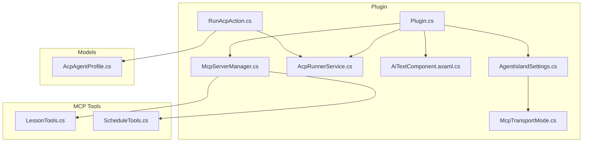
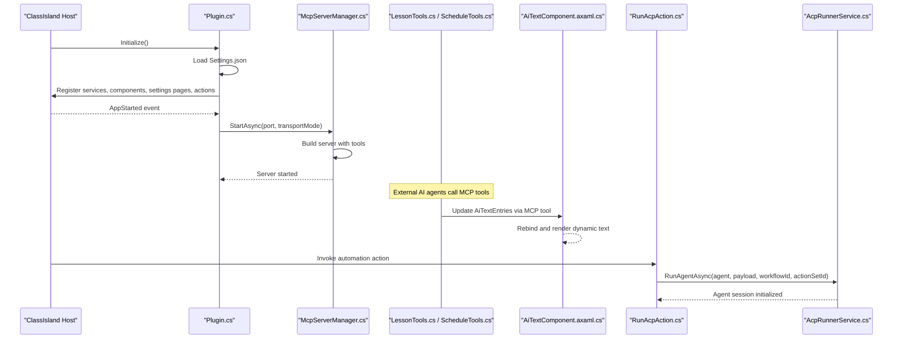
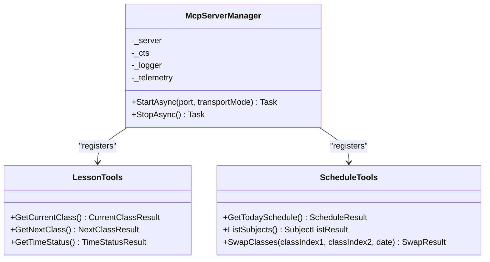
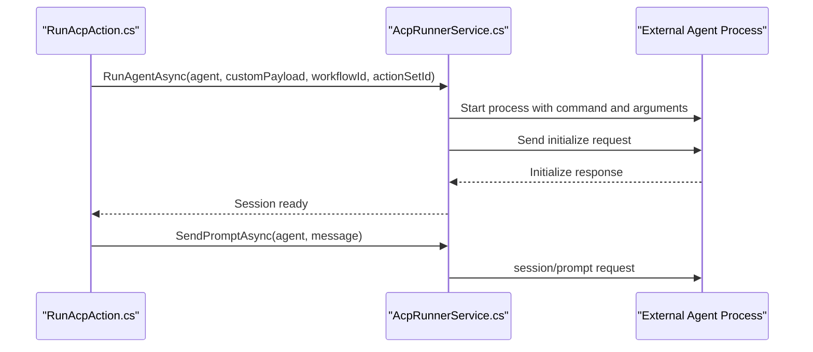
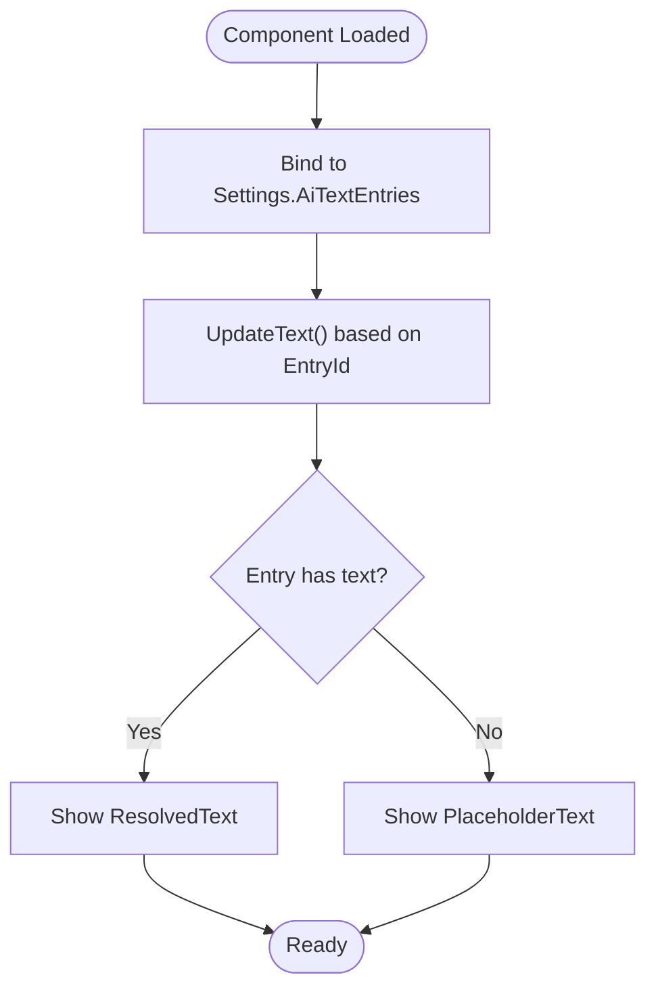
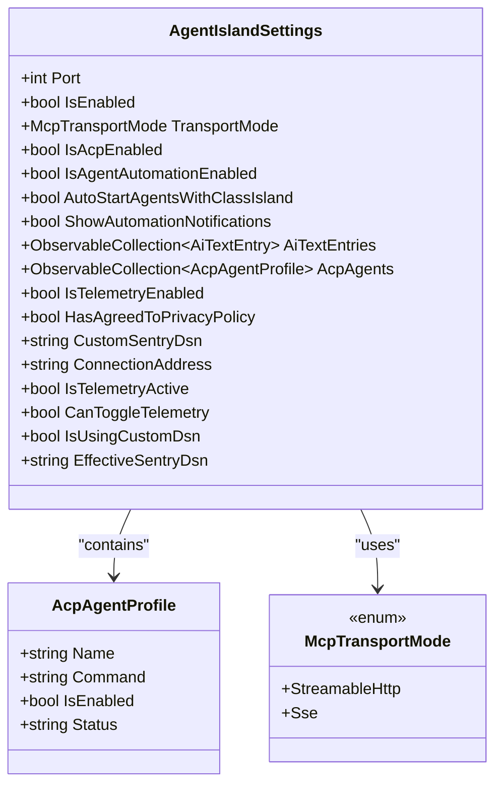
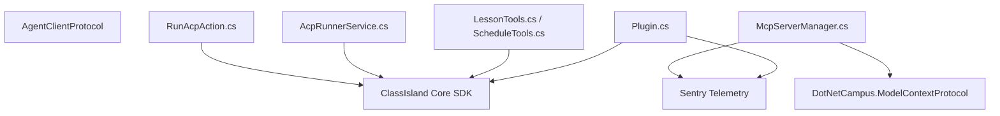

# Project Overview

<cite>
**Referenced Files in This Document**
- [manifest.yml](file://manifest.yml)
- [Plugin.cs](file://Plugin.cs)
- [AGENTS.md](file://AGENTS.md)
- [AgentIslandSettings.cs](file://Models/AgentIslandSettings.cs)
- [McpTransportMode.cs](file://Models/McpTransportMode.cs)
- [McpServerManager.cs](file://Mcp/McpServerManager.cs)
- [LessonTools.cs](file://Mcp/Tools/LessonTools.cs)
- [ScheduleTools.cs](file://Mcp/Tools/ScheduleTools.cs)
- [AiTextComponent.axaml.cs](file://Components/AiTextComponent.axaml.cs)
- [RunAcpAction.cs](file://Automation/RunAcpAction.cs)
- [AcpRunnerService.cs](file://Services/AcpRunnerService.cs)
- [AcpAgentProfile.cs](file://Models/AcpAgentProfile.cs)
</cite>

## Table of Contents
1. [Introduction](#introduction)
2. [Project Structure](#project-structure)
3. [Core Components](#core-components)
4. [Architecture Overview](#architecture-overview)
5. [Detailed Component Analysis](#detailed-component-analysis)
6. [Dependency Analysis](#dependency-analysis)
7. [Performance Considerations](#performance-considerations)
8. [Troubleshooting Guide](#troubleshooting-guide)
9. [Conclusion](#conclusion)

## Introduction
AgentIsland is a ClassIsland plugin that bridges AI agents with educational software using the Model Context Protocol (MCP) and the Agent Client Protocol (ACP). It exposes an MCP server so external AI agents can read and modify classroom data, and it provides ACP integration to run and control agent processes from within ClassIsland automation workflows. The plugin also includes intelligent UI components for dynamic text rendering and automation actions to orchestrate agent execution.

Target audience:
- Educators who want AI-assisted classroom management features
- Administrators who need automated scheduling and notifications
- Developers integrating AI capabilities into classroom systems via MCP and ACP

High-level benefits:
- Standardized MCP interface for AI agents to interact with timetable and lesson services
- ACP-based agent lifecycle management through ClassIsland automation
- Dynamic UI components updated by AI-driven tools
- Configurable telemetry and privacy controls

Installation prerequisites and system requirements:
- Windows desktop environment
- .NET 8 runtime (as indicated by development guidance)
- ClassIsland installed and running
- For building or packaging: set the required environment variable pointing to ClassIsland’s debug binary directory as described in the development guide

For build and packaging commands, see the development guide file referenced below.

**Section sources**
- [manifest.yml:1-13](file://manifest.yml#L1-L13)
- [AGENTS.md:1-23](file://AGENTS.md#L1-L23)

## Project Structure
AgentIsland follows a modular layout aligned with ClassIsland plugin conventions:
- Plugin entry point and lifecycle: Plugin.cs
- MCP server manager and tools: Mcp/McpServerManager.cs and Mcp/Tools/*
- ACP runner service and automation action: Services/AcpRunnerService.cs and Automation/RunAcpAction.cs
- Intelligent UI component: Components/AiTextComponent.axaml.cs
- Settings and models: Models/*
- Settings pages and views: Views/*

**Diagram sources**
- [Plugin.cs:1-114](file://Plugin.cs#L1-L114)
- [McpServerManager.cs:1-125](file://Mcp/McpServerManager.cs#L1-L125)
- [AcpRunnerService.cs:1-207](file://Services/AcpRunnerService.cs#L1-L207)
- [RunAcpAction.cs:1-84](file://Automation/RunAcpAction.cs#L1-L84)
- [AiTextComponent.axaml.cs:1-85](file://Components/AiTextComponent.axaml.cs#L1-L85)
- [AgentIslandSettings.cs:1-394](file://Models/AgentIslandSettings.cs#L1-L394)
- [McpTransportMode.cs:1-18](file://Models/McpTransportMode.cs#L1-L18)
- [LessonTools.cs:1-146](file://Mcp/Tools/LessonTools.cs#L1-L146)
- [ScheduleTools.cs:1-204](file://Mcp/Tools/ScheduleTools.cs#L1-L204)
- [AcpAgentProfile.cs:1-44](file://Models/AcpAgentProfile.cs#L1-L44)

**Section sources**
- [Plugin.cs:1-114](file://Plugin.cs#L1-L114)
- [AGENTS.md:24-61](file://AGENTS.md#L24-L61)

## Core Components
- Plugin entry point: Initializes settings, telemetry, services, UI components, settings pages, and automation actions; starts/stops the MCP server on app lifecycle events.
- MCP Server Manager: Builds and runs the MCP server with configured transport mode and registers tool implementations.
- ACP Runner Service: Manages agent process sessions over stdio using JSON-RPC, including initialization and prompt sending.
- Run ACP Action: ClassIsland automation action that validates configuration and triggers agent execution via the runner service.
- AI Text Component: Avalonia component bound to settings entries and updated by MCP tools to display dynamic content.
- Settings and Models: Centralized configuration including MCP port, transport mode, ACP agent profiles, and telemetry options.

Key features:
- MCP server implementation exposing tools for lessons and schedule operations
- ACP agent integration for launching and communicating with external agents
- Intelligent text components driven by MCP tool updates
- Automation capabilities via ClassIsland actions

**Section sources**
- [Plugin.cs:29-97](file://Plugin.cs#L29-L97)
- [McpServerManager.cs:25-82](file://Mcp/McpServerManager.cs#L25-L82)
- [AcpRunnerService.cs:25-77](file://Services/AcpRunnerService.cs#L25-L77)
- [RunAcpAction.cs:29-82](file://Automation/RunAcpAction.cs#L29-L82)
- [AiTextComponent.axaml.cs:36-83](file://Components/AiTextComponent.axaml.cs#L36-L83)
- [AgentIslandSettings.cs:14-231](file://Models/AgentIslandSettings.cs#L14-L231)

## Architecture Overview
The plugin integrates tightly with ClassIsland’s host and services while providing two primary integration points:
- MCP server: Exposes tools for AI agents to query and modify timetable data
- ACP client: Launches and communicates with external agents via stdio JSON-RPC

**Diagram sources**
- [Plugin.cs:55-79](file://Plugin.cs#L55-L79)
- [McpServerManager.cs:41-71](file://Mcp/McpServerManager.cs#L41-L71)
- [LessonTools.cs:14-45](file://Mcp/Tools/LessonTools.cs#L14-L45)
- [ScheduleTools.cs:15-56](file://Mcp/Tools/ScheduleTools.cs#L15-L56)
- [AiTextComponent.axaml.cs:39-56](file://Components/AiTextComponent.axaml.cs#L39-L56)
- [RunAcpAction.cs:29-72](file://Automation/RunAcpAction.cs#L29-L72)
- [AcpRunnerService.cs:25-77](file://Services/AcpRunnerService.cs#L25-L77)

## Detailed Component Analysis

### MCP Server Implementation
The MCP server is built with a builder pattern, registering tool classes that expose methods annotated for MCP discovery. Transport mode determines whether the server listens on Streamable HTTP or SSE endpoints.

**Diagram sources**
- [McpServerManager.cs:41-51](file://Mcp/McpServerManager.cs#L41-L51)
- [LessonTools.cs:14-113](file://Mcp/Tools/LessonTools.cs#L14-L113)
- [ScheduleTools.cs:15-131](file://Mcp/Tools/ScheduleTools.cs#L15-L131)

Practical examples:
- Query current class details and remaining time
- Retrieve today’s schedule and list subjects
- Swap two classes on a specific date by creating a temporary overlay plan

**Section sources**
- [McpServerManager.cs:25-82](file://Mcp/McpServerManager.cs#L25-L82)
- [LessonTools.cs:14-113](file://Mcp/Tools/LessonTools.cs#L14-L113)
- [ScheduleTools.cs:15-131](file://Mcp/Tools/ScheduleTools.cs#L15-L131)

### ACP Agent Integration
ACP integration enables launching external agents via command lines and communicating over stdio using JSON-RPC. The runner service manages sessions, initializes connections, and sends prompts.

**Diagram sources**
- [RunAcpAction.cs:29-72](file://Automation/RunAcpAction.cs#L29-L72)
- [AcpRunnerService.cs:25-77](file://Services/AcpRunnerService.cs#L25-L77)
- [AcpRunnerService.cs:79-100](file://Services/AcpRunnerService.cs#L79-L100)
- [AcpRunnerService.cs:102-131](file://Services/AcpRunnerService.cs#L102-L131)

Practical examples:
- Configure an ACP agent profile with a command line
- Trigger agent execution from a ClassIsland automation workflow
- Optionally show notifications when automation runs

**Section sources**
- [RunAcpAction.cs:29-82](file://Automation/RunAcpAction.cs#L29-L82)
- [AcpRunnerService.cs:25-77](file://Services/AcpRunnerService.cs#L25-L77)
- [AcpAgentProfile.cs:16-42](file://Models/AcpAgentProfile.cs#L16-L42)

### Intelligent Text Components
The AI text component binds to a collection of entries and renders resolved text or placeholder content. MCP tools can update these entries to reflect dynamic information managed by AI agents.

**Diagram sources**
- [AiTextComponent.axaml.cs:39-56](file://Components/AiTextComponent.axaml.cs#L39-L56)
- [AiTextComponent.axaml.cs:73-83](file://Components/AiTextComponent.axaml.cs#L73-L83)

Practical examples:
- Display real-time class status or countdowns
- Show AI-generated announcements or reminders
- Update component text via MCP tool calls

**Section sources**
- [AiTextComponent.axaml.cs:36-83](file://Components/AiTextComponent.axaml.cs#L36-L83)

### Settings and Configuration
Centralized settings include MCP server port and transport mode, ACP agent profiles, automation toggles, and telemetry preferences. Derived properties provide connection addresses and telemetry state logic.

**Diagram sources**
- [AgentIslandSettings.cs:14-231](file://Models/AgentIslandSettings.cs#L14-L231)
- [AcpAgentProfile.cs:16-42](file://Models/AcpAgentProfile.cs#L16-L42)
- [McpTransportMode.cs:6-17](file://Models/McpTransportMode.cs#L6-L17)

Practical examples:
- Change MCP server port and transport mode
- Add multiple ACP agents and enable/disable them
- Toggle telemetry and configure custom DSN

**Section sources**
- [AgentIslandSettings.cs:14-231](file://Models/AgentIslandSettings.cs#L14-L231)
- [McpTransportMode.cs:6-17](file://Models/McpTransportMode.cs#L6-L17)

## Dependency Analysis
AgentIsland depends on ClassIsland core services and SDK, plus third-party libraries for MCP and telemetry. The plugin registers its own services and components with the host DI container.

**Diagram sources**
- [Plugin.cs:1-114](file://Plugin.cs#L1-L114)
- [McpServerManager.cs:1-24](file://Mcp/McpServerManager.cs#L1-L24)
- [LessonTools.cs:1-9](file://Mcp/Tools/LessonTools.cs#L1-L9)
- [ScheduleTools.cs:1-9](file://Mcp/Tools/ScheduleTools.cs#L1-L9)
- [AcpRunnerService.cs:1-8](file://Services/AcpRunnerService.cs#L1-L8)
- [RunAcpAction.cs:1-7](file://Automation/RunAcpAction.cs#L1-L7)

**Section sources**
- [AGENTS.md:42-47](file://AGENTS.md#L42-L47)
- [Plugin.cs:29-53](file://Plugin.cs#L29-L53)

## Performance Considerations
- Prefer Streamable HTTP transport for modern clients unless SSE compatibility is required.
- Keep MCP tool methods lightweight and avoid blocking UI thread; use provided helpers to marshal UI-bound operations.
- Limit ACP agent concurrency and ensure proper cleanup of processes to prevent resource leaks.
- Use telemetry selectively to avoid overhead in hot paths.

[No sources needed since this section provides general guidance]

## Troubleshooting Guide
Common issues and resolutions:
- MCP server fails to start: Check port availability and transport mode configuration; review logs and telemetry breadcrumbs.
- ACP agent not found or disabled: Ensure the agent name matches a configured profile and that both ACP and agent automation are enabled.
- Invalid agent command: Verify the command string is correctly formatted and executable.
- Telemetry not active: Confirm privacy policy agreement or provide a custom DSN; check derived properties for activation conditions.

Operational references:
- Plugin lifecycle logging and error capture during start/stop
- ACP runner validation and error messages for missing or invalid configurations
- Settings-derived properties controlling telemetry behavior

**Section sources**
- [Plugin.cs:67-97](file://Plugin.cs#L67-L97)
- [RunAcpAction.cs:35-60](file://Automation/RunAcpAction.cs#L35-L60)
- [AcpRunnerService.cs:35-48](file://Services/AcpRunnerService.cs#L35-L48)
- [AgentIslandSettings.cs:176-200](file://Models/AgentIslandSettings.cs#L176-L200)

## Conclusion
AgentIsland extends ClassIsland with robust AI integration through MCP and ACP. It offers educators and administrators practical automation and dynamic UI capabilities, while providing developers a clear architecture for extending classroom management with AI agents. With configurable transport modes, comprehensive settings, and telemetry support, the plugin balances flexibility, usability, and observability.

[No sources needed since this section summarizes without analyzing specific files]