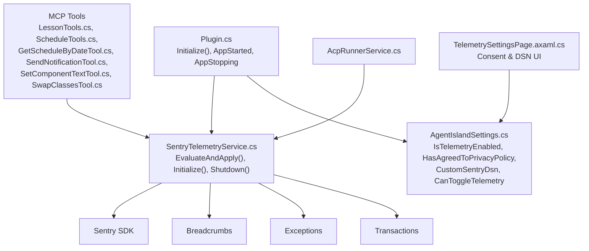
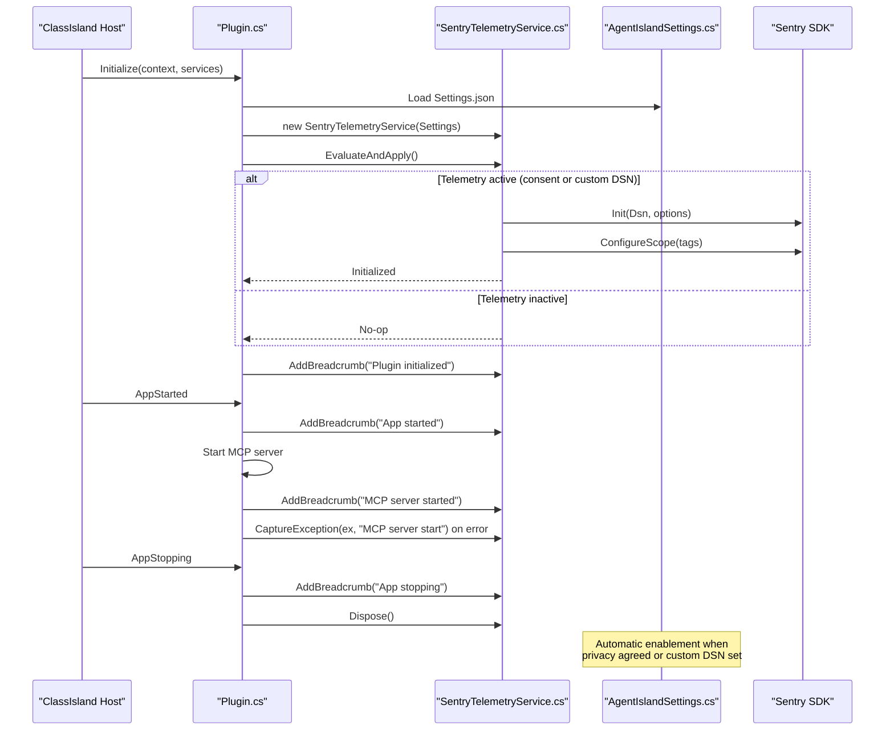
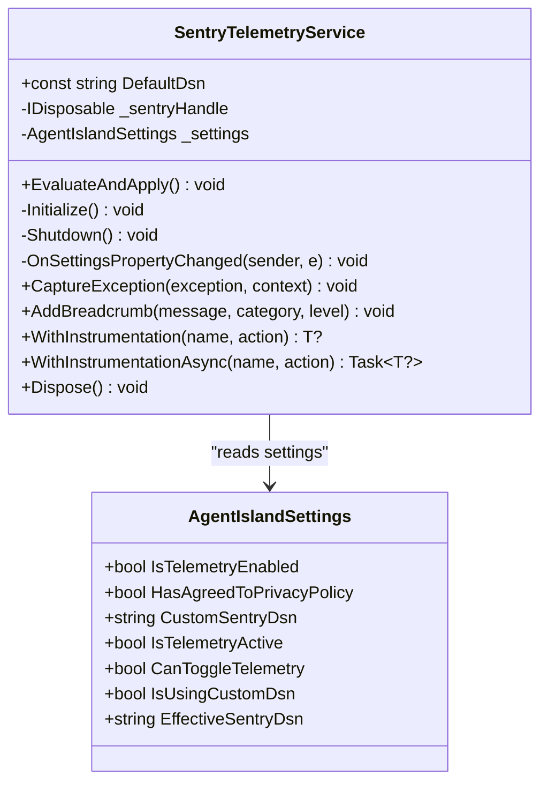
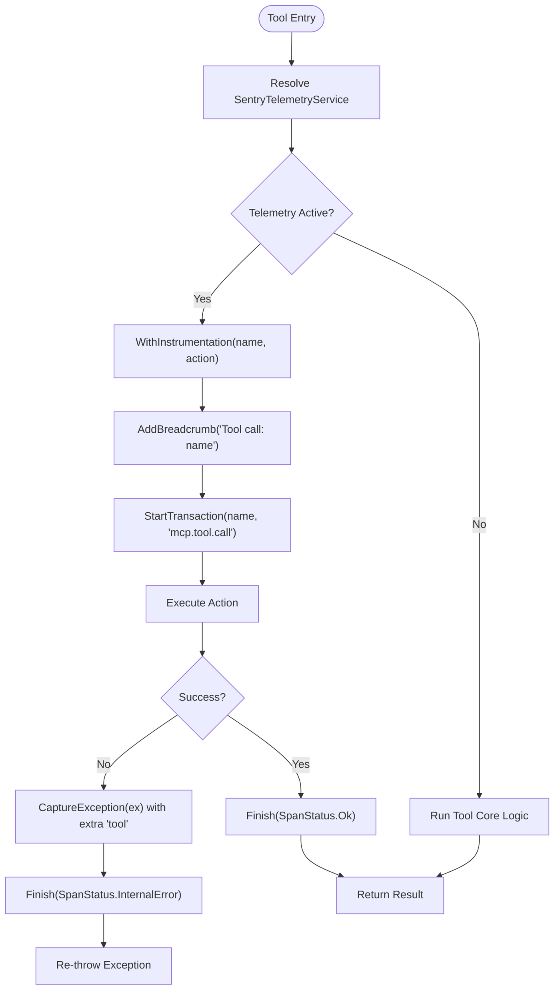
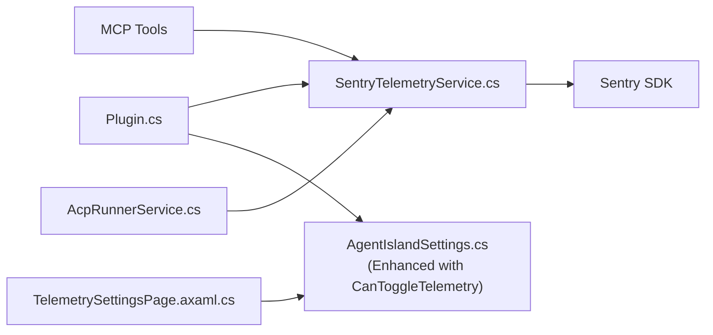

# Telemetry and Monitoring

<cite>
**Referenced Files in This Document**
- [Plugin.cs](file://Plugin.cs)
- [SentryTelemetryService.cs](file://Services/SentryTelemetryService.cs)
- [AgentIslandSettings.cs](file://Models/AgentIslandSettings.cs)
- [TelemetrySettingsPage.axaml.cs](file://Views/SettingsPages/TelemetrySettingsPage.axaml.cs)
- [TelemetrySettingsPage.axaml](file://Views/SettingsPages/TelemetrySettingsPage.axaml)
- [LessonTools.cs](file://Mcp/Tools/LessonTools.cs)
- [ScheduleTools.cs](file://Mcp/Tools/ScheduleTools.cs)
- [GetScheduleByDateTool.cs](file://Mcp/Tools/GetScheduleByDateTool.cs)
- [SendNotificationTool.cs](file://Mcp/Tools/SendNotificationTool.cs)
- [SetComponentTextTool.cs](file://Mcp/Tools/SetComponentTextTool.cs)
- [SwapClassesTool.cs](file://Mcp/Tools/SwapClassesTool.cs)
- [AcpRunnerService.cs](file://Services/AcpRunnerService.cs)
- [PRIVACY_POLICY.md](file://PRIVACY_POLICY.md)
- [CROSS_BORDER_DATA_TRANSFER.md](file://CROSS_BORDER_DATA_TRANSFER.md)
</cite>

## Update Summary
**Changes Made**
- Enhanced telemetry system with new `CanToggleTelemetry` property for automatic enablement
- Updated privacy controls to support streamlined user experience
- Added automatic telemetry activation when privacy policy is agreed or custom DSN configured
- Improved UI behavior for better user guidance and consent management

## Table of Contents
1. [Introduction](#introduction)
2. [Project Structure](#project-structure)
3. [Core Components](#core-components)
4. [Architecture Overview](#architecture-overview)
5. [Detailed Component Analysis](#detailed-component-analysis)
6. [Dependency Analysis](#dependency-analysis)
7. [Performance Considerations](#performance-considerations)
8. [Troubleshooting Guide](#troubleshooting-guide)
9. [Conclusion](#conclusion)
10. [Appendices](#appendices)

## Introduction
This document explains AgentIsland's telemetry and monitoring capabilities powered by Sentry. It covers error tracking, performance monitoring, crash reporting, breadcrumb logging, exception capture, contextual information collection, privacy controls (opt-in/opt-out), guidelines for adding custom telemetry events, debugging production issues, analyzing performance metrics, data retention policies, GDPR and cross-border compliance considerations, and best practices to ensure meaningful error reporting without exposing sensitive information.

The enhanced telemetry system now provides a streamlined user experience through automatic enablement when users agree to the privacy policy or configure a custom Sentry DSN, while maintaining full privacy compliance and user control.

## Project Structure
The telemetry system is implemented as a dedicated service integrated into the plugin lifecycle and exposed via settings UI. MCP tools and services use this service to record breadcrumbs, capture exceptions, and wrap operations with instrumentation.

**Diagram sources**
- [Plugin.cs:29-53](file://Plugin.cs#L29-L53)
- [SentryTelemetryService.cs:30-69](file://Services/SentryTelemetryService.cs#L30-L69)
- [AgentIslandSettings.cs:148-200](file://Models/AgentIslandSettings.cs#L148-L200)
- [TelemetrySettingsPage.axaml.cs:27-42](file://Views/SettingsPages/TelemetrySettingsPage.axaml.cs#L27-L42)
- [LessonTools.cs:14-20](file://Mcp/Tools/LessonTools.cs#L14-L20)
- [ScheduleTools.cs:15-21](file://Mcp/Tools/ScheduleTools.cs#L15-L21)
- [GetScheduleByDateTool.cs:55-72](file://Mcp/Tools/GetScheduleByDateTool.cs#L55-L72)
- [SendNotificationTool.cs:70-99](file://Mcp/Tools/SendNotificationTool.cs#L70-99)
- [SetComponentTextTool.cs:43-68](file://Mcp/Tools/SetComponentTextTool.cs#L43-L68)
- [SwapClassesTool.cs:65](file://Mcp/Tools/SwapClassesTool.cs#L65)
- [AcpRunnerService.cs:32-107](file://Services/AcpRunnerService.cs#L32-L107)

**Section sources**
- [Plugin.cs:29-53](file://Plugin.cs#L29-L53)
- [SentryTelemetryService.cs:30-69](file://Services/SentryTelemetryService.cs#L30-L69)
- [AgentIslandSettings.cs:148-200](file://Models/AgentIslandSettings.cs#L148-L200)
- [TelemetrySettingsPage.axaml.cs:27-42](file://Views/SettingsPages/TelemetrySettingsPage.axaml.cs#L27-L42)

## Core Components
- **SentryTelemetryService**: Centralized telemetry service that manages Sentry SDK lifecycle, captures exceptions, adds breadcrumbs, and wraps synchronous/asynchronous operations with transactions and automatic error capture.
- **AgentIslandSettings**: Holds user preferences including telemetry enablement, privacy consent, and optional custom DSN; exposes derived properties to control telemetry activation including the new `CanToggleTelemetry` property.
- **TelemetrySettingsPage**: User interface for consent management, DSN configuration, and testing telemetry with enhanced user experience.
- **MCP Tools and AcpRunnerService**: Use telemetry to instrument tool calls, log breadcrumbs, and capture exceptions.

Key responsibilities:
- **Lifecycle management**: initialize or shut down Sentry based on settings changes.
- **Enhanced privacy enforcement**: automatically enable telemetry when privacy policy is agreed or custom DSN is provided, while respecting user opt-out.
- **Error reporting**: capture exceptions with context tags and extras.
- **Performance monitoring**: start/finish transactions around tool calls.
- **Contextual logging**: add breadcrumbs for lifecycle and operational events.

**Section sources**
- [SentryTelemetryService.cs:11-90](file://Services/SentryTelemetryService.cs#L11-L90)
- [AgentIslandSettings.cs:148-200](file://Models/AgentIslandSettings.cs#L148-L200)
- [TelemetrySettingsPage.axaml.cs:27-73](file://Views/SettingsPages/TelemetrySettingsPage.axaml.cs#L27-L73)
- [LessonTools.cs:14-20](file://Mcp/Tools/LessonTools.cs#L14-L20)
- [ScheduleTools.cs:15-21](file://Mcp/Tools/ScheduleTools.cs#L15-L21)
- [AcpRunnerService.cs:32-107](file://Services/AcpRunnerService.cs#L32-L107)

## Architecture Overview
The telemetry architecture integrates at plugin initialization and app lifecycle hooks, providing consistent instrumentation across MCP tools and services with enhanced automatic enablement logic.

**Diagram sources**
- [Plugin.cs:29-53](file://Plugin.cs#L29-L53)
- [Plugin.cs:55-97](file://Plugin.cs#L55-L97)
- [SentryTelemetryService.cs:30-69](file://Services/SentryTelemetryService.cs#L30-L69)
- [AgentIslandSettings.cs:178-200](file://Models/AgentIslandSettings.cs#L178-L200)

## Detailed Component Analysis

### SentryTelemetryService
Responsibilities:
- Evaluate telemetry activation based on settings and apply changes dynamically.
- Initialize Sentry SDK with configured DSN and options (PII disabled, session tracking disabled, trace sampling set).
- Set global scope tags for plugin identification.
- Provide APIs for capturing exceptions, adding breadcrumbs, and wrapping operations with instrumentation.

Key behaviors:
- Dynamic re-initialization when telemetry settings change (including DSN updates).
- Graceful no-op when telemetry is disabled.
- Automatic transaction creation and finishing for wrapped operations, with exception capture and span status.

**Diagram sources**
- [SentryTelemetryService.cs:11-90](file://Services/SentryTelemetryService.cs#L11-L90)
- [AgentIslandSettings.cs:148-200](file://Models/AgentIslandSettings.cs#L148-L200)

**Section sources**
- [SentryTelemetryService.cs:30-90](file://Services/SentryTelemetryService.cs#L30-L90)
- [SentryTelemetryService.cs:94-174](file://Services/SentryTelemetryService.cs#L94-L174)

### AgentIslandSettings (Enhanced Telemetry Properties)
**Updated** Enhanced with new `CanToggleTelemetry` property and automatic enablement logic.

Responsibilities:
- Persist telemetry preferences and privacy consent.
- Compute derived state to determine whether telemetry should be active.
- Allow users to supply a custom DSN to bypass consent checks.
- Provide automatic enablement when privacy policy is agreed or custom DSN is configured.

New derived properties:
- **CanToggleTelemetry**: true if privacy policy is agreed OR custom DSN is provided - determines if telemetry toggle is available.
- **IsTelemetryActive**: true if telemetry is enabled AND either consent is given or a custom DSN is provided.
- **EffectiveSentryDsn**: resolves to custom DSN if provided, otherwise uses default.

Automatic enablement behavior:
- When privacy policy is agreed (`HasAgreedToPrivacyPolicy = true`) OR custom DSN is set, telemetry is automatically enabled if not already active.
- This provides a streamlined user experience while maintaining privacy compliance.
- Users can still manually disable telemetry even after agreeing to privacy policy.

**Section sources**
- [AgentIslandSettings.cs:148-200](file://Models/AgentIslandSettings.cs#L148-L200)
- [AgentIslandSettings.cs:182-186](file://Models/AgentIslandSettings.cs#L182-L186)
- [AgentIslandSettings.cs:256-266](file://Models/AgentIslandSettings.cs#L256-L266)

### TelemetrySettingsPage (Enhanced User Interface)
**Updated** Enhanced with improved user experience and better privacy guidance.

Responsibilities:
- Display current privacy status and allow consent actions.
- Show/hide banners based on custom DSN usage.
- Provide test message capture for development or custom DSN scenarios.
- Link to privacy policy documentation.
- Support automatic telemetry enablement flow.

Enhanced user flows:
- **Consent dialog**: collects explicit agreement before enabling telemetry with detailed explanation of data collection.
- **Withdraw consent**: stops telemetry immediately; historical data remains per policy.
- **Test capture**: sends a sample message to verify integration.
- **Automatic enablement**: when privacy policy is agreed or custom DSN is configured, telemetry is automatically enabled for streamlined experience.

UI improvements:
- Clear visual indicators for privacy status and DSN usage.
- Contextual help text explaining telemetry benefits and privacy protections.
- Seamless integration with automatic enablement logic.

**Section sources**
- [TelemetrySettingsPage.axaml.cs:27-73](file://Views/SettingsPages/TelemetrySettingsPage.axaml.cs#L27-L73)
- [TelemetrySettingsPage.axaml.cs:75-124](file://Views/SettingsPages/TelemetrySettingsPage.axaml.cs#L75-L124)
- [TelemetrySettingsPage.axaml.cs:126-138](file://Views/SettingsPages/TelemetrySettingsPage.axaml.cs#L126-L138)
- [TelemetrySettingsPage.axaml:16-23](file://Views/SettingsPages/TelemetrySettingsPage.axaml#L16-L23)

### MCP Tools Instrumentation
Pattern:
- Each public tool method retrieves the telemetry service and wraps core logic using WithInstrumentation or manually adds breadcrumbs and captures exceptions.

Examples:
- LessonTools: get_current_class, get_next_class, get_time_status use WithInstrumentation.
- ScheduleTools: get_today_schedule, list_subjects use WithInstrumentation.
- GetScheduleByDateTool: manual breadcrumb and exception capture.
- SendNotificationTool: manual breadcrumb and exception capture.
- SetComponentTextTool: manual breadcrumb and exception capture.
- SwapClassesTool: manual breadcrumb.

**Diagram sources**
- [SentryTelemetryService.cs:127-174](file://Services/SentryTelemetryService.cs#L127-L174)
- [LessonTools.cs:14-20](file://Mcp/Tools/LessonTools.cs#L14-L20)
- [LessonTools.cs:47-53](file://Mcp/Tools/LessonTools.cs#L47-L53)
- [LessonTools.cs:85-91](file://Mcp/Tools/LessonTools.cs#L85-L91)
- [ScheduleTools.cs:15-21](file://Mcp/Tools/ScheduleTools.cs#L15-L21)
- [ScheduleTools.cs:105-111](file://Mcp/Tools/ScheduleTools.cs#L105-L111)
- [GetScheduleByDateTool.cs:55-72](file://Mcp/Tools/GetScheduleByDateTool.cs#L55-L72)
- [SendNotificationTool.cs:70-99](file://Mcp/Tools/SendNotificationTool.cs#L70-L99)
- [SetComponentTextTool.cs:43-68](file://Mcp/Tools/SetComponentTextTool.cs#L43-L68)
- [SwapClassesTool.cs:65](file://Mcp/Tools/SwapClassesTool.cs#L65)

**Section sources**
- [LessonTools.cs:14-20](file://Mcp/Tools/LessonTools.cs#L14-L20)
- [LessonTools.cs:47-53](file://Mcp/Tools/LessonTools.cs#L47-L53)
- [LessonTools.cs:85-91](file://Mcp/Tools/LessonTools.cs#L85-L91)
- [ScheduleTools.cs:15-21](file://Mcp/Tools/ScheduleTools.cs#L15-L21)
- [ScheduleTools.cs:105-111](file://Mcp/Tools/ScheduleTools.cs#L105-L111)
- [GetScheduleByDateTool.cs:55-72](file://Mcp/Tools/GetScheduleByDateTool.cs#L55-L72)
- [SendNotificationTool.cs:70-99](file://Mcp/Tools/SendNotificationTool.cs#L70-L99)
- [SetComponentTextTool.cs:43-68](file://Mcp/Tools/SetComponentTextTool.cs#L43-L68)
- [SwapClassesTool.cs:65](file://Mcp/Tools/SwapClassesTool.cs#L65)

### AcpRunnerService Integration
Responsibilities:
- Log breadcrumbs for agent run and prompt sending events.
- Integrate seamlessly with telemetry service for observability.

**Section sources**
- [AcpRunnerService.cs:32-107](file://Services/AcpRunnerService.cs#L32-L107)

## Dependency Analysis
The telemetry system has clear separation of concerns with enhanced automatic enablement logic:
- Plugin orchestrates initialization and lifecycle hooks.
- SentryTelemetryService encapsulates all Sentry interactions.
- AgentIslandSettings provides configuration, derived state, and automatic enablement logic.
- MCP tools and services consume telemetry via dependency injection.

**Diagram sources**
- [Plugin.cs:29-53](file://Plugin.cs#L29-L53)
- [SentryTelemetryService.cs:30-69](file://Services/SentryTelemetryService.cs#L30-L69)
- [AgentIslandSettings.cs:148-200](file://Models/AgentIslandSettings.cs#L148-L200)
- [TelemetrySettingsPage.axaml.cs:27-42](file://Views/SettingsPages/TelemetrySettingsPage.axaml.cs#L27-L42)
- [LessonTools.cs:14-20](file://Mcp/Tools/LessonTools.cs#L14-L20)
- [AcpRunnerService.cs:32-107](file://Services/AcpRunnerService.cs#L32-L107)

**Section sources**
- [Plugin.cs:29-53](file://Plugin.cs#L29-L53)
- [SentryTelemetryService.cs:30-69](file://Services/SentryTelemetryService.cs#L30-L69)
- [AgentIslandSettings.cs:148-200](file://Models/AgentIslandSettings.cs#L148-L200)

## Performance Considerations
- Transaction sampling: TracesSampleRate is set to 1.0, meaning all operations are traced. For high-throughput environments, consider adjusting sampling rates to balance visibility and overhead.
- PII filtering: SendDefaultPii is disabled to avoid sending personal data. Ensure any additional context added does not include sensitive fields.
- Scope tags: Global tags like plugin and classisland.plugin help filter and group events efficiently.
- Breadcrumb volume: Keep breadcrumbs concise and categorized to reduce noise and improve signal-to-noise ratio.
- Async instrumentation: Prefer WithInstrumentationAsync for asynchronous operations to avoid blocking and ensure accurate timing.
- **Enhanced efficiency**: Automatic enablement reduces unnecessary UI interactions and improves user experience without compromising privacy controls.

## Troubleshooting Guide
Common issues and resolutions:
- **Telemetry not sending**:
  - Verify IsTelemetryEnabled and HasAgreedToPrivacyPolicy or CustomSentryDsn.
  - Confirm EvaluateAndApply was called after settings changes.
  - Check EffectiveSentryDsn resolution and network connectivity to Sentry endpoint.
  - **New**: Check CanToggleTelemetry to understand why telemetry might be automatically enabled.
- **Errors not captured**:
  - Ensure CaptureException is invoked within try/catch blocks where appropriate.
  - Validate that telemetry is active before calling capture methods.
- **Performance metrics missing**:
  - Confirm WithInstrumentation or WithInstrumentationAsync is used around critical operations.
  - Review transaction names and categories for clarity.
- **Consent UI behavior**:
  - If using custom DSN, consent check is bypassed; confirm banner visibility and button states.
  - Use test capture to validate integration in development or custom DSN mode.
  - **New**: Automatic enablement may occur when privacy policy is agreed or custom DSN is set.

Operational tips:
- Use breadcrumbs to reconstruct event sequences leading to errors.
- Tag events with meaningful categories (e.g., mcp.tool, plugin.lifecycle, acp.agent).
- Avoid attaching large payloads or sensitive data to extras.
- **New**: Leverage automatic enablement for streamlined user experience while maintaining privacy controls.

**Section sources**
- [SentryTelemetryService.cs:30-90](file://Services/SentryTelemetryService.cs#L30-L90)
- [TelemetrySettingsPage.axaml.cs:44-73](file://Views/SettingsPages/TelemetrySettingsPage.axaml.cs#L44-L73)
- [TelemetrySettingsPage.axaml.cs:126-138](file://Views/SettingsPages/TelemetrySettingsPage.axaml.cs#L126-L138)
- [AgentIslandSettings.cs:182-186](file://Models/AgentIslandSettings.cs#L182-L186)

## Conclusion
AgentIsland's enhanced telemetry system provides robust error tracking, performance monitoring, and crash reporting through Sentry while respecting user privacy. The new `CanToggleTelemetry` property and automatic enablement feature provide a streamlined user experience while maintaining full privacy compliance. The design cleanly separates configuration, lifecycle management, and instrumentation, enabling developers to add meaningful telemetry events safely and effectively. Users retain full control over data collection via consent and toggle mechanisms, and the system adheres to privacy and cross-border transfer requirements.

## Appendices

### Privacy Controls and Compliance
**Updated** Enhanced with automatic enablement features while maintaining privacy compliance.

- **Opt-in mechanism**: Consent required before telemetry activates unless a custom DSN is provided.
- **Automatic enablement**: When privacy policy is agreed or custom DSN is configured, telemetry is automatically enabled for streamlined user experience.
- **Opt-out mechanism**: Withdraw consent to stop telemetry immediately; historical data remains per policy.
- **Data minimization**: Only technical diagnostics are collected; PII is filtered out.
- **Cross-border transfer**: Data may be transmitted to Sentry servers outside the user's region; separate agreement applies.
- **User control**: Users can always manually disable telemetry even after automatic enablement.

**Section sources**
- [AgentIslandSettings.cs:178-200](file://Models/AgentIslandSettings.cs#L178-L200)
- [AgentIslandSettings.cs:182-186](file://Models/AgentIslandSettings.cs#L182-L186)
- [AgentIslandSettings.cs:256-266](file://Models/AgentIslandSettings.cs#L256-L266)
- [TelemetrySettingsPage.axaml.cs:75-124](file://Views/SettingsPages/TelemetrySettingsPage.axaml.cs#L75-L124)
- [PRIVACY_POLICY.md:69-102](file://PRIVACY_POLICY.md#L69-L102)
- [CROSS_BORDER_DATA_TRANSFER.md:59-106](file://CROSS_BORDER_DATA_TRANSFER.md#L59-L106)

### Data Retention Policies
- Sentry event data: Default retention period is 90 days (adjustable by project administrators).
- Breadcrumb data: Retained alongside event data.
- Local offline cache: Up to 30 events cached locally until sent, then cleared.

**Section sources**
- [PRIVACY_POLICY.md:105-112](file://PRIVACY_POLICY.md#L105-L112)

### Best Practices for Meaningful Error Reporting
- Use descriptive transaction names and breadcrumb messages.
- Categorize breadcrumbs appropriately (e.g., mcp.tool, plugin.lifecycle).
- Attach minimal, relevant context via extras; avoid sensitive data.
- Leverage tags for grouping and filtering (e.g., plugin=AgentIsland).
- Prefer async instrumentation for non-blocking performance measurement.
- **New**: Utilize automatic enablement features to improve user experience while maintaining privacy controls.
- **New**: Monitor CanToggleTelemetry property to understand telemetry availability and automatic enablement status.