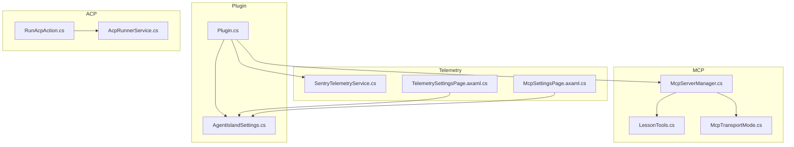
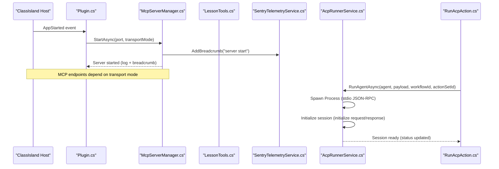
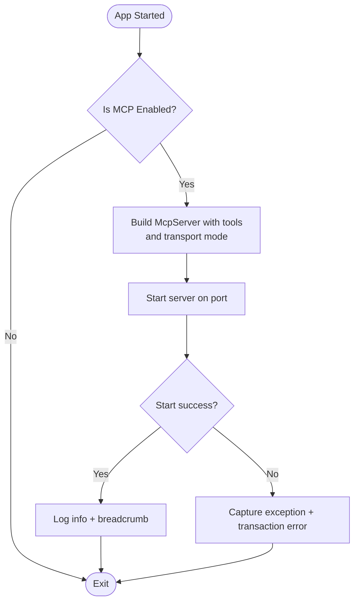
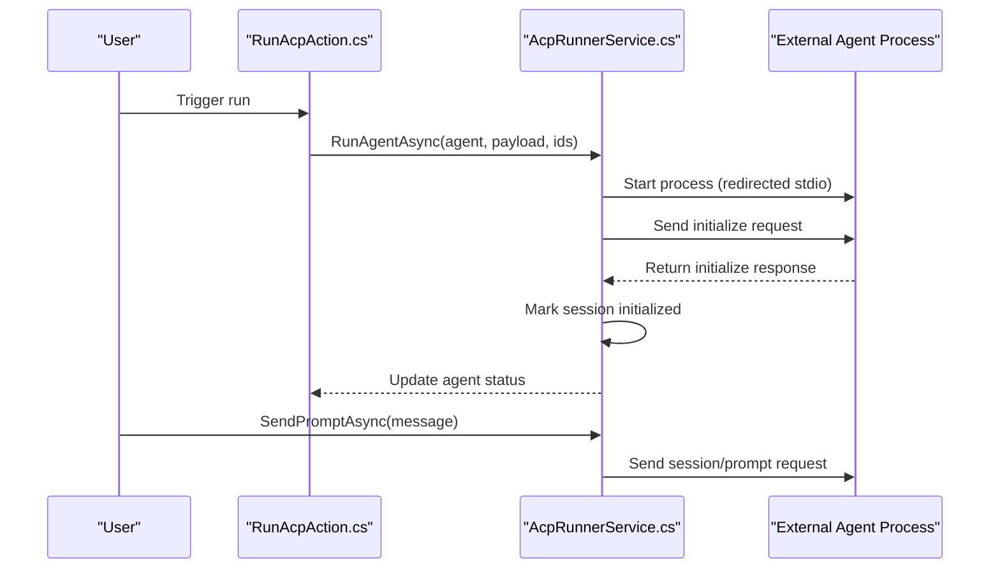
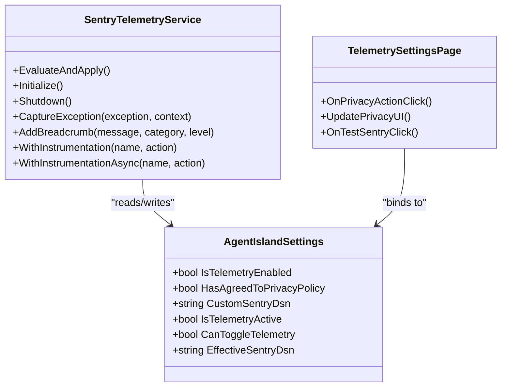
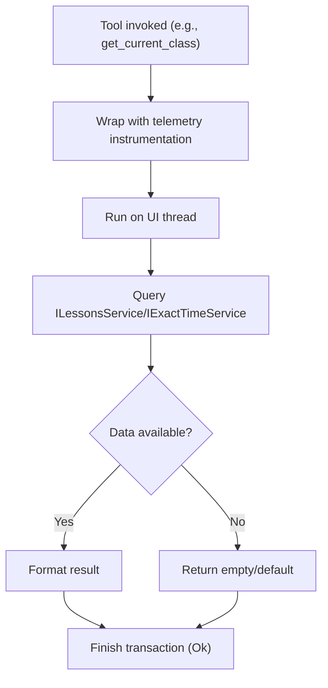
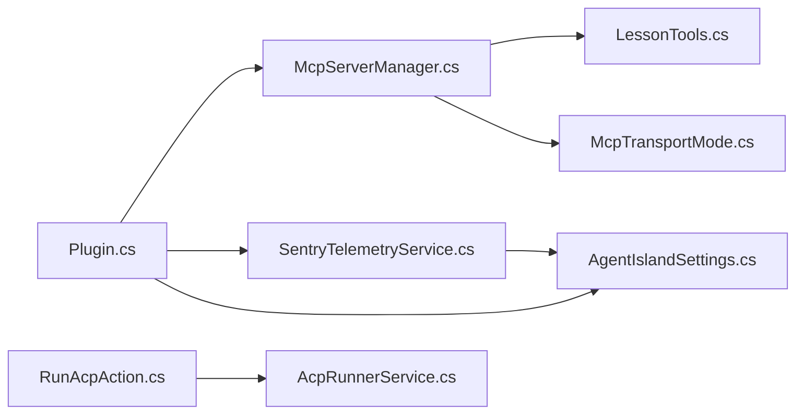

# Troubleshooting and FAQ

<cite>
**Referenced Files in This Document**
- [Plugin.cs](file://Plugin.cs)
- [McpServerManager.cs](file://Mcp/McpServerManager.cs)
- [SentryTelemetryService.cs](file://Services/SentryTelemetryService.cs)
- [AgentIslandSettings.cs](file://Models/AgentIslandSettings.cs)
- [AcpRunnerService.cs](file://Services/AcpRunnerService.cs)
- [RunAcpAction.cs](file://Automation/RunAcpAction.cs)
- [LessonTools.cs](file://Mcp/Tools/LessonTools.cs)
- [McpTransportMode.cs](file://Models/McpTransportMode.cs)
- [McpSettingsPage.axaml.cs](file://Views/SettingsPages/McpSettingsPage.axaml.cs)
- [TelemetrySettingsPage.axaml.cs](file://Views/SettingsPages/TelemetrySettingsPage.axaml.cs)
- [AGENTS.md](file://AGENTS.md)
- [PRIVACY_POLICY.md](file://PRIVACY_POLICY.md)
- [CROSS_BORDER_DATA_TRANSFER.md](file://CROSS_BORDER_DATA_TRANSFER.md)
</cite>

## Table of Contents
1. Introduction
2. Project Structure
3. Core Components
4. Architecture Overview
5. Detailed Component Analysis
6. Dependency Analysis
7. Performance Considerations
8. Troubleshooting Guide
9. Conclusion
10. Appendices

## Introduction
This document provides comprehensive troubleshooting guidance for AgentIsland, focusing on MCP server startup issues, ACP agent connections, configuration errors, performance problems, network connectivity, port conflicts, permissions, memory leaks, cross-border data transfer considerations, privacy policy compliance, plugin compatibility, upgrades, migration, and support resources. It includes diagnostic steps, log analysis techniques, debugging approaches, and frequently asked questions to help you resolve common issues quickly.

## Project Structure
AgentIsland is a ClassIsland desktop plugin built with Avalonia (.NET 8, Windows-only). The plugin exposes an MCP server for external AI agents to interact with ClassIsland’s timetable system. Key responsibilities:
- Plugin lifecycle and service registration
- MCP server management (start/stop, transport mode)
- ACP agent runner via stdio JSON-RPC
- Telemetry integration with Sentry (privacy-aware)
- Settings UI pages for MCP, ACP, AI Text, and Telemetry

**Diagram sources**
- [Plugin.cs](file://Plugin.cs)
- [McpServerManager.cs](file://Mcp/McpServerManager.cs)
- [SentryTelemetryService.cs](file://Services/SentryTelemetryService.cs)
- [AgentIslandSettings.cs](file://Models/AgentIslandSettings.cs)
- [AcpRunnerService.cs](file://Services/AcpRunnerService.cs)
- [RunAcpAction.cs](file://Automation/RunAcpAction.cs)
- [LessonTools.cs](file://Mcp/Tools/LessonTools.cs)
- [McpTransportMode.cs](file://Models/McpTransportMode.cs)
- [McpSettingsPage.axaml.cs](file://Views/SettingsPages/McpSettingsPage.axaml.cs)
- [TelemetrySettingsPage.axaml.cs](file://Views/SettingsPages/TelemetrySettingsPage.axaml.cs)

**Section sources**
- [AGENTS.md](file://AGENTS.md)

## Core Components
- Plugin entry point: Initializes settings, telemetry, services, and registers UI pages; starts/stops the MCP server based on app lifecycle events.
- MCP server manager: Builds and runs the MCP server with tools and transport mode selection; handles start/stop and error capture.
- ACP runner service: Spawns external agent processes via stdio JSON-RPC, initializes sessions, sends prompts, and manages process lifecycle.
- Telemetry service: Manages Sentry SDK lifecycle based on user consent and settings; captures exceptions, breadcrumbs, and transactions.
- Settings model: Centralized configuration including MCP port, transport mode, ACP toggles, telemetry flags, and derived properties.
- Tools: Expose MCP tools that read ClassIsland lesson/time state and perform actions.

**Section sources**
- [Plugin.cs](file://Plugin.cs)
- [McpServerManager.cs](file://Mcp/McpServerManager.cs)
- [AcpRunnerService.cs](file://Services/AcpRunnerService.cs)
- [SentryTelemetryService.cs](file://Services/SentryTelemetryService.cs)
- [AgentIslandSettings.cs](file://Models/AgentIslandSettings.cs)
- [LessonTools.cs](file://Mcp/Tools/LessonTools.cs)

## Architecture Overview
The plugin integrates tightly with ClassIsland’s runtime and exposes an MCP server for external clients. Telemetry is optional and privacy-controlled. ACP agents are executed as child processes communicating over stdio using JSON-RPC.

**Diagram sources**
- [Plugin.cs](file://Plugin.cs)
- [McpServerManager.cs](file://Mcp/McpServerManager.cs)
- [LessonTools.cs](file://Mcp/Tools/LessonTools.cs)
- [SentryTelemetryService.cs](file://Services/SentryTelemetryService.cs)
- [AcpRunnerService.cs](file://Services/AcpRunnerService.cs)
- [RunAcpAction.cs](file://Automation/RunAcpAction.cs)

## Detailed Component Analysis

### MCP Server Startup and Transport Mode
- Behavior: On app start, if enabled, the plugin constructs and starts the MCP server with the configured port and transport mode. Errors during start are logged and captured by telemetry.
- Transport modes: Streamable HTTP (default endpoint “mcp”) or SSE (endpoint “sse”).
- Common issues:
  - Port already in use: Another process binds to the same port; change the port in settings.
  - Endpoint mismatch: Clients must target the correct endpoint based on transport mode.
  - Server not starting: Check logs for exceptions; ensure ClassIsland host is running and plugin is loaded.

**Diagram sources**
- [Plugin.cs](file://Plugin.cs)
- [McpServerManager.cs](file://Mcp/McpServerManager.cs)
- [McpTransportMode.cs](file://Models/McpTransportMode.cs)

**Section sources**
- [Plugin.cs](file://Plugin.cs)
- [McpServerManager.cs](file://Mcp/McpServerManager.cs)
- [McpTransportMode.cs](file://Models/McpTransportMode.cs)
- [McpSettingsPage.axaml.cs](file://Views/SettingsPages/McpSettingsPage.axaml.cs)

### ACP Agent Connections and Execution
- Behavior: The action invokes the runner service which spawns a process using the agent’s command, performs JSON-RPC initialization, and updates status. Subsequent prompts can be sent to the initialized session.
- Common issues:
  - Missing or invalid command: Ensure the agent’s command field is set and executable.
  - Initialization failure: If the initialize response does not contain a result, the session remains uninitialized; check agent stdout/stderr.
  - Permission denied: The process may lack permission to execute the specified binary or access required resources.
  - Resource leaks: Ensure processes are closed/killed on disposal; verify cleanup paths.

**Diagram sources**
- [RunAcpAction.cs](file://Automation/RunAcpAction.cs)
- [AcpRunnerService.cs](file://Services/AcpRunnerService.cs)

**Section sources**
- [RunAcpAction.cs](file://Automation/RunAcpAction.cs)
- [AcpRunnerService.cs](file://Services/AcpRunnerService.cs)

### Telemetry and Privacy Controls
- Behavior: Telemetry is controlled by user consent and settings. When active, it initializes Sentry SDK, sets tags, and captures breadcrumbs/exceptions/transactions. Custom DSN bypasses consent checks.
- Common issues:
  - Consent not granted: Telemetry remains inactive until consent is given or custom DSN is provided.
  - Network restrictions: Corporate firewalls may block outbound HTTPS to Sentry; configure proxy or disable telemetry.
  - Incorrect DSN: Invalid DSN prevents sending; test via the settings page.

**Diagram sources**
- [SentryTelemetryService.cs](file://Services/SentryTelemetryService.cs)
- [AgentIslandSettings.cs](file://Models/AgentIslandSettings.cs)
- [TelemetrySettingsPage.axaml.cs](file://Views/SettingsPages/TelemetrySettingsPage.axaml.cs)

**Section sources**
- [SentryTelemetryService.cs](file://Services/SentryTelemetryService.cs)
- [AgentIslandSettings.cs](file://Models/AgentIslandSettings.cs)
- [TelemetrySettingsPage.axaml.cs](file://Views/SettingsPages/TelemetrySettingsPage.axaml.cs)
- [PRIVACY_POLICY.md](file://PRIVACY_POLICY.md)
- [CROSS_BORDER_DATA_TRANSFER.md](file://CROSS_BORDER_DATA_TRANSFER.md)

### MCP Tools and Lesson State Access
- Behavior: Tools wrap UI-thread-safe calls to ClassIsland services to retrieve current/next class information and time status. Telemetry instrumentation wraps tool execution for performance tracking.
- Common issues:
  - UI thread access: Ensure calls are marshaled to the UI thread; failures indicate incorrect threading.
  - Empty results: Indicates no current/next class available; verify ClassIsland timetable state.

**Diagram sources**
- [LessonTools.cs](file://Mcp/Tools/LessonTools.cs)
- [SentryTelemetryService.cs](file://Services/SentryTelemetryService.cs)

**Section sources**
- [LessonTools.cs](file://Mcp/Tools/LessonTools.cs)
- [SentryTelemetryService.cs](file://Services/SentryTelemetryService.cs)

## Dependency Analysis
Key dependencies and relationships:
- Plugin depends on McpServerManager, SentryTelemetryService, and settings.
- McpServerManager depends on transport mode and tool registrations.
- ACP runner depends on process management and JSON-RPC protocol.
- Telemetry depends on Sentry SDK and settings-driven consent.

**Diagram sources**
- [Plugin.cs](file://Plugin.cs)
- [McpServerManager.cs](file://Mcp/McpServerManager.cs)
- [SentryTelemetryService.cs](file://Services/SentryTelemetryService.cs)
- [AgentIslandSettings.cs](file://Models/AgentIslandSettings.cs)
- [RunAcpAction.cs](file://Automation/RunAcpAction.cs)
- [AcpRunnerService.cs](file://Services/AcpRunnerService.cs)
- [LessonTools.cs](file://Mcp/Tools/LessonTools.cs)
- [McpTransportMode.cs](file://Models/McpTransportMode.cs)

**Section sources**
- [Plugin.cs](file://Plugin.cs)
- [McpServerManager.cs](file://Mcp/McpServerManager.cs)
- [SentryTelemetryService.cs](file://Services/SentryTelemetryService.cs)
- [AgentIslandSettings.cs](file://Models/AgentIslandSettings.cs)
- [RunAcpAction.cs](file://Automation/RunAcpAction.cs)
- [AcpRunnerService.cs](file://Services/AcpRunnerService.cs)
- [LessonTools.cs](file://Mcp/Tools/LessonTools.cs)
- [McpTransportMode.cs](file://Models/McpTransportMode.cs)

## Performance Considerations
- Use Streamable HTTP transport unless SSE is specifically required; SSE may introduce additional overhead.
- Avoid excessive logging at high verbosity; keep debug logs minimal in production.
- Monitor MCP tool call latency via telemetry transactions; identify slow tools and optimize UI-thread operations.
- Reuse processes where possible for ACP agents to reduce spawn overhead; ensure proper session reuse and cleanup.

[No sources needed since this section provides general guidance]

## Troubleshooting Guide

### MCP Server Startup Issues
Symptoms:
- Server fails to start or clients cannot connect.
- Endpoint mismatch errors.

Diagnostic steps:
- Verify MCP is enabled and port is free.
- Confirm transport mode matches client expectations (Streamable HTTP vs SSE).
- Check plugin logs for exceptions during start; review telemetry breadcrumbs for lifecycle events.

Common fixes:
- Change port in settings if conflict detected.
- Ensure correct endpoint path (“mcp” or “sse”) based on transport mode.
- Restart ClassIsland after changing settings.

**Section sources**
- [Plugin.cs](file://Plugin.cs)
- [McpServerManager.cs](file://Mcp/McpServerManager.cs)
- [McpSettingsPage.axaml.cs](file://Views/SettingsPages/McpSettingsPage.axaml.cs)

### ACP Agent Connection Problems
Symptoms:
- Agent fails to initialize or respond to prompts.
- Status remains “Not connected”.

Diagnostic steps:
- Validate agent command and arguments; ensure executable exists and has permissions.
- Inspect process stdout/stderr for JSON-RPC errors.
- Confirm the initialize response contains a result; otherwise session is not initialized.

Common fixes:
- Correct the agent command string.
- Grant necessary file/directory permissions.
- Ensure the agent implements the expected JSON-RPC interface.

**Section sources**
- [RunAcpAction.cs](file://Automation/RunAcpAction.cs)
- [AcpRunnerService.cs](file://Services/AcpRunnerService.cs)

### Configuration Errors
Symptoms:
- Settings changes do not take effect.
- Derived properties (e.g., connection address) not updating.

Diagnostic steps:
- Review property change handlers for Port and TransportMode.
- Confirm settings persistence and reload behavior.

Common fixes:
- Request restart when critical settings change.
- Ensure UI bindings update derived properties.

**Section sources**
- [AgentIslandSettings.cs](file://Models/AgentIslandSettings.cs)
- [McpSettingsPage.axaml.cs](file://Views/SettingsPages/McpSettingsPage.axaml.cs)

### Telemetry and Privacy Compliance
Symptoms:
- No telemetry data received.
- Cross-border data concerns.

Diagnostic steps:
- Check consent status and telemetry toggle.
- Test Sentry capture from settings page.
- Verify outbound HTTPS connectivity to Sentry.

Common fixes:
- Grant consent or provide custom DSN.
- Configure firewall/proxy to allow Sentry traffic.
- Disable telemetry if required by policy.

Cross-border data transfer:
- Data flows to Sentry servers located in the US and other regions.
- Only technical diagnostics are transmitted; personal content is excluded.
- Consent is required unless using a custom DSN.

**Section sources**
- [SentryTelemetryService.cs](file://Services/SentryTelemetryService.cs)
- [TelemetrySettingsPage.axaml.cs](file://Views/SettingsPages/TelemetrySettingsPage.axaml.cs)
- [PRIVACY_POLICY.md](file://PRIVACY_POLICY.md)
- [CROSS_BORDER_DATA_TRANSFER.md](file://CROSS_BORDER_DATA_TRANSFER.md)

### Network Connectivity and Port Conflicts
Symptoms:
- Connection refused or timeout.
- Port binding errors.

Diagnostic steps:
- Use netstat or similar to check port usage.
- Verify firewall rules and proxy settings.
- Confirm endpoint URL format and transport mode.

Common fixes:
- Select an unused port.
- Adjust firewall/proxy to allow local HTTP traffic.
- Match client configuration to transport mode.

**Section sources**
- [McpServerManager.cs](file://Mcp/McpServerManager.cs)
- [McpTransportMode.cs](file://Models/McpTransportMode.cs)

### Permission Problems
Symptoms:
- Process spawn failures or access denied.
- Agent cannot read/write files.

Diagnostic steps:
- Check user account privileges.
- Validate file paths and executable permissions.

Common fixes:
- Run with appropriate privileges or adjust ACLs.
- Use absolute paths and ensure environment variables are set.

**Section sources**
- [AcpRunnerService.cs](file://Services/AcpRunnerService.cs)

### Memory Leaks and Resource Cleanup
Symptoms:
- Increasing memory usage over time.
- Processes lingering after shutdown.

Diagnostic steps:
- Verify Dispose implementations for MCP server and ACP sessions.
- Ensure cancellation tokens are used and processes are killed if they do not exit gracefully.

Common fixes:
- Call StopAsync before disposal.
- Implement robust cleanup in process termination paths.

**Section sources**
- [McpServerManager.cs](file://Mcp/McpServerManager.cs)
- [AcpRunnerService.cs](file://Services/AcpRunnerService.cs)

### Log Analysis Techniques
- Review plugin logs for lifecycle events and exceptions.
- Correlate telemetry breadcrumbs with server start/stop and tool calls.
- Use Sentry transactions to identify slow operations.

**Section sources**
- [Plugin.cs](file://Plugin.cs)
- [McpServerManager.cs](file://Mcp/McpServerManager.cs)
- [SentryTelemetryService.cs](file://Services/SentryTelemetryService.cs)

### Debugging Approaches
- Enable debug builds and attach debugger to ClassIsland process.
- Use settings pages to test telemetry and view privacy controls.
- Reproduce issues with minimal configurations to isolate root causes.

**Section sources**
- [AGENTS.md](file://AGENTS.md)
- [TelemetrySettingsPage.axaml.cs](file://Views/SettingsPages/TelemetrySettingsPage.axaml.cs)

## Conclusion
By following the diagnostic steps and solutions outlined above, most common issues with MCP server startup, ACP agent connections, configuration errors, performance bottlenecks, and privacy-related concerns can be resolved efficiently. Use telemetry and logs to pinpoint problems, ensure correct transport mode and endpoint configuration, and maintain proper resource cleanup to avoid leaks. For further assistance, consult the support resources and community channels listed below.

[No sources needed since this section summarizes without analyzing specific files]

## Appendices

### Frequently Asked Questions
- How do I change the MCP server port?
  - Update the port in MCP settings; a restart is requested when critical settings change.
- Why can’t my client connect to the MCP server?
  - Verify transport mode and endpoint; ensure the port is free and accessible.
- How do I enable or disable telemetry?
  - Toggle telemetry in settings; consent is required unless using a custom DSN.
- What data is sent to Sentry?
  - Technical diagnostics only; personal content and PII are excluded.
- How do I migrate from older versions?
  - Settings persist automatically; review changelogs for breaking changes and update accordingly.
- Are there plugin compatibility requirements?
  - Ensure ClassIsland development environment and SDK versions match the project’s requirements.

**Section sources**
- [McpSettingsPage.axaml.cs](file://Views/SettingsPages/McpSettingsPage.axaml.cs)
- [AgentIslandSettings.cs](file://Models/AgentIslandSettings.cs)
- [SentryTelemetryService.cs](file://Services/SentryTelemetryService.cs)
- [AGENTS.md](file://AGENTS.md)

### Support Resources and Community Channels
- GitHub Issues: Report bugs and feature requests with diagnostic information.
- Documentation links: Refer to privacy policy and cross-border data transfer documents for compliance details.

**Section sources**
- [PRIVACY_POLICY.md](file://PRIVACY_POLICY.md)
- [CROSS_BORDER_DATA_TRANSFER.md](file://CROSS_BORDER_DATA_TRANSFER.md)

### Reporting Bugs Effectively
Include the following diagnostic information:
- Steps to reproduce
- Expected vs actual behavior
- Logs and telemetry breadcrumbs
- Environment details (OS, ClassIsland version, plugin version)
- Network configuration (proxy/firewall) and Sentry DSN (if applicable)

**Section sources**
- [Plugin.cs](file://Plugin.cs)
- [SentryTelemetryService.cs](file://Services/SentryTelemetryService.cs)