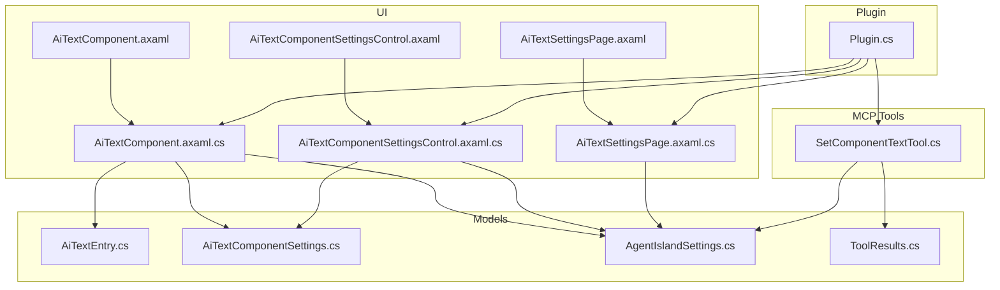
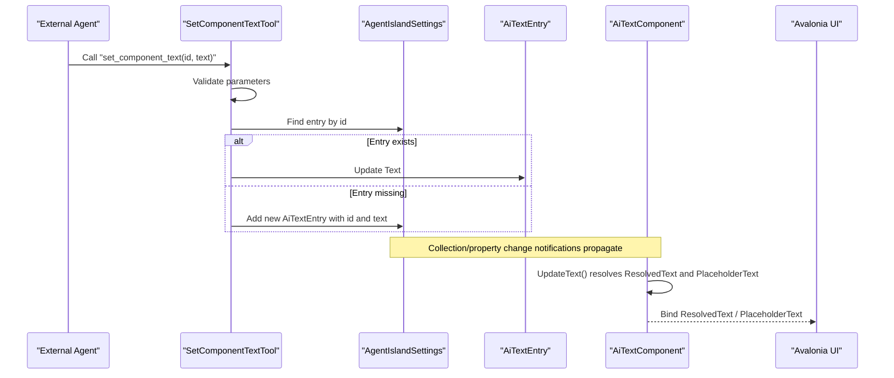
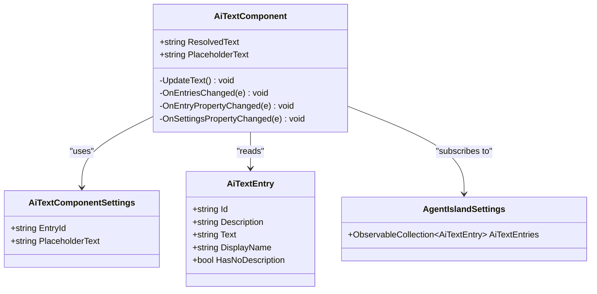
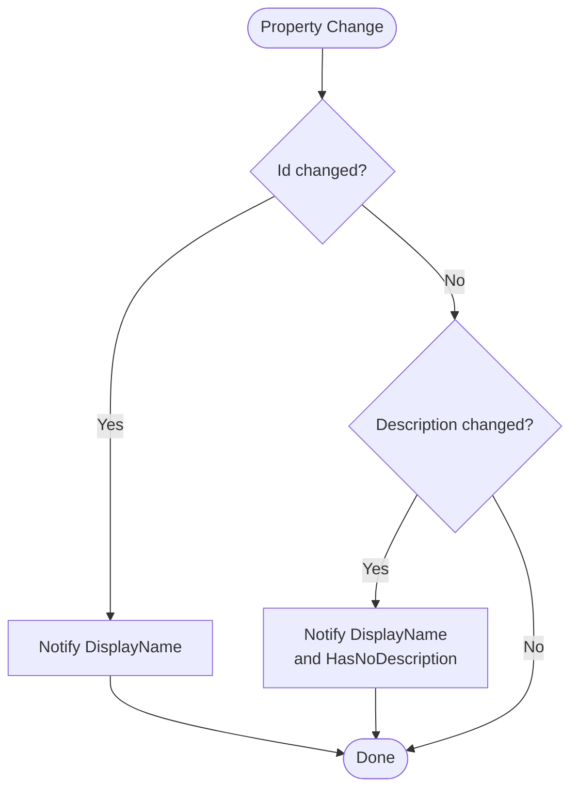
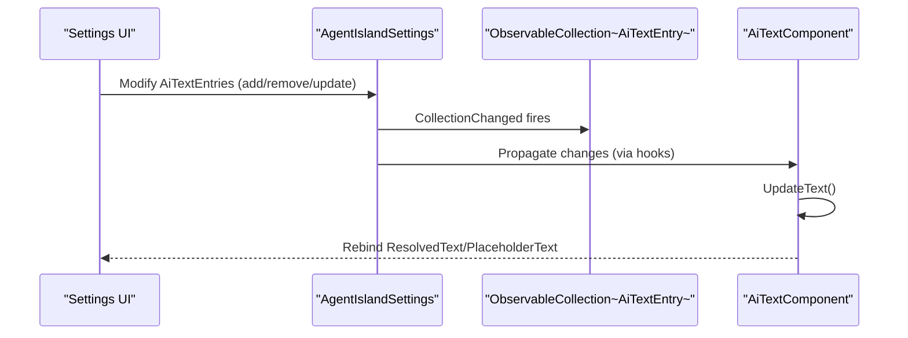
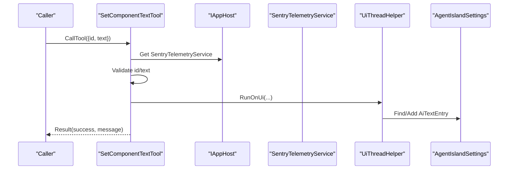
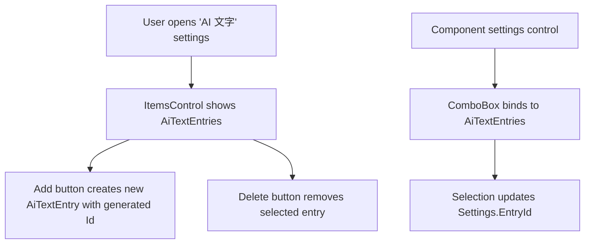
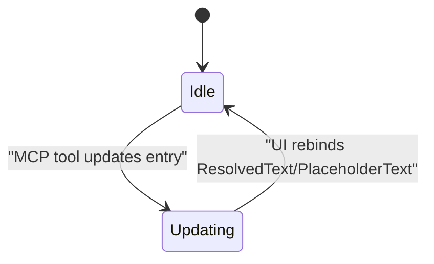
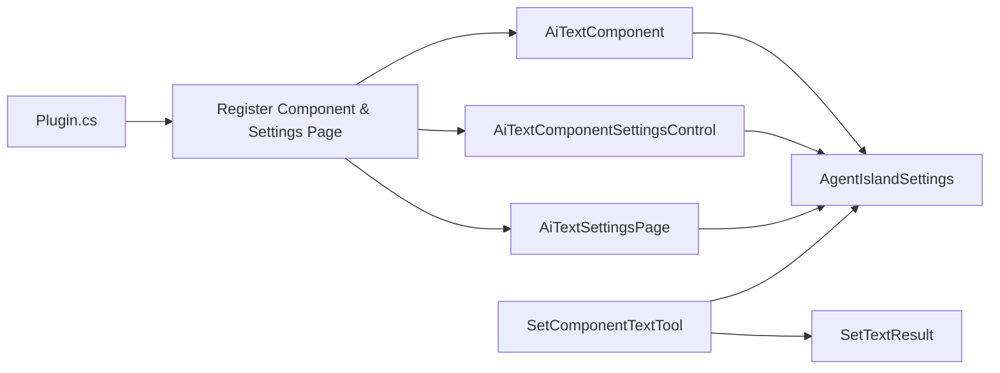

# AI Text Component

<cite>
**Referenced Files in This Document**
- [AiTextComponent.axaml.cs](file://Components/AiTextComponent.axaml.cs)
- [AiTextComponent.axaml](file://Components/AiTextComponent.axaml)
- [AiTextComponentSettingsControl.axaml.cs](file://Components/AiTextComponentSettingsControl.axaml.cs)
- [AiTextComponentSettingsControl.axaml](file://Components/AiTextComponentSettingsControl.axaml)
- [AiTextEntry.cs](file://Models/AiTextEntry.cs)
- [AiTextComponentSettings.cs](file://Models/AiTextComponentSettings.cs)
- [AgentIslandSettings.cs](file://Models/AgentIslandSettings.cs)
- [SetComponentTextTool.cs](file://Mcp/Tools/SetComponentTextTool.cs)
- [AiTextSettingsPage.axaml.cs](file://Views/SettingsPages/AiTextSettingsPage.axaml.cs)
- [AiTextSettingsPage.axaml](file://Views/SettingsPages/AiTextSettingsPage.axaml)
- [Plugin.cs](file://Plugin.cs)
- [ToolResults.cs](file://Models/ToolResults.cs)
</cite>

## Table of Contents
1. [Introduction](#introduction)
2. [Project Structure](#project-structure)
3. [Core Components](#core-components)
4. [Architecture Overview](#architecture-overview)
5. [Detailed Component Analysis](#detailed-component-analysis)
6. [Dependency Analysis](#dependency-analysis)
7. [Performance Considerations](#performance-considerations)
8. [Troubleshooting Guide](#troubleshooting-guide)
9. [Conclusion](#conclusion)
10. [Appendices](#appendices)

## Introduction
This document explains the AI Text Component system within AgentIsland, a ClassIsland plugin. It covers:
- How AiTextComponent integrates with ClassIsland’s component framework
- Dynamic content management via MCP tools (set_component_text)
- Real-time update mechanisms using Avalonia properties and observable collections
- Data binding patterns for ResolvedText and PlaceholderText
- Event handling for collection changes and property updates
- Lifecycle management of component instances
- The AiTextEntry model structure and settings configuration options
- How components subscribe to global settings changes
- Practical examples for creating custom entries, updating content via MCP, and implementing responsive placeholder behavior
- Performance considerations for large collections and memory management

## Project Structure
The AI Text Component spans UI, models, settings, and an MCP tool that updates content at runtime.

**Diagram sources**
- [AiTextComponent.axaml:1-20](file://Components/AiTextComponent.axaml#L1-L20)
- [AiTextComponent.axaml.cs:1-85](file://Components/AiTextComponent.axaml.cs#L1-L85)
- [AiTextComponentSettingsControl.axaml:1-32](file://Components/AiTextComponentSettingsControl.axaml#L1-L32)
- [AiTextComponentSettingsControl.axaml.cs:1-53](file://Components/AiTextComponentSettingsControl.axaml.cs#L1-L53)
- [AiTextSettingsPage.axaml:1-81](file://Views/SettingsPages/AiTextSettingsPage.axaml#L1-L81)
- [AiTextSettingsPage.axaml.cs:1-36](file://Views/SettingsPages/AiTextSettingsPage.axaml.cs#L1-L36)
- [AiTextEntry.cs:1-31](file://Models/AiTextEntry.cs#L1-L31)
- [AiTextComponentSettings.cs:1-13](file://Models/AiTextComponentSettings.cs#L1-L13)
- [AgentIslandSettings.cs:1-394](file://Models/AgentIslandSettings.cs#L1-L394)
- [SetComponentTextTool.cs:1-92](file://Mcp/Tools/SetComponentTextTool.cs#L1-L92)
- [Plugin.cs:1-114](file://Plugin.cs#L1-L114)
- [ToolResults.cs:1-59](file://Models/ToolResults.cs#L1-L59)

**Section sources**
- [Plugin.cs:29-53](file://Plugin.cs#L29-L53)
- [AiTextComponent.axaml.cs:11-16](file://Components/AiTextComponent.axaml.cs#L11-L16)
- [AiTextComponentSettingsControl.axaml.cs:7-14](file://Components/AiTextComponentSettingsControl.axaml.cs#L7-L14)
- [AiTextSettingsPage.axaml.cs:9-13](file://Views/SettingsPages/AiTextSettingsPage.axaml.cs#L9-L13)

## Core Components
- AiTextComponent: Renders text bound to a selected entry and shows a placeholder when empty. Exposes Avalonia properties ResolvedText and PlaceholderText.
- AiTextComponentSettings: Per-instance settings including EntryId and PlaceholderText.
- AiTextEntry: Observable data item with Id, Description, and Text; provides DisplayName and HasNoDescription derived properties.
- AgentIslandSettings: Central settings container holding ObservableCollection<AiTextEntry>. Hooks into collection events to notify subscribers.
- SetComponentTextTool: MCP tool that updates or creates entries by ID on the UI thread.
- Settings UI: AiTextSettingsPage manages entries globally; AiTextComponentSettingsControl binds per-instance selection.

Key responsibilities:
- Data binding: ResolvedText and PlaceholderText are updated based on current entry and settings.
- Event-driven updates: CollectionChanged and PropertyChanged propagate changes to the UI.
- MCP integration: set_component_text updates entries asynchronously and marshals to UI thread.

**Section sources**
- [AiTextComponent.axaml.cs:18-34](file://Components/AiTextComponent.axaml.cs#L18-L34)
- [AiTextComponent.axaml.cs:73-83](file://Components/AiTextComponent.axaml.cs#L73-L83)
- [AiTextComponentSettings.cs:5-12](file://Models/AiTextComponentSettings.cs#L5-L12)
- [AiTextEntry.cs:5-30](file://Models/AiTextEntry.cs#L5-L30)
- [AgentIslandSettings.cs:107-122](file://Models/AgentIslandSettings.cs#L107-L122)
- [SetComponentTextTool.cs:41-72](file://Mcp/Tools/SetComponentTextTool.cs#L41-L72)

## Architecture Overview
The system follows a reactive pattern:
- Global settings hold an observable list of entries.
- Components subscribe to collection and property changes to refresh their display.
- MCP tools mutate entries on the UI thread, triggering updates automatically.

**Diagram sources**
- [SetComponentTextTool.cs:41-72](file://Mcp/Tools/SetComponentTextTool.cs#L41-L72)
- [AgentIslandSettings.cs:340-392](file://Models/AgentIslandSettings.cs#L340-L392)
- [AiTextComponent.axaml.cs:73-83](file://Components/AiTextComponent.axaml.cs#L73-L83)

## Detailed Component Analysis

### AiTextComponent
- Integrates with ClassIsland via ComponentBase<TSettings>, enabling per-instance settings injection.
- Registers two Avalonia properties: ResolvedText and PlaceholderText.
- On Loaded: subscribes to global collection changes and individual entry property changes; also subscribes to settings changes.
- On Unloaded: unsubscribes from all events to prevent leaks.
- UpdateText(): finds the entry by Settings.EntryId, sets ResolvedText to the entry’s Text if non-empty, otherwise empty; sets PlaceholderText from Settings.PlaceholderText; toggles visibility of the placeholder TextBlock accordingly.

**Diagram sources**
- [AiTextComponent.axaml.cs:16-83](file://Components/AiTextComponent.axaml.cs#L16-L83)
- [AiTextComponentSettings.cs:5-12](file://Models/AiTextComponentSettings.cs#L5-L12)
- [AiTextEntry.cs:5-30](file://Models/AiTextEntry.cs#L5-L30)
- [AgentIslandSettings.cs:107-122](file://Models/AgentIslandSettings.cs#L107-L122)

**Section sources**
- [AiTextComponent.axaml.cs:11-16](file://Components/AiTextComponent.axaml.cs#L11-L16)
- [AiTextComponent.axaml.cs:36-56](file://Components/AiTextComponent.axaml.cs#L36-L56)
- [AiTextComponent.axaml.cs:58-83](file://Components/AiTextComponent.axaml.cs#L58-L83)
- [AiTextComponent.axaml:10-18](file://Components/AiTextComponent.axaml#L10-L18)

### AiTextEntry Model
- Observable fields: Id, Description, Text.
- Derived properties: DisplayName (shows Description if present, else Id), HasNoDescription.
- Partial methods ensure DisplayName and HasNoDescription update when Id or Description change.

**Diagram sources**
- [AiTextEntry.cs:20-29](file://Models/AiTextEntry.cs#L20-L29)

**Section sources**
- [AiTextEntry.cs:5-30](file://Models/AiTextEntry.cs#L5-L30)

### AiTextComponentSettings
- Per-instance settings: EntryId (binds to which entry to render) and PlaceholderText (fallback message).
- Inherits from ObservableRecipient to participate in MVVM messaging where applicable.

**Section sources**
- [AiTextComponentSettings.cs:5-12](file://Models/AiTextComponentSettings.cs#L5-L12)

### Global Settings and Collections
- AgentIslandSettings holds AiTextEntries as an ObservableCollection.
- Provides hooking/unhooking logic to attach/detach event handlers when the collection is replaced.
- Raises derived property changes when entries are added/removed or modified.

**Diagram sources**
- [AgentIslandSettings.cs:340-392](file://Models/AgentIslandSettings.cs#L340-L392)
- [AiTextComponent.axaml.cs:60-71](file://Components/AiTextComponent.axaml.cs#L60-L71)

**Section sources**
- [AgentIslandSettings.cs:107-122](file://Models/AgentIslandSettings.cs#L107-L122)
- [AgentIslandSettings.cs:340-392](file://Models/AgentIslandSettings.cs#L340-L392)

### MCP Tool: SetComponentTextTool
- Declares input schema requiring id and text.
- Validates arguments, logs telemetry, then updates or creates an entry on the UI thread.
- Returns a structured result using SetTextResult.

**Diagram sources**
- [SetComponentTextTool.cs:19-39](file://Mcp/Tools/SetComponentTextTool.cs#L19-L39)
- [SetComponentTextTool.cs:41-72](file://Mcp/Tools/SetComponentTextTool.cs#L41-L72)
- [ToolResults.cs:55-57](file://Models/ToolResults.cs#L55-L57)

**Section sources**
- [SetComponentTextTool.cs:30-39](file://Mcp/Tools/SetComponentTextTool.cs#L30-L39)
- [SetComponentTextTool.cs:41-72](file://Mcp/Tools/SetComponentTextTool.cs#L41-L72)
- [ToolResults.cs:55-57](file://Models/ToolResults.cs#L55-L57)

### Settings Pages and Controls
- AiTextSettingsPage: Adds/removes entries globally; binds to Plugin.Settings.AiTextEntries.
- AiTextComponentSettingsControl: Selects a specific entry for the current component instance and edits PlaceholderText.

**Diagram sources**
- [AiTextSettingsPage.axaml.cs:22-34](file://Views/SettingsPages/AiTextSettingsPage.axaml.cs#L22-L34)
- [AiTextComponentSettingsControl.axaml.cs:29-51](file://Components/AiTextComponentSettingsControl.axaml.cs#L29-L51)

**Section sources**
- [AiTextSettingsPage.axaml.cs:9-13](file://Views/SettingsPages/AiTextSettingsPage.axaml.cs#L9-L13)
- [AiTextSettingsPage.axaml.cs:22-34](file://Views/SettingsPages/AiTextSettingsPage.axaml.cs#L22-L34)
- [AiTextComponentSettingsControl.axaml.cs:16-27](file://Components/AiTextComponentSettingsControl.axaml.cs#L16-L27)
- [AiTextComponentSettingsControl.axaml.cs:29-51](file://Components/AiTextComponentSettingsControl.axaml.cs#L29-L51)

### Conceptual Overview
At runtime, external agents call the MCP tool to update text. The tool mutates the global collection on the UI thread. Components reactively update their displayed text and placeholder visibility without manual refresh calls.

[No sources needed since this diagram shows conceptual workflow, not actual code structure]

## Dependency Analysis
- AiTextComponent depends on:
  - ClassIsland core controls (ComponentBase)
  - Avalonia properties for binding
  - Global settings (Plugin.Settings.AiTextEntries)
  - Per-instance settings (AiTextComponentSettings)
- AiTextComponentSettingsControl depends on:
  - Global settings for listing entries
  - Per-instance settings for selection and placeholder text
- SetComponentTextTool depends on:
  - Global settings for mutation
  - UI thread helper for safe updates
  - Structured result type for responses

**Diagram sources**
- [Plugin.cs:44-49](file://Plugin.cs#L44-L49)
- [AiTextComponent.axaml.cs:11-16](file://Components/AiTextComponent.axaml.cs#L11-L16)
- [AiTextComponentSettingsControl.axaml.cs:7-14](file://Components/AiTextComponentSettingsControl.axaml.cs#L7-L14)
- [AiTextSettingsPage.axaml.cs:9-13](file://Views/SettingsPages/AiTextSettingsPage.axaml.cs#L9-L13)
- [SetComponentTextTool.cs:41-72](file://Mcp/Tools/SetComponentTextTool.cs#L41-L72)
- [ToolResults.cs:55-57](file://Models/ToolResults.cs#L55-L57)

**Section sources**
- [Plugin.cs:44-49](file://Plugin.cs#L44-L49)
- [AiTextComponent.axaml.cs:11-16](file://Components/AiTextComponent.axaml.cs#L11-L16)
- [AiTextComponentSettingsControl.axaml.cs:7-14](file://Components/AiTextComponentSettingsControl.axaml.cs#L7-L14)
- [AiTextSettingsPage.axaml.cs:9-13](file://Views/SettingsPages/AiTextSettingsPage.axaml.cs#L9-L13)
- [SetComponentTextTool.cs:41-72](file://Mcp/Tools/SetComponentTextTool.cs#L41-L72)
- [ToolResults.cs:55-57](file://Models/ToolResults.cs#L55-L57)

## Performance Considerations
- Large collections:
  - Avoid heavy work in UpdateText(). Current implementation performs a single LINQ FirstOrDefault lookup by Id. For very large lists, consider maintaining a dictionary mapping Id to entry for O(1) access.
  - Debounce rapid updates if many entries change frequently to reduce UI churn.
- Memory management:
  - Ensure all event subscriptions are removed in Unloaded to avoid leaks. The component already unregisters from collection and property change events.
  - Prefer weak references if subscribing to long-lived services outside the component lifecycle.
- UI thread marshaling:
  - MCP tool uses UiThreadHelper.RunOnUi to safely mutate entries. Keep such operations minimal to avoid blocking the UI thread.
- Binding efficiency:
  - Use one-way bindings for read-only displays where possible.
  - Minimize unnecessary OnPropertyChanged calls; only raise when values actually change.

[No sources needed since this section provides general guidance]

## Troubleshooting Guide
- No text shown:
  - Verify Settings.EntryId matches an existing AiTextEntry.Id.
  - Confirm PlaceholderText is configured appropriately.
- Placeholder not hiding:
  - Ensure ResolvedText is set to empty string when no content; the component toggles PlaceholderTextBlock.IsVisible based on content presence.
- MCP updates not reflected:
  - Check that the tool receives valid id and text parameters.
  - Confirm the entry exists or is created by the tool; verify logging breadcrumbs and exceptions captured by telemetry.
- Settings page issues:
  - Ensure ItemsSource is bound to Plugin.Settings.AiTextEntries and selection updates Settings.EntryId.

**Section sources**
- [AiTextComponent.axaml.cs:73-83](file://Components/AiTextComponent.axaml.cs#L73-L83)
- [SetComponentTextTool.cs:41-72](file://Mcp/Tools/SetComponentTextTool.cs#L41-L72)
- [AiTextComponentSettingsControl.axaml.cs:29-51](file://Components/AiTextComponentSettingsControl.axaml.cs#L29-L51)

## Conclusion
The AI Text Component provides a simple, reactive way to display dynamic text managed by external agents through MCP. Its design leverages Avalonia properties, observable collections, and careful event subscription to keep the UI synchronized with minimal overhead. With proper configuration and MCP usage, it enables flexible, real-time content updates across ClassIsland’s interface.

[No sources needed since this section summarizes without analyzing specific files]

## Appendices

### Practical Examples

- Creating a custom text entry:
  - Open “AgentIsland / AI 文字” settings page and add a new entry with a unique Id.
  - In a component instance, select the entry via its settings control to bind ResolvedText to that entry.

- Updating content via MCP:
  - Call set_component_text with id and text. If the id does not exist, the tool will create a new entry with the provided text.

- Implementing responsive placeholder behavior:
  - Configure PlaceholderText in the component’s settings. When ResolvedText is empty, the placeholder becomes visible; otherwise, it hides.

[No sources needed since this section provides general guidance]