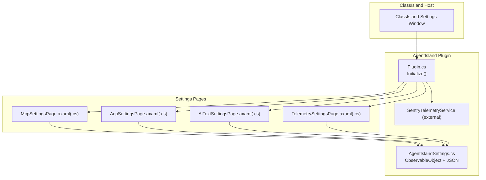
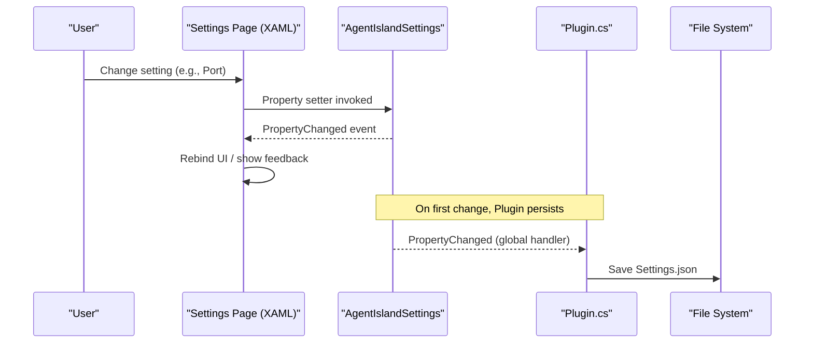
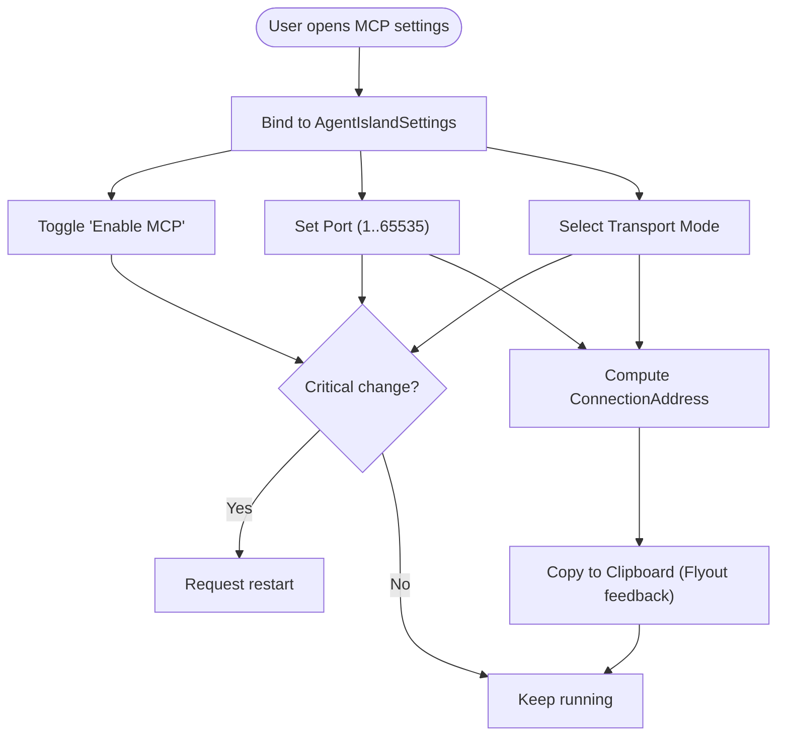
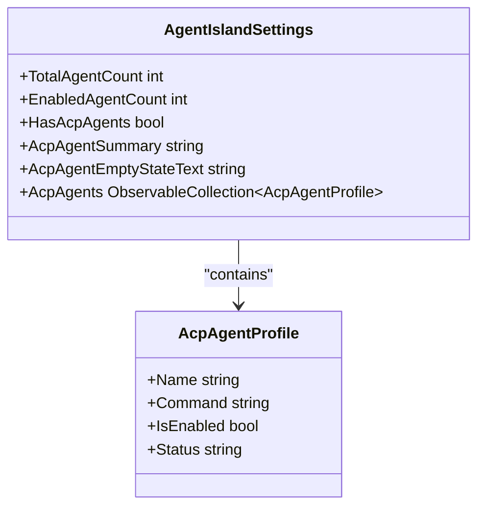
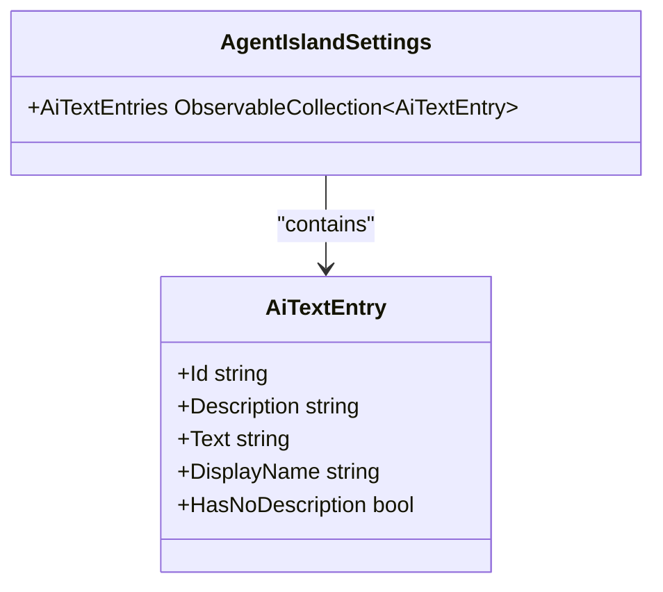
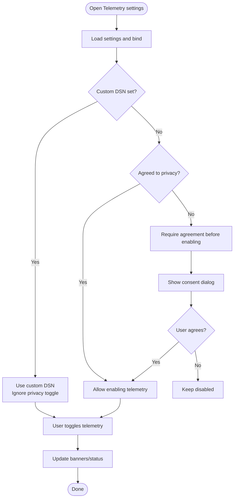
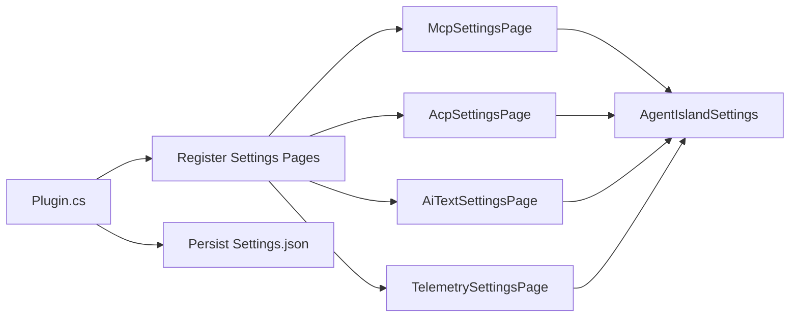

# Settings Pages

<cite>
**Referenced Files in This Document**
- [Plugin.cs](file://Plugin.cs)
- [McpSettingsPage.axaml](file://Views/SettingsPages/McpSettingsPage.axaml)
- [McpSettingsPage.axaml.cs](file://Views/SettingsPages/McpSettingsPage.axaml.cs)
- [AcpSettingsPage.axaml](file://Views/SettingsPages/AcpSettingsPage.axaml)
- [AcpSettingsPage.axaml.cs](file://Views/SettingsPages/AcpSettingsPage.axaml.cs)
- [AiTextSettingsPage.axaml](file://Views/SettingsPages/AiTextSettingsPage.axaml)
- [AiTextSettingsPage.axaml.cs](file://Views/SettingsPages/AiTextSettingsPage.axaml.cs)
- [TelemetrySettingsPage.axaml](file://Views/SettingsPages/TelemetrySettingsPage.axaml)
- [TelemetrySettingsPage.axaml.cs](file://Views/SettingsPages/TelemetrySettingsPage.axaml.cs)
- [AgentIslandSettings.cs](file://Models/AgentIslandSettings.cs)
- [AcpAgentProfile.cs](file://Models/AcpAgentProfile.cs)
- [AiTextEntry.cs](file://Models/AiTextEntry.cs)
- [McpTransportMode.cs](file://Models/McpTransportMode.cs)
- [AiTextComponentSettings.cs](file://Models/AiTextComponentSettings.cs)
</cite>

## Table of Contents
1. [Introduction](#introduction)
2. [Project Structure](#project-structure)
3. [Core Components](#core-components)
4. [Architecture Overview](#architecture-overview)
5. [Detailed Component Analysis](#detailed-component-analysis)
6. [Dependency Analysis](#dependency-analysis)
7. [Performance Considerations](#performance-considerations)
8. [Troubleshooting Guide](#troubleshooting-guide)
9. [Conclusion](#conclusion)
10. [Appendices](#appendices)

## Introduction
This document explains AgentIsland’s settings pages framework and the individual configuration interfaces for MCP server, ACP agent management, AI text customization, and telemetry controls. It covers common MVVM patterns with Avalonia UI, reactive property binding, form validation, user feedback mechanisms, integration with ClassIsland’s settings dialog, data persistence, accessibility, cross-platform compatibility, responsive design, and guidelines for extending the interface with new pages.

## Project Structure
The settings feature is implemented as a set of Avalonia XAML pages backed by code-behind classes that extend a shared base class provided by ClassIsland. Each page is annotated to be discovered and registered into ClassIsland’s settings window. The runtime wiring and persistence are handled by the plugin entry point.

**Diagram sources**
- [Plugin.cs:29-53](file://Plugin.cs#L29-L53)
- [AgentIslandSettings.cs:13-32](file://Models/AgentIslandSettings.cs#L13-L32)

**Section sources**
- [Plugin.cs:29-53](file://Plugin.cs#L29-L53)

## Core Components
- Settings pages inherit from ClassIsland’s base settings page and are annotated with metadata so ClassIsland can discover them.
- Data context is bound to a global settings object implementing INotifyPropertyChanged via CommunityToolkit.Mvvm.
- Collections use ObservableCollection to reflect add/remove operations in the UI.
- Derived properties compute read-only values and raise change notifications when inputs change.
- Persistence is automatic: changes to the settings object trigger save to disk.

Key responsibilities:
- McpSettingsPage: transport mode, port, connection address display, restart request on critical changes.
- AcpSettingsPage: manage agent profiles (add/remove, enable/disable all).
- AiTextSettingsPage: manage AI text entries (add/delete), edit ID/description/text.
- TelemetrySettingsPage: privacy policy consent, custom DSN, test message, banner visibility logic.

**Section sources**
- [McpSettingsPage.axaml.cs:14-41](file://Views/SettingsPages/McpSettingsPage.axaml.cs#L14-L41)
- [AcpSettingsPage.axaml.cs:13-65](file://Views/SettingsPages/AcpSettingsPage.axaml.cs#L13-L65)
- [AiTextSettingsPage.axaml.cs:9-35](file://Views/SettingsPages/AiTextSettingsPage.axaml.cs#L9-L35)
- [TelemetrySettingsPage.axaml.cs:15-144](file://Views/SettingsPages/TelemetrySettingsPage.axaml.cs#L15-L144)
- [AgentIslandSettings.cs:13-394](file://Models/AgentIslandSettings.cs#L13-L394)

## Architecture Overview
The settings system follows MVVM:
- View: Avalonia XAML pages.
- ViewModel: Shared settings model (AgentIslandSettings) exposing observable properties and derived state.
- Model: Plain data structures (AcpAgentProfile, AiTextEntry, McpTransportMode).

Data flow:
- User edits UI → bound property updates → ObservableObject raises PropertyChanged → UI rebinds automatically.
- Collection changes (Add/Remove) propagate via ObservableCollection events.
- Derived properties update dependent UI elements (e.g., ConnectionAddress, telemetry toggles).
- Global settings persistence is wired once at plugin initialization.

**Diagram sources**
- [Plugin.cs:31-34](file://Plugin.cs#L31-L34)
- [AgentIslandSettings.cs:240-273](file://Models/AgentIslandSettings.cs#L240-L273)

## Detailed Component Analysis

### Common Patterns Across All Settings Pages
- Registration and discovery:
  - Each page is decorated with a settings page attribute specifying id, name, and category.
  - Pages are added to the DI container during plugin initialization.
- Reactive binding:
  - DataContext is set to the global settings instance.
  - Properties use CommunityToolkit.Mvvm’s SetProperty or partial methods to notify changes.
- User feedback:
  - Flyouts for copy-to-clipboard confirmation.
  - ContentDialog for confirmations (privacy policy).
  - Banners and status text for contextual guidance.
- Restart prompts:
  - Some changes require restarting services; pages request a restart when needed.

**Section sources**
- [Plugin.cs:45-48](file://Plugin.cs#L45-L48)
- [McpSettingsPage.axaml.cs:26-41](file://Views/SettingsPages/McpSettingsPage.axaml.cs#L26-L41)
- [TelemetrySettingsPage.axaml.cs:75-124](file://Views/SettingsPages/TelemetrySettingsPage.axaml.cs#L75-L124)

### MCP Server Configuration
Features:
- Enable/disable MCP server.
- Configure listening port with numeric constraints.
- Select transport mode (Streamable HTTP active; SSE disabled in UI).
- Display computed connection address and copy it to clipboard.
- Link to external documentation.

Reactive behavior:
- Changing IsEnabled, Port, or TransportMode triggers a restart request.
- ConnectionAddress is derived from Port and TransportMode.

**Diagram sources**
- [McpSettingsPage.axaml.cs:33-41](file://Views/SettingsPages/McpSettingsPage.axaml.cs#L33-L41)
- [McpSettingsPage.axaml.cs:43-54](file://Views/SettingsPages/McpSettingsPage.axaml.cs#L43-L54)
- [AgentIslandSettings.cs:204-211](file://Models/AgentIslandSettings.cs#L204-L211)
- [McpTransportMode.cs:6-17](file://Models/McpTransportMode.cs#L6-L17)

**Section sources**
- [McpSettingsPage.axaml:17-83](file://Views/SettingsPages/McpSettingsPage.axaml#L17-L83)
- [McpSettingsPage.axaml.cs:26-63](file://Views/SettingsPages/McpSettingsPage.axaml.cs#L26-L63)
- [AgentIslandSettings.cs:204-211](file://Models/AgentIslandSettings.cs#L204-L211)
- [McpTransportMode.cs:6-17](file://Models/McpTransportMode.cs#L6-L17)

### ACP Agent Management
Features:
- Add/remove agent profiles.
- Bulk enable/disable agents.
- Edit per-agent Name, Command, Enabled flag, and Status.
- Summary and empty-state messaging driven by derived properties.

Data model:
- AcpAgentProfile exposes Name, Command, IsEnabled, Status.
- AgentIslandSettings maintains an ObservableCollection<AcpAgentProfile> and derives counts and summary strings.

**Diagram sources**
- [AgentIslandSettings.cs:214-238](file://Models/AgentIslandSettings.cs#L214-L238)
- [AcpAgentProfile.cs:9-43](file://Models/AcpAgentProfile.cs#L9-L43)

UI interactions:
- Add creates a new profile with default values.
- Remove deletes selected profile.
- Enable/Disable All toggles IsEnabled across all items.

**Section sources**
- [AcpSettingsPage.axaml:31-103](file://Views/SettingsPages/AcpSettingsPage.axaml#L31-L103)
- [AcpSettingsPage.axaml.cs:31-64](file://Views/SettingsPages/AcpSettingsPage.axaml.cs#L31-L64)
- [AcpAgentProfile.cs:9-43](file://Models/AcpAgentProfile.cs#L9-L43)
- [AgentIslandSettings.cs:275-338](file://Models/AgentIslandSettings.cs#L275-L338)

### AI Text Customization
Features:
- Manage AI text entries with unique IDs.
- Provide optional description and current text (updated by AI via MCP tooling).
- Add/Delete entries from the list.

Model highlights:
- AiTextEntry exposes Id, Description, Text and computed DisplayName and HasNoDescription.
- Changes to Id/Description update DisplayName and HasNoDescription via partial methods.

**Diagram sources**
- [AiTextEntry.cs:5-30](file://Models/AiTextEntry.cs#L5-L30)
- [AgentIslandSettings.cs:107-122](file://Models/AgentIslandSettings.cs#L107-L122)

UI interactions:
- Add Entry creates a new item with a generated Id.
- Delete Entry removes the selected item.
- Empty state shown when no entries exist.

**Section sources**
- [AiTextSettingsPage.axaml:13-77](file://Views/SettingsPages/AiTextSettingsPage.axaml#L13-L77)
- [AiTextSettingsPage.axaml.cs:22-34](file://Views/SettingsPages/AiTextSettingsPage.axaml.cs#L22-L34)
- [AiTextEntry.cs:5-30](file://Models/AiTextEntry.cs#L5-L30)

### Telemetry Controls
Features:
- Toggle telemetry collection.
- Privacy policy agreement workflow with confirmation dialogs.
- Optional custom Sentry DSN; when set, privacy agreement is bypassed.
- Test message button (visible conditionally).
- Contextual banners explaining current telemetry state.

Derived state:
- IsTelemetryActive: enabled and either agreed or using custom DSN.
- CanToggleTelemetry: allows enabling only if agreed or custom DSN present.
- EffectiveSentryDsn: chooses custom or default.
- IsUsingCustomDsn: boolean helper for UI.

**Diagram sources**
- [TelemetrySettingsPage.axaml.cs:44-73](file://Views/SettingsPages/TelemetrySettingsPage.axaml.cs#L44-L73)
- [AgentIslandSettings.cs:176-200](file://Models/AgentIslandSettings.cs#L176-L200)

**Section sources**
- [TelemetrySettingsPage.axaml:16-101](file://Views/SettingsPages/TelemetrySettingsPage.axaml#L16-L101)
- [TelemetrySettingsPage.axaml.cs:27-144](file://Views/SettingsPages/TelemetrySettingsPage.axaml.cs#L27-L144)
- [AgentIslandSettings.cs:176-200](file://Models/AgentIslandSettings.cs#L176-L200)

## Dependency Analysis
- Plugin initialization:
  - Loads settings from disk and subscribes to PropertyChanged to persist changes.
  - Registers settings pages and services.
- Settings model:
  - Uses CommunityToolkit.Mvvm’s ObservableObject and partial methods.
  - Hooks collection change events to keep derived properties consistent.
- UI pages:
  - Depend on the global settings instance for data binding and actions.

**Diagram sources**
- [Plugin.cs:29-53](file://Plugin.cs#L29-L53)
- [AgentIslandSettings.cs:275-394](file://Models/AgentIslandSettings.cs#L275-L394)

**Section sources**
- [Plugin.cs:29-53](file://Plugin.cs#L29-L53)
- [AgentIslandSettings.cs:275-394](file://Models/AgentIslandSettings.cs#L275-L394)

## Performance Considerations
- Avoid heavy work in property setters; keep derived properties lightweight.
- Prefer ObservableCollection for collections to minimize UI refresh overhead.
- Batch UI updates where possible (e.g., bulk enable/disable already operates on each item but is acceptable for small lists).
- Use computed properties (e.g., ConnectionAddress) to avoid redundant bindings.

[No sources needed since this section provides general guidance]

## Troubleshooting Guide
- MCP server not starting:
  - Verify Port and TransportMode; changes may require restart.
  - Check logs for start/stop errors and captured exceptions.
- Telemetry not sending:
  - Ensure telemetry is enabled and privacy agreement is satisfied unless using a custom DSN.
  - Use the test message button to validate connectivity.
- Clipboard copy not working:
  - Ensure TopLevel.Clipboard is available; some environments may restrict access.

**Section sources**
- [Plugin.cs:67-78](file://Plugin.cs#L67-L78)
- [TelemetrySettingsPage.axaml.cs:126-129](file://Views/SettingsPages/TelemetrySettingsPage.axaml.cs#L126-L129)
- [McpSettingsPage.axaml.cs:43-54](file://Views/SettingsPages/McpSettingsPage.axaml.cs#L43-L54)

## Conclusion
AgentIsland’s settings pages follow a consistent MVVM pattern built on Avalonia UI and ClassIsland’s settings infrastructure. The shared settings model centralizes state, persistence, and derived computations, while each page focuses on its domain concerns. The design supports extensibility, clear user feedback, and robust integration with ClassIsland’s settings dialog.

[No sources needed since this section summarizes without analyzing specific files]

## Appendices

### Extending the Settings Interface with New Pages
Steps:
1. Create a new XAML page inheriting from the shared settings base class.
2. Decorate the class with the settings page attribute (id, name, category).
3. In the code-behind, set DataContext to the global settings instance and handle any required property change subscriptions.
4. Register the page in the plugin’s initialization method.
5. Persist changes automatically through the existing PropertyChanged subscription.

Best practices:
- Keep UI logic minimal; prefer data binding and derived properties.
- Use ContentDialog for confirmations and Flyout for lightweight feedback.
- Respect platform differences (e.g., clipboard availability).

**Section sources**
- [Plugin.cs:45-48](file://Plugin.cs#L45-L48)
- [McpSettingsPage.axaml.cs:14-31](file://Views/SettingsPages/McpSettingsPage.axaml.cs#L14-L31)
- [TelemetrySettingsPage.axaml.cs:75-124](file://Views/SettingsPages/TelemetrySettingsPage.axaml.cs#L75-L124)

### Accessibility Considerations
- Use accessible control names and ToolTip hints for icons and buttons.
- Ensure keyboard navigation works across expander items and lists.
- Provide sufficient color contrast for status banners and messages.
- Offer watermarks/placeholders to guide input.

[No sources needed since this section provides general guidance]

### Cross-Platform Compatibility
- Clipboard operations rely on TopLevel.Clipboard; guard against null in non-Windows environments.
- Process.Start usage for opening URLs is supported across platforms; ensure shell execution is available.

**Section sources**
- [McpSettingsPage.axaml.cs:47-53](file://Views/SettingsPages/McpSettingsPage.axaml.cs#L47-L53)
- [TelemetrySettingsPage.axaml.cs:131-138](file://Views/SettingsPages/TelemetrySettingsPage.axaml.cs#L131-L138)

### Responsive Design Principles
- Use ScrollViewer with auto vertical scroll for long content.
- Employ flexible layouts (Grid with column definitions) for alignment.
- Prefer relative sizing and min-width constraints for inputs.
- Use expander sections to group related options and reduce cognitive load.

**Section sources**
- [McpSettingsPage.axaml:12-86](file://Views/SettingsPages/McpSettingsPage.axaml#L12-L86)
- [AcpSettingsPage.axaml:12-106](file://Views/SettingsPages/AcpSettingsPage.axaml#L12-L106)
- [AiTextSettingsPage.axaml:9-77](file://Views/SettingsPages/AiTextSettingsPage.axaml#L9-L77)
- [TelemetrySettingsPage.axaml:12-101](file://Views/SettingsPages/TelemetrySettingsPage.axaml#L12-L101)