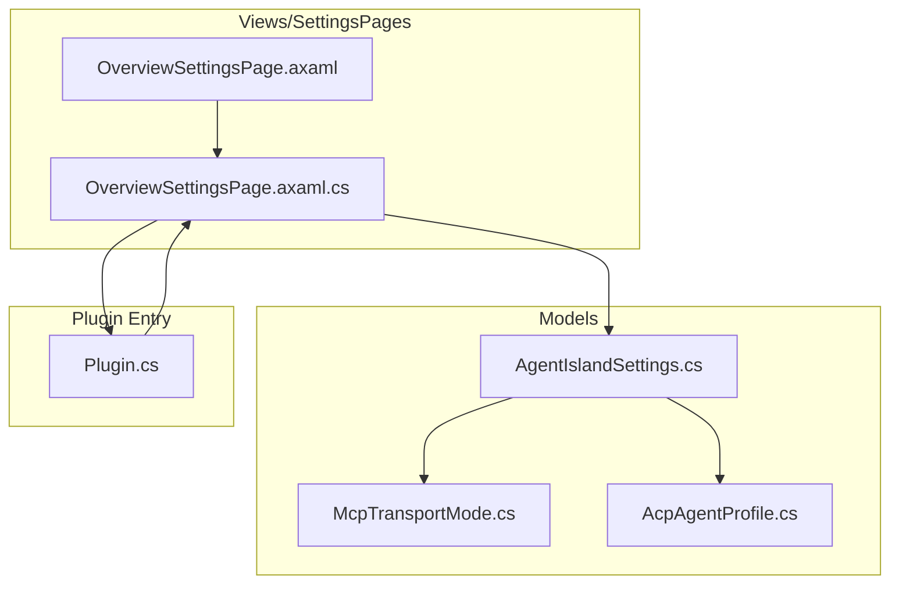
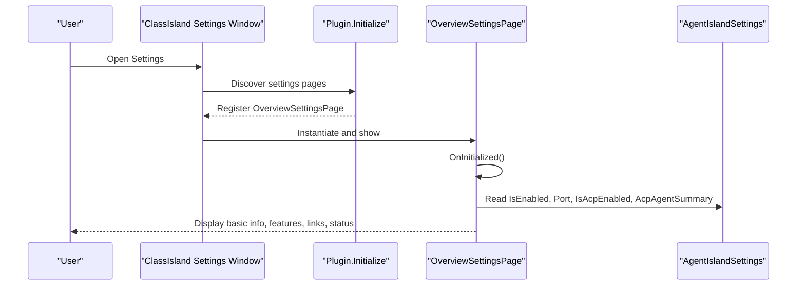
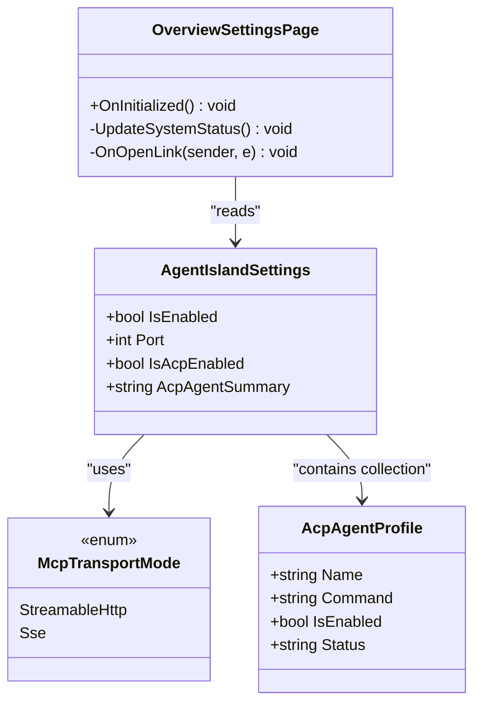
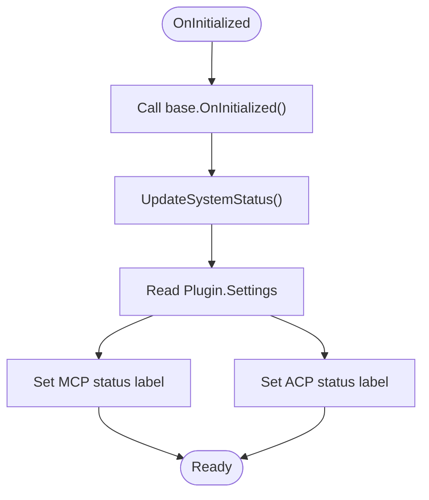
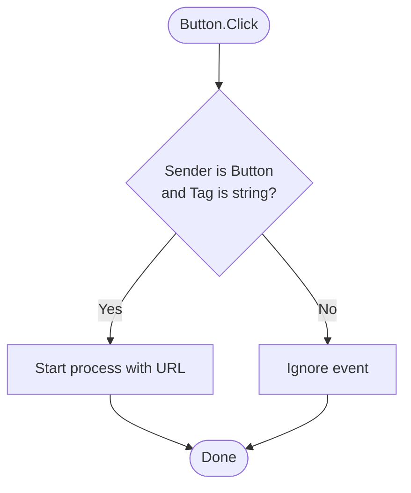
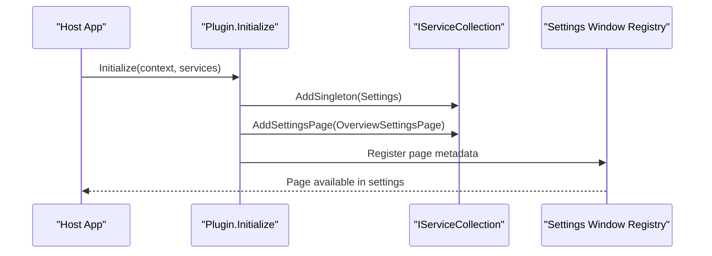
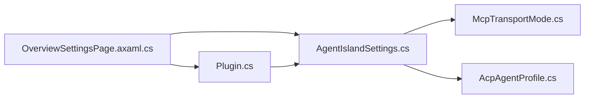

# Overview Settings Page

<cite>
**Referenced Files in This Document**
- [OverviewSettingsPage.axaml](file://Views/SettingsPages/OverviewSettingsPage.axaml)
- [OverviewSettingsPage.axaml.cs](file://Views/SettingsPages/OverviewSettingsPage.axaml.cs)
- [Plugin.cs](file://Plugin.cs)
- [AgentIslandSettings.cs](file://Models/AgentIslandSettings.cs)
- [McpTransportMode.cs](file://Models/McpTransportMode.cs)
- [AcpAgentProfile.cs](file://Models/AcpAgentProfile.cs)
- [AgentIsland.csproj](file://AgentIsland.csproj)
</cite>

## Table of Contents
1. [Introduction](#introduction)
2. [Project Structure](#project-structure)
3. [Core Components](#core-components)
4. [Architecture Overview](#architecture-overview)
5. [Detailed Component Analysis](#detailed-component-analysis)
6. [Dependency Analysis](#dependency-analysis)
7. [Performance Considerations](#performance-considerations)
8. [Troubleshooting Guide](#troubleshooting-guide)
9. [Conclusion](#conclusion)

## Introduction
This document explains the Overview Settings Page for AgentIsland, a ClassIsland plugin that provides an MCP server, ACP panel integration, AI text management, and optional telemetry. The Overview page is a read-only dashboard that shows:
- Basic plugin information (name, version, author, description)
- Feature overview
- Quick links to repository and issue tracker
- System status indicators for MCP server and ACP panel

It reads from the global settings instance and updates UI elements accordingly when the page initializes.

## Project Structure
The Overview Settings Page is implemented as an Avalonia XAML view with a code-behind file. It integrates into the ClassIsland settings window via a registration attribute and is registered by the plugin entry point.

**Diagram sources**
- [OverviewSettingsPage.axaml:1-66](file://Views/SettingsPages/OverviewSettingsPage.axaml#L1-L66)
- [OverviewSettingsPage.axaml.cs:1-57](file://Views/SettingsPages/OverviewSettingsPage.axaml.cs#L1-L57)
- [Plugin.cs:1-115](file://Plugin.cs#L1-L115)
- [AgentIslandSettings.cs:1-394](file://Models/AgentIslandSettings.cs#L1-L394)
- [McpTransportMode.cs:1-18](file://Models/McpTransportMode.cs#L1-L18)
- [AcpAgentProfile.cs:1-44](file://Models/AcpAgentProfile.cs#L1-L44)

**Section sources**
- [OverviewSettingsPage.axaml:1-66](file://Views/SettingsPages/OverviewSettingsPage.axaml#L1-L66)
- [OverviewSettingsPage.axaml.cs:1-57](file://Views/SettingsPages/OverviewSettingsPage.axaml.cs#L1-L57)
- [Plugin.cs:1-115](file://Plugin.cs#L1-L115)
- [AgentIslandSettings.cs:1-394](file://Models/AgentIslandSettings.cs#L1-L394)
- [McpTransportMode.cs:1-18](file://Models/McpTransportMode.cs#L1-L18)
- [AcpAgentProfile.cs:1-44](file://Models/AcpAgentProfile.cs#L1-L44)

## Core Components
- OverviewSettingsPage (UI): Displays static info, feature list, quick links, and system status.
- Plugin (registration): Registers the Overview page and other settings pages in the ClassIsland settings window.
- AgentIslandSettings (data): Centralized configuration model providing current runtime state used by the Overview page.

Key responsibilities:
- OverviewSettingsPage: Initialize UI, update status labels based on settings, open external links.
- Plugin: Load/save settings, register services and settings pages, start/stop MCP server.
- AgentIslandSettings: Expose properties like IsEnabled, Port, TransportMode, IsAcpEnabled, and derived summaries.

**Section sources**
- [OverviewSettingsPage.axaml.cs:10-56](file://Views/SettingsPages/OverviewSettingsPage.axaml.cs#L10-L56)
- [Plugin.cs:27-54](file://Plugin.cs#L27-L54)
- [AgentIslandSettings.cs:13-232](file://Models/AgentIslandSettings.cs#L13-L232)

## Architecture Overview
The Overview page is part of the ClassIsland settings window. It is discovered through an attribute and registered during plugin initialization. At runtime, it reads from the singleton settings instance to reflect current configuration and features.

**Diagram sources**
- [Plugin.cs:45-49](file://Plugin.cs#L45-L49)
- [OverviewSettingsPage.axaml.cs:25-42](file://Views/SettingsPages/OverviewSettingsPage.axaml.cs#L25-L42)
- [AgentIslandSettings.cs:35-232](file://Models/AgentIslandSettings.cs#L35-L232)

## Detailed Component Analysis

### OverviewSettingsPage (UI + Code-behind)
- Inherits from the framework’s base settings page control and is marked with a settings page metadata attribute so it appears in the settings window under the “External” category.
- On initialization, it calls UpdateSystemStatus to populate status labels using values from the global settings.
- Provides a click handler to open URLs stored in button Tag attributes.

**Diagram sources**
- [OverviewSettingsPage.axaml.cs:18-56](file://Views/SettingsPages/OverviewSettingsPage.axaml.cs#L18-L56)
- [AgentIslandSettings.cs:13-232](file://Models/AgentIslandSettings.cs#L13-L232)
- [McpTransportMode.cs:6-17](file://Models/McpTransportMode.cs#L6-L17)
- [AcpAgentProfile.cs:9-43](file://Models/AcpAgentProfile.cs#L9-L43)

#### Initialization Flow

**Diagram sources**
- [OverviewSettingsPage.axaml.cs:25-42](file://Views/SettingsPages/OverviewSettingsPage.axaml.cs#L25-L42)

#### Link Opening Behavior

**Diagram sources**
- [OverviewSettingsPage.axaml.cs:44-54](file://Views/SettingsPages/OverviewSettingsPage.axaml.cs#L44-L54)

**Section sources**
- [OverviewSettingsPage.axaml:1-66](file://Views/SettingsPages/OverviewSettingsPage.axaml#L1-L66)
- [OverviewSettingsPage.axaml.cs:10-56](file://Views/SettingsPages/OverviewSettingsPage.axaml.cs#L10-L56)

### Plugin Registration
The plugin registers the Overview page along with other settings pages during initialization. This makes the Overview page discoverable by the host application’s settings window.

**Diagram sources**
- [Plugin.cs:29-54](file://Plugin.cs#L29-L54)

**Section sources**
- [Plugin.cs:27-54](file://Plugin.cs#L27-L54)

### Data Model: AgentIslandSettings
The Overview page consumes several properties from this central settings object:
- IsEnabled and Port: Used to display MCP server status and port.
- IsAcpEnabled and AcpAgentSummary: Used to display ACP panel status and agent summary.
- TransportMode: Influences connection address derivation elsewhere; not directly shown in Overview but relevant to overall system behavior.

Derived properties and collections:
- AcpAgentSummary aggregates total and enabled agent counts.
- ConnectionAddress computes a local endpoint based on transport mode and port.

**Section sources**
- [AgentIslandSettings.cs:35-232](file://Models/AgentIslandSettings.cs#L35-L232)
- [McpTransportMode.cs:6-17](file://Models/McpTransportMode.cs#L6-L17)
- [AcpAgentProfile.cs:9-43](file://Models/AcpAgentProfile.cs#L9-L43)

## Dependency Analysis
- OverviewSettingsPage depends on:
  - Plugin.Settings for runtime configuration values.
  - Framework base classes for settings page lifecycle and UI controls.
- Plugin depends on:
  - Settings persistence helpers and dependency injection container.
  - Telemetry service and MCP server manager (not directly used by Overview).
- AgentIslandSettings depends on:
  - ObservableObject for property change notifications.
  - Collections of AcpAgentProfile and AiTextEntry.

**Diagram sources**
- [OverviewSettingsPage.axaml.cs:1-57](file://Views/SettingsPages/OverviewSettingsPage.axaml.cs#L1-L57)
- [Plugin.cs:1-115](file://Plugin.cs#L1-L115)
- [AgentIslandSettings.cs:1-394](file://Models/AgentIslandSettings.cs#L1-L394)
- [McpTransportMode.cs:1-18](file://Models/McpTransportMode.cs#L1-L18)
- [AcpAgentProfile.cs:1-44](file://Models/AcpAgentProfile.cs#L1-L44)

**Section sources**
- [OverviewSettingsPage.axaml.cs:1-57](file://Views/SettingsPages/OverviewSettingsPage.axaml.cs#L1-L57)
- [Plugin.cs:1-115](file://Plugin.cs#L1-L115)
- [AgentIslandSettings.cs:1-394](file://Models/AgentIslandSettings.cs#L1-L394)

## Performance Considerations
- The Overview page performs minimal work: reading a few properties and updating two labels. No heavy operations or background threads are involved.
- Avoid adding expensive computations to OnInitialized or UpdateSystemStatus to keep the settings window responsive.
- If future enhancements require live monitoring, consider debouncing or throttling updates rather than frequent full refreshes.

[No sources needed since this section provides general guidance]

## Troubleshooting Guide
- Status labels do not update after changing settings:
  - Ensure the settings instance is the same one used by the plugin (Plugin.Settings).
  - Verify that any changes trigger property change notifications if you add reactive bindings later.
- Links do not open:
  - Confirm that the button Tag contains a valid URL string.
  - Check OS shell execution permissions if opening external links fails.
- Page does not appear in settings:
  - Verify the settings page attribute is present and the page is registered by the plugin.
  - Ensure the project references the correct ClassIsland SDK and builds successfully.

**Section sources**
- [OverviewSettingsPage.axaml.cs:25-54](file://Views/SettingsPages/OverviewSettingsPage.axaml.cs#L25-L54)
- [Plugin.cs:45-49](file://Plugin.cs#L45-L49)
- [AgentIsland.csproj:22-29](file://AgentIsland.csproj#L22-L29)

## Conclusion
The Overview Settings Page provides a concise, read-only snapshot of AgentIsland’s identity, capabilities, and current runtime status. It relies on the centralized settings model and is integrated into the ClassIsland settings window through standard plugin registration mechanisms. Its simplicity ensures fast load times and clear user feedback about core subsystems such as the MCP server and ACP panel.

[No sources needed since this section summarizes without analyzing specific files]