# UI Components and Settings

<cite>
**Referenced Files in This Document**
- [AiTextComponent.axaml](file://Components/AiTextComponent.axaml)
- [AiTextComponent.axaml.cs](file://Components/AiTextComponent.axaml.cs)
- [AiTextComponentSettingsControl.axaml.cs](file://Components/AiTextComponentSettingsControl.axaml.cs)
- [AiTextComponentSettings.cs](file://Models/AiTextComponentSettings.cs)
- [AiTextEntry.cs](file://Models/AiTextEntry.cs)
- [AgentIslandSettings.cs](file://Models/AgentIslandSettings.cs)
- [AcpAgentProfile.cs](file://Models/AcpAgentProfile.cs)
- [McpTransportMode.cs](file://Models/McpTransportMode.cs)
- [Plugin.cs](file://Plugin.cs)
- [McpSettingsPage.axaml.cs](file://Views/SettingsPages/McpSettingsPage.axaml.cs)
- [AcpSettingsPage.axaml.cs](file://Views/SettingsPages/AcpSettingsPage.axaml.cs)
- [AiTextSettingsPage.axaml.cs](file://Views/SettingsPages/AiTextSettingsPage.axaml.cs)
- [TelemetrySettingsPage.axaml.cs](file://Views/SettingsPages/TelemetrySettingsPage.axaml.cs)
- [SentryTelemetryService.cs](file://Services/SentryTelemetryService.cs)
- [UiThreadHelper.cs](file://Helpers/UiThreadHelper.cs)
</cite>

## Table of Contents
1. Introduction
2. Project Structure
3. Core Components
4. Architecture Overview
5. Detailed Component Analysis
6. Dependency Analysis
7. Performance Considerations
8. Troubleshooting Guide
9. Conclusion
10. Appendices

## Introduction
This document explains AgentIsland’s user interface components and settings pages, focusing on:
- AiTextComponent architecture for dynamic content management, real-time updates, and data binding patterns
- The settings page framework built with Avalonia UI, including form validation, user feedback, and reactive configuration updates
- Each settings page: MCP configuration, ACP agent management, AI text customization, and telemetry controls
- Guidelines for extending the UI with custom components and new settings pages following MVVM patterns
- Accessibility considerations, responsive design principles, and cross-platform compatibility

## Project Structure
The UI is organized into:
- Components: Reusable runtime UI elements (e.g., AiTextComponent) and their per-component settings controls
- Views/SettingsPages: Top-level settings pages registered with the plugin host
- Models: Observable settings and domain objects used by both components and settings pages
- Services: Cross-cutting services like telemetry
- Helpers: Utilities such as UI thread helpers

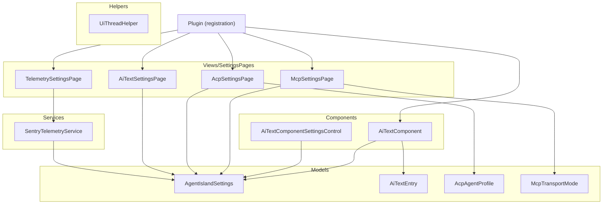

**Diagram sources**
- [Plugin.cs:29-53](file://Plugin.cs#L29-L53)
- [AiTextComponent.axaml.cs:16-84](file://Components/AiTextComponent.axaml.cs#L16-L84)
- [AiTextComponentSettingsControl.axaml.cs:7-52](file://Components/AiTextComponentSettingsControl.axaml.cs#L7-L52)
- [McpSettingsPage.axaml.cs:19-64](file://Views/SettingsPages/McpSettingsPage.axaml.cs#L19-L64)
- [AcpSettingsPage.axaml.cs:18-66](file://Views/SettingsPages/AcpSettingsPage.axaml.cs#L18-L66)
- [AiTextSettingsPage.axaml.cs:14-35](file://Views/SettingsPages/AiTextSettingsPage.axaml.cs#L14-L35)
- [TelemetrySettingsPage.axaml.cs:20-144](file://Views/SettingsPages/TelemetrySettingsPage.axaml.cs#L20-L144)
- [AgentIslandSettings.cs:13-393](file://Models/AgentIslandSettings.cs#L13-L393)
- [AiTextEntry.cs:5-30](file://Models/AiTextEntry.cs#L5-L30)
- [AcpAgentProfile.cs:9-43](file://Models/AcpAgentProfile.cs#L9-L43)
- [McpTransportMode.cs:6-17](file://Models/McpTransportMode.cs#L6-L17)
- [SentryTelemetryService.cs:11-181](file://Services/SentryTelemetryService.cs#L11-L181)

**Section sources**
- [Plugin.cs:29-53](file://Plugin.cs#L29-L53)

## Core Components
- AiTextComponent: A runtime component that displays AI-managed text with placeholder behavior and real-time updates based on global settings. It exposes Avalonia StyledProperties for resolved text and placeholder text and binds to a selected entry from the global collection.
- AiTextComponentSettingsControl: A per-instance settings control that lets users select which AiTextEntry to bind to and update the component’s EntryId setting reactively.

Key behaviors:
- Dynamic content management via ObservableCollection<AiTextEntry>
- Real-time updates through property change notifications and collection change events
- Data binding using RelativeSource bindings to component properties

**Section sources**
- [AiTextComponent.axaml.cs:16-84](file://Components/AiTextComponent.axaml.cs#L16-L84)
- [AiTextComponent.axaml:1-20](file://Components/AiTextComponent.axaml#L1-L20)
- [AiTextComponentSettingsControl.axaml.cs:7-52](file://Components/AiTextComponentSettingsControl.axaml.cs#L7-L52)
- [AiTextComponentSettings.cs:5-12](file://Models/AiTextComponentSettings.cs#L5-L12)
- [AiTextEntry.cs:5-30](file://Models/AiTextEntry.cs#L5-L30)

## Architecture Overview
The application uses an MVVM-like pattern with Avalonia UI:
- Views/SettingsPages derive from a base settings page type and are registered via attributes and dependency injection
- Models expose observable properties and collections; changes propagate to views automatically
- Services encapsulate cross-cutting concerns (e.g., telemetry) and react to settings changes
- Components integrate with the host framework and consume global settings

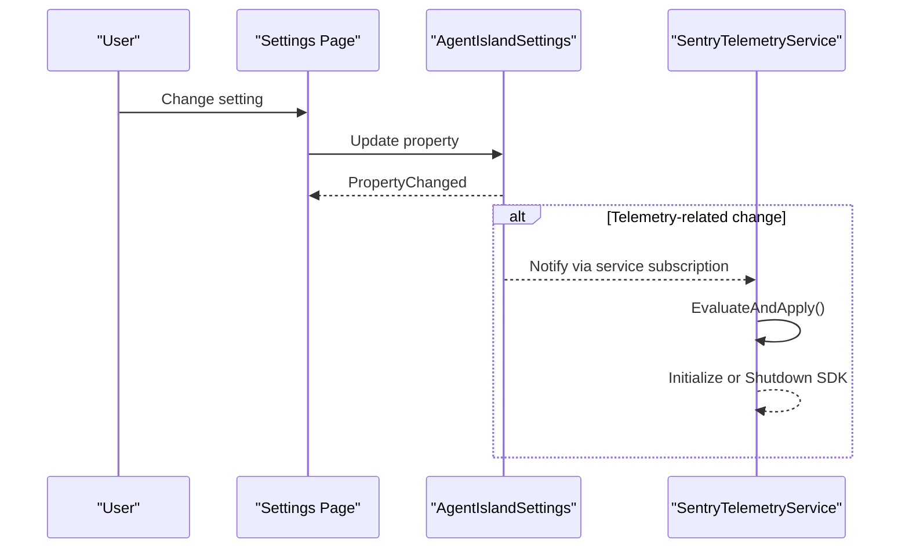

**Diagram sources**
- [McpSettingsPage.axaml.cs:26-41](file://Views/SettingsPages/McpSettingsPage.axaml.cs#L26-L41)
- [TelemetrySettingsPage.axaml.cs:27-42](file://Views/SettingsPages/TelemetrySettingsPage.axaml.cs#L27-L42)
- [AgentIslandSettings.cs:240-273](file://Models/AgentIslandSettings.cs#L240-L273)
- [SentryTelemetryService.cs:30-40](file://Services/SentryTelemetryService.cs#L30-L40)

## Detailed Component Analysis

### AiTextComponent Architecture
AiTextComponent renders either the resolved text or a placeholder depending on whether the selected entry has content. It subscribes to:
- Global collection changes for AiTextEntry
- Individual entry property changes
- Its own settings property changes

It computes ResolvedText and PlaceholderText and toggles visibility of the placeholder element accordingly.

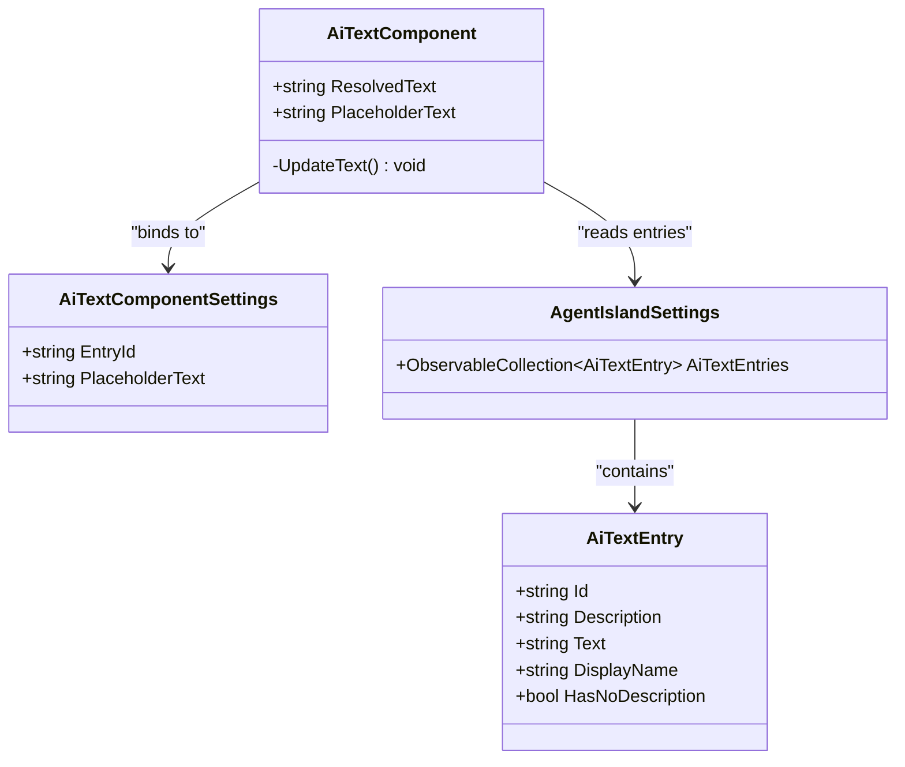

**Diagram sources**
- [AiTextComponent.axaml.cs:16-84](file://Components/AiTextComponent.axaml.cs#L16-L84)
- [AiTextComponentSettings.cs:5-12](file://Models/AiTextComponentSettings.cs#L5-L12)
- [AiTextEntry.cs:5-30](file://Models/AiTextEntry.cs#L5-L30)
- [AgentIslandSettings.cs:107-122](file://Models/AgentIslandSettings.cs#L107-L122)

Real-time update flow:

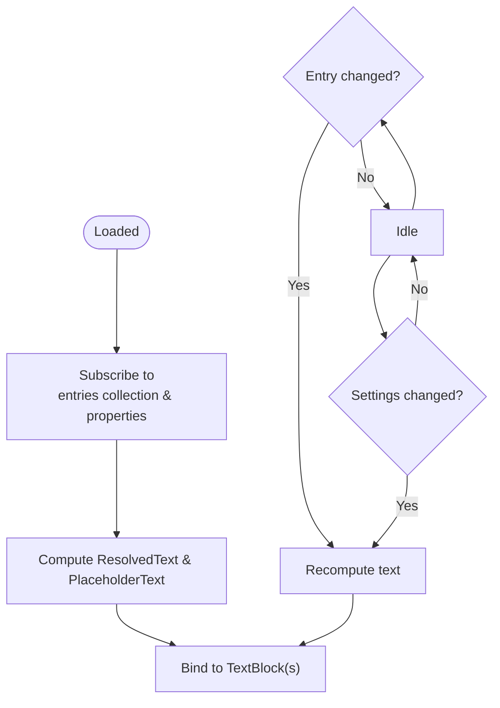

**Diagram sources**
- [AiTextComponent.axaml.cs:36-56](file://Components/AiTextComponent.axaml.cs#L36-L56)
- [AiTextComponent.axaml.cs:58-83](file://Components/AiTextComponent.axaml.cs#L58-L83)

Data binding patterns:
- RelativeSource bindings connect TextBlocks to ResolvedText and PlaceholderText
- Placeholder visibility toggled based on presence of content

**Section sources**
- [AiTextComponent.axaml.cs:16-84](file://Components/AiTextComponent.axaml.cs#L16-L84)
- [AiTextComponent.axaml:1-20](file://Components/AiTextComponent.axaml#L1-L20)

### AiTextComponentSettingsControl
Allows selecting an AiTextEntry and updating the component’s EntryId. It synchronizes selection when the global collection changes.

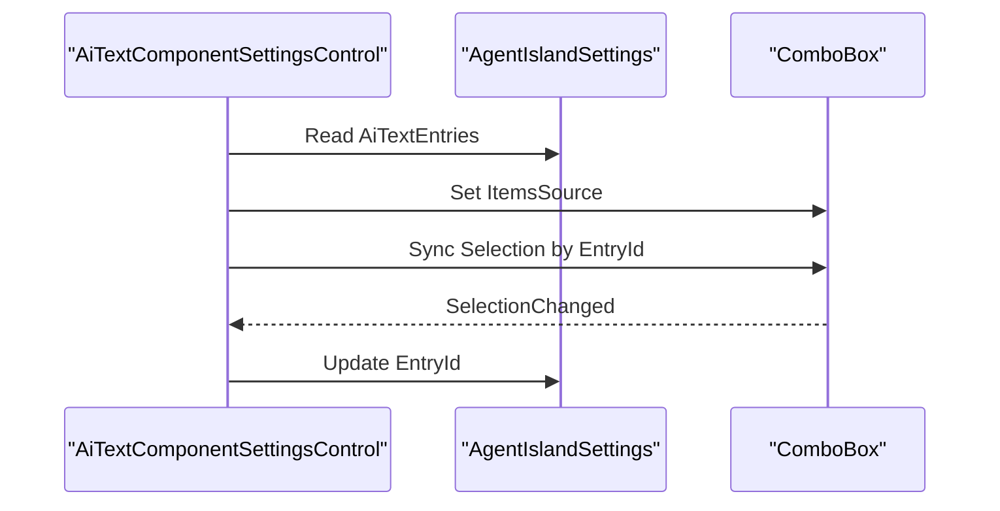

**Diagram sources**
- [AiTextComponentSettingsControl.axaml.cs:16-51](file://Components/AiTextComponentSettingsControl.axaml.cs#L16-L51)

**Section sources**
- [AiTextComponentSettingsControl.axaml.cs:7-52](file://Components/AiTextComponentSettingsControl.axaml.cs#L7-L52)

### Settings Pages Framework
All settings pages inherit from a base settings page type and are annotated with metadata for discovery and registration. They set DataContext to the global settings object and subscribe to property changes where needed.

- McpSettingsPage: Binds to MCP-related settings and requests restart when critical options change. Provides copy-to-clipboard and external link actions.
- AcpSettingsPage: Manages AcpAgentProfile list operations (add/remove, enable/disable all).
- AiTextSettingsPage: Manages AiTextEntry list operations (add/delete).
- TelemetrySettingsPage: Controls privacy consent and Sentry DSN usage, shows contextual banners and test controls.

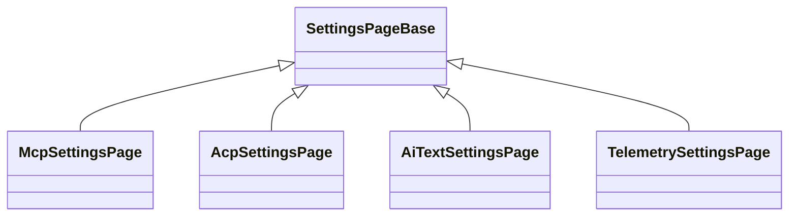

**Diagram sources**
- [McpSettingsPage.axaml.cs:19-64](file://Views/SettingsPages/McpSettingsPage.axaml.cs#L19-L64)
- [AcpSettingsPage.axaml.cs:18-66](file://Views/SettingsPages/AcpSettingsPage.axaml.cs#L18-L66)
- [AiTextSettingsPage.axaml.cs:14-35](file://Views/SettingsPages/AiTextSettingsPage.axaml.cs#L14-L35)
- [TelemetrySettingsPage.axaml.cs:20-144](file://Views/SettingsPages/TelemetrySettingsPage.axaml.cs#L20-L144)

#### MCP Configuration
- Properties: IsEnabled, Port, TransportMode
- Behavior: Requests restart when these properties change
- UX: Copy connection address to clipboard; open documentation link

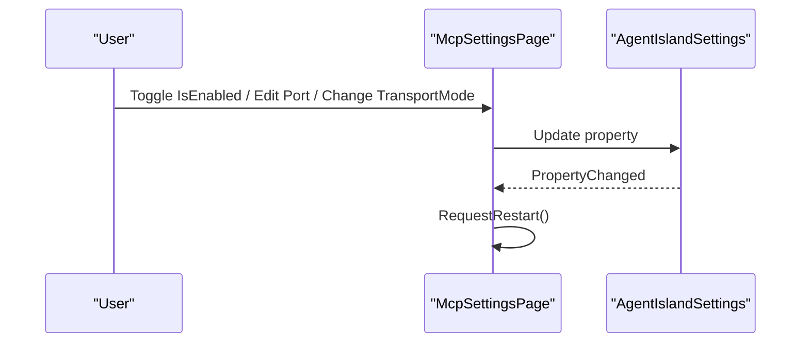

**Diagram sources**
- [McpSettingsPage.axaml.cs:26-41](file://Views/SettingsPages/McpSettingsPage.axaml.cs#L26-L41)
- [McpTransportMode.cs:6-17](file://Models/McpTransportMode.cs#L6-L17)

**Section sources**
- [McpSettingsPage.axaml.cs:19-64](file://Views/SettingsPages/McpSettingsPage.axaml.cs#L19-L64)
- [AgentIslandSettings.cs:37-62](file://Models/AgentIslandSettings.cs#L37-L62)
- [McpTransportMode.cs:6-17](file://Models/McpTransportMode.cs#L6-L17)

#### ACP Agent Management
- Operations: Add agent, remove agent, enable all, disable all
- Model: AcpAgentProfile with Name, Command, IsEnabled, Status
- Derived state: TotalAgentCount, EnabledAgentCount, summaries and empty-state text

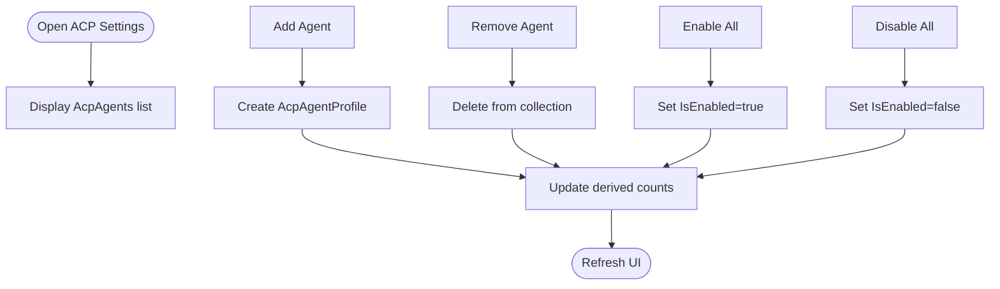

**Diagram sources**
- [AcpSettingsPage.axaml.cs:31-64](file://Views/SettingsPages/AcpSettingsPage.axaml.cs#L31-L64)
- [AcpAgentProfile.cs:9-43](file://Models/AcpAgentProfile.cs#L9-L43)
- [AgentIslandSettings.cs:214-238](file://Models/AgentIslandSettings.cs#L214-L238)

**Section sources**
- [AcpSettingsPage.axaml.cs:18-66](file://Views/SettingsPages/AcpSettingsPage.axaml.cs#L18-L66)
- [AcpAgentProfile.cs:9-43](file://Models/AcpAgentProfile.cs#L9-L43)
- [AgentIslandSettings.cs:214-238](file://Models/AgentIslandSettings.cs#L214-L238)

#### AI Text Customization
- Operations: Add entry, delete entry
- Model: AiTextEntry with Id, Description, Text and computed DisplayName
- Binding: AiTextComponent reads selected entry by EntryId and updates display

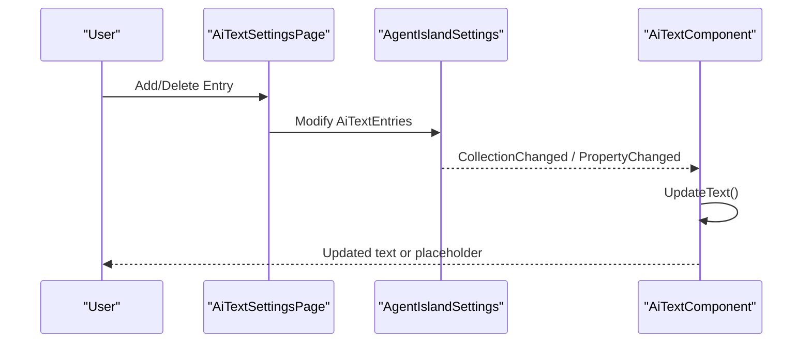

**Diagram sources**
- [AiTextSettingsPage.axaml.cs:22-34](file://Views/SettingsPages/AiTextSettingsPage.axaml.cs#L22-L34)
- [AiTextComponent.axaml.cs:60-83](file://Components/AiTextComponent.axaml.cs#L60-L83)
- [AiTextEntry.cs:5-30](file://Models/AiTextEntry.cs#L5-L30)

**Section sources**
- [AiTextSettingsPage.axaml.cs:14-35](file://Views/SettingsPages/AiTextSettingsPage.axaml.cs#L14-L35)
- [AiTextEntry.cs:5-30](file://Models/AiTextEntry.cs#L5-L30)
- [AiTextComponent.axaml.cs:60-83](file://Components/AiTextComponent.axaml.cs#L60-L83)

#### Telemetry Controls
- Privacy consent dialog and revocation
- Custom DSN support bypassing consent requirement
- Test message capture and policy link
- Reactive UI updates based on settings changes

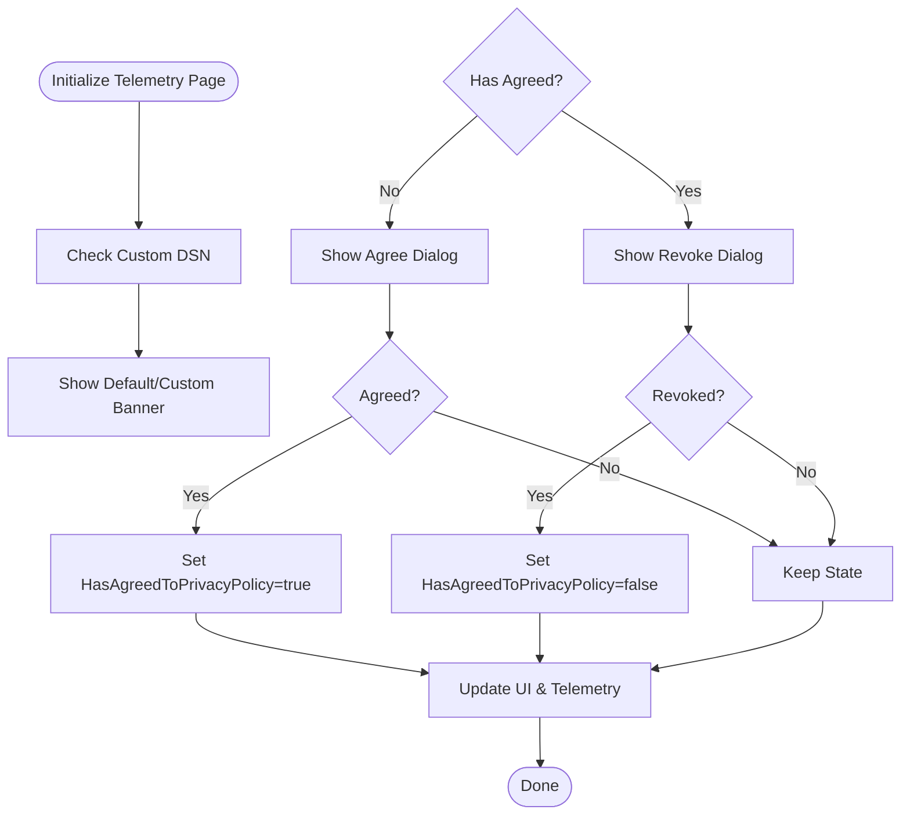

**Diagram sources**
- [TelemetrySettingsPage.axaml.cs:44-124](file://Views/SettingsPages/TelemetrySettingsPage.axaml.cs#L44-L124)
- [AgentIslandSettings.cs:176-200](file://Models/AgentIslandSettings.cs#L176-L200)
- [SentryTelemetryService.cs:30-40](file://Services/SentryTelemetryService.cs#L30-L40)

**Section sources**
- [TelemetrySettingsPage.axaml.cs:20-144](file://Views/SettingsPages/TelemetrySettingsPage.axaml.cs#L20-L144)
- [AgentIslandSettings.cs:176-200](file://Models/AgentIslandSettings.cs#L176-L200)
- [SentryTelemetryService.cs:30-40](file://Services/SentryTelemetryService.cs#L30-L40)

## Dependency Analysis
Registration and runtime relationships:

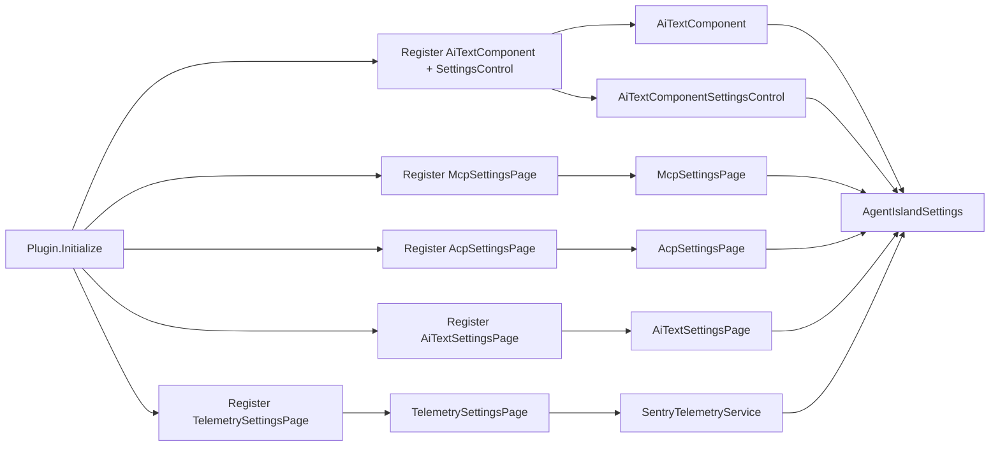

**Diagram sources**
- [Plugin.cs:29-53](file://Plugin.cs#L29-L53)
- [AiTextComponent.axaml.cs:16-84](file://Components/AiTextComponent.axaml.cs#L16-L84)
- [AiTextComponentSettingsControl.axaml.cs:7-52](file://Components/AiTextComponentSettingsControl.axaml.cs#L7-L52)
- [McpSettingsPage.axaml.cs:19-64](file://Views/SettingsPages/McpSettingsPage.axaml.cs#L19-L64)
- [AcpSettingsPage.axaml.cs:18-66](file://Views/SettingsPages/AcpSettingsPage.axaml.cs#L18-L66)
- [AiTextSettingsPage.axaml.cs:14-35](file://Views/SettingsPages/AiTextSettingsPage.axaml.cs#L14-L35)
- [TelemetrySettingsPage.axaml.cs:20-144](file://Views/SettingsPages/TelemetrySettingsPage.axaml.cs#L20-L144)
- [AgentIslandSettings.cs:13-393](file://Models/AgentIslandSettings.cs#L13-L393)
- [SentryTelemetryService.cs:11-181](file://Services/SentryTelemetryService.cs#L11-L181)

**Section sources**
- [Plugin.cs:29-53](file://Plugin.cs#L29-L53)

## Performance Considerations
- Prefer lightweight recomputation in UpdateText and avoid heavy work on UI thread
- Use UiThreadHelper to marshal UI updates when triggered from background contexts
- Minimize unnecessary property change notifications by coalescing updates where possible
- Avoid frequent reinitialization of telemetry; rely on EvaluateAndApply to toggle only when necessary

[No sources needed since this section provides general guidance]

## Troubleshooting Guide
Common issues and resolutions:
- Text not updating: Ensure EntryId matches an existing AiTextEntry and that the global collection is updated via Plugin.Settings.AiTextEntries
- Placeholder always visible: Verify that the selected entry’s Text is non-empty; check UpdateText logic path
- Restart required after changing MCP settings: Changing IsEnabled, Port, or TransportMode triggers a restart request; apply changes and restart as prompted
- Telemetry not active: Confirm HasAgreedToPrivacyPolicy or CustomSentryDsn is set; verify EffectiveSentryDsn and IsTelemetryActive
- Clipboard operations fail: Ensure a TopLevel exists and Clipboard is available before copying

**Section sources**
- [AiTextComponent.axaml.cs:73-83](file://Components/AiTextComponent.axaml.cs#L73-L83)
- [McpSettingsPage.axaml.cs:33-41](file://Views/SettingsPages/McpSettingsPage.axaml.cs#L33-L41)
- [TelemetrySettingsPage.axaml.cs:44-73](file://Views/SettingsPages/TelemetrySettingsPage.axaml.cs#L44-L73)
- [SentryTelemetryService.cs:30-40](file://Services/SentryTelemetryService.cs#L30-L40)

## Conclusion
AgentIsland’s UI follows a clear MVVM-style separation with Avalonia UI, leveraging observable models and reactive updates. AiTextComponent demonstrates robust dynamic content handling, while settings pages provide consistent forms, validation cues, and user feedback. The architecture supports extensibility through additional components and settings pages, with telemetry integrated responsibly behind privacy controls.

[No sources needed since this section summarizes without analyzing specific files]

## Appendices

### Extending the UI with Custom Components
- Create a component class deriving from the host’s component base and register it with the DI container alongside its settings control
- Expose StyledProperties for data binding and subscribe to relevant settings collections and property changes
- Implement lifecycle hooks to subscribe/unsubscribe and compute derived values

**Section sources**
- [Plugin.cs:44-48](file://Plugin.cs#L44-L48)
- [AiTextComponent.axaml.cs:36-56](file://Components/AiTextComponent.axaml.cs#L36-L56)

### Implementing New Settings Pages
- Derive from the base settings page type and annotate with metadata for discovery
- Set DataContext to the global settings object and subscribe to property changes if you need to prompt for restart or update UI dynamically
- Provide user-friendly actions (copy, open links, dialogs) and ensure cross-platform compatibility

**Section sources**
- [McpSettingsPage.axaml.cs:14-31](file://Views/SettingsPages/McpSettingsPage.axaml.cs#L14-L31)
- [TelemetrySettingsPage.axaml.cs:27-42](file://Views/SettingsPages/TelemetrySettingsPage.axaml.cs#L27-L42)

### MVVM Patterns and Data Binding
- Use observable properties and collections to drive UI updates
- Bind UI elements to component properties using RelativeSource bindings
- Keep view logic minimal; delegate complex computations to models or services

**Section sources**
- [AiTextComponent.axaml:10-17](file://Components/AiTextComponent.axaml#L10-L17)
- [AgentIslandSettings.cs:240-273](file://Models/AgentIslandSettings.cs#L240-L273)

### Accessibility Considerations
- Ensure controls have meaningful labels and keyboard navigation
- Use high-contrast friendly colors and sufficient contrast ratios
- Provide screen reader-friendly text for placeholders and status messages

[No sources needed since this section provides general guidance]

### Responsive Design Principles
- Use ScrollViewer and flexible layouts to accommodate different window sizes
- Prefer spacing and alignment classes for consistent look across platforms
- Avoid fixed widths; use relative sizing and wrapping containers

[No sources needed since this section provides general guidance]

### Cross-Platform Compatibility
- Rely on Avalonia UI for cross-platform rendering
- Use platform-agnostic APIs for clipboard and process start where appropriate
- Validate behavior on Windows, Linux, and macOS during development

**Section sources**
- [McpSettingsPage.axaml.cs:43-54](file://Views/SettingsPages/McpSettingsPage.axaml.cs#L43-L54)
- [TelemetrySettingsPage.axaml.cs:131-138](file://Views/SettingsPages/TelemetrySettingsPage.axaml.cs#L131-L138)