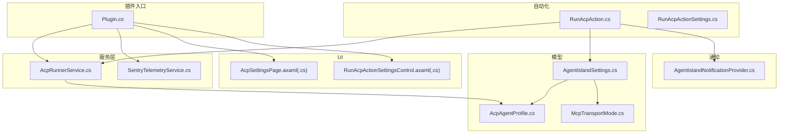
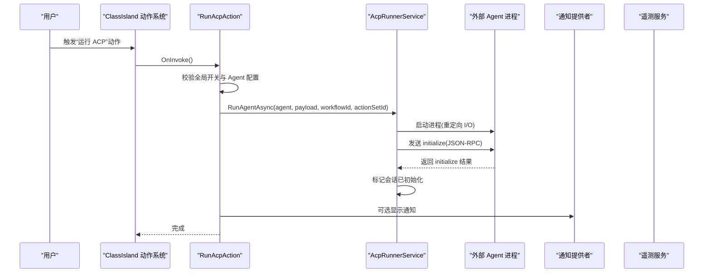
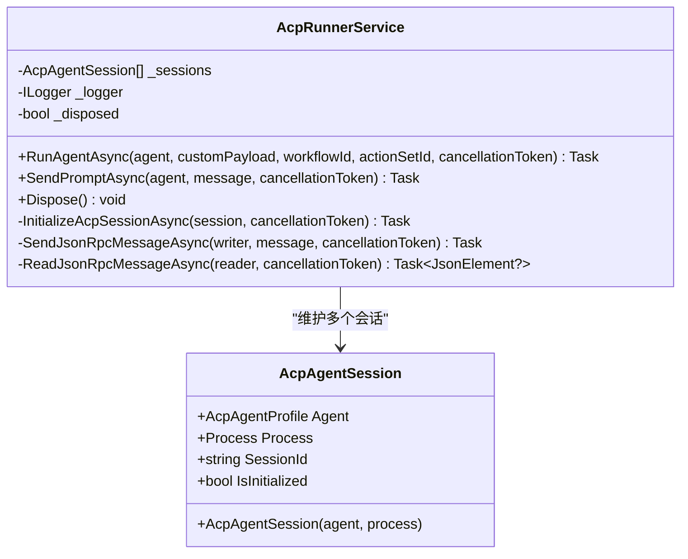
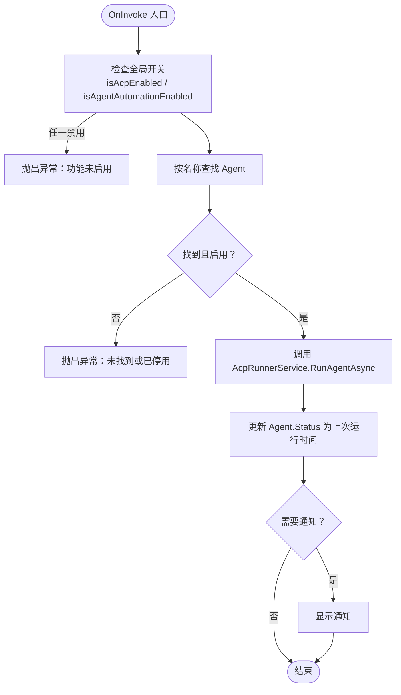
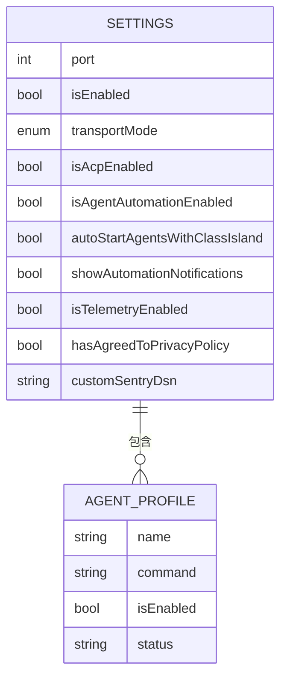
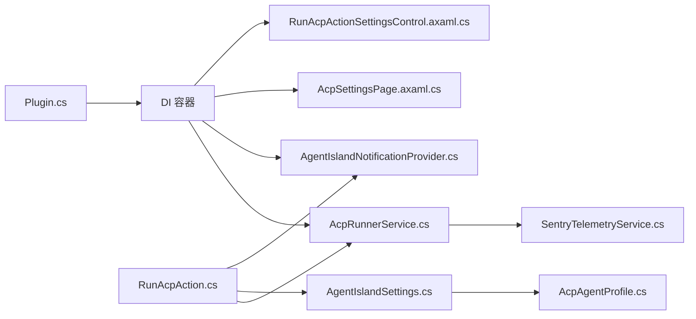

# ACP 自动化系统

<cite>
**本文引用的文件**   
- [Plugin.cs](file://Plugin.cs)
- [AcpRunnerService.cs](file://Services/AcpRunnerService.cs)
- [RunAcpAction.cs](file://Automation/RunAcpAction.cs)
- [AcpAgentProfile.cs](file://Models/AcpAgentProfile.cs)
- [RunAcpActionSettings.cs](file://Models/RunAcpActionSettings.cs)
- [AgentIslandSettings.cs](file://Models/AgentIslandSettings.cs)
- [McpTransportMode.cs](file://Models/McpTransportMode.cs)
- [SentryTelemetryService.cs](file://Services/SentryTelemetryService.cs)
- [AgentIslandNotificationProvider.cs](file://Mcp/Tools/AgentIslandNotificationProvider.cs)
- [RunAcpActionSettingsControl.axaml.cs](file://Views/ActionSettings/RunAcpActionSettingsControl.axaml.cs)
- [RunAcpActionSettingsControl.axaml](file://Views/ActionSettings/RunAcpActionSettingsControl.axaml)
- [AcpSettingsPage.axaml.cs](file://Views/SettingsPages/AcpSettingsPage.axaml.cs)
- [AcpSettingsPage.axaml](file://Views/SettingsPages/AcpSettingsPage.axaml)
</cite>

## 目录
1. [简介](#简介)
2. [项目结构](#项目结构)
3. [核心组件](#核心组件)
4. [架构总览](#架构总览)
5. [详细组件分析](#详细组件分析)
6. [依赖关系分析](#依赖关系分析)
7. [性能与可靠性](#性能与可靠性)
8. [故障排查指南](#故障排查指南)
9. [结论](#结论)
10. [附录：集成示例与最佳实践](#附录集成示例与最佳实践)

## 简介
本文件面向 ACP（Agent Communication Protocol）自动化系统的实现与维护，聚焦以下目标：
- 解释 AcpRunnerService 的运行器服务、进程管理与 JSON-RPC 通信机制
- 文档化 RunAcpAction 的完整实现、动作配置管理与错误处理策略
- 说明 AcpAgentProfile 模型、多 Agent 管理与配置验证
- 描述外部 Agent 进程的启动、会话生命周期管理与资源清理
- 提供与 ClassIsland Action 系统的集成方式、异常处理与性能优化建议

## 项目结构
ACP 自动化相关代码分布在 Services、Automation、Models、Views 等目录中。整体采用分层组织：
- 插件入口与依赖注入注册：Plugin.cs
- 运行器服务与遥测：Services/AcpRunnerService.cs、Services/SentryTelemetryService.cs
- 自动化动作与设置：Automation/RunAcpAction.cs、Models/RunAcpActionSettings.cs
- 数据模型与全局设置：Models/AcpAgentProfile.cs、Models/AgentIslandSettings.cs、Models/McpTransportMode.cs
- UI 设置页与动作设置控件：Views/SettingsPages/AcpSettingsPage.*、Views/ActionSettings/RunAcpActionSettingsControl.*
- 通知能力：Mcp/Tools/AgentIslandNotificationProvider.cs

图表来源
- [Plugin.cs:29-53](file://Plugin.cs#L29-L53)
- [AcpRunnerService.cs:14-206](file://Services/AcpRunnerService.cs#L14-L206)
- [RunAcpAction.cs:16-83](file://Automation/RunAcpAction.cs#L16-L83)
- [AcpAgentProfile.cs:9-43](file://Models/AcpAgentProfile.cs#L9-L43)
- [AgentIslandSettings.cs:13-232](file://Models/AgentIslandSettings.cs#L13-L232)
- [McpTransportMode.cs:6-17](file://Models/McpTransportMode.cs#L6-L17)
- [RunAcpActionSettingsControl.axaml.cs:8-36](file://Views/ActionSettings/RunAcpActionSettingsControl.axaml.cs#L8-L36)
- [AcpSettingsPage.axaml.cs:18-66](file://Views/SettingsPages/AcpSettingsPage.axaml.cs#L18-L66)
- [AgentIslandNotificationProvider.cs:12-51](file://Mcp/Tools/AgentIslandNotificationProvider.cs#L12-L51)

章节来源
- [Plugin.cs:29-53](file://Plugin.cs#L29-L53)
- [AcpRunnerService.cs:14-206](file://Services/AcpRunnerService.cs#L14-L206)
- [RunAcpAction.cs:16-83](file://Automation/RunAcpAction.cs#L16-L83)
- [AcpAgentProfile.cs:9-43](file://Models/AcpAgentProfile.cs#L9-L43)
- [AgentIslandSettings.cs:13-232](file://Models/AgentIslandSettings.cs#L13-L232)
- [McpTransportMode.cs:6-17](file://Models/McpTransportMode.cs#L6-L17)
- [RunAcpActionSettingsControl.axaml.cs:8-36](file://Views/ActionSettings/RunAcpActionSettingsControl.axaml.cs#L8-L36)
- [AcpSettingsPage.axaml.cs:18-66](file://Views/SettingsPages/AcpSettingsPage.axaml.cs#L18-L66)
- [AgentIslandNotificationProvider.cs:12-51](file://Mcp/Tools/AgentIslandNotificationProvider.cs#L12-L51)

## 核心组件
- AcpRunnerService：负责通过 stdio 协议启动外部 Agent 进程、建立 JSON-RPC 会话、发送 prompt 请求以及统一的生命周期管理（初始化、关闭、清理）。
- RunAcpAction：ClassIsland 自动化动作，读取用户配置并调用 AcpRunnerService 启动指定 Agent，同时支持通知反馈。
- AcpAgentProfile：单个 Agent 的配置实体（名称、命令、启用状态、状态文本），支持属性变更通知与 JSON 序列化。
- AgentIslandSettings：全局设置，包含是否启用 ACP、是否启用基于 Agent 的自动化、Agent 列表、遥测开关等，并提供派生属性与集合监听。
- SentryTelemetryService：遥测服务，根据隐私同意与开关动态初始化/关闭 Sentry SDK，提供异常捕获与面包屑记录。
- AgentIslandNotificationProvider：封装 ClassIsland 通知通道，用于在自动化触发后显示提示。

章节来源
- [AcpRunnerService.cs:14-206](file://Services/AcpRunnerService.cs#L14-L206)
- [RunAcpAction.cs:16-83](file://Automation/RunAcpAction.cs#L16-L83)
- [AcpAgentProfile.cs:9-43](file://Models/AcpAgentProfile.cs#L9-L43)
- [AgentIslandSettings.cs:13-232](file://Models/AgentIslandSettings.cs#L13-L232)
- [SentryTelemetryService.cs:11-181](file://Services/SentryTelemetryService.cs#L11-L181)
- [AgentIslandNotificationProvider.cs:12-51](file://Mcp/Tools/AgentIslandNotificationProvider.cs#L12-L51)

## 架构总览
ACP 自动化系统在 ClassIsland 插件框架内运行，通过依赖注入注册服务与 UI 页面。运行时由 RunAcpAction 触发，委托 AcpRunnerService 启动外部 Agent 进程并通过标准输入输出进行 JSON-RPC 通信。遥测与通知作为横切关注点贯穿流程。

图表来源
- [RunAcpAction.cs:29-82](file://Automation/RunAcpAction.cs#L29-L82)
- [AcpRunnerService.cs:25-100](file://Services/AcpRunnerService.cs#L25-L100)
- [AgentIslandNotificationProvider.cs:27-50](file://Mcp/Tools/AgentIslandNotificationProvider.cs#L27-L50)
- [SentryTelemetryService.cs:30-69](file://Services/SentryTelemetryService.cs#L30-L69)

## 详细组件分析

### AcpRunnerService：进程与 JSON-RPC 会话管理
- 进程启动
  - 解析 agent.Command 为可执行文件与参数，使用 ProcessStartInfo 重定向标准输入/输出/错误，创建无窗口子进程。
  - 将新进程包装为内部会话对象 AcpAgentSession，加入会话列表。
- JSON-RPC 初始化
  - 发送 initialize 请求（jsonrpc=2.0，method="initialize"），等待响应并检查 result 字段以确认初始化成功。
- Prompt 发送
  - 查找对应 Agent 的会话，若未找到或未初始化则抛出异常；否则构造 session/prompt 请求并通过标准输入写入。
- 资源清理
  - Dispose 时遍历所有会话，尝试优雅关闭输入流并等待退出，超时则强制终止，最后释放进程句柄。

图表来源
- [AcpRunnerService.cs:14-206](file://Services/AcpRunnerService.cs#L14-L206)

章节来源
- [AcpRunnerService.cs:25-100](file://Services/AcpRunnerService.cs#L25-L100)
- [AcpRunnerService.cs:102-154](file://Services/AcpRunnerService.cs#L102-L154)
- [AcpRunnerService.cs:156-206](file://Services/AcpRunnerService.cs#L156-L206)

### RunAcpAction：动作实现与配置管理
- 依赖注入
  - 注入全局设置 AgentIslandSettings、AcpRunnerService 与日志。
- 执行流程
  - 校验全局开关：isAcpEnabled 与 isAgentAutomationEnabled。
  - 从 Settings.AcpAgents 按名称匹配目标 Agent，校验存在性与启用状态。
  - 调用 AcpRunnerService.RunAgentAsync 启动 Agent，更新 Agent.Status 为上次运行时间。
  - 若开启通知且动作设置 ShowNotification 为真，则通过通知提供者显示提示。
- 错误处理
  - 对缺失配置、功能禁用、Agent 不存在或停用等情况抛出明确异常，便于上层捕获与展示。

图表来源
- [RunAcpAction.cs:29-82](file://Automation/RunAcpAction.cs#L29-L82)

章节来源
- [RunAcpAction.cs:16-83](file://Automation/RunAcpAction.cs#L16-L83)

### AcpAgentProfile 与多 Agent 管理
- 属性
  - Name、Command、IsEnabled、Status，均支持属性变更通知与 JSON 序列化。
- 集合管理
  - AgentIslandSettings 持有 ObservableCollection<AcpAgentProfile>，并在集合变化时自动更新派生属性（总数、启用数、摘要文本等）。
- UI 绑定
  - AcpSettingsPage 提供新增/移除/批量启停操作，直接修改集合与属性。
  - RunAcpActionSettingsControl 暴露 AgentNames 供下拉选择，并根据空状态给出引导文案。

图表来源
- [AcpAgentProfile.cs:9-43](file://Models/AcpAgentProfile.cs#L9-L43)
- [AgentIslandSettings.cs:13-232](file://Models/AgentIslandSettings.cs#L13-L232)
- [AcpSettingsPage.axaml.cs:31-64](file://Views/SettingsPages/AcpSettingsPage.axaml.cs#L31-L64)
- [RunAcpActionSettingsControl.axaml.cs:15-35](file://Views/ActionSettings/RunAcpActionSettingsControl.axaml.cs#L15-L35)

章节来源
- [AcpAgentProfile.cs:9-43](file://Models/AcpAgentProfile.cs#L9-L43)
- [AgentIslandSettings.cs:127-232](file://Models/AgentIslandSettings.cs#L127-L232)
- [AcpSettingsPage.axaml.cs:31-64](file://Views/SettingsPages/AcpSettingsPage.axaml.cs#L31-L64)
- [RunAcpActionSettingsControl.axaml.cs:15-35](file://Views/ActionSettings/RunAcpActionSettingsControl.axaml.cs#L15-L35)

### 插件入口与依赖注入
- Plugin.Initialize
  - 加载 Settings.json，订阅属性变更以持久化保存。
  - 注册遥测服务、通知提供者、组件、设置页与动作。
  - 注册 AcpRunnerService 为单例，供动作与服务消费。
- 应用生命周期
  - AppStarted/AppStopping 钩子用于 MCP 服务器启停与遥测记录。

章节来源
- [Plugin.cs:29-53](file://Plugin.cs#L29-L53)
- [Plugin.cs:55-97](file://Plugin.cs#L55-L97)

### 遥测与通知
- SentryTelemetryService
  - 根据 IsTelemetryActive 动态初始化/关闭 SDK，支持自定义 DSN 与隐私协议控制。
  - 提供 AddBreadcrumb、CaptureException、WithInstrumentation 等方法。
- AgentIslandNotificationProvider
  - 通过 ClassIsland 通知通道在 UI 线程显示遮罩与覆盖文本。

章节来源
- [SentryTelemetryService.cs:30-122](file://Services/SentryTelemetryService.cs#L30-L122)
- [AgentIslandNotificationProvider.cs:27-50](file://Mcp/Tools/AgentIslandNotificationProvider.cs#L27-L50)

## 依赖关系分析
- 插件入口向 DI 容器注册 AcpRunnerService、通知提供者、设置页与动作。
- RunAcpAction 依赖全局设置与运行器服务，间接依赖通知提供者。
- AcpRunnerService 依赖遥测服务记录关键事件。
- 模型之间通过 ObservableObject 与 ObservableCollection 形成松耦合的数据驱动 UI。

图表来源
- [Plugin.cs:29-53](file://Plugin.cs#L29-L53)
- [RunAcpAction.cs:16-83](file://Automation/RunAcpAction.cs#L16-L83)
- [AcpRunnerService.cs:14-206](file://Services/AcpRunnerService.cs#L14-L206)
- [AgentIslandSettings.cs:13-232](file://Models/AgentIslandSettings.cs#L13-L232)
- [AcpAgentProfile.cs:9-43](file://Models/AcpAgentProfile.cs#L9-L43)
- [SentryTelemetryService.cs:11-181](file://Services/SentryTelemetryService.cs#L11-L181)
- [AgentIslandNotificationProvider.cs:12-51](file://Mcp/Tools/AgentIslandNotificationProvider.cs#L12-L51)

章节来源
- [Plugin.cs:29-53](file://Plugin.cs#L29-L53)
- [RunAcpAction.cs:16-83](file://Automation/RunAcpAction.cs#L16-L83)
- [AcpRunnerService.cs:14-206](file://Services/AcpRunnerService.cs#L14-L206)
- [AgentIslandSettings.cs:13-232](file://Models/AgentIslandSettings.cs#L13-L232)
- [AcpAgentProfile.cs:9-43](file://Models/AcpAgentProfile.cs#L9-L43)
- [SentryTelemetryService.cs:11-181](file://Services/SentryTelemetryService.cs#L11-L181)
- [AgentIslandNotificationProvider.cs:12-51](file://Mcp/Tools/AgentIslandNotificationProvider.cs#L12-L51)

## 性能与可靠性
- 进程 I/O 与 JSON 序列化
  - 当前实现逐行读写 JSON-RPC 消息，适合低吞吐场景。在高并发或大消息场景下，考虑缓冲与批处理以减少上下文切换与 GC 压力。
- 会话管理
  - 当前会话列表为简单集合，查找为线性扫描。当 Agent 数量较多时，可引入字典索引以提升查找效率。
- 超时与健壮性
  - 初始化与 Prompt 发送缺少超时保护，建议在异步方法中加入 CancellationToken 与超时逻辑，避免阻塞主线程。
- 资源清理
  - Dispose 已实现优雅关闭与强制终止，但可考虑增加重试与更细粒度的错误分类，以便诊断。
- 遥测开销
  - 遥测默认采样率较高，生产环境可按需调整采样率与调试开关，减少 IO 与 CPU 开销。

[本节为通用指导，不直接分析具体文件]

## 故障排查指南
- 常见异常与定位
  - “ACP 功能当前未启用”：检查全局设置中的 isAcpEnabled 与 isAgentAutomationEnabled。
  - “未找到名为 X 的 ACP Agent”：确认 Settings.AcpAgents 中存在同名项且 IsEnabled 为真。
  - “ACP Agent 未初始化”：检查外部 Agent 是否正确响应 initialize 请求，或网络/路径配置是否正确。
- 日志与遥测
  - 查看 AcpRunnerService 与 RunAcpAction 的日志输出，结合 SentryTelemetryService 的面包屑与异常上报定位问题。
- 进程与 I/O
  - 确认 Command 指向的可执行文件路径有效，参数正确；检查标准输入/输出是否被其他程序占用。
- UI 状态
  - AcpSettingsPage 与 RunAcpActionSettingsControl 的绑定会反映最新状态，若界面不可用，检查是否处于“后续版本开放”的占位状态。

章节来源
- [RunAcpAction.cs:35-60](file://Automation/RunAcpAction.cs#L35-L60)
- [AcpRunnerService.cs:35-116](file://Services/AcpRunnerService.cs#L35-L116)
- [SentryTelemetryService.cs:95-122](file://Services/SentryTelemetryService.cs#L95-L122)

## 结论
ACP 自动化系统通过简洁的进程管理与 JSON-RPC 通信实现了与外部 Agent 的集成。RunAcpAction 提供了清晰的配置校验与错误处理，AcpRunnerService 负责会话生命周期与资源清理，配合遥测与通知提升可观测性与用户体验。未来可在超时控制、会话索引、I/O 缓冲等方面进一步优化性能与稳定性。

[本节为总结，不直接分析具体文件]

## 附录：集成示例与最佳实践
- 集成步骤
  - 在 AcpSettingsPage 中添加 AcpAgentProfile，填写 Name 与 Command。
  - 在动作设置中选择目标 Agent，按需启用通知。
  - 确保全局开关 isAcpEnabled 与 isAgentAutomationEnabled 为真。
- 最佳实践
  - 为每个 Agent 配置唯一名称与明确的启动命令，避免空格与特殊字符导致的解析问题。
  - 在外部 Agent 端实现标准的 initialize 与 session/prompt 响应，确保会话稳定。
  - 合理设置遥测采样率与调试开关，平衡可观测性与性能。
  - 对长时间运行的任务添加超时与取消令牌，防止阻塞。

[本节为概念性内容，不直接分析具体文件]