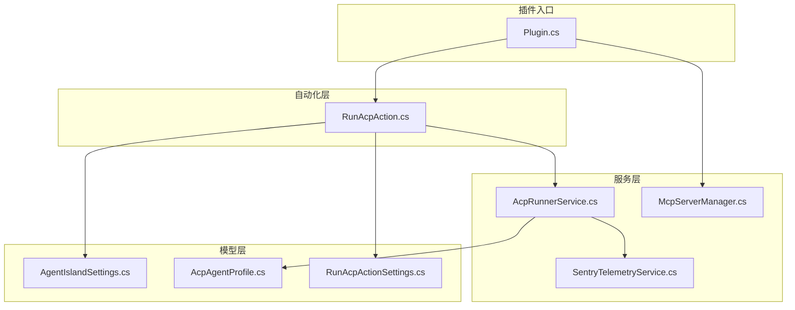
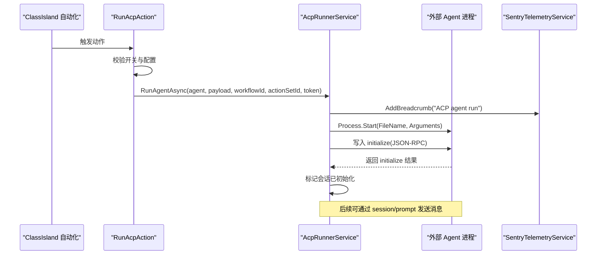
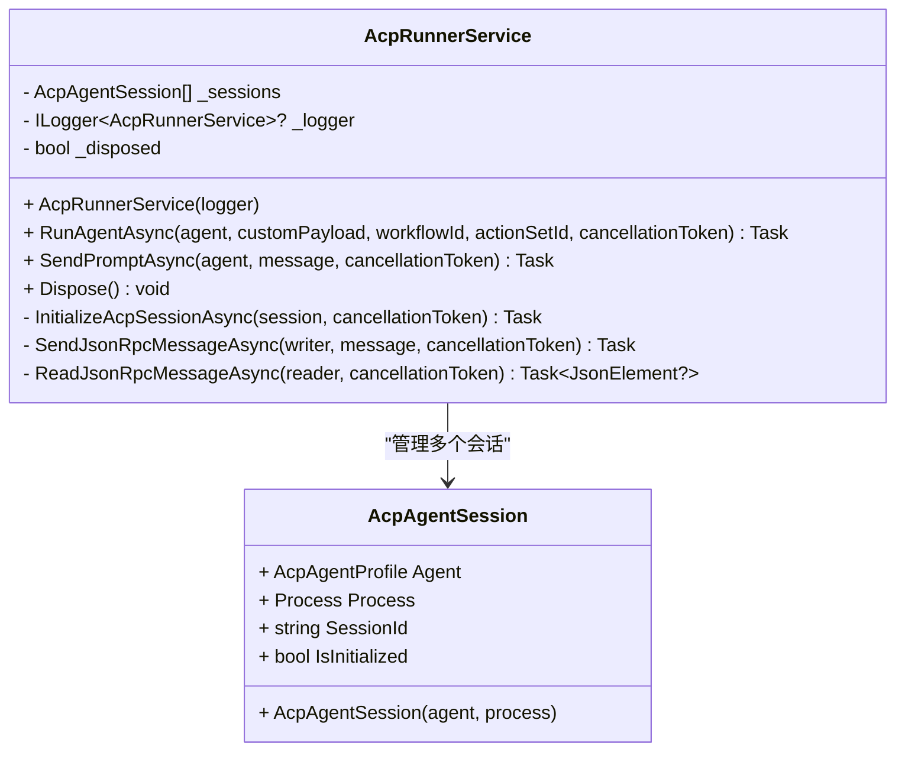
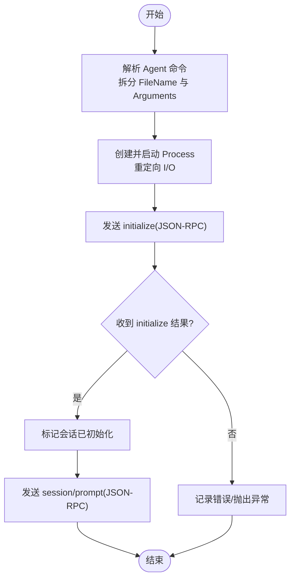
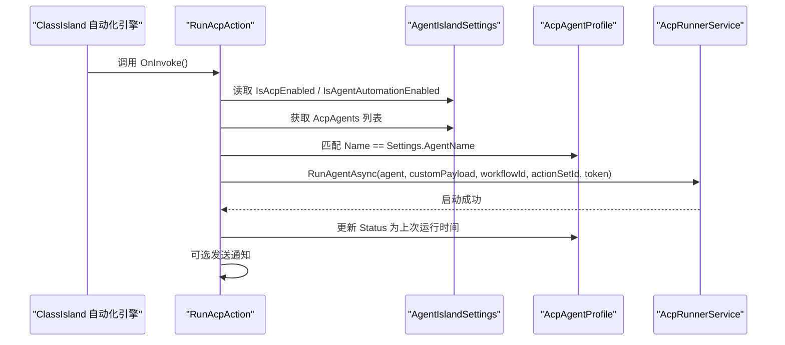
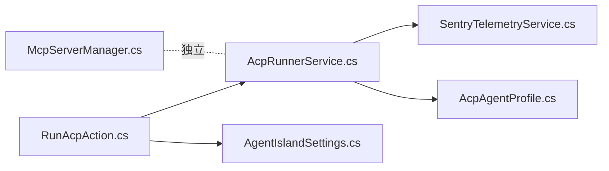

# ACP 运行器服务

<cite>
**本文引用的文件**
- [Services/AcpRunnerService.cs](file://Services/AcpRunnerService.cs)
- [Models/AcpAgentProfile.cs](file://Models/AcpAgentProfile.cs)
- [Automation/RunAcpAction.cs](file://Automation/RunAcpAction.cs)
- [Models/RunAcpActionSettings.cs](file://Models/RunAcpActionSettings.cs)
- [Models/AgentIslandSettings.cs](file://Models/AgentIslandSettings.cs)
- [Services/SentryTelemetryService.cs](file://Services/SentryTelemetryService.cs)
- [Mcp/McpServerManager.cs](file://Mcp/McpServerManager.cs)
</cite>

## 目录
1. [简介](#简介)
2. [项目结构](#项目结构)
3. [核心组件](#核心组件)
4. [架构总览](#架构总览)
5. [详细组件分析](#详细组件分析)
6. [依赖关系分析](#依赖关系分析)
7. [性能与并发特性](#性能与并发特性)
8. [故障排查指南](#故障排查指南)
9. [结论](#结论)
10. [附录：使用示例与集成模式](#附录使用示例与集成模式)

## 简介
本文件面向 ACP 运行器服务的实现与集成，聚焦以下目标：
- 外部 Agent 进程的启动、管理与生命周期控制
- JSON-RPC over stdio 的通信机制（连接建立、消息传递、错误处理）
- 进程间通信异常处理策略与资源清理机制
- 会话管理、超时处理与并发控制现状与建议
- 与 ClassIsland Action 系统的集成方式与最佳实践

## 项目结构
ACP 运行器服务位于 Services 层，通过自动化动作 Automation 层暴露给 ClassIsland 工作流。模型定义在 Models 层，遥测能力由 Services 层的 SentryTelemetryService 提供。MCP 服务器管理器用于 MCP 协议服务，与 ACP 运行器并行存在但职责不同。

图表来源
- [Automation/RunAcpAction.cs:1-84](file://Automation/RunAcpAction.cs#L1-L84)
- [Services/AcpRunnerService.cs:1-207](file://Services/AcpRunnerService.cs#L1-L207)
- [Services/SentryTelemetryService.cs:1-182](file://Services/SentryTelemetryService.cs#L1-L182)
- [Mcp/McpServerManager.cs:1-125](file://Mcp/McpServerManager.cs#L1-L125)
- [Models/AgentIslandSettings.cs:1-394](file://Models/AgentIslandSettings.cs#L1-L394)
- [Models/AcpAgentProfile.cs:1-44](file://Models/AcpAgentProfile.cs#L1-L44)
- [Models/RunAcpActionSettings.cs:1-36](file://Models/RunAcpActionSettings.cs#L1-L36)

章节来源
- [Automation/RunAcpAction.cs:1-84](file://Automation/RunAcpAction.cs#L1-L84)
- [Services/AcpRunnerService.cs:1-207](file://Services/AcpRunnerService.cs#L1-L207)
- [Models/AgentIslandSettings.cs:1-394](file://Models/AgentIslandSettings.cs#L1-L394)
- [Services/SentryTelemetryService.cs:1-182](file://Services/SentryTelemetryService.cs#L1-L182)
- [Mcp/McpServerManager.cs:1-125](file://Mcp/McpServerManager.cs#L1-L125)

## 核心组件
- AcpRunnerService：负责通过 ACP stdio 协议启动并管理外部 Agent 进程，维护会话状态，发送初始化与提示请求，并在 Dispose 时进行资源清理。
- RunAcpAction：ClassIsland 自动化动作，校验开关与配置后调用 AcpRunnerService 启动指定 Agent。
- AcpAgentProfile：描述单个 ACP Agent 的配置项（名称、命令、启用状态、状态文本）。
- AgentIslandSettings：集中式设置，包含是否启用 ACP、是否启用基于 Agent 的自动化、Agent 列表等。
- SentryTelemetryService：遥测服务，提供面包屑、异常捕获与事务包装。
- McpServerManager：MCP 服务器管理器，与 ACP 运行器并存，但不直接参与 ACP 进程管理。

章节来源
- [Services/AcpRunnerService.cs:1-207](file://Services/AcpRunnerService.cs#L1-L207)
- [Automation/RunAcpAction.cs:1-84](file://Automation/RunAcpAction.cs#L1-L84)
- [Models/AcpAgentProfile.cs:1-44](file://Models/AcpAgentProfile.cs#L1-L44)
- [Models/AgentIslandSettings.cs:1-394](file://Models/AgentIslandSettings.cs#L1-L394)
- [Services/SentryTelemetryService.cs:1-182](file://Services/SentryTelemetryService.cs#L1-L182)
- [Mcp/McpServerManager.cs:1-125](file://Mcp/McpServerManager.cs#L1-L125)

## 架构总览
ACP 运行器采用“进程外 Agent + stdio JSON-RPC”的架构。主进程通过 System.Diagnostics.Process 启动外部可执行文件，并以标准输入输出作为传输通道，遵循 JSON-RPC 2.0 格式进行握手与消息交互。

图表来源
- [Automation/RunAcpAction.cs:29-72](file://Automation/RunAcpAction.cs#L29-L72)
- [Services/AcpRunnerService.cs:25-100](file://Services/AcpRunnerService.cs#L25-L100)
- [Services/SentryTelemetryService.cs:114-122](file://Services/SentryTelemetryService.cs#L114-L122)

## 详细组件分析

### AcpRunnerService 类图与职责
- 会话集合：内部维护一个会话列表，每个会话绑定一个 Agent 配置与一个 Process 实例，包含 SessionId 与 IsInitialized 标志。
- 启动流程：解析命令字符串为文件名与参数，创建并启动进程，重定向 I/O，随后发送 JSON-RPC initialize 请求并等待响应以完成握手。
- 消息发送：提供 SendPromptAsync 方法，构造 session/prompt 请求并通过标准输入写入。
- 资源清理：Dispose 中关闭所有会话的标准输入，等待退出，必要时 Kill，并释放进程对象。

图表来源
- [Services/AcpRunnerService.cs:14-206](file://Services/AcpRunnerService.cs#L14-L206)

章节来源
- [Services/AcpRunnerService.cs:14-206](file://Services/AcpRunnerService.cs#L14-L206)

### JSON-RPC 通信机制
- 协议版本：JSON-RPC 2.0
- 传输通道：stdio（StandardInput/StandardOutput）
- 握手阶段：客户端发送 initialize 请求，服务端返回 result；客户端据此标记会话已初始化。
- 业务阶段：客户端发送 session/prompt 请求，携带 sessionId 与 message。
- 序列化：使用 System.Text.Json 将匿名对象序列化为 JSON 行，按行读取并反序列化为 JsonElement。

图表来源
- [Services/AcpRunnerService.cs:25-100](file://Services/AcpRunnerService.cs#L25-L100)
- [Services/AcpRunnerService.cs:133-154](file://Services/AcpRunnerService.cs#L133-L154)

章节来源
- [Services/AcpRunnerService.cs:25-100](file://Services/AcpRunnerService.cs#L25-L100)
- [Services/AcpRunnerService.cs:133-154](file://Services/AcpRunnerService.cs#L133-L154)

### 进程间通信异常处理与资源清理
- 启动前校验：若未配置命令或命令无效，立即抛出异常，避免无意义启动。
- 初始化失败：当 initialize 响应不包含 result 字段时，会话保持未初始化状态，后续发送 prompt 会抛出异常。
- 停止流程：Dispose 中尝试优雅关闭（关闭 StandardInput 并等待退出），超过时限则强制 Kill，确保进程被回收。
- 日志与遥测：关键路径记录信息日志，异常路径记录错误日志，遥测服务添加面包屑便于追踪。

章节来源
- [Services/AcpRunnerService.cs:35-48](file://Services/AcpRunnerService.cs#L35-L48)
- [Services/AcpRunnerService.cs:96-100](file://Services/AcpRunnerService.cs#L96-L100)
- [Services/AcpRunnerService.cs:156-191](file://Services/AcpRunnerService.cs#L156-L191)
- [Services/SentryTelemetryService.cs:114-122](file://Services/SentryTelemetryService.cs#L114-L122)

### 会话管理、超时处理与并发控制
- 会话管理：每个 Agent 对应一个会话对象，包含唯一 SessionId 与初始化标志。当前实现通过进程 ID 关联会话，未显式持久化会话状态。
- 超时处理：当前未在 JSON-RPC 读写处实现超时控制；仅 Dispose 中对进程退出设置了有限等待时间。
- 并发控制：SendPromptAsync 未对同一会话的并发访问加锁，存在潜在竞态风险；建议引入队列或互斥机制保证顺序性。
- 健壮性建议：
  - 为 initialize 与 prompt 操作增加超时与重试逻辑
  - 为会话增加心跳检测与自动恢复
  - 为会话消息收发增加有序队列与背压控制

章节来源
- [Services/AcpRunnerService.cs:102-131](file://Services/AcpRunnerService.cs#L102-L131)
- [Services/AcpRunnerService.cs:156-191](file://Services/AcpRunnerService.cs#L156-L191)

### 与 ClassIsland Action 系统集成
- 动作注册：RunAcpAction 通过 ActionInfo 属性声明动作标识、名称、图标与分组。
- 执行流程：OnInvoke 中检查全局开关与 Agent 可用性，查找匹配的 Agent 配置，调用 AcpRunnerService.RunAgentAsync 启动。
- 通知反馈：可选显示自动化通知，提升用户可见性。
- 设置项：RunAcpActionSettings 支持选择 Agent 名称、是否显示通知以及自定义负载。

图表来源
- [Automation/RunAcpAction.cs:29-82](file://Automation/RunAcpAction.cs#L29-L82)
- [Models/AgentIslandSettings.cs:127-143](file://Models/AgentIslandSettings.cs#L127-L143)
- [Models/AcpAgentProfile.cs:16-43](file://Models/AcpAgentProfile.cs#L16-L43)
- [Models/RunAcpActionSettings.cs:15-34](file://Models/RunAcpActionSettings.cs#L15-L34)

章节来源
- [Automation/RunAcpAction.cs:29-82](file://Automation/RunAcpAction.cs#L29-L82)
- [Models/AgentIslandSettings.cs:127-143](file://Models/AgentIslandSettings.cs#L127-L143)
- [Models/AcpAgentProfile.cs:16-43](file://Models/AcpAgentProfile.cs#L16-L43)
- [Models/RunAcpActionSettings.cs:15-34](file://Models/RunAcpActionSettings.cs#L15-L34)

## 依赖关系分析
- AcpRunnerService 依赖：
  - System.Diagnostics.Process：进程生命周期管理
  - System.Text.Json：JSON 序列化/反序列化
  - Microsoft.Extensions.Logging：结构化日志
  - SentryTelemetryService：遥测面包屑
- RunAcpAction 依赖：
  - AgentIslandSettings：全局开关与 Agent 列表
  - AcpRunnerService：启动 Agent
  - SentryTelemetryService：遥测（间接通过 IAppHost 获取）
- McpServerManager 独立于 ACP 运行器，负责 MCP 服务器生命周期，不直接参与 ACP 进程管理。

图表来源
- [Automation/RunAcpAction.cs:1-84](file://Automation/RunAcpAction.cs#L1-L84)
- [Services/AcpRunnerService.cs:1-207](file://Services/AcpRunnerService.cs#L1-L207)
- [Models/AgentIslandSettings.cs:1-394](file://Models/AgentIslandSettings.cs#L1-L394)
- [Services/SentryTelemetryService.cs:1-182](file://Services/SentryTelemetryService.cs#L1-L182)
- [Mcp/McpServerManager.cs:1-125](file://Mcp/McpServerManager.cs#L1-L125)

章节来源
- [Automation/RunAcpAction.cs:1-84](file://Automation/RunAcpAction.cs#L1-L84)
- [Services/AcpRunnerService.cs:1-207](file://Services/AcpRunnerService.cs#L1-L207)
- [Models/AgentIslandSettings.cs:1-394](file://Models/AgentIslandSettings.cs#L1-L394)
- [Services/SentryTelemetryService.cs:1-182](file://Services/SentryTelemetryService.cs#L1-L182)
- [Mcp/McpServerManager.cs:1-125](file://Mcp/McpServerManager.cs#L1-L125)

## 性能与并发特性
- 进程启动开销：每次启动都会创建新进程，适合短时任务；频繁启动可能带来系统开销。
- I/O 吞吐：基于单行 JSON 的 stdio 传输，简单可靠但需关注序列化/反序列化成本。
- 并发风险：当前未对同一会话的消息发送进行同步保护，建议引入队列或互斥以避免乱序。
- 超时缺失：缺少网络/进程读写的超时控制，可能导致阻塞；建议增加 CancellationToken 驱动的超时。

[本节为通用指导，无需具体文件引用]

## 故障排查指南
- 常见错误与定位：
  - 未配置启动命令：检查 AcpAgentProfile.Command 是否为空
  - 命令无效：确认命令字符串可被正确拆分为文件名与参数
  - 未初始化：initialize 响应不包含 result 字段，检查 Agent 端实现是否符合 JSON-RPC 规范
  - 进程无法退出：Dispose 中等待超时后会 Kill，确认 Agent 是否正确响应关闭信号
- 日志与遥测：
  - 使用 ILogger 记录关键步骤与异常
  - 使用 SentryTelemetryService.AddBreadcrumb 记录运行轨迹，便于问题回溯

章节来源
- [Services/AcpRunnerService.cs:35-48](file://Services/AcpRunnerService.cs#L35-L48)
- [Services/AcpRunnerService.cs:96-100](file://Services/AcpRunnerService.cs#L96-L100)
- [Services/AcpRunnerService.cs:156-191](file://Services/AcpRunnerService.cs#L156-L191)
- [Services/SentryTelemetryService.cs:114-122](file://Services/SentryTelemetryService.cs#L114-L122)

## 结论
ACP 运行器服务实现了基于 stdio 的 JSON-RPC 通信与外部 Agent 进程的生命周期管理，具备基本的启动、握手与消息发送能力。当前实现尚未覆盖超时、并发保护与健壮性增强，建议在后续迭代中完善这些方面以提升稳定性与可观测性。与 ClassIsland Action 的集成简洁清晰，便于扩展更多自动化场景。

[本节为总结，无需具体文件引用]

## 附录：使用示例与集成模式
- 基本用法：
  - 在 ClassIsland 中创建一个自动化动作，类型为“运行 ACP”，配置要运行的 Agent 名称与是否显示通知
  - 在插件设置中启用 ACP 功能与基于 Agent 的自动化，并确保至少有一个启用的 AcpAgentProfile
- 集成模式：
  - 单次触发：通过自动化动作触发一次 Agent 运行
  - 批量调度：结合定时任务或事件总线，周期性向不同 Agent 发送提示
  - 工具联动：与 MCP 工具协同，先通过 MCP 获取数据，再经由 ACP 发送给 Agent 进行处理
- 最佳实践：
  - 为每个 Agent 配置独立的命令与参数，避免共享状态
  - 为关键路径添加日志与遥测，便于问题定位
  - 在应用关闭时确保调用 AcpRunnerService.Dispose，防止进程泄漏

[本节为概念性内容，无需具体文件引用]