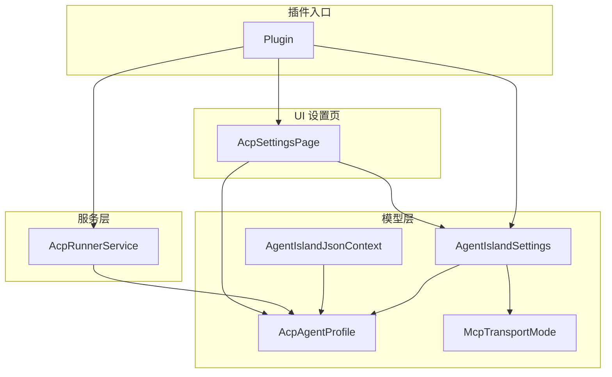
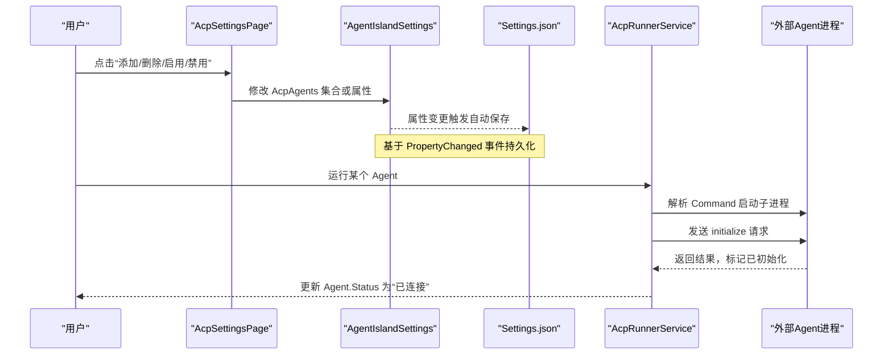
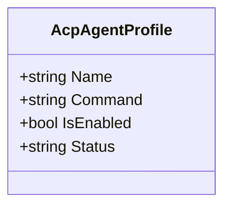
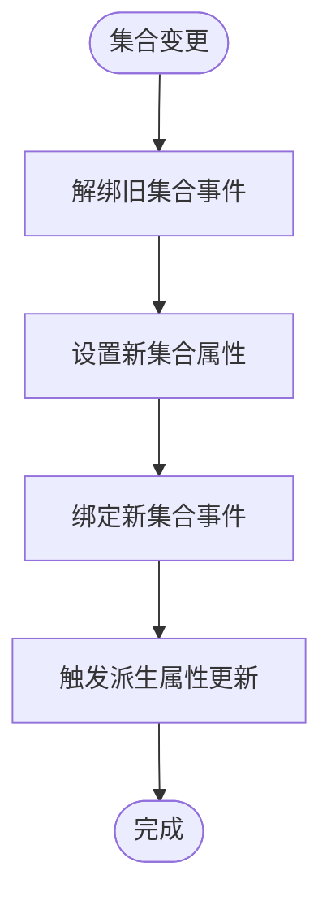
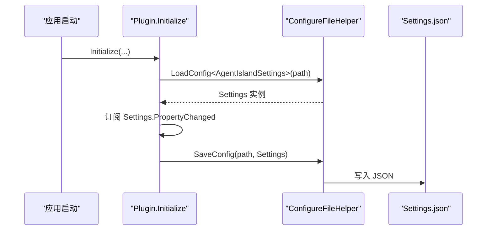
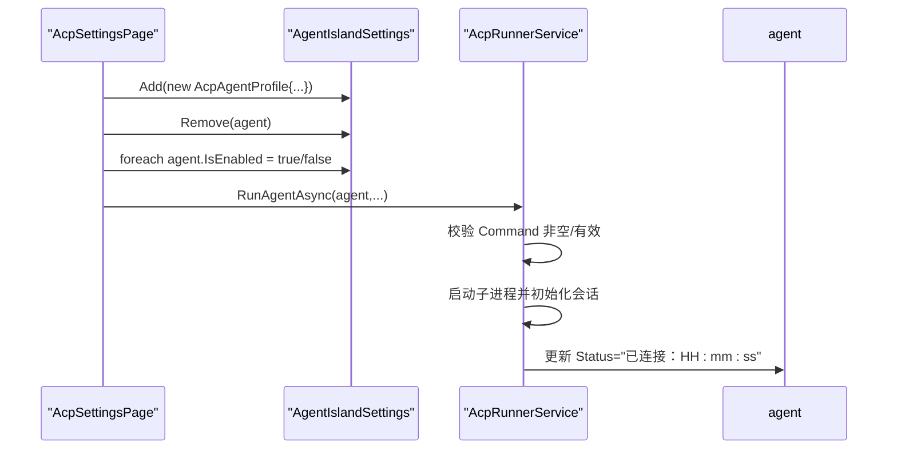
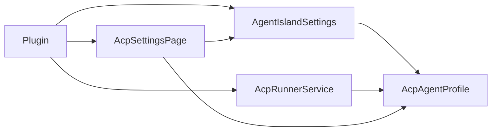

# Agent 配置管理

<cite>
**本文引用的文件**   
- [AcpAgentProfile.cs](file://Models/AcpAgentProfile.cs)
- [AgentIslandSettings.cs](file://Models/AgentIslandSettings.cs)
- [AgentIslandJsonContext.cs](file://Models/AgentIslandJsonContext.cs)
- [McpTransportMode.cs](file://Models/McpTransportMode.cs)
- [AcpRunnerService.cs](file://Services/AcpRunnerService.cs)
- [Plugin.cs](file://Plugin.cs)
- [AcpSettingsPage.axaml.cs](file://Views/SettingsPages/AcpSettingsPage.axaml.cs)
</cite>

## 目录
1. [简介](#简介)
2. [项目结构](#项目结构)
3. [核心组件](#核心组件)
4. [架构总览](#架构总览)
5. [详细组件分析](#详细组件分析)
6. [依赖关系分析](#依赖关系分析)
7. [性能与可扩展性](#性能与可扩展性)
8. [故障排查指南](#故障排查指南)
9. [结论](#结论)
10. [附录：配置模板与迁移策略](#附录配置模板与迁移策略)

## 简介
本文件围绕 Agent 配置管理展开，重点说明 AcpAgentProfile 模型的设计、多 Agent 配置管理机制（添加/删除/启用/禁用）、配置文件格式与存储位置、版本兼容性与迁移策略、配置验证规则与错误提示机制，以及与其它配置系统的集成方式与最佳实践。目标是帮助开发者与用户正确理解并安全地维护 Agent 配置。

## 项目结构
与 Agent 配置管理直接相关的代码主要分布在以下模块：
- Models：数据模型与序列化上下文
- Services：运行时服务（如 ACP 运行器）
- Views/SettingsPages：设置页面交互逻辑
- Plugin：插件入口，负责加载/保存配置、注册服务与 UI 页面

图表来源
- [Plugin.cs:27-53](file://Plugin.cs#L27-L53)
- [AgentIslandSettings.cs:13-143](file://Models/AgentIslandSettings.cs#L13-L143)
- [AcpAgentProfile.cs:9-43](file://Models/AcpAgentProfile.cs#L9-L43)
- [AgentIslandJsonContext.cs:1-19](file://Models/AgentIslandJsonContext.cs#L1-L19)
- [McpTransportMode.cs:6-17](file://Models/McpTransportMode.cs#L6-L17)
- [AcpRunnerService.cs:14-77](file://Services/AcpRunnerService.cs#L14-L77)
- [AcpSettingsPage.axaml.cs:18-65](file://Views/SettingsPages/AcpSettingsPage.axaml.cs#L18-L65)

章节来源
- [Plugin.cs:27-53](file://Plugin.cs#L27-L53)
- [AgentIslandSettings.cs:13-143](file://Models/AgentIslandSettings.cs#L13-L143)
- [AcpAgentProfile.cs:9-43](file://Models/AcpAgentProfile.cs#L9-L43)
- [AgentIslandJsonContext.cs:1-19](file://Models/AgentIslandJsonContext.cs#L1-L19)
- [McpTransportMode.cs:6-17](file://Models/McpTransportMode.cs#L6-L17)
- [AcpRunnerService.cs:14-77](file://Services/AcpRunnerService.cs#L14-L77)
- [AcpSettingsPage.axaml.cs:18-65](file://Views/SettingsPages/AcpSettingsPage.axaml.cs#L18-L65)

## 核心组件
- AcpAgentProfile：单个 ACP Agent 的配置项，包含名称、启动命令、启用状态与连接状态等属性，支持 JSON 序列化与属性变更通知。
- AgentIslandSettings：全局设置容器，持有 AcpAgents 集合及派生统计属性，提供集合变更监听与派生属性更新。
- AgentIslandJsonContext：System.Text.Json 源生成上下文，用于高性能序列化（当前未显式用于 Settings 持久化）。
- McpTransportMode：枚举，表示 MCP 传输模式（StreamableHttp/Sse），影响连接地址构造。
- AcpRunnerService：通过 stdio 协议与外部 Agent 进程通信，负责初始化会话、发送 Prompt、生命周期管理等。
- AcpSettingsPage：设置页交互逻辑，提供添加/删除/批量启用或禁用 Agent 的操作。
- Plugin：插件入口，负责从磁盘加载/保存 Settings.json，订阅属性变更自动持久化，并注册服务与 UI。

章节来源
- [AcpAgentProfile.cs:9-43](file://Models/AcpAgentProfile.cs#L9-L43)
- [AgentIslandSettings.cs:13-143](file://Models/AgentIslandSettings.cs#L13-L143)
- [AgentIslandJsonContext.cs:1-19](file://Models/AgentIslandJsonContext.cs#L1-L19)
- [McpTransportMode.cs:6-17](file://Models/McpTransportMode.cs#L6-L17)
- [AcpRunnerService.cs:14-77](file://Services/AcpRunnerService.cs#L14-L77)
- [AcpSettingsPage.axaml.cs:18-65](file://Views/SettingsPages/AcpSettingsPage.axaml.cs#L18-L65)
- [Plugin.cs:27-53](file://Plugin.cs#L27-L53)

## 架构总览
下图展示了配置加载、UI 操作、运行时执行之间的交互关系。

图表来源
- [AcpSettingsPage.axaml.cs:31-64](file://Views/SettingsPages/AcpSettingsPage.axaml.cs#L31-L64)
- [Plugin.cs:27-53](file://Plugin.cs#L27-L53)
- [AcpRunnerService.cs:25-77](file://Services/AcpRunnerService.cs#L25-L77)

## 详细组件分析

### AcpAgentProfile 模型设计
- 属性定义
  - Name：字符串，显示名，默认值“新 ACP Agent”。
  - Command：字符串，启动命令（可含参数），为空时运行期会抛出异常。
  - IsEnabled：布尔，是否启用该 Agent，默认 true。
  - Status：字符串，运行时连接状态，默认“未连接”，由运行器更新。
- 数据验证
  - 无内置校验特性；运行期在启动前检查 Command 是否为空或无效。
- 序列化支持
  - 使用 JsonPropertyName 指定 JSON 字段名（小驼峰风格）。
  - 继承 ObservableObject，支持属性变更通知以驱动 UI 与派生属性更新。
- 复杂度与性能
  - 轻量对象，属性赋值采用 SetProperty 实现变更通知，开销低。

图表来源
- [AcpAgentProfile.cs:9-43](file://Models/AcpAgentProfile.cs#L9-L43)

章节来源
- [AcpAgentProfile.cs:9-43](file://Models/AcpAgentProfile.cs#L9-L43)

### AgentIslandSettings 多 Agent 配置管理
- 集合管理
  - AcpAgents：ObservableCollection<AcpAgentProfile>，支持动态增删改。
  - 构造函数中 Hook 集合变更与元素属性变更，保证派生属性实时刷新。
- 派生属性
  - TotalAgentCount、EnabledAgentCount、HasAcpAgents、AcpAgentSummary、AcpAgentEmptyStateText 等，随集合变化自动更新。
- 其他相关属性
  - Port、TransportMode 影响 ConnectionAddress 计算。
  - 遥测相关属性与 EffectiveSentryDsn 等（与 Agent 配置无关但同属全局设置）。
- 变更传播
  - 重写 OnPropertyChanged，对关键属性变更进行联动更新。

图表来源
- [AgentIslandSettings.cs:275-338](file://Models/AgentIslandSettings.cs#L275-L338)

章节来源
- [AgentIslandSettings.cs:13-143](file://Models/AgentIslandSettings.cs#L13-L143)
- [AgentIslandSettings.cs:240-273](file://Models/AgentIslandSettings.cs#L240-L273)
- [AgentIslandSettings.cs:275-338](file://Models/AgentIslandSettings.cs#L275-L338)

### 配置文件格式、存储位置与持久化
- 存储位置
  - 位于插件配置目录下的 Settings.json，路径由 PluginConfigFolder 拼接得到。
- 加载与保存
  - 插件初始化时加载 Settings.json 到内存对象。
  - 订阅 Settings.PropertyChanged，任何属性变更都会触发 SaveConfig 写入磁盘。
- 序列化细节
  - 使用通用配置辅助方法 LoadConfig/SaveConfig（来自宿主框架扩展）。
  - 模型属性使用 JsonPropertyName 控制 JSON 键名；AgentIslandJsonContext 定义了部分类型的源生成选项（小驼峰命名策略），但当前 Settings 的持久化并未直接使用此上下文。

图表来源
- [Plugin.cs:27-53](file://Plugin.cs#L27-L53)

章节来源
- [Plugin.cs:27-53](file://Plugin.cs#L27-L53)
- [AgentIslandJsonContext.cs:1-19](file://Models/AgentIslandJsonContext.cs#L1-L19)

### 多 Agent 配置的管理机制（添加/删除/启用/禁用）
- 添加
  - 在设置页点击添加按钮，向 AcpAgents 追加一个默认占位项（Name 自增，Command 为空，Status 初始为“未连接”）。
- 删除
  - 点击删除按钮，从集合移除对应项。
- 批量启用/禁用
  - 遍历集合设置 IsEnabled 为 true/false。
- 运行时行为
  - 运行器在启动前校验 Command 非空且有效，否则抛出异常；成功启动后更新 Status 为“已连接：时间戳”。

图表来源
- [AcpSettingsPage.axaml.cs:31-64](file://Views/SettingsPages/AcpSettingsPage.axaml.cs#L31-L64)
- [AcpRunnerService.cs:25-77](file://Services/AcpRunnerService.cs#L25-L77)

章节来源
- [AcpSettingsPage.axaml.cs:31-64](file://Views/SettingsPages/AcpSettingsPage.axaml.cs#L31-L64)
- [AcpRunnerService.cs:25-77](file://Services/AcpRunnerService.cs#L25-L77)

### 配置模板、默认值与示例
- 默认值
  - AcpAgentProfile.Name 默认“新 ACP Agent”，IsEnabled 默认 true，Status 默认“未连接”。
  - AgentIslandSettings.Port 默认 5943，TransportMode 默认 StreamableHttp。
- 建议模板字段
  - name、command、isEnabled、status（遵循 JsonPropertyName 映射）。
- 示例片段（仅展示字段结构，不含具体值）
  - 参考属性映射与默认值，确保 JSON 键名为小驼峰。

章节来源
- [AcpAgentProfile.cs:11-14](file://Models/AcpAgentProfile.cs#L11-L14)
- [AgentIslandSettings.cs:15-17](file://Models/AgentIslandSettings.cs#L15-L17)
- [AcpAgentProfile.cs:16-42](file://Models/AcpAgentProfile.cs#L16-L42)

### 配置迁移策略与版本兼容性
- 现状
  - 当前代码未实现显式的版本字段与迁移逻辑。
- 建议策略
  - 在 Settings 顶层引入 version 字段，并在加载时根据版本执行迁移步骤（例如补齐缺失字段、重命名字段、规范化端口范围等）。
  - 迁移失败应回退到默认设置并记录日志，避免破坏现有配置。
  - 结合 PropertyNamingPolicy 与小驼峰约定，保持向后兼容。

[本节为概念性建议，不直接分析具体文件]

### 配置验证规则与错误提示机制
- 运行期验证
  - 启动 Agent 前检查 Command 是否为空或无效，若无效则抛出异常，阻止启动。
- 错误处理
  - 运行器捕获异常并记录日志；UI 侧可通过异常信息提示用户修正命令。
- 建议增强
  - 在模型层增加 DataAnnotations 或自定义验证器，在保存前进行预检，提供更友好的前端提示。
  - 对端口、路径等关键字段进行范围与存在性校验。

章节来源
- [AcpRunnerService.cs:35-48](file://Services/AcpRunnerService.cs#L35-L48)

### 与其他配置系统的集成与最佳实践
- 与宿主框架集成
  - 通过 ConfigureFileHelper.LoadConfig/SaveConfig 完成 JSON 配置的读写。
  - 使用 PluginConfigFolder 定位插件专属配置目录，避免冲突。
- 与遥测系统集成
  - Settings 中的遥测开关与 DSN 会影响 SentryTelemetryService 的行为，但与 Agent 配置相对独立。
- 最佳实践
  - 将敏感信息（如密钥）放入环境变量或专用机密存储，不在 Settings.json 明文存放。
  - 对易变配置（如端口）提供合理默认值与边界校验。
  - 使用只读派生属性减少重复计算（如 ConnectionAddress、统计计数）。

章节来源
- [Plugin.cs:27-53](file://Plugin.cs#L27-L53)
- [AgentIslandSettings.cs:204-211](file://Models/AgentIslandSettings.cs#L204-L211)

## 依赖关系分析
- 组件耦合
  - AcpRunnerService 依赖 AcpAgentProfile 获取启动命令与状态。
  - AcpSettingsPage 依赖 AgentIslandSettings 与 AcpAgentProfile 进行集合操作。
  - Plugin 负责装配 Settings、AcpRunnerService 与 UI 页面。
- 外部依赖
  - System.Text.Json 用于 JSON 序列化（通过宿主配置辅助方法）。
  - 宿主框架提供的 IAppHost、ConfigureFileHelper、PluginConfigFolder 等。

图表来源
- [Plugin.cs:27-53](file://Plugin.cs#L27-L53)
- [AgentIslandSettings.cs:13-143](file://Models/AgentIslandSettings.cs#L13-L143)
- [AcpRunnerService.cs:14-77](file://Services/AcpRunnerService.cs#L14-L77)
- [AcpSettingsPage.axaml.cs:18-65](file://Views/SettingsPages/AcpSettingsPage.axaml.cs#L18-L65)

章节来源
- [Plugin.cs:27-53](file://Plugin.cs#L27-L53)
- [AgentIslandSettings.cs:13-143](file://Models/AgentIslandSettings.cs#L13-L143)
- [AcpRunnerService.cs:14-77](file://Services/AcpRunnerService.cs#L14-L77)
- [AcpSettingsPage.axaml.cs:18-65](file://Views/SettingsPages/AcpSettingsPage.axaml.cs#L18-L65)

## 性能与可扩展性
- 性能
  - 使用 ObservableCollection 与属性变更通知，UI 响应及时；JSON 序列化采用宿主配置辅助方法，整体开销可控。
  - 如需更高性能，可考虑使用 AgentIslandJsonContext 的源生成能力进行 Settings 的序列化（需统一命名策略与类型声明）。
- 可扩展性
  - 新增 Agent 属性时，同步更新 JSON 映射与 UI 绑定。
  - 可在 AcpRunnerService 中扩展更多会话管理与消息路由能力。

[本节提供一般性指导，不直接分析具体文件]

## 故障排查指南
- 常见问题
  - 启动失败：检查 Command 是否为空或无效；确认外部程序路径与参数正确。
  - 无法连接：查看 Agent.Status 是否为“已连接：时间戳”；确认进程是否正常退出或崩溃。
  - 配置未生效：确认 Settings.json 是否存在且可写；检查 PropertyChanged 是否触发保存。
- 定位手段
  - 查看运行日志（ILogger 输出）与遥测 Breadcrumb。
  - 打开 Settings.json 核对字段名与值是否符合预期。
- 恢复策略
  - 删除或修复 Settings.json 后重启，系统会使用默认值重建配置。

章节来源
- [AcpRunnerService.cs:35-48](file://Services/AcpRunnerService.cs#L35-L48)
- [Plugin.cs:27-53](file://Plugin.cs#L27-L53)

## 结论
本项目通过清晰的模型设计与集合管理实现了灵活的 Agent 配置体系。AcpAgentProfile 作为最小配置单元，配合 AgentIslandSettings 的集合与派生属性，提供了良好的用户体验与可观测性。运行时通过 AcpRunnerService 完成进程级通信与状态更新。建议在后续迭代中引入显式版本字段与迁移逻辑，完善配置验证与错误提示，以提升健壮性与可维护性。

[本节为总结性内容，不直接分析具体文件]

## 附录：配置模板与迁移策略

### 配置模板（字段清单）
- 顶层字段（示例）
  - port：整数，MCP 服务器端口
  - isEnabled：布尔，是否启用 MCP 服务器
  - transportMode：枚举，StreamableHttp 或 Sse
  - isAcpEnabled：布尔，是否启用 ACP 面板能力
  - isAgentAutomationEnabled：布尔，是否启用基于 Agent 的自动化
  - autoStartAgentsWithClassIsland：布尔，是否在宿主启动时自动启动 Agent
  - showAutomationNotifications：布尔，是否显示自动化提示
  - aiTextEntries：数组，AI 文字条目列表
  - acpAgents：数组，ACP Agent 列表
  - isTelemetryEnabled：布尔，是否启用遥测
  - hasAgreedToPrivacyPolicy：布尔，是否同意隐私政策
  - customSentryDsn：字符串，自定义 DSN
- AcpAgentProfile 字段（每个元素）
  - name：字符串，显示名
  - command：字符串，启动命令（可含参数）
  - isEnabled：布尔，是否启用
  - status：字符串，运行时状态

章节来源
- [AgentIslandSettings.cs:37-173](file://Models/AgentIslandSettings.cs#L37-L173)
- [AcpAgentProfile.cs:16-42](file://Models/AcpAgentProfile.cs#L16-L42)

### 迁移策略（建议）
- 版本字段
  - 在 Settings 顶层引入 version 字段，每次破坏性变更递增。
- 迁移流程
  - 加载时读取 version，按版本顺序执行迁移脚本。
  - 迁移失败记录日志并回滚至默认配置。
- 兼容性
  - 保持向后兼容，新增字段提供默认值。
  - 废弃字段保留一段时间并给出警告日志。

[本节为概念性建议，不直接分析具体文件]